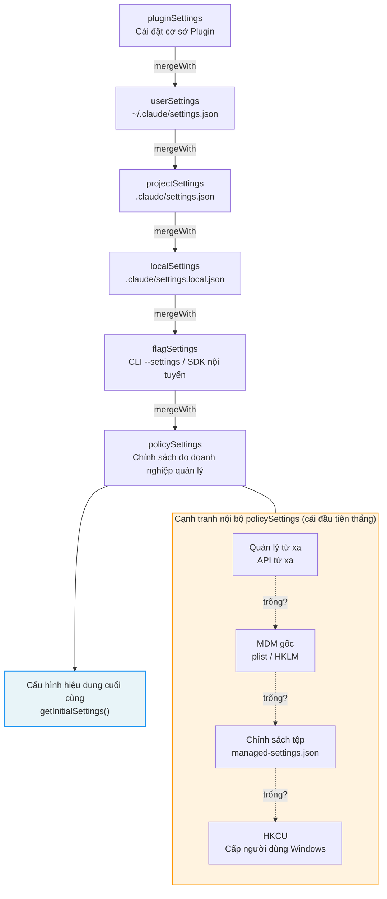

# Phụ lục B: Tài liệu tham khảo biến môi trường

Phụ lục này liệt kê các biến môi trường cấu hình được bởi người dùng chính trong Claude Code v2.1.88. Được nhóm theo miền chức năng, chỉ các biến ảnh hưởng đến hành vi có thể thấy được của người dùng mới được liệt kê; các biến đo lường từ xa nội bộ và phát hiện nền tảng được lược bỏ.

## Nén ngữ cảnh

| Biến | Tác dụng | Mặc định |
|----------|--------|---------|
| `CLAUDE_CODE_AUTO_COMPACT_WINDOW` | Ghi đè kích thước cửa sổ ngữ cảnh (token) | Mặc định của mô hình |
| `CLAUDE_AUTOCOMPACT_PCT_OVERRIDE` | Ghi đè ngưỡng tự động nén theo tỷ lệ phần trăm (0-100) | Giá trị được tính toán |
| `DISABLE_AUTO_COMPACT` | Vô hiệu hóa hoàn toàn tính năng tự động nén | `false` |

## Nỗ lực và Lập luận

| Biến | Tác dụng | Giá trị hợp lệ |
|----------|--------|-------------|
| `CLAUDE_CODE_EFFORT_LEVEL` | Ghi đè mức độ nỗ lực lập luận (effort level) | `low`, `medium`, `high`, `max`, `auto`, `unset` |
| `CLAUDE_CODE_DISABLE_FAST_MODE` | Vô hiệu hóa đầu ra tăng tốc của Chế độ nhanh (Fast Mode) | `true`/`false` |
| `DISABLE_INTERLEAVED_THINKING` | Vô hiệu hóa suy nghĩ mở rộng (extended thinking) | `true`/`false` |
| `MAX_THINKING_TOKENS` | Ghi đè giới hạn token lập luận | Mặc định của mô hình |

## Công cụ và Giới hạn đầu ra

| Biến | Tác dụng | Mặc định |
|----------|--------|---------|
| `BASH_MAX_OUTPUT_LENGTH` | Ký tự đầu ra tối đa cho lệnh Bash | 8.000 |
| `CLAUDE_CODE_GLOB_TIMEOUT_SECONDS` | Thời gian chờ tìm kiếm glob (giây) | Mặc định |

## Phân quyền và Bảo mật

| Biến | Tác dụng | Lưu ý |
|----------|--------|------|
| `CLAUDE_CODE_DUMP_AUTO_MODE` | Xuất các yêu cầu/phản hồi của bộ phân loại YOLO | Chỉ dùng để gỡ lỗi (Debug) |
| `CLAUDE_CODE_DISABLE_COMMAND_INJECTION_CHECK` | Vô hiệu hóa phát hiện tấn công chèn lệnh Bash | Làm giảm mức độ bảo mật |

## API và Xác thực

| Biến | Tác dụng | Mức độ bảo mật |
|----------|--------|---------------|
| `ANTHROPIC_API_KEY` | Khóa xác thực API Anthropic | Thông tin xác thực (Credential) |
| `ANTHROPIC_BASE_URL` | Điểm cuối API tùy chỉnh (hỗ trợ proxy) | Có thể điều hướng lại |
| `ANTHROPIC_MODEL` | Ghi đè mô hình mặc định | An toàn |
| `CLAUDE_CODE_USE_BEDROCK` | Định tuyến suy luận qua AWS Bedrock | An toàn |
| `CLAUDE_CODE_USE_VERTEX` | Định tuyến suy luận qua Google Vertex AI | An toàn |
| `CLAUDE_CODE_EXTRA_BODY` | Thêm các trường phụ vào yêu cầu API | Sử dụng nâng cao |
| `ANTHROPIC_CUSTOM_HEADERS` | Các tiêu đề yêu cầu HTTP tùy chỉnh | An toàn |

## Lựa chọn mô hình

| Biến | Tác dụng | Ví dụ |
|----------|--------|---------|
| `ANTHROPIC_DEFAULT_HAIKU_MODEL` | ID mô hình Haiku tùy chỉnh | Chuỗi định danh mô hình |
| `ANTHROPIC_DEFAULT_SONNET_MODEL` | ID mô hình Sonnet tùy chỉnh | Chuỗi định danh mô hình |
| `ANTHROPIC_DEFAULT_OPUS_MODEL` | ID mô hình Opus tùy chỉnh | Chuỗi định danh mô hình |
| `ANTHROPIC_SMALL_FAST_MODEL` | Mô hình suy luận nhanh (ví dụ: để tóm tắt) | Chuỗi định danh mô hình |
| `CLAUDE_CODE_SUBAGENT_MODEL` | Mô hình được sử dụng bởi các Agent con | Chuỗi định danh mô hình |

## Bộ nhớ đệm Prompt

| Biến | Tác dụng | Mặc định |
|----------|--------|---------|
| `CLAUDE_CODE_ENABLE_PROMPT_CACHING` | Kích hoạt bộ nhớ đệm prompt | `true` |
| `DISABLE_PROMPT_CACHING` | Vô hiệu hóa hoàn toàn bộ nhớ đệm prompt | `false` |

## Phiên làm việc và Gỡ lỗi

| Biến | Tác dụng | Mục đích |
|----------|--------|---------|
| `CLAUDE_CODE_DEBUG_LOG_LEVEL` | Mức độ chi tiết của log | `silent`/`error`/`warn`/`info`/`verbose` |
| `CLAUDE_CODE_PROFILE_STARTUP` | Kích hoạt phân tích hiệu năng khởi động (performance profiling) | Gỡ lỗi |
| `CLAUDE_CODE_PROFILE_QUERY` | Kích hoạt phân tích hiệu năng đường ống truy vấn (query pipeline) | Gỡ lỗi |
| `CLAUDE_CODE_JSONL_TRANSCRIPT` | Ghi chép lịch sử phiên dưới dạng JSONL | Đường dẫn tệp |
| `CLAUDE_CODE_TMPDIR` | Ghi đè thư mục tạm thời | Đường dẫn |

## Đầu ra và Định dạng

| Biến | Tác dụng | Mặc định |
|----------|--------|---------|
| `CLAUDE_CODE_SIMPLE` | Chế độ system prompt tối giản | `false` |
| `CLAUDE_CODE_DISABLE_TERMINAL_TITLE` | Vô hiệu hóa cài đặt tiêu đề dòng lệnh (terminal title) | `false` |
| `CLAUDE_CODE_NO_FLICKER` | Giảm nhấp nháy ở chế độ toàn màn hình | `false` |

## MCP (Giao thức ngữ cảnh mô hình)

| Biến | Tác dụng | Mặc định |
|----------|--------|---------|
| `MCP_TIMEOUT` | Thời gian chờ kết nối máy chủ MCP (ms) | 10.000 |
| `MCP_TOOL_TIMEOUT` | Thời gian chờ cuộc gọi công cụ MCP (ms) | 30.000 |
| `MAX_MCP_OUTPUT_TOKENS` | Giới hạn token đầu ra của công cụ MCP | Mặc định |

## Mạng và Proxy

| Biến | Tác dụng | Lưu ý |
|----------|--------|------|
| `HTTP_PROXY` / `HTTPS_PROXY` | Proxy HTTP/HTTPS | Có thể điều hướng lại |
| `NO_PROXY` | Danh sách máy chủ bỏ qua proxy | An toàn |
| `NODE_EXTRA_CA_CERTS` | Các chứng chỉ CA bổ sung | Ảnh hưởng đến độ tin cậy TLS |

## Đường dẫn và Cấu hình

| Biến | Tác dụng | Mặc định |
|----------|--------|---------|
| `CLAUDE_CONFIG_DIR` | Ghi đè thư mục cấu hình Claude | `~/.claude` |

---

## Nhật ký phát triển phiên bản: Các biến mới trong v2.1.91

| Biến | Tác dụng | Lưu ý |
|----------|--------|-------|
| `CLAUDE_CODE_AGENT_COST_STEER` | Điều hướng chi phí của Agent con | Kiểm soát mức tiêu thụ tài nguyên trong các tình huống đa Agent |
| `CLAUDE_CODE_RESUME_THRESHOLD_MINUTES` | Ngưỡng thời gian tiếp tục phiên | Kiểm soát cửa sổ thời gian để tiếp tục lại phiên làm việc |
| `CLAUDE_CODE_RESUME_TOKEN_THRESHOLD` | Ngưỡng token tiếp tục phiên | Kiểm soát ngân sách token để tiếp tục lại phiên làm việc |
| `CLAUDE_CODE_USE_ANTHROPIC_AWS` | Đường dẫn xác thực AWS | Bật xác thực hạ tầng AWS của Anthropic |
| `CLAUDE_CODE_SKIP_ANTHROPIC_AWS_AUTH` | Bỏ qua xác thực AWS | Đường dẫn dự phòng khi AWS không khả dụng |
| `CLAUDE_CODE_DISABLE_CLAUDE_API_SKILL` | Vô hiệu hóa kỹ năng API Claude | Kiểm soát kịch bản tuân thủ quy định của doanh nghiệp |
| `CLAUDE_CODE_PLUGIN_KEEP_MARKETPLACE_ON_FAILURE` | Khả năng chịu lỗi của chợ ứng dụng plugin | Giữ lại phiên bản lưu trong bộ nhớ đệm khi việc tải từ chợ ứng dụng thất bại |
| `CLAUDE_CODE_REMOTE_SETTINGS_PATH` | Ghi đè đường dẫn cài đặt từ xa | URL cài đặt tùy chỉnh cho triển khai doanh nghiệp |

### Các biến đã bị loại bỏ trong v2.1.91

| Biến | Tác dụng ban đầu | Lý do loại bỏ |
|----------|----------------|----------------|
| `CLAUDE_CODE_DISABLE_COMMAND_INJECTION_CHECK` | Vô hiệu hóa kiểm tra chèn lệnh | Hạ tầng Tree-sitter đã bị loại bỏ hoàn toàn |
| `CLAUDE_CODE_DISABLE_MOUSE_CLICKS` | Vô hiệu hóa nhấp chuột | Tính năng này đã bị phản đối (deprecated) |
| `CLAUDE_CODE_MCP_INSTR_DELTA` | Độ lệch hướng dẫn MCP | Tính năng đã được tái cấu trúc (refactored) |

---

## Hệ thống ưu tiên cấu hình

Biến môi trường chỉ là một khía cạnh trong hệ thống cấu hình của Claude Code. Hệ thống cấu hình hoàn chỉnh bao gồm 6 lớp nguồn, được hợp nhất từ mức ưu tiên thấp nhất đến cao nhất — các nguồn khai báo sau sẽ ghi đè các nguồn trước đó. Hiểu được chuỗi ưu tiên này là rất quan trọng để chẩn đoán lý do "tại sao cài đặt của tôi không có tác dụng."

### Mô hình ưu tiên 6 lớp

Các nguồn cấu hình được định nghĩa tại `restored-src/src/utils/settings/constants.ts:7-22`, và logic hợp nhất được hiện thực hóa trong hàm `loadSettingsFromDisk()` tại `restored-src/src/utils/settings/settings.ts:644-796`:

| Độ ưu tiên | ID nguồn | Đường dẫn tệp / Nguồn | Mô tả |
|----------|-----------|-------------------|-------------|
| 0 (thấp nhất) | `pluginSettings` | Cài đặt cơ sở do Plugin cung cấp | Chỉ bao gồm các trường trong danh sách trắng (ví dụ: agent), đóng vai trò làm lớp cơ sở cho tất cả các nguồn tệp |
| 1 | `userSettings` | `~/.claude/settings.json` | Cài đặt toàn cục của người dùng, áp dụng cho tất cả các dự án |
| 2 | `projectSettings` | `$PROJECT/.claude/settings.json` | Cài đặt chia sẻ của dự án, được commit vào hệ thống quản lý phiên bản |
| 3 | `localSettings` | `$PROJECT/.claude/settings.local.json` | Cài đặt cục bộ của dự án, được tự động thêm vào `.gitignore` |
| 4 | `flagSettings` | Tham số dòng lệnh `--settings` + cài đặt nội tuyến của SDK | Các giá trị ghi đè tạm thời được truyền qua dòng lệnh hoặc SDK |
| 5 (cao nhất) | `policySettings` | Các chính sách quản lý của doanh nghiệp (nhiều nguồn cạnh tranh) | Các chính sách do quản trị viên doanh nghiệp bắt buộc áp dụng, xem bên dưới |

### Ngữ nghĩa hợp nhất (Merge Semantics)

Việc hợp nhất sử dụng hàm `mergeWith` của lodash để thực hiện việc hợp nhất sâu (deep merge), với một bộ hợp nhất tùy chỉnh (custom merger) được định nghĩa tại `restored-src/src/utils/settings/settings.ts:538-547`:

- **Đối tượng (Objects)**: Được hợp nhất đệ quy, các trường ở nguồn sau sẽ ghi đè các trường ở nguồn trước
- **Mảng (Arrays)**: Được hợp nhất và loại bỏ trùng lặp (`mergeArrays`), chứ không bị thay thế — điều này có nghĩa là các quy tắc `permissions.allow` từ nhiều lớp sẽ tích lũy lại
- **Giá trị `undefined`**: Được thông dịch là "xóa khóa này" trong `updateSettingsForSource` (`restored-src/src/utils/settings/settings.ts:482-486`)

Ngữ nghĩa hợp nhất mảng này đặc biệt quan trọng: nếu người dùng cho phép một công cụ trong `userSettings` và cho phép một công cụ khác trong `projectSettings`, danh sách `permissions.allow` cuối cùng sẽ bao gồm cả hai. Điều này cho phép cấu hình phân quyền nhiều lớp có thể xếp chồng lên nhau thay vì ghi đè lẫn nhau.

### Sự cạnh tranh bốn lớp của Cài đặt chính sách (policySettings)

Cài đặt chính sách (`policySettings`) có chuỗi ưu tiên nội bộ riêng, sử dụng chiến lược "nguồn đầu tiên có nội dung sẽ thắng", được hiện thực hóa tại `restored-src/src/utils/settings/settings.ts:322-345`:

| Độ ưu tiên phụ | Nguồn | Mô tả |
|-------------|--------|-------------|
| 1 (cao nhất) | Cài đặt quản lý từ xa | Bộ nhớ đệm chính sách doanh nghiệp được đồng bộ hóa từ API |
| 2 | Chính sách MDM gốc (HKLM / macOS plist) | Các chính sách cấp hệ thống được đọc qua `plutil` hoặc `reg query` |
| 3 | Chính sách tệp (`managed-settings.json` + `managed-settings.d/*.json`) | Hỗ trợ thư mục thả vào trực tiếp (drop-in directory), được hợp nhất theo thứ tự chữ cái |
| 4 (thấp nhất) | Chính sách người dùng HKCU (chỉ trên Windows) | Cài đặt Registry cấp người dùng |

Lưu ý rằng cài đặt chính sách được hợp nhất khác với các nguồn khác: bốn nguồn phụ bên trong chính sách nằm trong quan hệ cạnh tranh (cái đầu tiên thắng), while chính sách nói chung nằm trong quan hệ bổ sung với các nguồn khác (hợp nhất sâu lên đầu chuỗi cấu hình).

### Sơ đồ luồng chuỗi ghi đè

**Hình B-1: Chuỗi ghi đè độ ưu tiên cấu hình**

### Bộ nhớ đệm và Vô hiệu hóa bộ nhớ đệm

Việc tải cấu hình có cơ chế lưu bộ nhớ đệm hai lớp (`restored-src/src/utils/settings/settingsCache.ts`):

1. **Bộ nhớ đệm cấp tệp**: Hàm `parseSettingsFile()` lưu kết quả đã phân tích của từng tệp vào cache, tránh việc phân tích JSON lặp đi lặp lại
2. **Bộ nhớ đệm cấp phiên làm việc**: Hàm `getSettingsWithErrors()` lưu kết quả hợp nhất cuối cùng vào cache, được tái sử dụng trong suốt phiên làm việc

Các cache này được vô hiệu hóa một cách thống nhất thông qua hàm `resetSettingsCache()` — được kích hoạt khi người dùng sửa đổi cấu hình qua lệnh `/config` hoặc hàm `updateSettingsForSource()`. Việc phát hiện thay đổi tệp cấu hình được xử lý bởi `restored-src/src/utils/settings/changeDetector.ts`, từ đó kích hoạt kết xuất lại (re-rendering) component React thông qua cơ chế theo dõi hệ thống tệp (file system watching).

### Đề xuất chẩn đoán

Khi một cài đặt "không có tác dụng," hãy khắc phục sự cố theo thứ tự sau:

1. **Xác nhận nguồn**: Sử dụng lệnh `/config` để xem cấu hình hiệu dụng hiện tại và các chú thích về nguồn cấu hình
2. **Kiểm tra độ ưu tiên**: Có nguồn nào có độ ưu tiên cao hơn đang ghi đè cài đặt của bạn không? `policySettings` là nguồn ghi đè mạnh nhất
3. **Kiểm tra hợp nhất mảng**: Các quy tắc phân quyền mang tính tích lũy — nếu một quy tắc từ chối (`deny`) xuất hiện ở một nguồn có độ ưu tiên cao hơn, một quy tắc cho phép (`allow`) ở độ ưu tiên thấp hơn không thể ghi đè nó
4. **Kiểm tra bộ nhớ đệm**: Sau khi sửa đổi các tệp `.json` trong cùng một phiên làm việc, cấu hình có thể vẫn được lưu trong cache — hãy khởi động lại phiên làm việc hoặc sử dụng `/config` để kích hoạt làm mới
