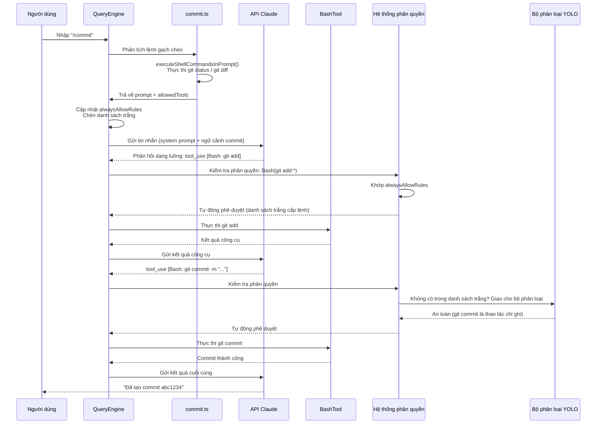
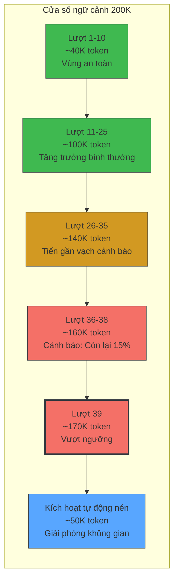
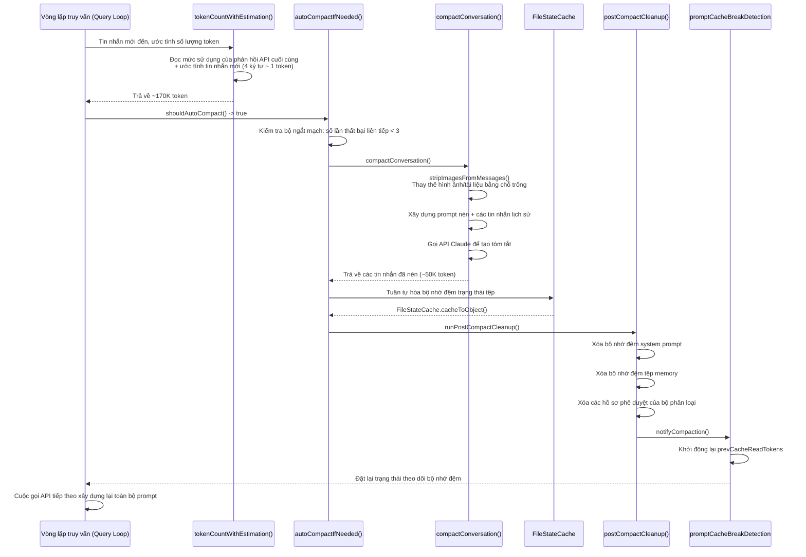
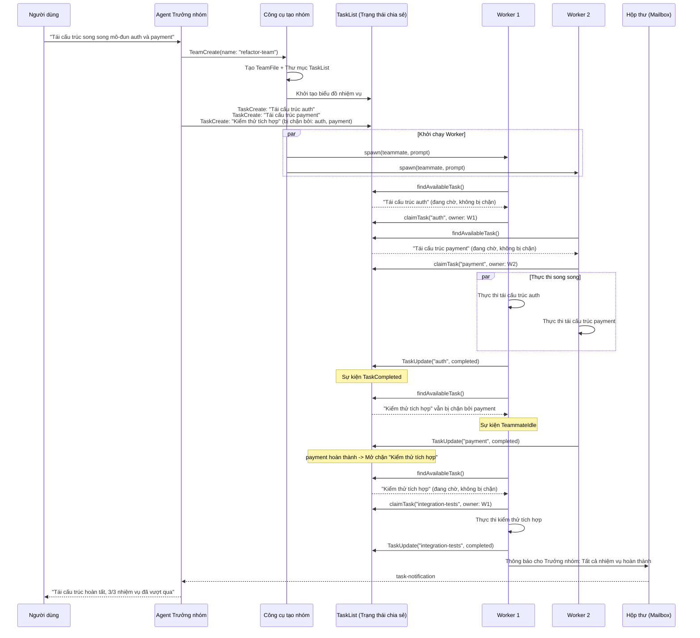

# Phụ lục F: Dấu vết trường hợp thực tế đầu-cuối

> Phụ lục này kết nối các phân tích của tất cả các chương thông qua ba dấu vết (traces) hoàn chỉnh về vòng đời yêu cầu. Mỗi trường hợp bắt đầu từ đầu vào của người dùng, đi qua nhiều phân hệ và kết thúc ở đầu ra cuối cùng. Khi đọc các trường hợp này, chúng tôi khuyên bạn nên tham chiếu chéo đến các chương được trích dẫn để hiểu sâu hơn về cơ chế nội bộ của từng giai đoạn.

---

## Trường hợp 1: Hành trình hoàn chỉnh của lệnh `/commit`

> Các chương liên quan: Chương 3 (Vòng lặp Agent) -> Chương 5 (System Prompt) -> Chương 4 (Điều phối công cụ) -> Chương 16 (Hệ thống phân quyền) -> Chương 17 (Bộ phân loại YOLO) -> Chương 13 (Tỷ lệ khớp bộ nhớ đệm)

### Kịch bản

Người dùng nhập lệnh `/commit` trong một kho lưu trữ git. Claude Code cần: kiểm tra trạng thái không gian làm việc, tạo thông điệp commit, thực thi git commit — tự động phê duyệt các lệnh git nằm trong danh sách trắng xuyên suốt quá trình.

### Luồng yêu cầu



### Chi tiết tương tác phân hệ

**Giai đoạn 1: Phân tích lệnh (Chương 3)**

Sau khi người dùng nhập lệnh `/commit`, `QueryEngine.processUserInput()` nhận diện tiền tố lệnh gạch chéo và tra cứu định nghĩa lệnh commit từ trình đăng ký lệnh (`restored-src/src/commands/commit.ts:6-82`). Định nghĩa lệnh chứa hai trường chính:

- `allowedTools`: `['Bash(git add:*)', 'Bash(git status:*)', 'Bash(git commit:*)']` — giới hạn mô hình chỉ được gọi ba loại lệnh git này
- `getPromptContent()`: Trước khi gửi đến API, thực thi cục bộ lệnh `git status` và `git diff HEAD` thông qua hàm `executeShellCommandsInPrompt()`, nhúng trạng thái thực tế của kho lưu trữ vào prompt

Điều này có nghĩa là mô hình không nhận được một hướng dẫn mơ hồ kiểu như "vui lòng giúp tôi commit", mà là một ngữ cảnh hoàn chỉnh bao gồm cả những thay đổi hiện tại (diff).

**Giai đoạn 2: Chèn phân quyền (Chương 16)**

Trước khi gọi API, `QueryEngine` ghi `allowedTools` vào `AppState.toolPermissionContext.alwaysAllowRules.command` (`restored-src/src/QueryEngine.ts:477-486`). Tác dụng: trong lượt hội thoại này, tất cả các cuộc gọi công cụ khớp với mẫu `Bash(git add:*)` đều được tự động phê duyệt mà không cần người dùng xác nhận.

**Giai đoạn 3: Cuộc gọi API và Bộ nhớ đệm (Chương 5, Chương 13)**

System prompt được chia thành nhiều khối với các nhãn đánh dấu `cache_control` trong quá trình gọi API (`restored-src/src/utils/api.ts:72-84`). Nếu người dùng đã thực thi các lệnh khác trước đó, phần tiền tố của system prompt (định nghĩa công cụ, quy tắc cơ bản) có thể khớp với bộ nhớ đệm prompt, và chỉ phần ngữ cảnh mới được chèn bởi `/commit` mới cần được xử lý lại.

**Giai đoạn 4: Thực thi công cụ và Phân loại (Chương 4, Chương 17)**

Sau khi mô hình trả về các khối `tool_use`, hệ thống phân quyền sẽ kiểm tra theo thứ tự ưu tiên:

1. Đầu tiên kiểm tra `alwaysAllowRules` — `git add` và `git status` khớp trực tiếp với danh sách cho phép (whitelist)
2. Đối với `git commit`, nếu không có trong danh sách cho phép, hệ thống sẽ giao cho bộ phân loại YOLO (`restored-src/src/utils/permissions/yoloClassifier.ts:54-68`) để đánh giá độ an toàn
3. `BashTool` thực thi lệnh thực tế, thực hiện phân tích cú pháp lệnh ở cấp độ AST thông qua `bashPermissions.ts`

**Giai đoạn 5: Tính toán ghi nhận tác giả**

Sau khi quá trình commit hoàn tất, tệp `commitAttribution.ts` (`restored-src/src/utils/commitAttribution.ts:548-743`) tính toán tỷ lệ đóng góp ký tự của Claude để quyết định xem có thêm chữ ký `Co-Authored-By` vào thông điệp commit hay không.

### Trường hợp này chứng minh điều gì

Đằng sau một lệnh `/commit` đơn giản, ít nhất 6 phân hệ cùng phối hợp hoạt động: hệ thống lệnh cung cấp việc chèn ngữ cảnh, hệ thống phân quyền tự động phê duyệt danh sách cho phép, bộ phân loại YOLO thực hiện đánh giá dự phòng, BashTool thực thi các lệnh thực tế, bộ nhớ đệm prompt giúp giảm tính toán dư thừa, và mô-đun ghi nhận đóng vai trò xác định tác giả. Đây chính là cốt lõi của kỹ nghệ dây cương — mỗi phân hệ hoàn thành tốt vai trò của mình, phối hợp nhịp nhàng thông qua chu kỳ thống nhất của Vòng lặp Agent.

---

## Trường hợp 2: Cuộc hội thoại dài kích hoạt tự động nén

> Các chương liên quan: Chương 9 (Tự động nén) -> Chương 10 (Bảo toàn trạng thái tệp) -> Chương 11 (Vi nén) -> Chương 12 (Ngân sách Token) -> Chương 13 (Kiến trúc bộ nhớ đệm) -> Chương 26 (Nguyên lý quản lý ngữ cảnh)

### Kịch bản

Người dùng đang thực hiện một cuộc hội thoại tái cấu trúc kéo dài trong một cơ sở mã nguồn lớn. Sau khoảng 40 lượt tương tác, cửa sổ ngữ cảnh tiến gần đến giới hạn 200K token, kích hoạt quá trình tự động nén (auto-compaction).

### Dòng thời gian tiêu thụ Token



### Các ngưỡng quan trọng

| Ngưỡng | Cách tính toán | Giá trị ước tính | Mục đích |
|-----------|------------|---------------|---------|
| Cửa sổ ngữ cảnh | `MODEL_CONTEXT_WINDOW_DEFAULT` | 200.000 | Đầu vào tối đa của mô hình |
| Cửa sổ hiệu dụng | Cửa sổ ngữ cảnh - max_output_tokens | ~180.000 | Dành riêng không gian cho đầu ra |
| Ngưỡng nén | Cửa sổ hiệu dụng - 13K buffer | ~167.000 | Kích hoạt tự động nén |
| Ngưỡng cảnh báo | Cửa sổ hiệu dụng - 20K | ~160.000 | Ghi cảnh báo vào log |
| Ngưỡng chặn | Cửa sổ hiệu dụng - 3K | ~177.000 | Bắt buộc thực thi lệnh /compact |

Nguồn: `restored-src/src/services/compact/autoCompact.ts:28-91`, `restored-src/src/utils/context.ts:8-9`

### Luồng thực thi nén



### Chi tiết tương tác phân hệ

**Giai đoạn 1: Đếm Token (Chương 12)**

Sau mỗi cuộc gọi API, hàm `tokenCountWithEstimation()` (`restored-src/src/utils/tokens.ts:226-261`) đọc dữ liệu `input_tokens + cache_creation_input_tokens + cache_read_input_tokens` từ phản hồi cuối cùng, sau đó cộng thêm các giá trị ước tính cho các tin nhắn được thêm vào sau đó (4 ký tự tương đương với khoảng 1 token). Hàm này là nền tảng dữ liệu cho tất cả các quyết định quản lý ngữ cảnh.

**Giai đoạn 2: Đánh giá ngưỡng (Chương 9)**

Hàm `shouldAutoCompact()` (`restored-src/src/services/compact/autoCompact.ts:225-226`) so sánh số lượng token với ngưỡng nén (~167K). Sau khi vượt quá ngưỡng, nó cũng kiểm tra bộ ngắt mạch — nếu quá trình nén thất bại 3 lần liên tiếp, nó sẽ ngừng thử lại (dòng 260-265). Đây là một hiện thực hóa cụ thể cho nguyên lý "ngắt mạch vòng lặp vô tận" được nêu trong Chương 26.

**Giai đoạn 3: Thực thi nén (Chương 9)**

Hàm `compactConversation()` (`restored-src/src/services/compact/compact.ts:122-200`) thực hiện việc nén thực tế:

1. Loại bỏ nội dung hình ảnh và tài liệu, thay thế bằng các trình giữ chỗ (placeholders) `[image]` / `[document]`
2. Xây dựng prompt nén và gửi toàn bộ lịch sử tin nhắn tới Claude để tạo tóm tắt
3. Trả về mảng tin nhắn đã nén (từ khoảng 400 tin nhắn giảm xuống còn khoảng 80 tin nhắn)

**Giai đoạn 4: Bảo toàn trạng thái tệp (Chương 10)**

Trước khi nén, `FileStateCache` (`restored-src/src/utils/fileStateCache.ts:30-143`) tuần tự hóa tất cả các đường dẫn tệp, nội dung và dấu thời gian đã lưu cache. Dữ liệu này được chèn dưới dạng tệp đính kèm vào các tin nhắn sau nén, đảm bảo mô hình vẫn "nhớ" những tệp nào đã được đọc và chỉnh sửa sau khi nén ngữ cảnh. Bộ nhớ đệm sử dụng chiến lược giải phóng phần tử ít sử dụng gần nhất (LRU - Least Recently Used) với giới hạn 100 phần tử và tổng dung lượng 25MB.

**Giai đoạn 5: Vô hiệu hóa bộ nhớ đệm (Chương 13)**

Sau khi quá trình nén hoàn tất, hàm `runPostCompactCleanup()` (`restored-src/src/services/compact/postCompactCleanup.ts:31-77`) thực hiện việc dọn dẹp toàn diện:

- Xóa bộ nhớ đệm system prompt (`getUserContext.cache.clear()`)
- Xóa bộ nhớ đệm tệp memory
- Xóa các hồ sơ phê duyệt của bộ phân loại YOLO
- Thông báo cho mô-đun theo dõi cache để đặt lại trạng thái (`notifyCompaction()`)

Điều này có nghĩa là cuộc gọi API đầu tiên sau khi nén bắt buộc phải xây dựng lại toàn bộ system prompt — bộ nhớ đệm prompt sẽ hoàn toàn bị trượt cache (cache miss). Đây là chi phí ẩn của quá trình nén: bạn tiết kiệm được không gian ngữ cảnh, nhưng phải trả giá bằng việc xây dựng lại toàn bộ cache.

### Trường hợp này chứng minh điều gì

Tự động nén không phải là một tính năng cô lập, mà là sự phối hợp của năm phân hệ: đếm token, đánh giá ngưỡng, tạo tóm tắt, bảo toàn trạng thái tệp và vô hiệu hóa cache. Nó thể hiện nguyên tắc cốt lõi trong Chương 26: **quản lý ngữ cảnh là một năng lực cốt lõi của Agent, chứ không phải là một tính năng bổ sung**. Mỗi bước thực hiện đều là một sự đánh đổi chính xác giữa việc "giữ lại đủ thông tin" và "giải phóng đủ không gian".

---

## Trường hợp 3: Thực thi cộng tác đa Agent

> Các chương liên quan: Chương 20 (Khởi tạo Agent) -> Chương 20b (Nhân điều phối Teams) -> Chương 5 (Các biến thể System Prompt) -> Chương 25 (Nguyên lý kỹ nghệ dây cương)

### Kịch bản

Người dùng yêu cầu Claude Code tái cấu trúc song song nhiều mô-đun. Agent chính tạo ra một nhóm (Team), giao nhiệm vụ cho các Agent con (sub-Agent), và các Agent con tự động nhận và hoàn thành các nhiệm vụ thông qua danh sách nhiệm vụ TaskList.

### Chuỗi giao tiếp Agent



### Chi tiết tương tác phân hệ

**Giai đoạn 1: Tạo nhóm (Chương 20, Chương 20b)**

Công cụ `TeamCreateTool` (`restored-src/src/tools/AgentTool/AgentTool.tsx`) thực hiện hai việc: tạo cấu hình `TeamFile` và khởi tạo thư mục `TaskList` tương ứng. Như đã phân tích trong Chương 20b: **Team = TaskList** — đội ngũ và bảng nhiệm vụ là hai góc nhìn của cùng một đối tượng lúc chạy.

Backend vật lý của Worker được xác định bởi hàm `detectAndGetBackend()` (`restored-src/src/utils/swarm/backends/`):

| Backend | Mô hình tiến trình | Điều kiện nhận diện |
|---------|--------------|-------------------|
| Tmux | Tiến trình CLI độc lập | Backend mặc định (Linux/macOS) |
| iTerm2 | Tiến trình CLI độc lập | macOS + iTerm2 |
| Trong tiến trình (In-Process) | Cô lập bằng AsyncLocalStorage | Không có tmux/iTerm2 |

**Giai đoạn 2: Xây dựng biểu đồ nhiệm vụ (Chương 20b)**

Các nhiệm vụ do Trưởng nhóm tạo ra không phải là một danh sách việc cần làm (Todo list) đơn giản, mà là một biểu đồ có hướng không chu trình (DAG - Directed Acyclic Graph) với các mối quan hệ phụ thuộc `blocks`/`blockedBy` (`restored-src/src/utils/tasks.ts`):

```typescript
// restored-src/src/utils/tasks.ts
{
  id: "auth",
  status: "pending",
  blocks: ["integration-test"],
  blockedBy: [],
}
{
  id: "integration-test",
  status: "pending",
  blocks: [],
  blockedBy: ["auth", "payment"],
}
```

Thiết kế này cho phép Trưởng nhóm khai báo tất cả các nhiệm vụ và sự phụ thuộc của chúng cùng một lúc, giao việc xác định "khi nào có thể chạy song song" cho môi trường runtime.

**Giai đoạn 3: Tự động nhận nhiệm vụ (Chương 20b)**

Hàm `findAvailableTask()` trong `useTaskListWatcher.ts` chính là bộ lập lịch tối giản của Swarm:

1. Lọc các nhiệm vụ có `status === 'pending'` và trống trường `owner`
2. Kiểm tra xem tất cả các nhiệm vụ trong mảng `blockedBy` đã hoàn thành hay chưa
3. Sau khi tìm thấy, gọi hàm `claimTask()` để nhận quyền sở hữu một cách nguyên tử (atomic)

Điều này hiện thực hóa một trong những nguyên lý cốt lõi của Chương 25: **tách biệt lập lịch khỏi lập luận** — mô hình không cần phải phán đoán sự phụ thuộc của nhiệm vụ bằng ngôn ngữ tự nhiên; môi trường runtime đã thu hẹp các ứng viên thành một nhiệm vụ rõ ràng duy nhất.

**Giai đoạn 4: Cô lập ngữ cảnh (Chương 20)**

Mỗi Worker chạy trong tiến trình (In-Process) duy trì ngữ cảnh độc lập thông qua `AsyncLocalStorage` (`restored-src/src/utils/teammateContext.ts:41-64`):

```typescript
// restored-src/src/utils/teammateContext.ts:41
const teammateStorage = new AsyncLocalStorage<TeammateContext>();
```

Đối tượng `TeammateContext` bao gồm các trường như `agentId`, `agentName`, `teamName`, và `parentSessionId`. Điều này đảm bảo rằng nhiều Agent chạy trong cùng một tiến trình không làm ô nhiễm trạng thái của nhau.

**Giai đoạn 5: Bề mặt sự kiện (Chương 20b)**

Sau khi một Worker hoàn thành một nhiệm vụ, hai kiểu sự kiện sẽ được kích hoạt (`restored-src/src/query/stopHooks.ts`):

- `TaskCompleted`: Đánh dấu nhiệm vụ đã hoàn tất, có khả năng mở chặn các nhiệm vụ khác
- `TeammateIdle`: Worker đi vào trạng thái rảnh rỗi, quay trở lại TaskList để tìm kiếm các nhiệm vụ mới

Điều này làm cho Teams trở thành một mô hình lai ghép Kéo + Đẩy (pull + push) — các Worker rảnh rỗi sẽ chủ động kéo (pull) nhiệm vụ, trong khi các sự kiện hoàn thành nhiệm vụ sẽ đẩy (push) thông tin tới Trưởng nhóm.

**Giai đoạn 6: Giao tiếp (Chương 20b)**

Các Worker không trực tiếp nói chuyện với nhau. Mọi sự cộng tác đều chạy qua hai kênh:

- **TaskList** (trạng thái hệ thống tệp chia sẻ): `~/.claude/tasks/{team-name}/`
- **Hộp thư (Mailbox)** (hàng đợi tin nhắn bền vững): `~/.claude/teams/{team}/inboxes/*.json`

Khi các tin nhắn `task-notification` được chèn vào luồng tin nhắn của Trưởng nhóm, prompt yêu cầu rõ ràng phải phân biệt chúng bằng thẻ `<task-notification>` (chứ không phải đầu vào từ người dùng).

### Trường hợp này chứng minh điều gì

Cốt lõi của sự cộng tác đa Agent không phải là "để các Agent trò chuyện với nhau", mà là **biểu đồ nhiệm vụ chia sẻ + việc nhận nhiệm vụ nguyên tử + các sự kiện kết thúc lượt** tạo thành nhân cộng tác. Swarm của Claude Code thực chất là một bộ lập lịch phân tán: Trưởng nhóm khai báo các mối quan hệ phụ thuộc của nhiệm vụ, các Worker tự động nhận nhiệm vụ, và môi trường runtime quản lý các xung đột đồng thời. Đây chính là biểu hiện trực tiếp của nguyên lý trong Chương 25: "đầu tiên hãy khách quan hóa trạng thái cộng tác bên ngoài, sau đó để các đơn vị thực thi khác nhau cộng tác xung quanh nó."
