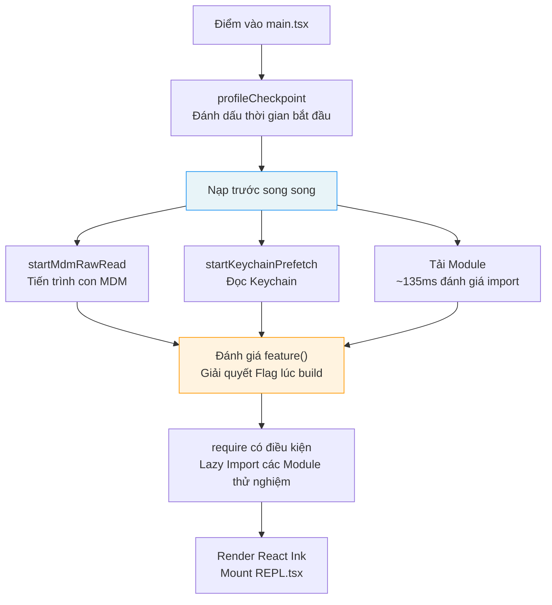
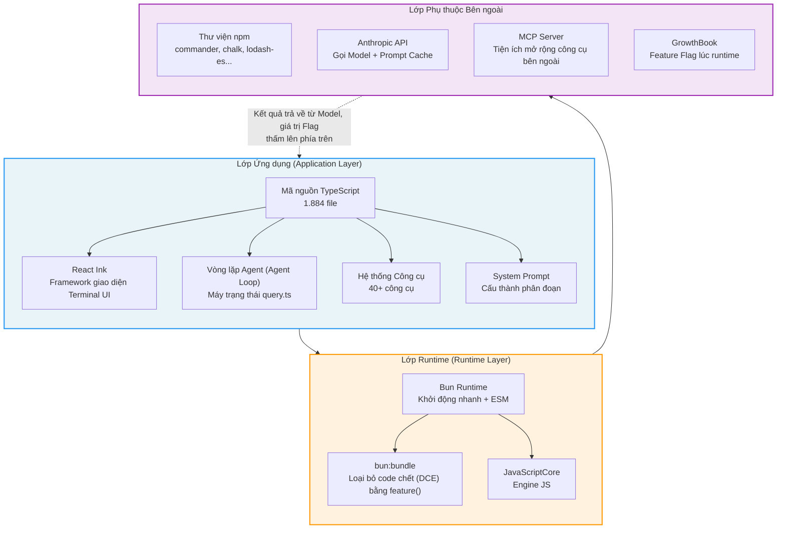

# Chương 1: Toàn bộ Tech Stack của một AI Coding Agent

> **Định vị**: Chương này phân tích tech stack (ngăn xếp công nghệ) hoàn chỉnh của Claude Code — Bun runtime, giao diện người dùng dòng lệnh React Ink (React Ink terminal UI), hệ thống kiểu TypeScript (TypeScript type system) — và cách Kiến trúc Ba Lớp (Three-Layer Architecture) được triển khai cụ thể trên các lựa chọn công nghệ này. Điều kiện tiên quyết: không có, có thể đọc độc lập. Đối tượng độc giả: những người lần đầu tiếp cận kiến trúc của CC, hoặc các lập trình viên muốn hiểu lý do lựa chọn công nghệ Bun + React Ink + TypeScript.

## Tại sao điều này lại quan trọng

Để hiểu cách một AI coding agent đi từ việc "nhận đầu vào của người dùng" đến "thực hiện các hành động trong codebase", trước tiên bạn cần hiểu tech stack của nó. Tech stack không chỉ quyết định trần hiệu năng của hệ thống — nó còn xác định các ranh giới kiến trúc: những gì có thể thực hiện lúc biên dịch (compile time), những gì phải hoãn lại đến lúc chạy (runtime), và những gì cần chính mô hình quyết định.

Lựa chọn tech stack của Claude Code tiết lộ một triết lý cốt lõi: **Một AI coding agent không phải là một công cụ CLI truyền thống — nó là một hệ thống chạy "trên phân phối" (on distribution), nơi mô hình không chỉ sử dụng các công cụ mà còn có thể tự viết các công cụ của riêng mình**. Điều này có nghĩa là toàn bộ tech stack phải được thiết kế với tư duy xem "mô hình là một công dân hạng nhất" (model as a first-class citizen), từ các tối ưu hóa khởi động tại điểm vào (entry point) cho đến việc loại bỏ Feature Flag lúc build — mọi lớp đều phục vụ mục tiêu này.

Chương này thiết lập một khái niệm cốt lõi xuyên suốt toàn bộ cuốn sách — **Kiến trúc Ba Lớp** — và chứng minh qua phân tích mã nguồn cách nó được triển khai cụ thể trong Claude Code v2.1.88. Nếu bạn đang xây dựng Agent của riêng mình, mô hình kiến trúc và các chiến lược tối ưu hóa khởi động trong chương này có thể được áp dụng trực tiếp; nếu bạn chỉ muốn hiểu tại sao Claude Code hoạt động theo cách hiện tại, Kiến trúc Ba Lớp là khung tham chiếu cơ bản nhất trong cuốn sách này.

---

## Phân tích mã nguồn

### 1.1 Tổng quan về Tech Stack: TypeScript + React Ink + Bun

Các lựa chọn công nghệ của Claude Code có thể được tóm tắt trong một câu: **TypeScript để đảm bảo an toàn kiểu (type safety), React Ink cho khả năng xây dựng giao diện terminal theo component, và Bun cho tốc độ khởi động cùng tối ưu hóa lúc build**.

#### TypeScript: Ngôn ngữ lớp ứng dụng (Application-Layer Language)

Toàn bộ codebase bao gồm 1.884 file nguồn TypeScript. Hệ thống kiểu của TypeScript có một lợi thế độc nhất trong phát triển AI Agent: các schema đầu vào/đầu ra của công cụ có thể được tạo trực tiếp từ các định nghĩa kiểu dữ liệu, và các schema này sẽ trở thành JSON Schema gửi tới mô hình — giúp hợp nhất định nghĩa kiểu, kiểm tra tính hợp lệ lúc runtime (runtime validation) và hướng dẫn mô hình thành một thể thống nhất.

#### React Ink: Framework giao diện Terminal UI

Giao diện tương tác của Claude Code không phải là REPL readline truyền thống mà là một ứng dụng React hoàn chỉnh. React Ink mang mô hình component của React lên terminal, cho phép quản lý trạng thái UI phức tạp (luồng dữ liệu đầu ra dạng stream, hiển thị song song nhiều công cụ, hộp thoại cấp quyền) một cách khai báo (declaratively). Component UI chính nằm ở `restored-src/src/screens/REPL.tsx`, bản thân nó là một component React dài hơn 5.000 dòng.

#### Bun: Runtime và Công cụ Build

Bun đóng vai trò kép ở đây:

1. **Runtime**: Tốc độ khởi động nhanh hơn Node.js, điều cực kỳ quan trọng đối với các công cụ CLI — người dùng mong muốn phản hồi ngay lập tức sau khi gõ `claude`.
2. **Công cụ Build**: Thông qua hàm `feature()` được cung cấp bởi `bun:bundle`, nó cho phép Loại bỏ code chết (Dead Code Elimination - DCE) tại thời điểm build, vốn là nền tảng của toàn bộ hệ thống Feature Flag.

---

### 1.2 Phân tích điểm vào (Entry Point): Điều phối khởi động trong `main.tsx`

`main.tsx` là điểm vào của toàn bộ ứng dụng. 20 dòng code đầu tiên của nó thể hiện một chiến lược tối ưu hóa khởi động được thiết kế cực kỳ cẩn thận.

#### Nạp trước song song (Parallel Prefetch)

```typescript
// restored-src/src/main.tsx:9-20 (ESLint comments and blank lines omitted)
import { profileCheckpoint, profileReport } from './utils/startupProfiler.js';
profileCheckpoint('main_tsx_entry');

import { startMdmRawRead } from './utils/settings/mdm/rawRead.js';
startMdmRawRead();

import { ensureKeychainPrefetchCompleted, startKeychainPrefetch }
  from './utils/secureStorage/keychainPrefetch.js';
startKeychainPrefetch();
```

Lưu ý cách tổ chức code: mỗi `import` được theo sau ngay lập tức bởi một lệnh gọi tạo hiệu ứng phụ (side-effect). Các bình luận nguồn (`restored-src/src/main.tsx:1-8`) giải thích rõ ràng ý đồ thiết kế:

1. **`profileCheckpoint`**: Đánh dấu mốc thời gian (timestamp) điểm vào trước khi quá trình đánh giá (evaluation) các module nặng ký bắt đầu.
2. **`startMdmRawRead`**: Tạo một tiến trình con MDM (Mobile Device Management) (dùng `plutil` trên macOS / `reg query` trên Windows), cho phép nó chạy song song với khoảng ~135ms đánh giá các lệnh import tiếp theo.
3. **`startKeychainPrefetch`**: Khởi chạy song song hai thao tác đọc macOS Keychain (OAuth token và API key cũ) — nếu không nạp trước, `isRemoteManagedSettingsEligible()` sẽ đọc chúng một cách tuần tự thông qua lệnh spawn đồng bộ, làm tăng thêm ~65ms cho mỗi lần khởi động.

Ba thao tác này đều tuân theo cùng một khuôn mẫu (pattern): **đẩy các thao tác I/O nặng vào khoảng "thời gian chết" trong quá trình tải module để chạy song song**. Đây không phải là một tối ưu hóa tình cờ — comment ESLint `// eslint-disable-next-line custom-rules/no-top-level-side-effects` cho thấy đội ngũ phát triển có một quy tắc tùy chỉnh cấm các hiệu ứng phụ ở cấp cao nhất (top-level side effects); đây là một ngoại lệ được cân nhắc kỹ lưỡng.

**Chế độ xử lý khi lỗi (Failure mode)**: Các thao tác nạp trước này đều dựa trên nỗ lực tối đa (best effort). Nếu quyền truy cập Keychain bị từ chối (người dùng chưa cấp quyền), `ensureKeychainPrefetchCompleted()` sẽ trả về null và ứng dụng sẽ chuyển sang yêu cầu nhập thông tin xác thực tương tác. Nếu tiến trình con MDM bị timeout, các lệnh gọi `plutil` tiếp theo sẽ thử lại một cách đồng bộ. Thiết kế "song song lạc quan + dự phòng bi quan" này đảm bảo rằng các lỗi nạp trước không bao giờ làm nghẽn quá trình khởi động.

#### Nạp lười (Lazy Import)

Sau khi nạp trước song song, `main.tsx` thể hiện chiến lược tối ưu hóa khởi động thứ hai — lazy import có điều kiện:

```typescript
// restored-src/src/main.tsx:70-80 (helper functions and ESLint comments omitted)
const getTeammateUtils = () =>
  require('./utils/teammate.js') as typeof import('./utils/teammate.js');
// ...

const coordinatorModeModule = feature('COORDINATOR_MODE')
  ? require('./coordinator/coordinatorMode.js') as ...
  : null;

const assistantModule = feature('KAIROS')
  ? require('./assistant/index.js') as ...
  : null;
```

Có hai chiến lược nạp lười khác nhau ở đây:

- **`require` được bọc trong hàm** (như `getTeammateUtils`): Được sử dụng để phá vỡ các phụ thuộc vòng (circular dependencies) (`teammate.ts -> AppState.tsx -> ... -> main.tsx`), chỉ phân giải (resolve) module khi được gọi.
- **`require` được bảo vệ bởi Feature Flag** (như `coordinatorModeModule`): Sử dụng hàm `feature()` của Bun để loại bỏ tại thời điểm build — khi `COORDINATOR_MODE` là `false`, toàn bộ biểu thức `require` và cây module được import của nó sẽ bị loại bỏ khỏi kết quả build.

#### Tổng quan luồng khởi động



**Hình 1-1: Luồng khởi động main.tsx**

#### Feature Flag làm rào chắn

Bắt đầu từ dòng 21, hàm `feature('...')` xuất hiện xuyên suốt file điểm vào:

```typescript
// restored-src/src/main.tsx:21
import { feature } from 'bun:bundle';
```

Hàm `feature()` từ `bun:bundle` này là chìa khóa để hiểu toàn bộ hệ thống Feature Flag. Nó không phải là một điều kiện lúc runtime — nó là một **hằng số lúc biên dịch (compile-time constant)**. Khi trình đóng gói (bundler) của Bun xử lý `feature('X')`, nó sẽ thay thế nó bằng một giá trị literal `true` hoặc `false` dựa trên cấu hình build, và cơ chế loại bỏ code chết của engine JavaScript sẽ xóa bỏ các nhánh không thể tiếp cận (unreachable branches).

> **Lưu ý**: `feature()` của `bun:bundle` không phải là một API Bun được tài liệu hóa công khai mà là một cơ chế biên dịch có điều kiện tùy chỉnh trong quy trình build của Anthropic. Điều này nghĩa là bản build của Claude Code bị ràng buộc chặt chẽ với một phiên bản Bun cụ thể.

---

### 1.3 Kiến trúc Ba Lớp

Kiến trúc của Claude Code có thể được chia thành ba lớp, mỗi lớp có trách nhiệm được xác định rõ ràng. Mô hình kiến trúc này sẽ được tham chiếu lặp đi lặp lại trong các chương sau — Vòng lặp Agent của Chương 3 chạy trong Lớp Ứng dụng, điều phối thực thi công cụ của Chương 4 trải rộng trên Lớp Ứng dụng và Lớp Runtime, và các tối ưu hóa bộ nhớ đệm của các Chương 13-15 liên quan đến sự cộng tác trên cả ba lớp.



**Hình 1-2: Kiến trúc Ba Lớp của Claude Code**

#### Lớp Ứng dụng (TypeScript)

Lớp Ứng dụng là nơi chứa toàn bộ logic nghiệp vụ (business logic). Nó bao gồm:

- **Vòng lặp Agent** (`query.ts`): Máy trạng thái cốt lõi điều phối vòng lặp "gọi model -> thực thi công cụ -> quyết định tiếp tục" (xem Chương 3).
- **Hệ thống Công cụ** (`tools.ts` + thư mục `tools/`): Đăng ký, kiểm tra quyền hạn và thực thi hơn 40 công cụ (xem Chương 2).
- **System Prompt** (`constants/prompts.ts`): Kiến trúc prompt cấu thành phân đoạn (see Chapter 5).
- **Giao diện React Ink** (`screens/REPL.tsx`): Khai báo hiển thị của giao diện terminal.

#### Lớp Runtime (Bun/JSC)

Lớp Runtime cung cấp ba khả năng chính:

1. **Khởi động nhanh**: Tốc độ khởi động của Bun là tối quan trọng đối với trải nghiệm công cụ CLI.
2. **Tối ưu hóa lúc build**: Hàm `feature()` của `bun:bundle` cho phép loại bỏ Feature Flag tại thời điểm compile.
3. **Engine JavaScript**: Bun sử dụng JavaScriptCore (JSC, engine JS của Safari) dưới nền thay vì V8.

#### Lớp Phụ thuộc Bên ngoài (External Dependencies Layer)

Lớp Phụ thuộc Bên ngoài bao gồm:

- **Các package npm**: `commander` (phân tích cú pháp đối số CLI), `chalk` (tô màu terminal), `lodash-es` (các hàm tiện ích), v.v.
- **Anthropic API**: Phía server phục vụ việc gọi model và Prompt Cache.
- **MCP (Model Context Protocol) Server**: Khả năng mở rộng công cụ bên ngoài.
- **GrowthBook**: Dịch vụ Feature Flag và thử nghiệm A/B lúc runtime.

### AppState: Quản lý trạng thái xuyên lớp

Kiến trúc Ba Lớp mô tả sự tổ chức tĩnh của code, nhưng lúc chạy (runtime), các lớp cần một vùng chứa trạng thái chung để điều phối hành vi. Giải pháp của Claude Code là `AppState` — một kho lưu trữ trạng thái bất biến lấy cảm hứng từ Zustand, được định nghĩa trong thư mục `restored-src/src/state/`.

#### Triển khai tối giản của Store

Cốt lõi của state store chỉ có 34 dòng code (`restored-src/src/state/store.ts:1-34`):

```typescript
// restored-src/src/state/store.ts:10-34
export function createStore<T>(
  initialState: T,
  onChange?: OnChange<T>,
 ): Store<T> {
  let state = initialState
  const listeners = new Set<Listener>()

  return {
    getState: () => state,
    setState: (updater: (prev: T) => T) => {
      const prev = state
      const next = updater(prev)
      if (Object.is(next, prev)) return   // So sánh tham chiếu → bỏ qua thông báo
      state = next
      onChange?.({ newState: next, oldState: prev })
      for (const listener of listeners) listener()
    },
    subscribe: (listener: Listener) => {
      listeners.add(listener)
      return () => listeners.delete(listener)
    },
  }
}
```

Store này có ba đặc điểm thiết kế chính:

1. **Cập nhật bất biến (Immutable updates)**: `setState` chấp nhận một hàm updater `(prev) => next`; phía gọi phải trả về một đối tượng mới (thay vì thay đổi trực tiếp tại chỗ), sử dụng `Object.is` để xác định xem có thay đổi thực sự xảy ra hay không.
2. **Publish-subscribe**: Pattern quan sát (observer pattern) được triển khai qua `subscribe` / `listeners`; bất kỳ phần code nào (React hoặc không phải React) đều có thể đăng ký theo dõi thay đổi trạng thái.
3. **Callback thay đổi**: Hook `onChange` được gọi mỗi khi trạng thái thay đổi; `onChangeAppState` (`restored-src/src/state/onChangeAppState.ts:43`) sử dụng nó để đồng bộ hóa các thay đổi chế độ cấp quyền sang CCR/SDK, xóa cache thông tin xác thực, áp dụng biến môi trường và các hiệu ứng phụ khác.

#### Phía React: Tích hợp useSyncExternalStore

Các component React đăng ký theo dõi các nhánh con của trạng thái thông qua Hook `useAppState` (`restored-src/src/state/AppState.tsx:142-163`):

```typescript
// restored-src/src/state/AppState.tsx:142-163
export function useAppState(selector) {
  const store = useAppStore();
  const get = () => selector(store.getState());
  return useSyncExternalStore(store.subscribe, get, get);
}
```

`useSyncExternalStore` là một API của React 18 được thiết kế riêng để tích hợp an toàn các store bên ngoài với chế độ đồng thời (concurrent mode) của React. Mỗi component chỉ đăng ký theo dõi phần dữ liệu nó quan tâm — ví dụ, `useAppState(s => s.verbose)` chỉ kích hoạt re-render khi trường `verbose` thay đổi. REPL.tsx có hơn 20 lệnh gọi `useAppState` (`restored-src/src/screens/REPL.tsx:618-639`), mỗi lệnh chọn chính xác một trường trạng thái duy nhất, tránh các lượt làm mới UI không cần thiết.

#### Phía không phải React: Truy cập Store trực tiếp

Bên ngoài cây component React — các trình xử lý CLI, trình thực thi công cụ, các callback Hook — code đọc trạng thái trực tiếp qua `store.getState()` và ghi qua `store.setState()`. Ví dụ:

- Đọc danh sách tác vụ khi hủy bỏ yêu cầu: `store.getState().tasks` (`restored-src/src/hooks/useCancelRequest.ts:173`).
- Đọc danh sách client trong quản lý kết nối MCP: `store.getState().mcp.clients` (`restored-src/src/services/mcp/useManageMCPConnections.ts:1044`).
- Đọc ngữ cảnh của nhóm (team context) khi kiểm tra hộp thư (inbox polling): `store.getState()` (`restored-src/src/hooks/useInboxPoller.ts:143`).

Mô hình truy cập kép này — React thông qua `useAppState` dựa trên đăng ký nhận tin, không phải React thông qua lệnh `getState()` trực tiếp — cho phép cùng một kho lưu trữ trạng thái phục vụ đồng thời cả việc render UI dạng khai báo và logic nghiệp vụ dạng mệnh lệnh (imperative).

#### Quy mô của Trạng thái

Định nghĩa kiểu của `AppState` (`restored-src/src/state/AppStateStore.ts:89-452`) dài hơn 360 dòng, chứa hơn 60 trường cấp cao nhất bao gồm: ảnh chụp cấu hình (`settings`), ngữ cảnh cấp quyền công cụ (`toolPermissionContext`), trạng thái kết nối MCP (`mcp`), hệ thống plugin (`plugins`), danh sách đăng ký tác vụ (`tasks`), ngữ cảnh cộng tác nhóm (`teamContext`), thực thi suy đoán (speculative execution) (`speculation`), và nhiều thông tin khác. Các trường cốt lõi được bọc bằng `DeepImmutable<>` để đảm bảo tính bất biến lúc biên dịch, nhưng các trường chứa kiểu hàm như `tasks`, `mcp` và `plugins` được loại trừ.

Thiết kế store trạng thái này phản ánh triết lý kiến trúc của Claude Code: **thay thế các biến nằm rải rác ở cấp module bằng một kho lưu trữ trạng thái toàn cục duy nhất, giúp luồng trạng thái và các phụ thuộc có thể theo dõi được**. Khi các chương sau đề cập đến việc "vòng lặp Agent đọc chế độ cấp quyền" hay "trình thực thi công cụ kiểm tra các kết nối MCP", chúng đều đang truy cập vào các nhánh khác nhau của cùng một thực thể `AppState`.

---

#### Ý nghĩa của ranh giới giữa các Lớp

Chìa khóa của Kiến trúc Ba Lớp nằm ở **hướng dòng thông tin giữa các lớp**:

- Lớp Ứng dụng -> Lớp Runtime: Code TypeScript biên dịch thành JavaScript; các lệnh gọi `feature()` được giải quyết tại thời điểm này.
- Lớp Runtime -> Lớp Phụ thuộc Bên ngoài: Các yêu cầu HTTP, nạp package npm, các kết nối MCP.
- Lớp Phụ thuộc Bên ngoài -> Lớp Ứng dụng: Các phản hồi từ model, kết quả công cụ, giá trị Feature Flag — thông tin này **thấm dần lên phía trên** qua cả hai lớp để trở lại Lớp Ứng dụng.

Hiểu được đường truyền thông tin này là rất quan trọng: khi GrowthBook trả về một giá trị mới cho một Feature Flag dạng `tengu_*`, nó không ảnh hưởng đến hàm `feature()` ở thời điểm build (những giá trị này đã được cố định từ trước) mà ảnh hưởng đến logic điều kiện lúc runtime. Claude Code có **hai cơ chế Feature Flag song song**: `feature()` lúc build và GrowthBook lúc runtime, phục vụ các mục đích khác nhau (sẽ được thảo luận chi tiết sau).

---

### 1.4 Tại sao khái niệm "Trên Phân Phối" lại quan trọng

"Trên phân phối" (on distribution) là một khái niệm then chốt để hiểu các quyết định kiến trúc của Claude Code và là một trong những lập luận cốt lõi của cuốn sách này. Các công cụ CLI truyền thống xác định tất cả chức năng của chúng **tại thời điểm phát triển** rồi phân phối tới người dùng. Nhưng các AI coding agent thì khác — hành vi của chúng được mô hình quyết định một cách động **tại thời điểm sử dụng**.

Cụ thể:

1. **Mô hình lựa chọn công cụ**: Trong mỗi lượt của Vòng lặp Agent, mô hình quyết định công cụ nào sẽ được gọi và truyền tham số gì. Trường `description` và `inputSchema` của công cụ không chỉ là tài liệu hướng dẫn — chúng là các chỉ dẫn được gửi tới mô hình.
2. **Mô hình tự viết công cụ**: Thông qua `BashTool`, mô hình có thể thực thi các lệnh shell tùy ý; thông qua `FileWriteTool`, mô hình có thể tạo file mới; thông qua `SkillTool`, mô hình có thể tải và thực thi các prompt template do người dùng tự định nghĩa.
3. **Mô hình tự hành động trên ngữ cảnh của mình**: Thông qua các kỹ thuật như Compaction (nén), Microcompact (nén siêu nhỏ), và Context Collapse (thu gọn ngữ cảnh), mô hình tham gia vào việc quản lý cửa sổ ngữ cảnh (context window) của chính nó.

Điều này có nghĩa là tech stack phải xem xét một chiều kích mà phần mềm truyền thống không có: **mô hình là một phần của runtime, và hành vi của nó không hoàn toàn bị kiểm soát bởi code mà được định hình chung bởi các prompt, mô tả công cụ và ngữ cảnh**.

#### Tác động sâu sắc đến kiến trúc

Khái niệm "trên phân phối" không chỉ là lý thuyết trừu tượng — nó trực tiếp định hình một số quyết định kiến trúc cốt lõi của Claude Code:

**Khó khăn căn bản trong kiểm thử và xác minh.** Phần mềm truyền thống có thể bao phủ tất cả các đường dẫn code thông qua kiểm thử đơn vị (unit test) và kiểm thử tích hợp (integration test). Nhưng khi mô hình tham gia vào các quyết định, cùng một đầu vào có thể tạo ra các chuỗi gọi công cụ khác nhau. Cách tiếp cận của Claude Code không phải là cố gắng bao phủ mọi hành vi có thể xảy ra của mô hình mà là: (a) thông qua các giá trị mặc định đóng khi lỗi (fail-closed defaults - xem Chương 2) để đảm bảo bất kỳ lệnh gọi công cụ nào cũng an toàn, (b) thông qua hệ thống phân quyền (xem Chương 16) thiết lập các chốt chặn phê duyệt của con người trước các thao tác nguy hiểm, (c) thông qua thử nghiệm A/B (xem Chương 7) xác thực các thay đổi hành vi trong quá trình sử dụng thực tế.

**Mô tả công cụ đóng vai trò như hợp đồng API.** Trong phần mềm truyền thống, tài liệu API là dành cho lập trình viên con người; trong AI Agent, mô tả công cụ là hướng dẫn cho mô hình. Điều này có nghĩa là trường `description` của công cụ không chỉ mô tả "công cụ này làm gì" — nó còn phải hướng dẫn "khi nào mô hình nên sử dụng công cụ này". Chương 8 sẽ phân tích sâu cách các công cụ prompt đóng vai trò như các "khung khai thác siêu nhỏ" (micro-harnesses).

**Feature Flag kiểm soát ranh giới nhận thức của mô hình.** Khi `feature('WEB_BROWSER_TOOL')` là `false`, mô hình không chỉ không thể sử dụng công cụ trình duyệt — nó thậm chí còn không biết công cụ trình duyệt tồn tại, vì schema của công cụ không bao gồm nó:

```typescript
// restored-src/src/tools.ts:117-119
const WebBrowserTool = feature('WEB_BROWSER_TOOL')
  ? require('./tools/WebBrowserTool/WebBrowserTool.js').WebBrowserTool
  : null;
```

Đây là biểu hiện trực tiếp nhất của tính chất "trên phân phối": các quyết định lúc build ảnh hưởng trực tiếp đến ranh giới năng lực lúc runtime của mô hình.

#### So sánh với Phần mềm Truyền thống

| Chiều kích | Công cụ CLI truyền thống | AI Coding Agent |
|-----------|---------------------|-----------------|
| Tính xác định của hành vi | Xác định — cùng một đầu vào tạo ra cùng một đầu ra | Không xác định — mô hình có thể chọn các chuỗi công cụ khác nhau |
| Ranh giới năng lực | Cố định lúc compile | Được quyết định đồng thời bởi thời điểm build (`feature()`) + lúc chạy (quyết định của mô hình) |
| Đối tượng của tài liệu API | Lập trình viên con người | Mô hình — tài liệu là các chỉ dẫn, không phải tài liệu tra cứu |
| Chiến lược kiểm thử | Bao phủ các đường dẫn code | Bao phủ các ranh giới an toàn (phân quyền + đóng khi lỗi) |
| Kiểm soát phiên bản | Phiên bản code = Phiên bản hành vi | Phiên bản code x Phiên bản Model x Phiên bản Prompt |

---

### 1.5 Loại bỏ code chết lúc build: Cách `feature()` hoạt động

Hàm `feature()` đến từ module đóng gói `bun:bundle` của Bun và được sử dụng rộng rãi trong Claude Code để triển khai biên dịch có điều kiện lúc build.

#### Cơ chế hoạt động

Khi bundler của Bun gặp một lệnh gọi `feature('X')`:

1. Nó tìm kiếm giá trị của `X` trong cấu hình build.
2. Nó thay thế `feature('X')` bằng một giá trị literal `true` hoặc `false`.
3. Bộ tối ưu hóa của engine JavaScript xác định các nhánh không thể tiếp cận và loại bỏ chúng.

Điều này có nghĩa là đoạn code sau:

```typescript
const SleepTool = feature('PROACTIVE') || feature('KAIROS')
  ? require('./tools/SleepTool/SleepTool.js').SleepTool
  : null;
```

Trong một bản build với cấu hình `PROACTIVE=false, KAIROS=false` sẽ trở thành:

```typescript
const SleepTool = false || false
  ? require('./tools/SleepTool/SleepTool.js').SleepTool
  : null;
```

Sau đó được tối ưu hóa thành `const SleepTool = null;`, và file `SleepTool.js` cùng toàn bộ cây phụ thuộc của nó sẽ không xuất hiện trong file bundle cuối cùng.

#### Các mẫu hình sử dụng (Usage Patterns)

Trong `tools.ts`, việc sử dụng `feature()` tuân theo bốn mẫu hình: bảo vệ bằng một Flag đơn lẻ, kết hợp nhiều Flag bằng điều kiện OR, kết hợp nhiều Flag bằng điều kiện AND, và trải mảng (array spread). Các mẫu hình này cũng xuất hiện trong `commands.ts` (`restored-src/src/commands.ts:59-100`), kiểm soát tính khả dụng của các lệnh gạch chéo (slash commands). Phân tích chi tiết về quy trình đăng ký công cụ sẽ được trình bày trong Chương 2.

#### Phân biệt với các Flag lúc Runtime

Claude Code có hai cơ chế Feature Flag rất dễ gây nhầm lẫn:

| Chiều kích | `feature()` lúc Build | GrowthBook `tengu_*` lúc Runtime |
|-----------|----------------------|------------------------------|
| Thời điểm phân giải | Trong quá trình đóng gói của Bun | Được lấy từ GrowthBook khi bắt đầu phiên làm việc |
| Phạm vi ảnh hưởng | Code có tồn tại trong bundle hay không | Các nhánh logic code lúc chạy |
| Phương thức sửa đổi | Yêu cầu build lại và phát hành bản mới | Cấu hình phía server có hiệu lực ngay lập tức |
| Trường hợp sử dụng điển hình | Loại bỏ hoàn toàn cây module cho các tính năng thử nghiệm | Thử nghiệm A/B, triển khai cuốn chiếu (progressive rollout) |
| Ví dụ | `feature('KAIROS')` | `tengu_ultrathink_enabled` |

Cả hai bổ trợ cho nhau: `feature()` giải quyết câu hỏi "tính năng này có tồn tại không", trong khi GrowthBook giải quyết câu hỏi "những người dùng nào nhận được tính năng này". Thông thường, một tính năng mới sẽ được bảo vệ bằng `feature()` khi nạp module trước, sau đó hành vi lúc chạy của nó được kiểm soát bởi GrowthBook.

---

### 1.6 Quy trình đăng ký công cụ: Thực tiễn sử dụng Feature Flag

Hàm `getAllBaseTools()` trong `tools.ts` (`restored-src/src/tools.ts:193-251`) là nơi thể hiện tập trung nhất hệ thống Feature Flag. Nó minh họa bốn chiến lược đăng ký công cụ khác nhau:

#### Chiến lược 1: Đăng ký không điều kiện

```typescript
// restored-src/src/tools.ts:195-209 (chỉ liệt kê một số công cụ cốt lõi)
AgentTool,
TaskOutputTool,
BashTool,
// ... GlobTool/GrepTool (có điều kiện, xem Chiến lược 4)
FileReadTool,
FileEditTool,
FileWriteTool,
NotebookEditTool,
WebFetchTool,
WebSearchTool,
// ...
```

Đây là các công cụ cốt lõi (khoảng hơn một chục công cụ), luôn khả dụng mà không kèm theo điều kiện nào.

#### Chiến lược 2: Bảo vệ bằng Feature Flag lúc Build

```typescript
// restored-src/src/tools.ts:217
...(WebBrowserTool ? [WebBrowserTool] : []),
```

`WebBrowserTool` được bảo vệ ở đầu file thông qua `feature('WEB_BROWSER_TOOL')` — nếu Flag này là false, biến sẽ có giá trị `null`, và biểu thức trải mảng này sẽ trở thành một mảng rỗng. **Toàn bộ code của công cụ này sẽ không tồn tại trong sản phẩm đầu ra của bản build**.

#### Chiến lược 3: Bảo vệ bằng Biến môi trường lúc Runtime

```typescript
// restored-src/src/tools.ts:214-215
...(process.env.USER_TYPE === 'ant' ? [ConfigTool] : []),
...(process.env.USER_TYPE === 'ant' ? [TungstenTool] : []),
```

`ConfigTool` và `TungstenTool` được kiểm soát bởi biến môi trường lúc chạy `USER_TYPE` — code của chúng tồn tại trong bản build nhưng chỉ hiển thị với người dùng nội bộ Anthropic (`ant`). Đây là mẫu hình "khu vực chạy thử" (staging area) cho thử nghiệm A/B: xác thực nội bộ trước khi mở rộng cho người dùng bên ngoài.

#### Chiến lược 4: Bảo vệ bằng Hàm kiểm tra lúc Runtime

```typescript
// restored-src/src/tools.ts:201
...(hasEmbeddedSearchTools() ? [] : [GlobTool, GrepTool]),
```

Đây là một dạng bảo vệ đảo ngược: khi file thực thi đơn lẻ của Bun đã nhúng sẵn các công cụ tìm kiếm (`bfs`/`ugrep`), các công cụ độc lập `GlobTool` và `GrepTool` sẽ bị loại bỏ — vì mô hình có thể truy cập các công cụ nhúng này thông qua `BashTool`. Chiến lược này đảm bảo khả năng tìm kiếm tương đương giữa các phiên bản build khác nhau, chỉ khác biệt ở cách triển khai bên dưới.

---

### 1.7 Bức tranh toàn cảnh của 89 Feature Flag

Bằng cách trích xuất tất cả các lệnh gọi `feature('...')` từ mã nguồn, chúng tôi đã xác định được 89 Feature Flag lúc build. Danh sách và phân loại đầy đủ có thể được tìm thấy trong Phụ lục D. Ở đây chúng ta tập trung vào những gì các Flag này tiết lộ về định hướng sản phẩm:

**Họ Flag KAIROS** (6 Flag, tổng cộng hơn 84 lượt tham chiếu): Đây là nhóm Flag lớn nhất, hướng tới một sản phẩm "chế độ trợ lý" (assistant mode) hoàn chỉnh — hoạt động chạy nền tự trị (`KAIROS`), tinh lọc bộ nhớ (`KAIROS_DREAM`), thông báo đẩy (`KAIROS_PUSH_NOTIFICATION`), tích hợp GitHub Webhook (`KAIROS_GITHUB_WEBHOOKS`). Đây không chỉ là việc nâng cấp một công cụ CLI — nó là một dạng thức sản phẩm hoàn toàn khác biệt.

**Điều phối Multi-Agent** (`COORDINATOR_MODE` + `TEAMMEM` + `UDS_INBOX`, tổng cộng hơn 90 lượt tham chiếu): Hạ tầng cho sự hợp tác giữa nhiều Agent — phân bổ Worker, chia sẻ bộ nhớ đồng nghiệp, giao tiếp liên tiến trình qua Unix Domain Socket (xem Chương 20).

**Từ xa và phân tán** (`BRIDGE_MODE` + `DAEMON` + `CCR_*`): Điều khiển từ xa và thực thi phân tán — mở rộng Claude Code từ một CLI cục bộ thành một nền tảng Agent có thể điều khiển từ xa.

**Tối ưu hóa ngữ cảnh** (`CONTEXT_COLLAPSE` + `CACHED_MICROCOMPACT` + `REACTIVE_COMPACT`): Ba mức độ chiến lược quản lý ngữ cảnh khác nhau, phản ánh sự thử nghiệm liên tục của đội ngũ phát triển trong giới hạn cửa sổ 200K token (xem Phần 3).

**Hệ thống phân loại (Classifier)** (`TRANSCRIPT_CLASSIFIER` 69 lượt tham chiếu + `BASH_CLASSIFIER` 33 lượt tham chiếu): Hai bộ phân loại lớn này là cốt lõi của chế độ tự động (auto mode) — bộ đầu tiên xác định quyền hạn, bộ thứ hai phân tích tính an toàn của lệnh (xem Chương 17).

Con số khổng lồ 89 Flag kể một câu chuyện rõ ràng: Claude Code không phải là một sản phẩm hoàn thiện ổn định mà là một nền tảng thử nghiệm lặp lại nhanh chóng. Mỗi Flag đại diện cho một hướng đi đang được khám phá, và sự tồn tại của chúng là minh chứng trực tiếp cho triết lý "trên phân phối" — đội ngũ phát triển liên tục thử nghiệm những gì mô hình có thể và nên làm.

---

## Trích xuất Mẫu hình (Pattern Extraction)

### Mẫu hình 1: Nạp trước song song khi khởi động (Parallel Prefetch at Startup)

- **Vấn đề giải quyết**: Thời gian khởi động công cụ CLI ảnh hưởng trực tiếp đến trải nghiệm người dùng; các thao tác I/O (đọc Keychain, truy vấn MDM) làm nghẽn khởi động.
- **Cách tiếp cận cốt lõi**: Đẩy các thao tác nặng I/O vào khoảng "thời gian chết" trong lúc tải module để chạy song song; sử dụng `ensureXxxCompleted()` để đợi kết quả khi cần thiết.
- **Điều kiện tiên quyết**: Các thao tác I/O phải có tính không đổi (idempotent), an toàn khi lỗi (fail-safe), có thời hạn timeout và phương án dự phòng rõ ràng.
- **Tham chiếu mã nguồn**: `restored-src/src/main.tsx:9-20`

### Mẫu hình 2: Feature Flag hai lớp (Dual-Layer Feature Flags)

- **Vấn đề giải quyết**: Các tính năng thử nghiệm cần được kiểm soát ở các mức độ chi tiết khác nhau — "tính năng có tồn tại trong code không" và "những người dùng nào nhận được tính năng" là hai chiều độc lập.
- **Cách tiếp cận cốt lõi**: `feature()` lúc build loại bỏ toàn bộ cây module; GrowthBook lúc runtime kiểm soát các tham số hành vi. Cơ chế trước quyết định công cụ nào mô hình có thể "thấy"; cơ chế sau quyết định cấu hình hành vi của mô hình.
- **Điều kiện tiên quyết**: Công cụ build hỗ trợ thay thế hằng số lúc compile và loại bỏ code chết (DCE); có sẵn dịch vụ Flag lúc runtime (ví dụ: GrowthBook, LaunchDarkly).
- **Tham chiếu mã nguồn**: `restored-src/src/main.tsx:21` (import feature), `restored-src/src/tools.ts:117-119` (rào chắn công cụ).

### Mẫu hình 3: Thiết kế API nhận thức mô hình (Model-Aware API Design)

- **Vấn đề giải quyết**: Kiến trúc AI Agent phải được thiết kế không chỉ cho lập trình viên con người mà còn cho cả mô hình — mô tả công cụ chính là chỉ dẫn cho mô hình chứ không chỉ là tài liệu tham khảo.
- **Cách tiếp cận cốt lõi**: Trường `description` và `inputSchema` của một công cụ phục vụ đồng thời ba mục đích: tài liệu cho con người, kiểm tra tính hợp lệ lúc runtime, và chỉ dẫn cho mô hình. Định nghĩa kiểu -> Schema -> Chỉ dẫn mô hình được hợp nhất làm một.
- **Điều kiện tiên quyết**: Hệ thống kiểu hỗ trợ tạo Schema (ví dụ: TypeScript + Zod).
- **Tham chiếu mã nguồn**: `restored-src/src/Tool.ts` (định nghĩa interface của công cụ, xem Chương 2).

### Mẫu hình 4: Các giá trị mặc định đóng khi lỗi (Fail-Closed Defaults)

- **Vấn đề giải quyết**: Các công cụ mới có thể mang lại rủi ro bảo mật hoặc tranh chấp tài nguyên (concurrency); các giá trị mặc định sẽ quyết định hành vi khi "ai đó quên cấu hình".
- **Cách tiếp cận cốt lõi**: Tất cả các thuộc tính công cụ mặc định ở mức an toàn nhất (`isConcurrencySafe: false`, `isReadOnly: false`); yêu cầu khai báo rõ ràng để mở khóa.
- **Điều kiện tiên quyết**: Định nghĩa rõ ràng về "an toàn" và "không an toàn", quản lý các giá trị mặc định tại một nơi tập trung.
- **Tham chiếu mã nguồn**: `restored-src/src/Tool.ts:748-761` (`TOOL_DEFAULTS`, xem Chương 2 và Chương 25).

---

## Những việc bạn có thể làm

Nếu bạn đang xây dựng hệ thống AI Agent của riêng mình, đây là các gợi ý thực tế bạn có thể áp dụng trực tiếp từ phân tích của chương này:

1. **Tối ưu hóa thời gian khởi động.** Xác định các điểm nghẽn I/O trong luồng khởi động Agent của bạn (đọc thông tin xác thực, tải cấu hình, làm ấm model) và song song hóa chúng. Thời gian phản hồi đầu tiên mà người dùng cảm nhận được quyết định trực tiếp đánh giá của họ về chất lượng công cụ.
2. **Phân biệt rõ Flag lúc build và lúc runtime.** Nếu có các tính năng thử nghiệm, hãy cân nhắc sử dụng cơ chế loại bỏ lúc build để kiểm soát "tính năng có tồn tại không" (ảnh hưởng đến việc mô hình nhìn thấy công cụ nào), và dùng Flag lúc runtime để kiểm soát "ai được dùng tính năng" (thử nghiệm A/B, phát hành cuốn chiếu).
3. **Thiết kế mô tả công cụ thân thiện với mô hình.** Mô tả công cụ của bạn không chỉ dành cho con người — chúng là cơ sở để mô hình chọn công cụ. Hãy thử nghiệm các cách viết mô tả khác nhau và quan sát xem hành vi chọn công cụ của mô hình thay đổi ra sao.
4. **Kiểm tra các giá trị mặc định của bạn.** Kiểm tra giá trị mặc định của mọi cấu hình trong hệ thống công cụ — nếu nhà phát triển công cụ mới quên thiết lập một thuộc tính, hành vi của hệ thống phải ở mức an toàn nhất chứ không phải lỏng lẻo nhất.
5. **Sử dụng Kiến trúc Ba Lớp làm khung chẩn đoán.** Khi hành vi của Agent bất thường, hãy sử dụng mô hình ba lớp để khoanh vùng vấn đề: Đó là logic lớp ứng dụng (prompt/mô tả công cụ)? Cấu hình lớp runtime (trạng thái Feature Flag)? Hay phản hồi từ lớp phụ thuộc bên ngoài (kết quả API/trạng thái MCP server)?

Trong chương tiếp theo, chúng ta sẽ đi sâu vào hệ thống công cụ — "bàn tay" của mô hình — và xem cách hơn 40 công cụ tạo thành một hệ thống năng lực mở rộng được thông qua hợp đồng interface thống nhất, mô hình phân quyền và các lớp bảo vệ bằng Feature Flag.

---

### Ghi chú Tiến hóa Phiên bản

> Phân tích cốt lõi trong chương này dựa trên mã nguồn v2.1.88. Tính đến phiên bản v2.1.92, không có thay đổi cấu trúc lớn nào đối với tech stack và luồng khởi động được đề cập trong chương này. Đối với các thay đổi tín hiệu cụ thể, xem [Phụ lục E](../appendix/e-version-evolution.md).
