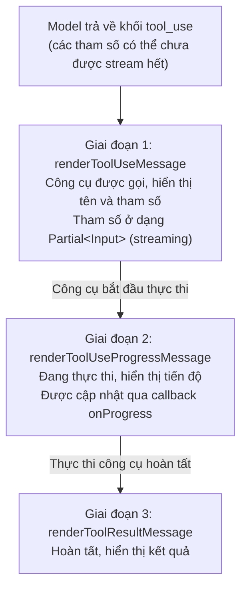

# Chương 2: Hệ thống Công cụ — Hơn 40 Công cụ đóng vai trò là Bàn tay của Mô hình

## Tại sao Hệ thống Công cụ lại là Cốt lõi của Claude Code

Các mô hình ngôn ngữ lớn "suy nghĩ" trong miền văn bản, trong khi các thao tác kỹ nghệ phần mềm xảy ra trên hệ thống file, terminal và mạng internet. **Hệ thống công cụ (tool system)** là cầu nối kết nối hai thế giới này: nó dịch ý định của mô hình thành các hiệu ứng phụ (side effects) thực tế, sau đó dịch kết quả của các hiệu ứng phụ này ngược lại thành văn bản mà mô hình có thể đọc được.

Hệ thống công cụ của Claude Code quản lý hơn 40 công cụ tích hợp sẵn và số lượng công cụ mở rộng MCP không giới hạn. Các công cụ này không phải là một mảng phẳng — chúng đi qua một pipeline chính xác: **Định nghĩa -> Đăng ký -> Lọc -> Gọi -> Render**. Mỗi bước đều có một hợp đồng (contract) rõ ràng. Chương này bắt đầu từ định nghĩa interface `Tool.ts` và mổ xẻ các quyết định thiết kế ở từng lớp của pipeline này.

---

## 2.1 Hợp đồng Interface `Tool`

Tất cả các công cụ — dù là công cụ tích hợp sẵn như `BashTool` hay các công cụ của bên thứ ba được tải qua giao thức MCP — đều phải thỏa mãn cùng một interface TypeScript. Interface này được định nghĩa trong `restored-src/src/Tool.ts:362-695` và là nền tảng của toàn bộ hệ thống công cụ.

### Tổng quan về các Trường cốt lõi

| Trường | Kiểu dữ liệu | Trách nhiệm | Bắt buộc |
|-------|------|---------------|----------|
| `name` | `readonly string` | Định danh duy nhất cho công cụ, dùng để so khớp quyền, phân tích số liệu và truyền tải qua API | Có |
| `description` | `(input, options) => Promise<string>` | Trả về văn bản mô tả công cụ gửi tới mô hình; có thể điều chỉnh động dựa trên ngữ cảnh cấp quyền | Có |
| `prompt` | `(options) => Promise<string>` | Trả về system prompt của công cụ, xem Chương 8 | Có |
| `inputSchema` | `z.ZodType` (Zod v4) | Định nghĩa cấu trúc tham số của công cụ bằng schema Zod, tự động chuyển đổi thành JSON Schema cho API | Có |
| `call` | `(args, context, canUseTool, parentMessage, onProgress?) => Promise<ToolResult>` | Logic thực thi cốt lõi của công cụ | Có |
| `checkPermissions` | `(input, context) => Promise<PermissionResult>` | Kiểm tra quyền ở cấp công cụ, được thực thi sau hệ thống phân quyền chung | Có* |
| `validateInput` | `(input, context) => Promise<ValidationResult>` | Xác thực tính hợp lệ của đầu vào trước khi kiểm tra quyền | Không |
| `maxResultSizeChars` | `number` | Giới hạn ký tự cho kết quả của một công cụ; nếu vượt quá sẽ ghi vào đĩa | Có |
| `isConcurrencySafe` | `(input) => boolean` | Có thể thực thi song song với các công cụ khác hay không | Có* |
| `isReadOnly` | `(input) => boolean` | Có phải là thao tác chỉ đọc hay không (không sửa đổi hệ thống file) | Có* |
| `isEnabled` | `() => boolean` | Công cụ có khả dụng trong môi trường hiện tại hay không | Có* |

> Các trường được đánh dấu * có các giá trị mặc định được cung cấp bởi `buildTool()` và có thể được lược bỏ trong định nghĩa công cụ.

Một vài lựa chọn thiết kế rất đáng để nghiên cứu sâu:

**`description` là một hàm, không phải là một chuỗi (string) tĩnh.** Cùng một công cụ có thể cần các mô tả khác nhau dưới các chế độ cấp quyền khác nhau. Ví dụ: khi người dùng cấu hình quy tắc `alwaysDeny` (luôn từ chối) cấm một số lệnh con nhất định, mô tả công cụ có thể chủ động thông báo cho mô hình "không được thử các thao tác này", tránh việc gọi công cụ vô ích ngay từ cấp độ prompt.

**`inputSchema` sử dụng Zod v4.** Điều này cho phép xác thực nghiêm ngặt các tham số công cụ lúc runtime, đồng thời tự động tạo JSON Schema cho Anthropic API thông qua hàm `z.toJSONSchema()`. Lệnh `z.strictObject()` của Zod đảm bảo mô hình không truyền các tham số không được định nghĩa.

**`call` nhận vào một callback `canUseTool`.** Đây là một thiết kế cực kỳ quan trọng — một công cụ có thể cần kiểm tra quyền đệ quy cho các thao tác phụ trong quá trình thực thi. Ví dụ, `AgentTool` cần kiểm tra xem Agent phụ (sub-Agent) có quyền sử dụng các công cụ cụ thể hay không khi khởi tạo nó. Kiểm tra quyền không phải là chốt chặn một lần mà là một quá trình xác thực liên tục trong suốt quá trình thực thi.

### Hợp đồng Render: Ba nhóm Phương thức

Interface `Tool` định nghĩa một tập hợp các phương thức render đại diện cho toàn bộ vòng đời của công cụ trong giao diện terminal UI (xem Mục 2.5):

```
renderToolUseMessage          // Hiển thị khi công cụ được gọi
renderToolUseProgressMessage  // Hiển thị tiến trình trong quá trình thực thi
renderToolResultMessage       // Hiển thị kết quả sau khi thực thi hoàn tất
```

Ngoài ra còn có các phương thức tùy chọn như `renderToolUseErrorMessage`, `renderToolUseRejectedMessage` (khi bị từ chối quyền) và `renderGroupedToolUse` (hiển thị gom nhóm các công cụ chạy song song).

---

## 2.2 Hàm Factory `buildTool()` và các Giá trị mặc định Đóng khi lỗi

Mỗi công cụ cụ thể không được export trực tiếp dưới dạng một đối tượng thỏa mãn interface `Tool`, mà được xây dựng thông qua hàm factory `buildTool()`. Hàm này được định nghĩa trong `restored-src/src/Tool.ts:783-792`:

```typescript
export function buildTool<D extends AnyToolDef>(def: D): BuiltTool<D> {
  return {
    ...TOOL_DEFAULTS,
    userFacingName: () => def.name,
    ...def,
  } as BuiltTool<D>
}
```

Hành vi lúc runtime là tối giản — chỉ là một thao tác spread đối tượng. Nhưng thiết kế ở cấp độ kiểu dữ liệu (kiểu `BuiltTool<D>`) mô phỏng chính xác ngữ nghĩa của `{ ...TOOL_DEFAULTS, ...def }`: nếu định nghĩa công cụ cung cấp một phương thức, hãy dùng phiên bản của định nghĩa công cụ; nếu không, hãy dùng giá trị mặc định.

### Các giá trị mặc định và triết lý "Đóng khi lỗi" (Fail-Closed)

`TOOL_DEFAULTS` (`restored-src/src/Tool.ts:757-769`) được thiết kế theo nguyên tắc an toàn — **giả định tình huống nguy hiểm nhất khi không chắc chắn**:

| Phương thức Mặc định | Giá trị Mặc định | Ý đồ Thiết kế |
|---------------|---------------|---------------|
| `isEnabled` | `() => true` | Các công cụ mặc định khả dụng trừ khi bị vô hiệu hóa rõ ràng |
| `isConcurrencySafe` | `() => false` | **Đóng khi lỗi (Fail-closed)**: Giả định không an toàn, cấm chạy song song |
| `isReadOnly` | `() => false` | **Đóng khi lỗi (Fail-closed)**: Giả định có ghi dữ liệu, yêu cầu kiểm tra quyền |
| `isDestructive` | `() => false` | Mặc định không mang tính hủy hoại |
| `checkPermissions` | Trả về `{ behavior: 'allow' }` | Ủy quyền cho hệ thống phân quyền chung |
| `toAutoClassifierInput` | `() => ''` | Mặc định không tham gia vào phân loại an toàn tự động |
| `userFacingName` | `() => def.name` | Sử dụng tên công cụ |

Hai giá trị mặc định quan trọng nhất là `isConcurrencySafe: false` và `isReadOnly: false`. Điều này có nghĩa là: nếu một công cụ mới quên khai báo các thuộc tính này, hệ thống sẽ tự động đối xử với nó như "có thể sửa đổi hệ thống file và không thể thực thi song song" — giả định thận trọng và an toàn nhất. Chỉ khi lập trình viên phát triển công cụ chủ động khai báo `isConcurrencySafe() { return true }` và `isReadOnly() { return true }` thì hệ thống mới nới lỏng các hạn chế.

### Cách các công cụ thực tế sử dụng `buildTool`

Lấy `GrepTool` làm ví dụ (`restored-src/src/tools/GrepTool/GrepTool.ts:160-194`):

```typescript
export const GrepTool = buildTool({
  name: GREP_TOOL_NAME,
  searchHint: 'search file contents with regex (ripgrep)',
  maxResultSizeChars: 20_000,
  strict: true,
  // ...
  isConcurrencySafe() { return true },   // Tìm kiếm là một thao tác song song an toàn
  isReadOnly() { return true },           // Tìm kiếm không sửa đổi file
  // ...
})
```

`GrepTool` ghi đè rõ ràng hai giá trị mặc định vì các thao tác tìm kiếm vốn dĩ là chỉ đọc và an toàn khi chạy song song. Ngược lại, `BashTool` (`restored-src/src/tools/BashTool/BashTool.tsx:434-441`) có tính an toàn song song theo điều kiện:

```typescript
isConcurrencySafe(input) {
  return this.isReadOnly?.(input) ?? false;
},
isReadOnly(input) {
  const compoundCommandHasCd = commandHasAnyCd(input.command);
  const result = checkReadOnlyConstraints(input, compoundCommandHasCd);
  return result.behavior === 'allow';
},
```

`BashTool` chỉ cho phép chạy song song khi lệnh được xác định là chỉ đọc — một lệnh `git status` có thể chạy song song, nhưng `git push` thì không. Việc **kiểm soát song song nhận biết đầu vào (input-aware concurrency control)** này là lý do tại sao các signature phương thức của `buildTool` chấp nhận một tham số `input`.

---

## 2.3 Pipeline Đăng ký Công cụ: `tools.ts`

`restored-src/src/tools.ts` là trung tâm lắp ráp của Tool Pool (Bể chứa Công cụ). Nó giải quyết một câu hỏi cốt lõi: **Trong môi trường hiện tại, mô hình có thể sử dụng các công cụ nào?**

### Lọc Ba Cấp độ

Các công cụ phải đi qua ba cấp độ lọc từ định nghĩa đến tính khả dụng cuối cùng:

**Cấp độ 1: Tải có điều kiện lúc biên dịch/khởi động.** Nhiều công cụ được tải có điều kiện thông qua Feature Flag (`restored-src/src/tools.ts:16-135`):

```typescript
const SleepTool =
  feature('PROACTIVE') || feature('KAIROS')
    ? require('./tools/SleepTool/SleepTool.js').SleepTool
    : null

const cronTools = feature('AGENT_TRIGGERS')
  ? [
      require('./tools/ScheduleCronTool/CronCreateTool.js').CronCreateTool,
      require('./tools/ScheduleCronTool/CronDeleteTool.js').CronDeleteTool,
      require('./tools/ScheduleCronTool/CronListTool.js').CronListTool,
    ]
  : []
```

Hàm `feature()` đến từ `bun:bundle` và được đánh giá tại thời điểm bundle. Điều này có nghĩa là các công cụ bị vô hiệu hóa **hoàn toàn không xuất hiện trong file JavaScript bundle cuối cùng** — một hình thức loại bỏ code chết triệt để hơn so với các câu lệnh `if` lúc runtime.

Bên cạnh Feature Flag, còn có việc tải có điều kiện dựa trên biến môi trường:

```typescript
const REPLTool =
  process.env.USER_TYPE === 'ant'
    ? require('./tools/REPLTool/REPLTool.js').REPLTool
    : null
```

`USER_TYPE === 'ant'` đánh dấu các công cụ đặc biệt dành cho nhân viên nội bộ Anthropic (như `REPLTool`, `ConfigTool`, `TungstenTool`), vốn không khả dụng trong phiên bản công khai.

**Cấp độ 2: `getAllBaseTools()` lắp ráp bể chứa công cụ cơ sở.** Hàm này (`restored-src/src/tools.ts:193-251`) thu thập tất cả các công cụ đã vượt qua bộ lọc Cấp độ 1 vào một mảng. Đây là "đăng ký công cụ" (tool registry) của hệ thống — tất cả các công cụ có khả năng tồn tại đều được đăng ký ở đây. Phiên bản hiện tại chứa khoảng hơn 40 công cụ tích hợp sẵn, được điều chỉnh động dựa trên các Feature Flag nào được bật.

```typescript
export function getAllBaseTools(): Tools {
  return [
    AgentTool,
    TaskOutputTool,
    BashTool,
    ...(hasEmbeddedSearchTools() ? [] : [GlobTool, GrepTool]),
    FileReadTool,
    FileEditTool,
    FileWriteTool,
    // ... lược bỏ hơn 30 công cụ khác
    ...(isToolSearchEnabledOptimistic() ? [ToolSearchTool] : []),
  ]
}
```

Lưu ý một điều kiện thú vị: `hasEmbeddedSearchTools()`. Trong các bản build nội bộ của Anthropic, `bfs` (tìm kiếm nhanh) và `ugrep` được nhúng trực tiếp vào file thực thi Bun, lúc đó các lệnh `find` và `grep` trong shell đã được alias thành các công cụ nhanh này, làm cho các công cụ độc lập `GlobTool` và `GrepTool` trở nên dư thừa.

**Cấp độ 3: Lọc lúc runtime bằng `getTools()`.** Đây là lớp lọc cuối cùng (`restored-src/src/tools.ts:271-327`), thực hiện ba thao tác:

1. **Lọc từ chối quyền**: `filterToolsByDenyRules()` loại bỏ các công cụ nằm trong các quy tắc `alwaysDeny` (luôn từ chối). Nếu người dùng cấu hình `"Bash": "deny"`, `BashTool` sẽ hoàn toàn không xuất hiện trong danh sách công cụ gửi tới mô hình.
2. **Ẩn chế độ REPL**: Khi chế độ REPL được bật, các công cụ cơ bản như `Bash`, `Read`, `Edit` sẽ bị ẩn — chúng được gián tiếp cung cấp qua ngữ cảnh VM của `REPLTool`.
3. **Kiểm tra cuối cùng bằng `isEnabled()`**: Phương thức `isEnabled()` của từng công cụ là công tắc cuối cùng.

### Chế độ Đơn giản (Simple Mode) so với Chế độ Đầy đủ (Full Mode)

`getTools()` cũng hỗ trợ một "chế độ đơn giản" (`CLAUDE_CODE_SIMPLE`), chỉ hiển thị ba công cụ cốt lõi: `Bash`, `FileRead` và `FileEdit`. Điều này hữu ích trong một số kịch bản tích hợp — việc giảm số lượng công cụ giúp giảm lượng token tiêu thụ và giảm bớt gánh nặng quyết định của mô hình.

### Tích hợp công cụ MCP

Bể chứa công cụ cuối cùng được lắp ráp bởi `assembleToolPool()` (`restored-src/src/tools.ts:345-367`):

```typescript
export function assembleToolPool(
  permissionContext: ToolPermissionContext,
  mcpTools: Tools,
): Tools {
  const builtInTools = getTools(permissionContext)
  const allowedMcpTools = filterToolsByDenyRules(mcpTools, permissionContext)
  const byName = (a: Tool, b: Tool) => a.name.localeCompare(b.name)
  return uniqBy(
    [...builtInTools].sort(byName).concat(allowedMcpTools.sort(byName)),
    'name',
  )
}
```

Hai thiết kế chính ở đây:

1. **Công cụ tích hợp sẵn được ưu tiên**: Lệnh `uniqBy` giữ lại thực thể đầu tiên xuất hiện của mỗi tên; các công cụ tích hợp sẵn được liệt kê trước, vì vậy chúng sẽ thắng khi có xung đột tên.
2. **Sắp xếp theo tên để tối ưu Prompt Caching ổn định**: Các công cụ tích hợp sẵn và công cụ MCP được sắp xếp riêng biệt rồi mới nối lại với nhau (thay vì trộn lẫn), đảm bảo các công cụ tích hợp xuất hiện như một "tiền tố liền mạch". Điều này hoạt động hiệu quả với thiết kế điểm ngắt cache (cache breakpoint) ở phía API server — nếu các công cụ MCP nằm rải rác giữa các công cụ tích hợp, bất kỳ việc thêm hoặc bớt công cụ MCP nào cũng sẽ làm mất hiệu lực tất cả các cache key phía sau. Xem Chương 13.

---

## 2.4 Ngân sách Kích thước Kết quả Công cụ

Khi một công cụ trả về kết quả, hệ thống phải đối mặt với một mâu thuẫn cốt lõi: mô hình cần xem thông tin đầy đủ để đưa ra quyết định chính xác, nhưng cửa sổ ngữ cảnh (context window) lại có hạn. Claude Code giải quyết vấn đề này thông qua một **ngân sách hai cấp độ**.

### Cấp độ 1: Giới hạn kết quả của từng công cụ `maxResultSizeChars`

Mỗi công cụ khai báo giới hạn kích thước kết quả của riêng mình qua trường `maxResultSizeChars`. Các kết quả vượt quá giới hạn này sẽ được lưu xuống đĩa, và mô hình chỉ nhìn thấy một phần xem trước kèm theo đường dẫn file trên đĩa.

Dưới đây là so sánh `maxResultSizeChars` giữa các công cụ khác nhau:

| Công cụ | `maxResultSizeChars` | Ghi chú |
|------|---------------------|-------|
| `McpAuthTool` | 10.000 | Kết quả xác thực, lượng dữ liệu nhỏ |
| `GrepTool` | 20.000 | Kết quả tìm kiếm cần súc tích |
| `BashTool` | 30.000 | Đầu ra của shell có thể rất dài |
| `GlobTool` | 100.000 | Danh sách file có thể rất nhiều |
| `AgentTool` | 100.000 | Kết quả của Agent phụ |
| `WebSearchTool` | 100.000 | Kết quả tìm kiếm web |
| `BriefTool` | 100.000 | Các tóm tắt ngắn gọn |
| `FileReadTool` | **Vô hạn** | Không bao giờ ghi vào đĩa (xem bên dưới) |

Thiết kế `maxResultSizeChars: Infinity` của `FileReadTool` là một thiết kế đặc biệt — tránh việc lặp vòng tham chiếu: Đọc file -> ghi kết quả ra file -> Đọc tiếp file đó. Hệ thống cũng có một trần giới hạn toàn cục `DEFAULT_MAX_RESULT_SIZE_CHARS = 50,000` (`restored-src/src/constants/toolLimits.ts:13`), hoạt động như một mức trần cứng bất kể công cụ khai báo thế nào.

### Cấp độ 2: Giới hạn tổng hợp trên mỗi Tin nhắn

Khi mô hình gọi nhiều công cụ song song trong cùng một lượt, tất cả các kết quả công cụ được gửi dưới dạng nhiều khối `tool_result` trong cùng một tin nhắn của người dùng. Hằng số `MAX_TOOL_RESULTS_PER_MESSAGE_CHARS = 200,000` (`restored-src/src/constants/toolLimits.ts:49`) giới hạn tổng kích thước của các kết quả công cụ trong một tin nhắn duy nhất, ngăn không cho N công cụ song song cùng nhau làm quá tải cửa sổ ngữ cảnh.

Lý do thiết kế vô hạn của `FileReadTool`, chi tiết triển khai việc lưu trữ ngân sách trên mỗi tin nhắn (bao gồm việc lưu trữ quyết định `ContentReplacementState` và cơ chế miễn trừ vô hạn) được trình bày trong Chương 4.

### Tóm tắt các Tham số Ngân sách Kích thước

| Hằng số | Giá trị | Vị trí Định nghĩa |
|----------|-------|-------------------|
| `DEFAULT_MAX_RESULT_SIZE_CHARS` | 50.000 ký tự | `constants/toolLimits.ts:13` |
| `MAX_TOOL_RESULT_TOKENS` | 100.000 token | `constants/toolLimits.ts:22` |
| `MAX_TOOL_RESULT_BYTES` | 400.000 byte | `constants/toolLimits.ts:33` (= 100K token x 4 byte/token) |
| `MAX_TOOL_RESULTS_PER_MESSAGE_CHARS` | 200.000 ký tự | `constants/toolLimits.ts:49` |
| `TOOL_SUMMARY_MAX_LENGTH` | 50 ký tự | `constants/toolLimits.ts:57` |

---

## 2.5 Luồng Render Ba Giai Đoạn

Việc hiển thị một công cụ trong giao diện terminal UI không phải là một sự kiện diễn ra một lần mà là một quá trình lũy tiến gồm ba giai đoạn. Ba giai đoạn này tương ứng một-một với vòng đời thực thi của công cụ.

### Sơ đồ Luồng



### Giai đoạn 1: `renderToolUseMessage` — Hiển thị Ý định

Khi mô hình trả về một khối `tool_use`, phương thức này được gọi ngay lập tức. Lưu ý kiểu dữ liệu quan trọng trong signature của nó:

```typescript
renderToolUseMessage(
  input: Partial<z.infer<Input>>,  // Lưu ý: Kiểu Partial!
  options: { theme: ThemeName; verbose: boolean; commands?: Command[] },
): React.ReactNode
```

`input` là `Partial` vì: API trả về JSON tham số công cụ dưới dạng truyền luồng (streaming), và trước khi quá trình parse JSON hoàn tất, chỉ có một số trường dữ liệu khả dụng. UI phải có khả năng render ngay cả khi tham số chưa đầy đủ — người dùng không nên nhìn thấy màn hình trống.

Lấy `BashTool` làm ví dụ, ngay cả khi trường `command` chưa được nhận đầy đủ, UI đã có thể hiển thị nhãn "Bash" và văn bản lệnh một phần đã nhận được cho đến thời điểm đó.

### Giai đoạn 2: `renderToolUseProgressMessage` — Hiển thị Tiến độ

Đây là một phương thức **tùy chọn**. Đối với các công cụ chạy lâu (như `BashTool`, `AgentTool`), việc phản hồi tiến độ là rất quan trọng. `BashTool` bắt đầu hiển thị tiến trình sau khi một lệnh shell thực thi hơn 2 giây (`PROGRESS_THRESHOLD_MS = 2000`, `restored-src/src/tools/BashTool/BashTool.tsx:55`).

Tiến độ được truyền qua callback `onProgress`. Cấu trúc dữ liệu tiến độ của mỗi công cụ là khác nhau — kiểu `BashProgress` của `BashTool` chứa các đoạn stdout/stderr, trong khi kiểu `AgentToolProgress` của `AgentTool` chứa luồng tin nhắn của Agent phụ. Các kiểu này được định nghĩa thống nhất trong `restored-src/src/types/tools.ts`, ràng buộc qua kiểu union `ToolProgressData`.

### Giai đoạn 3: `renderToolResultMessage` — Hiển thị Kết quả

Đây cũng là một phương thức **tùy chọn** — khi lược bỏ, kết quả công cụ sẽ không được hiển thị trong terminal (ví dụ, kết quả của `TodoWriteTool` được hiển thị qua một bảng chuyên dụng, chứ không nằm trong luồng hội thoại).

`renderToolResultMessage` chấp nhận tùy chọn `style?: 'condensed'`. Trong chế độ không chi tiết (non-verbose), các công cụ tìm kiếm (`GrepTool`, `GlobTool`) hiển thị các tóm tắt súc tích (như "Tìm thấy 42 file trên 3 thư mục"), trong khi ở chế độ chi tiết (verbose) chúng sẽ hiển thị toàn bộ kết quả. Các công cụ có thể sử dụng `isResultTruncated(output)` để báo cho UI biết kết quả hiện tại có bị cắt ngắn hay không, cho phép tương tác "click để mở rộng" trong chế độ toàn màn hình.

### Render Gom nhóm: `renderGroupedToolUse`

Khi mô hình gọi nhiều công cụ cùng loại song song trong cùng một lượt (ví dụ: 5 lệnh tìm kiếm `Grep` song song), việc render riêng lẻ từng lệnh sẽ chiếm nhiều không gian màn hình. Phương thức `renderGroupedToolUse` cho phép các công cụ gộp nhiều cuộc gọi song song thành một chế độ xem nhóm thu gọn — ví dụ: "Đã tìm kiếm 5 mẫu, tìm thấy 127 kết quả trên 34 file."

Phương thức này chỉ có hiệu lực trong **chế độ không chi tiết (non-verbose)**. Trong chế độ chi tiết (verbose), mỗi lần gọi công cụ vẫn được render độc lập tại vị trí ban đầu của nó, đảm bảo không mất mát thông tin khi debug.

---

## 2.6 Thiết kế Mẫu từ các Công cụ cụ thể

### BashTool: Công cụ phức tạp nhất

`BashTool` (`restored-src/src/tools/BashTool/BashTool.tsx`) là công cụ đơn lẻ phức tạp nhất trong toàn bộ hệ thống công cụ, vì không gian ngữ nghĩa của các lệnh shell là vô hạn. Nó cần phải:

- **Phân tích cấu trúc lệnh** để xác định xem nó có phải là chỉ đọc hay không (qua `checkReadOnlyConstraints` và `parseForSecurity`).
- **Hiểu các đường ống (pipes) và lệnh ghép** (`ls && echo "---" && ls` vẫn là chỉ đọc).
- **Tính song song có điều kiện**: Chỉ các lệnh chỉ đọc mới có thể thực thi song song.
- **Theo dõi tiến độ**: Các lệnh chạy lâu hơn 2 giây sẽ hiển thị đầu ra stdout dạng stream.
- **Theo dõi thay đổi file**: Ghi lại các sửa đổi file do lệnh shell gây ra thông qua `fileHistoryTrackEdit` và `trackGitOperations`.
- **Thực thi trong Sandbox**: Thực thi cô lập thông qua `SandboxManager` dưới những điều kiện nhất định.

Giới hạn `maxResultSizeChars` của `BashTool` được đặt là 30.000 — hào phóng hơn mức 20.000 của `GrepTool`, vì đầu ra shell thường chứa nhiều thông tin có cấu trúc hơn (lỗi biên dịch, kết quả kiểm thử, v.v.) và mô hình cần xem đủ ngữ cảnh để đưa ra quyết định đúng đắn.

### GrepTool: Hình mẫu về An toàn Song song

Thiết kế của `GrepTool` tương đối sạch sẽ. Nó khai báo vô điều kiện `isConcurrencySafe: true` và `isReadOnly: true`, vì các thao tác tìm kiếm không bao giờ sửa đổi hệ thống file. Giới hạn `maxResultSizeChars` của nó được đặt là 20.000 — kết quả tìm kiếm vượt quá độ dài này gợi ý rằng phạm vi tìm kiếm của mô hình quá rộng, và việc ghi vào đĩa kèm theo bản xem trước thực sự giúp mô hình điều chỉnh lại chiến lược của nó.

### FileReadTool: Triết lý của `Infinity`

`FileReadTool` đặt `maxResultSizeChars` thành `Infinity`, thay vào đó chọn kiểm soát kích thước đầu ra thông qua các giới hạn `maxTokens` và `maxSizeBytes` của chính nó. Điều này tránh được vấn đề đọc vòng lặp đã đề cập trước đó và có nghĩa là các kết quả của `FileReadTool` không bao giờ bị thay thế bằng các liên kết đĩa — mô hình luôn nhìn thấy trực tiếp nội dung file.

---

## 2.7 Nạp Trì hoãn (Deferred Loading) và ToolSearch

Khi số lượng công cụ vượt quá một ngưỡng nhất định (đặc biệt là sau khi kết nối nhiều công cụ MCP), việc gửi toàn bộ schema của tất cả các công cụ tới mô hình sẽ tiêu tốn một lượng token đáng kể. Claude Code giải quyết vấn đề này thông qua cơ chế **Nạp Trì hoãn (Deferred Loading)**.

Các công cụ được đánh dấu `shouldDefer: true` sẽ chỉ gửi tên công cụ trong prompt ban đầu (`defer_loading: true`), chứ không gửi toàn bộ schema tham số. Mô hình trước tiên phải gọi `ToolSearchTool` để tìm kiếm theo từ khóa và lấy định nghĩa đầy đủ của công cụ trước khi có thể gọi các công cụ trì hoãn này.

Trường `searchHint` của mỗi công cụ được thiết kế cho mục đích này — nó cung cấp mô tả năng lực từ 3-10 từ để giúp `ToolSearchTool` thực hiện khớp từ khóa. Ví dụ, `searchHint` của `GrepTool` là `'search file contents with regex (ripgrep)'`.

Các công cụ được đánh dấu `alwaysLoad: true` sẽ không bao giờ bị trì hoãn — schema đầy đủ của chúng luôn xuất hiện trong prompt ban đầu. Điều này dành cho các công cụ cốt lõi mà mô hình phải có khả năng gọi trực tiếp ngay trong lượt hội thoại đầu tiên.

---

## 2.8 Trích xuất Mẫu hình (Pattern Extraction)

Từ thiết kế hệ thống công cụ của Claude Code, có thể trích xuất một số mẫu hình có giá trị phổ quát cho những người xây dựng AI Agent:

**Mẫu hình 1: Các giá trị mặc định đóng khi lỗi.** Các giá trị mặc định của `buildTool()` giả định tình huống nguy hiểm nhất (không an toàn song song, không chỉ đọc), yêu cầu các nhà phát triển công cụ phải chủ động khai báo các thuộc tính an toàn. Điều này chuyển trạng thái an toàn từ "opt-in" (chủ động tham gia) thành "opt-out" (chủ động rút lui), giảm thiểu đáng kể rủi ro do sơ suất.

**Mẫu hình 2: Kiểm soát ngân sách theo phân lớp.** Kết quả của từng công cụ có giới hạn trần, và một tin nhắn đơn lẻ cũng có giới hạn tổng hợp. Hai cấp độ bổ sung cho nhau — giới hạn trên từng công cụ ngăn chặn việc chạy quá tải tại một điểm, và giới hạn trên tin nhắn ngăn chặn sự bùng nổ dữ liệu từ các cuộc gọi song song.

**Mẫu hình 3: Các thuộc tính nhận biết đầu vào (Input-aware properties).** `isConcurrencySafe(input)` và `isReadOnly(input)` nhận vào dữ liệu đầu vào của công cụ thay vì đưa ra các phán quyết toàn cục. Cùng là `BashTool` nhưng có các thuộc tính an toàn hoàn toàn khác nhau đối với lệnh `ls` so với `rm`. Khả năng nhận biết đầu vào chi tiết này là nền tảng cho việc kiểm soát quyền hạn chính xác. Xem Chương 4.

**Mẫu hình 4: Render lũy tiến (Progressive rendering).** Quá trình render ba giai đoạn (ý định -> tiến trình -> kết quả) giúp người dùng có cái nhìn rõ ràng ở mọi giai đoạn thực thi công cụ. Thiết kế `Partial<Input>` đảm bảo UI không bị trống ngay cả trong quá trình truyền luồng tham số. Điều này rất quan trọng để xây dựng lòng tin của người dùng — người dùng cần biết Agent đang làm gì, thay vì phải nhìn chằm chằm vào một biểu tượng tải đang xoay.

**Mẫu hình 5: Loại bỏ lúc compile so với lọc lúc runtime.** Feature Flag sử dụng hàm `feature()` của `bun:bundle` để loại bỏ code của các công cụ bị vô hiệu hóa tại thời điểm compile, trong khi các quy tắc phân quyền lọc danh sách công cụ lúc runtime. Hai cơ chế phục vụ các mục đích khác nhau: cơ chế đầu tiên giảm kích thước bundle và bề mặt tấn công (attack surface), cơ chế sau hỗ trợ cấu hình cấp người dùng.

---

## Những việc bạn có thể làm

Dựa trên kinh nghiệm thiết kế hệ thống công cụ của Claude Code, dưới đây là các hành động bạn có thể thực hiện khi xây dựng hệ thống công cụ AI Agent của riêng mình:

- **Áp dụng các giá trị mặc định "đóng khi lỗi".** Trong framework đăng ký công cụ của bạn, hãy đặt giá trị mặc định của các thuộc tính an toàn như `isConcurrencySafe` và `isReadOnly` thành các tùy chọn thận trọng nhất. Yêu cầu các nhà phát triển công cụ khai báo rõ ràng các thuộc tính an toàn thay vì mặc định coi chúng là an toàn.
- **Thiết lập giới hạn kích thước kết quả cho mọi công cụ.** Không cho phép các công cụ trả về kết quả lớn vô hạn. Thiết lập giới hạn cho từng công cụ (như `maxResultSizeChars`) và giới hạn tổng hợp cho mỗi tin nhắn; khi vượt quá, hãy ghi vào đĩa và trả về bản xem trước.
- **Biến các mô tả công cụ thành các hàm, không phải chuỗi tĩnh.** Nếu các công cụ của bạn có các hạn chế hành vi khác nhau dưới các chế độ phân quyền hoặc ngữ cảnh khác nhau, việc tạo mô tả động có thể hướng dẫn mô hình tránh các cuộc gọi không hợp lệ ngay từ cấp độ prompt.
- **Triển khai render ba giai đoạn.** Cung cấp phản hồi tiến trình cho các công cụ chạy lâu (hiển thị ý định -> tiến trình thực thi -> kết quả cuối cùng), để người dùng luôn biết Agent đang làm gì. Hỗ trợ `Partial<Input>` để cho phép hiển thị ngay cả trong quá trình stream tham số.
- **Sử dụng tải có điều kiện để giảm tập hợp công cụ.** Lọc bỏ các công cụ không cần thiết tại thời điểm biên dịch/khởi động thông qua Feature Flag hoặc biến môi trường, giảm lượng token tiêu thụ và gánh nặng quyết định của mô hình. Đối với các kịch bản có nhiều công cụ MCP, hãy cân nhắc cơ chế nạp trì hoãn.
- **Giữ thứ tự công cụ ổn định.** Nếu bạn sử dụng tính năng Prompt Caching của API, hãy đảm bảo thứ tự danh sách công cụ luôn ổn định qua các yêu cầu. Đặt các công cụ tích hợp sẵn làm tiền tố liền mạch, nối thêm các công cụ MCP được sắp xếp theo tên và tránh việc làm mất hiệu lực cache key thường xuyên.

---

## Tóm tắt

Hệ thống công cụ của Claude Code là một kiến trúc được phân lớp cẩn thận: interface `Tool` định nghĩa hợp đồng, `buildTool()` cung cấp các giá trị mặc định an toàn, pipeline đăng ký `tools.ts` lắp ráp bể chứa công cụ thông qua lọc hai cấp độ lúc compile và lúc runtime, cơ chế ngân sách kích thước kiểm soát mức tiêu thụ ngữ cảnh ở cả cấp độ từng công cụ và từng tin nhắn, và quy trình render ba giai đoạn giúp quá trình thực thi công cụ hoàn toàn minh bạch với người dùng.

Triết lý thiết kế của hệ thống này có thể được tóm tắt trong một câu: **Làm cho việc đúng đắn trở nên dễ dàng, và việc nguy hiểm trở nên khó khăn.** Các giá trị mặc định đóng khi lỗi của `buildTool()` biến việc "quên khai báo thuộc tính an toàn" thành một lỗi an toàn; ngân sách phân lớp biến việc "công cụ trả về quá nhiều dữ liệu" thành một sự suy giảm có thể kiểm soát; việc tải có điều kiện biến việc "thêm công cụ thử nghiệm" thành một hoạt động không rủi ro.

Việc gọi công cụ và điều phối — bao gồm luồng kiểm tra quyền hoàn chỉnh, chiến lược lập lịch thực thi song song và cơ chế truyền tiến độ dạng stream — sẽ được trình bày chi tiết trong Chương 4.
