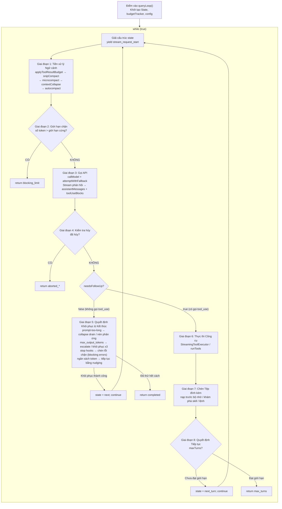

# Chương 3: Vòng lặp Agent — Vòng đời Hoàn chỉnh từ Đầu vào Người dùng đến Phản hồi của Mô hình

> *"Một vòng lặp không còn là một vòng lặp khi mỗi lần lặp lại tái định hình thế giới mà nó đang chạy."*

Chương này là điểm neo của toàn bộ cuốn sách. Từ việc xây dựng lệnh gọi API của Chương 5 đến chiến lược tự động nén (autocompact) của Chương 9, từ việc xử lý phản hồi dạng stream của Chương 13 đến hệ thống kiểm tra quyền hạn của Chương 16 — hầu như tất cả các hệ thống con được thảo luận trong các chương sau cuối cùng đều được điều phối, phối hợp và thúc đẩy bên trong vòng lặp cốt lõi `queryLoop()`. Hiểu được vòng lặp này có nghĩa là hiểu được trái tim đang đập của Claude Code với tư cách là một AI Agent.

## 3.1 Tại sao Vòng lặp Agent không phải là một REPL đơn giản

Một REPL (Read-Eval-Print Loop) truyền thống là một chu kỳ ba bước không trạng thái (stateless): đọc đầu vào, đánh giá, in kết quả. Không có sự truyền ngữ cảnh giữa các lần lặp, không có tự động khôi phục và không có nhận thức về trạng thái của chính nó.

Vòng lặp Agent (Agent Loop) về cơ bản là khác biệt. Hãy xem bảng so sánh sau:

| Chiều kích | REPL truyền thống | Vòng lặp Agent của Claude Code |
|-----------|-----------------|----------------------|
| Mô hình trạng thái | Không trạng thái hoặc chỉ lưu lịch sử | Kiểu dữ liệu `State` với 10 trường có thể thay đổi, được mang theo qua các lần lặp |
| Thoát vòng lặp | Người dùng chủ động thoát | 7 chuyển đổi `Continue` + 10 lý do kết thúc `Terminal` |
| Xử lý lỗi | In lỗi và tiếp tục | Tự động hạ cấp, chuyển đổi model, nén phản ứng (reactive compact), giới hạn số lần thử lại |
| Quản lý ngữ cảnh | Không có | Pipeline bốn cấp độ: snip -> microcompact -> context collapse -> autocompact |
| Thực thi công cụ | Không có | Thực thi song song dạng stream, kiểm tra quyền hạn, cắt giảm ngân sách kết quả |
| Dung lượng hội thoại | Tăng vô hạn cho đến khi OOM | Theo dõi ngân sách token, tự động nén, giới hạn chặn (blocking limit) làm mức trần cứng |

Mỗi lần lặp của Vòng lặp Agent có thể thay đổi các điều kiện hoạt động của chính nó: nén làm giảm mảng tin nhắn, hạ cấp model làm thay đổi backend suy luận, các stop hook chèn thêm các tin nhắn ràng buộc mới. Đây không phải là một vòng lặp đơn thuần — nó là một **máy trạng thái tự sửa đổi (self-modifying state machine)**.

## 3.2 Tổng quan về Máy trạng thái `queryLoop`

### 3.2.1 Điểm vào: `query()` và `queryLoop()`

Hàm điểm vào `query()` là một lớp bọc mỏng. Nó gọi `queryLoop()` để lấy kết quả, sau đó thông báo cho tất cả các lệnh đã thực thi về việc hoàn tất vòng đời:

```
restored-src/src/query.ts:219-238
```

```typescript
export async function* query(params: QueryParams): AsyncGenerator<...> {
  const consumedCommandUuids: string[] = []
  const terminal = yield* queryLoop(params, consumedCommandUuids)
  for (const uuid of consumedCommandUuids) {
    notifyCommandLifecycle(uuid, 'completed')
  }
  return terminal
}
```

Máy trạng thái thực sự nằm trong `queryLoop()` (`restored-src/src/query.ts:241`). Nó là một vòng lặp `while (true)` chuyển sang lần lặp tiếp theo thông qua lệnh `state = next; continue`, hoặc kết thúc thông qua lệnh `return { reason: '...' }`.

### 3.2.2 Kiểu State: Trạng thái có thể thay đổi giữa các lần lặp

Kiểu `State` định nghĩa tất cả các trạng thái thay đổi mà vòng lặp cần mang theo giữa các lần lặp (`restored-src/src/query.ts:204-217`):

| Trường | Kiểu dữ liệu | Ngữ nghĩa |
|-------|------|-----------|
| `messages` | `Message[]` | Mảng tin nhắn hội thoại hiện tại; các phản hồi của assistant và kết quả công cụ được nối thêm sau mỗi lần lặp. |
| `toolUseContext` | `ToolUseContext` | Ngữ cảnh thực thi công cụ, bao gồm danh sách công cụ khả dụng, chế độ phân quyền, abort signal, v.v. |
| `autoCompactTracking` | `AutoCompactTrackingState \| undefined` | Trạng thái theo dõi tự động nén, ghi lại việc nén đã được kích hoạt chưa và số lần thất bại liên tiếp. |
| `maxOutputTokensRecoveryCount` | `number` | Số lần thử khôi phục max_output_tokens đã thực hiện cho đến nay, giới hạn tối đa là 3. |
| `hasAttemptedReactiveCompact` | `boolean` | Cho biết đã thử nén phản ứng (reactive compact) chưa, giúp ngăn ngừa vòng lặp thử lại vô hạn. |
| `maxOutputTokensOverride` | `number \| undefined` | Giá trị ghi đè cho max_output_tokens mặc định, dùng cho các lượt thử lại leo thang (ví dụ: 8k -> 64k). |
| `pendingToolUseSummary` | `Promise<...> \| undefined` | Promise cho tóm tắt thực thi công cụ của lượt trước, được await song song trong quá trình stream model của lượt tiếp theo. |
| `stopHookActive` | `boolean \| undefined` | Đánh dấu xem một stop hook có đang hoạt động hay không, ngăn chặn kích hoạt trùng lặp. |
| `turnCount` | `number` | Số lượt hội thoại hiện tại, dùng để kiểm tra giới hạn `maxTurns`. |
| `transition` | `Continue \| undefined` | Lý do lần lặp trước được tiếp tục — giúp việc viết test và debug khẳng định các đường dẫn khôi phục thực sự được kích hoạt. |

Lưu ý một quyết định thiết kế then chốt: bình luận mã nguồn nêu rõ "Các vị trí Continue ghi `state = { ... }` thay vì thực hiện 9 phép gán riêng lẻ" (`restored-src/src/query.ts:267`). Điều này có nghĩa là mỗi điểm tiếp tục (continuation point) phải dựng lại một đối tượng `State` hoàn chỉnh. Cách tiếp cận này loại bỏ loại bug "quên reset một trường" — trong một vòng lặp có 7 điểm tiếp tục, đây không phải là rủi ro lý thuyết mà là tai nạn chắc chắn xảy ra nếu không cẩn thận.

### 3.2.3 Các kiểu Chuyển đổi Tiếp tục (Continue Transition)

Vòng lặp có 7 vị trí `continue` bên trong, mỗi vị trí ghi lại lý do chuyển đổi của nó. Danh sách đầy đủ được trích xuất từ mã nguồn:

| `Continue.reason` | Điều kiện Kích hoạt | Hành vi Điển hình |
|-------------------|-------------------|------------------|
| `next_turn` | Model trả về một khối `tool_use` | Nối thêm assistant + tool_result, tăng turnCount, bắt đầu lượt tiếp theo. |
| `max_output_tokens_escalate` | Đầu ra của model bị cắt ngắn và chưa leo thang | Đặt maxOutputTokensOverride thành 64k, thử lại chính yêu cầu đó như cũ. |
| `max_output_tokens_recovery` | Đầu ra bị cắt ngắn, đã dùng hết lượt leo thang, số lần khôi phục < 3 | Chèn tin nhắn meta yêu cầu model tiếp tục, tăng số lần khôi phục. |
| `reactive_compact_retry` | Lỗi prompt-too-long hoặc media-size | Kích hoạt nén phản ứng sau đó thử lại. |
| `collapse_drain_retry` | prompt-too-long với các yêu cầu thu gọn ngữ cảnh đang chờ xử lý | Thực thi tất cả các thao tác thu gọn đã chuẩn bị, sau đó thử lại. |
| `stop_hook_blocking` | stop hook trả về một lỗi chặn (blocking error) | Chèn lỗi chặn vào luồng tin nhắn, để model tự sửa chữa. |
| `token_budget_continuation` | Ngân sách token chưa cạn kiệt | Chèn tin nhắn thúc đẩy (nudge message) khuyến khích model tiếp tục làm việc. |

### 3.2.4 Các lý do Kết thúc Giai đoạn cuối (Terminal Termination Reasons)

Vòng lặp kết thúc qua lệnh `return`, với giá trị trả về chứa trường `reason`. Danh sách đầy đủ được trích xuất từ mã nguồn:

| `Terminal.reason` | Ngữ nghĩa |
|-------------------|-----------|
| `completed` | Model hoàn tất bình thường (không gọi tool_use), hoặc lỗi API nhưng đã thử hết cách khôi phục. |
| `blocking_limit` | Số lượng token đạt giới hạn cứng, không thể tiếp tục. |
| `prompt_too_long` | Lỗi prompt-too-long và tất cả các biện pháp khôi phục (collapse drain + nén phản ứng) đều thất bại. |
| `image_error` | Lỗi định dạng/kích thước hình ảnh. |
| `model_error` | Lệnh gọi model ném ra ngoại lệ không mong muốn. |
| `aborted_streaming` | Người dùng ngắt quãng trong lúc stream phản hồi. |
| `aborted_tools` | Người dùng ngắt quãng trong lúc thực thi công cụ. |
| `stop_hook_prevented` | stop hook ngăn chặn việc tiếp tục. |
| `hook_stopped` | Hook ngăn chặn các thao tác tiếp theo trong lúc thực thi công cụ. |
| `max_turns` | Đạt giới hạn số lượt hội thoại tối đa. |

> **Phiên bản tương tác**: [Nhấp vào đây để xem trực quan hóa hoạt động của Vòng lặp Agent](agent-loop-viz.html) — Theo dõi cách một cuộc hội thoại "giúp tôi sửa lỗi" hoàn chỉnh chạy qua máy trạng thái, với từng giai đoạn có thể nhấp vào để xem tham chiếu mã nguồn và giải thích chi tiết.

Sơ đồ luồng dưới đây thể hiện toàn bộ cấu trúc của máy trạng thái:



Dưới đây là phiên bản ASCII gốc dành cho những độc giả cần môi trường đọc thuần văn bản:

<details>
<summary>Sơ đồ luồng ASCII (bấm để mở rộng)</summary>

```
┌──────────────────────────────────────────────────────────────────────┐
│                        queryLoop() Entry                            │
│  Initialize State, budgetTracker, config, pendingMemoryPrefetch     │
└──────────────┬───────────────────────────────────────────────────────┘
               │
               ▼
 ┌──────────────────────────────────────────────────┐
 │              while (true) {                      │
 │  Destructure state → messages, toolUseContext, ...│
 │  yield { type: 'stream_request_start' }          │
 ├──────────────────────────────────────────────────┤
 │                                                  │
 │  ┌─────────────────────────────────────────┐     │
 │  │ Phase 1: Context Preprocessing           │     │
 │  │ applyToolResultBudget                    │     │
 │  │ → snipCompact (HISTORY_SNIP)             │     │
 │  │ → microcompact                           │     │
 │  │ → contextCollapse (CONTEXT_COLLAPSE)     │     │
 │  │ → autocompact ───── Xem Ch.9 ──────────  │     │
 │  └──────────────┬──────────────────────────┘     │
 │                 │                                 │
 │                 ▼                                 │
 │  ┌─────────────────────────────────────────┐     │
 │  │ Phase 2: Blocking limit check            │     │
 │  │ token count > hard limit ?               │     │
 │  │   YES → return {reason:'blocking_limit'} │     │
 │  └──────────────┬──────────────────────────┘     │
 │                 │ NO                              │
 │                 ▼                                 │
 │  ┌─────────────────────────────────────────┐     │
 │  │ Phase 3: API Call ── Xem Ch.5 & Ch.13 ── │     │
 │  │ attemptWithFallback loop                  │     │
 │  │ callModel({                              │     │
 │  │   messages: prependUserContext(...)       │     │
 │  │   systemPrompt: appendSystemContext(...) │     │
 │  │ })                                       │     │
 │  │                                          │     │
 │  │ Stream response → assistantMessages[]    │     │
 │  │                → toolUseBlocks[]         │     │
 │  │ FallbackTriggeredError → switch model    │     │
 │  └──────────────┬──────────────────────────┘     │
 │                 │                                 │
 │                 ▼                                 │
 │  ┌─────────────────────────────────────────┐     │
 │  │ Phase 4: Abort check                     │     │
 │  │ abortController.signal.aborted ?        │     │
 │  │   YES → return {reason:'aborted_*'}     │     │
 │  └──────────────┬──────────────────────────┘     │
 │                 │ NO                              │
 │                 ▼                                 │
 │  ┌─────────────────────────────────────────┐     │
 │  │ Phase 5: needsFollowUp == false branch   │     │
 │  │ (model did not return tool_use)          │     │
 │  │                                          │     │
 │  │ ┌─ prompt-too-long recovery ──────────┐ │     │
 │  │ │ collapse drain → reactive compact   │ │     │
 │  │ │ Success → state=next; continue      │ │     │
 │  │ └────────────────────────────────────-┘ │     │
 │  │ ┌─ max_output_tokens recovery ────────┐ │     │
 │  │ │ escalate(8k→64k) → recovery(×3)    │ │     │
 │  │ │ Success → state=next; continue      │ │     │
 │  │ └────────────────────────────────────-┘ │     │
 │  │ ┌─ stop hooks ── Xem Ch.16 ──────────┐ │     │
 │  │ │ blockingErrors → state=next;continue│ │     │
 │  │ └────────────────────────────────────-┘ │     │
 │  │ ┌─ token budget check ────────────────┐ │     │
 │  │ │ budget remaining → state=next;      │ │     │
 │  │ │ continue                            │ │     │
 │  │ └────────────────────────────────────-┘ │     │
 │  │                                          │     │
 │  │ return { reason: 'completed' }           │     │
 │  └──────────────────────────────────────-──┘     │
 │                 │                                 │
 │           needsFollowUp == true                  │
 │                 │                                 │
 │                 ▼                                 │
 │  ┌─────────────────────────────────────────┐     │
 │  │ Phase 6: Tool Execution                  │     │
 │  │ streamingToolExecutor.getRemainingResults│     │
 │  │ or runTools() ── Xem Ch.4 ────────────── │     │
 │  │ → toolResults[]                         │     │
 │  └──────────────┬──────────────────────────┘     │
 │                 │                                 │
 │                 ▼                                 │
 │  ┌─────────────────────────────────────────┐     │
 │  │ Phase 7: Attachment Injection            │     │
 │  │ getAttachmentMessages()                 │     │
 │  │ pendingMemoryPrefetch consume           │     │
 │  │ skillDiscoveryPrefetch consume          │     │
 │  │ queuedCommands drain                    │     │
 │  └──────────────┬──────────────────────────┘     │
 │                 │                                 │
 │                 ▼                                 │
 │  ┌─────────────────────────────────────────┐     │
 │  │ Phase 8: Continuation Decision           │     │
 │  │ maxTurns check                          │     │
 │  │ state = { reason: 'next_turn', ... }    │     │
 │  │ continue                                │     │
 │  └─────────────────────────────────────────┘     │
 │                                                  │
 └──────────────────────────────────────────────────┘
```

</details>

## 3.3 Quy trình Đầy đủ của một Lần lặp (Iteration)

Hãy cùng theo dõi từng giai đoạn của một lần lặp duy nhất, từ đầu đến cuối.

### 3.3.1 Pipeline Tiền xử lý Ngữ cảnh (Context Preprocessing Pipeline)

Tại thời điểm bắt đầu mỗi lần lặp, mảng `messages` thô phải đi qua bốn đến năm cấp độ xử lý trước khi được gửi tới API. Các giai đoạn này thực thi theo thứ tự nghiêm ngặt và không thể hoán đổi vị trí cho nhau.

**Cấp độ 1: Cắt giảm Ngân sách Kết quả Công cụ (Tool Result Budget Trimming)**

```
restored-src/src/query.ts:379-394
```

`applyToolResultBudget()` áp dụng các giới hạn kích thước cho kết quả công cụ đã tổng hợp. Nó chạy trước tất cả các giai đoạn nén vì cơ chế nén siêu nhỏ có cache sau đó chỉ hoạt động trên `tool_use_id` mà không kiểm tra nội dung — việc cắt giảm nội dung trước sẽ không gây ảnh hưởng đến nó.

**Cấp độ 2: Cắt giảm Lịch sử (History Snip)**

```
restored-src/src/query.ts:401-410
```

`snipCompactIfNeeded()` là một cơ chế nén gọn nhẹ: nó cắt các tin nhắn cũ khỏi lịch sử để giải phóng không gian token. Điều quan trọng là nó trả về một giá trị `tokensFreed` — giá trị này được chuyển qua autocompact để quyết định ngưỡng của nó có thể tính đến không gian đã được giải phóng bởi snip.

**Cấp độ 3: Nén siêu nhỏ (Microcompact)**

```
restored-src/src/query.ts:414-426
```

Microcompact là một cơ chế nén chi tiết chạy trước autocompact. Nó cũng hỗ trợ chế độ "sửa đổi có cache" (`CACHED_MICROCOMPACT`) tận dụng cơ chế xóa cache của API để đạt được mức nén không tốn thêm lượt gọi API nào.

**Cấp độ 4: Thu gọn Ngữ cảnh (Context Collapse)**

```
restored-src/src/query.ts:440-447
```

Thu gọn ngữ cảnh (Context Collapse) là một cơ chế chiếu tại thời điểm đọc (read-time projection). Các bình luận mã nguồn tiết lộ một thiết kế rất thanh lịch:

> *"Không có gì được yield ra — giao diện thu gọn là một phép chiếu tại thời điểm đọc trên toàn bộ lịch sử của REPL. Các tin nhắn tóm tắt nằm trong collapse store, không nằm trong mảng REPL."* (`restored-src/src/query.ts:434-436`)

Điều này có nghĩa là quá trình collapse không sửa đổi mảng tin nhắn ban đầu mà chiếu lại nó tại mỗi lần lặp. Kết quả thu gọn được truyền qua `state.messages` tại các điểm tiếp tục; lệnh `projectView()` tiếp theo sẽ trở thành no-op vì các tin nhắn lưu trữ đã không còn trong đầu vào.

**Cấp độ 5: Tự động nén (Autocompact)** (xem Chương 9)

```
restored-src/src/query.ts:454-468
```

Tự động nén (Automatic compaction) là bước tiền xử lý nặng nhất. Nó chạy sau khi thu gọn ngữ cảnh — nếu việc collapse đã giảm lượng token xuống dưới ngưỡng, autocompact sẽ trở thành no-op, giúp bảo toàn ngữ cảnh chi tiết hơn thay vì tạo ra một tóm tắt duy nhất.

Thiết kế của pipeline năm cấp độ này tuân theo một nguyên tắc: **từ nhẹ đến nặng, từ cục bộ đến toàn cục**. Mỗi cấp độ cố gắng giải phóng không gian mà không làm mất quá nhiều thông tin; chỉ khi các cấp độ trước đó không đủ, các cấp độ sau mới được kích hoạt.

### 3.3.2 Tiêm Ngữ cảnh (Context Injection): prependUserContext và appendSystemContext

Sau khi hoàn tất tiền xử lý tin nhắn, ngữ cảnh được đưa vào yêu cầu API thông qua hai hàm:

**`appendSystemContext`** (`restored-src/src/utils/api.ts:437-447`):

```typescript
export function appendSystemContext(
  systemPrompt: SystemPrompt,
  context: { [k: string]: string },
): string[] {
  return [
    ...systemPrompt,
    Object.entries(context)
      .map(([key, value]) => `${key}: ${value}`)
      .join('\n'),
  ].filter(Boolean)
}
```

Ngữ cảnh hệ thống (system context) được nối vào cuối system prompt. Nội dung này (như ngày hiện tại, thư mục làm việc, v.v.) hưởng lợi từ vị trí lưu bộ nhớ đệm đặc biệt của system prompt — tính năng Prompt Caching của API thân thiện nhất với các system prompt.

**`prependUserContext`** (`restored-src/src/utils/api.ts:449-474`):

```typescript
export function prependUserContext(
  messages: Message[],
  context: { [k: string]: string },
): Message[] {
  // ...
  return [
    createUserMessage({
      content: `<system-reminder>\n...\n</system-reminder>\n`,
      isMeta: true,
    }),
    ...messages,
  ]
}
```

Ngữ cảnh người dùng (user context) được bọc trong các thẻ `<system-reminder>` và **được chèn vào làm tin nhắn người dùng đầu tiên** của mảng tin nhắn. Lựa chọn vị trí này không phải là ngẫu nhiên — nó đảm bảo ngữ cảnh xuất hiện trước toàn bộ cuộc hội thoại và được đánh dấu là `isMeta: true` (không hiển thị trên giao diện người dùng). Một đoạn prompt quan trọng được bao gồm: "ngữ cảnh này có thể liên quan hoặc không liên quan đến các tác vụ của bạn" — điều này giúp mô hình có quyền tự do bỏ qua các ngữ cảnh không liên quan.

Lưu ý thời điểm gọi (`restored-src/src/query.ts:660`):

```typescript
messages: prependUserContext(messagesForQuery, userContext),
systemPrompt: fullSystemPrompt,  // đã được appendSystemContext'd
```

`prependUserContext` được thực thi tại thời điểm gọi API, chứ không phải trong pipeline tiền xử lý. Điều này có nghĩa là ngữ cảnh người dùng không tham gia vào việc đếm token hoặc các quyết định nén — nó là một thao tác chèn "trong suốt".

### 3.3.3 Pipeline Chuẩn hóa Tin nhắn (Message Normalization Pipeline)

Trong giai đoạn xây dựng cuộc gọi API (`restored-src/src/services/api/claude.ts:1259-1314`), các tin nhắn đi qua một pipeline chuẩn hóa bốn bước. Trách nhiệm của pipeline này là chuyển đổi các kiểu tin nhắn nội bộ phong phú của Claude Code thành định dạng nghiêm ngặt mà Anthropic API chấp nhận.

**Bước 1: `normalizeMessagesForAPI()`** (`restored-src/src/utils/messages.ts:1989`)

Đây là bước chuẩn hóa phức tạp nhất. Nó thực hiện các công việc sau:

1. **Sắp xếp lại tệp đính kèm (Attachment reordering)**: Thông qua `reorderAttachmentsForAPI()`, di chuyển các tin nhắn đính kèm lên phía trên cho đến khi gặp một tin nhắn `tool_result` hoặc `assistant`.
2. **Lọc tin nhắn ảo (Virtual message filtering)**: Loại bỏ các tin nhắn được đánh dấu `isVirtual` vốn chỉ dùng để hiển thị (như các cuộc gọi công cụ nội bộ của REPL).
3. **Loại bỏ tin nhắn tiến độ/hệ thống (System/progress message stripping)**: Lọc bỏ các tin nhắn kiểu `progress` và tin nhắn `system` không phải `local_command`.
4. **Xử lý tin nhắn lỗi tổng hợp (Synthetic error message handling)**: Phát hiện các lỗi PDF/hình ảnh/yêu cầu quá lớn, tìm kiếm ngược lại để loại bỏ các khối media tương ứng khỏi tin nhắn gốc của người dùng.
5. **Chuẩn hóa đầu vào công cụ**: Xử lý định dạng đầu vào của công cụ thông qua `normalizeToolInputForAPI`.
6. **Hợp nhất tin nhắn (Message merging)**: Các tin nhắn liền kề có cùng vai trò (role) được hợp nhất (API yêu cầu sự luân phiên nghiêm ngặt giữa user/assistant).

**Bước 2: `ensureToolResultPairing()`** (`restored-src/src/utils/messages.ts:5133`)

Sửa lỗi không khớp cặp `tool_use` / `tool_result`. Lỗi không khớp này đặc biệt phổ biến khi khôi phục các phiên làm việc từ xa (remote/teleport sessions). Nó chèn các lỗi `tool_result` tổng hợp cho các khối `tool_use` mồ côi và loại bỏ các khối `tool_result` mồ côi tham chiếu đến `tool_use` không tồn tại.

**Bước 3: `stripAdvisorBlocks()`** (`restored-src/src/utils/messages.ts:5466`)

Loại bỏ các khối advisor. Các khối này yêu cầu một header beta cụ thể để được API chấp nhận (`restored-src/src/services/api/claude.ts:1304`):

```typescript
if (!betas.includes(ADVISOR_BETA_HEADER)) {
  messagesForAPI = stripAdvisorBlocks(messagesForAPI)
}
```

**Bước 4: `stripExcessMediaItems()`** (`restored-src/src/services/api/claude.ts:956`)

API giới hạn mỗi yêu cầu tối đa 100 tài nguyên media (hình ảnh + tài liệu). Hàm này sẽ âm thầm loại bỏ các tài nguyên media dư thừa bắt đầu từ các tin nhắn cũ nhất, thay vì báo lỗi — điều này rất quan trọng trong các kịch bản Cowork/CCD nơi các lỗi cứng (hard errors) rất khó khôi phục.

Thứ tự thực thi của pipeline này không phải là ngẫu nhiên. Các bình luận mã nguồn giải thích tại sao chuẩn hóa phải diễn ra trước `ensureToolResultPairing` (`restored-src/src/services/api/claude.ts:1272-1276`):

> *"normalizeMessagesForAPI sử dụng isToolSearchEnabledNoModelCheck() vì nó được gọi từ khoảng ~20 nơi (analytics, feedback, sharing, v.v.), nhiều nơi trong số đó không có ngữ cảnh model."*

Điều này tiết lộ một thực tế kiến trúc: `normalizeMessagesForAPI` là một hàm được tái sử dụng rộng rãi, interface của nó không thể tùy tiện chấp nhận thêm các tham số bổ sung. Quá trình xử lý sau (post-processing) đặc thù cho model (như loại bỏ trường tìm kiếm công cụ) phải chạy như một bước độc lập sau nó.

### 3.3.4 Giai đoạn Gọi API (API Call Phase)

Lệnh gọi API được bọc trong một vòng lặp `attemptWithFallback` (`restored-src/src/query.ts:650-953`):

```typescript
let attemptWithFallback = true
while (attemptWithFallback) {
  attemptWithFallback = false
  try {
    for await (const message of deps.callModel({
      messages: prependUserContext(messagesForQuery, userContext),
      systemPrompt: fullSystemPrompt,
      // ...
    })) {
      // Xử lý các tin nhắn phản hồi dạng stream
    }
  } catch (innerError) {
    if (innerError instanceof FallbackTriggeredError && fallbackModel) {
      currentModel = fallbackModel
      attemptWithFallback = true
      // Dọn dẹp tin nhắn mồ côi, reset executor
      continue
    }
    throw innerError
  }
}
```

Một vài thiết kế rất thanh lịch cần lưu ý ở đây:

**Tính bất biến của tin nhắn (Message immutability).** Các tin nhắn dạng stream được clone trước khi yield: tin nhắn gốc được đưa vào mảng `assistantMessages` (gửi ngược lại cho API), trong khi phiên bản được sao chép (với đầu vào có thể quan sát được điền sẵn) được yield cho bên gọi SDK. Bình luận nguồn (`restored-src/src/query.ts:744-746`) giải thích trực tiếp lý do: "sửa đổi nó tại chỗ sẽ làm hỏng prompt caching (do lệch byte dữ liệu)".

**Cơ chế giữ lại lỗi (Error withholding).** Các lỗi có thể khôi phục (prompt-too-long, max-output-tokens, media-size) được giữ lại trong giai đoạn stream — không yield ngay cho bên gọi. Chỉ khi logic khôi phục sau đó xác nhận không thể khôi phục, chúng mới được giải phóng cho bên gọi. Điều này ngăn các bên tiêu thụ SDK (như Desktop/Cowork) kết thúc phiên làm việc quá sớm.

**Xử lý Tombstone (Bia mộ).** Khi quá trình hạ cấp (fallback) khi đang stream xảy ra, các tin nhắn đã yield một phần sẽ được thông báo để xóa dưới dạng tombstone (`restored-src/src/query.ts:716-718`). Điều này giải quyết một vấn đề tế nhị: các tin nhắn một phần (đặc biệt là các khối suy nghĩ - thinking blocks) mang các chữ ký mà sau khi hạ cấp, sẽ khiến API báo lỗi "không thể sửa đổi các khối suy nghĩ".

### 3.3.5 Giai đoạn Thực thi Công cụ (Tool Execution Phase)

Sau khi phản hồi của model hoàn tất, nếu có các khối `tool_use`, vòng lặp sẽ chuyển sang giai đoạn thực thi công cụ (`restored-src/src/query.ts:1363-1408`).

Claude Code hỗ trợ hai chế độ thực thi công cụ:

1. **Thực thi song song dạng stream** (`StreamingToolExecutor`): Các công cụ bắt đầu chạy trong khi model vẫn đang stream phản hồi. Trong giai đoạn gọi API, mỗi khối `tool_use` được gọi `addTool()` đưa vào executor ngay khi nó xuất hiện (`restored-src/src/query.ts:841-843`). Sau khi stream kết thúc, `getRemainingResults()` sẽ thu thập tất cả các kết quả đã hoàn thành và đang chờ xử lý.
2. **Thực thi hàng loạt (Batch execution)** (`runTools()`): Tất cả các khối `tool_use` được thu thập trước, sau đó được thực thi cùng một lúc trong một lượt.

Các kết quả thực thi công cụ được chuẩn hóa qua `normalizeMessagesForAPI` và được nối vào mảng `toolResults`.

### 3.3.6 Stop Hooks và Quyết định Tiếp tục

Khi phản hồi của model không chứa `tool_use` (`needsFollowUp == false`), vòng lặp đi vào nhánh quyết định kết thúc. Nhánh này bao gồm nhiều lớp logic khôi phục và kiểm tra hook.

**Các Stop Hook** (`restored-src/src/query.ts:1267-1306`):

```typescript
const stopHookResult = yield* handleStopHooks(
  messagesForQuery, assistantMessages,
  systemPrompt, userContext, systemContext,
  toolUseContext, querySource, stopHookActive,
)
```

Nếu một stop hook trả về `blockingErrors`, vòng lặp sẽ chèn các tin nhắn lỗi này và tiếp tục (`transition: { reason: 'stop_hook_blocking' }`), cho phép mô hình có cơ hội tự sửa chữa. Đây là một điểm thực thi then chốt trong hệ thống cấp quyền của Claude Code — xem Chương 16.

**Kiểm tra Ngân sách Token (Token Budget Check)** (`restored-src/src/query.ts:1308-1355`):

Khi tính năng `TOKEN_BUDGET` được bật, vòng lặp sẽ kiểm tra xem lượng token tiêu thụ trong lượt hiện tại có nằm trong ngân sách hay không. Nếu mô hình "hoàn thành sớm" nhưng ngân sách vẫn còn, vòng lặp sẽ chèn một tin nhắn thúc đẩy (`transition: { reason: 'token_budget_continuation' }`) để khuyến khích mô hình tiếp tục làm việc. Cơ chế này cũng hỗ trợ phát hiện "hiệu suất giảm dần" (diminishing returns) — nếu đầu ra gia tăng của mô hình không còn đóng góp thực chất, nó sẽ dừng sớm ngay cả khi ngân sách chưa cạn.

### 3.3.7 Chèn Tệp đính kèm và Chuẩn bị Lượt tiếp theo

Sau khi thực thi công cụ hoàn tất, vòng lặp chèn các tệp đính kèm trước khi bước vào lượt tiếp theo (`restored-src/src/query.ts:1580-1628`):

1. **Xử lý lệnh trong hàng đợi**: Rút các lệnh từ hàng đợi lệnh toàn cục cho địa chỉ agent hiện tại (phân biệt giữa main thread và sub-agents), chuyển đổi chúng thành các tin nhắn đính kèm.
2. **Tiêu thụ nạp trước bộ nhớ (Memory prefetch)**: Nếu thao tác nạp trước bộ nhớ (bắt đầu bằng `startRelevantMemoryPrefetch` khi vào vòng lặp) đã hoàn tất và chưa được tiêu thụ trong lượt này, hãy đưa kết quả vào ngữ cảnh.
3. **Tiêu thụ khám phá skill (Skill discovery)**: Nếu thao tác nạp trước khám phá skill đã hoàn tất, hãy đưa kết quả vào ngữ cảnh.

Các hoạt động chèn này tận dụng độ trễ của việc stream model và thực thi công cụ — chúng chạy song song dưới nền và thường đã hoàn tất tại thời điểm này.

---

## 3.4 Hủy / Thử lại / Hạ cấp (Abort / Retry / Degradation)

### 3.4.1 Lỗi FallbackTriggeredError và Chuyển đổi Model

Khi một cuộc gọi API thất bại do tải cao hoặc các lý do tương tự, lỗi `FallbackTriggeredError` sẽ được ném ra (`restored-src/src/query.ts:894-950`). Luồng xử lý:

1. Chuyển `currentModel` thành `fallbackModel`.
2. Xóa sạch `assistantMessages`, `toolResults`, `toolUseBlocks`.
3. Hủy bỏ và xây dựng lại `StreamingToolExecutor` (ngăn rò rỉ kết quả `tool_result` mồ côi).
4. Cập nhật `toolUseContext.options.mainLoopModel`.
5. Loại bỏ các khối chữ ký suy nghĩ (vì chúng liên kết với model cụ thể và sẽ gây ra lỗi 400 trên model đã hạ cấp).
6. Yield một tin nhắn hệ thống thông báo cho người dùng.

Điều quan trọng là việc hạ cấp này diễn ra bên trong vòng lặp `attemptWithFallback`. Nó thiết lập `attemptWithFallback = true` và `continue`, trực tiếp thử lại trong chính lần lặp hiện tại — không cần phải quay lại vòng lặp `while (true)` ngoài cùng.

### 3.4.2 Khôi phục `max_output_tokens`: Ba Cơ hội

Khi đầu ra của model bị cắt ngắn, chiến lược khôi phục gồm hai lớp:

**Lớp 1: Leo thang (Escalation).** Nếu hiện tại đang sử dụng giới hạn mặc định 8k và chưa áp dụng ghi đè, hệ thống sẽ trực tiếp đặt `maxOutputTokensOverride` thành 64k (`ESCALATED_MAX_TOKENS`) và thử lại chính yêu cầu đó. Đây là bước khôi phục "miễn phí" — không cần hội thoại nhiều lượt.

**Lớp 2: Khôi phục nhiều lượt.** Nếu hiện tượng cắt ngắn vẫn tiếp diễn sau khi leo thang, hãy chèn một tin nhắn meta:

```
"Output token limit hit. Resume directly — no apology, no recap of what you were doing.
Pick up mid-thought if that is where the cut happened.
Break remaining work into smaller pieces."
```

*(Giới hạn token đầu ra đã đạt. Hãy tiếp tục trực tiếp — không xin lỗi, không tóm tắt lại những gì bạn đang làm. Tiếp tục ngay giữa chừng suy nghĩ nếu đó là nơi bị cắt ngang. Chia nhỏ công việc còn lại thành các phần nhỏ hơn.)*

Thông điệp này được soạn thảo rất cẩn thận: không xin lỗi (lãng phí token), không tóm tắt lại (lặp lại thông tin), chia nhỏ công việc (giảm tải cho mỗi đầu ra). Tối đa là 3 lần thử lại (`MAX_OUTPUT_TOKENS_RECOVERY_LIMIT`, `restored-src/src/query.ts:164`).

### 3.4.3 Nén Phản ứng (Reactive Compact): Tuyến Phòng thủ Cuối cùng cho `prompt-too-long`

Khi API trả về lỗi `prompt-too-long` (prompt quá dài), chiến lược khôi phục cũng gồm hai lớp:

1. **Xả Thu gọn Ngữ cảnh (Context Collapse Drain)**: Trước tiên thử gửi tất cả các thu gọn ngữ cảnh đã chuẩn bị sẵn. Đây là một thao tác chi phí thấp nhằm bảo toàn tối đa thông tin ngữ cảnh chi tiết.
2. **Nén Phản ứng (Reactive Compact)**: Nếu việc xả collapse không đủ, hãy thực thi nén phản ứng hoàn chỉnh. Đánh dấu `hasAttemptedReactiveCompact = true` để ngăn chặn vòng lặp thử lại vô hạn.

Nếu cả hai đều thất bại, lỗi sẽ được trả về cho bên gọi và vòng lặp kết thúc. Các bình luận mã nguồn nhấn mạnh lý do tại sao không thể chạy stop hook ở đây (`restored-src/src/query.ts:1169-1172`):

> *"KHÔNG được rơi xuống các stop hook: model chưa bao giờ tạo ra một phản hồi hợp lệ, vì vậy các hook không có gì ý nghĩa để đánh giá. Chạy các stop hook khi gặp lỗi prompt-too-long sẽ tạo ra một vòng lặp chết: lỗi -> chặn hook -> thử lại -> lỗi -> ..."*

---

## 3.5 Sơ đồ Tuần tự của Một lần lặp (Iteration)

```
Người dùng      queryLoop         PreProcess       API          Công cụ        StopHooks
  │                │                  │              │              │              │
  │   tin nhắn     │                  │              │              │              │
  │───────────────>│                  │              │              │              │
  │                │                  │              │              │              │
  │                │ applyToolResult  │              │              │              │
  │                │ Budget           │              │              │              │
  │                │─────────────────>│              │              │              │
  │                │                  │              │              │              │
  │                │  snipCompact     │              │              │              │
  │                │─────────────────>│              │              │              │
  │                │                  │              │              │              │
  │                │  microcompact    │              │              │              │
  │                │─────────────────>│              │              │              │
  │                │                  │              │              │              │
  │                │  contextCollapse │              │              │              │
  │                │─────────────────>│              │              │              │
  │                │                  │              │              │              │
  │                │  autocompact     │              │              │              │
  │                │─────────────────>│              │              │              │
  │                │  messagesForQuery│              │              │              │
  │                │<─────────────────│              │              │              │
  │                │                  │              │              │              │
  │                │ prependUserContext               │              │              │
  │                │ appendSystemContext              │              │              │
  │                │                  │              │              │              │
  │                │  callModel(...)  │              │              │              │
  │                │────────────────────────────────>│              │              │
  │                │                  │              │              │              │
  │                │  stream tin nhắn │              │              │              │
  │<───────────────│<────────────────────────────────│              │              │
  │  (yield)       │                  │              │              │              │
  │                │                  │              │  tool_use?   │              │
  │                │                  │              │              │              │
  │                │──────── needsFollowUp ─────────────────────────>│              │
  │                │         runTools / StreamingToolExecutor        │              │
  │<───────────────│<───────────────────────────────────────────────│              │
  │  (yield kết quả)                 │              │              │              │
  │                │                  │              │              │              │
  │                │  attachments (bộ nhớ, skills, lệnh)            │              │
  │                │                  │              │              │              │
  │                │   state = { reason: 'next_turn', ... }        │              │
  │                │   continue ──────────────────────────> lần lặp tiếp theo      │
  │                │                  │              │              │              │
  │          ──── HOẶC ── needsFollowUp == false ──────────────────>│              │
  │                │                  │              │              │              │
  │                │  handleStopHooks │              │              │              │
  │                │────────────────────────────────────────────────────────────>│
  │                │  blockingErrors? │              │              │              │
  │                │<───────────────────────────────────────────────────────────│
  │                │                  │              │              │              │
  │                │  return { reason: 'completed' }│              │              │
  │<───────────────│                  │              │              │              │
```

---

## 3.6 Trích xuất Mẫu hình (Pattern Extraction)

Sau khi đọc qua 1.730 dòng mã nguồn của `queryLoop()`, một số mẫu hình sâu sắc đã lộ diện:

### Mẫu hình 1: Tái dựng Trạng thái rõ ràng Thay vì Sửa đổi Lũy tiến

Mỗi điểm `continue` đều dựng lại một đối tượng `State` mới hoàn chỉnh. Không có các phép toán kiểu `state.maxOutputTokensRecoveryCount++`, chỉ có `state = { ..., maxOutputTokensRecoveryCount: maxOutputTokensRecoveryCount + 1, ... }`. Điều này mang lại ba lợi ích:

1. **Không sợ bỏ quên**: Không thể quên việc reset một trường nào đó.
2. **Khả năng kiểm toán (Auditability)**: Ý định hoàn chỉnh của mỗi điểm tiếp tục hiển thị rõ ràng trong một đối tượng literal duy nhất.
3. **Khả năng kiểm thử (Testability)**: Trường `transition` cho phép kiểm thử khẳng định xem các đường dẫn khôi phục thực sự có được kích hoạt hay không.

### Mẫu hình 2: Giữ lại - Giải phóng (Withhold-Release)

Các lỗi có thể khôi phục không được để lộ ngay lập tức cho các bên tiêu thụ. Chúng được giữ lại (đẩy vào mảng `assistantMessages` nhưng không được yield ra), và chỉ được giải phóng khi mọi nỗ lực khôi phục đã cạn kiệt. Mẫu hình này giải quyết một vấn đề thực tế: các bên tiêu thụ SDK (Desktop, Cowork) sẽ hủy phiên làm việc ngay khi thấy lỗi — nếu khôi phục thành công, việc để lộ lỗi sớm là một sự gián đoạn không cần thiết.

### Mẫu hình 3: Khôi phục Phân tầng từ Nhẹ đến Nặng

Dù là nén ngữ cảnh (snip -> microcompact -> collapse -> autocompact) hay khôi phục lỗi (escalate -> nhiều lượt -> nén phản ứng), chiến lược luôn bắt đầu từ phương pháp nhẹ nhất (mất ít thông tin nhất) và leo thang dần dần. Đây không chỉ là tối ưu hóa hiệu năng mà là một chiến lược bảo toàn thông tin — mỗi cấp độ giao dịch với "chi phí tối thiểu để đổi lấy không gian tối đa."

### Mẫu hình 4: Cửa sổ Trượt của Song song hóa Chạy nền

Thao tác prefetch bộ nhớ bắt đầu ngay khi vào vòng lặp, tóm tắt công cụ chạy bất đồng bộ sau khi thực thi công cụ, khám phá skill chạy bất đồng bộ khi bắt đầu lần lặp — tất cả chúng đều hoàn thành trong cửa sổ thời gian 5-30 giây trong khi mô hình đang stream phản hồi. Mẫu hình "hoàn thành công việc chuẩn bị trong lúc chờ đợi" này giúp che giấu độ trễ gần như vô hình.

### Mẫu hình 5: Bảo vệ khỏi Vòng lặp Chết bằng các Chốt chặn Thử Một lần

`hasAttemptedReactiveCompact`, `maxOutputTokensRecoveryCount`, `state.transition?.reason !== 'collapse_drain_retry'` — các chốt chặn này đảm bảo mỗi chiến lược khôi phục chỉ được thực thi tối đa một lần (hoặc một số lần giới hạn). Trong một vòng lặp `while (true)`, việc thiếu các chốt chặn này giống như một lời mời gọi cho các vòng lặp vô hạn. Cụm từ "death spiral" (vòng xoáy chết) xuất hiện lặp lại trong các bình luận nguồn (`restored-src/src/query.ts:1171`, `1295`) cho thấy đây không phải là mối lo lý thuyết — các chốt chặn này được đúc rút từ các sự cố sản xuất thực tế.

---

## Những việc bạn có thể làm

Nếu bạn đang xây dựng hệ thống AI Agent của riêng mình, đây là các thực tiễn bạn có thể áp dụng trực tiếp từ thiết kế của `queryLoop()`:

- **Thiết lập các chốt chặn thử một lần cho mọi chiến lược khôi phục.** Trong một vòng lặp `while (true)`, mọi hoạt động khôi phục tự động (nén, thử lại, hạ cấp) phải có một cờ boolean hoặc bộ đếm để ngăn chặn vòng lặp vô hạn. Hãy đặt tên chúng dạng `hasAttempted*` để thể hiện rõ ý đồ.
- **Áp dụng chiến lược nén phân lớp "từ nhẹ đến nặng".** Đừng nhảy ngay vào việc tóm tắt toàn bộ khi ngữ cảnh vượt giới hạn. Trước tiên hãy thử cắt bỏ các tin nhắn cũ (snip), sau đó nén siêu nhỏ, sau đó thu gọn (collapse), và cuối cùng mới là nén toàn bộ (autocompact). Mỗi lớp sẽ cố gắng giữ lại tối đa thông tin ngữ cảnh.
- **Thay thế việc sửa đổi lũy tiến bằng cách xây dựng lại toàn bộ trạng thái.** Tại mỗi điểm `continue` trong vòng lặp, hãy dựng lại một đối tượng trạng thái mới hoàn chỉnh thay vì sửa đổi từng trường một. Điều này loại bỏ hoàn toàn lỗi quên reset trường, đặc biệt khi có nhiều nhánh tiếp tục khác nhau.
- **Giữ lại các lỗi có thể khôi phục.** Đừng để lộ lỗi cho các lớp phía trên ngay lập tức. Hãy thử tất cả các biện pháp khôi phục trước; chỉ giải phóng lỗi sau khi mọi nỗ lực đều thất bại. Điều này ngăn các lớp phía trên hủy phiên làm việc sớm khi gặp lỗi tạm thời.
- **Tận dụng cửa sổ chờ phản hồi của model để chạy song song các tác vụ nạp trước.** Khởi động prefetch bộ nhớ, khám phá skill và các tác vụ bất đồng bộ khác đồng thời với cuộc gọi API. Khoảng thời gian 5-30 giây trong khi mô hình tạo phản hồi là thời gian tính toán "miễn phí".
- **Ghi lại lý do chuyển đổi trạng thái.** Ghi lại lý do tại sao vòng lặp tiếp tục vào trạng thái (ví dụ: `next_turn`, `reactive_compact_retry`) — điều này hỗ trợ debug và giúp các bài test tự động xác nhận xem các đường dẫn khôi phục cụ thể có được kích hoạt hay không.

## 3.7 Tóm tắt Chương

`queryLoop()` là nhịp tim của Claude Code. Nó không chỉ đơn thuần chuyển tin nhắn qua lại giữa người dùng và mô hình; thay vào đó, nó chủ động quản lý dung lượng ngữ cảnh, điều phối thực thi công cụ, xử lý khôi phục lỗi và thực hiện kiểm tra quyền hạn ở mỗi lần lặp. Một khi bạn hiểu được cấu trúc và ngữ nghĩa chuyển đổi của vòng lặp này, mọi hệ thống con được thảo luận trong các chương sau — tự động nén (Chương 9), xây dựng cuộc gọi API (Chương 5), xử lý phản hồi dạng stream (Chương 13), kiểm tra quyền hạn (Chương 16) — đều có thể được định vị chính xác trong mô hình tư duy của bạn tại đúng vị trí và thời điểm chúng được gọi.

Đặc điểm thiết kế sâu sắc nhất của vòng lặp này là: nó biết mình có thể thất bại và đã chuẩn bị sẵn sàng cho điều đó. Không phải là một lộ trình lạc quan kiểu "nếu mọi việc suôn sẻ", mà là một thiết kế phòng thủ theo hướng "làm thế nào để khôi phục một cách duyên dáng khi mọi thứ đi chệch hướng." Đây chính là quyết định kỹ thuật then chốt giúp chuyển đổi một giao diện chat AI cấp độ thử nghiệm thành một AI Agent cấp độ sản xuất thực tế.
