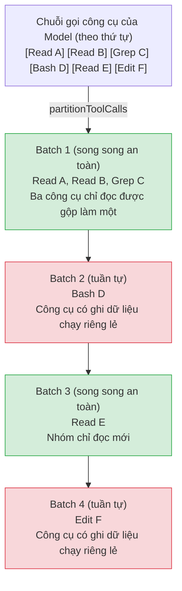

# Chương 4: Điều phối Thực thi Công cụ — Quyền hạn, Song song, Stream và các Ngắt

> **Định vị**: Chương này phân tích cách CC thực thi song song các cuộc gọi công cụ — lập lịch phân vùng (partition scheduling), chuỗi quyết định quyền hạn, trình thực thi dạng stream (streaming executor) và lưu trữ kết quả lớn. Điều kiện tiên quyết: Chương 2 (Hệ thống Công cụ), Chương 3 (Vòng lặp Agent). Đối tượng độc giả: những người muốn hiểu cách CC thực thi song song các cuộc gọi công cụ, kiểm tra quyền và đầu ra dạng stream.

> Chương 3 đã mổ xẻ vòng đời hoàn chỉnh của Vòng lặp Agent. Khi mô hình trả về các khối nội dung có kiểu `tool_use`, vòng lặp sẽ chuyển sang "giai đoạn thực thi công cụ". Chương này đi sâu vào cách triển khai nội bộ của giai đoạn này: cách các cuộc gọi công cụ được phân vùng và lập lịch, các bước vòng đời mà một cuộc gọi công cụ đơn lẻ trải qua, cách chuỗi quyết định quyền lọc qua từng lớp, cách lưu trữ các kết quả lớn và cách trình thực thi dạng stream xử lý song song cùng các ngắt (interrupts).

## 4.1 Tại sao Điều phối Thực thi Công cụ lại Quan trọng

Trong một lần lặp duy nhất của Vòng lặp Agent, mô hình có thể yêu cầu gọi nhiều công cụ cùng một lúc. Ví dụ, mô hình có thể đưa ra ba lệnh gọi `Read` để đọc các file khác nhau, theo sau là một lệnh gọi `Bash` để chạy test. Các lệnh gọi này không thể chạy song song hoàn toàn — các thao tác đọc thì an toàn, nhưng lệnh `git checkout` có thể làm thay đổi trạng thái thư mục làm việc, khiến các thao tác đọc song song nhận về kết quả không nhất quán.

Lớp điều phối công cụ của Claude Code giải quyết ba vấn đề cốt lõi:

1. **Song song an toàn**: Các công cụ chỉ đọc có thể thực thi song song để cải thiện thông lượng; các công cụ có ghi dữ liệu phải thực thi tuần tự để đảm bảo tính nhất quán.
2. **Chốt chặn quyền hạn**: Mỗi công cụ phải vượt qua chuỗi quyết định quyền hạn trước khi thực thi, đảm bảo người dùng giữ quyền kiểm soát đối với các thao tác nguy hiểm.
3. **Quản lý kết quả**: Đầu ra công cụ có thể cực kỳ lớn (lệnh `cat` có thể trả về hàng trăm nghìn ký tự), đòi hỏi phải cắt giảm thông minh để tránh tràn cửa sổ ngữ cảnh.

Các giải pháp cho ba vấn đề này nằm rải rác trong ba file cốt lõi: `toolOrchestration.ts` (lập lịch chạy loạt - batch scheduling), `toolExecution.ts` (vòng đời công cụ đơn lẻ), và `StreamingToolExecutor.ts` (trình thực thi song song dạng stream).

---

## 4.2 partitionToolCalls: Phân vùng cuộc gọi công cụ

### 4.2.1 Thuật toán Phân vùng

Khi Vòng lặp Agent chuyển giao một loạt các `ToolUseBlock` cho lớp điều phối, bước đầu tiên là phân chia chúng thành các "nhóm song song an toàn" (concurrency-safe batches) và "nhóm tuần tự" (serial batches) xen kẽ nhau. Đây là trách nhiệm của hàm `partitionToolCalls`:



**Hình 4-1: Logic phân vùng của partitionToolCalls.** Các công cụ chạy song song an toàn liên tiếp được gộp vào cùng một batch (màu xanh lá); các công cụ chạy tuần tự không an toàn song song nhận một batch chạy riêng độc quyền (màu đỏ).

Cốt lõi của logic phân vùng là một thao tác `reduce` (`restored-src/src/services/tools/toolOrchestration.ts:91-116`):

```typescript
function partitionToolCalls(
  toolUseMessages: ToolUseBlock[],
  toolUseContext: ToolUseContext,
): Batch[] {
  return toolUseMessages.reduce((acc: Batch[], toolUse) => {
    const tool = findToolByName(toolUseContext.options.tools, toolUse.name)
    const parsedInput = tool?.inputSchema.safeParse(toolUse.input)
    const isConcurrencySafe = parsedInput?.success
      ? (() => {
          try {
            return Boolean(tool?.isConcurrencySafe(parsedInput.data))
          } catch {
            return false  // Chiến lược thận trọng: parse thất bại = không an toàn
          }
        })()
      : false
    if (isConcurrencySafe && acc[acc.length - 1]?.isConcurrencySafe) {
      acc[acc.length - 1]!.blocks.push(toolUse)  // Gộp vào batch chạy song song trước đó
    } else {
      acc.push({ isConcurrencySafe, blocks: [toolUse] })  // Tạo batch mới
    }
    return acc
  }, [])
}
```

Các quyết định thiết kế chính:

- **Xác thực trước khi phân loại**: Đầu vào phải vượt qua xác thực schema Zod trước khi gọi `isConcurrencySafe`. Nếu mô hình tạo ra đầu vào không hợp lệ, công cụ sẽ được đánh dấu một cách thận trọng là không an toàn song song.
- **Có ngoại lệ nghĩa là không an toàn**: Nếu bản thân hàm `isConcurrencySafe` ném ra một ngoại lệ (ví dụ: `shell-quote` không phân tích cú pháp được một lệnh Bash), hệ thống cũng sẽ dự phòng chuyển sang thực thi tuần tự. Đây là mẫu hình bảo mật "đóng khi lỗi" (fail-closed) điển hình.
- **Hợp nhất tham lam (Greedy merging)**: Các công cụ chạy song song an toàn liên tiếp được gộp vào cùng một batch cho đến khi gặp một công cụ không an toàn. Điều này duy trì thứ tự gọi tương đối trong khi tối đa hóa khả năng chạy song song.

### 4.2.2 Logic xác định `isConcurrencySafe`

`isConcurrencySafe` là một phương thức bắt buộc trên interface `Tool` (`restored-src/src/Tool.ts:402`), với cách triển khai mặc định trả về `false` (`restored-src/src/Tool.ts:759`). Mỗi công cụ cung cấp cách triển khai riêng dựa trên ngữ nghĩa của nó:

| Công cụ | Chạy song song an toàn? | Lý do |
|------|-------------------|--------|
| FileRead, Glob, Grep | Luôn là `true` | Chỉ đọc thuần túy, không có hiệu ứng phụ. |
| BashTool | Tùy thuộc vào lệnh | Ủy quyền cho `isReadOnly(input)`, phân tích xem lệnh có phải chỉ đọc hay không. |
| FileEdit, FileWrite | `false` | Sửa đổi hệ thống file. |
| AgentTool | `false` | Khởi tạo Agent phụ, có thể sửa đổi trạng thái. |

Lấy `BashTool` làm ví dụ (`restored-src/src/tools/BashTool/BashTool.tsx:434-436`):

```typescript
isConcurrencySafe(input) {
  return this.isReadOnly?.(input) ?? false;
},
```

Tính an toàn song song của công cụ Bash phụ thuộc hoàn toàn vào nội dung câu lệnh: `ls`, `cat`, `git log` là an toàn, trong khi `rm`, `git checkout`, `npm install` thì không. Hàm `isReadOnly` phân tích cấu trúc lệnh để đưa ra quyết định này.

---

## 4.3 runTools: Engine Lập lịch chạy Loạt

`runTools` (`restored-src/src/services/tools/toolOrchestration.ts:19-82`) là điểm vào của lớp điều phối. Nó lặp qua các batch đã phân vùng, gọi `runToolsConcurrently` cho các batch song song an toàn và `runToolsSerially` cho các batch tuần tự.

### 4.3.1 Nhánh Thực thi Song song

Nhánh thực thi song song sử dụng hàm tiện ích `all()` (`restored-src/src/utils/generators.ts:32`) để gộp nhiều generator bất đồng bộ thành một, đi kèm một giới hạn trần song song:

```typescript
async function* runToolsConcurrently(...) {
  yield* all(
    toolUseMessages.map(async function* (toolUse) {
      yield* runToolUse(toolUse, ...)
      markToolUseAsComplete(toolUseContext, toolUse.id)
    }),
    getMaxToolUseConcurrency(),  // Mặc định là 10, có thể ghi đè qua biến môi trường
  )
}
```

Giới hạn trần song song được cấu hình qua biến môi trường `CLAUDE_CODE_MAX_TOOL_USE_CONCURRENCY` (`restored-src/src/services/tools/toolOrchestration.ts:8-11`), mặc định là 10.

Một chi tiết quan trọng là **hoãn áp dụng các bộ sửa đổi ngữ cảnh (context modifiers)**. Các công cụ thực thi song song có thể tạo ra các sửa đổi ngữ cảnh (ví dụ: cập nhật danh sách công cụ khả dụng), nhưng các sửa đổi này không thể áp dụng ngay lập tức trong quá trình chạy song song — điều đó sẽ gây ra tình trạng tranh chấp dữ liệu (race conditions). Do đó, các sửa đổi được thu thập vào một hàng đợi và được áp dụng tuần tự theo thứ tự xuất hiện của công cụ sau khi toàn bộ batch song song hoàn tất (`restored-src/src/services/tools/toolOrchestration.ts:31-63`).

### 4.3.2 Nhánh Thực thi Tuần tự

Nhánh thực thi tuần tự trực tiếp chạy từng công cụ theo thứ tự, áp dụng các thay đổi ngữ cảnh ngay sau mỗi lần thực thi:

```typescript
for (const toolUse of toolUseMessages) {
  for await (const update of runToolUse(toolUse, ...)) {
    if (update.contextModifier) {
      currentContext = update.contextModifier.modifyContext(currentContext)
    }
    yield { message: update.message, newContext: currentContext }
  }
}
```

Điều này đảm bảo các công cụ ghi dữ liệu phía sau có thể nhìn thấy trạng thái ngữ cảnh đã được sửa đổi bởi công cụ trước đó.

---

## 4.4 Vòng đời Thực thi Công cụ Đơn lẻ

Mỗi cuộc gọi công cụ, dù qua nhánh song song hay tuần tự, cuối cùng đều đi vào `runToolUse` (`restored-src/src/services/tools/toolExecution.ts:337`) và `checkPermissionsAndCallTool` (`restored-src/src/services/tools/toolExecution.ts:599`). Hai hàm này tạo nên vòng đời hoàn chỉnh của một công cụ đơn lẻ.

```
┌─────────────────────────────────────────────────────────────────┐
│                    Vòng đời Thực thi Công cụ Đơn lẻ               │
│                                                                  │
│  ① Tìm kiếm ──→ ② Xác thực Schema ──→ ③ Xác thực Đầu vào        │
│       │              │                  │                         │
│   Không thấy?    Thất bại?          Thất bại?                     │
│   ↓ Trả về lỗi   ↓ Trả về lỗi       ↓ Trả về lỗi                  │
│                                                                  │
│  ④ Hook PreToolUse ──→ ⑤ Quyết định Quyền ──→ ⑥ tool.call()      │
│       │                      │               │                   │
│   Hook bị chặn?        Bị từ chối?         Lỗi thực thi?         │
│   ↓ Trả về lỗi         ↓ Trả về lỗi        ↓ Trả về lỗi          │
│                                                                  │
│  ⑦ Ánh xạ Kết quả ──→ ⑧ Lưu trữ Kết quả Lớn ──→ ⑨ Hook PostToolUse │
│                                          │                       │
│                                      Hook chặn tiếp tục?         │
│                                      ↓ Dừng các vòng lặp sau     │
└─────────────────────────────────────────────────────────────────┘
```

**Hình 4-2: Luồng vòng đời của công cụ đơn lẻ.** Mỗi giai đoạn đều có thể tạo ra tin nhắn lỗi kết thúc luồng; đường dẫn thành công sẽ đi qua cả chín giai đoạn từ trái sang phải.

### 4.4.1 Giai đoạn 1: Tìm kiếm Công cụ và Xác thực Đầu vào

`runToolUse` trước tiên tìm kiếm công cụ đích trong tập hợp công cụ khả dụng (`restored-src/src/services/tools/toolExecution.ts:345-356`). Nếu không tìm thấy, nó cũng sẽ kiểm tra các tên alias công cụ cũ — điều này đảm bảo các cuộc gọi công cụ từ các bản ghi phiên cũ vẫn có thể thực thi.

Xác thực đầu vào gồm hai bước:

1. **Xác thực schema**: Sử dụng `safeParse` của Zod để kiểm tra kiểu đối với các tham số đầu ra của mô hình (`restored-src/src/services/tools/toolExecution.ts:615-616`). Các kiểu tham số do mô hình tạo ra không phải lúc nào cũng đúng — ví dụ, nó có thể xuất ra một chuỗi cho một tham số lẽ ra phải là một mảng.
2. **Xác thực ngữ nghĩa**: Thao tác xác thực logic nghiệp vụ đặc thù của công cụ qua `tool.validateInput()` (`restored-src/src/services/tools/toolExecution.ts:683-684`). Ví dụ, công cụ FileEdit có thể kiểm tra xem file đích có tồn tại hay không.

Một chi tiết đáng chú ý: khi một công cụ là công cụ trì hoãn (deferred tool) và schema của nó chưa được gửi đến API, hệ thống sẽ chèn một gợi ý trong thông báo lỗi Zod hướng dẫn mô hình tải schema công cụ qua `ToolSearch` trước khi thử lại (`restored-src/src/services/tools/toolExecution.ts:578-597`).

### 4.4.2 Giai đoạn 2: Khởi chạy Bộ phân loại Suy đoán

Trước khi đi vào kiểm tra quyền, nếu công cụ hiện tại là một công cụ Bash, hệ thống sẽ **khởi chạy song song bộ phân loại cho phép** dưới dạng suy đoán (speculative classifier check, `restored-src/src/services/tools/toolExecution.ts:740-752`). Bộ phân loại này chạy song song với các Hook PreToolUse, nhờ đó kết quả có thể đã sẵn sàng khi người dùng đưa ra quyết định cấp quyền. Đây là một tối ưu hóa giúp tránh việc người dùng phải chờ đợi độ trễ của bộ phân loại.

### 4.4.3 Giai đoạn 3: Hook PreToolUse

Hệ thống thực thi tất cả các hook `PreToolUse` đã đăng ký (`restored-src/src/services/tools/toolExecution.ts:800-862`). Các hook có thể tạo ra các hiệu ứng sau:

- **Sửa đổi đầu vào**: Trả về `updatedInput` để thay thế các tham số gốc.
- **Đưa ra quyết định quyền**: Trả về `allow`, `deny`, hoặc `ask` để ảnh hưởng đến việc kiểm tra quyền tiếp theo.
- **Chặn thực thi**: Thiết lập cờ `preventContinuation`.
- **Thêm ngữ cảnh**: Chèn thêm thông tin bổ sung để mô hình tham khảo.

Nếu việc thực thi hook bị gián đoạn bởi một tín hiệu abort, hệ thống sẽ dừng ngay lập tức và trả về một tin nhắn hủy bỏ.

### 4.4.4 Giai đoạn 4: Chuỗi Quyết định Quyền hạn

Hệ thống phân quyền là phần phức tạp nhất trong vòng đời thực thi công cụ. Chuỗi quyết định này được điều phối bởi `resolveHookPermissionDecision` (`restored-src/src/services/tools/toolHooks.ts:332-433`), tuân theo thứ tự ưu tiên sau:

```
┌──────────────────────────────────────────────────────────────────┐
│                     Chuỗi Quyết định Quyền hạn                    │
│                                                                    │
│  Quyết định của Hook PreToolUse                                    │
│  ├─ allow ──→ Kiểm tra quy tắc phân quyền (settings.json deny/ask) │
│  │            ├─ Không khớp quy tắc ──→ Cho phép (bỏ qua hỏi)      │
│  │            ├─ quy tắc deny ──→ Từ chối (quy tắc đè Hook)        │
│  │            └─ quy tắc ask ──→ Hỏi ý kiến (quy tắc đè Hook)      │
│  ├─ deny ──→ Từ chối trực tiếp                                     │
│  └─ ask ──→ Vào luồng phân quyền bình thường (với                   │
│             forceDecision của Hook)                                 │
│                                                                    │
│  Không có Quyết định Hook ──→ Luồng phân quyền bình thường         │
│  ├─ Tự kiểm tra checkPermissions của công cụ                        │
│  ├─ Khớp quy tắc chung (settings.json)                             │
│  ├─ Bộ phân loại YOLO/Tự động (xem Chương 17)                      │
│  └─ Hỏi ý kiến tương tác người dùng (xem Chương 16)                 │
└──────────────────────────────────────────────────────────────────┘
```

**Hình 4-3: Sơ đồ chuỗi quyết định quyền hạn.** Quyết định `allow` của một Hook không thể đè các quy tắc `deny` trong settings.json — đây là minh chứng cho thiết kế phòng thủ theo chiều sâu (defense in depth).

Một bất biến quan trọng của chuỗi quyết định: **Quyết định `allow` của một Hook không thể bỏ qua các quy tắc deny/ask trong settings.json**. Ngay cả khi một hook phê duyệt một thao tác, nếu settings.json chứa một quy tắc từ chối rõ ràng, thao tác đó vẫn bị từ chối. Điều này đảm bảo các ranh giới bảo mật do người dùng cấu hình luôn luôn có hiệu lực (`restored-src/src/services/tools/toolHooks.ts:373-405`).

Kiến trúc hoàn chỉnh của hệ thống phân quyền được trình bày trong Chương 16; việc triển khai bộ phân loại YOLO được đề cập trong Chương 17.

### 4.4.5 Giai đoạn 5: Thực thi Công cụ

Sau khi quyền được thông qua, hệ thống gọi `tool.call()` (`restored-src/src/services/tools/toolExecution.ts:1207-1222`). Việc thực thi được bọc giữa hai hàm `startSessionActivity('tool_exec')` và `stopSessionActivity('tool_exec')` để theo dõi trạng thái phiên hoạt động.

Các sự kiện tiến độ trong quá trình thực thi công cụ được truyền qua một đối tượng `Stream` (`restored-src/src/services/tools/toolExecution.ts:509`). Hàm `streamedCheckPermissionsAndCallTool` gộp Promise kết quả của `checkPermissionsAndCallTool` với các sự kiện tiến độ thời gian thực thành cùng một iterable bất đồng bộ, cho phép bên gọi nhận được cả cập nhật tiến trình và kết quả cuối cùng.

### 4.4.6 Giai đoạn 6: Hook PostToolUse và Xử lý Kết quả

Sau khi thực thi công cụ thành công, hệ thống thực hiện tuần tự:

1. **Ánh xạ kết quả**: Chuyển đổi đầu ra của công cụ sang định dạng API qua `tool.mapToolResultToToolResultBlockParam()` (`restored-src/src/services/tools/toolExecution.ts:1292-1293`).
2. **Lưu trữ kết quả lớn**: Nếu kết quả vượt quá giới hạn trần, ghi nó vào đĩa và thay thế bằng một tóm tắt (xem Mục 4.6).
3. **Các Hook PostToolUse**: Thực thi các hook sau chạy, vốn có thể sửa đổi đầu ra công cụ MCP hoặc ngăn chặn việc tiếp tục vòng lặp sau đó (`restored-src/src/services/tools/toolExecution.ts:1483-1531`).

Đối với các công cụ MCP, các hook có thể sửa đổi đầu ra bằng cách trả về `updatedMCPToolOutput`. Sự sửa đổi này có hiệu lực trước lệnh gọi `addToolResult`, đảm bảo phiên bản đã sửa đổi là phiên bản được lưu vào lịch sử tin nhắn. Đối với các công cụ không phải MCP, việc ánh xạ kết quả hoàn tất trước các hook, do đó các hook chỉ có thể bổ sung thông tin chứ không thể sửa đổi kết quả gốc.

Nếu thực thi công cụ thất bại, hệ thống sẽ thực thi các hook `PostToolUseFailure` (`restored-src/src/services/tools/toolExecution.ts:1700-1713`), cho phép các hook kiểm tra lỗi và tiêm thêm ngữ cảnh.

---

## 4.5 StreamingToolExecutor: Trình thực thi Song song dạng Stream

Hàm `runTools` mô tả ở trên hoạt động ở chế độ hàng loạt (batch mode) — nó đợi tất cả các khối `tool_use` đến đầy đủ trước khi thực hiện phân vùng và chạy. Nhưng trong các kịch bản phản hồi dạng stream, các khối gọi công cụ được phân tích cú pháp từng khối một từ stream API. `StreamingToolExecutor` (`restored-src/src/services/tools/StreamingToolExecutor.ts`) thực thi một chiến lược khác: **bắt đầu chạy các cuộc gọi công cụ ngay khi chúng đến, không đợi tất cả sẵn sàng**.

### 4.5.1 Mô hình Máy Trạng thái

`StreamingToolExecutor` duy trì một vòng đời bốn trạng thái cho từng công cụ:

```
queued ──→ executing ──→ completed ──→ yielded
```

- **queued**: Công cụ đã đăng ký nhưng chưa bắt đầu chạy.
- **executing**: Công cụ hiện đang chạy.
- **completed**: Công cụ đã hoàn tất, kết quả được đưa vào bộ đệm.
- **yielded**: Kết quả đã được bên gọi tiêu thụ.

Các chuyển đổi trạng thái được thúc đẩy bởi hàm `processQueue()` (`restored-src/src/services/tools/StreamingToolExecutor.ts:140-151`). Mỗi khi một công cụ hoàn tất hoặc một công cụ mới được đưa vào hàng đợi, bộ xử lý hàng đợi sẽ được đánh thức để thử khởi chạy công cụ khả thi tiếp theo.

### 4.5.2 Kiểm soát Song song

Phương thức `canExecuteTool` (`restored-src/src/services/tools/StreamingToolExecutor.ts:129-135`) triển khai chiến lược song song cốt lõi:

```typescript
private canExecuteTool(isConcurrencySafe: boolean): boolean {
  const executingTools = this.tools.filter(t => t.status === 'executing')
  return (
    executingTools.length === 0 ||
    (isConcurrencySafe && executingTools.every(t => t.isConcurrencySafe))
  )
}
```

Các quy tắc rất súc tích:
- Nếu không có công cụ nào đang chạy, bất kỳ công cụ nào cũng có thể bắt đầu.
- Nếu có công cụ đang chạy, một công cụ mới chỉ có thể bắt đầu nếu cả bản thân nó và tất cả các công cụ đang chạy đều an toàn song song.
- Các công cụ không an toàn song song đòi hỏi quyền thực thi độc quyền.

### 4.5.3 Hủy Lan truyền Lỗi Bash (Bash Error Cascade Abort)

`StreamingToolExecutor` triển khai một cơ chế xử lý lỗi rất thông minh: khi một công cụ Bash báo lỗi, tất cả các công cụ Bash song song đồng nghiệp khác sẽ bị hủy bỏ (`restored-src/src/services/tools/StreamingToolExecutor.ts:357-363`).

```typescript
if (tool.block.name === BASH_TOOL_NAME) {
  this.hasErrored = true
  this.erroredToolDescription = this.getToolDescription(tool)
  this.siblingAbortController.abort('sibling_error')
}
```

Thiết kế này dựa trên một quan sát thực tế: các lệnh Bash thường có các chuỗi phụ thuộc ngầm định. Nếu lệnh `mkdir` thất bại, một lệnh `cp` tiếp theo chắc chắn cũng sẽ thất bại — thay vì để mỗi lệnh báo lỗi độc lập, việc chủ động hủy trước sẽ tốt hơn. Nhưng chiến lược này **chỉ áp dụng cho các công cụ Bash** — các công cụ như `Read`, `WebFetch` là độc lập; lỗi của một công cụ không nên ảnh hưởng đến các công cụ khác.

Luồng lan truyền lỗi sử dụng một `siblingAbortController`, là một controller con của `toolUseContext.abortController`. Việc hủy controller đồng nghiệp sẽ hủy các tiến trình con đang chạy nhưng **không** hủy controller cha — nghĩa là bản thân Vòng lặp Agent sẽ không kết thúc lượt hiện tại do một lỗi Bash đơn lẻ.

### 4.5.4 Hành vi Ngắt

Mỗi công cụ có thể tự khai báo hành vi ngắt của mình: `'cancel'` hoặc `'block'` (`restored-src/src/Tool.ts:416`). Khi người dùng gửi tín hiệu ngắt (interrupt signal):

- Các công cụ **cancel**: Nhận ngay một tin nhắn hủy; các kết quả được thay bằng một `REJECT_MESSAGE` tổng hợp.
- Các công cụ **block**: Tiếp tục chạy cho đến khi hoàn tất (không phản hồi tín hiệu ngắt).

`StreamingToolExecutor` theo dõi xem tất cả các công cụ đang chạy có thể ngắt được hay không qua `updateInterruptibleState()` (`restored-src/src/services/tools/StreamingToolExecutor.ts:254-259`). Thông tin này được chuyển cho lớp UI để quyết định có hiển thị "Bấm ESC để hủy" hay không.

### 4.5.5 Phân phối ngay các Tin nhắn Tiến độ

Kết quả công cụ thông thường phải được phân phối theo thứ tự (để bảo toàn ngữ nghĩa thứ tự), nhưng **các tin nhắn tiến độ có thể được phân phối ngay lập tức** (`restored-src/src/services/tools/StreamingToolExecutor.ts:417-420`). `StreamingToolExecutor` lưu các tin nhắn tiến trình trong một hàng đợi `pendingProgress` riêng biệt; `getCompletedResults()` yield các tin nhắn tiến độ trước khi quét qua danh sách công cụ, không bị ràng buộc bởi thứ tự hoàn tất của công cụ.

Khi không có kết quả nào hoàn thành nhưng các công cụ vẫn đang chạy, `getRemainingResults()` sử dụng `Promise.race` để đợi một trong hai sự kiện: hoặc có công cụ hoàn tất **hoặc** có tin nhắn tiến độ mới xuất hiện (`restored-src/src/services/tools/StreamingToolExecutor.ts:476-481`), tránh việc thăm dò (polling) không cần thiết.

---

## 4.6 Quản lý Kết quả Công cụ: Ngân sách và Lưu trữ

### 4.6.1 Lưu trữ Kết quả Lớn trên Đĩa

Một lệnh `cat` của công cụ `Bash` có thể trả về hàng trăm nghìn ký tự. Việc đưa một kết quả khổng lồ như vậy trực tiếp vào cửa sổ ngữ cảnh không chỉ lãng phí ngân sách token mà còn có thể khiến sự chú ý của mô hình bị phân tán. File `toolResultStorage.ts` triển khai cơ chế lưu trữ kết quả lớn này trên đĩa.

Việc xác định ngưỡng lưu trữ tuân theo thứ tự ưu tiên sau (`restored-src/src/utils/toolResultStorage.ts:55-78`):

1. **Ghi đè bằng GrowthBook**: Đội ngũ vận hành có thể thiết lập các ngưỡng tùy chỉnh cho các công cụ cụ thể thông qua Feature Flag (`tengu_satin_quoll`).
2. **Giá trị do công cụ khai báo**: Thuộc tính `maxResultSizeChars` của từng công cụ.
3. **Mức trần toàn cục**: `DEFAULT_MAX_RESULT_SIZE_CHARS = 50,000` ký tự (`restored-src/src/constants/toolLimits.ts:13`).

Ngưỡng cuối cùng là giá trị nhỏ hơn giữa mức khai báo của công cụ và mức trần toàn cục. Nhưng nếu một công cụ khai báo `Infinity`, việc ghi đĩa sẽ bị bỏ qua — ví dụ, công cụ `Read` tự quản lý ranh giới đầu ra của nó, và việc lưu đầu ra của nó vào một file chỉ để mô hình gọi lệnh `Read` đọc lại sẽ tạo ra một vòng lặp tham chiếu.

Khi kết quả vượt quá ngưỡng, hàm `persistToolResult` (`restored-src/src/utils/toolResultStorage.ts:137`) ghi toàn bộ nội dung vào một thư mục con `tool-results/` nằm dưới thư mục phiên làm việc, sau đó tạo một tin nhắn tóm tắt kèm bản xem trước:

```
<persisted-output>
Output too large (245.0 KB). Full output saved to: /path/to/tool-results/abc123.txt

Preview (first 2.0 KB):
[First 2000 bytes of content...]
...
</persisted-output>
```

Quá trình tạo bản xem trước (`restored-src/src/utils/toolResultStorage.ts:339-356`) cố gắng cắt bớt tại các ranh giới dòng mới để tránh cắt ngang dòng. Phạm vi tìm kiếm điểm cắt là ký tự xuống dòng cuối cùng nằm trong khoảng 50% đến 100% của ngưỡng.

### 4.6.2 Ngân sách Tổng hợp trên mỗi Tin nhắn

Bên cạnh các giới hạn kích thước cho từng công cụ, hệ thống cũng duy trì một **ngân sách tổng hợp trên mỗi tin nhắn**. Khi có nhiều công cụ chạy song song trong một lượt và mỗi công cụ trả về kết quả gần với ngưỡng giới hạn, tổng kích thước của chúng có thể vượt quá xa các giới hạn hợp lý (ví dụ: 10 công cụ, mỗi công cụ trả về 40K = 400K ký tự).

Ngân sách tổng hợp mặc định là 200.000 ký tự (`restored-src/src/constants/toolLimits.ts:49`), có thể ghi đè qua GrowthBook Flag (`tengu_hawthorn_window`). Khi vượt quá, hệ thống sẽ lưu trữ các kết quả lên đĩa bắt đầu từ kết quả lớn nhất cho đến khi tổng kích thước giảm xuống dưới mức ngân sách.

Để duy trì **tính ổn định của prompt cache**, hệ thống ngân sách tổng hợp duy trì một trạng thái `ContentReplacementState` (`restored-src/src/utils/toolResultStorage.ts:390-393`), ghi lại kết quả công cụ nào đã được lưu trữ trên đĩa. Một khi kết quả đã được ghi đĩa trong một lượt đánh giá, hệ thống sẽ sử dụng chính phiên bản ghi đĩa đó trong tất cả các lượt đánh giá tiếp theo — ngay cả khi tổng dung lượng trong các lượt sau không vượt quá ngân sách. Điều này tránh hiện tượng "xung đột cache" (cache thrashing): cùng một tin nhắn có nội dung khác nhau giữa các lần gọi API, làm mất hiệu lực của bộ nhớ đệm tiền tố (prefix cache).

### 4.6.3 Đệm Kết quả Rỗng (Empty Result Padding)

Một chi tiết dễ bị bỏ qua: nội dung `tool_result` rỗng có thể khiến một số mô hình (đặc biệt là Capybara) diễn giải sai đó là ranh giới lượt hội thoại, dẫn đến việc xuất ra chuỗi dừng `\n\nHuman:` và kết thúc phản hồi sớm (`restored-src/src/utils/toolResultStorage.ts:280-295`). Hệ thống ngăn chặn điều này bằng cách phát hiện các kết quả rỗng và chèn văn bản giữ chỗ (ví dụ: `(Bash completed with no output)`).

---

## 4.7 Các Stop Hook: Điểm ngắt sau khi Thực thi Công cụ

Cả hai hook PreToolUse và PostToolUse đều có thể yêu cầu **dừng việc tiếp tục vòng lặp tiếp theo** (prevent continuation). Điều này được triển khai qua cờ `preventContinuation`.

Khi một hook PreToolUse thiết lập cờ này (`restored-src/src/services/tools/toolHooks.ts:500-508`), công cụ vẫn được thực thi (trừ khi có quyết định deny kèm theo), nhưng sau khi thực thi hoàn tất, hệ thống sẽ chèn thêm một tin nhắn đính kèm kiểu `hook_stopped_continuation` vào danh sách tin nhắn (`restored-src/src/services/tools/toolExecution.ts:1572-1582`). Vòng lặp Agent phát hiện kiểu tin nhắn này và sẽ kết thúc lần lặp hiện tại, không gửi tiếp các kết quả cho mô hình trong lượt suy luận tiếp theo.

Các hook PostToolUse cũng có thể ngăn chặn việc tiếp tục tương tự (`restored-src/src/services/tools/toolHooks.ts:118-129`) và đây là trường hợp sử dụng phổ biến hơn — ví dụ, một hook có thể quyết định ngắt vòng lặp Agent sau khi phát hiện kết quả của một thao tác nguy hiểm.

---

## 4.8 Trích xuất Mẫu hình (Pattern Extraction)

### Mẫu hình 1: Phân vùng Pipeline bằng Hợp nhất Tham lam

Việc phân vùng các cuộc gọi công cụ sử dụng chiến lược "hợp nhất tham lam" (greedy merge): các công cụ cùng loại liên tiếp được gộp vào cùng một batch, và các điểm chuyển đổi loại công cụ trở thành ranh giới batch. Ý tưởng cốt lõi của mẫu hình này là — **giữa việc đảm bảo thứ tự và hiệu quả chạy song song, hãy chọn một giải pháp trung gian đơn giản**. Chạy song song hoàn toàn (bỏ qua thứ tự) có thể gây ra sự không nhất quán; chạy tuần tự hoàn toàn (bỏ qua loại công cụ) sẽ gây lãng phí hiệu năng. Hợp nhất tham lam đạt được khả năng chạy song song gần như tối ưu trong khi vẫn duy trì thứ tự tương đối.

### Mẫu hình 2: Các giá trị mặc định Bảo mật "Đóng khi lỗi" (Fail-Closed)

`isConcurrencySafe` mặc định trả về `false` khi parse thất bại hoặc gặp ngoại lệ; cách triển khai mặc định của interface `Tool` cũng là `false`. Quyết định `allow` của các hook phân quyền không thể đè lên các quy tắc deny. Đây đều là những biểu hiện của mẫu hình "đóng khi lỗi" (fail-closed) — **khi hệ thống không thể xác định tính an toàn, hãy chọn hành vi thận trọng hơn**. Trong các hệ thống AI Agent, nguyên tắc này đặc biệt quan trọng: đầu ra của mô hình là không thể dự đoán, và bất kỳ thiết kế lạc quan nào giả định "điều này bình thường sẽ không xảy ra" đều có thể trở thành một lỗ hổng bảo mật.

### Mẫu hình 3: Lan truyền lỗi phân tầng (Layered Error Cascade)

Lỗi Bash sẽ hủy các công cụ Bash song song đồng nghiệp nhưng không ảnh hưởng đến các công cụ độc lập như Read/Grep; các abort controller đồng nghiệp hủy tiến trình con nhưng không hủy Vòng lặp Agent cha. Sự **lan truyền chọn lọc** này tránh được hai thái cực: cô lập hoàn toàn (lỗi bị bỏ qua) hoặc hủy bỏ toàn cục (một lỗi nhỏ làm hỏng cả phiên làm việc).

### Mẫu hình 4: Quản lý Kết quả Ổn định với Cache (Cache-Stable Result Management)

Hệ thống lưu trữ kết quả lớn sử dụng `ContentReplacementState` để đảm bảo cùng một kết quả luôn sử dụng cùng một nội dung thay thế qua các lệnh gọi API khác nhau. Đây là chìa khóa để tối ưu hóa prompt cache — **vì hiệu năng, hãy đánh đổi một chút sự đơn giản về mặt logic để duy trì tính xác định (determinism)**. Các thiết kế ổn định cache tương tự sẽ lặp lại xuyên suốt kiến trúc lưu cache ở các Chương 13-15.

---

## Những việc bạn có thể làm

Dưới đây là các khuyến nghị thực tế được trích xuất từ cơ chế điều phối thực thi công cụ của Claude Code, có thể áp dụng cho bất kỳ hệ thống AI Agent nào cần điều phối nhiều cuộc gọi công cụ:

- **Triển khai phân vùng chạy song song dựa trên đầu vào.** Đừng chỉ tuần tự hóa tất cả các cuộc gọi công cụ một cách đơn giản. Hãy đánh giá xem mỗi cuộc gọi có phải chỉ đọc/an toàn song song hay không dựa trên đầu vào thực tế của nó, gộp các cuộc gọi an toàn liên tiếp thành các batch song song để tối đa hóa thông lượng.
- **Đặt mặc định "đóng khi lỗi" cho tính an toàn song song.** Nếu việc phân tích cú pháp đầu vào thất bại hoặc `isConcurrencySafe` ném ra ngoại lệ, hãy mặc định chạy tuần tự. Đừng bao giờ giả định chạy song song là an toàn khi không chắc chắn.
- **Triển khai hủy lan truyền chọn lọc cho lỗi Bash.** Khi một lệnh shell thất bại, hãy hủy các lệnh shell chạy song song đồng nghiệp (chúng có thể có các phụ thuộc ngầm định), nhưng đừng hủy các công cụ chỉ đọc độc lập (như `Read`, `Grep`). Sử dụng các `AbortController` con để tránh việc hủy toàn bộ Vòng lặp Agent.
- **Triển khai kiểm soát ngân sách hai cấp độ cho các kết quả lớn.** Đặt giới hạn ký tự cho từng công cụ và giới hạn tổng hợp cho tất cả kết quả trong một tin nhắn. Khi vượt quá ngân sách, hãy lưu vào đĩa và trả về bản xem trước, bắt đầu từ các kết quả lớn nhất.
- **Duy trì tính xác định khi thay thế kết quả.** Một khi kết quả công cụ được lưu đĩa và thay thế, hãy sử dụng cùng một phiên bản thay thế đó trong tất cả các cuộc gọi API tiếp theo, ngay cả khi tổng ngân sách hiện tại không bị vượt quá. Điều này cực kỳ quan trọng đối với tỷ lệ hit của prompt cache.
- **Chèn văn bản giữ chỗ cho kết quả rỗng.** Kết quả `tool_result` rỗng có thể bị mô hình diễn giải sai thành ranh giới lượt hội thoại. Hãy chèn các văn bản như `(Bash completed with no output)` để ngăn mô hình kết thúc phản hồi sớm một cách bất ngờ.
- **Thiết kế kiểm tra quyền dưới dạng phòng thủ theo chiều sâu.** Quyết định `allow` của một Hook không được phép bỏ qua các quy tắc `deny` do người dùng cấu hình. Việc kiểm tra quyền nhiều lớp (hook -> bản thân công cụ -> khớp quy tắc -> tương tác người dùng) đảm bảo các ranh giới bảo mật luôn hiệu quả.

---

## Tiến hóa Phiên bản: Thay đổi trong v2.1.92

> Phân tích dưới đây dựa trên suy luận tín hiệu chuỗi bundle của v2.1.92, không có bằng chứng mã nguồn hoàn chỉnh. Các thay đổi đã được tài liệu hóa cho v2.1.91 (như theo dõi trạng thái file bằng `staleReadFileStateHint`, v.v.) sẽ không được lặp lại ở đây.

#### AdvisorTool — Công cụ Không thực thi đầu tiên

Một cái tên hoàn toàn mới xuất hiện trong danh sách công cụ của v2.1.92: `AdvisorTool`. Đi kèm với các tín hiệu sự kiện trong bundle (`tengu_advisor_command`, `tengu_advisor_dialog_shown`, `tengu_advisor_tool_call`, `tengu_advisor_result`) và các định danh liên quan như `advisor_model`, `advisor_redacted_result`, `advisor_tool_token_usage`, có thể suy luận rằng đây là một **Agent cố vấn nhúng (embedded advisor Agent)** — nó có chuỗi gọi model độc lập của riêng mình (`advisor_model` ám chỉ một model hoặc cấu hình riêng), tạo ra các cuộc gọi công cụ (`advisor_tool_call`) và kết quả có thể trải qua quá trình ẩn thông tin (`advisor_redacted_result`).

Điều này chưa từng có tiền lệ trong hệ thống hơn 40 công cụ của v2.1.88 (xem Chương 2). Tất cả các công cụ trong v2.1.88 đều thuộc **loại thực thi** — Read đọc file, Bash chạy lệnh, Edit sửa file, Grep tìm nội dung. Đặc điểm chung của chúng là trực tiếp thay đổi trạng thái môi trường hoặc trả về dữ liệu môi trường. AdvisorTool phá vỡ khuôn mẫu này: nó không thực thi bất kỳ thao tác bên ngoài nào, mà thay vào đó **cung cấp các gợi ý cho người dùng hoặc cho Agent**.

Lựa chọn thiết kế này phản ánh một hướng tiến hóa của các hệ thống Agent: **từ chỗ "chỉ làm việc" chuyển sang "gợi ý trước, làm việc sau."** Điều này phù hợp với triết lý của chế độ lập kế hoạch (plan mode - xem Chương 20c) — thống nhất ý đồ trước khi thực thi. Sự khác biệt là chế độ lập kế hoạch là một luồng công việc do người dùng khởi xướng, trong khi AdvisorTool có thể kích hoạt tự động trong quá trình Agent hoạt động (`advisor_dialog_shown` gợi ý rằng nó sẽ hiển thị một hộp thoại).

Sự tồn tại của biến môi trường `CLAUDE_CODE_DISABLE_ADVISOR_TOOL` cho thấy tính năng này có thể tắt được — nhất quán với nguyên tắc "tự trị lũy tiến" (progressive autonomy) đã được thiết lập của Claude Code (xem Chương 27): các khả năng mới được bật mặc định nhưng cho phép chọn rút lui (opt-out).

#### Loại bỏ Trùng lặp Kết quả Công cụ (Tool Result Deduplication) — Tuyến Phòng thủ Mới cho Vệ sinh Ngữ cảnh

Sự kiện `tengu_tool_result_dedup` tiết lộ một cơ chế loại bỏ trùng lặp ở lớp kết quả công cụ. Trong v2.1.88, việc vệ sinh ngữ cảnh phụ thuộc chủ yếu vào hai tuyến phòng thủ: cắt ngắn kết quả của từng công cụ (`DEFAULT_MAX_RESULT_SIZE_CHARS = 50,000`, xem `restored-src/src/constants/toolLimits.ts:13`) và nén (compaction - xem Chương 11). v2.1.92 bổ sung tuyến thứ ba: **loại bỏ trùng lặp kết quả công cụ**.

Điều này tạo thành một chuỗi hoàn chỉnh với tính năng `tengu_file_read_reread` mới được thêm vào v2.1.91 (phát hiện đọc lại file trùng lặp): `file_read_reread` phát hiện ở đầu vào "bạn đang đọc lại cùng một file", trong khi `tool_result_dedup` xử lý ở đầu ra "kết quả này giống hệt như trước, không cần phải chiếm dụng cửa sổ ngữ cảnh một cách dư thừa".

Triết lý thiết kế: ngữ cảnh là tài nguyên quý giá nhất của Agent, và mọi lớp đều phải có cơ chế dọn dẹp và loại bỏ trùng lặp — loại bỏ trùng lặp đầu vào, loại bỏ trùng lặp đầu ra, nén. Ba tuyến phòng thủ này canh giữ các giai đoạn khác nhau, cùng nhau duy trì vệ sinh ngữ cảnh.

## Tiến hóa Phiên bản: Thay đổi trong v2.1.91

> Phân tích dưới đây dựa trên so sánh tín hiệu bundle của v2.1.91.

File `sdk-tools.d.ts` của v2.1.91 đã bổ sung một trường `staleReadFileStateHint` mới vào siêu dữ liệu (metadata) của kết quả công cụ — khi việc thực thi công cụ khiến thời gian sửa đổi (mtime) của một file đã đọc trước đó bị thay đổi, hệ thống sẽ tự động tạo ra một gợi ý lỗi thời (staleness hint). Đây là một kênh đầu ra mới cho lớp điều phối thực thi công cụ, cho phép mô hình nhận biết các hiệu ứng phụ từ các thao tác của chính nó lên hệ thống file.
