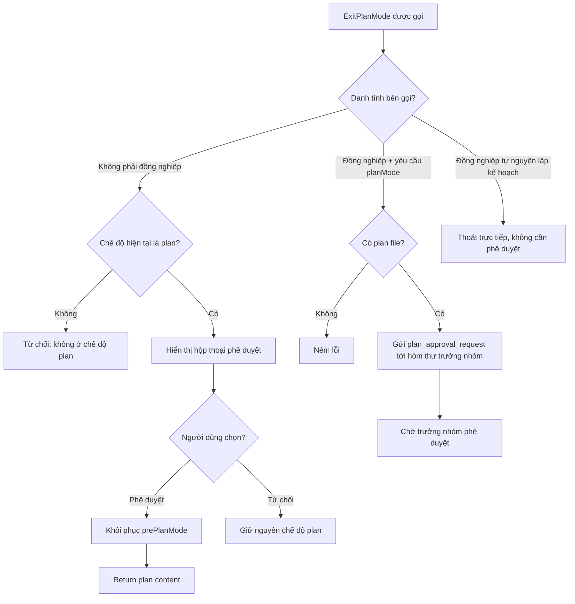
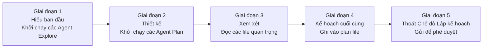

# Chương 4b: Chế độ Lập kế hoạch — Từ "Làm Trước Hỏi Sau" đến "Nhìn Trước Bước Sau"

> **Định vị**: Chương này phân tích Chế độ Lập kế hoạch (Plan Mode) của Claude Code — một máy trạng thái hoàn chỉnh với triết lý "lập kế hoạch trước, thực thi sau". Điều kiện tiên quyết: Chương 3 (Vòng lặp Agent), Chương 4 (Điều phối Thực thi Công cụ). Sử dụng khi: bạn muốn hiểu cách CC triển khai cơ chế phê duyệt kế hoạch đồng nhất với con người, hoặc muốn tự mình triển khai một luồng công việc tương tự trong AI Agent của riêng bạn.

---

## Tại sao Điều này lại Quan trọng

Một trong những rủi ro lớn nhất đối với các AI coding agent không phải là viết code sai — mà là **viết đúng code cho một mục tiêu sai**. Khi người dùng nói "hãy cấu trúc lại module auth", agent có thể chọn JWT trong khi người dùng thực tế đang nghĩ đến OAuth2. Nếu agent bắt đầu triển khai ngay lập tức, cho đến khi người dùng phát hiện ra hướng đi bị sai, hàng chục file có thể đã bị sửa đổi.

Chế độ Lập kế hoạch (Plan Mode) giải quyết vấn đề **đồng nhất ý đồ (intent alignment)**: trước khi agent sửa đổi bất kỳ mã nguồn nào, trước tiên nó sẽ khám phá kho mã nguồn, tạo một kế hoạch và xin phê duyệt từ người dùng. Đây không phải là một thao tác "hỏi trước khi làm" đơn thuần — nó là một máy trạng thái hoàn chỉnh bao gồm chuyển đổi chế độ phân quyền, lưu trữ plan file trên đĩa, chèn các prompt quy trình, giao thức phê duyệt liên đội và các tương tác phức tạp với Chế độ Tự động (Auto Mode).

Từ góc độ kỹ thuật, Plan Mode thể hiện ba quyết định thiết kế chính:

1. **Các chế độ phân quyền làm ranh giới hành vi**: Sau khi vào chế độ plan, tập hợp công cụ của model bị giới hạn ở chế độ chỉ đọc — không phải thông qua một prompt kiểu "làm ơn đừng sửa file", mà thông qua hệ thống phân quyền chặn các thao tác ghi trước khi thực thi công cụ.
2. **Các plan file làm phương tiện đồng nhất**: Kế hoạch không nằm lại trong ngữ cảnh hội thoại dưới dạng văn bản — chúng được ghi xuống đĩa dưới dạng các file Markdown giúp người dùng có thể sửa bằng các trình soạn thảo bên ngoài và các phiên làm việc từ xa CCR có thể truyền ngược lại thiết bị đầu cuối cục bộ.
3. **Một máy trạng thái, không phải một cờ boolean**: Plan Mode không phải là một cờ `isPlanMode` đơn giản — nó là một chuỗi chuyển đổi trạng thái hoàn chỉnh bao gồm đi vào, khám phá, phê duyệt, thoát ra và khôi phục, nơi mỗi chuyển đổi đều đi kèm các hiệu ứng phụ cần quản lý.

---

## 4b.1 Máy Trạng thái Chế độ Lập kế hoạch: Đi vào và Đi ra

Cốt lõi của Plan Mode là hai công cụ — `EnterPlanMode` và `ExitPlanMode` — và các chuyển đổi chế độ phân quyền mà chúng kích hoạt.

### Đi vào Chế độ Lập kế hoạch

Có hai con đường để vào Plan Mode:

1. **Model chủ động gọi công cụ `EnterPlanMode`** — yêu cầu người dùng xác nhận.
2. **Người dùng gõ lệnh `/plan` thủ công** — có hiệu lực ngay lập tức.

Cả hai con đường cuối cùng đều gọi chung một hàm cốt lõi, `prepareContextForPlanMode`:

```typescript
// restored-src/src/utils/permissions/permissionSetup.ts:1462-1492
export function prepareContextForPlanMode(
  context: ToolPermissionContext,
): ToolPermissionContext {
  const currentMode = context.mode
  if (currentMode === 'plan') return context
  if (feature('TRANSCRIPT_CLASSIFIER')) {
    const planAutoMode = shouldPlanUseAutoMode()
    if (currentMode === 'auto') {
      if (planAutoMode) {
        return { ...context, prePlanMode: 'auto' }
      }
      // ... tắt chế độ auto và khôi phục các quyền bị loại bỏ bởi auto
    }
    if (planAutoMode && currentMode !== 'bypassPermissions') {
      autoModeStateModule?.setAutoModeActive(true)
      return {
        ...stripDangerousPermissionsForAutoMode(context),
        prePlanMode: currentMode,
      }
    }
  }
  return { ...context, prePlanMode: currentMode }
}
```

Thiết kế chính: **Trường `prePlanMode` lưu lại chế độ trước khi vào**. Đây là một mẫu hình "lưu/khôi phục" (save/restore) điển hình — khi vào chế độ plan, chế độ hiện tại (có thể là `default`, `auto`, hoặc `acceptEdits`) được cất giữ trong `prePlanMode` và được khôi phục khi thoát. Điều này đảm bảo Plan Mode là một **thao tác có thể đảo ngược** mà không làm mất cấu hình phân quyền trước đó của người dùng.

Bản thân định nghĩa công cụ `EnterPlanMode` tiết lộ một số ràng buộc quan trọng:

```typescript
// restored-src/src/tools/EnterPlanModeTool/EnterPlanModeTool.ts:36-102
export const EnterPlanModeTool: Tool<InputSchema, Output> = buildTool({
  name: ENTER_PLAN_MODE_TOOL_NAME,
  shouldDefer: true,
  isEnabled() {
    // Tắt khi --channels đang hoạt động, ngăn chế độ plan trở thành một cạm bẫy
    if ((feature('KAIROS') || feature('KAIROS_CHANNELS')) &&
        getAllowedChannels().length > 0) {
      return false
    }
    return true
  },
  isConcurrencySafe() { return true },
  isReadOnly() { return true },
  async call(_input, context) {
    if (context.agentId) {
      throw new Error('EnterPlanMode tool cannot be used in agent contexts')
    }
    // ... thực hiện chuyển đổi chế độ
  },
})
```

Ba ràng buộc đáng chú ý:

| Ràng buộc | Đoạn mã | Lý do |
|-----------|------|--------|
| `shouldDefer: true` | Khai báo công cụ | Tải trì hoãn — không chiếm không gian schema ban đầu (xem Chương 2). |
| Cấm trong ngữ cảnh agent | Kiểm tra `context.agentId` | Các agent phụ không nên tự động vào chế độ lập kế hoạch, đây là đặc quyền của phiên chính. |
| Tắt khi các kênh hoạt động | Kiểm tra `getAllowedChannels()` | Trong chế độ KAIROS, người dùng có thể đang sử dụng Telegram/Discord và không thể thấy hộp thoại phê duyệt — việc vào chế độ plan mà không có cách nào thoát sẽ tạo ra một "cạm bẫy". |

### Thoát khỏi Chế độ Lập kế hoạch

Việc thoát ra phức tạp hơn nhiều so với khi đi vào. `ExitPlanModeV2Tool` có ba đường dẫn thực thi:



Phần phức tạp nhất của việc thoát là **khôi phục phân quyền**:

```typescript
// restored-src/src/tools/ExitPlanModeTool/ExitPlanModeV2Tool.ts:357-403
context.setAppState(prev => {
  if (prev.toolPermissionContext.mode !== 'plan') return prev
  setHasExitedPlanMode(true)
  setNeedsPlanModeExitAttachment(true)
  let restoreMode = prev.toolPermissionContext.prePlanMode ?? 'default'
  
  if (feature('TRANSCRIPT_CLASSIFIER')) {
    // Phòng thủ ngắt mạch: nếu cổng chế độ tự động bị tắt, lùi về default
    if (restoreMode === 'auto' &&
        !(permissionSetupModule?.isAutoModeGateEnabled() ?? false)) {
      restoreMode = 'default'
    }
    // ... đồng bộ trạng thái kích hoạt chế độ auto
  }
  
  // Chế độ non-auto: khôi phục các quyền nguy hiểm đã bị loại bỏ trước đó
  const restoringToAuto = restoreMode === 'auto'
  if (restoringToAuto) {
    baseContext = permissionSetupModule?.stripDangerousPermissionsForAutoMode(baseContext)
  } else if (prev.toolPermissionContext.strippedDangerousRules) {
    baseContext = permissionSetupModule?.restoreDangerousPermissions(baseContext)
  }
  
  return {
    ...prev,
    toolPermissionContext: {
      ...baseContext,
      mode: restoreMode,
      prePlanMode: undefined, // xóa chế độ đã lưu
    },
  }
})
```

Đoạn mã này thể hiện một **mẫu hình phòng thủ ngắt mạch (circuit breaker defense pattern)**: nếu người dùng vào chế độ plan từ chế độ auto, nhưng trong quá trình lập kế hoạch, cầu chì chế độ tự động bị ngắt (ví dụ: số lần từ chối liên tiếp vượt quá giới hạn), việc thoát khỏi plan sẽ không khôi phục về auto — nó lùi về `default` để thay thế. Điều này ngăn chặn kịch bản nguy hiểm: thoát Plan Mode bỏ qua cầu chì để khôi phục trực tiếp chế độ auto.

### Khử rung Chuyển đổi Trạng thái (State Transition Debouncing)

Người dùng có thể chuyển đổi nhanh chế độ plan (vào → thoát ngay → vào lại). Hàm `handlePlanModeTransition` xử lý trường hợp biên này:

```typescript
// restored-src/src/bootstrap/state.ts:1349-1363
export function handlePlanModeTransition(fromMode: string, toMode: string): void {
  // Khi chuyển SANG plan, xóa các tệp đính kèm thoát đang chờ xử lý — tránh gửi cả thông báo vào và thoát
  if (toMode === 'plan' && fromMode !== 'plan') {
    STATE.needsPlanModeExitAttachment = false
  }
  // Khi rời plan, đánh dấu cần gửi một tệp đính kèm thoát
  if (fromMode === 'plan' && toMode !== 'plan') {
    STATE.needsPlanModeExitAttachment = true
  }
}
```

Đây là một thiết kế **thông báo một lần (one-shot notification)** điển hình — cờ đính kèm được xóa ngay lập tức sau khi tiêu thụ, ngăn chặn việc gửi trùng lặp.

---

## 4b.2 Các Plan File: Lưu trữ Kế hoạch Đồng nhất Ý đồ

Một quyết định thiết kế then chốt trong Plan Mode là: **kế hoạch không được lưu trữ trong ngữ cảnh hội thoại — chúng được ghi xuống các file trên đĩa**. Điều này mang lại ba lợi ích:

1. Người dùng có thể sửa đổi kế hoạch bằng trình soạn thảo bên ngoài (`/plan open`).
2. Kế hoạch không bị mất khi thu gọn ngữ cảnh hội thoại (xem Chương 10).
3. Các kế hoạch từ phiên làm việc từ xa CCR có thể được truyền ngược lại thiết bị đầu cuối cục bộ.

### Đặt tên và Lưu trữ File

```typescript
// restored-src/src/utils/plans.ts:79-128
export const getPlansDirectory = memoize(function getPlansDirectory(): string {
  const settings = getInitialSettings()
  const settingsDir = settings.plansDirectory
  let plansPath: string

  if (settingsDir) {
    const cwd = getCwd()
    const resolved = resolve(cwd, settingsDir)
    // Phòng thủ duyệt đường dẫn
    if (!resolved.startsWith(cwd + sep) && resolved !== cwd) {
      logError(new Error(`plansDirectory phải nằm trong thư mục gốc dự án: ${settingsDir}`))
      plansPath = join(getClaudeConfigHomeDir(), 'plans')
    } else {
      plansPath = resolved
    }
  } else {
    plansPath = join(getClaudeConfigHomeDir(), 'plans')
  }
  // ...
})
 
export function getPlanFilePath(agentId?: AgentId): string {
  const planSlug = getPlanSlug(getSessionId())
  if (!agentId) {
    return join(getPlansDirectory(), `${planSlug}.md`)  // phiên chính
  }
  return join(getPlansDirectory(), `${planSlug}-agent-${agentId}.md`)  // agent phụ
}
```

| Chiều kích | Quyết định Thiết kế | Lý do |
|-----------|----------------|--------|
| Vị trí mặc định | `~/.claude/plans/` | Thư mục toàn cục độc lập với dự án — không làm ô nhiễm kho lưu trữ mã nguồn. |
| Khả năng cấu hình | `settings.plansDirectory` | Các đội nhóm có thể cấu hình thư mục cục bộ trong dự án như `.claude/plans/`. |
| Phòng thủ duyệt đường dẫn | `resolved.startsWith(cwd + sep)` | Ngăn chặn các đường dẫn cấu hình thoát ra ngoài thư mục gốc của dự án. |
| Tên file | `{wordSlug}.md` | Sử dụng các chuỗi từ ngữ (ví dụ: `brave-fox.md`) thay vì các chuỗi UUID — giúp con người dễ đọc. |
| Cô lập agent phụ | `{wordSlug}-agent-{agentId}.md` | Mỗi agent phụ có một plan file độc lập để tránh bị ghi đè. |
| Memoization | `memoize(getPlansDirectory)` | Tránh kích hoạt các lệnh gọi hệ thống `mkdirSync` trong mỗi lượt render công cụ (sửa lỗi regression #20005). |

### Tạo Plan Slug

Mỗi phiên làm việc tạo ra một chuỗi slug bằng chữ duy nhất, được lưu đệm trong `planSlugCache`:

```typescript
// restored-src/src/utils/plans.ts:32-49
export function getPlanSlug(sessionId?: SessionId): string {
  const id = sessionId ?? getSessionId()
  const cache = getPlanSlugCache()
  let slug = cache.get(id)
  if (!slug) {
    const plansDir = getPlansDirectory()
    for (let i = 0; i < MAX_SLUG_RETRIES; i++) {
      slug = generateWordSlug()
      const filePath = join(plansDir, `${slug}.md`)
      if (!getFsImplementation().existsSync(filePath)) {
        break  // tìm thấy slug không bị xung đột
      }
    }
    cache.set(id, slug!)
  }
  return slug!
}
```

Việc phát hiện xung đột thử lại tối đa 10 lần (`MAX_SLUG_RETRIES = 10`). Vì `generateWordSlug()` sử dụng các tổ hợp `tính từ-danh từ` (kích thước từ vựng của mỗi loại từ thường lên tới hàng nghìn, tạo ra hàng triệu tổ hợp khả thi), xác suất xung đột là cực kỳ thấp ngay cả trong các thư mục được sử dụng thường xuyên.

### Lệnh `/plan`

Người dùng tương tác với kế hoạch thông qua lệnh `/plan`:

```typescript
// restored-src/src/commands/plan/plan.tsx:64-121
export async function call(onDone, context, args) {
  const currentMode = appState.toolPermissionContext.mode
  
  // Nếu chưa ở chế độ plan, kích hoạt nó
  if (currentMode !== 'plan') {
    handlePlanModeTransition(currentMode, 'plan')
    setAppState(prev => ({
      ...prev,
      toolPermissionContext: applyPermissionUpdate(
        prepareContextForPlanMode(prev.toolPermissionContext),
        { type: 'setMode', mode: 'plan', destination: 'session' },
      ),
    }))
    const description = args.trim()
    if (description && description !== 'open') {
      onDone('Enabled plan mode', { shouldQuery: true })  // kèm mô tả → kích hoạt truy vấn
    } else {
      onDone('Enabled plan mode')
    }
    return null
  }
  
  // Đã ở chế độ plan — hiển thị kế hoạch hiện tại hoặc mở trong trình soạn thảo
  if (argList[0] === 'open') {
    const result = await editFileInEditor(planPath)
    // ...
  }
}
```

Lệnh `/plan` có bốn hành vi:
- `/plan` — Bật chế độ lập kế hoạch (nếu chưa bật).
- `/plan <mô tả>` — Bật chế độ lập kế hoạch kèm mô tả (`shouldQuery: true` kích hoạt mô hình bắt đầu lập kế hoạch).
- `/plan` (đã ở chế độ plan) — Hiển thị nội dung kế hoạch hiện tại và đường dẫn file; hiển thị "No plan written yet" nếu chưa có kế hoạch nào được ghi.
- `/plan open` — Mở plan file bằng trình soạn thảo bên ngoài.

---

## 4b.3 Tiêm Prompt Lập kế hoạch: Quy trình 5 Giai đoạn

Sau khi vào Plan Mode, hệ thống chèn các chỉ dẫn quy trình làm việc vào model thông qua **tin nhắn đính kèm (attachment messages)**. Đây là ranh giới hành vi cốt lõi của Plan Mode — thay vì chỉ sử dụng các biện pháp cấm công cụ để bảo model "những gì không được làm", các prompt sẽ dẫn dắt model "những gì nên làm".

### Các loại Tệp đính kèm

Plan Mode sử dụng ba loại tệp đính kèm:

| Loại tệp đính kèm | Điều kiện kích hoạt | Nội dung |
|----------------|---------|---------|
| `plan_mode` | Được chèn sau mỗi N lượt tin nhắn của con người | Hướng dẫn quy trình đầy đủ hoặc rút gọn. |
| `plan_mode_reentry` | Vào lại chế độ plan sau khi đã thoát | "Bạn đã thoát chế độ lập kế hoạch trước đó — hãy kiểm tra kế hoạch hiện có trước". |
| `plan_mode_exit` | Lượt đầu tiên sau khi thoát chế độ plan | "Bạn đã thoát chế độ lập kế hoạch — bây giờ bạn có thể bắt đầu triển khai". |

### Điều tiết Đầy đủ so với Rút gọn (Full vs. Sparse Throttling)

```typescript
// restored-src/src/utils/attachments.ts:1195-1241
function getPlanModeAttachments(messages, toolUseContext) {
  // Kiểm tra xem có bao nhiêu lượt hội thoại của con người kể từ tệp đính kèm plan_mode cuối cùng
  const { turnCount, foundPlanModeAttachment } = 
    getPlanModeAttachmentTurnCount(messages)
  
  // Đã có tệp đính kèm và khoảng cách quá ngắn → bỏ qua
  if (foundPlanModeAttachment &&
      turnCount < PLAN_MODE_ATTACHMENT_CONFIG.TURNS_BETWEEN_ATTACHMENTS) {
    return []
  }
  
  // Quyết định dùng bản đầy đủ (full) hay rút gọn (sparse)
  const attachmentCount = countPlanModeAttachmentsSinceLastExit(messages)
  const reminderType = attachmentCount %
    PLAN_MODE_ATTACHMENT_CONFIG.FULL_REMINDER_EVERY_N_ATTACHMENTS === 1
    ? 'full' : 'sparse'
  
  attachments.push({ type: 'plan_mode', reminderType, isSubAgent, planFilePath, planExists })
  return attachments
}
```

**Các tệp đính kèm đầy đủ (Full attachments)** chứa toàn bộ hướng dẫn quy trình 5 giai đoạn (~2.000+ ký tự). **Các tệp đính kèm rút gọn (Sparse attachments)** chỉ là một lời nhắc một dòng:

```
Chế độ lập kế hoạch vẫn đang hoạt động (xem hướng dẫn đầy đủ ở phần trước của cuộc hội thoại).
Chế độ chỉ đọc ngoại trừ plan file ({planFilePath}). Hãy tuân thủ quy trình 5 giai đoạn.
```

Đây là một sự **tối ưu hóa chi phí token** — các hướng dẫn đầy đủ chỉ được chèn vào các lượt thứ 1, 6, 11...; tất cả các lượt khác sử dụng bản nhắc nhở rút gọn. Bộ đếm sẽ reset mỗi khi thoát khỏi chế độ plan.

### Quy trình 5 Giai đoạn (Chế độ Tiêu chuẩn)

Khi `isPlanModeInterviewPhaseEnabled()` trả về `false`, model sẽ nhận được hướng dẫn 5 giai đoạn:



```typescript
// restored-src/src/utils/messages.ts:3227-3292 (core instructions, simplified)
const content = `Plan mode is active. The user indicated that they do not want 
you to execute yet -- you MUST NOT make any edits (with the exception of the 
plan file mentioned below)...

## Plan Workflow

### Phase 1: Initial Understanding
Goal: Gain a comprehensive understanding of the user's request...
Launch up to ${exploreAgentCount} Explore agents IN PARALLEL...

### Phase 2: Design
Launch Plan agent(s) to design the implementation...
You can launch up to ${agentCount} agent(s) in parallel.

### Phase 3: Review
Read the critical files identified by agents...
Use AskUserQuestion to clarify any remaining questions.

### Phase 4: Final Plan
Write your final plan to the plan file (the only file you can edit).

### Phase 5: Call ExitPlanMode
Once you are happy with your final plan file - call ExitPlanMode.
This is critical - your turn should only end with either AskUserQuestion OR ExitPlanMode.`
```

Số lượng agent được điều chỉnh động dựa trên gói đăng ký dịch vụ của người dùng:

```typescript
// restored-src/src/utils/planModeV2.ts:5-29
export function getPlanModeV2AgentCount(): number {
  // Ghi đè bằng biến môi trường
  if (process.env.CLAUDE_CODE_PLAN_V2_AGENT_COUNT) { /* ... */ }
  // Gói Max 20x → 3 agents
  if (subscriptionType === 'max' && rateLimitTier === 'default_claude_max_20x') return 3
  // Gói Enterprise/Team → 3 agents
  if (subscriptionType === 'enterprise' || subscriptionType === 'team') return 3
  // Gói khác → 1 agent
  return 1
}
```

| Gói Đăng ký | Agent Plan | Agent Explore |
|------------------|-------------|----------------|
| Max (20x) | 3 | 3 |
| Enterprise / Team | 3 | 3 |
| Các gói khác | 1 | 3 |

### Quy trình Phỏng vấn (Chế độ Lặp)

Khi `isPlanModeInterviewPhaseEnabled()` trả về `true` (luôn luôn đúng đối với người dùng nội bộ Anthropic), một quy trình làm việc khác sẽ được áp dụng:

```typescript
// restored-src/src/utils/messages.ts:3323-3378
const content = `Plan mode is active...

## Iterative Planning Workflow

You are pair-planning with the user. Explore the code to build context, 
ask the user questions when you hit decisions you can't make alone, and 
write your findings into the plan file as you go.

### The Loop
Repeat this cycle until the plan is complete:
1. **Explore** — Use Read, Glob, Grep to read code...
2. **Update the plan file** — After each discovery, immediately capture what you learned.
3. **Ask the user** — When you hit an ambiguity, use AskUserQuestion. Then go back to step 1.

### First Turn
Start by quickly scanning a few key files... Then write a skeleton plan and 
ask the user your first round of questions. Don't explore exhaustively before engaging the user.

### Asking Good Questions
- Never ask what you could find out by reading the code
- Batch related questions together
- Focus on things only the user can answer: requirements, preferences, tradeoffs`
```

Sự khác biệt cốt lõi giữa chế độ phỏng vấn (interview mode) và chế độ 5 giai đoạn tiêu chuẩn:

| Chiều kích | Chế độ 5 Giai đoạn | Chế độ Phỏng vấn |
|-----------|-------------|----------------|
| Phong cách tương tác | Khám phá đầy đủ, sau đó gửi kế hoạch | Khám phá và hỏi lặp đi lặp lại. |
| Cách dùng Agent | Bắt buộc sử dụng các Agent Explore/Plan | Khuyến khích sử dụng công cụ trực tiếp, agent là tùy chọn. |
| Plan File | Được ghi một lần ở Giai đoạn 4 | Được cập nhật lũy tiến sau mỗi khám phá. |
| Sự tham gia của người dùng | Phê duyệt cuối cùng ở Giai đoạn 5 | Tham gia liên tục, hội thoại nhiều lượt. |
| Người dùng mục tiêu | Người dùng bên ngoài (tự động hóa cao hơn) | Người dùng nội bộ (cộng tác nhiều hơn). |

### Thử nghiệm Pewter Ledger: Tối ưu hóa Độ dài Plan File

Một thử nghiệm A/B thú vị trong Plan Mode là `tengu_pewter_ledger` — tối ưu hóa cấu trúc và độ dài của plan file:

```typescript
// restored-src/src/utils/planModeV2.ts:66-95
// Baseline (control, 14 ngày kết thúc vào 2026-03-02, N=26.3M):
//   p50 4,906 ký tự | p90 11,617 | trung bình 6,207 | 82% Opus 4.6
//   Tỷ lệ từ chối tăng đơn điệu theo kích thước: 20% khi <2K → 50% khi >=20K
//
// Chỉ số chính: Avg Cost ở cấp độ phiên làm việc
export function getPewterLedgerVariant(): PewterLedgerVariant {
  const raw = getFeatureValue_CACHED_MAY_BE_STALE('tengu_pewter_ledger', null)
  if (raw === 'trim' || raw === 'cut' || raw === 'cap') return raw
  return null
}
```

Bốn nhánh thử nghiệm siết chặt dần các chỉ dẫn ở Giai đoạn 4:

| Nhánh thử nghiệm | Chỉ dẫn cốt lõi | Hiệu quả mục tiêu |
|-----|----------------|---------------|
| **control** | "Bắt đầu với phần Ngữ cảnh... đủ súc tích để quét nhanh" | Dữ liệu cơ sở: trung bình 6.207 ký tự. |
| **trim** | "Ngữ cảnh một dòng... một lệnh xác minh duy nhất" | Nén nhẹ. |
| **cut** | "KHÔNG viết phần Ngữ cảnh/Bối cảnh... Hầu hết các kế hoạch tốt đều dưới 40 dòng" | Nén vừa phải. |
| **cap** | "Giới hạn cứng: 40 dòng. Nếu dài hơn, hãy xóa văn xuôi diễn giải — giữ lại các đường dẫn file" | Giới hạn cứng. |

Dữ liệu cơ sở được ghi lại trong các dòng bình luận nguồn cho thấy một phát hiện quan trọng: **tỷ lệ từ chối có mối tương quan đơn điệu với độ dài của kế hoạch** — các kế hoạch dưới 2K ký tự có tỷ lệ từ chối là 20%, trong khi các kế hoạch trên 20K ký tự có tỷ lệ từ chối lên tới 50%. Kế hoạch dài hơn không đồng nghĩa với kế hoạch tốt hơn.

### Khác biệt về Ngưỡng kích hoạt giữa Người dùng Nội bộ và Bên ngoài

Prompt của công cụ EnterPlanMode có hai phiên bản:

```typescript
// restored-src/src/tools/EnterPlanModeTool/prompt.ts:166-170
export function getEnterPlanModeToolPrompt(): string {
  return process.env.USER_TYPE === 'ant'
    ? getEnterPlanModeToolPromptAnt()
    : getEnterPlanModeToolPromptExternal()
}
```

| Chiều kích | Phiên bản Bên ngoài | Phiên bản Nội bộ |
|-----------|-----------------|-----------------|
| Ngưỡng kích hoạt | **Thấp** — "Ưu tiên sử dụng EnterPlanMode cho các tác vụ triển khai trừ khi cực kỳ đơn giản". | **Cao** — "Chế độ lập kế hoạch chỉ thực sự có giá trị khi hướng tiếp cận thực sự chưa rõ ràng". |
| Khác biệt ví dụ | "Thêm nút xóa" → **nên** lập kế hoạch (vì liên quan đến hộp thoại xác nhận, API, trạng thái). | "Thêm nút xóa" → **không nên** lập kế hoạch ("Đường dẫn triển khai đã rõ ràng"). |
| Lựa chọn mặc định | "Nếu không chắc chắn, hãy thiên về lập kế hoạch". | "Ưu tiên bắt đầu làm việc và sử dụng AskUserQuestion". |

Sự khác biệt nội bộ/bên ngoài này phản ánh một chiến lược sản phẩm: người dùng bên ngoài cần nhiều sự bảo vệ đồng nhất hơn (tránh việc làm lại tốn kém khi agent đi chệch hướng), trong khi người dùng nội bộ đã quen thuộc hơn với hành vi của công cụ và ưu tiên tốc độ thực thi nhanh.

---

## 4b.4 Luồng Phê duyệt: Điểm Cộng tác Con người - AI Cốt lõi

### Phê duyệt của Người dùng (Luồng Tiêu chuẩn)

Khi model gọi `ExitPlanMode`, hộp thoại phê duyệt của người dùng sẽ được kích hoạt cho các kịch bản không phải đồng nghiệp:

```typescript
// restored-src/src/tools/ExitPlanModeTool/ExitPlanModeV2Tool.ts:221-238
async checkPermissions(input, context) {
  if (isTeammate()) {
    return { behavior: 'allow' as const, updatedInput: input }
  }
  return {
    behavior: 'ask' as const,
    message: 'Exit plan mode?',
    updatedInput: input,
  }
}
```

Sau khi được phê duyệt, hàm `mapToolResultToToolResultBlockParam` sẽ chèn kế hoạch đã được duyệt vào `tool_result`:

```typescript
// restored-src/src/tools/ExitPlanModeTool/ExitPlanModeV2Tool.ts:481-492
return {
  type: 'tool_result',
  content: `User has approved your plan. You can now start coding. Start with updating your todo list if applicable

Your plan has been saved to: ${filePath}
You can refer back to it if needed during implementation.${teamHint}

## ${planLabel}:
${plan}`,
  tool_use_id: toolUseID,
}
```

Nếu người dùng sửa đổi kế hoạch trong giao diện web CCR, cờ `planWasEdited` đảm bảo model biết rằng nội dung đã bị thay đổi:

```typescript
// restored-src/src/tools/ExitPlanModeTool/ExitPlanModeV2Tool.ts:477-478
const planLabel = planWasEdited
  ? 'Approved Plan (edited by user)'
  : 'Approved Plan'
```

### Phê duyệt của Trưởng nhóm

Trong chế độ Teams, kế hoạch của các agent đồng nghiệp yêu cầu sự phê duyệt của trưởng nhóm (xem Chương 20b). `ExitPlanModeV2Tool` gửi các yêu cầu phê duyệt thông qua hệ thống hòm thư (mailbox):

```typescript
// restored-src/src/tools/ExitPlanModeTool/ExitPlanModeV2Tool.ts:264-312
if (isTeammate() && isPlanModeRequired()) {
  const approvalRequest = {
    type: 'plan_approval_request',
    from: agentName,
    timestamp: new Date().toISOString(),
    planFilePath: filePath,
    planContent: plan,
    requestId,
  }
  
  await writeToMailbox('team-lead', {
    from: agentName,
    text: jsonStringify(approvalRequest),
    timestamp: new Date().toISOString(),
  }, teamName)
  
  return {
    data: {
      plan, isAgent: true, filePath,
      awaitingLeaderApproval: true,
      requestId,
    },
  }
}
```

Yêu cầu phê duyệt là một tin nhắn JSON được ghi vào file hòm thư của trưởng nhóm (`~/.claude/teams/{team}/inboxes/team-lead.json`). Các tin nhắn sử dụng thư viện `proper-lockfile` để đảm bảo an toàn chạy song song.

### Xác minh Thực thi Kế hoạch

Giá trị trả về của ExitPlanMode chứa cờ `hasTaskTool`:

```typescript
// restored-src/src/tools/ExitPlanModeTool/ExitPlanModeV2Tool.ts:405-408
const hasTaskTool =
  isAgentSwarmsEnabled() &&
  context.options.tools.some(t => toolMatchesName(t, AGENT_TOOL_NAME))
```

Khi Agent Swarm khả dụng, một gợi ý sẽ được chèn thêm vào `tool_result`:

> Nếu kế hoạch này có thể được chia nhỏ thành nhiều tác vụ độc lập, hãy cân nhắc sử dụng công cụ TeamCreate để tạo một nhóm và chạy song song công việc.

Điều này **kết nối mượt mà** đầu ra của Plan Mode với việc thực thi đa agent (xem Chương 20b).

---

## 4b.5 Tương tác giữa Chế độ Tự động và Chế độ Lập kế hoạch

Tương tác giữa Chế độ Tự động (Auto Mode - YOLO classifier, xem Chương 17) và Plan Mode là một trong những phần phức tạp nhất trong hệ thống phân quyền của CC.

### Lưu lại Phân quyền khi Đi vào

Khi người dùng vào chế độ plan từ chế độ tự động, có hai chiến lược:

```typescript
// restored-src/src/utils/permissions/permissionSetup.ts:1469-1486
if (currentMode === 'auto') {
  if (planAutoMode) {
    // Giữ chế độ tự động hoạt động → bộ phân loại tiếp tục làm việc trong lúc lập kế hoạch
    return { ...context, prePlanMode: 'auto' }
  }
  // Tắt chế độ tự động → loại bỏ các quyền nguy hiểm
  // ...
}
```

Hàm `shouldPlanUseAutoMode()` quyết định dựa trên cài đặt người dùng xem có giữ bộ phân loại hoạt động trong chế độ plan hay không. Nếu giữ hoạt động, các thao tác chỉ đọc của model trong chế độ plan vẫn được tự động phê duyệt bởi bộ phân loại; nếu tắt, mọi thao tác đều yêu cầu người dùng xác nhận thủ công.

### Kiểm tra Cầu chì khi Đi ra

```typescript
// restored-src/src/tools/ExitPlanModeTool/ExitPlanModeV2Tool.ts:328-346
if (feature('TRANSCRIPT_CLASSIFIER')) {
  const prePlanRaw = appState.toolPermissionContext.prePlanMode ?? 'default'
  if (prePlanRaw === 'auto' &&
      !(permissionSetupModule?.isAutoModeGateEnabled() ?? false)) {
    const reason = permissionSetupModule?.getAutoModeUnavailableReason() ?? 'circuit-breaker'
    gateFallbackNotification = 
      permissionSetupModule?.getAutoModeUnavailableNotification(reason) ??
      'auto mode unavailable'
  }
}
```

Logic này đảm bảo: **nếu cầu chì chế độ tự động bị ngắt trong quá trình lập kế hoạch (ví dụ: bộ phân loại vượt quá giới hạn rejections liên tiếp), việc thoát khỏi plan sẽ không khôi phục về auto — nó sẽ hạ cấp xuống default**. Người dùng sẽ nhận được một thông báo:

> plan exit → default · auto mode unavailable

### Thay đổi Cấu hình Giữa Phiên làm việc

Nếu người dùng sửa đổi cài đặt `useAutoModeDuringPlan` trong khi đang ở chế độ plan, hàm `transitionPlanAutoMode` sẽ có hiệu lực ngay lập tức:

```typescript
// restored-src/src/utils/permissions/permissionSetup.ts:1502-1517
export function transitionPlanAutoMode(
  context: ToolPermissionContext,
): ToolPermissionContext {
  if (context.mode !== 'plan') return context
  // Chế độ plan được kích hoạt từ bypassPermissions không cho phép kích hoạt auto
  if (context.prePlanMode === 'bypassPermissions') return context
  
  const want = shouldPlanUseAutoMode()
  const have = autoModeStateModule?.isAutoModeActive() ?? false
  // Kích hoạt hoặc hủy kích hoạt auto dựa trên mong muốn (want) và hiện tại (have)
}
```

---

## 4b.6 Agent Plan: Kiến trúc sư Chỉ đọc

Quy trình 5 giai đoạn của Plan Mode sử dụng Agent Plan được tích hợp sẵn ở Giai đoạn 2 (xem Chương 20 về hệ thống agent). Định nghĩa của agent này cho thấy hành vi chỉ đọc được thực thi nghiêm ngặt thông qua các giới hạn công cụ như thế nào:

```typescript
// restored-src/src/tools/AgentTool/built-in/planAgent.ts:73-92
export const PLAN_AGENT: BuiltInAgentDefinition = {
  agentType: 'Plan',
  disallowedTools: [
    AGENT_TOOL_NAME,      // không thể tạo agent phụ
    EXIT_PLAN_MODE_TOOL_NAME,  // không thể thoát chế độ plan
    FILE_EDIT_TOOL_NAME,  // không thể sửa file
    FILE_WRITE_TOOL_NAME, // không thể ghi file
    NOTEBOOK_EDIT_TOOL_NAME,
  ],
  tools: EXPLORE_AGENT.tools,
  omitClaudeMd: true,     // không chèn CLAUDE.md để tiết kiệm token
  getSystemPrompt: () => getPlanV2SystemPrompt(),
}
```

System prompt của Agent Plan tiếp tục củng cố thêm ràng buộc chỉ đọc này:

```
=== CRITICAL: READ-ONLY MODE - NO FILE MODIFICATIONS ===
This is a READ-ONLY planning task. You are STRICTLY PROHIBITED from:
- Creating new files (no Write, touch, or file creation of any kind)
- Modifying existing files (no Edit operations)
- Using redirect operators (>, >>, |) or heredocs to write to files
- Running ANY commands that change system state
```

Ràng buộc kép (danh sách đen công cụ + cấm bằng prompt) đảm bảo rằng ngay cả khi model "quên" các hạn chế công cụ, prompt vẫn sẽ ngăn cản nó thực hiện các thao tác ghi dữ liệu.

---

## Trích xuất Mẫu hình (Pattern Extraction)

Từ cách triển khai của Plan Mode, chúng ta có thể trích xuất các mẫu hình thiết kế AI Agent tái sử dụng được sau đây:

### Mẫu hình 1: Lưu/Khôi phục Chế độ Phân quyền (Save/Restore Permission Mode)

**Bài toán**: Sau khi tạm thời chuyển sang một chế độ bị hạn chế, bạn cần khôi phục chính xác trạng thái trước đó.

**Giải pháp**: Thêm một trường `prePlanMode` vào ngữ cảnh phân quyền — lưu lại khi đi vào và khôi phục khi đi ra.

```
Entry: context.prePlanMode = context.mode; context.mode = 'plan'
Exit:  context.mode = context.prePlanMode; context.prePlanMode = undefined
```

**Điều kiện tiên quyết**: Khi đi ra, bạn phải kiểm tra xem các điều kiện bên ngoài (như cầu chì ngắt mạch) có còn cho phép khôi phục về chế độ ban đầu hay không. Nếu không, hãy hạ cấp xuống một trạng thái mặc định an toàn.

### Mẫu hình 2: Plan File làm Phương tiện Đồng nhất Ý đồ

**Bài toán**: Các kế hoạch trong ngữ cảnh hội thoại sẽ bị mất trong quá trình nén ngữ cảnh; người dùng cũng không thể xem hoặc sửa đổi chúng ở bên ngoài agent.

**Giải pháp**: Ghi các kế hoạch ra file trên đĩa với cách đặt tên dễ đọc cho con người (word slugs), hỗ trợ chỉnh sửa bên ngoài và khôi phục giữa các phiên làm việc.

**Điều kiện tiên quyết**: Đòi hỏi phòng thủ duyệt đường dẫn, phát hiện xung đột tên file và lưu trữ snapshot cho các phiên làm việc từ xa.

### Mẫu hình 3: Điều tiết Đầy đủ/Rút gọn (Full/Sparse Throttling)

**Bài toán**: Việc chèn toàn bộ hướng dẫn quy trình làm việc ở mỗi lượt gây lãng phí token, nhưng nếu không nhắc nhở model sẽ khiến quy trình bị trôi lệch.

**Giải pháp**: Chèn hướng dẫn đầy đủ ở lần đầu tiên, sử dụng các lời nhắc rút gọn ở các lượt tiếp theo và chèn lại bản đầy đủ sau mỗi N lần. Reset bộ đếm khi có chuyển đổi trạng thái.

**Điều kiện tiên quyết**: Đếm theo số lượt tin nhắn của con người (human turns) chứ không đếm theo số lượt gọi công cụ (tool call turns), nếu không 10 cuộc gọi công cụ sẽ kích hoạt các nhắc nhở lặp đi lặp lại liên tục.

### Mẫu hình 4: Định chuẩn Hành vi Nội bộ/Bên ngoài (Internal/External Behavioral Calibration)

**Bài toán**: Các nhóm người dùng khác nhau có kỳ vọng khác nhau về tính tự trị của agent. Người dùng bên ngoài cần nhiều sự bảo vệ đồng nhất hơn; người dùng nội bộ cần hiệu suất thực thi nhanh hơn.

**Giải pháp**: Phân biệt các biến thể prompt thông qua `USER_TYPE`. Phiên bản bên ngoài hạ thấp ngưỡng kích hoạt ("nếu không chắc chắn, hãy lập kế hoạch"); phiên bản nội bộ nâng cao ngưỡng này ("bắt đầu làm việc ngay, hỏi các câu cụ thể").

**Điều kiện tiên quyết**: Cần có hạ tầng thử nghiệm A/B để xác thực việc thay đổi các ngưỡng ảnh hưởng như thế nào đến độ hài lòng của người dùng và tỷ lệ làm lại code.

### Mẫu hình 5: Khử rung Chuyển đổi Trạng thái (State Transition Debouncing)

**Bài toán**: Chuyển đổi chế độ quá nhanh (plan → bình thường → plan) có thể gây ra các thông báo đính kèm trùng lặp hoặc mâu thuẫn.

**Giải pháp**: Sử dụng các cờ tiêu thụ một lần (`needsPlanModeExitAttachment`); khi vào chế độ plan, xóa các thông báo thoát đang chờ xử lý; khi thoát, thiết lập thông báo mới.

**Điều kiện tiên quyết**: Các cờ phải được xóa ngay sau khi tiêu thụ (gửi đính kèm), và các thao tác vào/thoát phải hoạt động trên các cờ theo cách loại trừ tương hỗ (mutually exclusive).

---

## Người dùng Có thể Làm gì

### Sử dụng Cơ bản

| Hành động | Cách thực hiện |
|--------|-----|
| Vào Chế độ Lập kế hoạch | Gõ `/plan` hoặc `/plan <mô tả>`, hoặc để model tự gọi `EnterPlanMode`. |
| Xem kế hoạch hiện tại | Gõ lại `/plan`. |
| Sửa kế hoạch trong editor | Gõ `/plan open`. |
| Thoát Chế độ Lập kế hoạch | Model gọi `ExitPlanMode` → người dùng xác nhận trong hộp thoại phê duyệt. |

### Các Tùy chọn Cấu hình

| Cấu hình | Hiệu quả |
|---------|--------|
| `settings.plansDirectory` | Thư mục lưu trữ plan file tùy chỉnh (tương đối so với thư mục gốc dự án). |
| `CLAUDE_CODE_PLAN_V2_AGENT_COUNT` | Ghi đè số lượng Agent Plan (1-10). |
| `CLAUDE_CODE_PLAN_V2_EXPLORE_AGENT_COUNT` | Ghi đè số lượng Agent Explore (1-10). |
| `CLAUDE_CODE_PLAN_MODE_INTERVIEW_PHASE` | Kích hoạt quy trình phỏng vấn (`true`/`false`). |

### Khuyến nghị Sử dụng

1. **Ưu tiên Plan Mode cho các đợt tái cấu trúc lớn**: Đối với các thay đổi chạm vào từ 3 file trở lên, hãy bắt đầu bằng lệnh `/plan cấu trúc lại hệ thống auth` để model đưa ra hướng đi, sau đó xác nhận trước khi thực thi.
2. **Chỉnh sửa kế hoạch thay vì lập kế hoạch lại**: Nếu kế hoạch cơ bản đã đúng nhưng cần điều chỉnh vài chi tiết, hãy dùng lệnh `/plan open` để sửa trực tiếp trong trình soạn thảo của bạn — việc này hiệu quả hơn nhiều so với việc bắt model lập kế hoạch lại từ đầu.
3. **Chỉ định `mode: 'plan'` khi chạy agent**: Thông qua tham số `mode` của công cụ Agent, bạn có thể chỉ định các agent phụ làm việc ở chế độ plan, đảm bảo các tác vụ lớn phải qua phê duyệt trước khi chạy.

---

## Ghi chú về Tiến hóa Phiên bản

> Phân tích cốt lõi trong chương này dựa trên Claude Code v2.1.88. Plan Mode là một hệ thống con đang phát triển tích cực — quy trình phỏng vấn (`tengu_plan_mode_interview_phase`) và thử nghiệm độ dài kế hoạch (`tengu_pewter_ledger`) vẫn đang được thử nghiệm A/B tại thời điểm phân tích. Ultraplan (chế độ lập kế hoạch từ xa) dưới dạng phần mở rộng từ xa của Plan Mode được trình bày trong Chương 20c.
