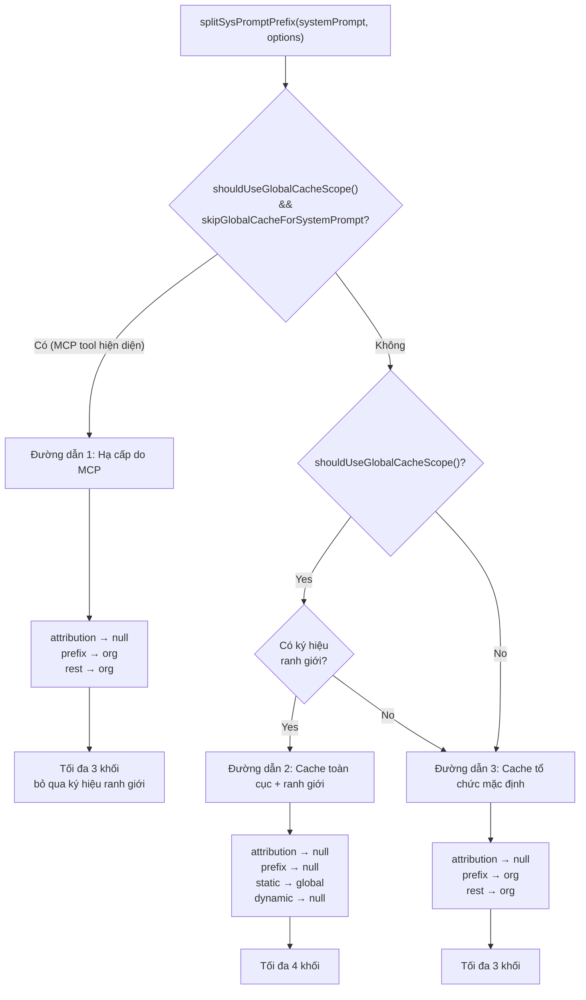
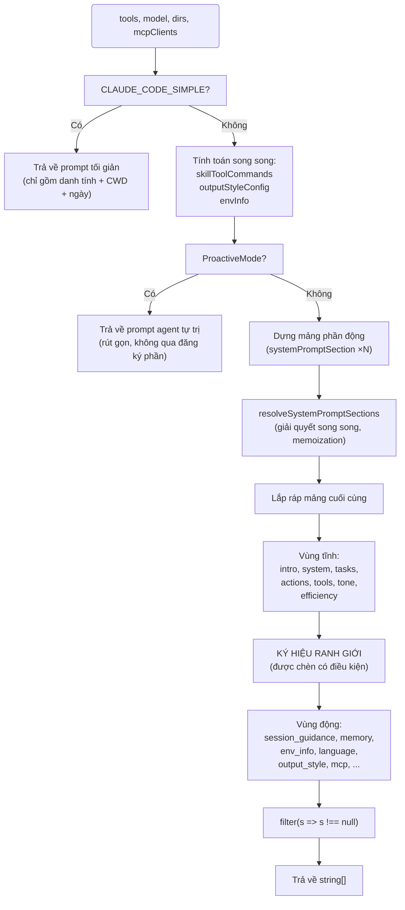

# Chương 5: Kiến trúc System Prompt

> **Định vị**: Chương này phân tích cách CC tự động và động lắp ráp system prompt — đăng ký và memoization các phần, các ký hiệu ranh giới cache (cache boundary markers), và tổng hợp ưu tiên đa nguồn. Điều kiện tiên quyết: Chương 3 (Vòng lặp Agent). Đối tượng độc giả: những người muốn hiểu cách CC động lắp ráp system prompt, hoặc các nhà phát triển đang tìm cách thiết kế một kiến trúc prompt cho Agent của riêng mình.

> Chương 4 đã mổ xẻ toàn bộ quy trình điều phối thực thi công cụ. Trước khi mô hình có thể thực hiện bất kỳ cuộc gọi công cụ nào, trước tiên nó cần "biết mình là ai" — và đó chính xác là vai trò của system prompt. Chương này đi sâu vào kiến trúc lắp ráp của system prompt: cách các phần (sections) được đăng ký và memoize, cách nội dung tĩnh và động được phân tách bằng các ký hiệu ranh giới, cách các thỏa thuận tối ưu hóa cache được đáp ứng ở lớp API, và cách các prompt đa nguồn được tổng hợp theo độ ưu tiên thành tập lệnh cuối cùng gửi đến mô hình.

---

## 5.1 Tại sao System Prompt cần có "Kiến trúc"

Một cách triển khai thô sơ có thể viết cứng system prompt dưới dạng một chuỗi hằng số duy nhất. Nhưng system prompt của Claude Code phải đối mặt với ba thách thức kỹ thuật:

1. **Dung lượng và Chi phí**: System prompt hoàn chỉnh bao gồm phần giới thiệu danh tính, hướng dẫn hành vi, chỉ dẫn sử dụng công cụ, thông tin môi trường, file bộ nhớ, chỉ dẫn MCP và hơn mười phần khác, tổng cộng lên đến hàng chục nghìn token. Việc truyền lại toàn bộ nội dung này trong mỗi cuộc gọi API sẽ gây ra chi phí prompt caching khổng lồ.
2. **Tần suất Thay đổi Khác nhau**: Phần giới thiệu danh tính và hướng dẫn viết code là giống nhau đối với tất cả người dùng và mọi phiên làm việc, trong khi thông tin môi trường (thư mục làm việc, phiên bản hệ điều hành) thay đổi theo từng phiên, và chỉ dẫn cho máy chủ MCP thậm chí có thể thay đổi ngay giữa cuộc hội thoại.
3. **Ghi đè Đa nguồn**: Người dùng có thể tùy chỉnh prompt thông qua tham số `--system-prompt`, chế độ Agent có prompt chuyên dụng riêng, chế độ điều phối viên (coordinator) có prompt độc lập, và chế độ Vòng lặp (Loop mode) có thể ghi đè hoàn toàn mọi thứ — thứ tự ưu tiên giữa các nguồn này phải hoàn toàn rõ ràng.

Giải pháp của Claude Code là một **kiến trúc thành phần phân đoạn (sectioned composition architecture)**: chia nhỏ system prompt thành các phần độc lập, có thể memoize, quản lý vòng đời của chúng thông qua một registry (bộ đăng ký), sử dụng các ký hiệu ranh giới để phân chia các phân tầng cache, và cuối cùng chuyển đổi chúng ở lớp API thành các khối yêu cầu đi kèm `cache_control`.

> **Phiên bản tương tác**: [Bấm vào đây để xem trực quan hóa hoạt động lắp ráp prompt](prompt-assembly-viz.html) — theo dõi cách 7 phần được xếp chồng lên nhau từng lớp một khi tỷ lệ cache được tính toán theo thời gian thực.

---

## 5.2 Đăng ký Phần (Section Registry): Memoization và Nhận thức Cache của SystemPromptSection

### 5.2.1 Trừu tượng hóa Cốt lõi

Đơn vị nhỏ nhất của system prompt là một **phần (section)**. Mỗi phần bao gồm một tên định danh, một hàm tính toán và một chiến lược cache. Trừu tượng hóa này được định nghĩa trong `systemPromptSections.ts`:

```typescript
type SystemPromptSection = {
  name: string
  compute: ComputeFn        // () => string | null | Promise<string | null>
  cacheBreak: boolean       // false = có thể memoize, true = tính toán lại mỗi lượt
}
```

**Tham chiếu Mã nguồn:** `restored-src/src/constants/systemPromptSections.ts:10-14`

Hai hàm factory dùng để tạo các phần:

- **`systemPromptSection(name, compute)`** — Tạo ra một **phần được memoize**. Hàm tính toán chỉ thực thi trong lần gọi đầu tiên; kết quả được lưu đệm trong trạng thái toàn cục, và các lượt tiếp theo sẽ trực tiếp trả về giá trị đã lưu đệm đó. Cache sẽ reset khi chạy lệnh `/clear` hoặc `/compact`.
- **`DANGEROUS_uncachedSystemPromptSection(name, compute, reason)`** — Tạo ra một **phần biến động (volatile section)**. Hàm tính toán được thực thi lại trong mỗi lượt giải quyết (resolve). Tiền tố `DANGEROUS_` và tham số `reason` bắt buộc là một sự cản trở thiết kế (API friction) có chủ đích, nhằm nhắc nhở các nhà phát triển rằng loại phần này **sẽ phá vỡ prompt caching**.

```
┌───────────────────────────────────────────────────────────────────────┐
│                      Đăng ký Phần (Section Registry)                  │
│                                                                       │
│  ┌─────────────────────┐   ┌──────────────────────────────────────┐  │
│  │ systemPromptSection │   │ DANGEROUS_uncachedSystemPromptSection│  │
│  │   cacheBreak=false  │   │         cacheBreak=true              │  │
│  └────────┬────────────┘   └────────────┬─────────────────────────┘  │
│           │                              │                            │
│           ▼                              ▼                            │
│  ┌─────────────────────────────────────────────────────────────────┐  │
│  │            resolveSystemPromptSections(sections)                │  │
│  │                                                                 │  │
│  │  với từng phần (section):                                       │  │
│  │    nếu (!cacheBreak && cache.has(name)):                        │  │
│  │      return cache.get(name)    ← trúng memoization (hit)        │  │
│  │    ngược lại (else):                                            │  │
│  │      value = await compute()                                    │  │
│  │      cache.set(name, value)    ← ghi vào cache                  │  │
│  │      return value                                               │  │
│  └─────────────────────────────────────────────────────────────────┘  │
│                                                                       │
│  Bộ lưu trữ cache: STATE.systemPromptSectionCache (Map<string, string|null>) │
│  Thời điểm reset: /clear, /compact → clearSystemPromptSections()      │
└───────────────────────────────────────────────────────────────────────┘
```

**Hình 5-1: Luồng memoization của Đăng ký Phần.** Các phần được memoize (`cacheBreak=false`) được lưu vào một Map toàn cục sau lần tính toán đầu tiên; các phần biến động (`cacheBreak=true`) được tính toán lại mỗi lần.

### 5.2.2 Luồng Giải quyết (Resolution Flow)

`resolveSystemPromptSections` là hàm cốt lõi để chuyển đổi các định nghĩa phần thành các chuỗi văn bản thực tế (`restored-src/src/constants/systemPromptSections.ts:43-58`):

```typescript
export async function resolveSystemPromptSections(
  sections: SystemPromptSection[],
): Promise<(string | null)[]> {
  const cache = getSystemPromptSectionCache()
  return Promise.all(
    sections.map(async s => {
      if (!s.cacheBreak && cache.has(s.name)) {
        return cache.get(s.name) ?? null
      }
      const value = await s.compute()
      setSystemPromptSectionCacheEntry(s.name, value)
      return value
    }),
  )
}
```

Một số quyết định thiết kế chính:

- **Giải quyết Song song**: Sử dụng `Promise.all` để thực thi song song các hàm tính toán của tất cả các phần. Điều này đặc biệt quan trọng đối với các phần đòi hỏi thao tác I/O (ví dụ: `loadMemoryPrompt` đọc các file CLAUDE.md).
- **null là Hợp lệ**: Một hàm tính toán trả về `null` cho biết phần đó không cần xuất hiện trong prompt cuối cùng. Các giá trị `null` cũng được lưu đệm, tránh việc phải kiểm tra lại điều kiện ở các lượt tiếp theo.
- **Vị trí Lưu trữ Cache**: Cache được lưu trữ trong `STATE.systemPromptSectionCache` (`restored-src/src/bootstrap/state.ts:203`), một `Map<string, string | null>`. Việc chọn trạng thái toàn cục thay vì các biến ở cấp độ module cho phép các lệnh `/clear` và `/compact` reset đồng loạt mọi trạng thái một cách đồng bộ.

### 5.2.3 Vòng đời Cache

Việc dọn dẹp cache được xử lý bởi hàm `clearSystemPromptSections` (`restored-src/src/constants/systemPromptSections.ts:65-68`):

```typescript
export function clearSystemPromptSections(): void {
  clearSystemPromptSectionState()   // xóa Map dữ liệu
  clearBetaHeaderLatches()          // reset các chốt chốt chặn beta header
}
```

Hàm này được gọi tại hai điểm:
1. **Lệnh `/clear`** — Khi người dùng xóa lịch sử hội thoại một cách rõ ràng, tất cả cache của các phần sẽ bị vô hiệu hóa, và cuộc gọi API tiếp theo sẽ tính toán lại mọi phần.
2. **Lệnh `/compact`** — Khi cuộc hội thoại được nén lại, cache của các phần cũng bị vô hiệu hóa tương tự. Điều này là vì việc nén có thể làm thay đổi trạng thái ngữ cảnh (ví dụ: danh sách công cụ khả dụng), và kết quả tính toán từ trạng thái cũ có thể không còn chính xác.

Hàm `clearBetaHeaderLatches()` đi kèm đảm bảo rằng một cuộc hội thoại mới có thể đánh giá lại các beta feature header như AFK, fast-mode, thay vì mang theo các giá trị chốt chặn của lượt trước.

---

## 5.3 Khi nào nên dùng DANGEROUS_uncachedSystemPromptSection

Tiền tố `DANGEROUS_` không phải để trang trí — nó đánh dấu một sự đánh đổi kỹ thuật thực tế. Hãy nhìn vào trường hợp sử dụng duy nhất trong mã nguồn:

```typescript
DANGEROUS_uncachedSystemPromptSection(
  'mcp_instructions',
  () =>
    isMcpInstructionsDeltaEnabled()
      ? null
      : getMcpInstructionsSection(mcpClients),
  'MCP servers connect/disconnect between turns',
),
```

**Tham chiếu Mã nguồn:** `restored-src/src/constants/prompts.ts:513-520`

Các máy chủ MCP có thể kết nối hoặc ngắt kết nối giữa hai lượt của một cuộc hội thoại. Nếu phần chỉ dẫn MCP được memoize, nó sẽ chỉ tính toán khi máy chủ A kết nối ở lượt 1, lưu lại chỉ dẫn cho A; đến lượt 3, máy chủ B cũng kết nối, nhưng cache vẫn sẽ trả về giá trị cũ chỉ chứa A — mô hình sẽ không bao giờ biết về sự hiện diện của B.

Đây là trường hợp sử dụng phù hợp cho `DANGEROUS_uncachedSystemPromptSection`: **khi nội dung của một phần có thể thay đổi trong vòng đời hội thoại, và việc sử dụng giá trị cũ sẽ gây ra các lỗi chức năng**.

Tham số `reason` trong chú thích mã nguồn (`'MCP servers connect/disconnect between turns'`) không chỉ để làm tài liệu hướng dẫn mà còn là một ràng buộc khi duyệt code (code review) — bất kỳ PR nào giới thiệu một phần `DANGEROUS_` mới đều phải giải thích tại sao việc vô hiệu hóa cache lại là bắt buộc.

Cần lưu ý rằng mã nguồn cũng ghi nhận một trường hợp "hạ cấp từ DANGEROUS xuống cache thông thường". Phần `token_budget` từng là một `DANGEROUS_uncachedSystemPromptSection` thay đổi động dựa trên `getCurrentTurnTokenBudget()`, nhưng việc này đã phá vỡ khoảng 20K token cache trong mỗi lần chuyển đổi ngân sách. Giải pháp là viết lại nội dung prompt để nó tự động trở thành no-op khi không còn ngân sách, nhờ đó hạ cấp xuống một `systemPromptSection` thông thường (`restored-src/src/constants/prompts.ts:540-550`).

---

## 5.4 Ranh giới Tĩnh và Động: SYSTEM_PROMPT_DYNAMIC_BOUNDARY

### 5.4.1 Định nghĩa Ký hiệu Ranh giới

Một đường phân chia rõ ràng tồn tại trong system prompt, chia nội dung thành "vùng tĩnh" và "vùng động":

```typescript
export const SYSTEM_PROMPT_DYNAMIC_BOUNDARY =
  '__SYSTEM_PROMPT_DYNAMIC_BOUNDARY__'
```

**Tham chiếu Mã nguồn:** `restored-src/src/constants/prompts.ts:114-115`

Chuỗi hằng số này không xuất hiện trong văn bản cuối cùng được gửi đến mô hình — nó là một **tín hiệu nội băng (in-band signal)** chỉ tồn tại trong mảng system prompt, để hàm `splitSysPromptPrefix` phía hạ nguồn nhận biết và xử lý.

### 5.4.2 Vị trí và Ý nghĩa của Ranh giới

Trong mảng trả về của hàm `getSystemPrompt`, ký hiệu ranh giới được đặt chính xác giữa nội dung tĩnh và động (`restored-src/src/constants/prompts.ts:560-576`):

```
Cấu trúc mảng trả về:
[
  getSimpleIntroSection(...)          ─┐
  getSimpleSystemSection()             │ Vùng tĩnh: giống hệt nhau cho mọi người dùng/phiên
  getSimpleDoingTasksSection()         │ → cacheScope: 'global'
  getActionsSection()                  │
  getUsingYourToolsSection(...)        │
  getSimpleToneAndStyleSection()       │
  getOutputEfficiencySection()        ─┘
  SYSTEM_PROMPT_DYNAMIC_BOUNDARY      ← ký hiệu ranh giới
  session_guidance                    ─┐
  memory (CLAUDE.md)                   │ Vùng động: thay đổi theo phiên/người dùng
  env_info_simple                      │ → cacheScope: null (không lưu cache)
  language                             │
  output_style                         │
  mcp_instructions (DANGEROUS)         │
  scratchpad                           │
  ...                                 ─┘
]
```

**Hình 5-2: Sơ đồ ranh giới Tĩnh/Động.** Ký hiệu ranh giới chia mảng system prompt thành hai vùng, mỗi vùng tương ứng với một phạm vi cache (cache scope) khác nhau.

Quy tắc then chốt: **Tất cả nội dung nằm trước ký hiệu ranh giới phải hoàn toàn giống hệt nhau trên mọi tổ chức, mọi người dùng và mọi phiên làm việc**. Điều này có nghĩa là chúng có thể sử dụng `scope: 'global'` để lưu cache xuyên tổ chức — một tiền tố cache được tạo ra bởi lệnh gọi API của một người dùng có thể được sử dụng trực tiếp bởi lệnh gọi của bất kỳ người dùng nào khác.

Ký hiệu ranh giới chỉ được chèn khi nhà cung cấp API bên thứ nhất bật tính năng lưu cache toàn cục:

```typescript
...(shouldUseGlobalCacheScope() ? [SYSTEM_PROMPT_DYNAMIC_BOUNDARY] : []),
```

Hàm `shouldUseGlobalCacheScope()` (`restored-src/src/utils/betas.ts:227-231`) kiểm tra xem nhà cung cấp API có phải là `'firstParty'` (tức là sử dụng trực tiếp API Anthropic) và các tính năng thử nghiệm beta không bị vô hiệu hóa qua biến môi trường. Các nhà cung cấp bên thứ ba (ví dụ: truy cập qua Foundry) sẽ không sử dụng cache toàn cục.

### 5.4.3 Đẩy các Biến thể Phiên làm việc ra sau Ranh giới

Mã nguồn chứa một đoạn bình luận được viết rất cẩn thận giải thích tại sao hàm `getSessionSpecificGuidanceSection` lại tồn tại (`restored-src/src/constants/prompts.ts:343-347`):

> Chỉ dẫn đặc thù cho phiên làm việc (Session-variant guidance) nếu đặt trước SYSTEM_PROMPT_DYNAMIC_BOUNDARY sẽ làm phân mảnh tiền tố cacheScope:'global'. Mỗi câu lệnh điều kiện ở đây là một bit runtime mà nếu không xử lý sẽ nhân bản các biến thể mã băm tiền tố Blake2b (2^N).

Điều này tiết lộ một ràng buộc thiết kế tinh tế nhưng cực kỳ quan trọng: **vùng tĩnh không được chứa bất kỳ nhánh điều kiện nào thay đổi theo phiên**. Nếu danh sách công cụ khả dụng, lệnh Skill, công cụ Agent hoặc các thông tin runtime khác xuất hiện trước ranh giới, mỗi tổ hợp công cụ sẽ tạo ra một mã băm tiền tố Blake2b khác nhau, khiến số lượng biến thể cache toàn cục tăng lên theo cấp số nhân (2^N, với N là số lượng bit điều kiện), làm giảm tỷ lệ trúng cache thực tế xuống gần như bằng không.

Vì vậy, tất cả nội dung phụ thuộc vào trạng thái chạy — hướng dẫn công cụ (session guidance), các file bộ nhớ, thông tin môi trường, tùy chọn ngôn ngữ — được đặt ở vùng động phía sau ranh giới, dưới dạng các phần được memoize (`systemPromptSection`) thay vì các chuỗi tĩnh.

---

## 5.5 Ba Đường dẫn của splitSysPromptPrefix

`splitSysPromptPrefix` (`restored-src/src/utils/api.ts:321-435`) là cầu nối chuyển đổi mảng system prompt logic thành định dạng `SystemPromptBlock[]` đi kèm cơ chế kiểm soát cache cho yêu cầu API. Nó chọn một trong ba đường dẫn mã nguồn khác nhau dựa trên các điều kiện lúc chạy.



**Hình 5-3: Lưu đồ ba đường dẫn của splitSysPromptPrefix.** Dựa trên tính năng cache toàn cục và sự hiện diện của công cụ MCP, hàm chọn các chiến lược cache tối ưu.

### 5.5.1 Đường dẫn 1: Đường dẫn Hạ cấp do MCP

**Điều kiện Kích hoạt:** `shouldUseGlobalCacheScope() === true` và `options.skipGlobalCacheForSystemPrompt === true`.

Khi các công cụ MCP xuất hiện trong phiên làm việc, bản thân các schema của công cụ là nội dung động ở cấp độ người dùng và không thể lưu cache toàn cục. Trong trường hợp này, mặc dù vùng tĩnh của system prompt vẫn có thể lưu cache toàn cục, nhưng sự hiện diện của các schema công cụ làm giảm mạnh lợi ích thực tế của cache toàn cục. Do đó, `splitSysPromptPrefix` chọn **hạ cấp xuống lưu cache cấp tổ chức (org-level caching)**.

```typescript
// Logic cốt lõi Đường dẫn 1 (restored-src/src/utils/api.ts:332-359)
for (const prompt of systemPrompt) {
  if (!prompt) continue
  if (prompt === SYSTEM_PROMPT_DYNAMIC_BOUNDARY) continue // bỏ qua ranh giới
  if (prompt.startsWith('x-anthropic-billing-header')) {
    attributionHeader = prompt
  } else if (CLI_SYSPROMPT_PREFIXES.has(prompt)) {
    systemPromptPrefix = prompt
  } else {
    rest.push(prompt)
  }
}
// Kết quả: [attribution:null, prefix:org, rest:org]
```

Ký hiệu ranh giới được bỏ qua trực tiếp (`continue`), và tất cả các khối không đặc biệt được gộp thành một khối cache duy nhất cấp `org`. Giá trị `skipGlobalCacheForSystemPrompt` đến từ việc kiểm tra trong `claude.ts` (`restored-src/src/services/api/claude.ts:1210-1214`): việc hạ cấp chỉ kích hoạt khi các công cụ MCP thực sự được render vào yêu cầu (thay vì tải trì hoãn `defer_loading`).

### 5.5.2 Đường dẫn 2: Đường dẫn Cache Toàn cục + Ranh giới

**Điều kiện Kích hoạt:** `shouldUseGlobalCacheScope() === true`, không bị hạ cấp do MCP, và ký hiệu ranh giới tồn tại trong system prompt.

Đây là đường dẫn chính cho người dùng bên thứ nhất không sử dụng công cụ MCP, mang lại hiệu quả cache cao nhất:

```typescript
// Logic cốt lõi Đường dẫn 2 (restored-src/src/utils/api.ts:362-409)
const boundaryIndex = systemPrompt.findIndex(
  s => s === SYSTEM_PROMPT_DYNAMIC_BOUNDARY,
)
if (boundaryIndex !== -1) {
  for (let i = 0; i < systemPrompt.length; i++) {
    const block = systemPrompt[i]
    if (!block || block === SYSTEM_PROMPT_DYNAMIC_BOUNDARY) continue
    if (block.startsWith('x-anthropic-billing-header')) {
      attributionHeader = block
    } else if (CLI_SYSPROMPT_PREFIXES.has(block)) {
      systemPromptPrefix = block
    } else if (i < boundaryIndex) {
      staticBlocks.push(block)        // trước ranh giới → tĩnh
    } else {
      dynamicBlocks.push(block)       // sau ranh giới → động
    }
  }
  // Kết quả: [attribution:null, prefix:null, static:global, dynamic:null]
}
```

Đường dẫn này tạo ra tối đa **4 khối văn bản**:

| Khối | cacheScope | Mô tả |
|-------|-----------|-------------|
| Header thuộc tính thanh toán | `null` | Header thuộc tính thanh toán (attribution header), không lưu cache. |
| Tiền tố prompt hệ thống | `null` | Tiền tố định danh CLI, không lưu cache. |
| Nội dung tĩnh | `'global'` | Chỉ dẫn cốt lõi, có thể lưu cache dùng chung giữa các tổ chức. |
| Nội dung động | `null` | Nội dung động theo từng phiên làm việc, không lưu cache. |

Khối tĩnh sử dụng `scope: 'global'` cho phép backend API Anthropic chia sẻ tiền tố cache này cho tất cả người dùng Claude Code. Vì vùng tĩnh thường chứa hàng chục nghìn token giới thiệu danh tính và hướng dẫn hành vi, lượng tài nguyên tính toán tiết kiệm được từ cache này dưới mức độ chịu tải song song cao là cực kỳ lớn.

### 5.5.3 Đường dẫn 3: Đường dẫn Cache Tổ chức Mặc định

**Điều kiện Kích hoạt:** Tính năng cache toàn cục không được kích hoạt (nhà cung cấp bên thứ ba), hoặc ký hiệu ranh giới không tồn tại.

Đây là đường dẫn dự phòng đơn giản nhất:

```typescript
// Logic cốt lõi Đường dẫn 3 (restored-src/src/utils/api.ts:411-434)
for (const block of systemPrompt) {
  if (!block) continue
  if (block.startsWith('x-anthropic-billing-header')) {
    attributionHeader = block
  } else if (CLI_SYSPROMPT_PREFIXES.has(block)) {
    systemPromptPrefix = block
  } else {
    rest.push(block)
  }
}
// Kết quả: [attribution:null, prefix:org, rest:org]
```

Tất cả nội dung không đặc biệt được gộp vào một khối duy nhất sử dụng cache cấp `org`. Điều này là đủ đối với các nhà cung cấp bên thứ ba — các người dùng trong cùng một tổ chức chia sẻ cùng một tiền tố system prompt và vẫn có thể trúng cache ở cấp độ tổ chức.

### 5.5.4 Từ splitSysPromptPrefix đến Yêu cầu API

`buildSystemPromptBlocks` (`restored-src/src/services/api/claude.ts:3213-3237`) là bên tiêu thụ trực tiếp của `splitSysPromptPrefix`. Nó chuyển đổi các `SystemPromptBlock[]` thành định dạng `TextBlockParam[]` mà API Anthropic yêu cầu:

```typescript
export function buildSystemPromptBlocks(
  systemPrompt: SystemPrompt,
  enablePromptCaching: boolean,
  options?: { skipGlobalCacheForSystemPrompt?: boolean; querySource?: QuerySource },
): TextBlockParam[] {
  return splitSysPromptPrefix(systemPrompt, {
    skipGlobalCacheForSystemPrompt: options?.skipGlobalCacheForSystemPrompt,
  }).map(block => ({
    type: 'text' as const,
    text: block.text,
    ...(enablePromptCaching && block.cacheScope !== null && {
      cache_control: getCacheControl({
        scope: block.cacheScope,
        querySource: options?.querySource,
      }),
    }),
  }))
}
```

Quy tắc ánh xạ rất rõ ràng: các khối có `cacheScope` khác `null` sẽ nhận thêm thuộc tính `cache_control`; các khối `null` thì không. Backend API sử dụng giá trị của `cache_control.scope` (`'global'` hoặc `'org'`) để quyết định phạm vi chia sẻ bộ nhớ đệm.

---

## 5.6 Quy trình Dựng System Prompt

### 5.6.1 Quy trình Hoàn chỉnh của getSystemPrompt

`getSystemPrompt` (`restored-src/src/constants/prompts.ts:444-577`) là điểm vào chính để xây dựng system prompt. Nó nhận danh sách công cụ, tên model, các thư mục làm việc bổ sung và danh sách các client MCP, trả về một mảng `string[]`.



**Hình 5-4: Lưu đồ dựng system prompt.** Luồng dữ liệu hoàn chỉnh từ điểm vào đến kết quả trả về cuối cùng.

Quy trình dựng prompt có ba nhánh chạy nhanh (fast paths):

1. **Chế độ CLAUDE_CODE_SIMPLE**: Khi biến môi trường `CLAUDE_CODE_SIMPLE` bằng true, nó trả về trực tiếp một prompt tối giản chỉ chứa danh tính, thư mục làm việc và ngày hiện tại. Nhánh này chủ yếu dùng cho các kịch bản kiểm thử và debug.
2. **Chế độ Chủ động (Proactive mode)**: Khi các feature flag `PROACTIVE` hoặc `KAIROS` được bật và hoạt động, nó trả về một prompt rút gọn cho agent tự trị. Lưu ý rằng nhánh này **bỏ qua bộ đăng ký phần** và lắp ráp trực tiếp một mảng chuỗi tĩnh.
3. **Đường dẫn tiêu chuẩn**: Đi qua toàn bộ quy trình đăng ký phần, giải quyết song song, memoize và phân vùng tĩnh/động.

### 5.6.2 Tổng quan các Phần Động

Các phần động được đăng ký trong đường dẫn tiêu chuẩn (`restored-src/src/constants/prompts.ts:491-555`) cấu thành toàn bộ nội dung trong vùng động:

| Tên Phần | Kiểu | Mô tả Nội dung |
|-------------|------|---------------------|
| `session_guidance` | Được memoize | Chỉ dẫn công cụ, gợi ý chế độ tương tác. |
| `memory` | Được memoize | Nội dung file bộ nhớ CLAUDE.md (xem Chương 6). |
| `ant_model_override` | Được memoize | Các chỉ dẫn ghi đè model nội bộ của Anthropic. |
| `env_info_simple` | Được memoize | Thư mục làm việc, hệ điều hành (OS), Shell và thông tin môi trường khác. |
| `language` | Được memoize | Cấu hình ngôn ngữ ưa thích. |
| `output_style` | Được memoize | Cấu hình phong cách đầu ra. |
| `mcp_instructions` | **Biến động** | Hướng dẫn cho máy chủ MCP (có thể thay đổi giữa cuộc hội thoại). |
| `scratchpad` | Được memoize | Chỉ dẫn về nháp (scratchpad). |
| `frc` | Được memoize | Hướng dẫn dọn dẹp kết quả hàm (function result cleanup). |
| `summarize_tool_results` | Được memoize | Hướng dẫn tóm tắt kết quả công cụ. |
| `numeric_length_anchors` | Được memoize | Các neo độ dài (chỉ dùng nội bộ Anthropic). |
| `token_budget` | Được memoize | Hướng dẫn về ngân sách token (được bảo vệ bởi feature gate). |
| `brief` | Được memoize | Phần tóm tắt chỉ dẫn (được bảo vệ bởi feature gate KAIROS). |

Phần `DANGEROUS_uncachedSystemPromptSection` duy nhất là `mcp_instructions` — nhất quán với phân tích trong Mục 5.3. Tất cả các phần khác đều được memoize, tính toán một lần trong vòng đời phiên làm việc và không thay đổi sau đó.

---

## 5.7 Thứ tự Ưu tiên của buildEffectiveSystemPrompt

Hàm `getSystemPrompt` xây dựng "prompt hệ thống mặc định." Nhưng trong các lần gọi thực tế, nhiều nguồn khác nhau có thể ghi đè hoặc bổ sung cho mặc định này. Hàm `buildEffectiveSystemPrompt` (`restored-src/src/utils/systemPrompt.ts:41-123`) chịu trách nhiệm tổng hợp prompt hiệu dụng cuối cùng theo độ ưu tiên.

### 5.7.1 Chuỗi Ưu tiên

```
Độ ưu tiên 0 (cao nhất): overrideSystemPrompt
  ↓ khi không có
Độ ưu tiên 1: coordinator system prompt
  ↓ khi không có
Độ ưu tiên 2: agent system prompt
  ↓ khi không có
Độ ưu tiên 3: customSystemPrompt (--system-prompt)
  ↓ khi không có
Độ ưu tiên 4 (thấp nhất): defaultSystemPrompt (đầu ra của getSystemPrompt)

+ appendSystemPrompt luôn được nối vào cuối (ngoại trừ khi có override)
```

### 5.7.2 Hành vi ở Từng Cấp độ Ưu tiên

**Override:** Khi `overrideSystemPrompt` tồn tại (ví dụ: các chỉ thị vòng lặp được thiết lập bởi Loop mode), nó trả về trực tiếp một mảng chỉ chứa chuỗi đó, bỏ qua tất cả các nguồn khác, **bao gồm cả `appendSystemPrompt`** (`restored-src/src/utils/systemPrompt.ts:56-58`):

```typescript
if (overrideSystemPrompt) {
  return asSystemPrompt([overrideSystemPrompt])
}
```

**Coordinator:** Khi feature flag `COORDINATOR_MODE` được bật và biến môi trường `CLAUDE_CODE_COORDINATOR_MODE` bằng true, prompt hệ thống chuyên dụng cho coordinator sẽ thay thế prompt mặc định. Chú ý việc lazy import module `coordinatorMode` để tránh phụ thuộc vòng (`restored-src/src/utils/systemPrompt.ts:62-75`).

**Agent:** Khi `mainThreadAgentDefinition` được thiết lập, hành vi sẽ phụ thuộc vào việc Chế độ Chủ động có đang hoạt động hay không:
- **Trong Chế độ Chủ động**: Các chỉ dẫn của Agent được **nối thêm** vào cuối prompt mặc định thay vì thay thế nó. Điều này là do prompt mặc định trong Chế độ Chủ động vốn đã là một danh tính agent tự trị rút gọn; định nghĩa Agent chỉ bổ sung thêm các hướng dẫn nghiệp vụ chuyên biệt lên trên — nhất quán với hành vi trong chế độ teammates.
- **Trong chế độ thông thường**: Chỉ dẫn của Agent sẽ **thay thế** prompt mặc định.

**Custom:** Prompt được chỉ định bởi đối số dòng lệnh `--system-prompt` sẽ thay thế prompt mặc định.

**Default:** Toàn bộ đầu ra của hàm `getSystemPrompt`.

**Append:** Nếu `appendSystemPrompt` được thiết lập, nó sẽ được nối thêm vào cuối mảng kết quả. Điều này cung cấp cơ chế để tiêm thêm các chỉ dẫn bổ sung mà không cần ghi đè hoàn toàn system prompt.

### 5.7.3 Logic Tổng hợp Cuối cùng

Khi không có override hoặc coordinator, logic chọn ba đường cốt lõi như sau (`restored-src/src/utils/systemPrompt.ts:115-122`):

```typescript
return asSystemPrompt([
  ...(agentSystemPrompt
    ? [agentSystemPrompt]
    : customSystemPrompt
      ? [customSystemPrompt]
      : defaultSystemPrompt),
  ...(appendSystemPrompt ? [appendSystemPrompt] : []),
])
```

Đây là một chuỗi toán tử ba ngôi sạch sẽ: Agent > Custom > Default, cộng với một phần append tùy chọn. `asSystemPrompt` là một hàm chuyển đổi kiểu dữ liệu có gắn thương hiệu (branded type conversion) để đảm bảo an toàn kiểu cho giá trị trả về (xem Chương 8 về hệ thống kiểu).

---

## 5.8 Hợp đồng Tối ưu hóa Cache: Ràng buộc Thiết kế và Cạm bẫy

Kiến trúc system prompt thiết lập một **hợp đồng tối ưu hóa cache (cache optimization contract)** ngầm định. Việc vi phạm hợp đồng này sẽ khiến tỷ lệ trúng cache tụt dốc không phanh. Dưới đây là các ràng buộc chính được đúc rút từ mã nguồn:

### Ràng buộc 1: Vùng tĩnh không được chứa Biến số của Phiên làm việc

Như đã thảo luận ở Mục 5.4.3, bất kỳ nhánh điều kiện nào trước ranh giới cũng sẽ làm tăng số lượng biến thể băm theo cấp số nhân. Các PR #24490 và #24171 đã ghi nhận loại bug này: một nhà phát triển vô tình đặt điều kiện `if (hasAgentTool)` vào vùng tĩnh, khiến tỷ lệ trúng cache toàn cục giảm mạnh từ 95% xuống dưới 10%.

### Ràng buộc 2: Các phần DANGEROUS phải có Lý do biện minh Đầy đủ

Mỗi lần sử dụng `DANGEROUS_uncachedSystemPromptSection` đều phải được xem xét kỹ lưỡng khi duyệt code. Tham số `reason`, mặc dù không được sử dụng khi chạy (lưu ý tiền tố `_` trên tên tham số: `_reason`), đóng vai trò làm điểm tựa cho việc duyệt PR — những người review sẽ kiểm tra xem lý do biện minh có đủ thuyết phục không và có giải pháp thay thế nào để hạ cấp nó xuống một phần được memoize hay không.

### Ràng buộc 3: Sự hiện diện của Công cụ MCP sẽ kích hoạt Hạ cấp Cache Toàn cục

Khi các công cụ MCP hiện diện, `splitSysPromptPrefix` sẽ tự động hạ cấp xuống lưu cache cấp tổ chức. Quyết định này dựa trên một đánh giá kỹ thuật: các schema của công cụ MCP là nội dung động ở cấp độ người dùng, và dù vùng tĩnh của system prompt có thể lưu cache toàn cục, sự xuất hiện của các khối schema công cụ MCP khiến yêu cầu API vốn đã chứa các khối lớn không thể lưu cache toàn cục. Lợi ích cận biên của việc lưu cache toàn cục cho system prompt lúc này không còn đủ để bù đắp cho sự phức tạp tăng thêm.

### Ràng buộc 4: Vị trí Ký hiệu Ranh giới là một Bất biến Kiến trúc

Đoạn chú thích trong mã nguồn đã khẳng định rất thẳng thắn (`restored-src/src/constants/prompts.ts:572`):

```
// === BOUNDARY MARKER - DO NOT MOVE OR REMOVE ===
```

Di chuyển hoặc xóa ký hiệu ranh giới không chỉ là một thay đổi code thông thường — đó là một thay đổi về mặt kiến trúc làm biến đổi hành vi lưu cache của toàn bộ người dùng bên thứ nhất.

---

## 5.9 Trích xuất Mẫu hình (Pattern Extraction)

Từ kiến trúc system prompt, chúng ta có thể trích xuất các mẫu hình kỹ thuật phần mềm tái sử dụng được sau đây:

### Mẫu hình 1: Memoization theo Phân đoạn (Sectioned Memoization)

- **Bài toán Giải quyết:** Trong các prompt dung lượng lớn, một số nội dung là tĩnh và một số là động; việc tính toán lại tất cả mọi thứ gây lãng phí tài nguyên.
- **Giải pháp:** Chia nhỏ prompt thành các phần độc lập, mỗi phần có chiến lược cache rõ ràng (được memoize hoặc biến động). Phân biệt hai loại qua các hàm factory, thêm rào cản thiết kế cho loại biến động (tiền tố `DANGEROUS_` + bắt buộc nhập `reason`).
- **Điều kiện tiên quyết:** Cần một bộ quản lý trạng thái toàn cục giữ Map cache, và các thời điểm vô hiệu hóa cache được định nghĩa rõ ràng (ví dụ: `/clear`, `/compact`).
- **Mã mẫu:**
  ```
  memoizedSection(name, computeFn)        → lưu cache sau lần tính đầu tiên
  volatileSection(name, computeFn, reason) → tính lại mỗi lượt, bắt buộc có lý do
  resolveAll(sections)                     → Promise.all giải quyết song song
  ```

### Mẫu hình 2: Phân vùng Ranh giới Cache (Cache Boundary Partitioning)

- **Bài toán Giải quyết:** Tiền tố prompt dùng chung giữa nhiều người dùng cần được cache toàn cục, nhưng các nội dung đặc thù cho phiên làm việc sẽ phá vỡ tỷ lệ trúng cache.
- **Giải pháp:** Chèn một ký hiệu ranh giới rõ ràng trong mảng prompt, chia nội dung thành một "vùng tĩnh có thể cache toàn cục" và một "vùng động theo từng phiên". Các hàm hạ nguồn sẽ gán các giá trị `cacheScope` khác nhau dựa trên vị trí của ranh giới.
- **Điều kiện tiên quyết:** Backend API hỗ trợ nhiều cấp độ phạm vi cache (ví dụ: `global` / `org` / `null`).
- **Ràng buộc then chốt:** Vùng tĩnh trước ranh giới không được chứa bất kỳ nhánh điều kiện nào thay đổi theo phiên; nếu không, số lượng biến thể băm sẽ tăng theo cấp số nhân.

### Mẫu hình 3: Tổng hợp theo Chuỗi Ưu tiên (Priority Chain Composition)

- **Bài toán Giải quyết:** Nhiều nguồn khác nhau (người dùng tùy chỉnh, chế độ Agent, chế độ coordinator, mặc định) đều cung cấp system prompt, đòi hỏi một độ ưu tiên rõ ràng.
- **Giải pháp:** Định nghĩa một chuỗi ưu tiên tuyến tính (override > coordinator > agent > custom > default), cộng thêm cơ chế `append` luôn được nối vào cuối. Sử dụng chuỗi toán tử ba ngôi để duy trì khả năng đọc code tuyến tính.
- **Điều kiện tiên quyết:** Thống nhất interface đầu vào cho tất cả các nguồn ưu tiên (tất cả đều là `string | string[]`).

---

## Những việc bạn có thể làm

Dựa trên kiến trúc system prompt được phân tích trong chương này, dưới đây là các khuyến nghị mà bạn có thể áp dụng trực tiếp vào các dự án AI Agent của riêng mình:

1. **Xây dựng một bộ đăng ký phần (section registry) cho các prompt của bạn.** Đừng viết cứng system prompt dưới dạng một chuỗi duy nhất. Hãy chia nhỏ nó thành các phần độc lập, có tên gọi và được ghi chú xem có thể lưu cache hay không. Lợi ích không chỉ là hiệu quả cache mà còn là khả năng bảo trì — khi bạn cần sửa đổi một chỉ thị hành vi, bạn có thể định vị chính xác phần tương ứng thay vì phải tìm kiếm trong một chuỗi văn bản khổng lồ.
2. **Thêm rào cản thiết kế cho các phần biến động.** Nếu một số phần trong prompt của bạn cần được tính toán lại sau mỗi lượt (ví dụ: danh sách công cụ động, thông tin trạng thái thời gian thực), hãy học theo thiết kế của `DANGEROUS_uncachedSystemPromptSection`: yêu cầu bên gọi cung cấp lý do tại sao việc tính toán lại mỗi lượt lại là bắt buộc. Rào cản này đặc biệt có giá trị trong các đợt duyệt code (code review) — nó buộc các nhà phát triển phải cân nhắc rõ ràng giữa hiệu quả cache và độ tươi mới của nội dung.
3. **Đẩy các biến số của phiên làm việc ra sau ranh giới cache.** Nếu API bạn sử dụng hỗ trợ lưu prompt cache, hãy đảm bảo phần tiền tố của prompt (phạm vi tính toán khóa cache) không chứa nội dung thay đổi theo người dùng, phiên làm việc hoặc trạng thái chạy. Ký hiệu ranh giới `SYSTEM_PROMPT_DYNAMIC_BOUNDARY` của Claude Code là một cách triển khai trực tiếp cho chiến lược này.
4. **Định nghĩa một chuỗi ưu tiên prompt rõ ràng.** Khi hệ thống của bạn hỗ trợ nhiều chế độ hoạt động (Agent tự trị, coordinator, người dùng tùy chỉnh, v.v.), hãy định nghĩa các mức ưu tiên rõ ràng cho các nguồn prompt của từng chế độ. Tránh việc "gộp" các prompt từ các nguồn khác nhau — việc sử dụng ngữ nghĩa "thay thế" (replace) sẽ an toàn và dễ dự đoán hơn.
5. **Theo dõi tỷ lệ trúng cache.** Giá trị của kiến trúc system prompt được phản ánh đầy đủ qua tỷ lệ trúng cache. Nếu tỷ lệ trúng cache của bạn đột ngột giảm mạnh, hãy kiểm tra xem có nhánh điều kiện mới nào được đưa vào vùng tĩnh hay không — đây chính là cạm bẫy mà đội ngũ Claude Code đã gặp phải trong PR #24490.

---

## 5.10 Tóm tắt

Kiến trúc system prompt là hạ tầng "vô hình nhưng hiện diện khắp nơi" của Claude Code. Thiết kế của nó thể hiện ba nguyên tắc cốt lõi:

1. **Thành phần phân đoạn (Sectioned Composition)**: Thông qua registry `systemPromptSection`, prompt được phân rã thành các phần độc lập, có thể memoize, mỗi phần có tên gọi, hàm tính toán và chiến lược cache rõ ràng.
2. **Phân vùng Ranh giới (Boundary Partitioning)**: Ký hiệu `SYSTEM_PROMPT_DYNAMIC_BOUNDARY` chia tách nội dung thành vùng tĩnh có thể cache toàn cục và vùng động theo từng phiên, với ba đường dẫn của `splitSysPromptPrefix` lựa chọn chiến lược cache tối ưu dựa trên các điều kiện lúc chạy.
3. **Tổng hợp theo Ưu tiên (Priority Synthesis)**: Hàm `buildEffectiveSystemPrompt` hỗ trợ nhiều chế độ hoạt động thông qua một chuỗi ưu tiên năm cấp rõ ràng (override > coordinator > agent > custom > default + append), trong khi vẫn duy trì khả năng đọc code tuyến tính.

"Tiêu chí thành công" của kiến trúc này không nằm ở tính đúng đắn về mặt chức năng — ngay cả khi bạn viết cứng toàn bộ system prompt thành một chuỗi duy nhất, hệ thống vẫn hoạt động hoàn hảo về mặt chức năng. Giá trị của nó nằm ở **hiệu quả chi phí**: thông qua thiết kế phân tầng cache cẩn thận, một lượng lớn chi phí xử lý prompt đã được tiết kiệm trên hàng triệu cuộc gọi API mỗi ngày. Chương tiếp theo sẽ thảo luận về một đầu vào quan trọng cho kiến trúc system prompt — cách các file bộ nhớ CLAUDE.md được tải và tiêm vào ngữ cảnh (xem Chương 6).
