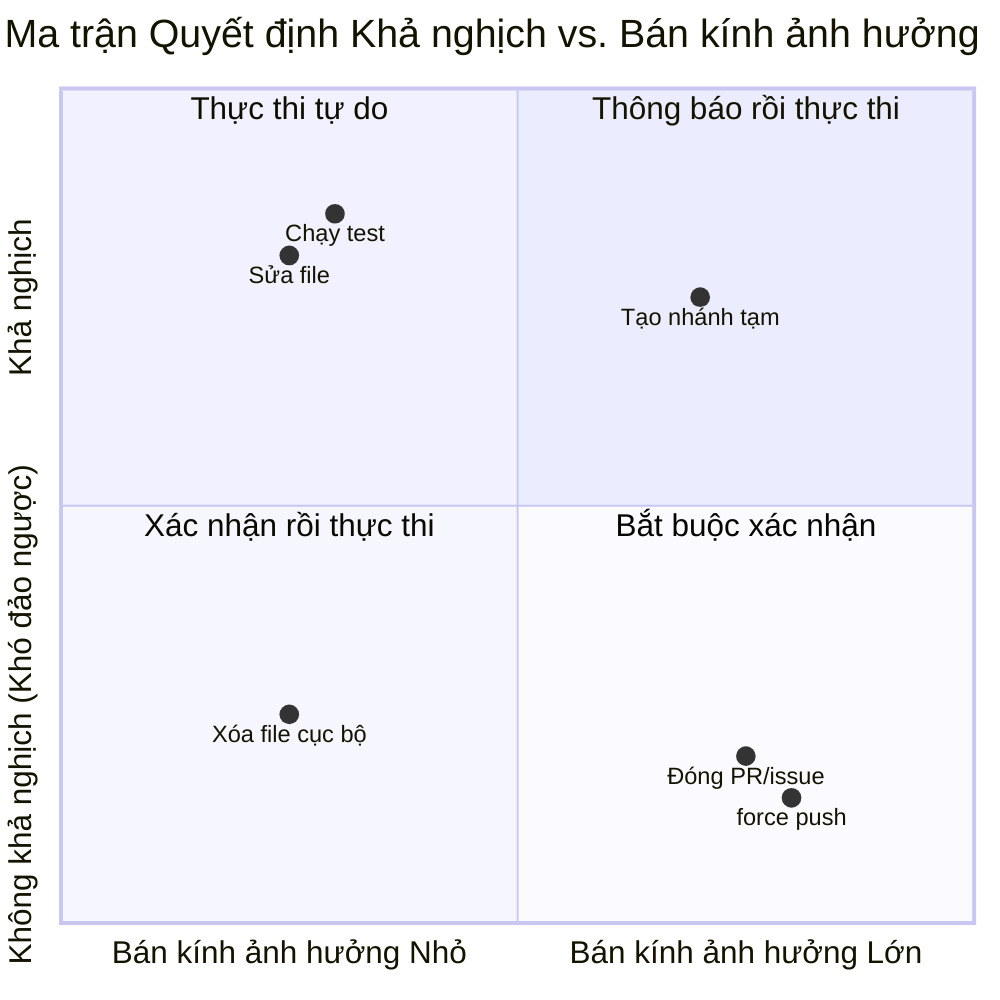

# Chương 6: Điều hướng Hành vi thông qua Prompt

> Chương 5 đã mổ xẻ kiến trúc lắp ráp của system prompt — đăng ký các phần, ranh giới cache, tổng hợp đa nguồn. Nhưng kiến trúc mới chỉ là bộ khung xương; điều thực sự khiến Claude Code hành xử "như một kỹ sư giàu kinh nghiệm" chính là các thớ cơ gắn vào khung xương đó: các chỉ thị hành vi được diễn đạt một cách cẩn trọng. Chương này đúc kết 6 mẫu hình điều hướng hành vi có thể tái sử dụng, mỗi mẫu hình đi kèm với các ví dụ mã nguồn, nguyên lý đằng sau hiệu quả của chúng và các template bạn có thể áp dụng trực tiếp trong các prompt của riêng mình.

---

## 6.1 Bản chất của Điều hướng Hành vi: Thiết lập Ranh giới trong Không gian Xác suất Tạo

Đầu ra của một mô hình ngôn ngữ lớn là một quá trình lấy mẫu trên một phân phối xác suất. Các chỉ thị hành vi trong system prompt về cơ bản là những hàng rào được dựng lên trong không gian xác suất này — nhằm nâng cao xác suất của các hành vi mong muốn và triệt tiêu các hành vi không mong muốn. Nhưng cách diễn đạt của các hàng rào đó sẽ quyết định xem chúng hoạt động như một bức tường vững chắc hay một ranh giới mờ nhạt.

Đọc qua mã nguồn system prompt của Claude Code (`restored-src/src/constants/prompts.ts` và `restored-src/src/tools/BashTool/prompt.ts`), người ta phát hiện ra rằng các kỹ sư của Anthropic không xếp chồng các chỉ thị một cách lộn xộn mà đã tạo nên một ngôn ngữ mẫu hình ngầm định. Các mẫu hình này hoạt động không chỉ vì chúng "nói những điều đúng đắn", mà vì cấu trúc diễn đạt của chúng phù hợp với cơ chế chú ý (attention mechanisms) của mô hình và đặc tính tuân thủ chỉ dẫn của nó.

Chương này sẽ làm rõ các mẫu hình đó dưới dạng 6 mẫu hình điều hướng hành vi:

1. Chỉ dẫn Tối giản (Minimalism Directive)
2. Leo thang Lũy tiến (Progressive Escalation)
3. Nhận thức Tính khả nghịch (Reversibility Awareness)
4. Điều hướng Ưu tiên Công cụ (Tool Preference Steering)
5. Giao thức Ủy quyền Agent (Agent Delegation Protocol)
6. Neo giữ Bằng Số (Numeric Anchoring)

---

## 6.2 Mẫu hình 1: Chỉ dẫn Tối giản (Minimalism Directive)

### 6.2.1 Định nghĩa Mẫu hình

**Ý tưởng Cốt lõi:** Hạn chế xu hướng "quá nhiệt tình giúp đỡ" của mô hình trong phạm vi thực tế của tác vụ bằng cách cấm rõ ràng việc thiết kế quá mức (over-engineering).

Các mô hình ngôn ngữ lớn tự nhiên có xu hướng "làm thêm một chút" — thêm xử lý lỗi phụ, bổ sung chú thích tài liệu, giới thiệu các lớp trừu tượng. Đây là một điểm tốt trong các tình huống hội thoại thông thường nhưng lại là một thảm họa trong việc tạo mã nguồn. Chỉ dẫn Tối giản sử dụng các phản-ví dụ (counter-examples) cụ thể để dạy mô hình rằng "những gì không được làm" còn quan trọng hơn "những gì cần làm".

### 6.2.2 Ví dụ Mã nguồn

**Ví dụ 1: Ba dòng code lặp lại tốt hơn Trừu tượng hóa Sớm**

```
Don't create helpers, utilities, or abstractions for one-time operations.
Don't design for hypothetical future requirements. The right amount of
complexity is what the task actually requires — no speculative abstractions,
but no half-finished implementations either. Three similar lines of code
is better than a premature abstraction.
```

**Vị trí Mã nguồn:** `restored-src/src/constants/prompts.ts:203`

Câu cuối cùng — "Three similar lines of code is better than a premature abstraction" (Ba dòng code tương tự nhau tốt hơn một sự trừu tượng hóa sớm) — là nét vẽ xuất sắc nhất trong toàn bộ Chỉ dẫn Tối giản. Nó cung cấp một **ngưỡng số lượng cụ thể** — ba dòng — giúp mô hình có một điểm chuẩn rõ ràng khi đối mặt với quyết định "tôi có nên tách ra một hàm chung hay không". Nếu không có mỏ neo này, mô hình sẽ mặc định tuân theo nguyên tắc DRY (Don't Repeat Yourself), mà nguyên tắc DRY trong ngữ cảnh lập trình với AI thường dẫn đến sự trừu tượng hóa quá mức.

**Ví dụ 2: Không thêm các tính năng ngoài yêu cầu**

```
Don't add features, refactor code, or make "improvements" beyond what was
asked. A bug fix doesn't need surrounding code cleaned up. A simple feature
doesn't need extra configurability. Don't add docstrings, comments, or type
annotations to code you didn't change. Only add comments where the logic
isn't self-evident.
```

**Vị trí Mã nguồn:** `restored-src/src/constants/prompts.ts:201`

Hãy chú ý đến cấu trúc của chỉ dẫn này: đầu tiên là một nguyên tắc chung ("không thêm các tính năng ngoài yêu cầu"), sau đó là ba phản-ví dụ cụ thể (sửa lỗi không cần dọn dẹp code xung quanh, tính năng đơn giản không cần thêm cấu hình, không thêm chú thích vào code không thay đổi). Cấu trúc "quy tắc chung + phản-ví dụ" này rất hiệu quả vì mô hình cần ánh xạ các nguyên tắc trừu tượng vào các tình huống cụ thể khi thực hiện chỉ dẫn, và các phản-ví dụ cung cấp các điểm neo cho sự ánh xạ này.

**Ví dụ 3: Không thêm phòng thủ cho các tình huống bất khả thi (chỉ dùng nội bộ Anthropic)**

```
Don't add error handling, fallbacks, or validation for scenarios that can't
happen. Trust internal code and framework guarantees. Only validate at system
boundaries (user input, external APIs). Don't use feature flags or
backwards-compatibility shims when you can just change the code.
```

**Vị trí Mã nguồn:** `restored-src/src/constants/prompts.ts:202`

Chỉ dẫn này đánh trực tiếp vào một mẫu hành vi phổ biến của LLM: lập trình phòng thủ quá mức (defensive programming). Mô hình đã đọc rất nhiều bài viết về "best practice" trong dữ liệu huấn luyện nhấn mạnh việc xử lý mọi lỗi có thể xảy ra. Nhưng trong mã nguồn nội bộ thực tế, nhiều nhánh lỗi sẽ không bao giờ được kích hoạt. Chỉ dẫn này cung cấp một khung đánh giá mới thông qua cụm từ "Trust internal code and framework guarantees" (Hãy tin tưởng mã nguồn nội bộ và các đảm bảo của framework): phân biệt rõ giữa biên hệ thống (system boundaries) và các lệnh gọi nội bộ.

### 6.2.3 Tại sao Nó Hoạt động

Chỉ dẫn Tối giản hoạt động nhờ ba cơ chế:

1. **Các phản-ví dụ dễ tuân theo hơn các quy tắc khẳng định.** "Đừng làm X" thì chính xác hơn "chỉ làm Y", bởi vì ranh giới của X rõ ràng hơn ranh giới của Y. Mô hình có thể kiểm tra từng token được tạo ra xem "việc này có đang làm X không".
2. **Các con số cụ thể ghi đè các phán đoán mặc định.** Một mỏ neo số lượng như "ba dòng code lặp lại" ghi đè nguyên tắc DRY tích hợp sẵn của mô hình. Nếu không có con số cụ thể, mô hình sẽ rơi lại vào mẫu hình phổ biến nhất trong dữ liệu huấn luyện của nó.
3. **Phân loại tình huống làm giảm tính mơ hồ.** Các chỉ dẫn như "sửa lỗi không cần dọn dẹp code xung quanh" chuyển đổi câu hỏi mơ hồ "khi nào tôi nên làm thêm một chút" thành một tác vụ phân loại rõ ràng: "tác vụ hiện tại là sửa lỗi hay cấu trúc lại code?"

### 6.2.4 Template Tái sử dụng

```
[Minimalism Directive Template]

Don't add {features/refactoring/improvements} beyond the task scope.
{Task type A} doesn't need {common over-engineering behavior A}.
{Task type B} doesn't need {common over-engineering behavior B}.
{N} lines of repeated code is better than a premature abstraction.
Only {take extra action} when {clear boundary condition}.
```

---

## 6.3 Mẫu hình 2: Leo thang Lũy tiến (Progressive Escalation)

### 6.3.1 Định nghĩa Mẫu hình

**Ý tưởng Cốt lõi:** Định nghĩa một con đường trung gian giữa việc "bỏ cuộc sớm" và "vòng lặp vô hạn", dẫn dắt mô hình trước tiên chẩn đoán lỗi, sau đó điều chỉnh và cuối cùng mới yêu cầu trợ giúp.

LLM có hai xu hướng cực đoan khi đối mặt với thất bại: hoặc lập tức từ bỏ và hỏi người dùng, hoặc thử đi thử lại cùng một thao tác một cách vô tận. Mẫu hình Leo thang Lũy tiến khóa phản ứng của mô hình khi gặp lỗi vào một phạm vi hợp lý bằng cách xác định một quy trình ba giai đoạn rõ ràng — chẩn đoán, điều chỉnh, leo thang.

### 6.3.2 Ví dụ Mã nguồn

**Ví dụ 1: Xử lý lỗi ba giai đoạn**

```
If an approach fails, diagnose why before switching tactics — read the error,
check your assumptions, try a focused fix. Don't retry the identical action
blindly, but don't abandon a viable approach after a single failure either.
Escalate to the user with ask_user_question only when you're genuinely stuck
after investigation, not as a first response to friction.
```

**Vị trí Mã nguồn:** `restored-src/src/constants/prompts.ts:233`

Chỉ dẫn này định nghĩa một giao thức xử lý lỗi hoàn chỉnh trong một đoạn văn duy nhất:

- **Giai đoạn 1 (Chẩn đoán):** "read the error, check your assumptions" — trước tiên phải hiểu điều gì đã xảy ra.
- **Giai đoạn 2 (Điều chỉnh):** "try a focused fix" — thực hiện sửa đổi có mục tiêu dựa trên chẩn đoán.
- **Giai đoạn 3 (Leo thang):** "Escalate to the user... only when you're genuinely stuck" — chỉ yêu cầu trợ giúp khi thực sự đi vào ngõ cụt.

Điểm mấu chốt nằm ở sự giằng co giữa hai điều "không nên": "Don't retry the identical action blindly" (cấm vòng lặp vô hạn) và "don't abandon a viable approach after a single failure" (cấm từ bỏ quá sớm). Ràng buộc kép này buộc mô hình phải tìm kiếm con đường trung lộ giữa hai thái cực.

**Ví dụ 2: Chẩn đoán trước đối với các Thao tác Git**

```
Before running destructive operations (e.g., git reset --hard, git push
--force, git checkout --), consider whether there is a safer alternative
that achieves the same goal. Only use destructive operations when they are
truly the best approach.
```

**Vị trí Mã nguồn:** `restored-src/src/tools/BashTool/prompt.ts:306`

Chỉ dẫn này yêu cầu một bước đánh giá "có giải pháp thay thế nào an toàn hơn không" trước khi thực thi các thao tác có nguy cơ cao. Nó không cấm đoán một cách đơn thuần mà yêu cầu mô hình hoàn thành một bước suy luận trước khi đưa ra quyết định.

**Ví dụ 3: Giải pháp Chẩn đoán Thay thế cho Lệnh Sleep**

```
Do not retry failing commands in a sleep loop — diagnose the root cause.
```

**Vị trí Mã nguồn:** `restored-src/src/tools/BashTool/prompt.ts:318`

Đây là dạng tối giản nhất của mẫu hình Leo thang Lũy tiến: một câu duy nhất chứa cả lệnh cấm ("đừng thử lại trong vòng lặp sleep") và giải pháp thay thế ("hãy chẩn đoán nguyên nhân gốc rễ"). Nó nhắm trực tiếp vào hành vi phổ biến của LLM — khi một lệnh thất bại, mô hình thường chạy vòng lặp `sleep && retry`, vốn là một thảm họa trong môi trường tương tác trực tiếp.

### 6.3.3 Tại sao Nó Hoạt động

Hiệu quả của Leo thang Lũy tiến đến từ:

1. **Ràng buộc kép tạo ra sự giằng co.** Việc đồng thời xác định "đừng bỏ cuộc quá nhanh" và "đừng thử lại vô hạn" buộc mô hình phải thực hiện một bước suy luận rõ ràng sau mỗi lần thất bại: "tôi đang thử lại một cách mù quáng hay đang điều chỉnh dựa trên thông tin?"
2. **Thứ tự giai đoạn phù hợp với Chain-of-Thought.** Chuỗi chẩn đoán -> điều chỉnh -> leo thang tự nhiên phù hợp với chuỗi suy nghĩ của mô hình. Mô hình có thể mã hóa trực tiếp quy trình này thành các bước trong chuỗi suy luận của nó.
3. **Leo thang là giải pháp cuối cùng.** Việc đặt "hỏi người dùng" làm lựa chọn cuối cùng giúp giảm thiểu các gián đoạn tương tác không cần thiết và nâng cao tỷ lệ hoàn thành công việc tự động.

### 6.3.4 Template Tái sử dụng

```
[Progressive Escalation Template]

When {operation} fails, first {diagnostic action} ({specific diagnostic steps}).
Don't blindly retry the same operation, but don't abandon a viable approach
after a single failure either.
Only {escalate action} when {escalation condition}, not as a first response
to friction.
```

---

## 6.4 Mẫu hình 3: Nhận thức Tính khả nghịch (Reversibility Awareness)

### 6.4.1 Định nghĩa Mẫu hình

**Ý tưởng Cốt lõi:** Phân loại các thao tác theo tính khả nghịch và bán kính ảnh hưởng (blast radius) của chúng, thiết lập một khung xác nhận cho các thao tác có nguy cơ cao.

Đây là mẫu hình phức tạp và được thiết kế cẩn thận nhất trong kỹ nghệ prompt của Claude Code. Nó không chỉ đơn thuần liệt kê "các thao tác nguy hiểm" mà thiết lập một khung đánh giá rủi ro hoàn chỉnh, dạy mô hình cách "uốn lưỡi bảy lần trước khi nói" (measure twice, cut once).

### 6.4.2 Ví dụ Mã nguồn

**Ví dụ 1: Khung Phân tích Tính khả nghịch**

```
Carefully consider the reversibility and blast radius of actions. Generally
you can freely take local, reversible actions like editing files or running
tests. But for actions that are hard to reverse, affect shared systems beyond
your local environment, or could otherwise be risky or destructive, check
with the user before proceeding.
```

**Vị trí Mã nguồn:** `restored-src/src/constants/prompts.ts:258`

Chỉ dẫn này giới thiệu hai chiều kích quan trọng: **tính khả nghịch** và **bán kính ảnh hưởng**. Hai chiều kích này tạo thành một ma trận quyết định 2x2:



**Hình 6-1: Ma trận quyết định Khả nghịch vs. Bán kính ảnh hưởng.** Claude Code phân loại các thao tác thành bốn nhóm bằng hai chiều kích này, từ "thực thi tự do" cho đến "bắt buộc xác nhận".

**Ví dụ 2: Danh sách Chi tiết các Thao tác Nguy cơ Cao**

Mã nguồn cung cấp bốn danh mục lớn các thao tác yêu cầu xác nhận, mỗi danh mục đi kèm các ví dụ cụ thể (`restored-src/src/constants/prompts.ts:261-264`):

| Nhóm Rủi ro | Văn bản Gốc | Ví dụ Cụ thể |
|--------------|---------------|-------------------|
| Các thao tác hủy hoại | Destructive operations | Xóa file/nhánh, drop bảng cơ sở dữ liệu, kill tiến trình, rm -rf, ghi đè các thay đổi chưa commit. |
| Các thao tác khó đảo ngược | Hard-to-reverse operations | force push, git reset --hard, amend các commit đã xuất bản, gỡ bỏ/hạ cấp các thư viện phụ thuộc, sửa đổi pipeline CI/CD. |
| Các hành động hiển thị với người khác | Actions visible to others | Push code, tạo/đóng/bình luận trên PR hoặc issue, gửi tin nhắn (Slack/email/GitHub), sửa đổi hạ tầng dùng chung. |
| Tải dữ liệu lên bên thứ ba | Uploading content to third-party tools | Tải lên các trình kết xuất sơ đồ, pastebin, gist (có thể bị lưu cache hoặc lập chỉ mục). |

**Ví dụ 3: Giao thức An toàn Git (Git Safety Protocol)**

```
Git Safety Protocol:
- NEVER update the git config
- NEVER run destructive git commands (push --force, reset --hard, checkout .,
  restore ., clean -f, branch -D) unless the user explicitly requests these
  actions.
- NEVER skip hooks (--no-verify, --no-gpg-sign, etc) unless the user
  explicitly requests it
- NEVER run force push to main/master, warn the user if they request it
- CRITICAL: Always create NEW commits rather than amending, unless the user
  explicitly requests a git amend. When a pre-commit hook fails, the commit
  did NOT happen — so --amend would modify the PREVIOUS commit, which may
  result in destroying work or losing previous changes.
```

**Vị trí Mã nguồn:** `restored-src/src/tools/BashTool/prompt.ts:87-94`

Giao thức An toàn Git là sự triển khai tinh tế nhất của mẫu hình Nhận thức Tính khả nghịch. Hãy chú ý một số điểm thiết kế:

1. **NEVER viết hoa** — không dùng "tránh" hay "cố gắng không", mà là cấm tuyệt đối. Các chữ viết hoa hoạt động tương tự như việc "tăng trọng số chú ý" (attention weight) trong các prompt.
2. **"unless the user explicitly requests"** (trừ khi người dùng yêu cầu rõ ràng) — Mỗi quy tắc NEVER đều đi kèm một điều kiện miễn trừ rõ ràng, tránh việc mô hình từ chối khi người dùng thực sự yêu cầu.
3. **Đánh dấu CRITICAL + giải thích nguyên nhân** — Đối với quy tắc tinh tế nhất về việc tạo commit mới so với amend commit, hệ thống không chỉ đánh dấu CRITICAL mà giải thích **tại sao** quy tắc đó tồn tại (khi pre-commit hook thất bại, commit thực tế chưa xảy ra, và việc amend sẽ ghi đè lên commit trước đó). Các giải thích nguyên nhân giúp mô hình có thể tự suy luận tinh thần của quy tắc sang các tình huống mới, thay vì chỉ tuân theo văn bản chữ nghĩa một cách máy móc.

**Ví dụ 4: Phê duyệt Một lần Không có nghĩa là Ủy quyền Vĩnh viễn**

```
A user approving an action (like a git push) once does NOT mean that they
approve it in all contexts, so unless actions are authorized in advance in
durable instructions like CLAUDE.md files, always confirm first.
Authorization stands for the scope specified, not beyond. Match the scope
of your actions to what was actually requested.
```

**Vị trí Mã nguồn:** `restored-src/src/constants/prompts.ts:258`

Chỉ dẫn này đánh trúng một xu hướng nguy hiểm của LLM: tổng quát hóa từ một lần được cấp quyền thành việc được cấp quyền vô hạn. Mô hình có thể thấy trong ngữ cảnh rằng người dùng trước đó đã đồng ý cho `git push`, và tự tiện thực hiện push mà không hỏi lại trong các tình huống khác sau đó. Quy tắc này thiết lập một khái niệm chính xác về phạm vi ủy quyền thông qua cụm từ "scope specified, not beyond" (phạm vi được chỉ định, không vượt quá).

### 6.4.3 Tại sao Nó Hoạt động

Hiệu quả của Nhận thức Tính khả nghịch đến từ:

1. **Phân tích theo chiều kích thay thế cho việc liệt kê.** Thay vì liệt kê mọi thao tác nguy hiểm (điều không thể đầy đủ), nó dạy mô hình tự đánh giá bằng hai chiều kích "tính khả nghịch" và "bán kính ảnh hưởng". Danh sách ví dụ cụ thể chỉ đóng vai trò bổ trợ và hiệu chuẩn, không phải bao phủ toàn bộ.
2. **NEVER + unless tạo ra các ngoại lệ chính xác.** Sự kết hợp giữa cấm tuyệt đối + ngoại lệ rõ ràng ngăn chặn việc mô hình tự ý giải thích trong các vùng xám.
3. **Giải thích nguyên nhân giúp tổng quát hóa tốt hơn.** Việc giải thích "tại sao" một quy tắc tồn tại (như chuỗi nguyên nhân của amend commit) giúp mô hình suy luận ra hành vi đúng trong các tình huống chưa từng gặp.
4. **"Measure twice, cut once" làm mỏ neo ghi nhớ.** Thành ngữ tiếng Anh này ở cuối hoạt động như một mỏ neo nhận thức cho toàn bộ khung đánh giá, giúp mô hình nhớ lại quy trình đánh giá rủi ro khi gặp các trường hợp biên.

### 6.4.4 Template Tái sử dụng

```
[Reversibility Awareness Template]

Before executing actions, evaluate their reversibility and blast radius.
You may freely execute {list of reversible local operations}.
For {irreversible/shared system} operations, confirm with the user before executing.

NEVER:
- {Dangerous operation 1}, unless the user explicitly requests
- {Dangerous operation 2}, unless the user explicitly requests
- [CRITICAL] {Most subtle dangerous operation}, because {causal explanation}

A user approving {operation} once does NOT mean approval in all contexts.
Authorization is limited to the scope specified.
```

---

## 6.5 Mẫu hình 4: Điều hướng Ưu tiên Công cụ (Tool Preference Steering)

### 6.5.1 Định nghĩa Mẫu hình

**Ý tưởng Cốt lõi:** Điều hướng lựa chọn công cụ của mô hình từ các lệnh Bash chung sang các công cụ chuyên dụng thông qua nội dung mô tả công cụ.

Claude Code cung cấp các công cụ chuyên dụng phong phú (Read, Edit, Write, Glob, Grep), nhưng dữ liệu huấn luyện của mô hình lại chứa đầy `cat`, `grep`, `sed`, `find` và các lệnh Unix khác. Nếu không được hướng dẫn, mô hình sẽ tự nhiên sử dụng các lệnh này qua công cụ Bash. Mẫu hình Điều hướng Ưu tiên Công cụ chèn các chỉ dẫn điều hướng vào vị trí sớm nhất trong mô tả công cụ, chặn trước đường dẫn chọn công cụ mặc định của mô hình.

### 6.5.2 Ví dụ Mã nguồn

**Ví dụ 1: Chặn trước ở phần đầu Mô tả Công cụ Bash**

```
IMPORTANT: Avoid using this tool to run find, grep, cat, head, tail, sed,
awk, or echo commands, unless explicitly instructed or after you have
verified that a dedicated tool cannot accomplish your task. Instead, use the
appropriate dedicated tool as this will provide a much better experience for
the user:

 - File search: Use Glob (NOT find or ls)
 - Content search: Use Grep (NOT grep or rg)
 - Read files: Use Read (NOT cat/head/tail)
 - Edit files: Use Edit (NOT sed/awk)
 - Write files: Use Write (NOT echo >/cat <<EOF)
 - Communication: Output text directly (NOT echo/printf)
```

**Vị trí Mã nguồn:** `restored-src/src/tools/BashTool/prompt.ts:280-291` (được lắp ráp bởi `getSimplePrompt()`)

Thiết kế của chỉ dẫn này có ba lớp tinh tế:

1. **Ưu tiên về vị trí.** Đoạn văn bản này xuất hiện ngay đầu phần mô tả công cụ Bash, ngay sau phần giải thích chức năng cơ bản. Khi mô hình bắt đầu cân nhắc việc gọi công cụ Bash, đây là ràng buộc đầu tiên nó gặp phải.
2. **So sánh phủ định trong ngoặc (NOT parenthetical comparison).** Mỗi quy tắc ánh xạ đều liệt kê cả "cái nên dùng" và "cái không nên dùng". Định dạng `Use Grep (NOT grep or rg)` tạo ra một so sánh nhị phân trực tiếp, giảm bớt sự do dự khi đưa ra quyết định của mô hình.
3. **Giải thích bằng trải nghiệm người dùng.** Cụm từ "this will provide a much better experience for the user" (điều này sẽ mang lại trải nghiệm tốt hơn nhiều cho người dùng) cung cấp lý do cho việc tuân thủ quy tắc, thay vì chỉ đưa ra một mệnh lệnh vô điều kiện.

**Ví dụ 2: Tăng cường Dư thừa trong System Prompt**

```
Do NOT use the Bash to run commands when a relevant dedicated tool is
provided. Using dedicated tools allows the user to better understand and
review your work. This is CRITICAL to assisting the user:
  - To read files use Read instead of cat, head, tail, or sed
  - To edit files use Edit instead of sed or awk
  - To create files use Write instead of cat with heredoc or echo redirection
  - To search for files use Glob instead of find or ls
  - To search the content of files, use Grep instead of grep or rg
  - Reserve using the Bash exclusively for system commands and terminal
    operations that require shell execution.
```

**Vị trí Mã nguồn:** `restored-src/src/constants/prompts.ts:291-302`

Lưu ý rằng nội dung này **gần như trùng lặp hoàn toàn** với bảng ánh xạ trong mô tả công cụ Bash. Đây không phải là sơ suất mà là sự **tăng cường dư thừa có chủ đích**. Việc đặt cùng một ràng buộc ở cả hai vị trí system prompt và mô tả công cụ đảm bảo rằng bất kể sự chú ý của mô hình đi theo đường dẫn nào, nó đều gặp phải ràng buộc đó.

**Ví dụ 3: Thích ứng có điều kiện cho các Công cụ Tích hợp (Embedded Tools)**

```typescript
const embedded = hasEmbeddedSearchTools()

const toolPreferenceItems = [
  ...(embedded
    ? []
    : [
        `File search: Use ${GLOB_TOOL_NAME} (NOT find or ls)`,
        `Content search: Use ${GREP_TOOL_NAME} (NOT grep or rg)`,
      ]),
  `Read files: Use ${FILE_READ_TOOL_NAME} (NOT cat/head/tail)`,
  // ...
]
```

**Vị trí Mã nguồn:** `restored-src/src/tools/BashTool/prompt.ts:280-291`

Khi các bản build nội bộ Anthropic (ant-native builds) ánh xạ các lệnh `find` và `grep` qua cơ chế shell alias sang các công cụ nhúng `bfs` và `ugrep`, việc điều hướng sang các công cụ Glob/Grep độc lập sẽ không còn cần thiết. Mã nguồn sẽ bỏ qua hai ánh xạ này qua điều kiện `hasEmbeddedSearchTools()`. Sự thích ứng có điều kiện này đảm bảo prompt không bao giờ chứa các chỉ dẫn tự mâu thuẫn.

### 6.5.3 Tại sao Nó Hoạt động

Hiệu quả của Điều hướng Ưu tiên Công cụ đến từ:

1. **Chặn đường dẫn quyết định từ điểm sớm nhất.** Mô hình đọc mô tả công cụ trước khi chọn công cụ. Việc đưa câu "đừng dùng tôi cho X, hãy dùng Y" vào mô tả của công cụ Bash tương đương với việc can thiệp trước khi mô hình đưa ra lựa chọn.
2. **So sánh nhị phân loại bỏ sự mơ hồ.** Định dạng `Use Grep (NOT grep or rg)` chuyển đổi một lựa chọn mở rộng ("dùng công cụ nào để tìm kiếm") thành một phán đoán nhị phân ("công cụ Grep hay lệnh grep"), giúp giảm độ phức tạp của quyết định.
3. **Tăng cường dư thừa che chắn điểm mù chú ý.** Sự chú ý của mô hình bị giảm dần trong các ngữ cảnh dài. Việc đặt cùng một ràng buộc ở hai vị trí khác nhau làm tăng xác suất ràng buộc đó được "nhìn thấy".

### 6.5.4 Template Tái sử dụng

```
[Tool Preference Steering Template]

When {operation category} is needed, use {specialized tool name} (NOT {generic alternative commands}).
Using the specialized tool provides {user experience benefit}.

{Generic tool name} should only be used for {explicit list of legitimate uses}.
When unsure, default to the specialized tool and only fall back to {generic tool} when {fallback condition}.
```

---

## 6.6 Mẫu hình 5: Giao thức Ủy quyền Agent (Agent Delegation Protocol)

### 6.6.1 Định nghĩa Mẫu hình

**Ý tưởng Cốt lõi:** Định nghĩa các quy tắc ủy quyền chính xác cho sự cộng tác đa agent, ngăn chặn việc tạo agent đệ quy vô hạn, ô nhiễm ngữ cảnh và bịa đặt kết quả.

Khi một hệ thống AI có khả năng tạo ra các agent phụ, các dạng lỗi mới sẽ xuất hiện: các agent có thể tạo ra chính chúng một cách đệ quy vô tận, có thể đọc trộm đầu ra trung gian của agent phụ (làm ô nhiễm ngữ cảnh của chính mình), hoặc có thể bịa đặt kết quả trước khi agent phụ kịp trả về dữ liệu. Giao thức Ủy quyền Agent ngăn chặn các lỗi này thông qua một tập hợp các quy tắc nghiêm ngặt.

### 6.6.2 Ví dụ Mã nguồn

**Ví dụ 1: Khung Lựa chọn Fork so với Fresh Agent**

```
Fork yourself (omit subagent_type) when the intermediate tool output isn't
worth keeping in your context. The criterion is qualitative — "will I need
this output again" — not task size.
- Research: fork open-ended questions. If research can be broken into
  independent questions, launch parallel forks in one message. A fork beats
  a fresh subagent for this — it inherits context and shares your cache.
- Implementation: prefer to fork implementation work that requires more than
  a couple of edits.
```

**Vị trí Mã nguồn:** `restored-src/src/tools/AgentTool/prompt.ts:83-88`

Chỉ dẫn này thiết lập tiêu chí lựa chọn giữa fork (nhánh kế thừa ngữ cảnh) và fresh agent (agent mới hoàn toàn). Điểm mấu chốt là tiêu chí đánh giá không nằm ở kích thước tác vụ mà nằm ở câu hỏi "tôi có cần xem lại đầu ra này sau này không." Mặc dù tiêu chí định tính này hơi mơ hồ, nhưng khi kết hợp với hai kịch bản cụ thể bên dưới (nghiên cứu và triển khai), nó cung cấp các điểm neo đầy đủ cho mô hình.

**Ví dụ 2: "Don't Peek" — Quy tắc Vệ sinh Ngữ cảnh**

```
Don't peek. The tool result includes an output_file path — do not Read or
tail it unless the user explicitly asks for a progress check. You get a
completion notification; trust it. Reading the transcript mid-flight pulls
the fork's tool noise into your context, which defeats the point of forking.
```

**Vị trí Mã nguồn:** `restored-src/src/tools/AgentTool/prompt.ts:91`

Cụm từ "Don't peek" (Đừng nhìn trộm) có lẽ là cách diễn đạt sáng tạo nhất trong toàn bộ prompt của Claude Code. Nó dùng hai từ đời thường để mô tả chính xác một ràng buộc kỹ thuật phức tạp: **không được đọc file đầu ra trung gian của agent phụ**. Phần giải thích phía sau nêu rõ lý do — làm vậy sẽ kéo toàn bộ các dữ liệu rác từ công cụ của nhánh con vào ngữ cảnh của agent chính, làm mất đi mục đích của việc fork (giữ cho ngữ cảnh chính sạch sẽ).

Vấn đề kỹ thuật mà quy tắc này giải quyết là: kết quả của agent phụ dạng fork được ghi vào một file mà agent chính hoàn toàn có khả năng đọc được thông qua công cụ Read. Nếu agent chính đọc các kết quả trung gian trước khi agent phụ hoàn thành, các đầu ra dở dang đó sẽ đi vào cửa sổ ngữ cảnh của agent chính, gây lãng phí ngân sách token quý giá.

**Ví dụ 3: "Don't Race" — Bảo vệ Chống Bịa đặt Kết quả**

```
Don't race. After launching, you know nothing about what the fork found.
Never fabricate or predict fork results in any format — not as prose,
summary, or structured output. The notification arrives as a user-role
message in a later turn; it is never something you write yourself. If the
user asks a follow-up before the notification lands, tell them the fork is
still running — give status, not a guess.
```

**Vị trí Mã nguồn:** `restored-src/src/tools/AgentTool/prompt.ts:93`

Quy tắc "Don't race" (Đừng chạy đua) ngăn chặn một lỗi tinh tế nhưng nguy hiểm: agent chính, sau khi gửi đi một fork, có thể "dự đoán" kết quả của fork đó và tạo ra phản hồi sớm. Hành vi này có vẻ giống như "sự dự đoán thông minh" đối với người dùng, nhưng nó hoàn toàn là ảo tưởng (hallucination) — agent chính không có bất kỳ thông tin nào về những gì fork đã tìm thấy.

Thiết kế của chỉ dẫn này đặc biệt nghiêm ngặt: nó không chỉ cấm "bịa đặt kết quả" mà còn cấm rõ ràng mọi dạng biến thể khả thi — "không dưới dạng văn xuôi, tóm tắt, hay đầu ra có cấu trúc." Việc cấm định dạng toàn diện này tồn tại vì mô hình có thể cố gắng lách qua lệnh cấm bằng cách sử dụng các định dạng đầu ra khác nhau.

**Ví dụ 4: Neo giữ Danh tính Agent phụ dạng Fork**

```
STOP. READ THIS FIRST.

You are a forked worker process. You are NOT the main agent.

RULES (non-negotiable):
1. Your system prompt says "default to forking." IGNORE IT — that's for the
   parent. You ARE the fork. Do NOT spawn sub-agents; execute directly.
2. Do NOT converse, ask questions, or suggest next steps
3. Do NOT editorialize or add meta-commentary
...
6. Do NOT emit text between tool calls. Use tools silently, then report
   once at the end.
```

**Vị trí Mã nguồn:** `restored-src/src/tools/AgentTool/forkSubagent.ts:172-194`

Đây là đoạn kịch tính nhất trong giao thức ủy quyền. Agent phụ dạng fork kế thừa toàn bộ system prompt của agent cha, trong đó chứa chỉ dẫn "default to forking" (mặc định là fork tiếp). Nếu không can thiệp, agent phụ sẽ đọc chỉ dẫn này và cố gắng fork tiếp — gây ra đệ quy vô hạn.

Giải pháp là chèn một chỉ dẫn "ghi đè danh tính" ở ngay đầu các tin nhắn của agent phụ dạng fork: trước tiên thu hút sự chú ý bằng cụm từ viết hoa "STOP. READ THIS FIRST.", sau đó tuyên bố rõ ràng "You are a forked worker process. You are NOT the main agent" (Bạn là một tiến trình con dạng fork. Bạn KHÔNG PHẢI là agent chính), và cuối cùng chỉ thẳng ra "Your system prompt says 'default to forking.' IGNORE IT" (System prompt của bạn nói 'mặc định là fork'. HÃY BỎ QUA NÓ). Kỹ thuật "thừa nhận sự tồn tại của các chỉ dẫn mâu thuẫn và ghi đè chúng một cách rõ ràng" này đáng tin cậy hơn nhiều so với việc chỉ hy vọng mô hình sẽ tự bỏ qua một đoạn văn nhất định.

### 6.6.3 Tại sao Nó Hoạt động

Hiệu quả của Giao thức Ủy quyền Agent đến từ:

1. **Các động từ nhân hóa thiết lập trực giác.** "Don't peek" và "Don't race" dễ nhớ và dễ tuân theo hơn so với "đừng đọc các file đầu ra của agent phụ" và "đừng tạo kết quả trước khi nhận được thông báo". Việc nhân hóa chuyển đổi các ràng buộc kỹ thuật trừu tượng thành trực giác xã hội.
2. **Cấm định dạng toàn diện.** Cụm từ "không dưới dạng văn xuôi, tóm tắt, hay đầu ra có cấu trúc" chặn đứng các đường lách luật mà mô hình có thể thử.
3. **Giải quyết mâu thuẫn rõ ràng.** Việc thừa nhận rằng agent phụ sẽ nhìn thấy chỉ thị "fork" của agent cha và ghi đè nó một cách rõ ràng đáng tin cậy hơn việc giả định mô hình sẽ tự xử lý tốt các chỉ dẫn mâu thuẫn.
4. **Neo giữ danh tính + ràng buộc định dạng đầu ra.** Câu "STOP. READ THIS FIRST." của agent phụ dạng fork kết hợp với định dạng đầu ra nghiêm ngặt (Scope: / Result: / Key files: / Files changed: / Issues:) giới hạn hành vi của agent phụ trong một khuôn khổ rất hẹp.

### 6.6.4 Template Tái sử dụng

```
[Agent Delegation Protocol Template]

## When to fork
Fork yourself when {intermediate output isn't worth keeping in context}.
The criterion is {qualitative criterion}, not {commonly misjudged criterion}.

## Post-fork behavior
- Don't peek: Do not read {sub-agent}'s intermediate output; wait for
  the completion notification.
  Reason: {specific consequences of context pollution}.
- Don't race: Before {sub-agent} returns, do not predict or fabricate its
  results in any form ({format list}).
  If the user asks a follow-up, reply with {status info}, not a guess.

## Fork sub-agent identity
You are a forked worker process, not the main agent.
{Directive in parent prompt that could cause recursion} does not apply to
you -- execute directly, do not delegate further.
```

---

## 6.7 Mẫu hình 6: Neo giữ Bằng Số (Numeric Anchoring)

### 6.7.1 Định nghĩa Mẫu hình

**Ý tưởng Cốt lõi:** Thay thế các mô tả định tính mơ hồ bằng các con số chính xác, cung cấp cho mô hình một thước đo định lượng có thể đo lường trực tiếp.

"Hãy viết ngắn gọn hơn", "giữ cho câu trả lời ngắn", "đừng quá dài dòng" — các chỉ dẫn định tính này gần như không có sức mạnh ràng buộc, bởi vì hiểu biết của mô hình về thế nào là "ngắn gọn" phụ thuộc vào phân phối trong dữ liệu huấn luyện vốn rất khác nhau theo từng lĩnh vực và phong cách. Neo giữ Bằng Số chuyển đổi một phán đoán chủ quan thành một ràng buộc có thể đo lường bằng cách cung cấp các con số cụ thể.

### 6.7.2 Ví dụ Mã nguồn

**Ví dụ 1: Giới hạn số từ giữa các cuộc gọi công cụ**

```
Length limits: keep text between tool calls to ≤25 words. Keep final
responses to ≤100 words unless the task requires more detail.
```

**Vị trí Mã nguồn:** `restored-src/src/constants/prompts.ts:534`

Chỉ dẫn này hiện tại chỉ được kích hoạt cho người dùng nội bộ Anthropic (ant-only), kèm theo chú thích sau:

```typescript
// Neo giữ độ dài bằng số — nghiên cứu cho thấy giảm ~1.2% lượng token đầu ra so với
// cách định tính "be concise". Chỉ áp dụng cho ant-only để đo lường tác động chất lượng trước.
```

**Vị trí Mã nguồn:** `restored-src/src/constants/prompts.ts:527-528`

Mức giảm 1.2% lượng token đầu ra nghe có vẻ không nhiều, nhưng nếu xét đến khối lượng yêu cầu khổng lồ mà Claude Code xử lý hàng ngày, giá trị tuyệt đối của tỷ lệ phần trăm này trong việc tiết kiệm chi phí là rất đáng kể. Quan trọng hơn, mức giảm 1.2% này đạt được chỉ bằng cách thay thế cụm từ "be concise" bằng "≤25 words" — không thay đổi dòng code nào, hoàn toàn là tối ưu hóa prompt.

Hãy chú ý đến thiết kế khác nhau của hai mỏ neo số lượng:
- **≤25 từ (giữa các cuộc gọi công cụ):** Đây là một ràng buộc cứng, vì phần văn bản giữa các cuộc gọi công cụ thường là không cần thiết — mô hình nên trực tiếp gọi công cụ tiếp theo thay vì giải thích cho người dùng những gì nó đang làm.
- **≤100 từ (phản hồi cuối cùng):** Đi kèm một điều kiện miễn trừ ("trừ khi tác vụ yêu cầu nhiều chi tiết hơn"), vì độ dài của phản hồi cuối cùng thực sự phụ thuộc vào độ phức tạp của tác vụ.

**Ví dụ 2: Giới hạn độ dài báo cáo của Agent phụ dạng Fork**

```
8. Keep your report under 500 words unless the directive specifies otherwise.
   Be factual and concise.
```

**Vị trí Mã nguồn:** `restored-src/src/tools/AgentTool/forkSubagent.ts:186`

Giới hạn 500 từ cho các agent phụ dạng fork phục vụ một mục tiêu kỹ thuật rõ ràng: báo cáo của agent phụ được chèn vào ngữ cảnh của agent chính, và một báo cáo quá dài sẽ gây lãng phí cửa sổ ngữ cảnh của agent chính. 500 từ tương đương với khoảng 600-700 token, là điểm cân bằng giữa việc "cung cấp đủ thông tin" và "tiết kiệm không gian ngữ cảnh".

**Ví dụ 3: Chỉ dẫn Độ dài Commit Message**

```
Draft a concise (1-2 sentences) commit message that focuses on the "why"
rather than the "what"
```

**Vị trí Mã nguồn:** `restored-src/src/tools/BashTool/prompt.ts:103`

"1-2 câu" là một dạng khác của neo giữ số lượng — không phải đếm từ mà là đếm câu. Mỏ neo này kết hợp với chỉ dẫn nội dung "tập trung vào 'tại sao' thay vì 'cái gì'" đồng thời ràng buộc cả độ dài và chất lượng của kết quả.

### 6.7.3 Kết quả Thử nghiệm Chỉ dành cho Anthropic

Mẫu hình Neo giữ Bằng Số là một trong số ít các tối ưu hóa prompt trong Claude Code có dữ liệu tác động được định lượng rõ ràng:

| Chỉ số | Định tính ("be concise") | Định lượng ("≤25 words") | Thay đổi |
|--------|---------------------------|----------------------|--------|
| Tiêu thụ token đầu ra | Cơ sở | -1.2% | Giảm |
| Phạm vi triển khai | Toàn bộ | ant-only (chỉ Anthropic) | Triển khai lũy tiến |
| Lượng thay đổi code | N/A | 0 dòng | Thay đổi prompt thuần túy |
| Tác động chất lượng | Cơ sở | Cần đo lường | Chưa rõ |

**Bảng 6-1: Kết quả thử nghiệm ant-only đối với Neo giữ Bằng Số.** Hiện tại chỉ bật cho người dùng nội bộ để đo lường tác động chất lượng trước khi mở rộng phạm vi triển khai.

Bản thân chiến lược triển khai lũy tiến thông qua chốt chặn ant-only cũng rất đáng chú ý. Đoạn kiểm tra điều kiện trong mã nguồn:

```typescript
...(process.env.USER_TYPE === 'ant'
  ? [
      systemPromptSection(
        'numeric_length_anchors',
        () => 'Length limits: keep text between tool calls to ≤25 words...',
      ),
    ]
  : []),
```

Mẫu hình này xuất hiện lặp đi lặp lại trong các prompt của Claude Code: các chỉ thị hành vi mới trước tiên được mở cho người dùng nội bộ, thu thập dữ liệu và sau đó mới quyết định có triển khai cho người dùng bên ngoài hay không. Đây chính là phương pháp luận thử nghiệm A/B trong kỹ nghệ prompt.

### 6.7.4 Tại sao Nó Hoạt động

Hiệu quả của Neo giữ Bằng Số đến từ:

1. **Loại bỏ sự diễn giải chủ quan.** "25 từ" là không thể mơ hồ; "ngắn gọn" thì có. Mô hình có thể đếm số từ sau khi tạo mỗi token để đánh giá xem mình đã tiến gần đến ngưỡng chưa.
2. **Hiệu ứng Neo giữ (Anchoring Effect).** Nghiên cứu tâm lý học nhận thức chỉ ra rằng con người bị ảnh hưởng bởi các con số xuất hiện trước đó khi đưa ra ước lượng số lượng. Hành vi của LLM cũng tương tự — các con số xuất hiện trong prompt trở thành điểm tham chiếu cho độ dài đầu ra.
3. **Kết hợp ràng buộc cứng + miễn trừ mềm.** "≤25 từ" là ràng buộc cứng; "trừ khi tác vụ yêu cầu nhiều chi tiết hơn" là miễn trừ mềm. Sự kết hợp này giúp mô hình mặc định tuân theo giới hạn số lượng trong khi vẫn cho phép bứt phá trong các tình huống hợp lý.

### 6.7.5 Template Tái sử dụng

```
[Numeric Anchoring Template]

Length limits:
- {Output type A}: keep to ≤{N} words/sentences/lines.
- {Output type B}: keep to ≤{M} words/sentences/lines, unless {exemption condition}.
Be factual and concise.
```

---

## 6.8 Tóm tắt Mẫu hình

Bảng sau tóm tắt 6 mẫu hình điều hướng hành vi được làm rõ trong chương này, mỗi mẫu hình đi kèm với một câu trích dẫn điển hình từ mã nguồn và một prompt template có thể tái sử dụng trực tiếp:

| # | Tên Mẫu hình | Trích dẫn Nguồn Điển hình | Template Tái sử dụng |
|---|-------------|---------------------------|-------------------|
| 1 | **Chỉ dẫn Tối giản** | "Three similar lines of code is better than a premature abstraction." `prompts.ts:203` | Không thêm {X} ngoài phạm vi tác vụ. {N} dòng code lặp lại tốt hơn là trừu tượng hóa sớm. Chỉ {hành động thêm} khi {điều kiện ranh giới}. |
| 2 | **Leo thang Lũy tiến** | "Don't retry the identical action blindly, but don't abandon a viable approach after a single failure either." `prompts.ts:233` | Khi {thao tác} thất bại, trước tiên hãy {chẩn đoán}. Đừng thử lại mù quáng, nhưng đừng bỏ cuộc sau một lần thất bại. Chỉ {leo thang} khi {điều kiện}. |
| 3 | **Nhận thức Tính khả nghịch** | "Carefully consider the reversibility and blast radius of actions... measure twice, cut once." `prompts.ts:258-266` | Đánh giá tính khả nghịch và bán kính ảnh hưởng của các thao tác. Thao tác cục bộ khả nghịch: thực thi tự do; thao tác không khả nghịch/hệ thống dùng chung: xác nhận trước. KHÔNG BAO GIỜ {thao tác nguy hiểm}, trừ khi người dùng yêu cầu rõ ràng. |
| 4 | **Điều hướng Ưu tiên Công cụ** | "Use Grep (NOT grep or rg)" `BashTool/prompt.ts:285` | Khi cần {thao tác}, hãy dùng {công cụ chuyên dụng} (KHÔNG DÙNG {lệnh chung}). Đặt các bảng ánh xạ dư thừa ở hai vị trí. |
| 5 | **Giao thức Ủy quyền Agent** | "Don't peek... Don't race..." `AgentTool/prompt.ts:91-93` | Không nhìn trộm đầu ra trung gian của agent phụ. Không bịa đặt kết quả dưới mọi hình thức trước khi chúng trả về. Agent phụ dạng Fork phải khai báo rõ danh tính và ghi đè các chỉ dẫn mâu thuẫn từ prompt cha. |
| 6 | **Neo giữ Bằng Số** | "keep text between tool calls to ≤25 words" `prompts.ts:534` | {Kiểu đầu ra}: giới hạn ở ≤{N} từ. Thay thế các mô tả định tính kiểu "concise" bằng các con số chính xác. Kết hợp ràng buộc cứng + miễn trừ mềm. |

**Bảng 6-2: Tóm tắt 6 mẫu hình điều hướng hành vi.** Mỗi mẫu hình đều có các kịch bản áp dụng rõ ràng và cấu trúc template có thể tái sử dụng.

---

## 6.9 Các Nguyên tắc Thiết kế Xuyên suốt Mẫu hình

Xem xét lại 6 mẫu hình này, một số nguyên tắc thiết kế ẩn bên dưới bắt đầu lộ diện:

**Nguyên tắc 1: Định nghĩa phủ định vượt trội hơn mô tả khẳng định.** "Đừng làm X" thì mô hình dễ tuân thủ hơn "hãy làm Y", bởi vì ranh giới của sự cấm đoán rõ ràng hơn ranh giới của sự cho phép. Năm trong số 6 mẫu hình sử dụng rộng rãi các dạng phủ định như "Don't" / "NEVER" / "NOT".

**Nguyên tắc 2: Các ví dụ cụ thể là bộ hiệu chuẩn cho các quy tắc trừu tượng.** Mỗi quy tắc trừu tượng ("hãy xem xét tính khả nghịch") đều được ghép cặp với một danh sách các ví dụ cụ thể ("git reset --hard, push --force..."). Các ví dụ không thay thế cho quy tắc mà đóng vai trò làm các điểm hiệu chuẩn — giúp mô hình hiểu được phạm vi áp dụng và độ chi tiết của quy tắc.

**Nguyên tắc 3: Giải thích nguyên nhân giúp thúc đẩy sự tổng quát hóa.** Khi các quy tắc đi kèm với phần giải thích "bởi vì..." (như chuỗi nguyên nhân của amend commit so với commit mới), mô hình có thể tự suy luận ra tinh thần của quy tắc trong các tình huống chưa từng gặp. Các quy tắc mang tính mệnh lệnh thuần túy chỉ hoạt động trong phân phối huấn luyện; các giải thích nguyên nhân giúp quy tắc vượt lên trên câu chữ nghĩa đen của nó.

**Nguyên tắc 4: Sự dư thừa là có chủ ý.** Mẫu hình Điều hướng Ưu tiên Công cụ đặt cùng một bảng ánh xạ ở hai vị trí khác nhau; Nhận thức Tính khả nghịch định nghĩa các quy tắc an toàn Git ở cả system prompt và mô tả công cụ Bash. Sự dư thừa này không phải là cẩu thả mà là một biện pháp kỹ thuật chống lại sự suy giảm chú ý của mô hình trong ngữ cảnh dài.

**Nguyên tắc 5: Triển khai lũy tiến là một phần của kỹ nghệ prompt.** Thử nghiệm ant-only của Neo giữ Bằng Số chứng minh rằng các thay đổi prompt cũng cần được thử nghiệm A/B và triển khai lũy tiến — giống như các thay đổi code. Việc kiểm tra điều kiện `USER_TYPE === 'ant'` chính là hiện thân của phương pháp luận này trong code.

---

## Những việc bạn có thể làm

Dựa trên 6 mẫu hình điều hướng hành vi được đúc kết trong chương này, dưới đây là các khuyến nghị thực tế bạn có thể đưa trực tiếp vào các prompt của riêng mình:

1. **Thay thế "hãy làm Y" bằng "đừng làm X".** Hãy xem xét lại các prompt hiện có của bạn và chuyển đổi các mô tả khẳng định thành các ràng buộc phủ định. "Hãy tạo ra code ngắn gọn" sẽ ít hiệu quả hơn "Đừng thêm các tính năng ngoài yêu cầu. Việc sửa lỗi không cần dọn dẹp code xung quanh." Các phản-ví dụ cụ thể giúp mô hình dễ tuân thủ hơn các mục tiêu khẳng định trừu tượng.
2. **Định nghĩa quy trình ba giai đoạn cho các tình huống thất bại.** Nếu agent của bạn cần xử lý các thao tác có khả năng thất bại (gọi API, chạy lệnh, thao tác file), hãy định nghĩa rõ ràng đường dẫn "chẩn đoán -> điều chỉnh -> leo thang" trong prompt. Đồng thời cấm cả hai thái cực: thử lại một cách mù quáng và từ bỏ ngay sau một lần thất bại duy nhất.
3. **Thay thế tính từ bằng các con số.** Hãy thay thế "keep it concise" bằng "≤25 words" hoặc "1-2 sentences". Dữ liệu của Claude Code chỉ ra rằng thay đổi đơn giản này giúp giảm 1.2% lượng token đầu ra. Trong các kịch bản của riêng bạn, hãy thiết lập các giới hạn số lượng cụ thể cho từng loại đầu ra.
4. **Chèn các bảng điều hướng vào mô tả công cụ.** Nếu tập hợp công cụ của bạn chứa một "công cụ vạn năng" (như Bash), hãy đặt bảng ánh xạ "tình huống nào nên dùng công cụ chuyên dụng thay thế nào" ở ngay đầu mô tả của nó. Đồng thời tuyên bố tính độc quyền trong mô tả của các công cụ chuyên dụng. Các vòng lặp khép kín hai chiều hiệu quả hơn nhiều so với các ràng buộc một chiều.
5. **Dựng khung đánh giá tính khả nghịch cho các thao tác rủi ro.** Đừng chỉ liệt kê các thao tác nguy hiểm (không bao giờ có thể đầy đủ); thay vào đó, hãy dạy mô hình tự đánh giá bằng hai chiều kích "tính khả nghịch" và "bán kính ảnh hưởng". Kết hợp với cấu trúc miễn trừ chính xác NEVER + unless để cung cấp cho mô hình một khung quyết định có thể thực thi được.
6. **Xác minh qua các đợt triển khai lũy tiến quy mô nhỏ trước.** Các chỉ thị hành vi mới nên được mở trước cho một nhóm nhỏ người dùng hoặc kịch bản, thu thập dữ liệu hiệu quả trước khi triển khai rộng rãi. Cơ chế triển khai lũy tiến qua chốt chặn `USER_TYPE === 'ant'` của Claude Code là một mẫu hình rất đáng tham khảo — các thay đổi prompt cũng cần thử nghiệm A/B.

---

## Tóm tắt

Chương này đã làm rõ 6 mẫu hình điều hướng hành vi được đặt tên từ mã nguồn của Claude Code. Các mẫu hình này không phải là những lựa chọn từ ngữ ngẫu nhiên mà là các thực tiễn kỹ thuật đã được xác minh qua thực nghiệm — từ mỏ neo "ba dòng code" trong Chỉ dẫn Tối giản đến mức giảm 1.2% token của Neo giữ Bằng Số, mỗi mẫu hình đều có ý đồ thiết kế rõ ràng và hiệu quả đo lường được.

Đặc điểm chung của các mẫu hình này là **sự chính xác**: thay thế các tính từ mơ hồ bằng các con số cụ thể, thay thế các mô tả khẳng định bằng các phản-ví dụ phủ định, thay thế các mệnh lệnh vô điều kiện bằng các giải thích nguyên nhân. Sự chính xác này không phải ngẫu nhiên — nó phản ánh một sự thật cơ bản: độ tin cậy khi tuân thủ chỉ dẫn của một mô hình ngôn ngữ lớn tỷ lệ thuận với độ chính xác của các chỉ dẫn đó.

> Chương tiếp theo sẽ chuyển sang việc quan sát hành vi runtime và debug: khi các prompt được thiết kế cẩn thận này gặp phải các tình huống bất ngờ trong các cuộc hội thoại thực tế, hệ thống sẽ phát hiện, ghi lại và phản ứng như thế nào.

---

## Tiến hóa Phiên bản: Thay đổi trong v2.1.91

> Phân tích dưới đây dựa trên so sánh tín hiệu bundle của v2.1.91.

v2.1.91 giới thiệu một sự kiện mới `tengu_rate_limit_lever_hint`, gợi ý về một cơ chế điều hướng mới khi gặp giới hạn tần suất (rate-limit steering) — khi mô hình tiến gần đến các giới hạn tần suất, hệ thống sẽ điều hướng hành vi của mô hình qua các gợi ý điều tiết (lever hints) ở cấp độ prompt (chẳng hạn như giảm tần suất gọi công cụ hoặc sử dụng các thao tác nhẹ hơn), thay vì chỉ chờ đợi giới hạn tần suất tự động trôi qua.
