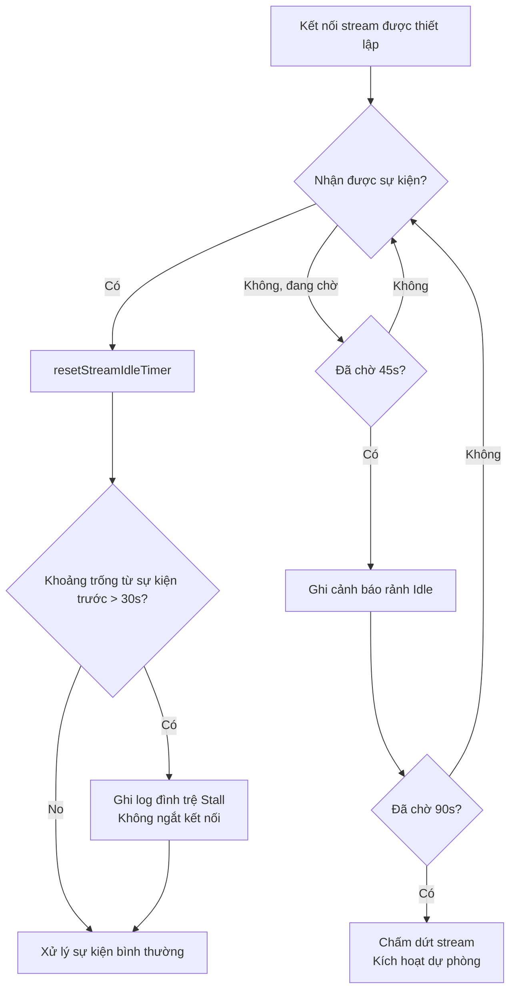

# Chương 6b: Lớp Giao tiếp API — Kỹ thuật Thử lại, Truyền trực tuyến và Hạ cấp

> Thư mục `services/api/` không phải là một lớp bọc SDK thông thường — nó chính là **Mặt phẳng Điều khiển (Control Plane)** của Agent. Việc hạ cấp model, bảo vệ cache, truyền file và debug bằng Prompt Replay đều diễn ra ở lớp này. Chương này tập trung vào các hệ thống con có khả năng phục hồi quan trọng nhất của nó: thử lại (retry), truyền trực tuyến (streaming) và hạ cấp (degradation). Kênh truyền file (Files API) được đề cập ở phần cuối chương này, còn công cụ debug Prompt Replay được phân tích ở Chương 29.

---

## Tại sao Điều này lại Quan trọng

Độ tin cậy của một hệ thống Agent không phụ thuộc vào việc mô hình thông minh đến mức nào, mà phụ thuộc vào việc nó có thể tiếp tục hoạt động trong các điều kiện mạng tồi tệ nhất hay không. Hãy tưởng tượng một nhà phát triển sử dụng Claude Code trên tàu để xử lý một lỗi khẩn cấp: WiFi chập chờn, API thỉnh thoảng trả về lỗi quá tải 529, và phản hồi truyền trực tuyến đột ngột bị ngắt giữa chừng. Nếu không có thiết kế phục hồi đủ tốt ở lớp giao tiếp, nhà phát triển này sẽ phải đối mặt với một sự cố sập ứng dụng khó hiểu hoặc phải tự tay thử lại nhiều lần, gây lãng phí không gian cửa sổ ngữ cảnh quý giá.

Lớp giao tiếp của Claude Code giải quyết chính xác những vấn đề này. Nó không phải là một lớp bọc "thử lại khi thất bại" đơn giản, mà là một hệ thống phòng thủ nhiều tầng: cơ chế lùi bước lũy thừa (exponential backoff) ngăn chặn hiệu ứng tuyết lở, bộ đếm lỗi 529 kích hoạt hạ cấp model, cơ chế watchdog kép phát hiện luồng truyền trực tuyến bị ngắt quãng, cơ chế thử lại nhận thức cache trong Chế độ Nhanh (Fast Mode) giúp bảo vệ chi phí, và chế độ bền bỉ hỗ trợ các kịch bản chạy tự động. Các cơ chế này cùng nhau thể hiện một triết lý kỹ thuật cốt lõi: **lỗi giao tiếp là bình thường chứ không phải ngoại lệ, và hệ thống phải có kế hoạch dự phòng ở mọi tầng.**

Một điểm đáng chú ý khác là thiết kế khả năng quan sát (observability) của hệ thống này. Mỗi cuộc gọi API phát ra ba sự kiện đo lường từ xa — `tengu_api_query` (gửi yêu cầu), `tengu_api_success` (phản hồi thành công), `tengu_api_error` (yêu cầu thất bại) — kết hợp với 25 phân loại lỗi và phát hiện dấu vân tay cổng kết nối, giúp mọi sự cố giao tiếp đều có thể truy vết và chẩn đoán. Đây là một hệ thống được rèn giũa từ lưu lượng sản xuất thực tế, nơi mỗi dòng code đều ứng với một tình huống lỗi đã thực sự xảy ra.

---

## Phân tích Mã nguồn

> **Phiên bản tương tác**: [Bấm vào đây để xem hoạt hình thử lại và hạ cấp](retry-viz.html) — Minh họa dòng thời gian cho 4 kịch bản (bình thường / giới hạn tần suất 429 / quá tải 529 / hạ cấp Chế độ Nhanh).

### 6b.1 Chiến lược Thử lại: Từ Lùi bước Lũy thừa đến Hạ cấp Model

Hệ thống thử lại của Claude Code được triển khai trong file `withRetry.ts`. Cốt lõi là một hàm `AsyncGenerator` `withRetry()` sử dụng từ khóa `yield` trong thời gian chờ thử lại để chuyển thông tin `SystemAPIErrorMessage` lên lớp trên, cho phép UI hiển thị trạng thái thử lại theo thời gian thực.

#### Các Hằng số và Cấu hình

Hành vi của hệ thống thử lại được chi phối bởi một tập hợp các hằng số được tinh chỉnh kỹ lưỡng:

| Hằng số | Giá trị | Mục đích | Vị trí Nguồn |
|----------|-------|---------|-----------------|
| `DEFAULT_MAX_RETRIES` | 10 | Số lần thử lại tối đa mặc định | `withRetry.ts:52` |
| `MAX_529_RETRIES` | 3 | Kích hoạt hạ cấp model sau 3 lần quá tải 529 liên tiếp | `withRetry.ts:54` |
| `BASE_DELAY_MS` | 500 | Cơ số lùi bước lũy thừa (500ms x 2^(attempt-1)) | `withRetry.ts:55` |
| `PERSISTENT_MAX_BACKOFF_MS` | 5 phút | Thời gian lùi bước tối đa trong chế độ bền bỉ | `withRetry.ts:96` |
| `PERSISTENT_RESET_CAP_MS` | 6 giờ | Giới hạn tuyệt đối trong chế độ bền bỉ | `withRetry.ts:97` |
| `HEARTBEAT_INTERVAL_MS` | 30 giây | Khoảng thời gian gửi heartbeat (ngăn container rảnh bị thu hồi) | `withRetry.ts:98` |
| `SHORT_RETRY_THRESHOLD_MS` | 20 giây | Ngưỡng thử lại ngắn của Chế độ Nhanh | `withRetry.ts:800` |
| `DEFAULT_FAST_MODE_FALLBACK_HOLD_MS` | 30 phút | Thời gian cooldown của Chế độ Nhanh | `withRetry.ts:799` |

Giới hạn 10 lần thử lại nghe có vẻ nhiều, nhưng khi kết hợp với lùi bước lũy thừa (500ms -> 1s -> 2s -> 4s -> 8s -> 16s -> 32s x 4), tổng thời gian chờ là khoảng 2,5 đến 3 phút. Phiên bản thực tế cũng thêm từ 0 đến 25% độ nhiễu ngẫu nhiên (random jitter) vào mỗi khoảng lùi bước (`withRetry.ts:542-547`), ngăn chặn việc nhiều client cùng thử lại một lúc gây ra hiệu ứng bầy đàn (Thundering Herd effect). Đây là một thiết kế được cân chỉnh kỹ lưỡng: đủ số lần thử lại để vượt qua các sự cố mạng ngắn hạn, nhưng không quá nhiều khiến người dùng phải đợi quá lâu khi API thực sự không khả dụng.

#### Quyết định Thử lại: Hàm shouldRetry

Hàm `shouldRetry()` là bộ ra quyết định cốt lõi của hệ thống thử lại, được định nghĩa tại `withRetry.ts:696-787`. Nó nhận vào một `APIError` và trả về một giá trị boolean. Phân tích tất cả các nhánh trả về của nó cho thấy ba nhóm hành vi:

**Không bao giờ thử lại:**

| Điều kiện | Kết quả | Lý do |
|-----------|---------|--------|
| Lỗi mock (dùng để test) | `false` | Từ lệnh `/mock-limits`, không bị ghi đè bởi việc thử lại |
| `x-should-retry: false` (người dùng không phải ant hoặc mã lỗi khác 5xx) | `false` | Máy chủ chỉ định rõ ràng không thử lại |
| Không có mã trạng thái và không phải lỗi kết nối | `false` | Không thể xác định loại lỗi |
| Mã lỗi 429 của người đăng ký ClaudeAI (không phải Enterprise) | `false` | Giới hạn tần suất của người dùng Max/Pro là cấp giờ; thử lại vô ích |

**Luôn luôn thử lại:**

| Điều kiện | Kết quả | Lý do |
|-----------|---------|--------|
| Lỗi 429/529 trong chế độ bền bỉ | `true` | Các kịch bản chạy tự động (không giám sát) yêu cầu thử lại vô hạn |
| Lỗi 401/403 trong chế độ CCR | `true` | Xác thực trong môi trường từ xa được quản lý bởi hạ tầng; các lỗi ngắn hạn có thể khôi phục |
| Lỗi tràn ngữ cảnh (400) | `true` | Có thể phân tích thông báo lỗi và tự động điều chỉnh `max_tokens` (`withRetry.ts:726`) |
| Thông báo lỗi chứa `overloaded_error` | `true` | SDK đôi khi không truyền đúng mã trạng thái 529 trong chế độ truyền trực tuyến |
| `APIConnectionError` (lỗi kết nối) | `true` | Sự cố mạng tạm thời là lỗi nhất thời phổ biến nhất |
| 408 (hết hạn yêu cầu) | `true` | Hết hạn phía máy chủ; thử lại thường thành công |
| 409 (hết hạn khóa) | `true` | Tranh chấp tài nguyên phía backend; thử lại thường thành công |
| 401 (lỗi xác thực) | `true` | Xóa bộ nhớ đệm API key rồi thử lại |
| 403 (OAuth token bị thu hồi) | `true` | Tiến trình khác đã làm mới token |
| 5xx (lỗi máy chủ) | `true` | Lỗi phía máy chủ thường là tạm thời |

**Thử lại có điều kiện:**

| Điều kiện | Kết quả | Lý do |
|-----------|---------|--------|
| `x-should-retry: true` và không phải người đăng ký ClaudeAI, hoặc có đăng ký nhưng là gói Enterprise | `true` | Máy chủ chỉ định thử lại và loại người dùng hỗ trợ điều đó |
| Lỗi 429 (người dùng không đăng ký ClaudeAI hoặc Enterprise) | `true` | Giới hạn tần suất cho người dùng trả tiền theo mức sử dụng rất ngắn |

Có một quyết định thiết kế đáng chú ý ở đây: đối với người dùng đăng ký ClaudeAI (Max/Pro), ngay cả khi header `x-should-retry` bằng `true`, lỗi 429 cũng sẽ không được thử lại. Lý do được nêu rõ trong phần bình luận mã nguồn:

```typescript
// restored-src/src/services/api/withRetry.ts:735-736
// Đối với người dùng Max và Pro, should-retry bằng true, nhưng thời gian chờ là vài giờ, vì vậy chúng ta không nên thử lại.
// Người dùng Enterprise có thể thử lại vì họ thường sử dụng PAYG thay vì các giới hạn tần suất cố định.
```

Cửa sổ giới hạn tần suất của người dùng Max/Pro thường tính bằng giờ — việc thử lại chỉ làm mất thời gian, và tốt hơn là thông báo trực tiếp cho người dùng. Đây là một **quyết định phân hóa dựa trên sự thấu hiểu kịch bản của người dùng**, thay vì một chính sách thử lại rập khuôn cho tất cả.

#### Phễu Phân loại Lỗi Ba Tầng

Việc xử lý lỗi của Claude Code không phải là một cấu trúc switch-case phẳng mà là một cấu trúc phễu ba tầng:

```
classifyAPIError()  — Hơn 19 kiểu cụ thể (dành cho đo lường từ xa và chẩn đoán)
    ↓ ánh xạ
categorizeRetryableAPIError()  — 4 danh mục SDK (dành cho việc hiển thị lỗi ở lớp trên)
    ↓ quyết định
shouldRetry()  — boolean (dành cho vòng lặp thử lại)
```

Tầng thứ nhất, `classifyAPIError()` (`errors.ts:965-1161`), chia nhỏ lỗi thành hơn 25 loại cụ thể, bao gồm `aborted`, `api_timeout`, `repeated_529`, `capacity_off_switch`, `rate_limit`, `server_overload`, `prompt_too_long`, `pdf_too_large`, `pdf_password_protected`, `image_too_large`, `tool_use_mismatch`, `unexpected_tool_result`, `duplicate_tool_use_id`, `invalid_model`, `credit_balance_low`, `invalid_api_key`, `token_revoked`, `oauth_org_not_allowed`, `auth_error`, `bedrock_model_access`, `server_error`, `client_error`, `ssl_cert_error`, `connection_error`, và `unknown`. Các phân loại này được ghi trực tiếp vào trường `errorType` của sự kiện đo lường từ xa `tengu_api_error`, cho phép phân tích chính xác các sự cố trên môi trường production.

Tầng thứ hai, `categorizeRetryableAPIError()` (`errors.ts:1163-1182`), gộp các loại lỗi chi tiết này thành 4 danh mục cấp SDK: `rate_limit` (429 và 529), `authentication_failed` (401 and 403), `server_error` (408 trở lên), và `unknown`. Tầng này cung cấp thông tin hiển thị lỗi đơn giản hóa cho giao diện UI lớp trên.

Tầng thứ ba là chính hàm `shouldRetry()`, đưa ra quyết định boolean cuối cùng.

Lợi ích của thiết kế ba tầng này là thông tin chẩn đoán có thể rất chi tiết (25 phân loại) trong khi logic quyết định vẫn ngắn gọn (true/false). Hai mối bận tâm được tách biệt hoàn toàn.

#### Xử lý Đặc biệt đối với Lỗi Quá tải 529

Lỗi 529 giữ một vị trí đặc biệt trong hệ thống thử lại của Claude Code. Lỗi 529 có nghĩa là backend API không đủ dung lượng xử lý — khác với lỗi 429 (giới hạn tần suất của người dùng), đây là tình trạng quá tải cấp hệ thống.

Đầu tiên, không phải mọi nguồn truy vấn đều thử lại khi gặp lỗi 529. `FOREGROUND_529_RETRY_SOURCES` (`withRetry.ts:62-82`) định nghĩa một danh sách cho phép chỉ các yêu cầu chạy ở foreground (yêu cầu mà người dùng đang chủ động chờ đợi kết quả) mới được thử lại:

```typescript
// restored-src/src/services/api/withRetry.ts:57-61
// Các nguồn truy vấn chạy ở foreground nơi người dùng ĐANG chờ kết quả — những nguồn này
// sẽ thử lại khi gặp lỗi 529. Mọi thứ khác (tóm tắt, tiêu đề, gợi ý, bộ phân loại)
// sẽ bỏ cuộc ngay lập tức: trong quá trình quá tải tầng, mỗi lần thử lại sẽ gây ra
// khuếch đại cổng kết nối từ 3 đến 10 lần, và người dùng cũng không bao giờ thấy những lỗi đó.
```

Đây là một **chiến lược cắt giảm tải cấp hệ thống (load shedding)**: khi backend bị quá tải, các tác vụ chạy nền (tạo tóm tắt, tạo tiêu đề, tạo gợi ý) lập tức bỏ cuộc thay vì tham gia vào hàng đợi thử lại. Mỗi lần thử lại sẽ làm tăng tải lên hệ thống đang quá tải gấp 3-10 lần — việc giảm các lần thử lại không cần thiết là chìa khóa để ngăn chặn lỗi quá tải lan truyền (cascading failures).

Thứ hai, ba lỗi 529 liên tiếp sẽ kích hoạt hạ cấp model. Logic này nằm ở `withRetry.ts:327-364`:

```typescript
// restored-src/src/services/api/withRetry.ts:327-351
if (is529Error(error) &&
    (process.env.FALLBACK_FOR_ALL_PRIMARY_MODELS ||
     (!isClaudeAISubscriber() && isNonCustomOpusModel(options.model)))
) {
  consecutive529Errors++
  if (consecutive529Errors >= MAX_529_RETRIES) {
    if (options.fallbackModel) {
      logEvent('tengu_api_opus_fallback_triggered', {
        original_model: options.model,
        fallback_model: options.fallbackModel,
        provider: getAPIProviderForStatsig(),
      })
      throw new FallbackTriggeredError(
        options.model,
        options.fallbackModel,
      )
    }
    // ...
  }
}
```

`FallbackTriggeredError` (`withRetry.ts:160-168`) là một lớp lỗi chuyên dụng. Nó không phải là một ngoại lệ thông thường — nó là một **tín hiệu luồng điều khiển (control flow signal)** mà khi được bắt bởi vòng lặp Agent Loop ở lớp trên, sẽ kích hoạt việc chuyển đổi model (thường là từ Opus sang Sonnet). Việc sử dụng ngoại lệ cho luồng điều khiển là một anti-pattern trong nhiều ngữ cảnh, nhưng ở đây nó được chấp nhận: sự kiện hạ cấp cần được truyền qua nhiều tầng call stack để tới được Agent Loop, và ngoại lệ là cơ chế truyền ngược lên tự nhiên nhất.

Hàm `CannotRetryError` (`withRetry.ts:144-158`) cũng quan trọng không kém, nó mang theo `retryContext` (bao gồm model hiện tại, cấu hình suy nghĩ, giá trị override max_tokens, v.v.), cung cấp cho lớp trên đầy đủ thông tin để quyết định cách xử lý lỗi.

---

### 6b.2 Truyền trực tuyến: Cơ chế Watchdog Kép

Các phản hồi truyền trực tuyến (streaming) là phần cốt lõi trong trải nghiệm người dùng của Claude Code — người dùng thấy văn bản xuất hiện dần dần thay vì phải chờ đợi trước một trang màn hình trống. Nhưng các kết nối truyền trực tuyến mỏng manh hơn nhiều so với các yêu cầu HTTP thông thường: kết nối TCP có thể bị đóng âm thầm bởi các proxy trung gian, máy chủ có thể bị treo trong quá trình tạo nội dung, và cơ chế timeout của SDK chỉ bao phủ giai đoạn kết nối ban đầu chứ không bao phủ giai đoạn truyền dữ liệu.

Claude Code giải quyết vấn đề này trong `claude.ts` bằng hai tầng watchdog.

#### Watchdog Hết hạn Chờ (Idle Timeout Watchdog - Ngắt kết nối)

```typescript
// restored-src/src/services/api/claude.ts:1877-1878
const STREAM_IDLE_TIMEOUT_MS =
  parseInt(process.env.CLAUDE_STREAM_IDLE_TIMEOUT_MS || '', 10) || 90_000
const STREAM_IDLE_WARNING_MS = STREAM_IDLE_TIMEOUT_MS / 2
```

Watchdog này tuân theo mẫu hình **cảnh báo hai giai đoạn (two-phase alert)** kinh điển:

1. **Giai đoạn Cảnh báo** (45 giây): Nếu không nhận được sự kiện truyền trực tuyến (chunk) nào trong 45 giây, một log cảnh báo và sự kiện chẩn đoán `cli_streaming_idle_warning` sẽ được ghi lại. Luồng truyền dữ liệu lúc này có thể chỉ đang chậm — chưa hẳn đã chết.
2. **Giai đoạn Hết hạn Chờ** (90 giây): Nếu trôi qua 90 giây mà không nhận được sự kiện nào, luồng dữ liệu được coi là đã chết. Hệ thống sẽ thiết lập `streamIdleAborted = true`, ghi lại một ảnh chụp nhanh `performance.now()` (để đo lường độ trễ lan truyền hủy bỏ sau đó), gửi sự kiện đo lường từ xa `tengu_streaming_idle_timeout`, sau đó gọi `releaseStreamResources()` để buộc chấm dứt luồng dữ liệu.

Mỗi khi có một sự kiện truyền trực tuyến mới đến, `resetStreamIdleTimer()` sẽ reset cả hai bộ đếm thời gian. Điều này đảm bảo rằng chừng nào luồng dữ liệu còn sống — dù chậm — watchdog sẽ không chấm dứt nó quá sớm.

```typescript
// restored-src/src/services/api/claude.ts:1895-1928
function resetStreamIdleTimer(): void {
  clearStreamIdleTimers()
  if (!streamWatchdogEnabled) { return }
  streamIdleWarningTimer = setTimeout(/* warning */, STREAM_IDLE_WARNING_MS)
  streamIdleTimer = setTimeout(() => {
    streamIdleAborted = true
    streamWatchdogFiredAt = performance.now()
    // ... ghi log và gửi dữ liệu đo lường từ xa
    releaseStreamResources()
  }, STREAM_IDLE_TIMEOUT_MS)
}
```

Lưu ý rằng watchdog phải được kích hoạt rõ ràng thông qua biến môi trường `CLAUDE_ENABLE_STREAM_WATCHDOG`. Điều này cho thấy tính năng này vẫn đang trong giai đoạn triển khai lũy tiến — được xác thực trước với người dùng nội bộ và một số lượng hạn chế người dùng trước khi mở rộng cho tất cả mọi người.

#### Phát hiện Đình trệ (Stall Detection - Chỉ ghi log)

```typescript
// restored-src/src/services/api/claude.ts:1936
const STALL_THRESHOLD_MS = 30_000 // 30 giây
```

Phát hiện đình trệ giải quyết một vấn đề khác với watchdog hết hạn chờ:

- **Idle** = "không nhận được bất kỳ sự kiện nào" (kết nối có thể đã chết)
- **Stall** = "nhận được sự kiện, nhưng khoảng cách giữa chúng quá lớn" (kết nối vẫn sống, nhưng máy chủ phản hồi chậm)

Cơ chế phát hiện đình trệ chỉ **ghi log** — nó không **ngắt kết nối**. Khi khoảng thời gian giữa hai sự kiện truyền trực tuyến vượt quá 30 giây, nó sẽ tăng `stallCount` và `totalStallTime`, đồng thời gửi sự kiện đo lường từ xa `tengu_streaming_stall`:

```typescript
// restored-src/src/services/api/claude.ts:1944-1965
if (lastEventTime !== null) {
  const timeSinceLastEvent = now - lastEventTime
  if (timeSinceLastEvent > STALL_THRESHOLD_MS) {
    stallCount++
    totalStallTime += timeSinceLastEvent
    logForDebugging(
      `Streaming stall detected: ${(timeSinceLastEvent / 1000).toFixed(1)}s gap between events (stall #${stallCount})`,
      { level: 'warn' },
    )
    logEvent('tengu_streaming_stall', { /* ... */ })
  }
}
lastEventTime = now
```

Một chi tiết quan trọng: `lastEventTime` chỉ được ghi nhận sau khi chunk đầu tiên đến, tránh việc nhận nhầm TTFB (Thời gian xuất hiện token đầu tiên - Time to First Token) là một vụ đình trệ. TTFB có thể lớn một cách hợp lý (khi model đang suy nghĩ), nhưng một khi đầu ra đã bắt đầu, các khoảng giãn cách sự kiện sau đó phải ổn định.

Sự phối hợp giữa hai tầng watchdog có thể được minh họa như sau:



#### Dự phòng Không Truyền trực tuyến (Non-Streaming Fallback)

Khi một kết nối truyền trực tuyến bị watchdog ngắt hoặc thất bại vì các lý do khác, Claude Code sẽ dự phòng chuyển sang chế độ yêu cầu không truyền trực tuyến (non-streaming). Logic này nằm ở `claude.ts:2464-2569`.

Hai thông tin quan trọng được ghi lại trong quá trình dự phòng:

1. **`fallback_cause`**: `'watchdog'` (hết hạn chờ watchdog) hoặc `'other'` (lỗi khác), dùng để phân biệt nguyên nhân kích hoạt.
2. **`initialConsecutive529Errors`**: Nếu bản thân lỗi truyền trực tuyến là lỗi 529, số lần lỗi liên tiếp sẽ được truyền sang vòng lặp thử lại không truyền trực tuyến. Điều này đảm bảo bộ đếm lỗi 529 không bị reset khi chuyển từ truyền trực tuyến sang không truyền trực tuyến:

```typescript
// restored-src/src/services/api/claude.ts:2559
initialConsecutive529Errors: is529Error(streamingError) ? 1 : 0,
```

Chế độ dự phòng không truyền trực tuyến có cấu hình timeout riêng:

```typescript
// restored-src/src/services/api/claude.ts:807-811
function getNonstreamingFallbackTimeoutMs(): number {
  const override = parseInt(process.env.API_TIMEOUT_MS || '', 10)
  if (override) return override
  return isEnvTruthy(process.env.CLAUDE_CODE_REMOTE) ? 120_000 : 300_000
}
```

Môi trường CCR (Claude Code Remote) mặc định là 2 phút, trong khi môi trường cục bộ mặc định là 5 phút. Sở dĩ CCR có thời gian timeout ngắn hơn là vì các container từ xa có cơ chế thu hồi tài nguyên rảnh khoảng ~5 phút — một tiến trình bị treo 5 phút sẽ khiến container nhận tín hiệu SIGKILL, do đó tốt hơn là hết hạn chờ một cách chủ động ở mốc 2 phút.

Cần lưu ý rằng dự phòng không truyền trực tuyến có thể bị vô hiệu hóa thông qua Feature Flag `tengu_disable_streaming_to_non_streaming_fallback` hoặc biến môi trường `CLAUDE_CODE_DISABLE_NONSTREAMING_FALLBACK`. Lý do được giải thích rõ trong bình luận mã nguồn:

```typescript
// restored-src/src/services/api/claude.ts:2464-2468
// Khi flag được bật, bỏ qua dự phòng không truyền trực tuyến và để lỗi
// lan truyền lên vớiRetry. Việc dự phòng giữa luồng truyền trực tuyến gây ra
// việc thực thi công cụ hai lần khi cơ chế truyền trực tuyến công cụ đang hoạt động:
// luồng truyền trực tuyến một phần khởi chạy một công cụ, sau đó lần thử lại không truyền trực tuyến
// tạo ra cùng một tool_use và chạy nó lần nữa. Xem lỗi inc-4258.
```

Sự sửa đổi này ra đời từ một sự cố thực tế trên môi trường production (inc-4258): khi một công cụ đã bắt đầu thực thi trong quá trình truyền trực tuyến, và sau đó hệ thống dự phòng thử lại bằng chế độ không truyền trực tuyến, cùng một công cụ đó sẽ bị thực thi lần thứ hai. Mẫu hình lỗi "hoàn thành một phần + thử lại toàn bộ = thực thi trùng lặp" này là một cạm bẫy kinh điển của mọi hệ thống truyền trực tuyến.

---

### 6b.3 Thử lại Nhận thức Cache trong Chế độ Nhanh (Fast Mode)

Chế độ Nhanh (Fast Mode) là chế độ tăng tốc của Claude Code (xem Chương 21 để biết thêm chi tiết), sử dụng một tên model riêng biệt để đạt thông lượng cao hơn. Chiến lược thử lại trong Chế độ Nhanh có một cân nhắc đặc biệt: **Prompt Cache**.

Khi Chế độ Nhanh gặp lỗi 429 (giới hạn tần suất) hoặc 529 (quá tải), mấu chốt của quyết định thử lại nằm ở thời gian chờ được chỉ ra bởi header `Retry-After` (`withRetry.ts:267-305`):

```typescript
// restored-src/src/services/api/withRetry.ts:284-304
const retryAfterMs = getRetryAfterMs(error)
if (retryAfterMs !== null && retryAfterMs < SHORT_RETRY_THRESHOLD_MS) {
  // Thời gian Retry-After ngắn: chờ và thử lại khi Chế độ Nhanh vẫn đang hoạt động
  // để giữ lại prompt cache (cùng tên model khi thử lại).
  await sleep(retryAfterMs, options.signal, { abortError })
  continue
}
// Thời gian Retry-After dài hoặc chưa rõ: đi vào chế độ cooldown (chuyển sang model
// tốc độ tiêu chuẩn), với một mức tối thiểu để tránh dao động trạng thái liên tục.
const cooldownMs = Math.max(
  retryAfterMs ?? DEFAULT_FAST_MODE_FALLBACK_HOLD_MS,
  MIN_COOLDOWN_MS,
)
const cooldownReason: CooldownReason = is529Error(error)
  ? 'overloaded'
  : 'rate_limit'
triggerFastModeCooldown(Date.now() + cooldownMs, cooldownReason)
```

Sự đánh đổi chi phí đằng sau thiết kế này là:

| Kịch bản | Thời gian chờ | Chi lược | Lý do |
|----------|-----------|----------|--------|
| `Retry-After < 20s` | Ngắn | Chờ tại chỗ, giữ Chế độ Nhanh | Cache sẽ không hết hạn trong <20 giây; việc giữ lại cache giúp giảm đáng kể chi phí token trong yêu cầu tiếp theo |
| `Retry-After >= 20s` hoặc chưa rõ | Dài hơn | Chuyển sang chế độ tiêu chuẩn, vào chế độ cooldown | Cache có thể đã hết hạn; tốt hơn là chuyển sang chế độ tiêu chuẩn ngay lập tức để khôi phục tính khả dụng |

Mức cooldown tối thiểu là 10 phút (`MIN_COOLDOWN_MS`), mặc định là 30 phút (`DEFAULT_FAST_MODE_FALLBACK_HOLD_MS`). Mục đích của mức tối thiểu này là ngăn Chế độ Nhanh bị dao động trạng thái liên tục tại biên giới hạn tần suất, điều này sẽ tạo ra trải nghiệm người dùng không ổn định.

Ngoài ra, nếu lỗi 429 xảy ra do tính năng sử dụng quá mức (overage) không khả dụng — nghĩa là gói đăng ký của người dùng không hỗ trợ trả phí thêm vượt mức — Chế độ Nhanh sẽ bị **tắt vĩnh viễn** thay vì chỉ cooldown tạm thời:

```typescript
// restored-src/src/services/api/withRetry.ts:275-281
const overageReason = error.headers?.get(
  'anthropic-ratelimit-unified-overage-disabled-reason',
)
if (overageReason !== null && overageReason !== undefined) {
  handleFastModeOverageRejection(overageReason)
  retryContext.fastMode = false
  continue
}
```

---

### 6b.4 Chế độ Thử lại Bền bỉ (Persistent Retry Mode)

Việc thiết lập biến môi trường `CLAUDE_CODE_UNATTENDED_RETRY=1` sẽ kích hoạt chế độ thử lại bền bỉ của Claude Code. Chế độ này được thiết kế cho các kịch bản chạy tự động (CI/CD, xử lý hàng loạt, tự động hóa nội bộ Anthropic), và hành vi cốt lõi của nó là: **thử lại vô hạn khi gặp lỗi 429/529**.

Ba khía cạnh thiết kế chính của chế độ bền bỉ:

**1. Vòng lặp Vô hạn + Bộ đếm Độc lập**

Trong chế độ thông thường, biến `attempt` tăng từ 1 lên `maxRetries + 1` trước khi vòng lặp kết thúc. Chế độ bền bỉ đạt được vòng lặp vô hạn bằng cách giới hạn giá trị `attempt` ở cuối vòng lặp:

```typescript
// restored-src/src/services/api/withRetry.ts:505-506
// Giới hạn để vòng lặp for không bao giờ kết thúc. Việc lùi bước sử dụng bộ đếm
// persistentAttempt độc lập, bộ đếm này sẽ tiếp tục tăng tới mức giới hạn 5 phút.
if (attempt >= maxRetries) attempt = maxRetries
```

`persistentAttempt` là một bộ đếm độc lập chỉ tăng trong chế độ bền bỉ, dùng để tính toán thời gian lùi bước. Nó không bị giới hạn bởi `maxRetries`, vì vậy thời gian lùi bước sẽ tiếp tục tăng cho đến khi đạt mức trần 5 phút.

**2. Nhận biết Giới hạn Tần suất cấp Cửa sổ**

Đối với lỗi 429, chế độ bền bỉ kiểm tra header `anthropic-ratelimit-unified-reset` để lấy dấu thời gian reset. Nếu máy chủ báo hiệu "reset sau 5 giờ", hệ thống sẽ chờ trực tiếp cho đến thời điểm reset thay vì cứ thăm dò mù quáng mỗi 5 phút:

```typescript
// restored-src/src/services/api/withRetry.ts:436-447
if (persistent && error instanceof APIError && error.status === 429) {
  persistentAttempt++
  const resetDelay = getRateLimitResetDelayMs(error)
  delayMs =
    resetDelay ??
    Math.min(
      getRetryDelay(persistentAttempt, retryAfter, PERSISTENT_MAX_BACKOFF_MS),
      PERSISTENT_RESET_CAP_MS,
    )
}
```

**3. Heartbeat Keepalive (Duy trì nhịp tim)**

Đây là thiết kế thông minh nhất trong chế độ bền bỉ. Khi thời gian lùi bước dài (ví dụ: 5 phút), hệ thống không thực hiện một lệnh gọi `sleep(300000)` duy nhất. Thay vào đó, nó chia nhỏ thời gian chờ thành nhiều đoạn 30 giây, trả về (yield) một tin nhắn `SystemAPIErrorMessage` sau mỗi đoạn:

```typescript
// restored-src/src/services/api/withRetry.ts:489-503
let remaining = delayMs
while (remaining > 0) {
  if (options.signal?.aborted) throw new APIUserAbortError()
  if (error instanceof APIError) {
    yield createSystemAPIErrorMessage(
      error,
      remaining,
      reportedAttempt,
      maxRetries,
    )
  }
  const chunk = Math.min(remaining, HEARTBEAT_INTERVAL_MS)
  await sleep(chunk, options.signal, { abortError })
  remaining -= chunk
}
```

Cơ chế heartbeat này giải quyết hai vấn đề:
- **Thu hồi container rảnh**: Các môi trường từ xa như CCR sẽ xác định các tiến trình chạy lâu mà không có đầu ra là rảnh và thu hồi chúng. Lệnh yield mỗi 30 giây tạo ra hoạt động trên stdout, ngăn chặn việc bị thu hồi nhầm.
- **Khả năng phản hồi ngắt của người dùng**: Bằng cách kiểm tra `signal.aborted` giữa mỗi đoạn 30 giây, người dùng có thể ngắt thời gian chờ dài bất cứ lúc nào. Nếu sử dụng một lệnh `sleep(300s)` duy nhất, việc nhấn Ctrl-C sẽ phải đợi cho đến khi lệnh sleep hoàn thành mới có hiệu lực.

Một đoạn chú thích TODO trong mã nguồn tiết lộ tính chất tạm thời của thiết kế này:

```typescript
// restored-src/src/services/api/withRetry.ts:94-95
// TODO(ANT-344): việc duy trì keep-alive qua các lệnh yield SystemAPIErrorMessage là giải pháp tạm thời
// cho đến khi có một kênh keep-alive chuyên dụng.
```

---

### 6b.5 Khả năng Quan sát API

Hệ thống quan sát API của Claude Code được triển khai trong `logging.ts`, xoay quanh ba sự kiện đo lường từ xa:

#### Mô hình Ba Sự kiện

| Sự kiện | Điều kiện kích hoạt | Các trường chính | Vị trí Nguồn |
|-------|---------|------------|-----------------|
| `tengu_api_query` | Khi gửi yêu cầu | model, messagesLength, betas, querySource, thinkingType, effortValue, fastMode | `logging.ts:196` |
| `tengu_api_success` | Khi phản hồi thành công | model, inputTokens, outputTokens, cachedInputTokens, ttftMs, costUSD, gateway, didFallBackToNonStreaming | `logging.ts:463` |
| `tengu_api_error` | Khi yêu cầu thất bại | model, error, status, errorType (25 phân loại), durationMs, attempt, gateway | `logging.ts:304` |

Ba sự kiện này tạo thành một phễu yêu cầu hoàn chỉnh: query -> success/error. Bằng cách đối chiếu trên `requestId`, vòng đời hoàn chỉnh của một yêu cầu từ khi gửi đi đến khi hoàn thành có thể được truy vết.

#### TTFB và Trúng Cache

Chỉ số hiệu năng quan trọng nhất trong sự kiện thành công là `ttftMs` (Thời gian xuất hiện token đầu tiên - Time to First Token) — thời gian từ khi gửi yêu cầu đến khi chunk truyền trực tuyến đầu tiên đến. Chỉ số này phản ánh trực tiếp:

- Độ trễ mạng (thời gian khứ hồi từ client đến endpoint API)
- Độ trễ hàng đợi (thời gian yêu cầu nằm trong hàng đợi trên backend API)
- Thời gian mô hình tạo token đầu tiên (liên quan đến độ dài prompt và kích thước model)

Các trường liên quan đến cache (`cachedInputTokens` và `uncachedInputTokens`, tức là `cache_creation_input_tokens`) cho phép đội ngũ theo dõi tỷ lệ trúng Prompt Cache, vốn ảnh hưởng trực tiếp đến chi phí và TTFB.

#### Phát hiện Dấu vân tay Cổng kết nối (Gateway Fingerprint Detection)

Một tính năng dễ bị bỏ qua trong `logging.ts` là phát hiện cổng kết nối (`detectGateway()`, `logging.ts:107-139`). Nó xác định xem một yêu cầu có đi qua cổng kết nối AI bên thứ ba hay không bằng cách kiểm tra các tiền tố header phản hồi:

| Cổng kết nối | Tiền tố Header |
|---------|---------------|
| LiteLLM | `x-litellm-` |
| Helicone | `helicone-` |
| Portkey | `x-portkey-` |
| Cloudflare AI Gateway | `cf-aig-` |
| Kong | `x-kong-` |
| Braintrust | `x-bt-` |
| Databricks | Phát hiện qua hậu tố domain |

Khi phát hiện cổng kết nối, trường `gateway` sẽ được đưa vào các sự kiện thành công và thất bại. Điều này cho phép đội ngũ Anthropic chẩn đoán "các mẫu lỗi đặc thù trong một số môi trường cổng kết nối nhất định" — ví dụ, nếu tỷ lệ lỗi 404 qua proxy LiteLLM cao bất thường, đó có thể là lỗi cấu hình proxy chứ không phải lỗi API.

#### Giá trị Chẩn đoán của Phân loại Lỗi

Trường `errorType` trong các sự kiện lỗi sử dụng 25 phân loại của `classifyAPIError()`. So với các mã trạng thái HTTP đơn giản, các phân loại này cung cấp thông tin chẩn đoán chính xác hơn:

| Phân loại | Ý nghĩa | Giá trị Chẩn đoán |
|----------------|---------|------------------|
| `repeated_529` | Lỗi 529 liên tiếp vượt ngưỡng | Phân biệt quá tải lẻ tẻ với việc không khả dụng kéo dài |
| `tool_use_mismatch` | Lỗi không khớp cuộc gọi/kết quả công cụ | Chỉ ra lỗi trong quản lý ngữ cảnh |
| `ssl_cert_error` | Lỗi chứng chỉ SSL | Nhắc nhở người dùng kiểm tra cấu hình proxy |
| `token_revoked` | OAuth token bị thu hồi | Chỉ ra tranh chấp token giữa nhiều phiên chạy |
| `bedrock_model_access` | Lỗi truy cập model Bedrock | Nhắc nhở người dùng kiểm tra phân quyền IAM |

---

## Trích xuất Mẫu hình (Pattern Extraction)

### Mẫu hình 1: Ngân sách Thử lại Hữu hạn + Ngưỡng Hạ cấp Độc lập

- **Bài toán giải quyết**: Thử lại vô hạn gây ra việc người dùng phải chờ đợi và chi phí tăng vọt; đồng thời, các loại lỗi khác nhau đòi hỏi các ngưỡng kiên nhẫn khác nhau.
- **Giải pháp cốt lõi**: Thiết lập một ngân sách thử lại toàn cục (10 lần thử) trong khi thiết lập một ngân sách phụ độc lập cho các lỗi cụ thể (quá tải 529, 3 lần thử). Việc cạn kiệt ngân sách phụ sẽ kích hoạt hạ cấp model thay vì từ bỏ hoàn toàn. Hai bộ đếm chạy độc lập không ảnh hưởng lẫn nhau.
- **Điều kiện tiên quyết**: Phải có phương án hạ cấp rõ ràng (model dự phòng); bản thân việc hạ cấp không được tiêu thụ ngân sách chính.
- **Tham chiếu mã nguồn**: `restored-src/src/services/api/withRetry.ts:52-54` — `DEFAULT_MAX_RETRIES=10`, `MAX_529_RETRIES=3`.

### Mẫu hình 2: Watchdog Kép (Ghi log + Ngắt kết nối)

- **Bài toán giải quyết**: Kết nối truyền trực tuyến có thể chết âm thầm — TCP keepalive không thể bao phủ các lỗi treo âm thầm ở lớp ứng dụng.
- **Giải pháp cốt lõi**: Thiết lập hai lớp phát hiện. Cơ chế phát hiện đình trệ (30 giây) chỉ ghi log và phát ra dữ liệu đo lường từ xa khi khoảng giãn cách sự kiện quá lớn, không can thiệp vào luồng dữ liệu — vì phản hồi chậm không có nghĩa là đã chết. Watchdog hết hạn chờ (90 giây) sẽ chấm dứt kết nối và kích hoạt dự phòng khi không nhận được sự kiện nào — vì một luồng dữ liệu không có hoạt động trong 90 giây gần như chắc chắn đã chết.
- **Điều kiện tiên quyết**: Phải có đường dẫn dự phòng không truyền trực tuyến; các ngưỡng watchdog phải cấu hình được (các môi trường mạng khác nhau cần các ngưỡng khác nhau).
- **Tham chiếu mã nguồn**: `restored-src/src/services/api/claude.ts:1936` — Phát hiện đình trệ, `restored-src/src/services/api/claude.ts:1877` — Watchdog hết hạn chờ.

### Mẫu hình 3: Quyết định Thử lại Nhận thức Cache

- **Bài toán giải quyết**: Việc thử lại có thể gây mất Prompt Cache, và mất cache đồng nghĩa với chi phí token cao hơn và TTFB lâu hơn.
- **Giải pháp cốt lõi**: Đưa ra quyết định phân hóa dựa trên thời gian chờ dự kiến. Chờ ngắn (<20 giây) -> giữ lại cache và chờ tại chỗ, vì cache sẽ không hết hạn trong vòng 20 giây; chờ dài (>=20 giây) -> từ bỏ cache và chuyển chế độ, vì chi phí thời gian chờ đợi lớn hơn chi phí xây dựng lại cache.
- **Điều kiện tiên quyết**: API phải cung cấp header `Retry-After`; phải có chế độ thay thế để chuyển đổi.
- **Tham chiếu mã nguồn**: `restored-src/src/services/api/withRetry.ts:284-304`.

### Mẫu hình 4: Heartbeat Keepalive (Duy trì nhịp tim)

- **Bài toán giải quyết**: Trong thời gian sleep dài, tiến trình không tạo ra đầu ra nào và có thể bị môi trường máy chủ coi là rảnh và thu hồi.
- **Giải pháp cốt lõi**: Chia một lần sleep dài thành N đoạn 30 giây, trả về (yield) một tin nhắn sau mỗi đoạn để giữ cho luồng hoạt động. Đồng thời kiểm tra tín hiệu ngắt giữa mỗi đoạn, đảm bảo người dùng có thể hủy bất cứ lúc nào.
- **Điều kiện tiên quyết**: Bên gọi phải là một `AsyncGenerator` hoặc cấu trúc coroutine tương tự có khả năng tạo ra các kết quả trung gian trong quá trình chờ.
- **Tham chiếu mã nguồn**: `restored-src/src/services/api/withRetry.ts:489-503`.

---

### 6b.6 Kênh Truyền file: Files API

Thư mục `services/api/` cũng chứa một hệ thống con thường bị bỏ qua — `filesApi.ts`, triển khai chức năng upload/download file với Anthropic Public Files API. Đây không phải là một HTTP client đơn giản mà là một kênh truyền file phục vụ ba kịch bản riêng biệt:

| Kịch bản | Bên gọi | Hướng | Mục đích |
|----------|--------|-----------|---------|
| Tệp đính kèm khi khởi động phiên làm việc | `main.tsx` | Tải xuống | Các file được chỉ định bởi tham số `--file=<id>:<path>` |
| Tải lên bundle hạt giống CCR | `gitBundle.ts` | Tải lên | Truyền gói mã nguồn cho các phiên làm việc từ xa (xem Chương 20c) |
| Lưu trữ file BYOC | `filePersistence.ts` | Tải lên | Tải lên các file đã chỉnh sửa sau mỗi lượt |

Thiết kế của `FilesApiConfig` tiết lộ một ràng buộc quan trọng — các thao tác file yêu cầu một OAuth session token (không phải API key), vì các file được liên kết với phiên làm việc:

```typescript
// restored-src/src/services/api/filesApi.ts:60-67
export type FilesApiConfig = {
  /** OAuth token để xác thực (từ session JWT) */
  oauthToken: string
  /** URL cơ sở cho API (mặc định: https://api.anthropic.com) */
  baseUrl?: string
  /** Session ID để tạo các thư mục đặc thù cho phiên làm việc */
  sessionId: string
}
```

Giới hạn kích thước file là 500MB (`MAX_FILE_SIZE_BYTES`, dòng 82). Việc tải xuống sử dụng logic thử lại độc lập (3 lần thử với lùi bước lũy thừa, cơ số 500ms), thay vì sử dụng lại cơ chế thử lại chung của `withRetry.ts` — vì các dạng lỗi của tải xuống file (file quá lớn, không đủ dung lượng đĩa) khác với lỗi của cuộc gọi API (quá tải 429/529), yêu cầu một ngân sách thử lại độc lập.

Header thử nghiệm beta `files-api-2025-04-14,oauth-2025-04-20` (dòng 27) cho biết đây là một API vẫn đang phát triển — `oauth-2025-04-20` kích hoạt xác thực Bearer OAuth trên các đường dẫn API công khai.

---

## Những việc bạn có thể làm

1. **Hiểu mối quan hệ giữa lỗi 529 và hạ cấp model.** Sau 3 lỗi quá tải 529 liên tiếp, Claude Code sẽ tự động hạ cấp xuống model dự phòng (thường là từ Opus sang Sonnet). Nếu bạn nhận thấy chất lượng phản hồi giảm đột ngột, đó có thể là do model đã bị hạ cấp — hãy kiểm tra xem có sự kiện `tengu_api_opus_fallback_triggered` trong đầu ra terminal hay không. Đây không phải là bug; hệ thống đang tự bảo vệ tính khả dụng.

2. **Tận dụng cửa sổ cache của Chế độ Nhanh.** Các lỗi 429 ngắn hạn trong Chế độ Nhanh (Retry-After < 20 giây) sẽ không làm mất cache — Claude Code sẽ chờ tại chỗ để giữ lại cache. Nhưng thời gian chờ vượt quá 20 giây sẽ kích hoạt thời gian cooldown ít nhất 10 phút, trong đó hệ thống chuyển sang chế độ tốc độ tiêu chuẩn. Nếu bạn thường xuyên gặp trạng thái cooldown của Chế độ Nhanh, bạn có thể cần giảm tần suất yêu cầu của mình.

3. **Chế độ thử lại bền bỉ (v2.1.88, chỉ dành cho các bản build nội bộ Anthropic).** `CLAUDE_CODE_UNATTENDED_RETRY=1` kích hoạt chế độ thử lại vô hạn (với lùi bước lũy thừa, tối đa 5 phút), hỗ trợ chờ cho đến khi giới hạn tần suất reset dựa trên header `anthropic-ratelimit-unified-reset`. Nếu bạn đang xây dựng Agent của riêng mình, mẫu hình "heartbeat keepalive + chờ đợi nhận biết giới hạn tần suất" này rất đáng để áp dụng.

4. **TTFB là chỉ số độ trễ quan trọng nhất.** Trong chế độ `--verbose`, Claude Code báo cáo TTFB (Time to First Token) cho mỗi cuộc gọi API. Nếu giá trị này cao bất thường (>5 giây), điều đó có thể chỉ ra tình trạng quá tải phía API hoặc sự cố mạng. Hãy chú ý trường `cachedInputTokens` — nếu nó liên tục bằng 0, Prompt Cache của bạn đang không trúng, và bạn đang trả toàn bộ chi phí cho mỗi yêu cầu (xem Chương 13 để biết thêm chi tiết).

5. **Tùy chỉnh ngưỡng timeout của luồng truyền trực tuyến.** Nếu môi trường mạng của bạn có độ trễ cao (ví dụ: truy cập API qua VPN hoặc kết nối vệ tinh), ngưỡng mặc định 90 giây của Idle Timeout có thể quá khắt khe. Bạn có thể điều chỉnh ngưỡng này bằng cách thiết lập biến môi trường `CLAUDE_STREAM_IDLE_TIMEOUT_MS` (cũng yêu cầu `CLAUDE_ENABLE_STREAM_WATCHDOG=1`).

6. **Điều chỉnh ngân sách thử lại qua `CLAUDE_CODE_MAX_RETRIES`.** Mức mặc định 10 lần thử lại phù hợp với hầu hết các tình huống, nhưng nếu nhà cung cấp API của bạn thường xuyên trả về lỗi tạm thời, bạn có thể tăng con số này; nếu bạn muốn nhận phản hồi lỗi nhanh hơn, bạn có thể giảm xuống 3-5.

---

## Tiến hóa Phiên bản: v2.1.100 — Trình hướng dẫn Thiết lập Bedrock/Vertex và Nâng cấp Model

> Phân tích dưới đây dựa trên so sánh tín hiệu bundle của v2.1.100, kết hợp với suy luận từ mã nguồn v2.1.88.

### Trình hướng dẫn Thiết lập Đám mây Tương tác

v2.1.100 giới thiệu các trình hướng dẫn thiết lập tương tác hoàn chỉnh cho AWS Bedrock và Google Vertex AI, thay thế cho việc cấu hình biến môi trường thủ công trong v2.1.88. Lấy Bedrock làm ví dụ (quy trình Vertex là đối xứng), toàn bộ vòng đời thiết lập được bao phủ bởi 3 sự kiện:

```text
tengu_bedrock_setup_started → tengu_bedrock_setup_complete / tengu_bedrock_setup_cancelled
tengu_vertex_setup_started → tengu_vertex_setup_complete / tengu_vertex_setup_cancelled
```

Trình hướng dẫn thiết lập được khởi chạy từ một menu lựa chọn nền tảng thống nhất — người dùng có thể chọn Bedrock, Vertex, hoặc Microsoft Foundry (`oauth_platform_docs_opened` sẽ mở trang tài liệu tương ứng). Khi hoàn thành, phương thức xác thực (`auth_method`) sẽ được ghi nhận trong dữ liệu đo lường từ xa.

### Tự động Phát hiện Nâng cấp Model

Điểm bổ sung thú vị nhất trong v2.1.100 là **tự động phát hiện nâng cấp model**. Khi Anthropic phát hành các phiên bản model mới, hệ thống sẽ tự động phát hiện xem cấu hình hiện tại của người dùng có thể nâng cấp hay không:

```text
Luồng phát hiện:
  upgrade_check (kiểm tra các bản nâng cấp khả dụng)
    → probe_result (dò xem model mới có thể truy cập được trong tài khoản Bedrock/Vertex của người dùng không)
      → upgrade_accepted / upgrade_declined (quyết định của người dùng)
        → upgrade_relaunch (khởi động lại sau khi nâng cấp) / upgrade_save_failed (lưu thất bại)
```

Logic dò tìm được trích xuất từ bundle tiết lộ một thiết kế thanh lịch:

```javascript
// Phân tích đảo ngược bundle v2.1.100 — dò tìm nâng cấp Bedrock
// 1. Kiểm tra các phân tầng model không ghim (unpinned)
d("tengu_bedrock_default_check", { unpinned_tiers: String(q.length) });

// 2. Với mỗi phân tầng không ghim, dò xem model mới có khả năng truy cập không
let w = await Za8(O, Y.tier);  // Za8 = probeBedrockModel
d("tengu_bedrock_probe_result", {
  tier: Y.tier,
  model_id: O,
  accessible: String(w)
});
```

**Quyết định thiết kế chính**:
- Chỉ kiểm tra các phân tầng model "không ghim" (unpinned) — nếu người dùng ghim cứng một model ID qua biến môi trường, hệ thống sẽ không gợi ý nâng cấp.
- Các nâng cấp bị từ chối sẽ được lưu lại trong cấu hình người dùng qua `bedrockDeclinedUpgrades` / `vertexDeclinedUpgrades`, tránh việc hỏi lại nhiều lần.
- Khi model mặc định không thể truy cập, cơ chế dự phòng `default_fallback` sẽ kích hoạt — tự động chuyển sang một model thay thế trong cùng phân tầng.

### Backend Xác thực Mantle

v2.1.100 giới thiệu `mantle` làm backend xác thực API thứ năm (bên cạnh firstParty, bedrock, vertex, và foundry). Được kích hoạt qua biến môi trường `CLAUDE_CODE_USE_MANTLE`, có thể bỏ qua bằng `CLAUDE_CODE_SKIP_MANTLE_AUTH`. Mantle sử dụng các model ID có tiền tố `anthropic.` (ví dụ: `anthropic.claude-haiku-4-5`), gợi ý rằng đây là kênh xác thực doanh nghiệp do Anthropic lưu trữ, tách biệt với các cuộc gọi API trực tiếp.

### Tối ưu hóa Thử lại API

Sự kiện mới `tengu_api_retry_after_too_long` cho biết v2.1.100 đã bổ sung xử lý đặc biệt cho các giá trị header Retry-After quá lớn — khi API trả về thời gian chờ thử lại vượt quá một ngưỡng hợp lý, hệ thống có thể chọn từ bỏ việc chờ đợi và báo lỗi ngay lập tức, tránh việc người dùng phải trải qua tình trạng không phản hồi kéo dài.
