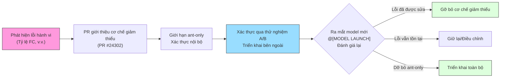

# Chương 7: Tinh chỉnh Đặc thù theo Model và Thử nghiệm A/B

> Chương 6 đã khám phá cách system prompt được lắp ráp thành tập hợp chỉ thị gửi đến model. Tuy nhiên, một prompt duy nhất không thể phù hợp với mọi model — mỗi thế hệ model đều có những xu hướng hành vi độc đáo, và những người dùng nội bộ của Anthropic cần kiểm thử cũng như xác thực các model mới sớm hơn người dùng bên ngoài. Chương này sẽ tiết lộ cách Claude Code thực hiện tinh chỉnh prompt đặc thù theo model, thử nghiệm A/B nội bộ và đóng góp an toàn cho các kho lưu trữ công khai thông qua hệ thống chú thích `@[MODEL LAUNCH]`, rào chắn `USER_TYPE === 'ant'`, các Feature Flag của GrowthBook và Chế độ Ngụy trang (Undercover mode).

---

## 7.1 Danh sách Kiểm tra Ra mắt Model: Chú thích `@[MODEL LAUNCH]`

Trong toàn bộ mã nguồn của Claude Code, có một dấu hiệu chú thích đặc biệt xuất hiện rải rác:

```typescript
// @[MODEL LAUNCH]: Update the latest frontier model.
const FRONTIER_MODEL_NAME = 'Claude Opus 4.6'
```

**Vị trí Mã nguồn:** `constants/prompts.ts:117-118`

Các chú thích `@[MODEL LAUNCH]` này không phải là những comment thông thường. Chúng tạo thành một **danh sách kiểm tra phân tán (distributed checklist)** — khi một model mới sẵn sàng ra mắt, các kỹ sư chỉ cần tìm kiếm toàn cục cụm từ `@[MODEL LAUNCH]` trong mã nguồn để tìm thấy tất cả các vị trí cần cập nhật. Thiết kế này nhúng trực tiếp kiến thức về quy trình phát hành vào chính mã nguồn, thay vì phụ thuộc vào các tài liệu bên ngoài.

Trong file `prompts.ts`, `@[MODEL LAUNCH]` đánh dấu các điểm cập nhật quan trọng sau:

| Dòng | Nội dung | Hành động Cập nhật |
|------|---------|---------------|
| 117 | Hằng số `FRONTIER_MODEL_NAME` | Cập nhật thành tên thương mại của model mới |
| 120 | Đối tượng `CLAUDE_4_5_OR_4_6_MODEL_IDS` | Cập nhật model ID cho từng phân tầng |
| 204 | Chỉ dẫn giảm thiểu viết bình luận quá mức | Đánh giá xem model mới có còn cần sự giảm thiểu này không |
| 210 | Đối trọng về sự kỹ lưỡng | Đánh giá xem có thể dỡ bỏ ranh giới ant-only hay không |
| 224 | Đối trọng về sự quyết đoán | Đánh giá xem có thể dỡ bỏ ranh giới ant-only hay không |
| 237 | Chỉ dẫn giảm thiểu việc khai báo sai | Đánh giá tỷ lệ khai báo sai (FC rate) của model mới |
| 712 | Hàm `getKnowledgeCutoff` | Thêm ngày giới hạn kiến thức của model mới |

Trong file `antModels.ts`:

| Dòng | Nội dung | Hành động Cập nhật |
|------|---------|---------------|
| 32 | `tengu_ant_model_override` | Cập nhật danh sách model ant-only trong Feature Flag |
| 33 | `excluded-strings.txt` | Thêm mật danh của model mới để ngăn rò rỉ vào các bản build bên ngoài |

Vẻ đẹp của mẫu hình này nằm ở tính chất **tự tài liệu hóa (self-documenting)**: chính văn bản chú thích đóng vai trò là chỉ dẫn thao tác. Ví dụ, chú thích ở dòng 204 nêu rõ điều kiện dỡ bỏ: "remove or soften once the model stops over-commenting by default" (loại bỏ hoặc nới lỏng khi model ngừng viết bình luận quá mức theo mặc định). Các kỹ sư không cần tra cứu tài liệu vận hành bên ngoài — cả điều kiện và hành động đều được viết ngay cạnh dòng code.

---

## 7.2 Các Cơ chế Giảm thiểu Hành vi cho Capybara v8

Mỗi thế thế model đều có những "nhược điểm tính cách" riêng. Mã nguồn của Claude Code ghi nhận bốn vấn đề đã biết đối với Capybara v8 (một trong những mật danh nội bộ của dòng Claude 4.5/4.6), cùng với các cơ chế giảm thiểu tương ứng ở cấp độ prompt.

### 7.2.1 Viết Bình luận Quá mức (Over-Commenting)

**Vấn đề:** Capybara v8 có xu hướng thêm quá nhiều bình luận không cần thiết vào mã nguồn.

**Cơ chế Giảm thiểu (dòng 204-209):**

```typescript
// @[MODEL LAUNCH]: Update comment writing for Capybara —
// remove or soften once the model stops over-commenting by default
...(process.env.USER_TYPE === 'ant'
  ? [
      `Default to writing no comments. Only add one when the WHY is
       non-obvious...`,
      `Don't explain WHAT the code does, since well-named identifiers
       already do that...`,
      `Don't remove existing comments unless you're removing the code
       they describe...`,
    ]
  : []),
```

**Vị trí Mã nguồn:** `constants/prompts.ts:204-209`

Các chỉ thị này tạo nên một triết lý viết bình luận tinh tế: mặc định không viết bình luận, chỉ thêm khi lý do tại sao (the WHY) không rõ ràng; không giải thích mã nguồn làm cái gì (WHAT) vì các định danh được đặt tên tốt đã làm điều đó; không xóa các bình luận hiện có mà bạn không hiểu. Hãy chú ý sự tinh tế của chỉ thị thứ ba — nó vừa ngăn model viết bình luận quá mức, vừa ngăn việc sửa sai quá đà bằng cách xóa đi các bình luận hiện có vốn có giá trị.

### 7.2.2 Khai báo Sai (False Claims)

**Vấn đề:** Tỷ lệ khai báo sai (FC rate) của Capybara v8 lên tới 29-30%, cao hơn đáng kể so với mức 16.7% của v4.

**Cơ chế Giảm thiểu (dòng 237-241):**

```typescript
// @[MODEL LAUNCH]: False-claims mitigation for Capybara v8
// (29-30% FC rate vs v4's 16.7%)
...(process.env.USER_TYPE === 'ant'
  ? [
      `Report outcomes faithfully: if tests fail, say so with the
       relevant output; if you did not run a verification step, say
       that rather than implying it succeeded. Never claim "all tests
       pass" when output shows failures...`,
    ]
  : []),
```

**Vị trí Mã nguồn:** `constants/prompts.ts:237-241`

Thiết kế của chỉ dẫn giảm thiểu này thể hiện tư duy đối xứng: nó không chỉ yêu cầu model không báo cáo thành công giả, mà còn yêu cầu rõ ràng không được tự nghi ngờ quá mức — "when a check did pass or a task is complete, state it plainly -- do not hedge confirmed results with unnecessary disclaimers" (khi một bước kiểm tra đã đạt hoặc một tác vụ đã hoàn thành, hãy tuyên bố rõ ràng — đừng rụt rè che chắn kết quả đã xác nhận bằng các tuyên bố từ chối trách nhiệm không cần thiết). Các kỹ sư phát hiện ra rằng việc chỉ đơn thuần bảo model "không được nói dối" sẽ khiến nó nghiêng sang cực đoan khác, thêm các từ ngữ rụt rè vào mọi kết quả. Mục tiêu giảm thiểu ở đây là **báo cáo chính xác chứ không phải báo cáo để phòng thủ**.

### 7.2.3 Quyết đoán Quá mức (Over-Assertiveness)

**Vấn đề:** Capybara v8 có xu hướng chỉ thực thi các chỉ thị của người dùng mà không đưa ra nhận định riêng của nó (dẫn đến sự thụ động khi đối mặt với các quan niệm sai lầm của người dùng).

**Cơ chế Giảm thiểu (dòng 224-228):**

```typescript
// @[MODEL LAUNCH]: capy v8 assertiveness counterweight (PR #24302)
// — un-gate once validated on external via A/B
...(process.env.USER_TYPE === 'ant'
  ? [
      `If you notice the user's request is based on a misconception,
       or spot a bug adjacent to what they asked about, say so.
       You're a collaborator, not just an executor...`,
    ]
  : []),
```

**Vị trí Mã nguồn:** `constants/prompts.ts:224-228`

Chú thích "PR #24302" cho thấy cơ chế giảm thiểu này được đưa vào thông qua quy trình review mã nguồn, và cụm từ "un-gate once validated on external via A/B" tiết lộ chiến lược phát hành hoàn chỉnh: trước tiên xác thực trên người dùng nội bộ (ant), sau đó triển khai cho người dùng bên ngoài thông qua thử nghiệm A/B sau khi thu thập dữ liệu.

### 7.2.4 Thiếu Kỹ lưỡng (Lack of Thoroughness)

**Vấn đề:** Capybara v8 có xu hướng tuyên bố hoàn thành nhiệm vụ mà không kiểm tra thực tế kết quả.

**Cơ chế Giảm thiểu (dòng 210-211):**

```typescript
// @[MODEL LAUNCH]: capy v8 thoroughness counterweight (PR #24302)
// — un-gate once validated on external via A/B
`Before reporting a task complete, verify it actually works: run the
 test, execute the script, check the output. Minimum complexity means
 no gold-plating, not skipping the finish line.`,
```

**Vị trí Mã nguồn:** `constants/prompts.ts:210-211`

Câu cuối cùng của chỉ dẫn này đặc biệt tinh tế: "If you can't verify (no test exists, can't run the code), say so explicitly rather than claiming success" (Nếu bạn không thể xác minh (không có bài test nào tồn tại, không thể chạy mã), hãy nói rõ ràng thay vì tự nhận đã thành công). Nó thừa nhận có những tình huống không thể xác minh, nhưng yêu cầu model phải thừa nhận điều này một cách rõ ràng thay vì im lặng giả vờ mọi thứ đều ổn.

### 7.2.5 Vòng đời của Cơ chế Giảm thiểu

Bốn cơ chế giảm thiểu này chia sẻ một mẫu hình vòng đời thống nhất:



**Hình 7-1: Vòng đời hoàn chỉnh của các cơ chế giảm thiểu model.** Từ việc phát hiện lỗi đến khi đưa cơ chế giảm thiểu vào mã nguồn, qua xác thực nội bộ và thử nghiệm A/B, cuối cùng là đánh giá lại tại sự kiện `@[MODEL LAUNCH]` tiếp theo.

---

## 7.3 Rào chắn `USER_TYPE === 'ant'`: Vùng Thử nghiệm A/B Nội bộ

Cả bốn cơ chế giảm thiểu ở trên đều được bọc trong cùng một điều kiện:

```typescript
process.env.USER_TYPE === 'ant'
```

Biến môi trường này không được đọc ở runtime — nó là một **hằng số thời điểm build (build-time constant)**. Các bình luận trong mã nguồn giải thích cam kết quan trọng này của trình biên dịch:

```
DCE: `process.env.USER_TYPE === 'ant'` là inlines thay thế khi build (--define).
Nó BẮT BUỘC phải được nội tuyến hóa (inlined) tại mỗi vị trí gọi (không được gán vào hằng số const)
để bundler có thể rút gọn nó thành `false` trong các bản build bên ngoài và loại bỏ nhánh mã này.
```

**Vị trí Mã nguồn:** `constants/prompts.ts:617-619`

Bình luận này tiết lộ một cơ chế Loại bỏ mã chết (Dead Code Elimination - DCE) rất thanh lịch:

1. **Thay thế khi build**: Tùy chọn `--define` của bundler thay thế `process.env.USER_TYPE` bằng một chuỗi literal tại thời điểm biên dịch.
2. **Gấp hằng (Constant folding)**: Đối với các bản build bên ngoài, biểu thức `'external' === 'ant'` được rút gọn thành `false`.
3. **Loại bỏ nhánh**: Các nhánh rẽ có điều kiện `false` sẽ bị loại bỏ hoàn toàn, bao gồm cả nội dung chuỗi bên trong chúng.
4. **Yêu cầu nội tuyến**: Mỗi vị trí gọi phải viết trực tiếp `process.env.USER_TYPE === 'ant'`; không được tách nó ra một biến trung gian, nếu không bundler sẽ không thể thực hiện gấp hằng.

Điều này có nghĩa là **mã nguồn đặc thù cho ant vật lý không tồn tại trong các bản build của người dùng bên ngoài**. Đây không phải là một kiểm tra quyền hạn ở runtime mà là sự loại bỏ mã nguồn ở thời điểm biên dịch. Ngay cả việc dịch ngược (decompile) bản build bên ngoài cũng không thể tìm thấy các mật danh nội bộ như Capybara hay từ ngữ cụ thể của các cơ chế giảm thiểu này.

### 7.3.1 Danh sách Rào chắn ant-only

Bảng dưới đây liệt kê tất cả các nội dung trong `prompts.ts` được giới hạn bởi điều kiện `USER_TYPE === 'ant'`:

| Phạm vi Dòng | Mô tả Tính năng | Nội dung bị Giới hạn | Điều kiện Dỡ bỏ |
|-----------|---------------------|--------------|----------------|
| 136-139 | Phần ghi đè model cho ant | `getAntModelOverrideSection()` — thêm hậu tố đặc thù của ant vào system prompt | Được kiểm soát bởi Feature Flag, không phải điều kiện cố định |
| 205-209 | Giảm thiểu viết bình luận quá mức | Ba chỉ dẫn về triết lý viết bình luận | Model mới không còn viết bình luận quá mức theo mặc định |
| 210-211 | Giảm thiểu sự thiếu kỹ lưỡng | Chỉ dẫn xác minh hoàn thành tác vụ | Được xác thực qua thử nghiệm A/B, sau đó triển khai rộng rãi bên ngoài |
| 225-228 | Giảm thiểu sự thiếu quyết đoán | Chỉ dẫn về việc làm người cộng tác thay vì chỉ làm người thực thi | Được xác thực qua thử nghiệm A/B, sau đó triển khai rộng rãi bên ngoài |
| 238-241 | Giảm thiểu việc khai báo sai | Chỉ dẫn báo cáo chính xác kết quả | Tỷ lệ khai báo sai (FC rate) của model mới giảm xuống mức chấp nhận được |
| 243-246 | Các kênh phản hồi nội bộ | Khuyến nghị sử dụng các lệnh `/issue` và `/share`, và gợi ý gửi tới kênh Slack nội bộ | Chỉ dành cho người dùng nội bộ, sẽ không dỡ bỏ |
| 621 | Ẩn mô tả model khi chạy chế độ Ngụy trang | Ẩn tên và ID của model trong system prompt | Khi chế độ Ngụy trang (Undercover mode) đang hoạt động |
| 660 | Ẩn mô tả model thu gọn khi chạy chế độ Ngụy trang | Tương tự như trên, phiên bản prompt thu gọn | Khi chế độ Ngụy trang (Undercover mode) đang hoạt động |
| 694-702 | Ẩn thông tin dòng model khi chạy chế độ Ngụy trang | Ẩn danh sách các model mới nhất, thông tin nền tảng Claude Code, giải thích về Chế độ Nhanh | Khi chế độ Ngụy trang (Undercover mode) đang hoạt động |

**Bảng 7-1: Danh sách rào chắn ant-only trong file `prompts.ts`.** Mỗi rào chắn đều có điều kiện dỡ bỏ rõ ràng, tạo thành một pipeline phát hành lũy tiến từ xác thực nội bộ đến triển khai bên ngoài.

Hàm `getAntModelOverrideSection` (dòng 136-139) đáng được chú ý đặc biệt:

```typescript
function getAntModelOverrideSection(): string | null {
  if (process.env.USER_TYPE !== 'ant') return null
  if (isUndercover()) return null
  return getAntModelOverrideConfig()?.defaultSystemPromptSuffix || null
}
```

Nó có **rào chắn kép** — người dùng vừa phải là nội bộ, vừa phải không ở trong chế độ Ngụy trang. Thiết kế này đảm bảo ngay cả các kỹ sư nội bộ cũng không vô tình để lộ các cấu hình model nội bộ khi họ đóng góp cho các kho lưu trữ công khai.

---

## 7.4 Chế độ Ngụy trang (Undercover Mode): Bảo mật trong Kho Lưu trữ Công khai

Chế độ Ngụy trang là một trong những tính năng độc đáo nhất của Claude Code. Nó giải quyết một vấn đề rất cụ thể: khi các kỹ sư nội bộ của Anthropic sử dụng Claude Code để đóng góp cho các kho lưu trữ công khai hoặc mã nguồn mở, không được phép rò rỉ bất kỳ thông tin nội bộ nào.

### 7.4.1 Logic Kích hoạt

```typescript
export function isUndercover(): boolean {
  if (process.env.USER_TYPE === 'ant') {
    if (isEnvTruthy(process.env.CLAUDE_CODE_UNDERCOVER)) return true
    return getRepoClassCached() !== 'internal'
  }
  return false
}
```

**Vị trí Mã nguồn:** `utils/undercover.ts:28-37`

Các quy tắc kích hoạt có ba cấp độ:

1. **Bắt buộc bật**: Thiết lập biến môi trường `CLAUDE_CODE_UNDERCOVER=1` sẽ buộc kích hoạt chế độ này ngay cả trong các kho lưu trữ nội bộ.
2. **Tự động phát hiện**: Nếu địa chỉ remote của kho lưu trữ hiện tại không nằm trong danh sách cho phép (whitelist) nội bộ, chế độ này tự động kích hoạt. Các giá trị `'external'`, `'none'`, và `null` (khi chưa chạy kiểm tra) đều được coi là kích hoạt.
3. **Không thể bắt buộc tắt**: Theo thiết kế, không có tùy chọn nào để tắt chế độ này một cách cưỡng bức. Chú thích mã nguồn giải thích: "Điều này bảo vệ chống lại việc rò rỉ mật danh model — nếu không tự tin rằng chúng ta đang ở trong một repo nội bộ, chúng ta sẽ duy trì chế độ Ngụy trang."

Triết lý thiết kế "mặc định an toàn là bật" này rất đáng suy ngẫm — thà ẩn thông tin không cần thiết trong các repo nội bộ còn hơn là mạo hiểm rò rỉ trong các repo công khai.

### 7.4.2 Phạm vi Ẩn thông tin

Khi chế độ Ngụy trang được kích hoạt, các thao tác ẩn thông tin sau sẽ được thực hiện:

```
┌─────────────────────────────────────────────────────────────────────┐
│                     Luồng công việc của Chế độ Ngụy trang           │
│                                                                     │
│  ┌─────────────────┐                                                │
│  │  isUndercover()  │──── false ────▶ Chế độ Thường (hiện info model)│
│  │    trả về true   │                                                │
│  └────────┬────────┘                                                │
│           │ true                                                     │
│           ▼                                                          │
│  ┌─────────────────────────────────────────────────────────────────┐ │
│  │                     Tầng Ẩn 1: System Prompt                    │ │
│  │                                                                 │ │
│  │  computeEnvInfo (L621):                                         │ │
│  │    modelDescription = ''  ← xóa hoàn toàn tên/ID model          │ │
│  │                                                                 │ │
│  │  computeSimpleEnvInfo (L660):                                   │ │
│  │    modelDescription = null  ← loại bỏ khỏi thông tin môi trường │ │
│  │                                                                 │ │
│  │  Danh sách dòng model (L694-696):                               │ │
│  │    null  ← không hiện danh sách ID Opus/Sonnet/Haiku            │ │
│  │                                                                 │ │
│  │  Thông tin nền tảng Claude Code (L697-699):                     │ │
│  │    null  ← không hiện thông tin CLI/desktop/Web/IDE             │ │
│  │                                                                 │ │
│  │  Giải thích Chế độ Nhanh (L700-702):                            │ │
│  │    null  ← không hiện giải thích về việc dùng cùng model        │ │
│  │                                                                 │ │
│  │  getAntModelOverrideSection (L138):                             │ │
│  │    return null  ← không chèn hậu tố ghi đè model cho ant        │ │
│  └─────────────────────────────────────────────────────────────────┘ │
│           │                                                          │
│           ▼                                                          │
│  ┌─────────────────────────────────────────────────────────────────┐ │
│  │                     Tầng Ẩn 2: Ghi công (Attribution)           │ │
│  │                                                                 │ │
│  │  getAttributionTexts():                                         │ │
│  │    return { commit: '', pr: '' }                                │ │
│  │    ← không tạo dòng Co-Authored-By                              │ │
│  │    ← không ghi công công cụ AI trong mô tả PR                   │ │
│  └─────────────────────────────────────────────────────────────────┘ │
│           │                                                          │
│           ▼                                                          │
│  ┌─────────────────────────────────────────────────────────────────┐ │
│  │                     Tầng Ẩn 3: Chỉ dẫn Hành vi                  │ │
│  │                                                                 │ │
│  │  getUndercoverInstructions():                                   │ │
│  │    Chèn các chỉ dẫn chống rò rỉ chi tiết:                       │ │
│  │    - Cấm các mật danh model nội bộ (Capybara, Tengu, v.v.)      │ │
│  │    - Cấm các số phiên bản model chưa ra mắt                     │ │
│  │    - Cấm tên kho lưu trữ/dự án nội bộ                           │ │
│  │    - Cấm công cụ nội bộ, kênh Slack, liên kết rút gọn          │ │
│  │    - Cấm văn bản "Claude Code" hoặc gợi ý về danh tính AI       │ │
│  │    - Cấm ghi công Co-Authored-By                                │ │
│  │    - Yêu cầu viết commit message giống như lập trình viên người │ │
│  └─────────────────────────────────────────────────────────────────┘ │
└─────────────────────────────────────────────────────────────────────┘
```

**Hình 7-2: Quy trình ẩn thông tin ba tầng của chế độ Ngụy trang.** Từ system prompt đến ghi công và chỉ dẫn hành vi, tạo thành một hệ thống phòng thủ rò rỉ thông tin toàn diện.

Chú thích mã nguồn (dòng 605-610) giải thích tại sao phạm vi ẩn thông tin lại rộng như vậy:

```
Undercover: giữ TẤT CẢ tên/ID model ra khỏi system prompt để
không có thông tin nội bộ nào có thể rò rỉ vào các commit/PR công khai.
Điều này bao gồm các hằng số công khai FRONTIER_MODEL_* — nếu các hằng số đó
từng trỏ vào một model chưa được công bố, chúng ta không muốn chúng xuất hiện trong ngữ cảnh.
Chuyển sang chế độ ẩn hoàn toàn.
```

"Chuyển sang chế độ ẩn hoàn toàn" (Go fully dark) — ngay cả các hằng số công khai (như `FRONTIER_MODEL_NAME`) cũng bị ẩn đi, bởi vì nếu các hằng số này trỏ đến một model chưa được công bố, chúng sẽ tự trở thành nguồn rò rỉ thông tin.

### 7.4.3 Các Chỉ dẫn Mẫu trong Chế độ Ngụy trang

Hàm `getUndercoverInstructions()` (`utils/undercover.ts:39-69`) chèn một chỉ dẫn chống rò rỉ chi tiết. Nó dạy model bằng cách sử dụng cả ví dụ đúng và ví dụ sai:

**Commit message tốt:**
- "Fix race condition in file watcher initialization"
- "Add support for custom key bindings"

**Tuyệt đối không được viết:**
- "Fix bug found while testing with Claude Capybara"
- "1-shotted by claude-opus-4-6"
- "Generated with Claude Code"

Cách tiếp cận song song ví dụ tốt/xấu này hiệu quả hơn là chỉ đưa ra một danh sách cấm đoán đơn thuần — nó không chỉ cho model biết "những gì không được làm" mà còn minh họa trực quan "những gì nên làm."

### 7.4.4 Cơ chế Tự động Thông báo

Khi chế độ Ngụy trang tự động kích hoạt lần đầu tiên, Claude Code sẽ hiển thị một hộp thoại giải thích một lần duy nhất (`shouldShowUndercoverAutoNotice`, dòng 80-88). Logic kiểm tra đảm bảo không làm phiền người dùng nhiều lần: người dùng chủ động bật (qua biến môi trường) sẽ không thấy thông báo (họ đã biết rồi), và người dùng đã xem thông báo trước đó cũng sẽ không thấy lại. Flag này được lưu trong trường `hasSeenUndercoverAutoNotice` của cấu hình toàn cục.

---

## 7.5 Tích hợp GrowthBook: Hệ thống Feature Flag `tengu_*`

### 7.5.1 Tổng quan Kiến trúc

Claude Code sử dụng GrowthBook làm nền tảng quản lý Feature Flag và thử nghiệm. Tất cả các Feature Flag đều tuân theo quy ước đặt tên `tengu_*` — "tengu" là mật danh nội bộ của Claude Code.

Việc khởi tạo GrowthBook client và lấy giá trị tính năng tuân theo cơ chế dự phòng nhiều tầng được thiết kế cẩn thận:

```
Ưu tiên từ cao xuống thấp:
  1. Ghi đè biến môi trường (CLAUDE_INTERNAL_FC_OVERRIDES) — chỉ dành cho ant
  2. Ghi đè cấu hình cục bộ (bảng điều khiển Gates trong /config) — chỉ dành cho ant
  3. Giá trị đánh giá từ xa lưu trong bộ nhớ (remoteEvalFeatureValues)
  4. Bộ nhớ đệm trên đĩa (cachedGrowthBookFeatures)
  5. Giá trị mặc định (tham số defaultValue)
```

Hàm lấy giá trị cốt lõi là `getFeatureValue_CACHED_MAY_BE_STALE` (`growthbook.ts:734-775`). Đúng như tên gọi của nó, giá trị trả về bởi hàm này **có thể bị cũ (stale)** — nó ưu tiên đọc từ bộ nhớ hoặc bộ nhớ đệm trên đĩa, không bao giờ block luồng để chờ một yêu cầu mạng. Đây là một quyết định thiết kế có chủ đích: trên luồng khởi động quan trọng, một giá trị cũ nhưng sẵn có tốt hơn nhiều so với việc giao diện người dùng bị đóng băng để chờ mạng.

```typescript
export function getFeatureValue_CACHED_MAY_BE_STALE<T>(
  feature: string,
  defaultValue: T,
): T {
  // 1. Ghi đè biến môi trường
  const overrides = getEnvOverrides()
  if (overrides && feature in overrides) return overrides[feature] as T
  // 2. Ghi đè cấu hình cục bộ
  const configOverrides = getConfigOverrides()
  if (configOverrides && feature in configOverrides)
    return configOverrides[feature] as T
  // 3. Giá trị đánh giá từ xa trong bộ nhớ
  if (remoteEvalFeatureValues.has(feature))
    return remoteEvalFeatureValues.get(feature) as T
  // 4. Bộ nhớ đệm trên đĩa
  const cached = getGlobalConfig().cachedGrowthBookFeatures?.[feature]
  return cached !== undefined ? (cached as T) : defaultValue
}
```

**Vị trí Mã nguồn:** `services/analytics/growthbook.ts:734-775`

### 7.5.2 Đánh giá từ xa và Đồng bộ Cache cục bộ

GrowthBook hoạt động ở chế độ `remoteEval: true` — các giá trị tính năng được đánh giá trước ở phía máy chủ, và client chỉ cần cache lại kết quả. Hàm `processRemoteEvalPayload` (`growthbook.ts:327-394`) chạy mỗi khi khởi tạo và làm mới định kỳ, ghi các giá trị đánh giá trước từ máy chủ vào hai nơi:

1. **Map trong bộ nhớ** (`remoteEvalFeatureValues`): Để đọc nhanh trong suốt thời gian sống của tiến trình.
2. **Bộ nhớ đệm trên đĩa** (`syncRemoteEvalToDisk`, dòng 407-417): Để lưu trữ lâu dài giữa các phiên chạy.

Bộ nhớ đệm trên đĩa sử dụng chiến lược **thay thế hoàn toàn thay vì gộp (merge)** — các tính năng bị xóa phía máy chủ sẽ bị xóa khỏi đĩa. Điều này đảm bảo bộ nhớ đệm trên đĩa luôn là một bản chụp chính xác của trạng thái máy chủ, không bị tích tụ tàn dư lịch sử.

Chú thích mã nguồn (dòng 322-325) ghi lại một lỗi trong quá khứ:

```
Nếu không chạy hàm này khi làm mới, remoteEvalFeatureValues sẽ bị đóng băng
tại bản chụp lúc khởi tạo và getDynamicConfig_BLOCKS_ON_INIT sẽ trả về
các giá trị cũ trong suốt vòng đời tiến trình — điều này đã làm hỏng công tắc ngắt
tengu_max_version_config đối với các phiên làm việc chạy lâu.
```

Lỗi của công tắc ngắt này minh họa tại sao việc làm mới định kỳ là cực kỳ quan trọng — nếu các giá trị chỉ được đọc một lần khi khởi tạo, các phiên chạy dài sẽ không thể phản ứng với các thay đổi cấu hình khẩn cấp từ xa.

### 7.5.3 Theo dõi Tiếp xúc Thử nghiệm (Exposure Tracking)

Tính năng thử nghiệm A/B của GrowthBook phụ thuộc vào việc theo dõi tiếp xúc thử nghiệm. Hàm `logExposureForFeature` (dòng 296-314) ghi lại các sự kiện tiếp xúc khi các giá trị tính năng được truy cập, phục vụ cho việc phân tích thử nghiệm sau đó. Các thiết kế chính:

- **Bỏ trùng lặp cấp phiên làm việc**: Đối tượng Set `loggedExposures` đảm bảo mỗi tính năng chỉ được ghi lại tối đa một lần trong mỗi phiên chạy, ngăn chặn các sự kiện trùng lặp từ các cuộc gọi thường xuyên trong các luồng xử lý nhanh (như vòng lặp render).
- **Hoãn tiếp xúc (Deferred exposure)**: Nếu một tính năng được truy cập trước khi việc khởi tạo GrowthBook hoàn tất, Set `pendingExposures` sẽ lưu trữ các lượt truy cập này và ghi lại chúng sau khi quá trình khởi tạo kết thúc.

### 7.5.4 Các Feature Flag `tengu_*` đã biết

Các Feature Flag `tengu_*` sau đây có thể được xác định từ mã nguồn:

| Tên Flag | Mục đích | Phương thức Lấy giá trị |
|-----------|---------|-----------------|
| `tengu_ant_model_override` | Cấu hình danh sách model ant-only, model mặc định, hậu tố system prompt | `_CACHED_MAY_BE_STALE` |
| `tengu_1p_event_batch_config` | Cấu hình gom lô sự kiện của bên thứ nhất | `onGrowthBookRefresh` |
| `tengu_event_sampling_config` | Cấu hình lấy mẫu sự kiện | `_CACHED_MAY_BE_STALE` |
| `tengu_log_datadog_events` | Chốt chặn ghi log sự kiện Datadog | `_CACHED_MAY_BE_STALE` |
| `tengu_max_version_config` | Công tắc ngắt phiên bản tối đa | `_BLOCKS_ON_INIT` |
| `tengu_frond_boric` | Công tắc ngắt chính cho sink (kill switch) | `_CACHED_MAY_BE_STALE` |
| `tengu_cobalt_frost` | Chốt chặn nhận dạng giọng nói Nova 3 | `_CACHED_MAY_BE_STALE` |

Lưu ý rằng một số Flag sử dụng tên bị làm mờ (ví dụ: `tengu_frond_boric`). Đây là một cân nhắc bảo mật — ngay cả khi tên Flag bị lộ ra ngoài, mục đích của nó cũng không thể bị suy đoán dễ dàng.

### 7.5.5 Ghi đè biến môi trường: Eval Harness Backdoor

Biến môi trường `CLAUDE_INTERNAL_FC_OVERRIDES` (`growthbook.ts:161-192`) cho phép ghi đè bất kỳ giá trị Feature Flag nào mà không cần kết nối với máy chủ GrowthBook. Cơ chế này được thiết kế riêng cho khung kiểm thử đánh giá (eval harness) — các bài kiểm thử tự động cần chạy trong các điều kiện xác định và không thể phụ thuộc vào trạng thái của dịch vụ từ xa.

```typescript
// Ví dụ: CLAUDE_INTERNAL_FC_OVERRIDES='{"my_feature": true}'
```

Quyền ghi đè có mức ưu tiên cao nhất (trên cả cache trên đĩa và các giá trị đánh giá từ xa), và nó chỉ khả dụng trong các bản build ant. Điều này đảm bảo tính nhất quán của khung kiểm thử đánh giá trong khi không ảnh hưởng đến người dùng bên ngoài.

---

## 7.6 `tengu_ant_model_override`: Chuyển đổi Nóng Model

`tengu_ant_model_override` là Flag phức tạp nhất trong số các Flag `tengu_*`. Nó cấu hình toàn bộ danh sách các model ant-only thông qua cấu hình từ xa của GrowthBook, hỗ trợ chuyển đổi nóng tại thời điểm chạy (runtime) mà không cần phát hành phiên bản mới.

### 7.6.1 Cấu trúc Cấu hình

```typescript
export type AntModelOverrideConfig = {
  defaultModel?: string               // Model ID mặc định
  defaultModelEffortLevel?: EffortLevel // Mức nỗ lực mặc định
  defaultSystemPromptSuffix?: string   // Hậu tố chèn vào system prompt
  antModels?: AntModel[]              // Danh sách model khả dụng
  switchCallout?: AntModelSwitchCalloutConfig // Cấu hình hiển thị gợi ý chuyển đổi
}
```

**Vị trí Mã nguồn:** `utils/model/antModels.ts:24-30`

Mỗi `AntModel` bao gồm alias (dành cho việc chọn bằng dòng lệnh), model ID, nhãn hiển thị, mức nỗ lực mặc định, kích thước cửa sổ ngữ cảnh và các tham số khác. Trường `switchCallout` cho phép hiển thị các gợi ý chuyển đổi model cho người dùng trên giao diện UI.

### 7.6.2 Quy trình Phân giải

Hàm `resolveAntModel` (`antModels.ts:51-64`) phân giải các tên model do người dùng nhập thành các cấu hình `AntModel` cụ thể:

```typescript
export function resolveAntModel(
  model: string | undefined,
): AntModel | undefined {
  if (process.env.USER_TYPE !== 'ant') return undefined
  if (model === undefined) return undefined
  const lower = model.toLowerCase()
  return getAntModels().find(
    m => m.alias === model || lower.includes(m.model.toLowerCase()),
  )
}
```

Logic khớp hỗ trợ cả khớp chính xác theo alias và khớp bao hàm fuzzy theo model ID. Ví dụ, nếu người dùng chỉ định `--model capybara-fast`, khớp alias sẽ tìm thấy `AntModel` tương ứng; nếu họ chỉ định `--model claude-opus-4-6-capybara`, khớp bao hàm model ID cũng sẽ phân giải chính xác.

### 7.6.3 Vấn đề Khởi động với Cache Lạnh (Cold Cache)

Một chú thích trong `main.tsx` (dòng 2001-2014) ghi nhận một vấn đề thứ tự khởi động khá hóc búa: các alias model của ant được phân giải thông qua Feature Flag `tengu_ant_model_override`, và `_CACHED_MAY_BE_STALE` chỉ có thể đọc cache trên đĩa trước khi quá trình khởi tạo GrowthBook hoàn tất. Nếu cache trên đĩa trống (cache lạnh), `resolveAntModel` sẽ trả về `undefined`, khiến việc phân giải alias model bị thất bại.

Giải pháp là **chờ đồng bộ cho đến khi việc khởi tạo GrowthBook hoàn tất** khi phát hiện ra một người dùng ant chỉ định rõ model và cache trên đĩa đang trống:

```typescript
if ('external' === 'ant' && explicitModel && ...) {
  await initializeGrowthBook()
}
```

Đây là một trong số rất ít tình huống trong toàn bộ mã nguồn mà cuộc gọi GrowthBook bắt buộc phải block luồng để chờ đợi.

---

## 7.7 Ánh xạ Ngày Giới hạn Kiến thức

Hàm `getKnowledgeCutoff` (`prompts.ts:712-730`) duy trì một ánh xạ từ các model ID sang các ngày giới hạn kiến thức tương ứng:

```typescript
function getKnowledgeCutoff(modelId: string): string | null {
  const canonical = getCanonicalName(modelId)
  if (canonical.includes('claude-sonnet-4-6'))      return 'August 2025'
  else if (canonical.includes('claude-opus-4-6'))    return 'May 2025'
  else if (canonical.includes('claude-opus-4-5'))    return 'May 2025'
  else if (canonical.includes('claude-haiku-4'))     return 'February 2025'
  else if (canonical.includes('claude-opus-4') ||
           canonical.includes('claude-sonnet-4'))    return 'January 2025'
  return null
}
```

**Vị trí Mã nguồn:** `constants/prompts.ts:712-730`

Hàm này sử dụng `includes` thay vì khớp chính xác, giúp nó hoạt động tốt với các hậu tố của model ID (như các nhãn ngày `-20251001`). Ngày giới hạn kiến thức được chèn vào phần thông tin môi trường của system prompt (dòng 635-638), giúp model biết được ranh giới kiến thức của mình:

```typescript
const knowledgeCutoffMessage = cutoff
  ? `\n\nAssistant knowledge cutoff is ${cutoff}.`
  : ''
```

Khi chế độ Ngụy trang hoạt động, các phần đặc thù theo model của toàn bộ phần thông tin môi trường (bao gồm cả ngày giới hạn kiến thức) bị ẩn đi — nhưng bản thân ngày giới hạn kiến thức vẫn được giữ lại, vì nó không làm rò rỉ thông tin nội bộ.

---

## 7.8 Góc nhìn Kỹ thuật

### Pipeline Phát hành Lũy tiến Ba Giai đoạn

Việc tinh chỉnh model của Claude Code tiết lộ một pipeline phát hành ba giai đoạn rõ ràng:

1. **Phát hiện và đưa vào**: Các vấn đề hành vi được phát hiện thông qua đánh giá model (ví dụ: tỷ lệ FC 29-30%), và các cơ chế giảm thiểu được đưa vào thông qua các PR.
2. **Xác thực nội bộ**: Giới hạn ở người dùng nội bộ thông qua rào chắn `USER_TYPE === 'ant'`, thu thập dữ liệu sử dụng thực tế.
3. **Triển khai lũy tiến**: Sau khi xác thực hiệu quả thông qua thử nghiệm A/B của GrowthBook, rào chắn ant-only được dỡ bỏ và tính năng được triển khai cho tất cả người dùng.

### An toàn thời điểm Biên dịch vượt trội hơn Kiểm tra ở Runtime

Cơ chế thay thế khi build của `USER_TYPE` + Loại bỏ mã chết (DCE) đảm bảo mã nội bộ **vật lý không tồn tại** trong các bản build bên ngoài, chứ không chỉ đơn thuần là "không thể truy cập". Tính an toàn thời điểm biên dịch này mạnh mẽ hơn kiểm tra quyền hạn ở runtime — không có mã nghĩa là không có bề mặt tấn công.

### Triết lý Mặc định An toàn

Thiết kế "không thể bắt buộc tắt" của chế độ Ngụy trang, tiền tố `DANGEROUS_` để tạo lực cản API, và logic khởi động "block để chờ khi cache lạnh" đều thể hiện cùng một triết lý: **khi bảo mật và sự tiện lợi xung đột, hãy chọn bảo mật**. Đây không phải là sự hoang tưởng — đó là sự đánh đổi hợp lý giữa "rò rỉ thông tin model nội bộ" và "chờ đợi thêm vài trăm mili giây".

### Feature Flag làm Mặt phẳng Điều khiển

Hệ thống Feature Flag `tengu_*` biến Claude Code từ một sản phẩm phần mềm đơn lẻ thành một **nền tảng có thể điều khiển từ xa**. Thông qua GrowthBook, các kỹ sư có thể thay đổi model mặc định, điều chỉnh tỷ lệ lấy mẫu sự kiện, bật/tắt các tính năng thử nghiệm, và thậm chí ngắt khẩn cấp các tính năng gặp lỗi thông qua các công tắc ngắt mà không cần phát hành phiên bản mới. Kiến trúc "tách biệt mặt phẳng điều khiển / mặt phẳng dữ liệu" này là dấu ấn của sự trưởng thành của một sản phẩm SaaS.

---

## 7.9 Những việc bạn có thể làm

Dựa trên phân tích chương này về việc tinh chỉnh đặc thù theo model và hệ thống thử nghiệm A/B, dưới đây là các khuyến nghị bạn có thể áp dụng trong các dự án AI Agent của riêng mình:

1. **Nhúng danh sách kiểm tra phân tán vào mã nguồn của bạn.** Nếu hệ thống của bạn cần cập nhật nhiều vị trí khi nâng cấp model (tên model, ngày giới hạn kiến thức, cơ chế giảm thiểu hành vi, v.v.), hãy áp dụng các chú thích đánh dấu dạng `@[MODEL LAUNCH]`. Viết hành động cập nhật và điều kiện dỡ bỏ trực tiếp trong phần văn bản chú thích, để danh sách kiểm tra cùng tồn tại với mã nguồn thay vì phụ thuộc vào tài liệu bên ngoài.

2. **Duy trì một kho lưu trữ cơ chế giảm thiểu hành vi cho mỗi thế hệ model.** Khi phát hiện xu hướng hành vi mới của model (ví dụ: viết bình luận quá mức, khai báo sai), hãy sửa đổi nó thông qua các cơ chế giảm thiểu ở cấp độ prompt thay vì thay đổi logic mã nguồn. Ghi lại lý do đưa vào của mỗi cơ chế giảm thiểu, các chỉ số định lượng như tỷ lệ FC, và điều kiện dỡ bỏ. Kho lưu trữ này là tài liệu tham khảo vô giá cho lần nâng cấp model tiếp theo.

3. **Sử dụng hằng số thời điểm build thay vì kiểm tra ở runtime để bảo vệ mã nội bộ.** Nếu sản phẩm của bạn phân biệt giữa phiên bản nội bộ và bên ngoài, đừng phụ thuộc vào các kiểm tra `if` ở runtime để ẩn các tính năng nội bộ. Hãy tham khảo cơ chế `USER_TYPE` + `--define` của bundler + Loại bỏ mã chết (DCE) của Claude Code để đảm bảo mã nội bộ vật lý không tồn tại trong các bản build bên ngoài.

4. **Thiết lập một hệ thống Feature Flag để điều khiển prompt từ xa.** Hãy đặt các nội dung thử nghiệm trong prompt (chỉ thị hành vi mới, mỏ neo số lượng, v.v.) dưới các Feature Flag thay vì code cứng. Điều này cho phép bạn điều chỉnh hành vi của model mà không cần phát hành phiên bản mới, chạy các thử nghiệm A/B, và thu hồi các thay đổi qua công tắc ngắt trong trường hợp khẩn cấp.

5. **Mặc định là an toàn, không phải tiện lợi.** Khi lựa chọn giữa bảo mật và tiện lợi, hãy tham khảo thiết kế của chế độ Ngụy trang: mặc định bật chế độ bảo mật, không thể bắt buộc tắt, chấp nhận báo động giả (false positive) còn hơn bỏ sót. Đối với các AI Agent, chi phí của việc rò rỉ thông tin lớn hơn nhiều so với chi phí của các hạn chế bổ sung thỉnh thoảng xảy ra.
