# Chương 8: Prompt Công cụ đóng vai trò các Khung Giới hạn Vi mô

> Chương 5 đã mổ xẻ kiến trúc vĩ mô của system prompt — đăng ký các phần, phân tầng cache, lắp ráp động. Tuy nhiên, system prompt mới chỉ là "chiến lược cấp cao". Ở cấp độ vi mô của từng cuộc gọi công cụ, một hệ thống giới hạn song song đang hoạt động: **prompt công cụ (mô tả công cụ / prompt công cụ - tool description / tool prompt)**. Chúng được chèn vào trường `description` trong mảng `tools` của yêu cầu API, trực tiếp định hình cách model sử dụng từng công cụ. Chương này phân tích chi tiết thiết kế prompt của sáu công cụ cốt lõi trong Claude Code, tiết lộ các chiến lược điều hướng và mẫu hình có thể tái sử dụng bên trong.

---

## 8.1 Bản chất Khung Giới hạn của Prompt Công cụ

Trường `description` của một công cụ trong API Anthropic được định vị là "nói cho model biết công cụ này làm gì". Nhưng Claude Code đã mở rộng trường này từ một mô tả chức năng đơn giản thành một **giao thức ràng buộc hành vi** hoàn chỉnh. Prompt của mỗi công cụ thực chất là một khung giới hạn vi mô (micro-harness), chứa đựng:

- **Mô tả chức năng**: Công cụ này làm gì
- **Chỉ dẫn khẳng định**: Nên sử dụng nó như thế nào
- **Cấm đoán phủ định**: Tuyệt đối không được sử dụng nó ra sao
- **Nhánh rẽ có điều kiện**: Phải làm gì trong các kịch bản cụ thể
- **Template định dạng**: Đầu ra trông sẽ như thế nào

Nhận thức cốt lõi đằng sau thiết kế này là: **chất lượng hành vi của model đối với mỗi công cụ bị ràng buộc trực tiếp bởi chất lượng prompt của công cụ đó**. System prompt thiết lập nhân cách toàn cục; prompt công cụ định hình hành vi cục bộ. Chúng cùng nhau tạo nên "kiến trúc giới hạn hai tầng" của Claude Code.

Hãy cùng phân tích sáu công cụ theo thứ tự độ phức tạp giảm dần.

---

## 8.2 BashTool: Khung Giới hạn Vi mô Phức tạp nhất

BashTool là công cụ có prompt dài nhất và chứa nhiều ràng buộc dày đặc nhất trong Claude Code. Prompt của nó được tạo động bởi hàm `getSimplePrompt()`, có thể dài tới hàng nghìn từ.

**Vị trí Mã nguồn:** `tools/BashTool/prompt.ts:275-369`

### 8.2.1 Ma trận Ưu tiên Công cụ: Điều hướng Lưu lượng đến các Công cụ Chuyên dụng

Phần đầu tiên của prompt thiết lập một **ma trận ưu tiên công cụ** rõ ràng:

```
IMPORTANT: Avoid using this tool to run find, grep, cat, head, tail,
sed, awk, or echo commands, unless explicitly instructed or after you
have verified that a dedicated tool cannot accomplish your task.
```

Ngay sau đó là một bảng ánh xạ (dòng 281-291):

```typescript
const toolPreferenceItems = [
  `File search: Use ${GLOB_TOOL_NAME} (NOT find or ls)`,
  `Content search: Use ${GREP_TOOL_NAME} (NOT grep or rg)`,
  `Read files: Use ${FILE_READ_TOOL_NAME} (NOT cat/head/tail)`,
  `Edit files: Use ${FILE_EDIT_TOOL_NAME} (NOT sed/awk)`,
  `Write files: Use ${FILE_WRITE_TOOL_NAME} (NOT echo >/cat <<EOF)`,
  'Communication: Output text directly (NOT echo/printf)',
]
```

Thiết kế này thể hiện một mẫu hình giới hạn quan trọng: **điều hướng lưu lượng (traffic steering)**. Bash là một "công cụ vạn năng" — về mặt lý thuyết có khả năng thực hiện mọi thao tác đọc/ghi, tìm kiếm và chỉnh sửa file. Nhưng việc để model thực hiện các thao tác này qua Bash sẽ gây ra hai vấn đề:

1. **Trải nghiệm người dùng kém**: Các công cụ chuyên dụng (như FileEditTool) có đầu vào cấu trúc, hiển thị diff trực quan, kiểm tra quyền hạn và các khả năng khác; trong khi các lệnh Bash chỉ là các chuỗi ký tự mờ mịt.
2. **Vượt qua kiểm soát quyền hạn**: Các công cụ chuyên dụng có cơ chế xác thực quyền hạn chi tiết; các lệnh Bash bỏ qua các kiểm tra này.

Hãy chú ý nhánh rẽ điều kiện ở dòng 276-278: khi hệ thống phát hiện các công cụ tìm kiếm nhúng (`hasEmbeddedSearchTools()`), các lệnh `find` và `grep` sẽ được loại bỏ khỏi danh sách cấm. Điều này giúp thích ứng với các bản build nội bộ của Anthropic (ant-native builds), vốn ánh xạ các lệnh `find`/`grep` sang công cụ nhúng `bfs`/`ugrep` đồng thời loại bỏ các công cụ độc lập Glob/Grep.

**Mẫu hình Tái sử dụng — "Hạ cấp Công cụ Vạn năng" (Universal Tool Demotion):** Khi tập hợp công cụ của bạn chứa một công cụ có phạm vi chức năng cực kỳ rộng, hãy liệt kê rõ ràng "kịch bản nào nên sử dụng công cụ thay thế nào" trong prompt của nó, ngăn model phụ thuộc quá mức vào một công cụ duy nhất.

### 8.2.2 Chỉ dẫn Thực thi Lệnh: Từ Timeout đến Chạy Đồng thời

Phần thứ hai của prompt là một đặc tả chi tiết về việc thực thi lệnh (dòng 331-352), bao gồm:

- **Xác minh thư mục**: "If your command will create new directories or files, first use this tool to run `ls` to verify the parent directory exists" (Nếu lệnh của bạn tạo thư mục hoặc file mới, trước tiên hãy dùng công cụ này chạy `ls` để xác minh thư mục cha tồn tại)
- **Trích dẫn đường dẫn**: "Always quote file paths that contain spaces with double quotes" (Luôn trích dẫn các đường dẫn file chứa khoảng trắng bằng dấu ngoặc kép)
- **Duy trì thư mục làm việc**: "Try to maintain your current working directory throughout the session by using absolute paths" (Cố gắng duy trì thư mục làm việc hiện tại trong suốt phiên bằng cách sử dụng các đường dẫn tuyệt đối)
- **Kiểm soát timeout**: Mặc định 120,000ms (2 phút), tối đa 600,000ms (10 phút)
- **Thực thi nền**: Tham số `run_in_background` đi kèm các điều kiện sử dụng rõ ràng

Tinh tế nhất là **chỉ dẫn chạy đồng thời nhiều lệnh** (dòng 297-303):

```typescript
const multipleCommandsSubitems = [
  `If the commands are independent and can run in parallel, make multiple
   ${BASH_TOOL_NAME} tool calls in a single message.`,
  `If the commands depend on each other and must run sequentially, use
   a single ${BASH_TOOL_NAME} call with '&&' to chain them together.`,
  "Use ';' only when you need to run commands sequentially but don't
   care if earlier commands fail.",
  'DO NOT use newlines to separate commands.',
]
```

Đây không phải là "lời khuyên thực hành tốt nhất" đơn thuần mà là một **cây quyết định đồng thời**: các tác vụ độc lập dùng các cuộc gọi công cụ song song -> các tác vụ phụ thuộc dùng `&&` -> chấp nhận lỗi dùng `;` -> cấm dùng ký tự xuống dòng. Mỗi quy tắc tương ứng với một tình huống lỗi cụ thể.

### 8.2.3 Giao thức An toàn Git: Phòng thủ Chiều sâu

Các thao tác Git là khu vực bảo mật quan trọng nhất trong prompt của BashTool. Giao thức An toàn Git hoàn chỉnh được định nghĩa trong hàm `getCommitAndPRInstructions()` (dòng 42-161), với danh sách cấm cốt lõi (dòng 88-95) tạo thành một **hệ thống phòng thủ sáu lớp**:

```
Git Safety Protocol:
- NEVER update the git config
- NEVER run destructive git commands (push --force, reset --hard,
  checkout ., restore ., clean -f, branch -D) unless the user
  explicitly requests these actions
- NEVER skip hooks (--no-verify, --no-gpg-sign, etc) unless the
  user explicitly requests it
- NEVER run force push to main/master, warn the user if they request it
- CRITICAL: Always create NEW commits rather than amending
- When staging files, prefer adding specific files by name rather
  than using "git add -A" or "git add ."
- NEVER commit changes unless the user explicitly asks you to
```

Mỗi lệnh cấm tương ứng với một kịch bản lỗi làm mất mát dữ liệu thực tế:

| Lệnh cấm | Kịch bản lỗi được ngăn chặn |
|------------|----------------------------------|
| `NEVER update git config` | Model có thể sửa đổi cấu hình Git toàn cục của người dùng |
| `NEVER push --force` | Ghi đè lịch sử commit của kho lưu trữ từ xa |
| `NEVER skip hooks` | Bỏ qua các bước kiểm tra chất lượng mã nguồn, xác thực chữ ký |
| `NEVER force push to main` | Phá hủy nhánh dùng chung của đội ngũ |
| `Always create NEW commits` | Sau khi pre-commit hook thất bại, thao tác amend sẽ sửa đổi commit hiện có trước đó |
| `Prefer specific files` | `git add .` có thể làm lộ file .env hoặc thông tin đăng nhập |
| `NEVER commit unless asked` | Ngăn chặn sự tự ý quá mức của agent |

Cảnh báo "CRITICAL" được dành riêng cho kịch bản tinh tế nhất: bẫy `--amend` sau khi pre-commit hook thất bại. Quy tắc này đòi hỏi sự hiểu biết về cơ chế nội bộ của Git — lỗi hook có nghĩa là commit thực tế chưa xảy ra, và tại thời điểm đó việc sử dụng `--amend` sẽ sửa đổi **commit hiện có trước đó**, chứ không phải là "thử lại commit hiện tại."

Prompt cũng bao gồm một template quy trình commit hoàn chỉnh (dòng 96-125), sử dụng các bước được đánh số để chỉ định rõ thao tác nào có thể chạy song song và thao tác nào phải tuần tự, thậm chí cung cấp một template commit message định dạng HEREDOC. Đây là mẫu hình **giàn giáo quy trình (workflow scaffolding)** — không phải nói cho model biết "phải làm gì," mà là "làm theo thứ tự nào."

### 8.2.4 Cấu hình Sandbox dưới dạng JSON Nội tuyến

Khi sandbox được kích hoạt, hàm `getSimpleSandboxSection()` (dòng 172-273) sẽ chèn cấu hình sandbox hoàn chỉnh dưới dạng JSON vào prompt:

```typescript
const filesystemConfig = {
  read: {
    denyOnly: dedup(fsReadConfig.denyOnly),
    allowWithinDeny: dedup(fsReadConfig.allowWithinDeny),
  },
  write: {
    allowOnly: normalizeAllowOnly(fsWriteConfig.allowOnly),
    denyWithinAllow: dedup(fsWriteConfig.denyWithinAllow),
  },
}
```

**Vị trí Mã nguồn:** `tools/BashTool/prompt.ts:195-203`

Đây là một quyết định thiết kế rất đáng suy ngẫm: **tiết lộ các chính sách bảo mật mà máy có thể đọc được trực tiếp cho model**. Model cần phải "hiểu" những đường dẫn nào nó có thể truy cập và những host mạng nào nó có thể kết nối, từ đó chủ động tránh vi phạm khi tạo lệnh. Định dạng JSON đảm bảo tính chính xác và không mơ hồ.

Hãy chú ý hàm `dedup` ở dòng 167-170 và `normalizeAllowOnly` ở dòng 188-191: hàm trước loại bỏ các đường dẫn trùng lặp (vì `SandboxManager` không tự loại bỏ trùng lặp khi gộp các cấu hình nhiều tầng), hàm sau thay thế các đường dẫn thư mục tạm thời của từng người dùng bằng các chỗ chứa `$TMPDIR`. Hai tối ưu hóa này giúp tiết kiệm khoảng ~150-200 token và đảm bảo tính nhất quán của prompt cache giữa các người dùng khác nhau.

**Mẫu hình Tái sử dụng — "Sự Minh bạch về Chính sách" (Policy Transparency):** Khi các chính sách bảo mật đòi hỏi sự hợp tác của model để thực thi, hãy chèn toàn bộ tập hợp quy tắc dưới dạng cấu trúc (JSON/YAML) vào prompt, cho phép model tự kiểm tra tính tuân thủ trong quá trình tạo nội dung.

### 8.2.5 Ngăn chặn Anti-Pattern Sleep

Prompt dành riêng một phần (dòng 310-327) để ngăn chặn việc lạm dụng lệnh `sleep`:

```typescript
const sleepSubitems = [
  'Do not sleep between commands that can run immediately — just run them.',
  'If your command is long running... use `run_in_background`.',
  'Do not retry failing commands in a sleep loop — diagnose the root cause.',
  'If waiting for a background task... do not poll.',
  'If you must sleep, keep the duration short (1-5 seconds)...',
]
```

Đây là một chiến lược **ngăn chặn anti-pattern** điển hình. Các LLM có xu hướng sử dụng `sleep` + polling (thăm dò) để xử lý các khoảng chờ bất đồng bộ trong các tình huống tạo mã nguồn, vì đây là mẫu hình phổ biến nhất trong dữ liệu huấn luyện. Prompt này "ghi đè" hành vi mặc định đó bằng cách liệt kê từng giải pháp thay thế (thực thi nền, thông báo sự kiện, chẩn đoán nguyên nhân gốc rễ).

---

## 8.3 FileEditTool: Quy định Bắt buộc "Đọc Trước khi Sửa"

Prompt của FileEditTool ngắn gọn hơn nhiều so với BashTool, nhưng mỗi câu đều mang các ràng buộc kỹ thuật quan trọng.

**Vị trí Mã nguồn:** `tools/FileEditTool/prompt.ts:1-28`

### 8.3.1 Bắt buộc Đọc trước

Quy tắc đầu tiên của prompt (dòng 4-6):

```typescript
function getPreReadInstruction(): string {
  return `You must use your \`${FILE_READ_TOOL_NAME}\` tool at least once
  in the conversation before editing. This tool will error if you
  attempt an edit without reading the file.`
}
```

Đây không phải là một "gợi ý" mà là một **ràng buộc cứng** — triển khai ở runtime của công cụ sẽ kiểm tra lịch sử hội thoại xem có cuộc gọi Read nào đối với file đó chưa, và trả về lỗi nếu không tìm thấy. Phần giải thích của prompt giúp model **biết trước** ràng buộc này, tránh lãng phí một cuộc gọi công cụ.

Thiết kế này giải quyết một vấn đề cốt lõi: **ảo tưởng của model (model hallucination)**. Nếu model cố gắng chỉnh sửa một file mà không đọc trước, các giả định của nó về nội dung file có thể hoàn toàn sai. Việc bắt buộc đọc trước đảm bảo các thao tác chỉnh sửa dựa trên trạng thái thực tế của file, chứ không phải dựa trên "trí nhớ" hay "sự phán đoán" của model.

**Mẫu hình Tái sử dụng — "Bắt buộc Điều kiện Tiên quyết" (Precondition Enforcement):** Khi tính chính xác của công cụ B phụ thuộc vào việc công cụ A được gọi trước, hãy khai báo sự phụ thuộc này trong prompt của B và áp dụng nó ở runtime của B. Rào chắn kép — tầng prompt ngăn ngừa các cuộc gọi lãng phí, tầng runtime ngăn chặn các thao tác sai lầm.

### 8.3.2 Đoạn old_string Độc nhất Tối thiểu

Các yêu cầu của prompt đối với tham số `old_string` (dòng 20-27) thể hiện sự cân bằng tinh tế:

```
- The edit will FAIL if `old_string` is not unique in the file. Either
  provide a larger string with more surrounding context to make it unique
  or use `replace_all` to change every instance of `old_string`.
```

Đối với người dùng nội bộ của Anthropic (`USER_TYPE === 'ant'`), có một gợi ý tối ưu hóa bổ sung (dòng 17-19):

```typescript
const minimalUniquenessHint =
  process.env.USER_TYPE === 'ant'
    ? `Use the smallest old_string that's clearly unique — usually 2-4
       adjacent lines is sufficient. Avoid including 10+ lines of context
       when less uniquely identifies the target.`
    : ''
```

Điều này tiết lộ một vấn đề **kinh tế học token (token economics)**: khi sử dụng FileEditTool, model cần cung cấp văn bản gốc cần thay thế trong tham số `old_string`. Nếu model có thói quen đưa vào các khối ngữ cảnh lớn để "đảm bảo tính độc nhất", lượng tiêu thụ token của mỗi thao tác chỉnh sửa sẽ tăng vọt. Chỉ dẫn "2-4 dòng" giúp model tìm thấy điểm cân bằng tối ưu giữa tính độc nhất và sự ngắn gọn.

### 8.3.3 Giữ nguyên Thụt lề và Tiền tố Số Dòng

Chi tiết kỹ thuật dễ bị bỏ qua nhưng cực kỳ quan trọng trong prompt (dòng 13-16, dòng 23):

```typescript
const prefixFormat = isCompactLinePrefixEnabled()
  ? 'line number + tab'
  : 'spaces + line number + arrow'

// Trong phần mô tả:
`When editing text from Read tool output, ensure you preserve the exact
indentation (tabs/spaces) as it appears AFTER the line number prefix.
The line number prefix format is: ${prefixFormat}. Everything after that
is the actual file content to match. Never include any part of the line
number prefix in the old_string or new_string.`
```

Đầu ra của công cụ Read đi kèm với các tiền tố số dòng (chẳng hạn như `  42 → `), và model cần phải **loại bỏ tiền tố này** trong quá trình chỉnh sửa, chỉ trích xuất nội dung file thực tế làm `old_string`. Đây là **hợp đồng giao diện (interface contract)** giữa công cụ Read và công cụ Edit — prompt đóng vai trò như "tài liệu hướng dẫn giao diện".

**Mẫu hình Tái sử dụng — "Khai báo Giao diện Giữa các Công cụ" (Inter-Tool Interface Declaration):** Khi đầu ra/đầu vào của hai công cụ có mối quan hệ chuyển đổi định dạng, hãy mô tả rõ ràng định dạng đầu ra của công cụ thượng nguồn trong prompt của công cụ hạ nguồn, ngăn ngừa các lỗi chuyển đổi định dạng của model.

---

## 8.4 FileReadTool: Chiến lược Đọc Nhận biết Tài nguyên

Prompt của FileReadTool trông có vẻ đơn giản nhưng chứa các chiến lược quản lý tài nguyên được thiết kế cẩn thận.

**Vị trí Mã nguồn:** `tools/FileReadTool/prompt.ts:1-49`

### 8.4.1 Giới hạn Mặc định 2000 Dòng

```typescript
export const MAX_LINES_TO_READ = 2000

// Trong template prompt:
`By default, it reads up to ${MAX_LINES_TO_READ} lines starting from
the beginning of the file`
```

**Vị trí Mã nguồn:** `tools/FileReadTool/prompt.ts:10,37`

Con số 2000 dòng là một con số được cân bằng kỹ lưỡng. Model của Anthropic có cửa sổ ngữ cảnh 200K token, nhưng ngữ cảnh càng lớn thì sự chú ý càng bị phân tán và chi phí suy luận càng cao. 2000 dòng tương đương với khoảng 8000-16000 token (tùy thuộc vào mật độ mã nguồn), chiếm khoảng 4-8% cửa sổ ngữ cảnh. Ngân sách này đủ để bao phủ phần lớn các kịch bản file đơn lẻ trong khi vẫn để lại không gian cho các thao tác trên nhiều file.

### 8.4.2 Chỉ dẫn Lũy tiến cho offset/limit

Prompt cung cấp hai chế độ diễn đạt cho các tham số offset/limit (dòng 17-21):

```typescript
export const OFFSET_INSTRUCTION_DEFAULT =
  "You can optionally specify a line offset and limit (especially handy
   for long files), but it's recommended to read the whole file by not
   providing these parameters"
 
export const OFFSET_INSTRUCTION_TARGETED =
  'When you already know which part of the file you need, only read
   that part. This can be important for larger files.'
```

Hai chế độ này phục vụ cho các giai đoạn sử dụng khác nhau:

- **Chế độ DEFAULT** khuyến khích đọc toàn bộ — phù hợp khi model mới tiếp cận file và cần hiểu tổng thể.
- **Chế độ TARGETED** khuyến khích đọc chính xác — phù hợp khi model đã biết vị trí mục tiêu cần xử lý, giúp tiết kiệm ngân sách token.

Chế độ nào được sử dụng phụ thuộc vào ngữ cảnh runtime (được quyết định bởi bên gọi `FileReadTool`), nhưng prompt định nghĩa trước hai "tông giọng chỉ dẫn", giúp model thể hiện hành vi đọc khác nhau trong các kịch bản khác nhau.

### 8.4.3 Khai báo Khả năng Đa phương tiện

Prompt sử dụng một loạt các tuyên bố để mở rộng ranh giới khả năng của công cụ Read (dòng 40-48):

```
- This tool allows Claude Code to read images (eg PNG, JPG, etc).
  When reading an image file the contents are presented visually
  as Claude Code is a multimodal LLM.
- This tool can read PDF files (.pdf). For large PDFs (more than 10
  pages), you MUST provide the pages parameter to read specific page
  ranges. Maximum 20 pages per request.
- This tool can read Jupyter notebooks (.ipynb files) and returns all
  cells with their outputs.
```

Giới hạn phân trang PDF ("nhiều hơn 10 trang... BẮT BUỘC cung cấp tham số trang") là một **giới hạn tài nguyên lũy tiến**: các file nhỏ được đọc trực tiếp, các file lớn bắt buộc phải phân trang. Điều này hợp lý hơn cả hai phương án "mọi file đều phải phân trang" và "không giới hạn phân trang" — phương án trước gây ra các cuộc gọi công cụ thừa thãi không cần thiết, phương án sau có thể chèn quá nhiều nội dung cùng một lúc.

Lưu ý rằng hỗ trợ PDF là có điều kiện (dòng 41): hàm `isPDFSupported()` kiểm tra xem môi trường runtime có hỗ trợ phân tích cú pháp PDF hay không. Khi không được hỗ trợ, toàn bộ phần giải thích PDF sẽ biến mất khỏi prompt. Điều này tránh được cái bẫy phổ biến là "prompt hứa hẹn một khả năng mà runtime không thể đáp ứng."

**Mẫu hình Tái sử dụng — "Khai báo Năng lực Đồng bộ với Runtime" (Capability Declaration Aligned with Runtime):** Các mô tả khả năng trong prompt công cụ nên được quyết định động bởi khả năng của runtime. Nếu một tính năng không khả dụng trong một môi trường cụ thể, đừng đề cập đến nó trong prompt — điều này sẽ khiến model liên tục cố gắng sử dụng một tính năng không tồn tại, gây ra sự nhầm lẫn và lãng phí.

---

## 8.5 GrepTool: "Luôn dùng Grep, Tuyệt đối không dùng bash grep"

Prompt của GrepTool được tinh giản đến mức tối đa, nhưng mỗi dòng đều là một ràng buộc cứng.

**Vị trí Mã nguồn:** `tools/GrepTool/prompt.ts:1-18`

### 8.5.1 Tuyên bố Độc quyền

Quy tắc sử dụng đầu tiên trong prompt (dòng 10):

```
ALWAYS use Grep for search tasks. NEVER invoke `grep` or `rg` as a
Bash command. The Grep tool has been optimized for correct permissions
and access.
```

Đây là một thiết kế hoạt động phối hợp hai chiều với ma trận ưu tiên công cụ của BashTool: BashTool nói "đừng dùng bash để tìm kiếm," GrepTool nói "tìm kiếm thì phải dùng tôi." Các ràng buộc từ cả hai hướng tạo thành một vòng khép kín, giảm thiểu tối đa xác suất model "đi sai đường."

Cụm từ "has been optimized for correct permissions and access" cung cấp một lý do rõ ràng, thay vì chỉ đưa ra một mệnh lệnh suông. Lý do này rất quan trọng — bản chất cuộc gọi của GrepTool vẫn là `ripgrep` tương tự, nhưng nó bọc thêm các lớp kiểm tra quyền hạn (`checkReadPermissionForTool`, `GrepTool.ts:233-239`), áp dụng các mẫu hình bỏ qua (`getFileReadIgnorePatterns`, `GrepTool.ts:413-427`), và loại trừ các thư mục quản lý phiên bản (`VCS_DIRECTORIES_TO_EXCLUDE`, `GrepTool.ts:95-102`). Việc gọi trực tiếp `rg` qua Bash sẽ bỏ qua hoàn toàn các lớp bảo mật này.

### 8.5.2 Gợi ý Cú pháp ripgrep

Prompt cung cấp ba lưu ý quan trọng về sự khác biệt cú pháp (dòng 11-16):

```
- Supports full regex syntax (e.g., "log.*Error", "function\s+\w+")
- Pattern syntax: Uses ripgrep (not grep) - literal braces need
  escaping (use `interface\{\}` to find `interface{}` in Go code)
- Multiline matching: By default patterns match within single lines only.
  For cross-line patterns like `struct \{[\s\S]*?field`, use
  `multiline: true`
```

Ý thứ nhất làm rõ họ cú pháp (Rust regex của ripgrep), ý thứ hai chỉ ra lỗi phổ biến nhất (dấu ngoặc nhọn cần được escape — khác với GNU grep), và ý thứ ba giải thích trường hợp sử dụng của tham số multiline.

Nhìn vào phần triển khai code, `multiline: true` tương ứng với các tham số `-U --multiline-dotall` của ripgrep (`GrepTool.ts:341-343`). Prompt lựa chọn cách giải thích tính năng này bằng "trường hợp sử dụng + ví dụ" thay vì phơi bày chi tiết các tham số bên dưới — model không cần biết `-U` là gì, nó chỉ cần biết khi nào nên thiết lập `multiline: true`.

### 8.5.3 Các Chế độ Đầu ra và head_limit

Schema đầu vào của GrepTool (`GrepTool.ts:33-89`) định nghĩa các tham số phong phú, nhưng prompt chỉ đề cập ngắn gọn đến ba chế độ đầu ra:

```
Output modes: "content" shows matching lines, "files_with_matches"
shows only file paths (default), "count" shows match counts
```

Thiết kế của tham số `head_limit` (`GrepTool.ts:81,107`) xứng đáng được chú ý đặc biệt:

```typescript
const DEFAULT_HEAD_LIMIT = 250

// Trong phần mô tả schema:
'Defaults to 250 when unspecified. Pass 0 for unlimited
(use sparingly — large result sets waste context).'
```

Giới hạn mặc định 250 kết quả là một **cơ chế bảo vệ ngữ cảnh** — phần chú thích giải thích (dòng 104-108) rằng các tìm kiếm chế độ content không giới hạn có thể lấp đầy ngưỡng lưu trữ kết quả công cụ 20KB. Cụm từ "use sparingly" (sử dụng tiết kiệm) đưa ra cảnh báo nhẹ nhàng cho model, trong khi giá trị `0` làm lối thoát hiểm "không giới hạn" vẫn giữ lại sự linh hoạt khi cần thiết.

**Mẫu hình Tái sử dụng — "Mặc định An toàn + Lối thoát" (Safe Default + Escape Hatch):** Đối với các công cụ có thể tạo ra đầu ra lớn, hãy thiết lập các giới hạn mặc định an toàn trong khi cung cấp một cách rõ ràng để dỡ bỏ giới hạn đó. Giải thích cả sự tồn tại và kịch bản áp dụng của chúng trong prompt.

---

## 8.6 AgentTool: Danh sách Agent Động và Chỉ dẫn Fork

AgentTool có logic tạo prompt phức tạp nhất trong số sáu công cụ, vì nó cần lắp ráp động nội dung dựa trên trạng thái runtime (các định nghĩa agent khả dụng, có bật tính năng fork hay không, chế độ coordinator, loại gói đăng ký).

**Vị trí Mã nguồn:** `tools/AgentTool/prompt.ts:1-287`

### 8.6.1 Nội tuyến so với Đính kèm: Hai Phương thức Chèn Danh sách Agent

Danh sách agent trong prompt có thể được chèn qua hai phương thức (dòng 58-64, dòng 196-199):

```typescript
export function shouldInjectAgentListInMessages(): boolean {
  if (isEnvTruthy(process.env.CLAUDE_CODE_AGENT_LIST_IN_MESSAGES)) return true
  if (isEnvDefinedFalsy(process.env.CLAUDE_CODE_AGENT_LIST_IN_MESSAGES))
    return false
  return getFeatureValue_CACHED_MAY_BE_STALE('tengu_agent_list_attach', false)
}
```

**Phương thức 1 (nội tuyến):** Danh sách agent được nhúng trực tiếp trong phần mô tả công cụ.

```typescript
`Available agent types and the tools they have access to:
${effectiveAgents.map(agent => formatAgentLine(agent)).join('\n')}`
```

**Phương thức 2 (đính kèm):** Phần mô tả công cụ chỉ chứa văn bản tĩnh "Available agent types are listed in `<system-reminder>` messages in the conversation" (Các loại agent khả dụng được liệt kê trong tin nhắn `<system-reminder>` của cuộc hội thoại), với danh sách thực tế được chèn riêng qua một tin nhắn đính kèm `agent_listing_delta`.

Chú thích mã nguồn (dòng 50-57) giải thích động lực đằng sau: **danh sách agent động chiếm khoảng 10.2% lượng token `cache_creation` toàn cục**. Mỗi khi các máy chủ MCP kết nối bất đồng bộ, các plugin được tải lại, hoặc chế độ quyền thay đổi, danh sách agent sẽ thay đổi, khiến schema công cụ chứa danh sách đó bị vô hiệu hóa hoàn toàn, kích hoạt việc xây dựng lại cache rất tốn kém. Việc chuyển danh sách sang một tin nhắn đính kèm giúp cho phần mô tả công cụ trở thành văn bản tĩnh, từ đó bảo vệ prompt cache ở tầng schema công cụ.

Định dạng mô tả của mỗi agent (dòng 43-46):

```typescript
export function formatAgentLine(agent: AgentDefinition): string {
  const toolsDescription = getToolsDescription(agent)
  return `- ${agent.agentType}: ${agent.whenToUse} (Tools: ${toolsDescription})`
}
```

Hàm `getToolsDescription` (dòng 15-37) xử lý việc lọc chéo các danh sách cho phép (whitelist) và danh sách cấm (blacklist) công cụ, cuối cùng tạo ra các mô tả như "All tools except Bash, Agent" hoặc "Read, Grep, Glob." Điều này giúp model biết loại agent nào **có thể sử dụng** công cụ nào, từ đó đưa ra quyết định ủy quyền hợp lý.

**Mẫu hình Tái sử dụng — "Ngoại hóa Nội dung Động" (Externalize Dynamic Content):** Khi một phần thường xuyên thay đổi của prompt công cụ có ảnh hưởng lớn đến cache, hãy chuyển nó từ mô tả (`description`) công cụ sang luồng tin nhắn (ví dụ: đính kèm, system-reminder), giữ cho mô tả công cụ luôn ổn định.

### 8.6.2 Agent phụ dạng Fork: Ủy quyền Nhẹ nhàng với Kế thừa Ngữ cảnh

Khi `isForkSubagentEnabled()` có giá trị true, prompt sẽ thêm một phần "When to fork" (Khi nào nên fork) (dòng 81-96), dẫn dắt model lựa chọn giữa hai chế độ ủy quyền:

1. **Fork (bỏ qua `subagent_type`)**: Kế thừa toàn bộ ngữ cảnh hội thoại của agent cha, phù hợp cho các tác vụ nghiên cứu và triển khai.
2. **Fresh agent (chỉ định `subagent_type`)**: Bắt đầu từ đầu, yêu cầu truyền ngữ cảnh hoàn chỉnh.

Chỉ dẫn sử dụng fork bao gồm ba kỷ luật cốt lõi:

```
Don't peek. The tool result includes an output_file path — do not
Read or tail it unless the user explicitly asks for a progress check.
 
Don't race. After launching, you know nothing about what the fork found.
Never fabricate or predict fork results in any format.
 
Writing a fork prompt. Since the fork inherits your context, the prompt
is a directive — what to do, not what the situation is.
```

Nguyên tắc "Không nhìn trộm" (Don't peek) ngăn agent cha đọc đầu ra trung gian của fork, điều này sẽ kéo các dữ liệu rác từ công cụ của fork vào ngữ cảnh của agent cha, làm mất đi mục đích của việc fork. Nguyên tắc "Không chạy đua" (Don't race) ngăn agent cha "đoán mò" kết luận của fork trước khi kết quả được trả về — một xu hướng đã biết của LLM.

### 8.6.3 Chỉ dẫn Viết Prompt: Ngăn chặn Ủy quyền Hời hợt

Phần độc đáo nhất của prompt là phần hướng dẫn "cách viết một prompt tốt cho agent" (dòng 99-113):

```
Brief the agent like a smart colleague who just walked into the room —
it hasn't seen this conversation, doesn't know what you've tried,
doesn't understand why this task matters.
 
...
 
**Never delegate understanding.** Don't write "based on your findings,
fix the bug" or "based on the research, implement it." Those phrases
push synthesis onto the agent instead of doing it yourself.
```

"Tuyệt đối không ủy quyền sự thấu hiểu" (Never delegate understanding) là một ràng buộc siêu nhận thức sâu sắc. Nó ngăn model đẩy **công việc tư duy đòi hỏi sự tổng hợp và nhận định** cho các agent phụ — các agent phụ nên là người thực thi chứ không phải người ra quyết định. Quy tắc này neo giữ "sự thấu hiểu" ở agent cha, đảm bảo kiến thức không bị thất lạc trong chuỗi ủy quyền.

**Mẫu hình Tái sử dụng — "Đảm bảo Chất lượng Ủy quyền" (Delegation Quality Assurance):** Khi các công cụ liên quan đến việc chuyển giao tác vụ cho các hệ thống con, hãy ràng buộc tính đầy đủ và cụ thể của mô tả tác vụ trong prompt, ngăn model tạo ra các chỉ thị ủy quyền mơ hồ, thiếu sót.

---

## 8.7 SkillTool: Ràng buộc Ngân sách và Rút gọn Ba Tầng

Đặc điểm độc đáo của SkillTool là nó không chỉ giới hạn **hành vi** của model mà còn quản lý cả **dung lượng** prompt của chính mình.

**Vị trí Mã nguồn:** `tools/SkillTool/prompt.ts:1-242`

### 8.7.1 Ngân sách 1% Cửa sổ Ngữ cảnh

```typescript
export const SKILL_BUDGET_CONTEXT_PERCENT = 0.01
export const CHARS_PER_TOKEN = 4
export const DEFAULT_CHAR_BUDGET = 8_000 // Dự phòng: 1% của 200k * 4
```

**Vị trí Mã nguồn:** `tools/SkillTool/prompt.ts:21-23`

Tổng ngân sách ký tự cho danh sách skill được giới hạn cứng ở mức 1% cửa sổ ngữ cảnh. Đối với cửa sổ ngữ cảnh 200K token, con số này là 200K * 4 ký tự/token * 1% = 8000 ký tự. Ràng buộc ngân sách này đảm bảo tính năng khám phá skill không lấn chiếm ngữ cảnh làm việc của model — danh sách skill chỉ là một "danh mục" chứ không phải "nội dung". Model chỉ cần xem đủ thông tin để quyết định có gọi một skill hay không; nội dung thực tế của skill sẽ được tải khi được gọi.

### 8.7.2 Chiến lược Rút gọn Ba Tầng

Hàm `formatCommandsWithinBudget` (dòng 70-171) triển khai một chiến lược rút gọn lũy tiến:

**Tầng 1: Giữ lại toàn bộ.** Nếu mô tả hoàn chỉnh của tất cả các skill nằm trong ngân sách, hãy giữ lại mọi thứ.

```typescript
if (fullTotal <= budget) {
  return fullEntries.map(e => e.full).join('\n')
}
```

**Tầng 2: Cắt bớt phần mô tả (Description trimming).** Khi vượt quá ngân sách, hãy cắt bớt mô tả của các skill không đóng gói sẵn (non-bundled) về độ dài trung bình khả dụng. Các skill đóng gói sẵn (bundled) luôn giữ nguyên mô tả đầy đủ.

```typescript
const maxDescLen = Math.floor(availableForDescs / restCommands.length)
// ...
return `- ${cmd.name}: ${truncate(description, maxDescLen)}`
```

**Tầng 3: Chỉ hiển thị tên (Name only).** Nếu độ dài mô tả trung bình sau khi cắt ngắn ít hơn 20 ký tự (`MIN_DESC_LENGTH`), các skill không đóng gói sẵn sẽ hạ cấp xuống chỉ hiển thị tên của chúng.

```typescript
if (maxDescLen < MIN_DESC_LENGTH) {
  return commands
    .map((cmd, i) =>
      bundledIndices.has(i) ? fullEntries[i]!.full : `- ${cmd.name}`,
    )
    .join('\n')
}
```

Thứ tự ưu tiên của chiến lược ba tầng này là: **skill đóng gói sẵn > mô tả skill không đóng gói sẵn > tên skill không đóng gói sẵn**. Các skill đóng gói sẵn, vốn là chức năng cốt lõi của Claude Code, không bao giờ bị rút gọn. Các skill từ plugin bên thứ ba sẽ hạ cấp khi cần thiết, đảm bảo chi phí token được kiểm soát bất kể quy mô của hệ sinh thái skill.

### 8.7.3 Giới hạn Cứng cho Từng Mục

Bên cạnh tổng ngân sách, mỗi mục skill cũng có một giới hạn cứng độc lập (dòng 29):

```typescript
export const MAX_LISTING_DESC_CHARS = 250
```

Hàm `getCommandDescription` (dòng 43-49) cắt ngắn trước mỗi mục về mức 250 ký tự trước khi thực hiện rút gọn tổng ngân sách:

```typescript
function getCommandDescription(cmd: Command): string {
  const desc = cmd.whenToUse
    ? `${cmd.description} - ${cmd.whenToUse}`
    : cmd.description
  return desc.length > MAX_LISTING_DESC_CHARS
    ? desc.slice(0, MAX_LISTING_DESC_CHARS - 1) + '\u2026'
    : desc
}
```

Chú thích giải thích cơ sở lý luận: danh sách skill phục vụ cho việc **khám phá (discovery)** chứ không phải **sử dụng (usage)**. Các chuỗi `whenToUse` quá dài dòng sẽ lãng phí các token `cache_creation` ở lượt 1 mà không cải thiện tỷ lệ khớp skill.

### 8.7.4 Giao thức Gọi (Invocation Protocol)

Prompt cốt lõi của SkillTool (dòng 173-196) tương đối ngắn nhưng chứa một **yêu cầu bắt buộc chặn (BLOCKING REQUIREMENT)**:

```
When a skill matches the user's request, this is a BLOCKING REQUIREMENT:
invoke the relevant Skill tool BEFORE generating any other response
about the task
```

"BLOCKING REQUIREMENT" là một trong những cách diễn đạt ràng buộc mạnh mẽ nhất trong hệ thống prompt của Claude Code. Nó yêu cầu model phải **lập tức gọi công cụ Skill** khi xác định được một skill phù hợp, mà không tạo ra các phản hồi văn bản trước đó. Điều này ngăn chặn một anti-pattern phổ biến: model trước tiên đưa ra văn bản phân tích, sau đó mới gọi skill — văn bản này thường xung đột với các chỉ thị thực tế được tải sau khi chạy skill.

Một quy tắc phòng thủ khác (dòng 194):

```typescript
`If you see a <${COMMAND_NAME_TAG}> tag in the current conversation turn,
the skill has ALREADY been loaded - follow the instructions directly
instead of calling this tool again`
```

Quy tắc này ngăn chặn việc **tải trùng lặp**: nếu skill đã được chèn qua thẻ `<command-name>` trong lượt hiện tại, model không nên gọi lại SkillTool nữa mà nên trực tiếp thực thi các chỉ dẫn của skill đó.

**Mẫu hình Tái sử dụng — "Tạo Danh mục Nhận biết Ngân sách" (Budget-Aware Directory Generation):** Khi các công cụ cần trình bày một danh sách phát triển động (plugin, skill, endpoint API, v.v.) cho model, hãy phân bổ một ngân sách token cố định cho danh sách đó và triển khai chiến lược hạ cấp nhiều tầng. Ưu tiên giữ lại tính toàn vẹn của các mục có giá trị cao; các mục có mức ưu tiên thấp hơn sẽ hạ cấp lũy tiến.

---

## 8.8 So sánh Sáu Công cụ

Bảng dưới đây so sánh thiết kế prompt của sáu công cụ trên năm chiều kích:

| Chiều kích | BashTool | FileEditTool | FileReadTool | GrepTool | AgentTool | SkillTool |
|-----------|----------|-------------|-------------|----------|-----------|-----------|
| **Độ dài prompt** | Rất dài (hàng nghìn từ, bao gồm cả giao thức Git) | Ngắn (~30 dòng) | Trung bình (~50 dòng) | Rất ngắn (~18 dòng) | Dài (~280 dòng, bao gồm cả ví dụ) | Trung bình (~200 dòng, bao gồm cả logic rút gọn) |
| **Phương thức tạo** | Lắp ráp động (cấu hình sandbox, chỉ thị Git, phát hiện công cụ nhúng) | Bán động (định dạng tiền tố dòng, điều kiện loại người dùng) | Bán động (điều kiện hỗ trợ PDF, chuyển đổi chế độ offset) | Template tĩnh | Rất động (danh sách agent, bật tắt fork, chế độ coordinator, loại gói đăng ký) | Rút gọn ngân sách động (rút gọn ba tầng) |
| **Chiến lược dẫn dắt cốt lõi** | Định tuyến lưu lượng + giao thức an toàn + giàn giáo quy trình | Bắt buộc điều kiện tiên quyết + hợp đồng giao diện | Giới hạn lũy tiến nhận biết tài nguyên | Tuyên bố độc quyền + sửa lỗi cú pháp | Đảm bảo chất lượng ủy quyền + bảo vệ cache | Ràng buộc ngân sách + hạ cấp ưu tiên |
| **Cơ chế an toàn** | Phòng thủ sáu lớp Git, cấu hình sandbox JSON nội tuyến, ngăn chặn anti-pattern | Bắt buộc đọc trước khi sửa (áp dụng ở runtime) | Giới hạn dòng, giới hạn phân trang PDF | Kiểm tra quyền, loại trừ thư mục VCS, giới hạn kết quả | Kỷ luật Fork (Không nhìn trộm/chạy đua), chất lượng ủy quyền | BLOCKING REQUIREMENT, ngăn ngừa tải trùng lặp |
| **Mẫu hình tái sử dụng** | Hạ cấp công cụ vạn năng, sự minh bạch về chính sách | Bắt buộc điều kiện tiên quyết, khai báo giao diện giữa các công cụ | Khai báo năng lực đồng bộ với runtime | Mặc định an toàn + lối thoát | Ngoại hóa nội dung động, đảm bảo chất lượng ủy quyền | Tạo danh mục nhận biết ngân sách |

```mermaid
block-beta
    columns 2
    block:behavior["Ràng buộc Hành vi"]:1
        BT1["BashTool ← Giao thức An toàn"]
        ET1["EditTool ← Điều kiện tiên quyết"]
        GT1["GrepTool ← Tính độc quyền"]
    end
    block:resource["Quản lý Tài nguyên"]:1
        SK1["SkillTool ← Rút gọn ngân sách"]
        RT1["ReadTool ← Giới hạn dòng/trang"]
        GT2["GrepTool ← head_limit"]
    end
    block:collab["Điều phối Cộng tác"]:1
        AT1["AgentTool ← Chỉ dẫn ủy quyền"]
        BT2["BashTool ← Cây đồng thời"]
        ET2["EditTool ← Hợp đồng giao diện"]
    end
    block:cache["Tối ưu hóa Cache"]:1
        AT2["AgentTool ← Ngoại hóa danh sách"]
        BT3["BashTool ← Chuẩn hóa $TMPDIR"]
        SK2["SkillTool ← Cắt bớt phần mô tả"]
    end
```



**Hình 8-1: Sự phân bổ bốn góc của các mẫu hình dẫn dắt prompt công cụ.** Mỗi công cụ thường trải dài trên nhiều góc — BashTool đồng thời thể hiện các đặc tính ràng buộc hành vi, điều phối cộng tác và tối ưu hóa cache; GrepTool kết hợp giữa ràng buộc hành vi và quản lý tài nguyên.

---

## 8.9 Bảy Nguyên tắc Thiết kế Prompt Công cụ

Từ phân tích sáu công cụ trên, chúng ta có thể đúc kết ra một bộ nguyên tắc chung cho việc thiết kế prompt công cụ:

1. **Vòng khép kín hai chiều**: Khi công cụ A không nên xử lý một loại tác vụ cụ thể, hãy đồng thời nói "đừng làm X, hãy dùng B" trong A, và "làm X thì phải dùng tôi" trong B. Ràng buộc một chiều sẽ luôn để lại sơ hở.

2. **Lý do trước lệnh cấm**: Đi sau mỗi từ "NEVER" nên là một từ "because" (vì). Model sẽ ít vi phạm các ràng buộc hơn khi nó hiểu rõ nguyên nhân. Câu nói của GrepTool "được tối ưu hóa cho đúng quyền hạn" hiệu quả hơn nhiều so với một lệnh cấm suông "NEVER sử dụng bash grep."

3. **Năng lực đồng bộ với runtime**: Các khả năng được tuyên bố trong prompt phải được đảm bảo bởi môi trường runtime. Sự hỗ trợ PDF của FileReadTool được chèn có điều kiện dựa trên `isPDFSupported()`, thay vì tuyên bố vô điều kiện.

4. **Mặc định an toàn + lối thoát hiểm**: Thiết lập các giá trị mặc định thận trọng cho tất cả các tham số có thể tạo ra đầu ra lớn hoặc tác dụng phụ, trong khi vẫn cung cấp một cách rõ ràng để dỡ bỏ giới hạn đó. Thiết kế `head_limit=250`/`0` của GrepTool là một trường hợp kinh điển.

5. **Nhận biết ngân sách**: Bản thân các prompt công cụ cũng tiêu thụ token. Ràng buộc ngân sách 1% và chiến lược rút gọn ba tầng của SkillTool là cực đoan nhưng hoàn toàn chính xác. Việc chuẩn hóa `$TMPDIR` và hàm `dedup` của BashTool là những tối ưu hóa tinh tế hơn.

6. **Khai báo điều kiện tiên quyết**: Nếu việc sử dụng công cụ đúng cách phụ thuộc vào các điều kiện tiên quyết cụ thể (đọc file trước, kiểm tra thư mục trước), hãy khai báo điều kiện này trong prompt và áp dụng nó ở runtime. Rào chắn kép luôn vượt trội hơn phòng thủ một lớp.

7. **Tiêu chuẩn chất lượng ủy quyền**: Khi các công cụ liên quan đến việc chuyển giao tác vụ cho các hệ thống con, hãy ràng buộc tính đầy đủ và cụ thể của các mô tả tác vụ. Quy tắc "Không bao giờ ủy quyền sự thấu hiểu" của AgentTool ngăn chặn kiến thức bị thất lạc trong chuỗi ủy quyền.

---

## 8.10 Những việc bạn có thể làm

Dựa trên phân tích của chương này về sáu prompt công cụ, dưới đây là các khuyến nghị bạn có thể áp dụng trực tiếp khi thiết kế prompt công cụ của riêng mình:

1. **Xây dựng bảng định tuyến lưu lượng cho các "công cụ vạn năng."** Nếu tập hợp công cụ của bạn chứa một công cụ có phạm vi chức năng cực kỳ rộng (chẳng hạn như Bash, một trình gọi API chung), hãy đặt một bảng ánh xạ "kịch bản -> công cụ chuyên dụng" ở ngay đầu mô tả của nó. Đồng thời tuyên bố tính độc quyền trong mỗi công cụ chuyên dụng. Vòng lặp khép kín hai chiều này là phương tiện hiệu quả nhất để ngăn model phụ thuộc quá mức vào một công cụ duy nhất.

2. **Áp dụng các điều kiện tiên quyết giữa các công cụ.** Khi tính chính xác của công cụ B phụ thuộc vào việc công cụ A được gọi trước (chẳng hạn như "bắt buộc đọc trước khi sửa"), hãy khai báo sự phụ thuộc này trong prompt của B và áp dụng nó bằng mã nguồn ở runtime của B. Tầng prompt ngăn chặn các cuộc gọi lãng phí, tầng runtime ngăn chặn các thao tác sai lầm — phòng thủ hai tầng luôn thắng một tầng.

3. **Chèn cấu hình chính sách bảo mật dưới dạng JSON vào prompt.** Nếu model cần phải "hiểu" ranh giới quyền hạn của nó (đường dẫn có thể truy cập, host có thể kết nối, v.v.), hãy chèn toàn bộ tập hợp quy tắc chính sách dưới dạng cấu trúc vào prompt. Điều này cho phép model tự kiểm tra tính tuân thủ trong quá trình tạo nội dung, thay vì phụ thuộc vào việc runtime từ chối rồi thử lại.

4. **Thiết lập mặc định thận trọng cho các công cụ có đầu ra lớn.** Đối với tất cả các tham số công cụ có thể tạo ra đầu ra lớn (số lượng kết quả tìm kiếm, số dòng file, số trang PDF), hãy thiết lập các giới hạn mặc định thận trọng. Đồng thời cung cấp một tùy chọn dỡ bỏ giới hạn rõ ràng (như `head_limit=0`), và lưu ý "sử dụng tiết kiệm" trong prompt.

5. **Kiểm soát chi phí token của chính phần mô tả công cụ.** Hãy tham khảo ngân sách 1% cửa sổ ngữ cảnh và chiến lược rút gọn ba tầng của SkillTool. Khi tập hợp công cụ của bạn tăng lên, tổng chi phí token của các mô tả công cụ cũng tăng theo. Hãy phân bổ một ngân sách cố định cho các mô tả công cụ, ưu tiên giữ lại tính toàn vẹn của các công cụ cốt lõi, và hạ cấp lũy tiến các công cụ phụ trợ.

6. **Sử dụng các điều kiện động để kiểm soát khai báo khả năng.** Đừng tuyên bố các khả năng trong prompt mà runtime không phải lúc nào cũng có thể đáp ứng. Hãy tham khảo kiểm tra điều kiện `isPDFSupported()` của FileReadTool — nếu tính năng phân tích cú pháp PDF không khả dụng, đừng đề cập đến hỗ trợ PDF trong prompt. Một prompt hứa hẹn những gì runtime không thể đáp ứng sẽ khiến model liên tục thử và thất bại, làm lãng phí cửa sổ ngữ cảnh.

---

## 8.11 Tóm tắt

Prompt công cụ là lớp "sát sườn" nhất trong hệ thống giới hạn của Claude Code. System prompt thiết lập nhân cách; prompt công cụ định hình hành động. Thiết kế prompt của sáu công cụ tiết lộ một nguyên lý cốt lõi: **prompt công cụ xuất sắc không phải là tài liệu chức năng mà là các hợp đồng hành vi**. Chúng không chỉ cho model biết "công cụ này có thể làm gì", mà còn cả "sử dụng công cụ này trong điều kiện nào", "làm thế nào để sử dụng nó một cách an toàn", và "khi nào nên sử dụng một công cụ khác."

> Chương tiếp theo sẽ đi lên từ mức giới hạn vi mô của từng công cụ đơn lẻ sang mức điều phối vĩ mô của sự cộng tác giữa các công cụ — khám phá cách các công cụ phối hợp như một thể thống nhất thông qua các hệ thống phân quyền, truyền trạng thái và kiểm soát chạy đồng thời.
