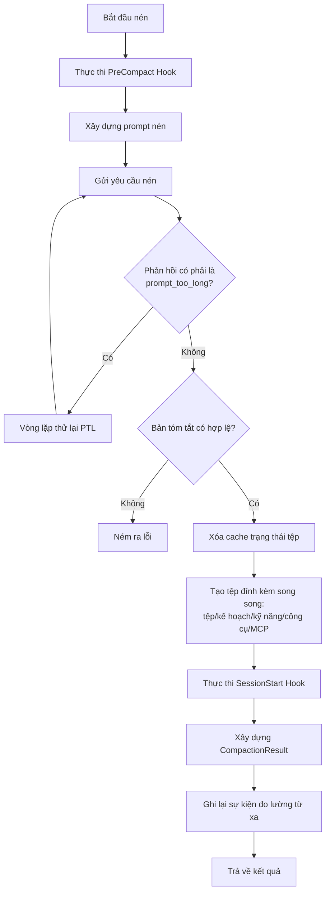
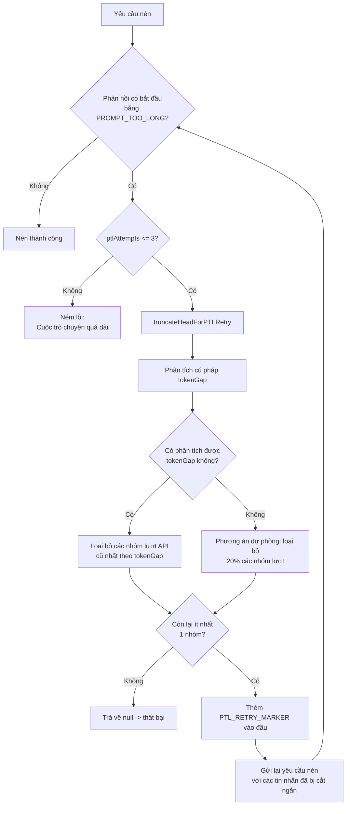
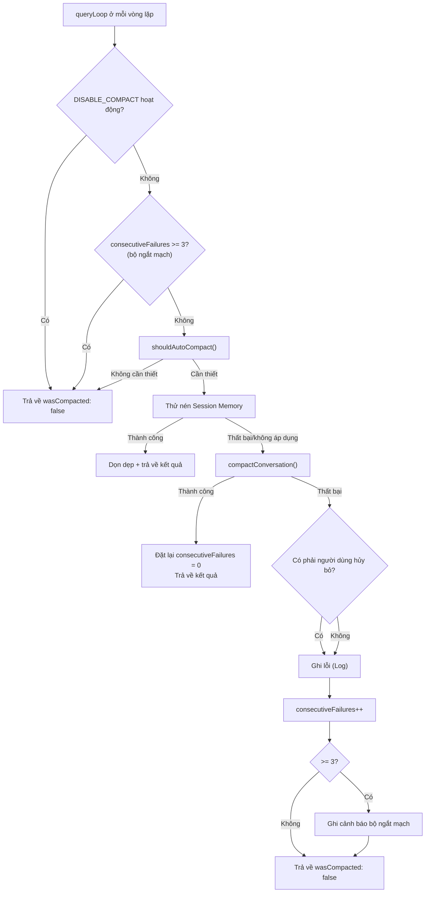

# Chương 9: Tự động nén (Auto-Compaction) — Khi nào và Làm thế nào Ngữ cảnh được nén

> *"Kiểu nén tốt nhất là kiểu nén mà người dùng không bao giờ nhận ra."*

Mọi người dùng phiên làm việc dài (long-session) của Claude Code đều đã từng trải qua khoảnh khắc này: bạn đang yêu cầu mô hình tái cấu trúc dần dần (incrementally refactor) một mô-đun phức tạp, đột nhiên bạn nhận thấy các phản hồi của nó trở nên "hay quên" — nó quên mất một chữ ký giao diện (interface signature) mà bạn đã yêu cầu giữ lại một cách rõ ràng năm phút trước, hoặc nó gợi ý lại một hướng tiếp cận mà bạn đã từ chối trước đó. Không phải mô hình trở nên ngốc nghếch hơn — mà là **cửa sổ ngữ cảnh (context window) đã đầy, và cơ chế tự động nén (auto-compaction) vừa được kích hoạt**.

Nén (Compaction) là cơ chế cốt lõi trong việc quản lý ngữ cảnh của Claude Code. Nó quyết định thời điểm và cách thức lịch sử trò chuyện của bạn được cô đọng thành một bản tóm tắt (summary). Hiểu được cơ chế này đồng nghĩa với việc bạn có thể dự đoán khi nào nó kích hoạt, kiểm soát những gì nó giữ lại và biết phải làm gì khi nó "gặp sự cố".

Chương này sẽ mổ xẻ toàn diện cơ chế tự động nén từ cấp độ mã nguồn qua ba giai đoạn: **xác định ngưỡng** (khi nào nó kích hoạt), **tạo bản tóm tắt** (nó nén như thế nào) và **phục hồi sau thất bại** (điều gì xảy ra khi nó thất bại).

---

## 9.1 Tính toán ngưỡng: Khi nào cơ chế tự động nén kích hoạt

### 9.1.1 Công thức cốt lõi

Điều kiện kích hoạt tự động nén có thể được biểu diễn dưới dạng một bất đẳng thức đơn giản:

```
current token count >= autoCompactThreshold
```

Việc tính toán `autoCompactThreshold` liên quan đến ba hằng số và hai lớp phép trừ. Hãy cùng suy luận từng bước từ mã nguồn.

**Lớp 1: Cửa sổ ngữ cảnh hiệu dụng**

```typescript
// services/compact/autoCompact.ts:30
const MAX_OUTPUT_TOKENS_FOR_SUMMARY = 20_000

// services/compact/autoCompact.ts:33-48
export function getEffectiveContextWindowSize(model: string): number {
  const reservedTokensForSummary = Math.min(
    getMaxOutputTokensForModel(model),
    MAX_OUTPUT_TOKENS_FOR_SUMMARY,
  )
  let contextWindow = getContextWindowForModel(model, getSdkBetas())

  const autoCompactWindow = process.env.CLAUDE_CODE_AUTO_COMPACT_WINDOW
  if (autoCompactWindow) {
    const parsed = parseInt(autoCompactWindow, 10)
    if (!isNaN(parsed) && parsed > 0) {
      contextWindow = Math.min(contextWindow, parsed)
    }
  }

  return contextWindow - reservedTokensForSummary
}
```

Logic ở đây là: trừ đi phần "dự phòng đầu ra của quá trình nén" (compaction output reservation) khỏi cửa sổ ngữ cảnh thô của mô hình. `MAX_OUTPUT_TOKENS_FOR_SUMMARY = 20_000` đến từ số liệu thống kê thực tế ở phân vị p99.99 về đầu ra của quá trình nén — 99.99% các bản tóm tắt nén nằm trong khoảng 17.387 token, và 20K là giới hạn trên có thêm biên độ an toàn.

Lưu ý thao tác `Math.min(getMaxOutputTokensForModel(model), MAX_OUTPUT_TOKENS_FOR_SUMMARY)`: nếu giới hạn đầu ra tối đa của chính mô hình nằm dưới mức 20K (ví dụ: một số cấu hình Bedrock nhất định), giới hạn của chính mô hình đó sẽ được sử dụng thay thế.

**Lớp 2: Bộ đệm tự động nén (Auto-Compaction Buffer)**

```typescript
// services/compact/autoCompact.ts:62
export const AUTOCOMPACT_BUFFER_TOKENS = 13_000

// services/compact/autoCompact.ts:72-91
export function getAutoCompactThreshold(model: string): number {
  const effectiveContextWindow = getEffectiveContextWindowSize(model)
  const autocompactThreshold =
    effectiveContextWindow - AUTOCOMPACT_BUFFER_TOKENS

  const envPercent = process.env.CLAUDE_AUTOCOMPACT_PCT_OVERRIDE
  if (envPercent) {
    const parsed = parseFloat(envPercent)
    if (!isNaN(parsed) && parsed > 0 && parsed <= 100) {
      const percentageThreshold = Math.floor(
        effectiveContextWindow * (parsed / 100),
      )
      return Math.min(percentageThreshold, autocompactThreshold)
    }
  }

  return autocompactThreshold
}
```

`AUTOCOMPACT_BUFFER_TOKENS = 13_000` là một bộ đệm an toàn bổ sung — nó đảm bảo rằng giữa thời điểm kích hoạt ngưỡng và khi thực thi nén thực tế, vẫn có đủ chỗ cho các token bổ sung mà lượt hiện tại có thể tạo ra (kết quả gọi công cụ (tool call), tin nhắn hệ thống (system message), v.v.).

### 9.1.2 Bảng tính toán ngưỡng

Lấy Claude Sonnet 4 (cửa sổ ngữ cảnh 200K) làm ví dụ:

| Bước tính toán | Công thức | Giá trị |
|---------|------|------|
| Cửa sổ ngữ cảnh thô | `contextWindow` | 200.000 |
| Dự phòng đầu ra của quá trình nén | `MAX_OUTPUT_TOKENS_FOR_SUMMARY` | 20.000 |
| Cửa sổ ngữ cảnh hiệu dụng | `contextWindow - 20.000` | 180.000 |
| Bộ đệm tự động nén | `AUTOCOMPACT_BUFFER_TOKENS` | 13.000 |
| **Ngưỡng tự động nén** | **`effectiveWindow - 13.000`** | **167.000** |
| Ngưỡng cảnh báo | `autoCompactThreshold - 20.000` | 147.000 |
| Ngưỡng lỗi | `autoCompactThreshold - 20.000` | 147.000 |
| Giới hạn cứng ngăn chặn | `effectiveWindow - 3.000` | 177.000 |

> **Phiên bản tương tác**: [Nhấp để xem ảnh động Bảng điều khiển Token](compaction-viz.html) — theo dõi cách cửa sổ 200K dần được lấp đầy, khi nào quá trình nén kích hoạt và cách các tin nhắn cũ được thay thế bằng một bản tóm tắt.

Được biểu diễn trực quan hơn:

```
|<------------ Cửa sổ ngữ cảnh 200K ------------>|
|<---- 167K khả dụng ---->|<- 13K bộ đệm ->|<- 20K dự phòng đầu ra nén ->|
                          ^                ^
                   Điểm kích hoạt    Ranh giới cửa sổ
                    tự động nén         hiệu dụng
```

Điều này có nghĩa là theo cấu hình mặc định, quá trình tự động nén sẽ kích hoạt khi cuộc trò chuyện của bạn đã tiêu thụ khoảng **83,5%** cửa sổ ngữ cảnh.

### 9.1.3 Ghi đè bằng biến môi trường

Claude Code cung cấp hai biến môi trường cho người dùng (hoặc môi trường thử nghiệm) để ghi đè các ngưỡng mặc định:

**`CLAUDE_CODE_AUTO_COMPACT_WINDOW`** — Ghi đè kích thước cửa sổ ngữ cảnh

```typescript
// services/compact/autoCompact.ts:40-46
const autoCompactWindow = process.env.CLAUDE_CODE_AUTO_COMPACT_WINDOW
if (autoCompactWindow) {
  const parsed = parseInt(autoCompactWindow, 10)
  if (!isNaN(parsed) && parsed > 0) {
    contextWindow = Math.min(contextWindow, parsed)
  }
}
```

Biến này lấy `Math.min(actual window, configured value)` (Math.min(cửa sổ thực tế, giá trị được cấu hình)) — bạn chỉ có thể **thu nhỏ** cửa sổ chứ không thể mở rộng nó. Trường hợp sử dụng điển hình: đặt giá trị cửa sổ nhỏ hơn trong môi trường CI để buộc kích hoạt nén thường xuyên hơn nhằm kiểm tra độ ổn định.

**`CLAUDE_AUTOCOMPACT_PCT_OVERRIDE`** — Ghi đè ngưỡng theo tỷ lệ phần trăm

```typescript
// services/compact/autoCompact.ts:79-87
const envPercent = process.env.CLAUDE_AUTOCOMPACT_PCT_OVERRIDE
if (envPercent) {
  const parsed = parseFloat(envPercent)
  if (!isNaN(parsed) && parsed > 0 && parsed <= 100) {
    const percentageThreshold = Math.floor(
      effectiveContextWindow * (parsed / 100),
    )
    return Math.min(percentageThreshold, autocompactThreshold)
  }
}
```

Ví dụ, việc đặt `CLAUDE_AUTOCOMPACT_PCT_OVERRIDE=50` sẽ làm cho ngưỡng bằng 50% cửa sổ hiệu dụng (90.000 token), nhưng một lần nữa việc sử dụng `Math.min` — tùy chọn ghi đè này không thể *cao hơn* ngưỡng mặc định, nó chỉ có thể làm cho quá trình nén kích hoạt sớm hơn.

### 9.1.4 Luồng xác định hoàn chỉnh

Hàm `shouldAutoCompact()` (`autoCompact.ts:160-239`) có một loạt các điều kiện bảo vệ (guard conditions) trước khi so sánh số lượng token:

```
shouldAutoCompact(messages, model, querySource)
  |
  +- querySource là 'session_memory' hoặc 'compact'? -> false (ngăn chặn đệ quy)
  +- querySource là 'marble_origami' (ctx-agent)? -> false (ngăn chặn ô nhiễm trạng thái chia sẻ)
  +- isAutoCompactEnabled() trả về false? -> false
  |   +- biến môi trường DISABLE_COMPACT có giá trị truthy? -> false
  |   +- biến môi trường DISABLE_AUTO_COMPACT có giá trị truthy? -> false
  |   +- Cấu hình người dùng autoCompactEnabled = false? -> false
  +- chế độ thử nghiệm REACTIVE_COMPACT đang hoạt động? -> false (để reactive compact tiếp quản)
  +- Context Collapse đang hoạt động? -> false (collapse tự quản lý ngữ cảnh của chính nó)
  |
  +- tokenCount >= autoCompactThreshold? -> true/false
```

Lưu ý các bình luận chi tiết trong mã nguồn về Context Collapse (`autoCompact.ts:199-222`): autocompact kích hoạt ở khoảng 93% cửa sổ hiệu dụng, trong khi Context Collapse bắt đầu commit ở mức 90% và chặn ở mức 95% — nếu cả hai chạy đồng thời, autocompact sẽ "cầm đèn chạy trước ô tô" và phá hủy ngữ cảnh chi tiết mà Collapse đang chuẩn bị lưu. Do đó, khi Collapse được bật, tính năng tự động nén chủ động (proactive autocompact) sẽ bị tắt, và chỉ giữ lại nén phản ứng (reactive compact) như một phương án dự phòng cho các lỗi 413.

---

## 9.2 Bộ ngắt mạch (Circuit Breaker): Bảo vệ khỏi thất bại liên tiếp

### 9.2.1 Bối cảnh vấn đề

Trong trường hợp lý tưởng, ngữ cảnh sẽ thu nhỏ đáng kể sau khi nén và lượt tiếp theo sẽ không kích hoạt lại nữa. Nhưng trong thực tế, có một nhóm các kịch bản "không thể phục hồi": ngữ cảnh chứa một lượng lớn các tin nhắn hệ thống không thể nén, các tệp đính kèm hoặc dữ liệu được mã hóa, và kết quả sau khi nén vẫn vượt quá ngưỡng, gây ra việc kích hoạt lại ngay lập tức ở lượt tiếp theo — tạo thành một vòng lặp vô hạn.

Các bình luận trong mã nguồn ghi lại một điểm dữ liệu quy mô thực tế (`autoCompact.ts:68-69`):

> BQ 10-03-2026: 1.279 phiên đã gặp hơn 50 lỗi liên tiếp (lên đến 3.272 lỗi) trong một phiên duy nhất, lãng phí khoảng 250K lượt gọi API/ngày trên toàn cầu.

**1.279 phiên đã gặp phải các lỗi liên tiếp, trong đó có một phiên đạt tới 3.272 lỗi**, lãng phí khoảng 250.000 cuộc gọi API mỗi ngày trên toàn cầu. Đây không phải là một trường hợp biên (edge case) — đó là một vấn đề mang tính hệ thống cần có sự bảo vệ cứng rắn.

### 9.2.2 Triển khai bộ ngắt mạch

```typescript
// services/compact/autoCompact.ts:70
const MAX_CONSECUTIVE_AUTOCOMPACT_FAILURES = 3
```

Logic bộ ngắt mạch cực kỳ ngắn gọn — toàn bộ cơ chế chỉ dưới 20 dòng mã:

```typescript
// services/compact/autoCompact.ts:257-265
if (
  tracking?.consecutiveFailures !== undefined &&
  tracking.consecutiveFailures >= MAX_CONSECUTIVE_AUTOCOMPACT_FAILURES
) {
  return { wasCompacted: false }
}
```

Việc theo dõi trạng thái được truyền giữa các vòng lặp `queryLoop` thông qua kiểu `AutoCompactTrackingState`:

```typescript
// services/compact/autoCompact.ts:51-60
export type AutoCompactTrackingState = {
  compacted: boolean
  turnCounter: number
  turnId: string
  consecutiveFailures?: number  // Bộ đếm của bộ ngắt mạch
}
```

- **Khi thành công** (`autoCompact.ts:332`): `consecutiveFailures` được đặt lại về 0
- **Khi thất bại** (`autoCompact.ts:341-349`): Bộ đếm tăng lên; sau khi đạt đến 3, một cảnh báo sẽ được ghi nhận (log) và không có nỗ lực nào khác được thực hiện
- **Sau khi bị ngắt (tripping)**: Tất cả các yêu cầu autocompact tiếp theo cho phiên đó sẽ ngay lập tức trả về `{ wasCompacted: false }`

Thiết kế này thể hiện một nguyên lý quan trọng: **thà để người dùng chạy `/compact` thủ công còn hơn lãng phí hạn mức API cho những lần thử lại chắc chắn sẽ thất bại**. Bộ ngắt mạch chỉ chặn việc nén tự động — người dùng vẫn có thể kích hoạt nó một cách thủ công thông qua lệnh `/compact`.

---

## 9.3 Mổ xẻ Prompt nén: Mẫu thiết kế 9 phần

Khi đạt ngưỡng kích hoạt, Claude Code cần gửi một prompt đặc biệt đến mô hình để yêu cầu nó cô đọng toàn bộ cuộc trò chuyện thành một bản tóm tắt có cấu trúc. Thiết kế của prompt này cực kỳ quan trọng đối với chất lượng nén — nó trực tiếp quyết định những gì được giữ lại và những gì bị mất đi trong bản tóm tắt.

### 9.3.1 Ba biến thể Prompt

Mã nguồn định nghĩa ba biến thể prompt nén, mỗi biến thể tương ứng với một kịch bản nén khác nhau:

| Biến thể | Tên hằng số | Trường hợp sử dụng | Phạm vi tóm tắt |
|------|--------|---------|---------|
| **BASE** | `BASE_COMPACT_PROMPT` | Nén toàn bộ (chạy lệnh `/compact` thủ công hoặc lần tự động nén đầu tiên) | Toàn bộ cuộc trò chuyện |
| **PARTIAL** | `PARTIAL_COMPACT_PROMPT` | Nén một phần (giữ lại ngữ cảnh ban đầu, chỉ nén các tin nhắn mới) | Các tin nhắn gần đây (sau ranh giới bảo tồn) |
| **PARTIAL_UP_TO** | `PARTIAL_COMPACT_UP_TO_PROMPT` | Nén tiền tố (đường dẫn tối ưu hóa lượt truy cập bộ nhớ đệm (cache hit)) | Phần cuộc trò chuyện trước bản tóm tắt |

Sự khác biệt cốt lõi giữa ba biến thể nằm ở **"phạm vi tầm nhìn" (scope of vision) của bản tóm tắt**:

- **BASE** nói với mô hình: "Nhiệm vụ của bạn là tạo một bản tóm tắt chi tiết về **cuộc trò chuyện cho đến nay**" — tóm tắt mọi thứ
- **PARTIAL** nói với mô hình: "Nhiệm vụ của bạn là tạo một bản tóm tắt chi tiết về **phần GẦN ĐÂY** của cuộc trò chuyện — các tin nhắn theo sau ngữ cảnh được giữ lại trước đó" — chỉ tóm tắt phần mới
- **PARTIAL_UP_TO** nói với mô hình: "Bản tóm tắt này sẽ được đặt ở đầu một phiên tiếp tục; **các tin nhắn mới hơn được xây dựng dựa trên ngữ cảnh này sẽ theo sau bản tóm tắt của bạn**" — tóm tắt phần tiền tố, cung cấp ngữ cảnh cho các tin nhắn tiếp theo

### 9.3.2 Phân tích cấu trúc mẫu (Template)

Lấy `BASE_COMPACT_PROMPT` làm ví dụ (`prompt.ts:61-143`), toàn bộ prompt bao gồm 9 phần có cấu trúc. Dưới đây là phân tích chi tiết từng phần về ý đồ thiết kế:

| Phần | Tiêu đề | Ý đồ thiết kế | Chỉ thị chính |
|------|------|---------|---------|
| 1 | Yêu cầu chính và Ý định | Ghi lại các **yêu cầu rõ ràng** của người dùng, ngăn chặn việc "lệch chủ đề" sau khi nén | "Ghi lại chi tiết tất cả các yêu cầu và ý định rõ ràng của người dùng" |
| 2 | Các khái niệm kỹ thuật chính | Giữ lại các **neo ngữ cảnh** cho các quyết định kỹ thuật | Liệt kê tất cả các công nghệ, framework và khái niệm đã thảo luận |
| 3 | Tệp và Đoạn mã | Giữ lại ngữ cảnh **tệp và mã** chính xác | "Bao gồm các đoạn mã đầy đủ nếu có thể" — lưu ý: các đoạn mã đầy đủ, không phải bản tóm tắt |
| 4 | Lỗi và bản sửa lỗi | Giữ lại **lịch sử gỡ lỗi** để tránh lặp lại sai lầm | "Chú ý đặc biệt đến phản hồi cụ thể của người dùng" |
| 5 | Giải quyết vấn đề | Giữ lại **quá trình giải quyết vấn đề**, không chỉ là kết quả | "Tài liệu hóa các vấn đề đã được giải quyết và bất kỳ nỗ lực khắc phục sự cố nào đang diễn ra" |
| 6 | Tất cả các tin nhắn của người dùng | Giữ lại **tất cả tin nhắn của người dùng** (không bao gồm kết quả của công cụ) | "Liệt kê TẤT CẢ các tin nhắn của người dùng không phải là kết quả của công cụ" — viết hoa chữ TẤT CẢ để nhấn mạnh |
| 7 | Các nhiệm vụ chưa hoàn thành | Giữ lại **danh sách nhiệm vụ chưa hoàn thành** | Chỉ liệt kê các nhiệm vụ được yêu cầu một cách rõ ràng |
| 8 | Công việc hiện tại | Giữ lại **trạng thái chính xác của công việc hiện tại** | "Mô tả chi tiết chính xác những gì đang được thực hiện ngay trước khi có yêu cầu tóm tắt này" |
| 9 | Bước tiếp theo tùy chọn | Giữ lại **các bước tiếp theo** (với các điều kiện bảo vệ) | "đảm bảo rằng bước này PHÙ HỢP TRỰC TIẾP với các yêu cầu rõ ràng gần đây nhất của người dùng" |

### 9.3.3 Khối nháp `<analysis>`: Cơ chế đảm bảo chất lượng ẩn

Trước bản tóm tắt 9 phần, mẫu yêu cầu mô hình tạo một khối `<analysis>` trước:

```typescript
// prompt.ts:31-44
const DETAILED_ANALYSIS_INSTRUCTION_BASE = `Before providing your final summary,
wrap your analysis in <analysis> tags to organize your thoughts and ensure
you've covered all necessary points. In your analysis process:

1. Chronologically analyze each message and section of the conversation.
   For each section thoroughly identify:
   - The user's explicit requests and intents
   - Your approach to addressing the user's requests
   - Key decisions, technical concepts and code patterns
   - Specific details like:
     - file names
     - full code snippets
     - function signatures
     - file edits
   - Errors that you ran into and how you fixed them
   - Pay special attention to specific user feedback...
2. Double-check for technical accuracy and completeness...`
```

Khối `<analysis>` này là một **bản nháp (drafting scratchpad)** — mô hình sẽ duyệt qua toàn bộ cuộc trò chuyện theo trình tự thời gian trước khi tạo bản tóm tắt cuối cùng. Cụm từ khóa là "**Chronologically analyze each message**" (Phân tích từng tin nhắn theo trình tự thời gian), buộc mô hình phải xử lý tuần tự thay vị nhảy cóc, giúp giảm thiểu các thiếu sót.

Nhưng khối nháp này **không xuất hiện trong ngữ cảnh cuối cùng**. Hàm `formatCompactSummary()` (`prompt.ts:311-335`) sẽ loại bỏ nó hoàn toàn:

```typescript
// prompt.ts:316-319
formattedSummary = formattedSummary.replace(
  /<analysis>[\s\S]*?<\/analysis>/,
  '',
)
```

Đây là một ứng dụng thông minh của chuỗi suy nghĩ (chain-of-thought): tận dụng khối `<analysis>` để cải thiện chất lượng tóm tắt, nhưng không để nó tiêu tốn không gian ngữ cảnh sau khi nén. Các token của khối nháp này chỉ được tạo ra trong đầu ra của cuộc gọi API nén và không trở thành gánh nặng ngữ cảnh cho các cuộc trò chuyện tiếp theo.

### 9.3.4 NO_TOOLS_PREAMBLE: Ngăn chặn cuộc gọi công cụ

Cả ba biến thể đều chèn một lời mở đầu (preamble) cấm gọi công cụ một cách mạnh mẽ ở ngay đầu:

```typescript
// prompt.ts:19-26
const NO_TOOLS_PREAMBLE = `CRITICAL: Respond with TEXT ONLY. Do NOT call any tools.

- Do NOT use Read, Bash, Grep, Glob, Edit, Write, or ANY other tool.
- You already have all the context you need in the conversation above.
- Tool calls will be REJECTED and will waste your only turn — you will fail the task.
- Your entire response must be plain text: an <analysis> block followed by a <summary> block.
`
```

Và có một phần kết (trailer) tương ứng ở cuối (`prompt.ts:269-272`):

```typescript
const NO_TOOLS_TRAILER =
  '\n\nREMINDER: Do NOT call any tools. Respond with plain text only — ' +
  'an <analysis> block followed by a <summary> block. ' +
  'Tool calls will be rejected and you will fail the task.'
```

Bình luận trong mã nguồn giải thích tại sao cần có lệnh cấm "quyết liệt" như vậy (`prompt.ts:12-18`): các yêu cầu nén được thực thi với `maxTurns: 1` (chỉ cho phép một lượt phản hồi). Nếu mô hình cố gắng gọi công cụ trong lượt này, cuộc gọi công cụ sẽ bị từ chối, dẫn đến **không có đầu ra văn bản** — toàn bộ quá trình nén sẽ thất bại, phải quay lại đường dẫn dự phòng truyền trực tuyến (streaming fallback path). Trên Sonnet 4.6, vấn đề này xảy ra với tỷ lệ 2,79%. Lệnh cấm kép ở cả đầu và cuối giúp giảm thiểu vấn đề này xuống mức không đáng kể.

### 9.3.5 Sự khác biệt của biến thể PARTIAL

Sự khác biệt chính giữa `PARTIAL_COMPACT_PROMPT` và `BASE_COMPACT_PROMPT` là:

1. **Giới hạn phạm vi**: "Tập trung bản tóm tắt của bạn vào những gì đã được thảo luận, học được và hoàn thành **chỉ trong các tin nhắn gần đây**"
2. **Chỉ thị phân tích**: `DETAILED_ANALYSIS_INSTRUCTION_PARTIAL` thay thế câu lệnh "Chronologically analyze each message and section of the **conversation**" (Phân tích từng tin nhắn và phần của cuộc trò chuyện theo trình tự thời gian) của phiên bản BASE bằng câu lệnh "Analyze the **recent messages** chronologically" (Phân tích các tin nhắn gần đây theo trình tự thời gian)

`PARTIAL_COMPACT_UP_TO_PROMPT` có sự khác biệt rõ rệt hơn — phần 8 của nó chuyển từ "Current Work" (Công việc hiện tại) thành "**Work Completed**" (Công việc đã hoàn thành), và phần 9 chuyển từ "Optional Next Step" (Bước tiếp theo tùy chọn) thành "**Context for Continuing Work**" (Ngữ cảnh để tiếp tục công việc). Điều này là do trong chế độ UP_TO, mô hình chỉ nhìn thấy nửa đầu của cuộc trò chuyện (nửa sau sẽ được thêm vào dưới dạng tin nhắn được giữ lại nguyên vẹn), do đó bản tóm tắt cần cung cấp ngữ cảnh cho một "sự tiếp tục" hơn là lập kế hoạch cho các bước tiếp theo.

---

## 9.4 Luồng thực thi nén

### 9.4.1 Luồng chính của `compactConversation()`

Hàm `compactConversation()` (`compact.ts:387-704`) là bộ điều phối cốt lõi của quá trình nén. Luồng chính của nó có thể được tóm tắt như sau:



Một số chi tiết đáng chú ý:

**Xóa trước và khôi phục sau (Pre-clear and post-restore)** (`compact.ts:518-561`): Sau khi quá trình nén hoàn tất, mã nguồn trước tiên sẽ xóa bộ nhớ đệm `readFileState` và `loadedNestedMemoryPaths`, sau đó khôi phục ngữ cảnh tệp quan trọng nhất thông qua `createPostCompactFileAttachments()`. Đây là chiến lược "quên trước nhớ sau" — thay vì cố gắng lưu giữ tất cả nội dung tệp trong bản tóm tắt (không đáng tin cậy), nó sẽ đọc lại các tệp quan trọng nhất sau khi nén (có tính xác định cao). Ngân sách khôi phục tệp: tối đa 5 tệp, tổng cộng 50.000 token, giới hạn tối đa cho mỗi tệp là 5.000 token.

**Tái chèn tệp đính kèm (Attachment re-injection)** (`compact.ts:566-585`): Quá trình nén đã tiêu tốn các tệp đính kèm thay đổi (delta attachments) trước đó (khai báo công cụ bị trì hoãn, danh sách agent, hướng dẫn MCP). Đoạn mã sẽ tạo lại các tệp đính kèm này sau khi nén bằng cách sử dụng "lịch sử tin nhắn trống" làm cơ sở, đảm bảo mô hình có ngữ cảnh đầy đủ về công cụ và hướng dẫn ở lượt đầu tiên sau khi nén.

### 9.4.2 Cấu trúc tin nhắn sau khi nén

Kết quả `CompactionResult` do quá trình nén tạo ra được lắp ráp vào mảng tin nhắn cuối cùng thông qua `buildPostCompactMessages()` (`compact.ts:330-338`):

```
[boundaryMarker, ...summaryMessages, ...messagesToKeep, ...attachments, ...hookResults]
```

Trong đó:
- `boundaryMarker`: Một `SystemCompactBoundaryMessage` đánh dấu nơi quá trình nén diễn ra
- `summaryMessages`: Bản tóm tắt dưới định dạng tin nhắn của người dùng, chứa phần mở đầu do `getCompactUserSummaryMessage()` tạo ra ("Phiên này đang được tiếp tục từ cuộc trò chuyện trước đó đã hết ngữ cảnh")
- `messagesToKeep`: Các tin nhắn gần đây được giữ lại trong quá trình nén một phần
- `attachments`: Tệp, kế hoạch, kỹ năng, công cụ và các tệp đính kèm khác
- `hookResults`: Kết quả từ các hook SessionStart

---

## 9.5 Thử lại PTL: Khi chính quá trình nén cũng quá dài

### 9.5.1 Kịch bản vấn đề

Đây là một tình thế tiến thoái lưỡng nan mang tính "đệ quy": cuộc trò chuyện của bạn quá dài và cần nén, nhưng **chính yêu cầu nén** lại vượt quá giới hạn đầu vào của API (lỗi prompt_too_long). Trong các phiên làm việc cực kỳ dài (ví dụ: tiêu tốn hơn 190K token), việc gửi toàn bộ lịch sử trò chuyện đến mô hình nén có thể đẩy số token đầu vào của yêu cầu nén lên đến hoặc vượt quá cửa sổ ngữ cảnh.

### 9.5.2 Cơ chế thử lại

Hàm `truncateHeadForPTLRetry()` (`compact.ts:243-291`) thực hiện chiến lược thử lại là "loại bỏ nội dung cũ nhất":



Logic cốt lõi gồm ba bước:

**Bước 1: Nhóm theo các lượt gọi API**

```typescript
// compact.ts:257
const groups = groupMessagesByApiRound(input)
```

`groupMessagesByApiRound()` (`grouping.ts:22-60`) nhóm các tin nhắn theo ranh giới lượt gọi API — một nhóm mới bắt đầu bất cứ khi nào xuất hiện ID tin nhắn assistant mới. Điều này đảm bảo thao tác loại bỏ không chia cắt một `tool_use` (sử dụng công cụ) khỏi `tool_result` (kết quả công cụ) tương ứng của nó.

**Bước 2: Tính toán số lượng loại bỏ**

```typescript
// compact.ts:260-272
const tokenGap = getPromptTooLongTokenGap(ptlResponse)
let dropCount: number
if (tokenGap !== undefined) {
  let acc = 0
  dropCount = 0
  for (const g of groups) {
    acc += roughTokenCountEstimationForMessages(g)
    dropCount++
    if (acc >= tokenGap) break
  }
} else {
  dropCount = Math.max(1, Math.floor(groups.length * 0.2))
}
```

Nếu phản hồi `prompt_too_long` của API bao gồm một khoảng trống token (token gap) cụ thể, mã nguồn sẽ tích lũy chính xác từ các nhóm cũ nhất cho đến khi bù đắp được khoảng trống này. Nếu không thể phân tích cú pháp khoảng trống (một số định dạng lỗi của Vertex/Bedrock có sự khác biệt), nó sẽ quay về **loại bỏ 20% số nhóm** — một giải pháp phỏng đoán (heuristic) thận trọng nhưng hiệu quả.

**Bước 3: Khắc phục trình tự tin nhắn**

```typescript
// compact.ts:278-291
const sliced = groups.slice(dropCount).flat()
if (sliced[0]?.type === 'assistant') {
  return [
    createUserMessage({ content: PTL_RETRY_MARKER, isMeta: true }),
    ...sliced,
  ]
}
return sliced
```

Sau khi loại bỏ các nhóm cũ nhất, mục nhập đầu tiên của các tin nhắn còn lại có thể là tin nhắn của trợ lý (assistant) (vì phần mở đầu của người dùng trong cuộc trò chuyện ban đầu nằm ở nhóm 0 đã bị loại bỏ). API yêu cầu tin nhắn đầu tiên phải thuộc vai trò người dùng (user role), vì vậy mã nguồn sẽ chèn một tin nhắn đánh dấu người dùng giả tạo `PTL_RETRY_MARKER`.

### 9.5.3 Ngăn ngừa tích lũy nhãn đánh dấu

Lưu ý một cách xử lý tinh tế ở đầu hàm `truncateHeadForPTLRetry()` (`compact.ts:250-255`):

```typescript
const input =
  messages[0]?.type === 'user' &&
  messages[0].isMeta &&
  messages[0].message.content === PTL_RETRY_MARKER
    ? messages.slice(1)
    : messages
```

Trước khi nhóm, nếu tin nhắn đầu tiên trong chuỗi là một `PTL_RETRY_MARKER` được chèn bởi lần thử lại trước đó, mã nguồn sẽ loại bỏ nó trước. Nếu không, nhãn đánh dấu này sẽ được xếp vào nhóm 0, và chiến lược dự phòng 20% có thể sẽ "chỉ loại bỏ nhãn này" — không tiến triển được gì, và lần thử lại thứ hai sẽ rơi vào vòng lặp vô hạn.

### 9.5.4 Giới hạn thử lại và truyền qua bộ nhớ đệm (Cache Passthrough)

```typescript
// compact.ts:227
const MAX_PTL_RETRIES = 3
```

Tối đa 3 lần thử lại. Mỗi lần thử lại không chỉ cắt ngắn tin nhắn mà còn cập nhật `cacheSafeParams` (`compact.ts:487-490`) để đảm bảo các đường dẫn tác nhân nhánh (forked-agent paths) cũng sử dụng các tin nhắn đã cắt ngắn:

```typescript
retryCacheSafeParams = {
  ...retryCacheSafeParams,
  forkContextMessages: truncated,
}
```

Nếu cả 3 lần thử lại vẫn thất bại, nó sẽ ném ra `ERROR_MESSAGE_PROMPT_TOO_LONG`, và người dùng sẽ thấy thông báo: "Conversation too long. Press esc twice to go up a few messages and try again." (Cuộc trò chuyện quá dài. Nhấn Esc hai lần để quay lại một vài tin nhắn trước và thử lại.)

---

## 9.6 Điều phối hoàn chỉnh của `autoCompactIfNeeded()`

Liên kết tất cả các cơ chế trên lại với nhau, `autoCompactIfNeeded()` (`autoCompact.ts:241-351`) là điểm vào (entry point) được gọi bởi `queryLoop` ở mỗi vòng lặp. Luồng hoàn chỉnh của nó như sau:



Lưu ý một mức độ ưu tiên thú vị: trước tiên, mã nguồn sẽ thử **nén Session Memory** (`autoCompact.ts:287-310`), và chỉ quay lại phương pháp `compactConversation()` truyền thống khi Session Memory không khả dụng hoặc không thể giải phóng đủ dung lượng. Nén Session Memory là một chiến lược chi tiết hơn (cắt tỉa tin nhắn thay vì tóm tắt toàn bộ), sẽ được thảo luận chi tiết ở các chương sau.

---

## 9.7 Người dùng có thể làm gì

Sau khi đã hiểu cơ chế bên trong của tự động nén, dưới đây là các hành động cụ thể bạn có thể thực hiện với tư cách là người dùng:

### 9.7.1 Quan sát thời điểm nén

Khi bạn nhìn thấy trạng thái chỉ báo ngắn "compacting..." trong một phiên làm việc dài, đó là lúc quá trình tự động nén đang diễn ra. Dựa trên công thức tính ngưỡng, với cửa sổ ngữ cảnh 200K, điều này xảy ra ở khoảng 167K token (sử dụng khoảng 83,5%).

### 9.7.2 Chủ động nén thủ công trước

Đừng đợi quá trình tự động nén kích hoạt. Trước khi hoàn thành một nhiệm vụ phụ và bắt đầu nhiệm vụ tiếp theo, hãy chủ động chạy lệnh `/compact`. Nén thủ công cho phép bạn truyền các hướng dẫn tùy chỉnh:

```
/compact Tập trung vào việc giữ lại lịch sử sửa đổi tệp và bản ghi sửa lỗi, giữ nguyên vẹn các đoạn mã
```

Các hướng dẫn tùy chỉnh này sẽ được thêm vào cuối prompt nén, ảnh hưởng trực tiếp đến nội dung tóm tắt.

### 9.7.3 Tận dụng các hướng dẫn nén trong CLAUDE.md

Bạn có thể thêm phần hướng dẫn nén vào tệp `CLAUDE.md` của dự án, phần này sẽ được tự động chèn vào trong mỗi lần nén:

```markdown
## Compact Instructions
Khi tóm tắt cuộc trò chuyện, hãy tập trung vào các thay đổi mã typescript
và ghi nhớ những lỗi bạn đã mắc phải cũng như cách bạn đã sửa chúng.
```

### 9.7.4 Điều chỉnh ngưỡng bằng các biến môi trường

Nếu bạn thấy quá trình tự động nén kích hoạt quá sớm (gây mất ngữ cảnh không cần thiết) hoặc quá muộn (gây ra lỗi prompt_too_long thường xuyên), bạn có thể tinh chỉnh bằng các biến môi trường:

```bash
# Kích hoạt nén ở mức 70% (thận trọng hơn, ít lỗi PTL hơn)
export CLAUDE_AUTOCOMPACT_PCT_OVERRIDE=70

# Hoặc giới hạn trực tiếp "cửa sổ hiển thị" ở mức 100K (cho mạng chậm/ngân sách hạn hẹp)
export CLAUDE_CODE_AUTO_COMPACT_WINDOW=100000
```

### 9.7.5 Tắt tính năng tự động nén (Không khuyến nghị)

```bash
# Chỉ tắt tự động nén, vẫn giữ /compact thủ công
export DISABLE_AUTO_COMPACT=1

# Tắt hoàn toàn tất cả các hoạt động nén (bao gồm cả thủ công)
export DISABLE_COMPACT=1
```

Việc tắt hoàn toàn có nghĩa là bạn phải tự quản lý ngữ cảnh một cách thủ công, nếu không bạn sẽ gặp phải các lỗi `prompt_too_long` không thể phục hồi khi cửa sổ ngữ cảnh bị cạn kiệt.

### 9.7.6 Hiểu về hiện tượng "quên" sau khi nén

Những gì mô hình "quên" sau khi nén phụ thuộc hoàn toàn vào những gì mẫu tóm tắt 9 phần bao trùm. Các loại thông tin dễ bị mất nhất bao gồm:

1. **Các thay đổi mã (diff) chính xác**: Mặc dù mẫu yêu cầu "các đoạn mã đầy đủ", nhưng danh sách thay đổi cực kỳ dài sẽ bị cắt bớt
2. **Lý do cụ thể cho các cách tiếp cận bị từ chối**: Mẫu tập trung vào "những gì đã làm", với mức độ bao phủ yếu hơn đối với "tại sao một số thứ không được thực hiện"
3. **Các tùy chọn nhỏ từ đầu cuộc trò chuyện**: Nếu bạn đã đề cập "đừng sử dụng lodash" một lần ở đầu, điều này có thể biến mất sau nhiều lần nén

Chiến lược giảm thiểu: Hãy viết các ràng buộc quan trọng vào `CLAUDE.md` (không bị ảnh hưởng bởi quá trình nén), hoặc liệt kê rõ ràng thông tin cần giữ lại trong phần hướng dẫn nén.

### 9.7.7 Phục hồi sau khi bộ ngắt mạch hoạt động

Nếu bạn nhận thấy mô hình không còn tự động nén nữa (bộ ngắt mạch được kích hoạt sau 3 lần thất bại liên tiếp), bạn có thể:

1. Chạy thủ công lệnh `/compact` để thử nén
2. Nếu vẫn thất bại, hãy bắt đầu một phiên mới — trong một số trường hợp, ngữ cảnh đã vượt quá khả năng phục hồi

---

## 9.8 Tóm tắt

Tự động nén là một trong những cơ chế quản lý ngữ cảnh quan trọng nhất của Claude Code, và thiết kế của nó phản ánh một số nguyên tắc kỹ thuật phần mềm quan trọng:

1. **Đệm nhiều lớp (Multi-layer buffering)**: 20K dự phòng đầu ra + 13K bộ đệm + 3K giới hạn cứng ngăn chặn — ba hàng rào phòng ngự đảm bảo hệ thống không bao giờ bị tràn trong bất kỳ điều kiện tranh đua (race condition) nào
2. **Giảm cấp lũy tiến (Progressive degradation)**: Nén Session Memory -> nén truyền thống -> thử lại PTL -> bộ ngắt mạch — mỗi lớp là phương án dự phòng cho lớp bên trên
3. **Khả năng quan sát (Observability)**: `tengu_compact`, `tengu_compact_failed`, `tengu_compact_ptl_retry` — ba sự kiện đo lường từ xa bao quát các đường dẫn thành công, thất bại và thử lại
4. **Khả năng kiểm soát của người dùng**: Ghi đè biến môi trường, hướng dẫn nén tùy chỉnh, lệnh `/compact` thủ công — cung cấp cho người dùng nâng cao quyền kiểm soát đầy đủ

Chương tiếp theo sẽ khám phá cơ chế giữ lại trạng thái tệp sau khi nén — quá trình nén có thể "quên" lịch sử trò chuyện, nhưng nó không nên "quên" những tệp nào đang được chỉnh sửa.

---

## Tiến hóa phiên bản: Các thay đổi trong v2.1.91

> Phân tích sau đây dựa trên so sánh tín hiệu bundle của v2.1.91, kết hợp với suy luận mã nguồn từ v2.1.88.

### Phát hiện sự lỗi thời của trạng thái tệp (File State Staleness Detection)

Tệp `sdk-tools.d.ts` của v2.1.91 bổ sung thêm trường `staleReadFileStateHint` mới:

```typescript
staleReadFileStateHint?: string;
// Model-facing note listing readFileState entries whose mtime bumped
// during this command (set when WRITE_COMMAND_MARKERS matches)
```

Điều này có nghĩa là trong quá trình thực thi công cụ, nếu lệnh Bash sửa đổi một tệp đã đọc trước đó, hệ thống sẽ đính kèm một gợi ý về sự lỗi thời (staleness hint) vào kết quả công cụ, thông báo cho mô hình rằng "tệp A mà bạn đã đọc trước đó đã bị sửa đổi". Điều này bổ sung cho cơ chế giữ lại trạng thái tệp sau khi nén được mô tả trong chương này — cơ chế nén giải quyết bài toán "trí nhớ dài hạn" (long-term memory), trong khi các gợi ý về sự lỗi thời giải quyết "tính tức thời trong một lượt" (single-turn immediacy).

---

## Tiến hóa phiên bản: Các thay đổi trong v2.1.100

> Phân tích dưới đây dựa trên việc so sánh tín hiệu bundle của v2.1.100, kết hợp với suy luận mã nguồn từ v2.1.88.

### Nén lạnh (Cold Compact): Chiến lược trì hoãn với kiểm soát bằng cờ tính năng (Feature Flag)

Sự kiện `tengu_cold_compact` trong v2.1.100 chỉ ra rằng nén lạnh đã chuyển từ giai đoạn thử nghiệm sang triển khai có kiểm soát. Logic kích hoạt được trích xuất từ bản đóng gói (bundle):

```javascript
// v2.1.100 bundle reverse engineering
let M = GPY() && S8("tengu_cold_compact", !1);
// GPY() — Feature Flag gate (server-side control switch)
// S8("tengu_cold_compact", false) — GrowthBook config, default off
try {
  let P = await QS6(q, K, _, !0, void 0, !0, J, M);
  // M passed as 8th parameter to the core compaction function
```

Sự phân biệt giữa nén lạnh (cold compact) và nén nóng (hot compact):

| Khía cạnh | Nén nóng (Hot Compact / auto compact) | Nén lạnh (Cold Compact) |
|-----------|--------------------------|-------------|
| Thời điểm kích hoạt | Khẩn cấp khi ngữ cảnh gần đầy | Trì hoãn đến thời điểm thích hợp hơn |
| Độ khẩn cấp | Cao — bắt buộc thực thi nếu không lượt gọi API sẽ thất bại | Thấp — có thể đợi xác nhận của người dùng hoặc điểm dừng tốt hơn |
| Thành phần tương ứng trong v2.1.88 | Tính toán ngưỡng trong `autoCompact.ts:72-91` | Không tồn tại |
| Cờ tính năng (Feature Flag) | Luôn được bật | Được kiểm soát bởi `tengu_cold_compact` |

### Bộ ngắt mạch nạp nhanh (Rapid Refill Circuit Breaker)

Sự kiện `tengu_auto_compact_rapid_refill_breaker` giải quyết một trường hợp biên trong hệ thống nén: nếu quá trình nén vừa hoàn tất và người dùng ngay lập tức tiếp tục nhập dữ liệu mật độ cao gây nạp nhanh ngữ cảnh, hệ thống có thể rơi vào vòng lặp tử thần "nén → nạp → lại nén". Bộ ngắt mạch theo dõi các lần nạp nhanh liên tiếp qua bộ đếm `consecutiveRapidRefills`: nếu ngữ cảnh được nạp đầy lại đến ngưỡng nén trong vòng 3 lượt kể từ lần nén trước đó, bộ đếm sẽ tăng lên; 3 lần nạp nhanh liên tiếp sẽ kích hoạt bộ ngắt mạch, tạm dừng quá trình nén và hiển thị cho người dùng thông báo "Autocompact is thrashing" (Tính năng tự động nén đang tháo lặp liên tục) — hy sinh một cơ hội nén để đổi lấy sự ổn định của hệ thống.

### Lệnh `/compact` do người dùng kích hoạt

v2.1.100 bổ sung thêm các sự kiện `tengu_autocompact_command` và `tengu_autocompact_dialog_opened`, cho thấy người dùng hiện có thể kích hoạt nén thông qua lệnh `/compact` và quyết định có tiếp tục hay không thông qua một hộp thoại xác nhận. Điều này thay đổi mô hình của v2.1.88 nơi quá trình nén hoàn toàn tự động hóa hệ thống — người dùng giành được quyền kiểm soát chủ động đối với việc quản lý ngữ cảnh.

### Ghi đè MAX_CONTEXT_TOKENS

Biến môi trường mới `CLAUDE_CODE_MAX_CONTEXT_TOKENS` cho phép người dùng ghi đè số lượng token ngữ cảnh tối đa. Từ kỹ thuật đảo ngược bản đóng gói (bundle):

```javascript
// v2.1.100 bundle reverse engineering
if (B6(process.env.DISABLE_COMPACT) && process.env.CLAUDE_CODE_MAX_CONTEXT_TOKENS) {
  let _ = parseInt(process.env.CLAUDE_CODE_MAX_CONTEXT_TOKENS, 10);
  if (!isNaN(_) && _ > 0) // Override context window size
```

Lưu ý rằng tùy chọn ghi đè này chỉ có hiệu lực khi `DISABLE_COMPACT` cũng được bật — ý đồ thiết kế là để người dùng nâng cao tự kiểm soát ngân sách ngữ cảnh một cách thủ công khi tính năng tự động nén bị tắt, chứ không phải để vượt qua các ngưỡng an toàn của quá trình nén.
