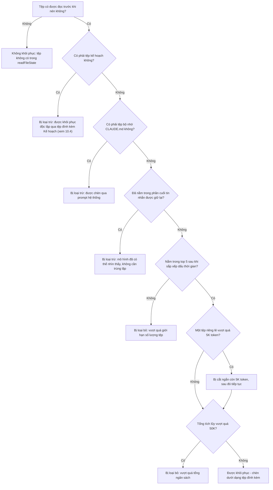
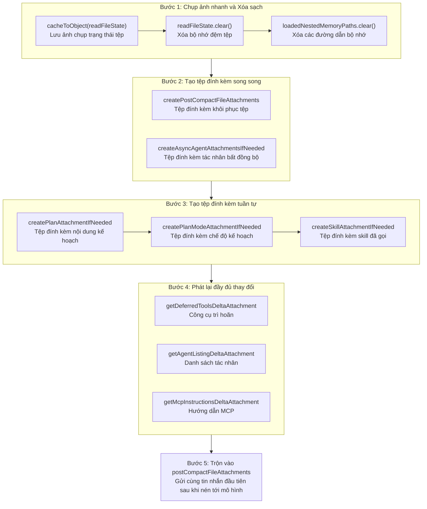

# Chương 10: Giữ lại trạng thái tệp sau khi nén

> *"Nén mà không khôi phục thì chỉ là mất dữ liệu với nhiều bước phức tạp hơn."*

Chương 9 đã đề cập đến **khi nào quá trình nén kích hoạt** và **các bản tóm tắt được tạo ra như thế nào**. Nhưng câu chuyện về nén không kết thúc sau khi tạo bản tóm tắt. Khi một cuộc trò chuyện dài được cô đọng thành một tin nhắn tóm tắt duy nhất, mô hình sẽ mất tất cả ngữ cảnh ban đầu — nó không còn biết mình vừa đọc những tệp nào, không nhớ kế hoạch mình đang thực thi và thậm chí không biết có những công cụ nào khả dụng. Nếu ở lượt đầu tiên sau khi nén, người dùng yêu cầu mô hình tiếp tục chỉnh sửa một tệp mà nó "vừa mới" đọc, và mô hình lại gọi công cụ `Read` để đọc lại tệp đó một cách vô tri, điều này không chỉ gây lãng phí token mà còn làm gián đoạn luồng công việc của người dùng.

Chủ đề của chương này là **khôi phục trạng thái sau khi nén (post-compaction state restoration)** — cách Claude Code, sau khi quá trình nén hoàn tất, chèn lại ngữ cảnh quan trọng mà mô hình "cần nhưng đã mất" vào luồng trò chuyện thông qua một loạt các tệp đính kèm (attachments) được thiết kế cẩn thận. Chúng ta sẽ lần lượt mổ xẻ năm khía cạnh khôi phục: trạng thái tệp, nội dung skill, trạng thái kế hoạch, các khai báo công cụ thay đổi (delta tool declarations) và nội dung được chủ động không khôi phục.

---

## 10.1 Chụp nhanh trước khi nén (Pre-Compaction Snapshot): Lưu lại trước khi xóa

Bước đầu tiên của việc khôi phục sau khi nén không phải là những gì bạn làm sau khi nén, mà là **lưu lại hiện trường trước khi nén**.

### 10.1.1 `cacheToObject` + `clear`: Mẫu chụp nhanh - xóa sạch (Snapshot-Clear Pattern)

```typescript
// services/compact/compact.ts:517-522
// Store the current file state before clearing
const preCompactReadFileState = cacheToObject(context.readFileState)

// Clear the cache
context.readFileState.clear()
context.loadedNestedMemoryPaths?.clear()
```

Ba dòng này thực hiện một mẫu **chụp nhanh - xóa sạch (snapshot-clear)** cổ điển:

1. **Chụp nhanh (Snapshot)**: `cacheToObject(context.readFileState)` tuần tự hóa `FileStateCache` trong bộ nhớ (một cấu trúc kiểu Map) thành một đối tượng `Record<string, { content: string; timestamp: number }>` thuần túy. Đối tượng này ghi lại mọi tệp mà mô hình đã đọc trước khi nén — tên tệp, nội dung và dấu thời gian (timestamp) của lần đọc cuối cùng.

2. **Xóa sạch (Clear)**: `context.readFileState.clear()` xóa sạch bộ nhớ đệm trạng thái tệp, và `context.loadedNestedMemoryPaths?.clear()` xóa sạch các đường dẫn bộ nhớ lồng nhau đã tải.

Tại sao phải xóa trước? Bởi vì quá trình nén thay thế lịch sử cuộc trò chuyện bằng một tin nhắn tóm tắt duy nhất. Dưới góc nhìn của mô hình, nó sắp sửa "quên" đi việc mình từng đọc bất kỳ tệp nào. Nếu bộ nhớ đệm không được xóa, hệ thống sẽ tin tưởng một cách sai lầm rằng mô hình vẫn "biết" nội dung của các tệp này, khiến logic loại bỏ trùng lặp tệp (file deduplication logic) sau đó hoạt động sai lệch. Sau khi xóa sạch, hệ thống bước vào trạng thái sạch sẽ, sau đó khôi phục có chọn lọc các tệp quan trọng nhất — thay vì khôi phục toàn bộ.

### 10.1.2 Tại sao không khôi phục tất cả?

Câu hỏi này chạm đến triết lý thiết kế cốt lõi của việc khôi phục sau khi nén. Trong một phiên làm việc dài, mô hình có thể đã đọc hàng chục hoặc thậm chí hàng trăm tệp. Nếu tất cả chúng được chèn ngược trở lại sau khi nén, nó sẽ tạo ra một vòng lặp vô lý: **không gian token vừa được giải phóng bởi quá trình nén sẽ lập tức bị lấp đầy bởi nội dung các tệp được khôi phục**.

Do đó, chiến lược khôi phục về cơ bản là **bài toán phân bổ ngân sách (budget allocation problem)** — khôi phục có chọn lọc trạng thái có giá trị nhất trong một ngân sách token giới hạn.

---

## 10.2 Khôi phục tệp: 5 tệp gần nhất, 5K mỗi tệp, tổng ngân sách 50K

### 10.2.1 Khung ngân sách năm hằng số

```typescript
// services/compact/compact.ts:122-130
export const POST_COMPACT_MAX_FILES_TO_RESTORE = 5
export const POST_COMPACT_TOKEN_BUDGET = 50_000
export const POST_COMPACT_MAX_TOKENS_PER_FILE = 5_000
export const POST_COMPACT_MAX_TOKENS_PER_SKILL = 5_000
export const POST_COMPACT_SKILLS_TOKEN_BUDGET = 25_000
```

Năm hằng số này tạo thành khung ngân sách hoàn chỉnh cho việc khôi phục sau khi nén. Bảng dưới đây thể hiện logic phân bổ của chúng:

**Bảng 10-1: Phân bổ ngân sách token sau khi nén**

| Danh mục ngân sách | Tên hằng số | Giới hạn | Ý nghĩa |
|---------|------|------|------|
| Giới hạn số lượng tệp | `POST_COMPACT_MAX_FILES_TO_RESTORE` | 5 | Khôi phục tối đa 5 tệp được đọc gần đây nhất |
| Giới hạn token mỗi tệp | `POST_COMPACT_MAX_TOKENS_PER_FILE` | 5.000 | Mỗi tệp chiếm tối đa 5K token |
| Tổng ngân sách khôi phục tệp | `POST_COMPACT_TOKEN_BUDGET` | 50.000 | Tổng số token trên tất cả các tệp được khôi phục không thể vượt quá 50K |
| Giới hạn token mỗi skill | `POST_COMPACT_MAX_TOKENS_PER_SKILL` | 5.000 | Mỗi tệp skill bị cắt ngắn còn 5K token |
| Tổng ngân sách khôi phục skill | `POST_COMPACT_SKILLS_TOKEN_BUDGET` | 25.000 | Tổng số token trên tất cả các skill không thể vượt quá 25K |

Lấy cửa sổ ngữ cảnh 200K làm ví dụ, bản tóm tắt sau khi nén chiếm khoảng 10K-20K token. Khôi phục tệp tiêu thụ tối đa 50K, khôi phục skill tối đa 25K, tổng cộng khoảng 75K-95K — vẫn để lại hơn 100K dung lượng trống cho cuộc trò chuyện tiếp theo. Đây là một sự cân bằng được cân nhắc kỹ lưỡng: **khôi phục đủ ngữ cảnh để mô hình tiếp tục làm việc một cách trơn tru, nhưng không quá nhiều đến mức việc nén trở nên vô nghĩa**.

### 10.2.2 Chi tiết logic khôi phục

```typescript
// services/compact/compact.ts:1415-1464
export async function createPostCompactFileAttachments(
  readFileState: Record<string, { content: string; timestamp: number }>,
  toolUseContext: ToolUseContext,
  maxFiles: number,
  preservedMessages: Message[] = [],
): Promise<AttachmentMessage[]> {
  const preservedReadPaths = collectReadToolFilePaths(preservedMessages)
  const recentFiles = Object.entries(readFileState)
    .map(([filename, state]) => ({ filename, ...state }))
    .filter(
      file =>
        !shouldExcludeFromPostCompactRestore(
          file.filename,
          toolUseContext.agentId,
        ) && !preservedReadPaths.has(expandPath(file.filename)),
    )
    .sort((a, b) => b.timestamp - a.timestamp)
    .slice(0, maxFiles)
  // ...
}
```

Logic của hàm này được chia thành bốn bước:

**Bước 1: Loại trừ các tệp không cần khôi phục**. `shouldExcludeFromPostCompactRestore` (dòng 1674-1705) loại trừ hai loại tệp:
- **Tệp kế hoạch (Plan files)** — chúng có kênh khôi phục độc lập của riêng mình (xem Phần 10.4)
- **Tệp bộ nhớ CLAUDE.md** — các tệp này được chèn thông qua prompt hệ thống (system prompt) và không cần phải nhân bản thông qua kênh khôi phục tệp

Ngoài ra, nếu một đường dẫn tệp đã xuất hiện ở phần cuối tin nhắn được giữ lại (`preservedReadPaths`), it doesn't need redundant restoration — mô hình đã có thể nhìn thấy nó trong ngữ cảnh.

**Bước 2: Sắp xếp theo dấu thời gian**. `.sort((a, b) => b.timestamp - a.timestamp)` sắp xếp các tệp theo thứ tự giảm dần của thời gian đọc cuối cùng. Các tệp được đọc gần đây nhất rất có thể là các tệp mô hình cần thao tác tiếp theo.

**Bước 3: Lấy N tệp đứng đầu**. `.slice(0, maxFiles)` lấy ra 5 tệp gần đây nhất. Lưu ý rằng việc cắt ngắn này diễn ra sau khi lọc loại trừ — nếu 3 trong số 20 tệp bị loại trừ, chỉ có 17 tệp tham gia sắp xếp và top 5 sẽ được lấy từ đó.

**Bước 4: Tạo tệp đính kèm song song**. Đối với các tệp được chọn, `generateFileAttachment` đọc lại nội dung tệp một cách song song, với mỗi tệp chịu giới hạn `POST_COMPACT_MAX_TOKENS_PER_FILE` (5K token). Một chi tiết quan trọng ở đây: quá trình khôi phục sẽ đọc **nội dung hiện tại trên đĩa**, chứ không phải nội dung được lưu trong bộ nhớ đệm từ ảnh chụp nhanh (snapshot). Nếu một tệp bị sửa đổi từ bên ngoài trong quá trình nén (ví dụ: người dùng chỉnh sửa thủ công trong trình soạn thảo của họ), nội dung được khôi phục sẽ là phiên bản đã sửa đổi.

**Bước 5: Kiểm soát ngân sách**. Sau khi tạo các tệp đính kèm tệp, có thêm một chốt chặn ngân sách nữa:

```typescript
// services/compact/compact.ts:1452-1463
let usedTokens = 0
return results.filter((result): result is AttachmentMessage => {
  if (result === null) {
    return false
  }
  const attachmentTokens = roughTokenCountEstimation(jsonStringify(result))
  if (usedTokens + attachmentTokens <= POST_COMPACT_TOKEN_BUDGET) {
    usedTokens += attachmentTokens
    return true
  }
  return false
})
```

Ngay cả khi chỉ có 5 tệp, nếu tất cả chúng đều lớn (mỗi tệp gần 5K token), tổng số có thể vượt quá ngân sách 50K. Bộ lọc này đóng vai trò là chốt chặn cuối cùng — tích lũy số lượng token của từng tệp theo thứ tự, loại bỏ các tệp còn lại khi tổng số vượt quá `POST_COMPACT_TOKEN_BUDGET` (50K).

### 10.2.3 Cây quyết định "Giữ lại và Loại bỏ"

Cây quyết định sau đây mô tả logic hoàn chỉnh để xác định xem mỗi tệp có được khôi phục sau khi nén hay không:



Cây quyết định này tiết lộ một thiết kế quan trọng: **khôi phục không phải là một thuật toán "N tệp gần nhất" đơn giản, mà là một đường ống lọc nhiều lớp (multi-layer filtering pipeline)**. Quy tắc loại trừ, giới hạn số lượng, cắt ngắn từng tệp và giới hạn tổng ngân sách — bốn lớp bảo vệ đảm bảo nội dung được khôi phục vừa có giá trị vừa không bị phình to quá mức.

---

## 10.3 Tái chèn Skill (Skill Re-injection): Khôi phục có chọn lọc các invokedSkills

### 10.3.1 Tại sao skill cần khôi phục độc lập

Skill là hệ thống mở rộng của Claude Code. Khi người dùng gọi một skill trong một phiên làm việc (chẳng hạn như `code-review` hoặc `commit`), các hướng dẫn của skill đó sẽ được chèn vào cuộc trò chuyện. Sau khi nén, các hướng dẫn này biến mất cùng với phần còn lại của ngữ cảnh. Nhưng các skill thường chứa các ràng buộc hành vi quan trọng — như "phải chạy kiểm thử trước khi commit" hoặc "tập trung vào các vấn đề bảo mật trong quá trình đánh giá mã (code review)". Nếu chúng không được khôi phục, mô hình có thể vi phạm các ràng buộc này sau khi nén.

### 10.3.2 Cơ chế khôi phục skill

```typescript
// services/compact/compact.ts:1494-1534
export function createSkillAttachmentIfNeeded(
  agentId?: string,
): AttachmentMessage | null {
  const invokedSkills = getInvokedSkillsForAgent(agentId)

  if (invokedSkills.size === 0) {
    return null
  }

  // Sorted most-recent-first so budget pressure drops the least-relevant skills.
  let usedTokens = 0
  const skills = Array.from(invokedSkills.values())
    .sort((a, b) => b.invokedAt - a.invokedAt)
    .map(skill => ({
      name: skill.skillName,
      path: skill.skillPath,
      content: truncateToTokens(
        skill.content,
        POST_COMPACT_MAX_TOKENS_PER_SKILL,
      ),
    }))
    .filter(skill => {
      const tokens = roughTokenCountEstimation(skill.content)
      if (usedTokens + tokens > POST_COMPACT_SKILLS_TOKEN_BUDGET) {
        return false
      }
      usedTokens += tokens
      return true
    })

  if (skills.length === 0) {
    return null
  }

  return createAttachmentMessage({
    type: 'invoked_skills',
    skills,
  })
}
```

Chiến lược khôi phục skill rất giống với khôi phục tệp, nhưng có hai điểm khác biệt chính:

**Khác biệt 1: Cắt ngắn thay vì loại bỏ**. Các bình luận nguồn (dòng 125-128) giải thích ý đồ thiết kế:

> Các skill có kích thước lớn (verify=18.7KB, claude-api=20.1KB). Trước đây được tái chèn không giới hạn ở mỗi lần nén -> tốn 5-10K token/lần nén. Việc cắt ngắn cho từng skill tốt hơn là loại bỏ hoàn toàn -- các chỉ dẫn ở đầu tệp skill thường là phần quan trọng nhất.

Các tệp skill có thể rất lớn (skill `verify` là 18.7KB, `claude-api` là 20.1KB), nhưng **các chỉ dẫn ở đầu tệp skill thường là phần quan trọng nhất**. Hàm `truncateToTokens` cắt ngắn mỗi skill còn 5K token, giữ lại các chỉ dẫn ở đầu và loại bỏ nội dung tham chiếu chi tiết ở cuối. Điều này tinh tế hơn chiến lược nhị phân "giữ tất cả hoặc bỏ tất cả".

**Khác biệt 2: Cô lập theo tác nhân (agent)**. `getInvokedSkillsForAgent(agentId)` chỉ trả về các skill thuộc về tác nhân hiện tại. Điều này ngăn các skill của phiên làm việc chính bị rò rỉ vào ngữ cảnh của tác nhân phụ (sub-agent), và ngược lại.

### 10.3.3 Tính toán ngân sách

Tổng ngân sách 25K có thể khôi phục được bao nhiêu skill? Với mức 5K token mỗi skill, về mặt lý thuyết tối đa là 5 skill. Các bình luận nguồn cũng xác nhận điều này: "Budget sized to hold ~5 skills at the per-skill cap." (Ngân sách được tính toán để chứa khoảng 5 skill ở mức giới hạn tối đa cho mỗi skill.)

Nhưng trong thực tế, nhiều skill có kích thước dưới 5K token sau khi cắt ngắn, vì vậy ngân sách 25K thường bao quát được tất cả các skill đã được gọi trong một phiên làm việc. Chỉ khi người dùng gọi nhiều skill lớn trong một phiên làm việc dài duy nhất thì ngân sách mới trở thành nút thắt cổ chai — trong trường hợp đó, các skill cũ nhất sẽ bị loại bỏ trước.

---

## 10.4 Nội dung chủ động không khôi phục: sentSkillNames

Không phải mọi trạng thái bị xóa đều cần khôi phục. Một trong những quyết định thiết kế thú vị nhất trong mã nguồn là:

```typescript
// services/compact/compact.ts:524-529
// Intentionally NOT resetting sentSkillNames: re-injecting the full
// skill_listing (~4K tokens) post-compact is pure cache_creation with
// marginal benefit. The model still has SkillTool in its schema and
// invoked_skills attachment (below) preserves used-skill content. Ants
// with EXPERIMENTAL_SKILL_SEARCH already skip re-injection via the
// early-return in getSkillListingAttachments.
```

`sentSkillNames` là một cấu trúc `Map<string, Set<string>>` ở cấp độ mô-đun, ghi lại danh sách tên skill nào đã được gửi đến mô hình. Nếu nó được đặt lại sau khi nén, hệ thống sẽ chèn lại toàn bộ tệp đính kèm danh sách skill trong yêu cầu tiếp theo — khoảng 4K token.

Nhưng mã nguồn **chủ động không đặt lại** biến này. Lý do là:
1. **Bất đối xứng về chi phí (Cost asymmetry)**: Danh sách skill 4K token sẽ hoàn toàn là các token tạo mới bộ nhớ đệm (`cache_creation` tokens) (nội dung mới cần được ghi vào bộ nhớ đệm), nhưng lợi ích mang lại lại rất ít — mô hình vẫn có thể biết về sự tồn tại của công cụ skill thông qua schema `SkillTool`.
2. **Các skill đã được gọi đã được khôi phục**: Tệp đính kèm `invoked_skills` ở phần trước đã khôi phục nội dung của các skill thực sự được sử dụng, vì vậy mô hình không cần phải xem lại toàn bộ danh sách tên skill một lần nữa.
3. **Tìm kiếm skill thử nghiệm (Experimental skill search)**: Các môi trường bật tính năng `EXPERIMENTAL_SKILL_SEARCH` vốn đã bỏ qua việc chèn danh sách skill.

Đây là một **quyết định kỹ thuật tiết kiệm token** kinh điển — ưu tiên lựa chọn "chi phí token" hơn là "tính hoàn chỉnh của việc khôi phục". 4K token có vẻ nhỏ, nhưng chúng tích lũy qua mỗi lần nén. Đối với các phiên làm việc dài nén thường xuyên, điều này mang lại khoản tiết kiệm đáng kể.

---

## 10.5 Giữ lại tệp đính kèm Kế hoạch (Plan) và Chế độ kế hoạch (PlanMode)

Chế độ kế hoạch (plan mode) của Claude Code cho phép mô hình tạo ra một kế hoạch chi tiết trước khi thực hiện bất kỳ thao tác nào. Sau khi nén, trạng thái kế hoạch phải được bảo tồn hoàn toàn; nếu không, mô hình sẽ "quên" kế hoạch mà nó đang thực hiện.

### 10.5.1 Tệp đính kèm Kế hoạch

```typescript
// services/compact/compact.ts:545-548
const planAttachment = createPlanAttachmentIfNeeded(context.agentId)
if (planAttachment) {
  postCompactFileAttachments.push(planAttachment)
}
```

`createPlanAttachmentIfNeeded` (dòng 1470-1486) kiểm tra xem tác nhân hiện tại có tệp kế hoạch đang hoạt động hay không. Nếu có, nội dung kế hoạch sẽ được chèn dưới dạng tệp đính kèm kiểu `plan_file_reference`. Lưu ý rằng các tệp kế hoạch được loại trừ một cách rõ ràng khỏi việc khôi phục tệp bởi `shouldExcludeFromPostCompactRestore`, chính vì chúng đã có kênh khôi phục độc lập này — tránh việc khôi phục cùng một tệp hai lần và gây lãng phí ngân sách.

### 10.5.2 Tệp đính kèm PlanMode

```typescript
// services/compact/compact.ts:552-555
const planModeAttachment = await createPlanModeAttachmentIfNeeded(context)
if (planModeAttachment) {
  postCompactFileAttachments.push(planModeAttachment)
}
```

Tệp đính kèm Plan khôi phục **nội dung kế hoạch**, trong khi tệp đính kèm PlanMode khôi phục **trạng thái chế độ**. Hàm `createPlanModeAttachmentIfNeeded` (dòng 1542-1560) kiểm tra xem người dùng hiện có đang ở chế độ kế hoạch hay không (`mode === 'plan'`). Nếu có, nó sẽ chèn một tệp đính kèm kiểu `plan_mode` chứa cờ `reminderType: 'full'` — đảm bảo mô hình tiếp tục hoạt động ở chế độ kế hoạch sau khi nén thay vị quay trở lại chế độ thực thi bình thường.

Hai tệp đính kèm này hoạt động phối hợp với nhau: tệp đính kèm Plan nói với mô hình "bạn đang thực thi kế hoạch này", và tệp đính kèm PlanMode nói với mô hình "bạn phải tiếp tục làm việc ở chế độ kế hoạch". Thiếu một trong hai sẽ dẫn đến sai lệch hành vi.

---

## 10.6 Các tệp đính kèm thay đổi (Delta Attachments): Khai báo lại công cụ và hướng dẫn

Quá trình nén không chỉ xóa trạng thái tệp — nó còn xóa tất cả các tệp đính kèm thay đổi trước đó. Các tệp đính kèm thay đổi (delta attachments) là "thông tin gia tăng" mà hệ thống thông báo dần cho mô hình trong quá trình trò chuyện — các công cụ trì hoãn mới được đăng ký, các tác nhân mới được phát hiện, các hướng dẫn MCP mới được tải. Sau khi nén, thông tin này sẽ biến mất cùng với các tin nhắn cũ.

### 10.6.1 Phát lại đầy đủ ba loại thay đổi (Delta Types)

```typescript
// services/compact/compact.ts:563-585
// Compaction ate prior delta attachments. Re-announce from the current
// state so the model has tool/instruction context on the first
// post-compact turn. Empty message history -> diff against nothing ->
// announces the full set.
for (const att of getDeferredToolsDeltaAttachment(
  context.options.tools,
  context.options.mainLoopModel,
  [],
  { callSite: 'compact_full' },
)) {
  postCompactFileAttachments.push(createAttachmentMessage(att))
}
for (const att of getAgentListingDeltaAttachment(context, [])) {
  postCompactFileAttachments.push(createAttachmentMessage(att))
}
for (const att of getMcpInstructionsDeltaAttachment(
  context.options.mcpClients,
  context.options.tools,
  context.options.mainLoopModel,
  [],
)) {
  postCompactFileAttachments.push(createAttachmentMessage(att))
}
```

Bình luận nguồn tiết lộ thiết kế thông minh của đoạn mã này: **truyền một mảng trống `[]` làm lịch sử tin nhắn**.

Trong các lượt trò chuyện bình thường, các hàm đính kèm thay đổi so sánh trạng thái hiện tại với những gì đã xuất hiện trong lịch sử tin nhắn để chỉ gửi đi phần "thay đổi" (delta). Nhưng sau khi nén, không còn lịch sử tin nhắn nào để so sánh — việc truyền mảng trống đồng nghĩa với việc gốc so sánh (diff baseline) trống rỗng, do đó các hàm này sẽ tạo ra các khai báo công cụ và hướng dẫn **đầy đủ**.

Ba loại tệp đính kèm thay đổi và mục đích của chúng:

| Loại thay đổi | Hàm thực thi | Nội dung khôi phục |
|-----------|------|---------|
| Các công cụ trì hoãn (Deferred tools) | `getDeferredToolsDeltaAttachment` | Danh sách các công cụ có schema đầy đủ chưa được tải, cho mô hình biết nó có thể tìm nạp chúng theo nhu cầu qua `ToolSearch` |
| Danh sách tác nhân (Agent listing) | `getAgentListingDeltaAttachment` | Danh sách các tác nhân phụ khả dụng, cho mô hình biết nó có thể ủy quyền nhiệm vụ |
| Hướng dẫn MCP (MCP instructions) | `getMcpInstructionsDeltaAttachment` | Các hướng dẫn và ràng buộc do máy chủ MCP cung cấp, đảm bảo mô hình tuân thủ các quy tắc sử dụng dịch vụ bên ngoài |

Nhãn `callSite: 'compact_full'` được sử dụng để phân tích đo lường từ xa, phân biệt giữa các khai báo gia tăng thông thường với việc phát lại đầy đủ sau khi nén.

### 10.6.2 Tệp đính kèm tác nhân bất đồng bộ (Async Agent Attachments)

```typescript
// services/compact/compact.ts:532-539
const [fileAttachments, asyncAgentAttachments] = await Promise.all([
  createPostCompactFileAttachments(
    preCompactReadFileState,
    context,
    POST_COMPACT_MAX_FILES_TO_RESTORE,
  ),
  createAsyncAgentAttachmentsIfNeeded(context),
])
```

`createAsyncAgentAttachmentsIfNeeded` (dòng 1568-1599) kiểm tra xem có tác nhân bất đồng bộ (async agents) nào đang chạy ngầm hoặc các tác nhân đã hoàn thành nhưng chưa được lấy kết quả hay không. Nếu có, nó sẽ tạo một tệp đính kèm kiểu `task_status` cho mỗi tác nhân, bao gồm mô tả, trạng thái và tóm tắt tiến độ của tác nhân đó. Điều này ngăn mô hình "quên" các tác vụ chạy ngầm sau khi nén và khởi chạy lại các tác vụ đó một cách dư thừa.

Lưu ý rằng việc khôi phục tệp và tạo tệp đính kèm tác nhân bất đồng bộ được thực hiện **song song** (`Promise.all`) — đây là một tối ưu hóa hiệu năng vì hai tác vụ này độc lập với nhau và không có lý do gì phải đợi tuần tự.

---

## 10.7 Điều phối khôi phục hoàn chỉnh

Bây giờ hãy cùng kết hợp tất cả các bước khôi phục lại với nhau và xem luồng điều phối hoàn chỉnh của việc khôi phục trạng thái sau khi nén (`compact.ts` dòng 517-585):



Đặc điểm chính của sự điều phối này là **theo lớp và có chọn lọc**. Không phải tất cả các trạng thái đều được khôi phục, và phương pháp khôi phục cũng khác nhau — các tệp được khôi phục bằng cách đọc lại từ đĩa, skill được khôi phục thông qua tái chèn cắt ngắn, kế hoạch được khôi phục thông qua tệp đính kèm riêng dụng và các khai báo công cụ được khôi phục thông qua phát lại thay đổi. Mỗi loại trạng thái đều có kênh khôi phục phù hợp nhất với nó.

---

## 10.8 Người dùng có thể làm gì

Hiểu được cơ chế khôi phục sau khi nén, bạn có thể áp dụng các chiến lược sau để tối ưu hóa trải nghiệm phiên làm việc dài của mình:

### 10.8.1 Tập trung việc đọc tệp

Chỉ có 5 tệp được đọc gần đây nhất được khôi phục sau khi nén. Nếu bạn yêu cầu mô hình đọc 20 tệp trong một cuộc trò chuyện, chỉ có 5 tệp cuối cùng được khôi phục tự động. Điều này có nghĩa là các "tệp tham chiếu" mà bạn yêu cầu mô hình đọc ở nửa đầu cuộc trò chuyện — các trường hợp kiểm thử (test cases), định nghĩa kiểu dữ liệu (type definitions), tệp cấu hình — có khả năng cao sẽ bị mất sau khi nén.

**Chiến lược**: Khi thực hiện các tác vụ phức tạp, hãy ưu tiên để mô hình đọc các tệp nó **cần chỉnh sửa tiếp theo**, thay vì "đọc tất cả các tệp liên quan trước". Những tệp được đọc cuối cùng có nhiều khả năng được bảo tồn nhất sau khi nén. Nếu một tệp quan trọng đối với tác vụ nhưng đã lâu không được đọc, hãy cân nhắc yêu cầu mô hình đọc lại tệp đó khi bạn cảm thấy quá trình nén sắp đến gần (ví dụ: khi cuộc trò chuyện đã kéo dài hơn 30 lượt), để làm mới dấu thời gian của nó.

### 10.8.2 Kỳ vọng cắt ngắn đối với tệp lớn

Mỗi lần khôi phục tệp được giới hạn ở mức 5K token (khoảng 2.000-2.500 dòng mã, tùy thuộc vào ngôn ngữ). Nếu bạn đang chỉnh sửa một tệp quá lớn, mô hình sẽ chỉ nhìn thấy phần đầu của tệp sau khi nén.

**Chiến lược**: Tại các thời điểm có thể xảy ra nén (khi bạn nhận thấy cuộc trò chuyện đã trở nên rất dài), hãy nhắc nhở mô hình một cách rõ ràng tập trung vào các vùng cụ thể của tệp lớn. Hoặc tốt hơn nữa, hãy viết các ràng buộc chính vào `CLAUDE.md` — tệp này không bao giờ bị ảnh hưởng bởi quá trình nén.

### 10.8.3 Thay đổi hành vi của skill sau khi nén

Sau khi các skill bị cắt ngắn còn 5K token, nội dung tham chiếu ở cuối tệp có thể bị mất. Nếu hành vi của một skill thay đổi sau khi nén, nguyên nhân có thể là do việc cắt ngắn này.

**Chiến lược**: Hãy đặt các chỉ dẫn quan trọng nhất ở **đầu** tệp skill, không phải ở cuối. Chiến lược cắt ngắn của Claude Code giữ lại phần đầu — có nghĩa là các tệp skill nên được cấu trúc theo dạng "chỉ dẫn quan trọng trước, tham chiếu bổ sung sau".

### 10.8.4 Sử dụng chế độ kế hoạch (Plan Mode) để vượt qua việc nén

Nếu bạn đang thực hiện một tác vụ gồm nhiều bước, việc sử dụng chế độ kế hoạch đảm bảo rằng kế hoạch đó được bảo tồn hoàn toàn sau khi nén. Tệp đính kèm kế hoạch không chịu ảnh hưởng của ngân sách tệp 50K — chúng có kênh khôi phục độc lập của riêng mình.

**Chiến lược**: Đối với các tác vụ phức tạp có thể vượt qua ranh giới nén, hãy yêu cầu mô hình tạo một kế hoạch trước (`/plan`), sau đó thực hiện từng bước. Ngay cả khi việc nén xảy ra giữa quá trình thực thi, mô hình vẫn có thể khôi phục ngữ cảnh kế hoạch và tiếp tục làm việc.

### 10.8.5 Đề phòng các biểu hiện "mất trí nhớ sau khi nén"

Nếu sau khi nén, mô hình đột nhiên:
- Đọc lại một tệp nó "vừa mới" đọc — tệp này có thể xếp thứ 6 trở xuống và không được khôi phục
- Quên mất một tác nhân chạy ngầm — kiểm tra xem tác nhân đó được đánh dấu là `retrieved` (đã lấy kết quả) hay `pending` (đang chờ)
- Không còn tuân theo các ràng buộc của công cụ MCP — việc phát lại thay đổi thường bao quát phần này, nhưng các trường hợp biên có thể có kẽ hở
- Đề xuất lại một cách tiếp cận đã bị từ chối trước đó — các bản tóm tắt có xu hướng lưu giữ "những gì đã làm" thay vì "những gì đã bị từ chối"

Đây đều là những sự đánh đổi kỹ thuật bình thường. Ngân sách là có hạn, và việc khôi phục 100% là không thể cũng như không cần thiết. Hiểu được thông tin nào "sống sót" qua quá trình nén và thông tin nào bị mất đi là một kỹ năng quan trọng để định hướng trong các phiên làm việc dài.

### 10.8.6 Hiệu ứng tích lũy của việc nén nhiều lần

Một phiên làm việc cực kỳ dài có thể trải qua nhiều lần nén. Mỗi lần nén:
- Xóa và xây dựng lại tất cả bộ đệm trạng thái tệp (tối đa 5 tệp)
- Cắt ngắn lại nội dung skill (mỗi lần từ nội dung gốc, không có hiện tượng "cắt ngắn của cắt ngắn")
- Tạo lại các tệp đính kèm thay đổi (phát lại đầy đủ)

But summaries are **irreversible**. Bản tóm tắt của lần nén thứ hai được tạo ra từ "bản tóm tắt đầu tiên + cuộc trò chuyện tiếp theo", với mật độ thông tin giảm dần sau mỗi lần chuyển tiếp. Sau ba hoặc bốn lần nén, các chi tiết từ đầu cuộc trò chuyện hầu như không thể được bảo tồn.

**Chiến lược**: Đối với các tác vụ dự kiến cực dài, hãy chủ động sử dụng lệnh `/compact` tại các cột mốc trung gian quan trọng với các hướng dẫn tùy chỉnh liệt kê rõ ràng thông tin quan trọng cần giữ lại. Đừng đợi hệ thống tự động nén — tại thời điểm đó bạn không thể kiểm soát tiêu điểm của bản tóm tắt.

---

## 10.9 Tóm tắt

Khôi phục trạng thái sau khi nén phản ánh sự cân bằng tinh tế mà Claude Code đạt được giữa "tính hoàn chỉnh của thông tin" và "sự tiết kiệm token":

1. **Mẫu chụp nhanh - xóa sạch (Snapshot-clear pattern)**: Lưu hiện trường trước khi xóa, đảm bảo việc khôi phục có cơ sở và trạng thái bộ nhớ đệm nhất quán
2. **Ngân sách phân lớp**: 50K cho khôi phục tệp, 25K cho khôi phục skill, một kênh kế hoạch độc lập — các loại trạng thái khác nhau có ngân sách và chiến lược khôi phục khác nhau
3. **Khôi phục có chọn lọc**: Sắp xếp dấu thời gian + quy tắc loại trừ + kiểm soát ngân sách — ba lớp lọc đảm bảo chỉ nội dung có giá trị nhất mới được khôi phục
4. **Chủ động không khôi phục**: Việc giữ lại `sentSkillNames` là một quyết định phi trực giác nhưng đúng đắn — chi phí chèn danh sách skill 4K token vượt quá lợi ích nó mang lại
5. **Phát lại đầy đủ thay đổi (Delta full replay)**: Truyền lịch sử tin nhắn trống để kích hoạt phát lại đầy đủ là một cách tái sử dụng thông minh các cơ chế gia tăng hiện có

Hiểu biết cốt lõi: Nén không phải là "lãng quên" — đó là "nhớ lại có chọn lọc". Hiểu được logic của việc lựa chọn này cho phép bạn dự đoán những gì mô hình sẽ nhớ và những gì nó sẽ quên sau khi nén, từ đó điều chỉnh luồng công việc của bạn cho phù hợp.

---

## Tiến hóa phiên bản: Các thay đổi trong v2.1.91

> Phân tích sau đây dựa trên so sánh tín hiệu bundle của v2.1.91, kết hợp với suy luận mã nguồn từ v2.1.88.

### staleReadFileStateHint và theo dõi trạng thái tệp

v2.1.91 bổ sung thêm trường `staleReadFileStateHint` mới trong siêu dữ liệu (metadata) kết quả công cụ. Khi việc thực thi công cụ (chẳng hạn như lệnh Bash) làm thay đổi mtime của một tệp đã đọc trước đó, hệ thống sẽ gửi gợi ý về sự lỗi thời (staleness hint) đến mô hình. Điều này mở rộng hệ thống theo dõi trạng thái tệp được mô tả trong chương này — từ "khôi phục ngữ cảnh tệp sau khi nén" sang "phát hiện các thay đổi tệp trong một lượt duy nhất".

Trong v2.1.88, bộ nhớ đệm `readFileState` (`cli/print.ts:1147-1177`) đã tồn tại trong mã nguồn; v2.1.91 hiển thị nó như một trường đầu ra mà mô hình có thể nhận biết được.

---

## Tiến hóa phiên bản: Các thay đổi trong v2.1.100

> Phân tích dưới đây dựa trên việc so sánh tín hiệu bundle của v2.1.100, kết hợp với suy luận mã nguồn từ v2.1.88.

### Loại bỏ trùng lặp kết quả công cụ (Tool Result Dedup)

v2.1.100 giới thiệu cơ chế loại bỏ trùng lặp kết quả công cụ (`tengu_tool_result_dedup`) — một tối ưu hóa quan trọng cho ngân sách ngữ cảnh. Khi mô hình thực hiện các cuộc gọi công cụ liên tiếp trả về cùng một nội dung (ví dụ: đọc cùng một tệp nhiều lần), hệ thống sẽ không còn chèn lặp lại kết quả đầy đủ nữa mà thay thế bằng một ID tham chiếu ngắn:

```javascript
// v2.1.100 bundle reverse engineering — replacement on dedup hit
let H = `<identical to result [r${j}] from your ${$.toolName} call earlier — refer to that output>`;
d("tengu_tool_result_dedup", {
  hit: true,
  toolName: OK(K),
  originalBytes: A,
  savedBytes: A - H.length  // Track bytes saved
});
return { ...q, content: H };

// On dedup miss — register new result
r += 1;
let j = `r${_.counter}`;   // Short ID: r1, r2, r3...
_.seen.set(w, { shortId: j, toolName: K });
```

**Cách hoạt động**: Hệ thống duy trì một Map `seen` được xác định bằng mã băm djb2 (djb2 hash) của nội dung kết quả công cụ, lưu trữ các ID ngắn và tên công cụ. Loại bỏ trùng lặp chỉ áp dụng cho các kết quả dạng chuỗi có kích thước từ 256 byte đến 50.000 byte — quá ngắn thì không đáng để loại bỏ trùng lặp, quá dài thì có thể đã bị cắt bớt. Lần xuất hiện đầu tiên được chèn bình thường với thẻ `[result-id: rN]` được thêm vào; các kết quả giống hệt tiếp theo sẽ được thay thế bằng tham chiếu `<identical to result [rN]...>.`

**Tác động đến ngân sách ngữ cảnh**: Loại bỏ trùng lặp trực tiếp làm giảm mức tiêu thụ token trong lịch sử cuộc trò chuyện. Một kết quả đọc tệp thông thường có thể tốn hàng nghìn token; thay thế nó bằng một tham chiếu chỉ tốn khoảng 20 token. Trường `savedBytes` cung cấp khả năng theo dõi chính xác lượng byte tiết kiệm được, bổ sung thêm một khía cạnh mới cho khả năng quan sát việc quản lý ngữ cảnh (xem Chương 29).

Điều này bổ sung cho cơ chế khôi phục tệp sau khi nén được mô tả trong chương này: việc khôi phục "5 tệp gần nhất" sau khi nén đảm bảo mô hình biết mình đang chỉnh sửa gì, trong khi việc loại bỏ trùng lặp đảm bảo rằng trước khi đạt đến ngưỡng nén, nội dung trùng lặp không tiêu tốn ngân sách ngữ cảnh một cách không cần thiết.

### Thay đổi trong sdk-tools.d.ts

v2.1.100 thực hiện hai điều chỉnh nhỏ đối với định nghĩa kiểu công cụ (tool type definitions):

1. **`originalFile: string` → `string | null`**: Trường `originalFile` của công cụ Edit được nới lỏng thành nullable, hỗ trợ việc tạo tệp mới (không có tệp gốc để tham chiếu)
2. **Trường thống kê `toolStats`**: Thêm thống kê sử dụng công cụ cấp phiên làm việc 7 chiều mới để phân tích chi phí và hiểu sâu về hành vi (các định nghĩa trường đầy đủ và phân tích mối tương quan hệ thống Dream trong Chương 24)
