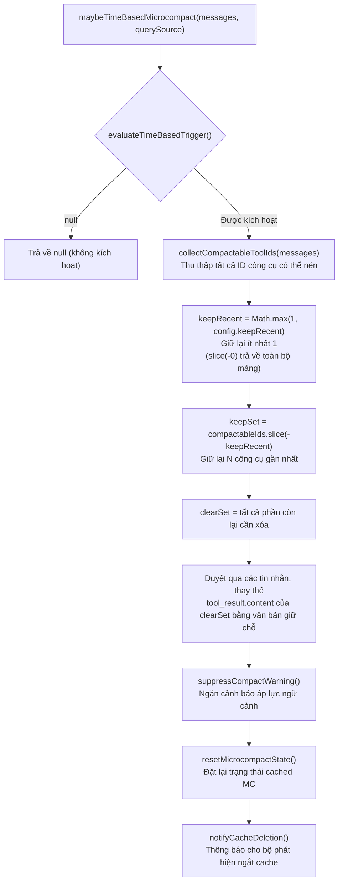
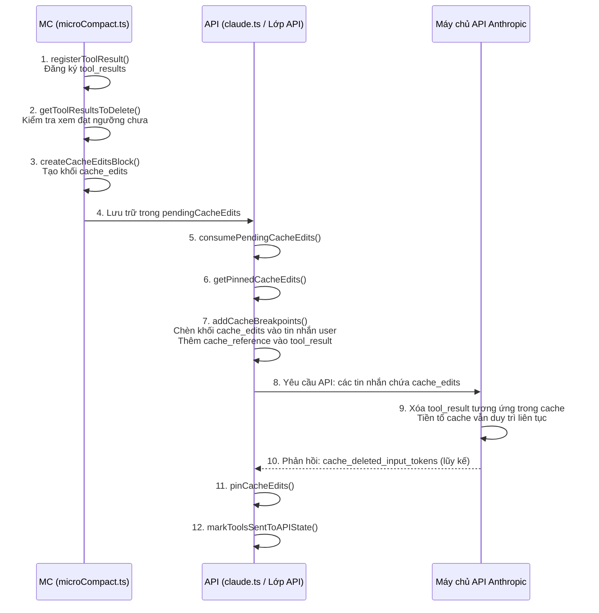

# Chương 11: Vi nén (Micro-Compaction) — Cắt tỉa ngữ cảnh chính xác

> *"Token rẻ nhất là token bạn không bao giờ gửi đi."*

Trong chương trước (Chương 9), chúng ta đã phân tích kỹ lưỡng về tự động nén (auto-compaction) — khi ngữ cảnh tiến gần đến giới hạn cửa sổ, Claude Code sẽ cô đọng toàn bộ cuộc trò chuyện thành một bản tóm tắt có cấu trúc. Đây là một "lựa chọn tối hậu": hiệu quả nhưng tốn kém. Nó làm mất đi các chi tiết ban đầu của cuộc trò chuyện và yêu cầu một cuộc gọi LLM đầy đủ để tạo ra bản tóm tắt.

Nhân vật chính của chương này là **vi nén (micro-compaction)** — một chiến lược cắt tỉa ngữ cảnh nhẹ. Nó không tạo ra các bản tóm tắt, không gọi LLM, mà thay vào đó trực tiếp **xóa sạch hoặc xóa bỏ** kết quả của các cuộc gọi công cụ cũ. 200 dòng đầu ra từ lệnh `grep` của ba phút trước, tệp cấu hình được đọc bằng lệnh `cat` cách đây nửa giờ, nhật ký lệnh Bash từ một giờ trước — thông tin này đã "lỗi thời" đối với nhiệm vụ suy luận hiện tại của mô hình. Triết lý cốt lõi của vi nén là: **thay vì để nội dung lỗi thời này chiếm không gian ngữ cảnh quý giá, hãy loại bỏ nó một cách chính xác vào đúng thời điểm**.

Claude Code triển khai ba cơ chế vi nén, khác nhau về cơ bản ở các điều kiện kích hoạt, cách tiếp cận thực thi và tác động đến bộ nhớ đệm (cache):

| Khía cạnh | Vi nén dựa trên thời gian | Vi nén lưu cache (cache_edits) | Quản lý ngữ cảnh API |
|---|---|---|---|
| **Kích hoạt** | Khoảng trống thời gian kể từ tin nhắn assistant cuối cùng vượt quá ngưỡng | Số lượng công cụ có thể nén vượt quá ngưỡng | Số lượng input_tokens phía API vượt quá ngưỡng |
| **Vị trí thực thi** | Phía máy khách (client-side) (sửa đổi nội dung tin nhắn) | Phía máy chủ (server-side) (chỉ thị cache_edits) | Phía máy chủ (chiến lược context_management) |
| **Tác động cache** | Phá vỡ tiền tố cache (hành vi dự kiến, vì cache đã hết hạn) | Giữ nguyên tiền tố cache | Được quản lý bởi lớp API |
| **Cách thức sửa đổi** | Thay thế tool_result.content bằng văn bản giữ chỗ | Gửi chỉ thị xóa cache_edits | Chiến lược khai báo, API tự động thực thi |
| **Điều kiện áp dụng** | Tiếp tục phiên làm việc sau thời gian dài không hoạt động | Cắt tỉa gia tăng trong các phiên làm việc đang hoạt động | Tất cả các phiên làm việc (người dùng ant, mô hình tư duy) |
| **Điểm vào nguồn** | `maybeTimeBasedMicrocompact()` | `cachedMicrocompactPath()` | `getAPIContextManagement()` |
| **Cổng tính năng (Feature gate)** | `tengu_slate_heron` (GrowthBook) | `CACHED_MICROCOMPACT` (build) | Bật/tắt bằng biến môi trường |

Mối quan hệ ưu tiên giữa ba cơ chế này cũng rất rõ ràng: kích hoạt dựa trên thời gian thực thi trước và ngắn mạch (short-circuit), vi nén lưu cache tiếp theo, và Quản lý ngữ cảnh API tồn tại như một lớp khai báo độc lập luôn hiện diện.

---

> **Phiên bản tương tác**: [Nhấp để xem ảnh động vi nén](microcompact-viz.html) — đánh giá từng tin nhắn: giữ lại các kết luận chính, cắt tỉa các chi tiết thừa, loại bỏ nội dung lỗi thời.

## 11.1 Vi nén dựa trên thời gian: Dọn dẹp hàng loạt sau khi hết hạn bộ nhớ đệm (Cache Expiry)

### 11.1.1 Ý tưởng thiết kế

Hãy tưởng tượng kịch bản này: lúc 10 giờ sáng bạn sử dụng Claude Code để hoàn thành một nhiệm vụ tái cấu trúc phức tạp, sau đó bạn đi ăn trưa. Bạn quay lại lúc 1 giờ chiều để tiếp tục làm việc — một khoảng nghỉ 3 tiếng.

Điều gì đã xảy ra trong 3 giờ đó? **Bộ nhớ đệm prompt phía máy chủ (server-side prompt cache) đã hết hạn.** Bộ nhớ đệm prompt của Anthropic có hai cấp độ thời gian sống (TTL tiers): 5 phút (tiêu chuẩn) và 1 giờ (mở rộng). Bất kể cấp độ nào, cả hai đều đã hết hạn sau 3 giờ. Điều này có nghĩa là cuộc gọi API tiếp theo của bạn sẽ ghi lại **toàn bộ lịch sử cuộc trò chuyện** vào bộ nhớ đệm — mỗi token riêng lẻ sẽ được tính phí lại dưới dạng tạo mới bộ nhớ đệm (cache creation).

Do đó, logic của vi nén dựa trên thời gian rất tự nhiên: **vì bộ nhớ đệm đã hết hạn và toàn bộ tiền tố dù sao cũng cần được ghi lại, bạn nên dọn sạch nội dung cũ không cần thiết trước, giúp việc ghi lại trở nên nhỏ hơn và rẻ hơn**.

### 11.1.2 Các thông số cấu hình

Cấu hình được cung cấp thông qua cờ tính năng GrowthBook `tengu_slate_heron`, thuộc kiểu dữ liệu `TimeBasedMCConfig`:

```typescript
// services/compact/timeBasedMCConfig.ts:18-28
export type TimeBasedMCConfig = {
  /** Master switch. When false, time-based microcompact is a no-op. */
  enabled: boolean
  /** Trigger when (now - last assistant timestamp) exceeds this many minutes. */
  gapThresholdMinutes: number
  /** Keep this many most-recent compactable tool results. */
  keepRecent: number
}

const TIME_BASED_MC_CONFIG_DEFAULTS: TimeBasedMCConfig = {
  enabled: false,
  gapThresholdMinutes: 60,
  keepRecent: 5,
}
```

Mỗi thông số trong ba thông số đều có lý do hợp lý của riêng nó:

- **`enabled`** mặc định là tắt — đây là tính năng được triển khai dần dần, được bật từng bước thông qua GrowthBook
- **`gapThresholdMinutes: 60`** căn chỉnh với thời gian sống (TTL) cache 1 giờ của máy chủ — đây là "lựa chọn an toàn". Bình luận nguồn (dòng 23) ghi rõ: "server's 1h cache TTL is guaranteed expired for all users, so we never force a miss that wouldn't have happened" (TTL cache 1 giờ của máy chủ đảm bảo đã hết hạn đối với tất cả người dùng, vì vậy chúng ta không bao giờ buộc phải bỏ lỡ cache (cache miss) nếu điều đó không tự xảy ra)
- **`keepRecent: 5`** giữ lại 5 kết quả công cụ gần đây nhất, cung cấp cho mô hình ngữ cảnh làm việc tối thiểu

### 11.1.3 Xác định kích hoạt

Hàm `evaluateTimeBasedTrigger()` (`microCompact.ts:422-444`) là một hàm xác định thuần túy không có tác dụng phụ (side effects):

```typescript
// microCompact.ts:422-444
export function evaluateTimeBasedTrigger(
  messages: Message[],
  querySource: QuerySource | undefined,
): { gapMinutes: number; config: TimeBasedMCConfig } | null {
  const config = getTimeBasedMCConfig()
  if (!config.enabled || !querySource || !isMainThreadSource(querySource)) {
    return null
  }
  const lastAssistant = messages.findLast(m => m.type === 'assistant')
  if (!lastAssistant) {
    return null
  }
  const gapMinutes =
    (Date.now() - new Date(lastAssistant.timestamp).getTime()) / 60_000
  if (!Number.isFinite(gapMinutes) || gapMinutes < config.gapThresholdMinutes) {
    return null
  }
  return { gapMinutes, config }
}
```

Lưu ý điều kiện bảo vệ ở dòng 428: `!querySource` sẽ ngay lập tức trả về null. Điều này khác với hành vi của vi nén lưu cache — `isMainThreadSource()` (dòng 249-251) coi `undefined` là luồng chính (để tương thích ngược với cached MC), nhưng kích hoạt dựa trên thời gian **yêu cầu rõ ràng** querySource phải hiện diện. Bình luận nguồn (dòng 429-431) giải thích: các lệnh `/context`, `/compact` và các cuộc gọi phân tích khác gọi hàm `microcompactMessages()` mà không có source, và chúng không nên kích hoạt việc dọn dẹp dựa trên thời gian.

### 11.1.4 Logic thực thi

Khi các điều kiện kích hoạt được thỏa mãn, `maybeTimeBasedMicrocompact()` sẽ thực thi các bước sau:



Chi tiết triển khai chính nằm trong `microCompact.ts:470-492` — việc sửa đổi tin nhắn sử dụng phong cách bất biến (immutable style):

```typescript
// microCompact.ts:470-492
let tokensSaved = 0
const result: Message[] = messages.map(message => {
  if (message.type !== 'user' || !Array.isArray(message.message.content)) {
    return message
  }
  let touched = false
  const newContent = message.message.content.map(block => {
    if (
      block.type === 'tool_result' &&
      clearSet.has(block.tool_use_id) &&
      block.content !== TIME_BASED_MC_CLEARED_MESSAGE
    ) {
      tokensSaved += calculateToolResultTokens(block)
      touched = true
      return { ...block, content: TIME_BASED_MC_CLEARED_MESSAGE }
    }
    return block
  })
  if (!touched) return message
  return {
    ...message,
    message: { ...message.message, content: newContent },
  }
})
```

Lưu ý chốt bảo vệ ở dòng 479: `block.content !== TIME_BASED_MC_CLEARED_MESSAGE` — điều này ngăn việc đếm trùng `tokensSaved` cho nội dung đã được dọn sạch. Đây là một đảm bảo về tính lũy đẳng (idempotency guarantee): nhiều lần thực thi sẽ không làm thay đổi số liệu thống kê tokensSaved.

### 11.1.5 Chuỗi tác dụng phụ

Sau khi quá trình thực thi kích hoạt dựa trên thời gian hoàn tất, ba tác dụng phụ quan trọng sẽ được tạo ra:

1. **`suppressCompactWarning()`** (dòng 511): Vi nén đã giải phóng không gian ngữ cảnh, ngăn chặn cảnh báo "ngữ cảnh sắp đầy" hiển thị cho người dùng
2. **`resetMicrocompactState()`** (dòng 517): Xóa trạng thái đăng ký công cụ của cached MC — vì chúng ta vừa sửa đổi nội dung tin nhắn và làm gián đoạn cache máy chủ, nên tất cả trạng thái cũ của cached MC (những công cụ nào đã được đăng ký, những công cụ nào đã bị xóa) đều bị mất hiệu lực
3. **`notifyCacheDeletion(querySource)`** (dòng 526): Thông báo cho mô-đun `promptCacheBreakDetection` rằng `cache_read_tokens` của phản hồi API tiếp theo sẽ giảm — đây là hành vi dự kiến, không phải là lỗi ngắt cache

Tác dụng phụ thứ ba đặc biệt tinh tế. Bình luận nguồn (dòng 520-522) giải thích lý do tại sao `notifyCacheDeletion` được sử dụng thay thế cho `notifyCompaction`: "notifyCacheDeletion (not notifyCompaction) because it's already imported here and achieves the same false-positive suppression — adding the second symbol to the import was flagged by the circular-deps check." (notifyCacheDeletion (không phải notifyCompaction) vì nó đã được import ở đây và đạt được hiệu quả triệt tiêu cảnh báo sai tương tự — việc thêm ký hiệu thứ hai vào import đã bị phát hiện bởi kiểm tra Circular Dependency). Đây là một lựa chọn thực tế dưới các ràng buộc về phụ thuộc vòng (circular dependency): cả hai hàm đều có cùng một tác dụng (cả hai đều ngăn chặn các cảnh báo sai), nhưng việc import thêm ký hiệu sẽ kích hoạt bộ phát hiện phụ thuộc vòng.

---

## 11.2 Vi nén lưu cache (Cached Micro-Compaction): Phẫu thuật chính xác không làm gián đoạn Cache

### 11.2.1 Thách thức cốt lõi

Vi nén dựa trên thời gian có một giới hạn cơ bản: nó **bắt buộc phải sửa đổi nội dung tin nhắn**, điều đó có nghĩa là **tiền tố cache bị thay đổi**, và cuộc gọi API tiếp theo sẽ phải chịu toàn bộ chi phí tạo mới bộ nhớ đệm (cache creation). Khi cache vốn đã hết hạn, điều này không thành vấn đề (dù sao nó cũng sẽ được ghi lại). Nhưng trong một phiên làm việc đang hoạt động, điều này là không thể chấp nhận — tiền tố cache bạn vừa tích lũy có thể đại diện cho hàng chục nghìn token chi phí tạo mới bộ nhớ đệm.

Vi nén lưu cache giải quyết vấn đề này thông qua tính năng `cache_edits` của API Anthropic: nó **không sửa đổi nội dung tin nhắn cục bộ**, mà thay vào đó gửi các chỉ thị "xóa kết quả công cụ được chỉ định khỏi bộ nhớ đệm phía máy chủ" tới API. Máy chủ sẽ loại bỏ nội dung này trực tiếp (in-place) ngay trong tiền tố cache, duy trì tính liên tục của tiền tố — giúp yêu cầu tiếp theo vẫn có thể truy cập được cache hiện có.

### 11.2.2 Cách hoạt động của cache_edits

Biểu đồ trình tự (sequence diagram) sau đây cho thấy vòng đời hoàn chỉnh của vi nén lưu cache:



Hãy cùng mổ xẻ luồng này từng bước.

### 11.2.3 Đăng ký công cụ và Xác định ngưỡng

Hàm `cachedMicrocompactPath()` (`microCompact.ts:305-399`) trước tiên sẽ quét tất cả các tin nhắn, đăng ký kết quả của các công cụ có thể nén:

```typescript
// microCompact.ts:313-329
const compactableToolIds = new Set(collectCompactableToolIds(messages))
// Second pass: register tool results grouped by user message
for (const message of messages) {
  if (message.type === 'user' && Array.isArray(message.message.content)) {
    const groupIds: string[] = []
    for (const block of message.message.content) {
      if (
        block.type === 'tool_result' &&
        compactableToolIds.has(block.tool_use_id) &&
        !state.registeredTools.has(block.tool_use_id)
      ) {
        mod.registerToolResult(state, block.tool_use_id)
        groupIds.push(block.tool_use_id)
      }
    }
    mod.registerToolMessage(state, groupIds)
  }
}
```

Việc đăng ký diễn ra theo hai bước: `collectCompactableToolIds()` trước tiên thu thập tất cả các ID `tool_use` từ các tin nhắn assistant thuộc về tập hợp công cụ có thể nén, sau đó tìm các mục nhập `tool_result` tương ứng trong tin nhắn user, đăng ký chúng theo nhóm tin nhắn. Việc gom nhóm là cần thiết vì độ chi tiết của việc xóa bằng cache_edits là trên từng tool_result riêng lẻ, nhưng việc xác định kích hoạt lại dựa trên tổng số lượng công cụ.

Sau khi đăng ký, `mod.getToolResultsToDelete(state)` được gọi để lấy danh sách các công cụ cần xóa. Logic của hàm này được kiểm soát bởi cấu hình GrowthBook `triggerThreshold` và `keepRecent` — khi tổng số công cụ đã đăng ký vượt quá `triggerThreshold`, nó sẽ giữ lại các công cụ gần đây nhất ở mức `keepRecent`, và đánh dấu phần còn lại để xóa.

### 11.2.4 Vòng đời khối cache_edits

Khi các công cụ cần được xóa, đoạn mã sẽ tạo một `CacheEditsBlock` và lưu trữ nó trong biến cấp mô-đun `pendingCacheEdits`:

```typescript
// microCompact.ts:334-339
const toolsToDelete = mod.getToolResultsToDelete(state)

if (toolsToDelete.length > 0) {
  const cacheEdits = mod.createCacheEditsBlock(state, toolsToDelete)
  if (cacheEdits) {
    pendingCacheEdits = cacheEdits
  }
```

Đối tượng tiêu thụ biến `pendingCacheEdits` này là tệp `claude.ts` của lớp API. Trước khi xây dựng các tham số yêu cầu API (dòng 1531), mã nguồn gọi hàm `consumePendingCacheEdits()` để lấy các chỉ thị chỉnh sửa đang chờ xử lý một lần:

```typescript
// claude.ts:1531-1532
const consumedCacheEdits = cachedMCEnabled ? consumePendingCacheEdits() : null
const consumedPinnedEdits = cachedMCEnabled ? getPinnedCacheEdits() : []
```

Thiết kế của `consumePendingCacheEdits()` mang ngữ nghĩa **tiêu thụ một lần (single-consumption)** (`microCompact.ts:88-94`): nó lập tức xóa sạch `pendingCacheEdits` sau khi được gọi. Bình luận nguồn (dòng 1528-1530) giải thích lý do tại sao việc tiêu thụ không thể diễn ra bên trong `paramsFromContext`: "paramsFromContext is called multiple times (logging, retries), so consuming inside it would cause the first call to steal edits from subsequent calls." (paramsFromContext được gọi nhiều lần (ghi log, thử lại), vì vậy việc tiêu thụ bên trong nó sẽ khiến lệnh gọi đầu tiên lấy mất các chỉnh sửa của các lệnh gọi tiếp theo).

### 11.2.5 Chèn cache_edits vào yêu cầu API

Hàm `addCacheBreakpoints()` (`claude.ts:3063-3162`) chịu trách nhiệm lồng các chỉ thị cache_edits vào mảng tin nhắn. Logic cốt lõi gồm ba bước:

**Bước 1: Chèn lại các chỉnh sửa đã ghim (pinned edits)** (dòng 3128-3139)

```typescript
// claude.ts:3128-3139
for (const pinned of pinnedEdits ?? []) {
  const msg = result[pinned.userMessageIndex]
  if (msg && msg.role === 'user') {
    if (!Array.isArray(msg.content)) {
      msg.content = [{ type: 'text', text: msg.content as string }]
    }
    const dedupedBlock = deduplicateEdits(pinned.block)
    if (dedupedBlock.edits.length > 0) {
      insertBlockAfterToolResults(msg.content, dedupedBlock)
    }
  }
}
```

Trong mỗi cuộc gọi API, các cache_edits đã gửi trước đó phải được gửi lại ở **cùng một vị trí** — máy chủ cần xem một lịch sử chỉnh sửa hoàn chỉnh, nhất quán để xây dựng lại chính xác tiền tố cache. Đây là mục đích của `pinnedEdits`.

**Bước 2: Chèn các chỉnh sửa mới** (dòng 3142-3162)

Khối cache_edits mới được chèn vào **tin nhắn user cuối cùng**, sau đó chỉ mục vị trí được ghim lại qua `pinCacheEdits(i, newCacheEdits)`, đảm bảo các cuộc gọi tiếp theo sẽ gửi lại ở cùng một vị trí.

**Bước 3: Loại bỏ trùng lặp**

Hàm trợ giúp `deduplicateEdits()` (dòng 3116-3125) sử dụng một Set `seenDeleteRefs` để đảm bảo cùng một `cache_reference` không xuất hiện trong nhiều khối. Điều này ngăn ngừa trường hợp biên: cùng một kết quả công cụ bị đánh dấu xóa ở các lượt khác nhau.

### 11.2.6 Cấu trúc dữ liệu cache_edits

Tại lớp API, định nghĩa kiểu khối cache_edits (`claude.ts:3052-3055`) khá ngắn gọn:

```typescript
type CachedMCEditsBlock = {
  type: 'cache_edits'
  edits: { type: 'delete'; cache_reference: string }[]
}
```

Mỗi chỉnh sửa là một thao tác `delete` trỏ đến một `cache_reference` — một định danh duy nhất mà máy chủ gán cho mỗi `tool_result`. Phía máy khách lấy các tham chiếu này từ các phản hồi API trước đó, sau đó tham chiếu chúng trong các yêu cầu tiếp theo để chỉ định nội dung cần xóa.

### 11.2.7 Theo dõi giá trị cơ sở (Baseline) và Thay đổi (Delta)

Hàm `cachedMicrocompactPath()` ghi lại giá trị `baselineCacheDeletedTokens` khi trả về kết quả (dòng 374-383):

```typescript
// microCompact.ts:374-383
const lastAsst = messages.findLast(m => m.type === 'assistant')
const baseline =
  lastAsst?.type === 'assistant'
    ? ((
      lastAsst.message.usage as unknown as Record<
        string,
        number | undefined
      >
    )?.cache_deleted_input_tokens ?? 0)
    : 0
```

Giá trị `cache_deleted_input_tokens` do API trả về là một **giá trị lũy kế** — nó bao gồm tổng số token đã xóa bởi tất cả các thao tác cache_edits trong phiên làm việc hiện tại. Để tính toán lượng thay đổi thực tế (delta) từ thao tác hiện tại, giá trị cơ sở trước thao tác phải được ghi lại, sau đó trừ đi khỏi giá trị lũy kế mới trong phản hồi API. Thiết kế này tránh việc ước lượng token không chính xác ở phía máy khách.

### 11.2.8 Loại trừ tương hỗ với kích hoạt dựa trên thời gian

Hàm lối vào `microcompactMessages()` (dòng 253-293) định nghĩa độ ưu tiên nghiêm ngặt:

```typescript
// microCompact.ts:267-270
const timeBasedResult = maybeTimeBasedMicrocompact(messages, querySource)
if (timeBasedResult) {
  return timeBasedResult
}
```

Kích hoạt dựa trên thời gian thực thi trước và ngắn mạch. Bình luận nguồn (dòng 261-266) giải thích lý do: "If the gap since the last assistant message exceeds the threshold, the server cache has expired and the full prefix will be rewritten regardless — so content-clear old tool results now ... Cached MC (cache-editing) is skipped when this fires: editing assumes a warm cache, and we just established it's cold." (Nếu khoảng trống kể từ tin nhắn assistant cuối cùng vượt quá ngưỡng, cache máy chủ đã hết hạn và toàn bộ tiền tố dù sao cũng sẽ được ghi lại — vì vậy hãy xóa nội dung các kết quả công cụ cũ ngay ... Cached MC (chỉnh sửa cache) sẽ bị bỏ qua khi điều này được kích hoạt: chỉnh sửa giả định một cache ấm, và chúng ta vừa xác định là nó lạnh).

Đây là một thiết kế loại trừ tương hỗ trang nhã:

- **Cache ấm (Warm cache)**: Sử dụng cache_edits để xóa nội dung mà không làm ngắt quãng cache
- **Cache lạnh (Cold cache)**: Sử dụng kích hoạt dựa trên thời gian để sửa đổi trực tiếp nội dung, vì bộ nhớ đệm dù sao cũng đã hết hạn

Hai cơ chế này không bao giờ thực thi đồng thời.

---

## 11.3 Quản lý ngữ cảnh API (API Context Management): Quản lý ngữ cảnh dạng khai báo

### 11.3.1 Từ mệnh lệnh đến khai báo

Hai cơ chế vi nén trước đó đều mang tính **mệnh lệnh (imperative)** — máy khách quyết định công cụ nào cần xóa, khi nào và như thế nào. Quản lý ngữ cảnh API mang tính **khai báo (declarative)**: máy khách chỉ cần mô tả "khi ngữ cảnh vượt quá X token, hãy dọn sạch nội dung kiểu Y, giữ lại Z tệp gần nhất," và máy chủ API sẽ tự động thực hiện.

Logic này nằm trong `apiMicrocompact.ts`. Hàm `getAPIContextManagement()` xây dựng một đối tượng `ContextManagementConfig` được gửi kèm theo yêu cầu API:

```typescript
// apiMicrocompact.ts:59-62
export type ContextManagementConfig = {
  edits: ContextEditStrategy[]
}
```

### 11.3.2 Hai loại chiến lược

Kiểu hợp (union type) `ContextEditStrategy` định nghĩa hai chiến lược chỉnh sửa có thể thực thi ở phía máy chủ:

**Chiến lược 1: `clear_tool_uses_20250919`**

```typescript
// apiMicrocompact.ts:36-53
| {
    type: 'clear_tool_uses_20250919'
    trigger?: {
      type: 'input_tokens'
      value: number        // Trigger when input tokens exceed this value
    }
    keep?: {
      type: 'tool_uses'
      value: number        // Keep the most recent N tool uses
    }
    clear_tool_inputs?: boolean | string[]  // Which tools' inputs to clear
    exclude_tools?: string[]                // Which tools to exclude
    clear_at_least?: {
      type: 'input_tokens'
      value: number        // Clear at least this many tokens
    }
  }
```

**Chiến lược 2: `clear_thinking_20251015`**

```typescript
// apiMicrocompact.ts:54-56
| {
    type: 'clear_thinking_20251015'
    keep: { type: 'thinking_turns'; value: number } | 'all'
  }
```

Chiến lược này xử lý cụ thể các khối tư duy (thinking blocks) — các mô hình tư duy mở rộng (như Claude Sonnet 4 có thinking) tạo ra lượng lớn quá trình tư duy, giá trị của chúng trong các lượt tiếp theo sẽ giảm đi nhanh chóng.

### 11.3.3 Logic cấu thành chiến lược

`getAPIContextManagement()` cấu thành nhiều chiến lược khác nhau dựa trên các điều kiện lúc thực thi:

```typescript
// apiMicrocompact.ts:64-88
export function getAPIContextManagement(options?: {
  hasThinking?: boolean
  isRedactThinkingActive?: boolean
  clearAllThinking?: boolean
}): ContextManagementConfig | undefined {
  const {
    hasThinking = false,
    isRedactThinkingActive = false,
    clearAllThinking = false,
  } = options ?? {}

  const strategies: ContextEditStrategy[] = []

  // Strategy 1: thinking management
  if (hasThinking && !isRedactThinkingActive) {
    strategies.push({
      type: 'clear_thinking_20251015',
      keep: clearAllThinking
        ? { type: 'thinking_turns', value: 1 }
        : 'all',
    })
  }
  // ...
}
```

Ba nhánh cho chiến lược tư duy (thinking strategy):

| Điều kiện | Hành vi | Lý do |
|---|---|---|
| `hasThinking && !isRedactThinkingActive && !clearAllThinking` | `keep: 'all'` | Giữ lại tất cả tư duy (trạng thái làm việc bình thường) |
| `hasThinking && !isRedactThinkingActive && clearAllThinking` | `keep: { type: 'thinking_turns', value: 1 }` | Chỉ giữ lại 1 lượt tư duy cuối cùng (không hoạt động > 1 giờ = cache đã hết hạn) |
| `isRedactThinkingActive` | Không thêm chiến lược | Các khối tư duy được ẩn (redacted) không có nội dung hiển thị cho mô hình, không cần quản lý |

Lưu ý rằng `clearAllThinking` đặt giá trị là 1 thay vì 0 — bình luận nguồn (dòng 81) giải thích: "the API schema requires value >= 1, and omitting the edit falls back to the model-policy default (often 'all'), which wouldn't clear." (schema API yêu cầu giá trị >= 1, và việc bỏ qua chỉnh sửa sẽ quay về mặc định chính sách mô hình (thường là 'all'), sẽ không thực hiện xóa).

### 11.3.4 Hai chế độ dọn sạch công cụ

Trong chiến lược `clear_tool_uses_20250919`, việc dọn sạch công cụ có hai chế độ bổ trợ cho nhau:

**Chế độ 1: Dọn sạch kết quả công cụ (`clear_tool_inputs`)**

```typescript
// apiMicrocompact.ts:104-124
if (useClearToolResults) {
  const strategy: ContextEditStrategy = {
    type: 'clear_tool_uses_20250919',
    trigger: { type: 'input_tokens', value: triggerThreshold },
    clear_at_least: {
      type: 'input_tokens',
      value: triggerThreshold - keepTarget,
    },
    clear_tool_inputs: TOOLS_CLEARABLE_RESULTS,
  }
  strategies.push(strategy)
}
```

`TOOLS_CLEARABLE_RESULTS` (dòng 19-26) chứa các công cụ có **đầu ra lớn nhưng có thể vứt bỏ**: Các lệnh Shell, Glob, Grep, FileRead, WebFetch, WebSearch. Kết quả của các công cụ này thường là đầu ra tìm kiếm hoặc nội dung tệp — mô hình đã xử lý chúng, và việc dọn sạch chúng không ảnh hưởng đến suy luận tiếp theo.

**Chế độ 2: Dọn sạch việc sử dụng công cụ (`exclude_tools`)**

```typescript
// apiMicrocompact.ts:128-149
if (useClearToolUses) {
  const strategy: ContextEditStrategy = {
    type: 'clear_tool_uses_20250919',
    trigger: { type: 'input_tokens', value: triggerThreshold },
    clear_at_least: {
      type: 'input_tokens',
      value: triggerThreshold - keepTarget,
    },
    exclude_tools: TOOLS_CLEARABLE_USES,
  }
  strategies.push(strategy)
}
```

`TOOLS_CLEARABLE_USES` (dòng 28-32) chứa FileEdit, FileWrite và NotebookEdit — các công cụ mà **đầu vào** của chúng (tức là các hướng dẫn chỉnh sửa mô hình gửi đi) thường lớn hơn đầu ra của chúng. Ngữ nghĩa của `exclude_tools` là "xóa tất cả các lần sử dụng công cụ ngoại trừ những công cụ này", cho phép phía API dọn dẹp mạnh mẽ hơn.

Các tham số mặc định cho cả hai chế độ là giống hệt nhau: `triggerThreshold = 180.000` (xấp xỉ bằng ngưỡng cảnh báo tự động nén), `keepTarget = 40.000` (giữ lại 40K token cuối cùng), `clear_at_least = triggerThreshold - keepTarget = 140.000` (giải phóng ít nhất 140K token). Các giá trị này có thể được ghi đè thông qua các biến môi trường `API_MAX_INPUT_TOKENS` và `API_TARGET_INPUT_TOKENS`.

---

## 11.4 Danh sách tập hợp công cụ có thể nén

Ba cơ chế vi nén định nghĩa các tập hợp công cụ có thể nén khác nhau. Việc hiểu những khác biệt này là rất quan trọng để dự đoán kết quả công cụ nào sẽ bị dọn sạch.

### 11.4.1 `COMPACTABLE_TOOLS` (Dùng chung cho cả Vi nén dựa trên thời gian và lưu cache)

```typescript
// microCompact.ts:41-50
const COMPACTABLE_TOOLS = new Set<string>([
  FILE_READ_TOOL_NAME,      // Read
  ...SHELL_TOOL_NAMES,       // Bash (multiple shell variants)
  GREP_TOOL_NAME,            // Grep
  GLOB_TOOL_NAME,            // Glob
  WEB_SEARCH_TOOL_NAME,      // WebSearch
  WEB_FETCH_TOOL_NAME,       // WebFetch
  FILE_EDIT_TOOL_NAME,       // Edit
  FILE_WRITE_TOOL_NAME,      // Write
])
```

### 11.4.2 `TOOLS_CLEARABLE_RESULTS` (clear_tool_inputs phía API)

```typescript
// apiMicrocompact.ts:19-26
const TOOLS_CLEARABLE_RESULTS = [
  ...SHELL_TOOL_NAMES,
  GLOB_TOOL_NAME,
  GREP_TOOL_NAME,
  FILE_READ_TOOL_NAME,
  WEB_FETCH_TOOL_NAME,
  WEB_SEARCH_TOOL_NAME,
]
```

### 11.4.3 `TOOLS_CLEARABLE_USES` (exclude_tools phía API)

```typescript
// apiMicrocompact.ts:28-32
const TOOLS_CLEARABLE_USES = [
  FILE_EDIT_TOOL_NAME,       // Edit
  FILE_WRITE_TOOL_NAME,      // Write
  NOTEBOOK_EDIT_TOOL_NAME,   // NotebookEdit
]
```

Sự khác biệt chính:

| Công cụ | COMPACTABLE_TOOLS | CLEARABLE_RESULTS | CLEARABLE_USES |
|---|:-:|:-:|:-:|
| Shell (Bash) | có | có | -- |
| Grep | có | có | -- |
| Glob | có | có | -- |
| FileRead (Read) | có | có | -- |
| WebSearch | có | có | -- |
| WebFetch | có | có | -- |
| FileEdit (Edit) | có | -- | có |
| FileWrite (Write) | có | -- | có |
| NotebookEdit | -- | -- | có |

NotebookEdit chỉ xuất hiện trong `TOOLS_CLEARABLE_USES` của API — vi nén phía client không xử lý nó. FileEdit và FileWrite dọn sạch **kết quả** (tool_result) ở phía client, nhưng ở chế độ API, chúng bị loại khỏi `clear_tool_inputs` và thay vào đó được xử lý trong `exclude_tools`. Thiết kế phân lớp này giúp client và server mỗi bên xử lý phần phù hợp nhất với mình.

---

## 11.5 Phối hợp với Bộ phát hiện ngắt Cache (Cache Break Detection)

### 11.5.1 Vấn đề: Vi nén kích hoạt cảnh báo sai

Mô-đun `promptCacheBreakDetection.ts` liên tục giám sát `cache_read_tokens` trong các phản hồi API. Khi giá trị này giảm hơn 5% so với yêu cầu trước đó và mức giảm tuyệt đối vượt quá 2.000 token, nó sẽ báo cáo một lỗi "ngắt cache" (cache break) — điều này thường có nghĩa là một số thay đổi (sửa đổi prompt hệ thống, thay đổi danh sách công cụ) đã làm mất hiệu lực của tiền tố cache.

Nhưng vi nén lại **chủ động** giảm nội dung lưu cache. Nếu không có sự phối hợp, mọi lần vi nén sẽ kích hoạt một cảnh báo sai. Claude Code giải quyết vấn đề này thông qua hai hàm thông báo:

### 11.5.2 `notifyCacheDeletion()`

```typescript
// promptCacheBreakDetection.ts:673-682
export function notifyCacheDeletion(
  querySource: QuerySource,
  agentId?: AgentId,
): void {
  const key = getTrackingKey(querySource, agentId)
  const state = key ? previousStateBySource.get(key) : undefined
  if (state) {
    state.cacheDeletionsPending = true
  }
}
```

**Khi được gọi**: Sau khi vi nén lưu cache gửi đi cache_edits (`microCompact.ts:366`), và sau khi kích hoạt dựa trên thời gian sửa đổi nội dung tin nhắn (`microCompact.ts:526`).

**Tác dụng**: Đánh dấu `cacheDeletionsPending = true`. Khi phản hồi API tiếp theo đến, hàm `checkResponseForCacheBreak()` (dòng 472-481) nhìn thấy cờ này và bỏ qua hoàn toàn việc phát hiện ngắt cache:

```typescript
// promptCacheBreakDetection.ts:472-481
if (state.cacheDeletionsPending) {
  state.cacheDeletionsPending = false
  logForDebugging(
    `[PROMPT CACHE] cache deletion applied, cache read: ${prevCacheRead}
     -> ${cacheReadTokens} (expected drop)`,
  )
  state.pendingChanges = null
  return
}
```

### 11.5.3 `notifyCompaction()`

```typescript
// promptCacheBreakDetection.ts:689-698
export function notifyCompaction(
  querySource: QuerySource,
  agentId?: AgentId,
): void {
  const key = getTrackingKey(querySource, agentId)
  const state = key ? previousStateBySource.get(key) : undefined
  if (state) {
    state.prevCacheReadTokens = null
  }
}
```

**Khi được gọi**: Sau khi nén toàn bộ (`compact.ts:699`) and tự động nén (`autoCompact.ts:303`) hoàn tất.

**Tác dụng**: Đặt lại `prevCacheReadTokens` thành null, nghĩa là không có "giá trị trước đó" để so sánh ở phản hồi API tiếp theo — bộ phát hiện coi đó là một "cuộc gọi đầu tiên" và không báo cáo ngắt cache.

**Sự khác biệt giữa hai hàm**:

| Hàm | Cách thức đặt lại | Kịch bản áp dụng |
|---|---|---|
| `notifyCacheDeletion` | Đánh dấu `cacheDeletionsPending = true`, bỏ qua lần phát hiện tiếp theo nhưng vẫn giữ nguyên giá trị cơ sở (baseline) | Vi nén (xóa một phần, giá trị cơ sở vẫn có giá trị tham chiếu) |
| `notifyCompaction` | Đặt `prevCacheReadTokens` thành null, đặt lại hoàn toàn giá trị cơ sở | Nén toàn bộ (cấu trúc tin nhắn thay đổi hoàn toàn, giá trị cơ sở cũ không còn ý nghĩa) |

---

## 11.6 Cô lập tác nhân phụ (Sub-Agent Isolation)

Một kịch bản quan trọng mà hệ thống vi nén phải xử lý là **tác nhân phụ (sub-agents)**. Luồng chính của Claude Code có thể tạo (fork) nhiều tác nhân phụ (session_memory, prompt_suggestion, v.v.), mỗi tác nhân có một lịch sử trò chuyện độc lập.

`cachedMicrocompactPath` chỉ thực thi trên luồng chính (`microCompact.ts:275-285`):

```typescript
// microCompact.ts:275-285
if (feature('CACHED_MICROCOMPACT')) {
  const mod = await getCachedMCModule()
  const model = toolUseContext?.options.mainLoopModel ?? getMainLoopModel()
  if (
    mod.isCachedMicrocompactEnabled() &&
    mod.isModelSupportedForCacheEditing(model) &&
    isMainThreadSource(querySource)
  ) {
    return await cachedMicrocompactPath(messages, querySource)
  }
}
```

Bình luận nguồn (dòng 272-276) giải thích lý do: "Only run cached MC for the main thread to prevent forked agents from registering their tool_results in the global cachedMCState, which would cause the main thread to try deleting tools that don't exist in its own conversation." (Chỉ chạy cached MC cho luồng chính để ngăn các tác nhân nhánh đăng ký tool_results của chúng vào cachedMCState toàn cục, việc này sẽ khiến luồng chính cố gắng xóa các công cụ không tồn tại trong cuộc trò chuyện của chính nó).

`cachedMCState` là một biến toàn cục cấp mô-đun. Nếu các tác nhân phụ tự đăng ký ID công cụ của riêng chúng, luồng chính sẽ cố gắng xóa các ID đó trong lần thực thi tiếp theo — nhưng chúng không tồn tại trong các tin nhắn của luồng chính, dẫn đến các chỉ thị cache_edits không hợp lệ. Chốt bảo vệ `isMainThreadSource(querySource)` loại bỏ hoàn toàn các tác nhân phụ khỏi vi nén lưu cache.

Triển khai của `isMainThreadSource()` (dòng 249-251) sử dụng khớp tiền tố thay vì khớp chính xác:

```typescript
// microCompact.ts:249-251
function isMainThreadSource(querySource: QuerySource | undefined): boolean {
  return !querySource || querySource.startsWith('repl_main_thread')
}
```

Điều này là do `promptCategory.ts` đặt querySource thành `'repl_main_thread:outputStyle:<style>'` — nếu sử dụng kiểm tra nghiêm ngặt `=== 'repl_main_thread'`, người dùng có kiểu đầu ra phi mặc định sẽ bị loại trừ khỏi vi nén lưu cache một cách âm thầm. Bình luận nguồn (dòng 246-248) đánh dấu kiểm tra khớp chính xác cũ là một "lỗi tiềm ẩn (latent bug)".

---

## 11.7 Người dùng có thể làm gì

Sau khi hiểu rõ ba cơ chế vi nén, bạn có thể áp dụng các chiến lược sau để tối ưu hóa trải nghiệm sử dụng hàng ngày của mình:

### 11.7.1 Hiển thị "Kết quả công cụ biến mất"

Khi bạn nhận thấy mô hình "quên" kết quả lệnh `grep` hoặc `cat` trước đó ở phần sau của cuộc trò chuyện, đây có khả năng không phải là hiện tượng ảo tưởng của mô hình (hallucination) mà là do vi nén đang chủ động dọn sạch kết quả các công cụ cũ. Các kết quả công cụ đã xóa được thay thế bằng văn bản giữ chỗ `[Old tool result content cleared]`. Nếu bạn cần mô hình tham chiếu lại một kết quả tìm kiếm, chỉ cần yêu cầu nó thực hiện lại tìm kiếm đó — việc này đáng tin cậy hơn là cố gắng bắt mô hình "nhớ lại" nội dung đã bị dọn sạch.

### 11.7.2 Quản lý kỳ vọng sau các khoảng nghỉ dài

Nếu bạn rời đi hơn 1 giờ và quay lại tiếp tục cuộc trò chuyện, vi nén dựa trên thời gian có thể đã dọn sạch hầu hết các kết quả công cụ cũ (chỉ giữ lại 5 kết quả gần nhất). Đây là thiết kế có ý đồ — vì cache máy chủ đã hết hạn, việc xóa sạch nội dung cũ có thể giảm đáng kể chi phí tạo mới cache của cuộc gọi API tiếp theo. Việc quay lại và để mô hình đọc lại các tệp chính là hành vi bình thường và hiệu quả.

### 11.7.3 Sử dụng CLAUDE.md để giữ lại ngữ cảnh quan trọng

Vi nén chỉ xóa sạch kết quả cuộc gọi công cụ — nó không ảnh hưởng đến nội dung tệp `CLAUDE.md` được chèn thông qua prompt hệ thống. Nếu thông tin nhất định (như quy ước dự án, quyết định kiến trúc, các đường dẫn tệp chính) cần duy trì hiệu lực trong suốt phiên làm việc, viết chúng vào `CLAUDE.md` là cách tiếp cận đáng tin cậy nhất — chúng không bị ảnh hưởng bởi bất kỳ cơ chế nén hoặc vi nén nào.

### 11.7.4 Ý thức chi phí đối với các cuộc gọi công cụ song song

Khi mô hình đồng thời khởi tạo nhiều thao tác tìm kiếm hoặc đọc, kích thước tổng hợp của các kết quả này bị giới hạn bởi ngân sách 200K ký tự cho mỗi tin nhắn. Nếu bạn quan sát thấy kết quả của một số công cụ song song được lưu trữ vào đĩa (mô hình sẽ chỉ báo "Output too large, saved to file"), đây chính là cơ chế ngân sách ngăn chặn việc phình to ngữ cảnh. Bạn có thể giảm kích thước đầu ra của từng công cụ thông qua các tiêu chí tìm kiếm chính xác hơn.

### 11.7.5 Ý thức về các công cụ không thể nén

Không phải tất cả kết quả công cụ đều được dọn sạch bởi vi nén. **Kết quả** của các công cụ ghi dữ liệu như `FileEdit`, `FileWrite` có thể xóa được trong vi nén phía client, nhưng các công cụ như `ToolSearch`, `SendMessage`, v.v. không nằm trong tập hợp có thể nén. Biết được kết quả của công cụ nào sẽ bị dọn sạch (xem bảng so sánh trong Phần 11.4) giúp bạn hiểu các thay đổi hành vi của mô hình trong các phiên làm việc dài.

---

## 11.8 Tổng kết mẫu thiết kế

Hệ thống vi nén thể hiện một số mẫu kỹ thuật phần mềm đáng nghiên cứu:

**Giảm cấp phân lớp (Layered degradation)**: Ba cơ chế tạo thành một hệ thống phân cấp — Quản lý ngữ cảnh API đóng vai trò là một baseline khai báo luôn hiện diện; vi nén lưu cache cung cấp thao tác phẫu thuật chính xác trong môi trường hỗ trợ cache_edits; kích hoạt dựa trên thời gian đóng vai trò là phương án dự phòng sau khi hết hạn cache. Mỗi lớp có các điều kiện tiên quyết và đường dẫn giảm cấp rõ ràng.

**Phối hợp tác dụng phụ (Side effect coordination)**: Vi nén không phải là một hoạt động cô lập — nó phải thông báo cho bộ phát hiện ngắt cache (ngăn cảnh báo sai), đặt lại trạng thái liên quan (ngăn dữ liệu bẩn) và chặn các cảnh báo đối với người dùng (ngăn gây hoang mang). Ba tác dụng phụ này được phối hợp thông qua các cuộc gọi hàm rõ ràng (`notifyCacheDeletion`, `resetMicrocompactState`, `suppressCompactWarning`) thay vì một hệ thống sự kiện, duy trì khả năng truy vết của chuỗi nguyên nhân.

**Ngữ nghĩa tiêu thụ một lần (Single-consumption semantics)**: `consumePendingCacheEdits()` xóa ngay dữ liệu sau khi trả về — ngăn chặn việc tiêu thụ trùng lặp trong các kịch bản thử lại API. Mẫu này rất thực tế khi cần truyền trạng thái một lần qua các mô-đun.

**Sửa đổi tin nhắn bất biến (Immutable message modification)**: Đường dẫn kích hoạt dựa trên thời gian sử dụng các toán tử `map` + spread để tạo các mảng tin nhắn mới thay vì sửa đổi tại chỗ. Điều này đảm bảo rằng nếu logic vi nén gặp lỗi, các tin nhắn gốc không bị ô nhiễm. Vi nén lưu cache thậm chí còn đi xa hơn — nó **hoàn toàn tránh sửa đổi** các tin nhắn cục bộ, với tất cả các sửa đổi xảy ra ở phía máy chủ.

**Tránh phụ thuộc vòng (Circular dependency avoidance)**: `notifyCacheDeletion` được tái sử dụng thay thế cho `notifyCompaction` chỉ vì việc import hàm sau sẽ kích hoạt bộ phát hiện phụ thuộc vòng. Loại thỏa hiệp thực tế này rất phổ biến trong các cơ sở mã lớn — các ranh giới mô-đun hoàn hảo phải nhường chỗ cho các ràng buộc của hệ thống build. Các bình luận nguồn thẳng thắn ghi nhận sự đánh đổi này thay vì cố gắng che giấu nó.

---

## Tiến hóa phiên bản: Các thay đổi trong v2.1.91

> Phân tích sau đây dựa trên so sánh tín hiệu bundle của v2.1.91, kết hợp với suy luận mã nguồn từ v2.1.88.

### Nén lạnh (Cold Compact)

v2.1.91 giới thiệu sự kiện `tengu_cold_compact`, gợi ý một chiến lược "nén lạnh" mới bên cạnh "nén nóng" (hot compact) hiện tại (khẩn cấp, tự động kích hoạt khi ngữ cảnh sắp đầy):

| So sánh | Nén nóng (v2.1.88) | Nén lạnh (suy luận từ v2.1.91) |
|---|---|---|
| Thời điểm kích hoạt | Ngữ cảnh đạt tới ngưỡng ngăn chặn | Ngữ cảnh gần đầy nhưng chưa bị chặn |
| Độ khẩn cấp | Cao — không thể tiếp tục nếu không nén | Thấp — có thể trì hoãn sang lượt tiếp theo |
| Cảm nhận người dùng | Thực thi âm thầm | Có thể có hộp thoại xác nhận |

### Hộp thoại nén (Compaction Dialog)

Sự kiện `tengu_autocompact_dialog_opened` mới cho thấy v2.1.91 giới thiệu giao diện người dùng xác nhận nén — người dùng có thể thấy thông báo trước khi nén diễn ra và chọn có tiếp tục hay không. Điều này cải thiện tính minh bạch của hoạt động nén, trái ngược với việc nén hoàn toàn âm thầm của v2.1.88.

### Bộ ngắt mạch nạp nhanh (Rapid Refill Circuit Breaker)

`tengu_auto_compact_rapid_refill_breaker` giải quyết một trường hợp biên: sau khi nén, nếu một số lượng lớn kết quả công cụ nhanh chóng nạp đầy lại ngữ cảnh (ví dụ: đọc nhiều tệp lớn), hệ thống có thể rơi vào vòng lặp "nén -> nạp đầy -> nén lại". Bộ ngắt mạch này ngắt vòng lặp khi phát hiện kiểu nạp đầy nhanh, tránh chi phí API vô ích.

### Theo dõi nén thủ công (Manual Compaction Tracking)

`tengu_autocompact_command` phân biệt lệnh `/compact` do người dùng khởi tạo với quá trình tự động nén do hệ thống kích hoạt, cho phép dữ liệu đo lường từ xa phản ánh chính xác ý định của người dùng so với hành vi hệ thống.
