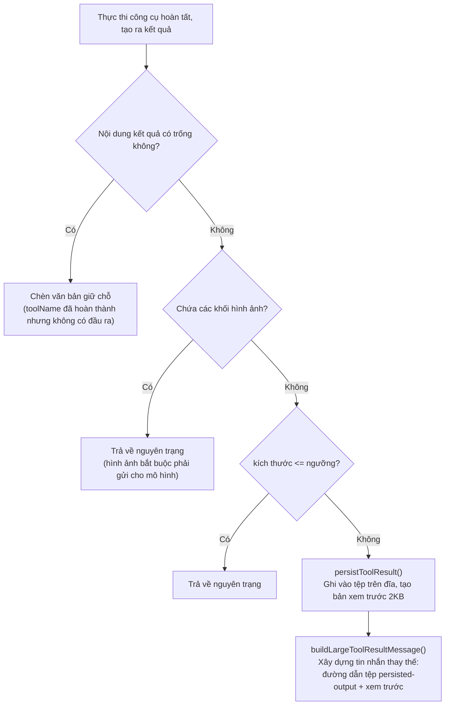
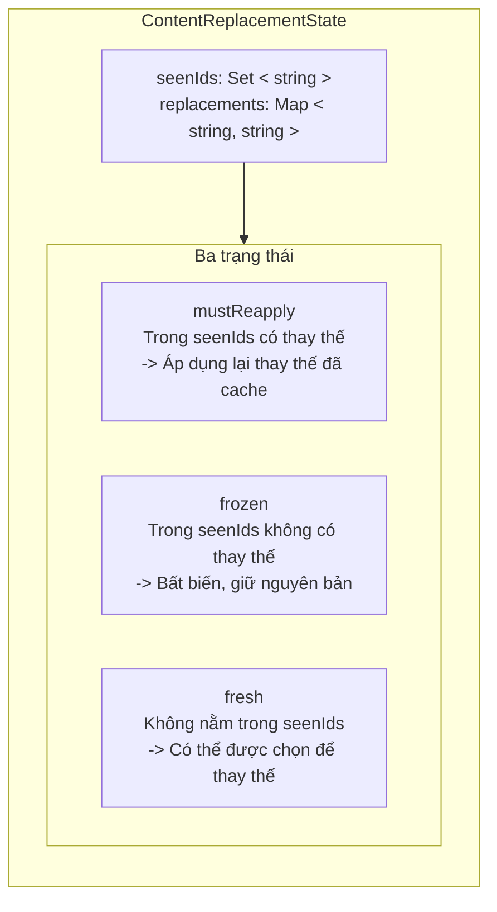
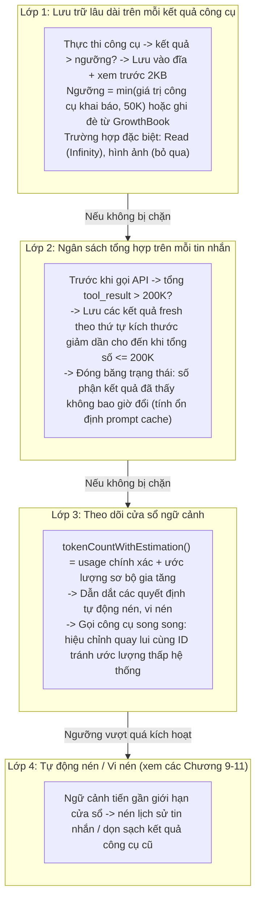

# Chương 12: Các chiến lược lập ngân sách token (Token Budgeting)

## Tại sao điều này lại quan trọng

Trong các Chương 9-11, chúng ta đã phân tích cách Claude Code nén và cắt tỉa sau khi cửa sổ ngữ cảnh "đầy lên". Nhưng có một câu hỏi thậm chí còn cơ bản hơn: **trước khi nội dung đi vào cửa sổ ngữ cảnh, làm thế nào để bạn kiểm soát kích thước của nó?**

Một lệnh `grep` duy nhất trả về 80KB kết quả tìm kiếm, một lệnh `cat` duy nhất đọc tệp nhật ký 200KB, năm cuộc gọi công cụ song song mỗi cuộc gọi trả về 50KB — đây là những kịch bản thực tế. Nếu không được kiểm soát, một kết quả công cụ duy nhất có thể tiêu tốn một phần tư cửa sổ ngữ cảnh và một tập hợp các cuộc gọi công cụ song song có thể đẩy ngữ cảnh thẳng đến ngưỡng nén.

Các chiến lược lập ngân sách token (token budgeting strategies) là "cổng vào" quản lý ngữ cảnh của Claude Code. Chúng hoạt động ở ba cấp độ:

1. **Cấp độ trên từng kết quả công cụ (Per-tool-result level)**: Các kết quả vượt quá ngưỡng sẽ được lưu trữ lâu dài (persist) vào đĩa, và chỉ hiển thị bản xem trước cho mô hình
2. **Cấp độ trên từng tin nhắn (Per-message level)**: Tổng kết quả từ một vòng gọi công cụ song song không được vượt quá 200K ký tự
3. **Cấp độ đếm token (Token counting level)**: Việc sử dụng cửa sổ ngữ cảnh được theo dõi thông qua API chuẩn tắc hoặc ước lượng sơ bộ

Chương này sẽ đi sâu vào ba cấp độ triển khai này, tiết lộ những sự đánh đổi kỹ thuật liên quan — đặc biệt là những cạm bẫy đếm token trong các kịch bản gọi công cụ song song.

---

## 12.1 Lưu trữ lâu dài kết quả công cụ (Tool Result Persistence): Cổng vào 50K ký tự

### Các hằng số cốt lõi

Việc kiểm soát kích thước kết quả công cụ xoay quanh hai hằng số cốt lõi được định nghĩa trong `constants/toolLimits.ts`:

```typescript
// constants/toolLimits.ts:13
export const DEFAULT_MAX_RESULT_SIZE_CHARS = 50_000

// constants/toolLimits.ts:49
export const MAX_TOOL_RESULTS_PER_MESSAGE_CHARS = 200_000
```

Hằng số đầu tiên là mức trần toàn cục cho **một kết quả công cụ riêng lẻ** — khi đầu ra của một công cụ vượt quá 50.000 ký tự, toàn bộ nội dung sẽ được ghi vào một tệp trên đĩa và mô hình chỉ nhận được một tin nhắn thay thế chứa đường dẫn tệp và bản xem trước 2.000 byte. Hằng số thứ hai là mức trần tổng hợp cho tất cả các kết quả công cụ trong **một tin nhắn duy nhất**, được thiết kế để bảo vệ chống lại tác động tích lũy của các cuộc gọi công cụ song song.

Mối quan hệ giữa hai hằng số này rất đáng lưu ý: 200K / 50K = 4, nghĩa là ngay cả khi bốn công cụ đều đạt đến mức trần trên mỗi công cụ, chúng vẫn an toàn trong phạm vi một tin nhắn duy nhất. Nhưng nếu năm công cụ song song trở lên đồng thời trả về kết quả gần mức trần, việc thực thi ngân sách cấp tin nhắn sẽ được kích hoạt.

### Tính toán ngưỡng lưu trữ lâu dài

Ngưỡng lưu trữ lâu dài trên mỗi công cụ không chỉ đơn giản là bằng 50K — đó là một quyết định nhiều lớp:

```typescript
// utils/toolResultStorage.ts:55-78
export function getPersistenceThreshold(
  toolName: string,
  declaredMaxResultSizeChars: number,
): number {
  // Infinity = hard opt-out
  if (!Number.isFinite(declaredMaxResultSizeChars)) {
    return declaredMaxResultSizeChars
  }
  const overrides = getFeatureValue_CACHED_MAY_BE_STALE<Record<
    string, number
  > | null>(PERSIST_THRESHOLD_OVERRIDE_FLAG, {})
  const override = overrides?.[toolName]
  if (
    typeof override === 'number' &&
    Number.isFinite(override) &&
    override > 0
  ) {
    return override
  }
  return Math.min(declaredMaxResultSizeChars, DEFAULT_MAX_RESULT_SIZE_CHARS)
}
```

Logic quyết định của hàm này tạo thành một chuỗi ưu tiên:

| Độ ưu tiên | Điều kiện | Kết quả |
|---|---|---|
| 1 (cao nhất) | Công cụ khai báo `maxResultSizeChars: Infinity` | Không bao giờ lưu trữ lâu dài (công cụ Read sử dụng cơ chế này) |
| 2 | Cờ GrowthBook `tengu_satin_quoll` có giá trị ghi đè cho công cụ này | Sử dụng giá trị ghi đè từ xa |
| 3 | Công cụ khai báo một `maxResultSizeChars` tùy chỉnh | `Math.min(giá trị khai báo, 50_000)` |
| 4 (mặc định) | Không có khai báo đặc biệt | 50.000 ký tự |

**Bảng 12-1: Chuỗi ưu tiên ngưỡng lưu trữ lâu dài trên mỗi công cụ**

Độ ưu tiên đầu tiên đặc biệt thú vị: công cụ Read đặt `maxResultSizeChars` của nó thành `Infinity`, nghĩa là nó **không bao giờ** được lưu trữ lâu dài dưới dạng tệp. Bình luận nguồn (dòng 59-61) giải thích lý do — nếu đầu ra của công cụ Read được lưu vào tệp, mô hình sẽ cần gọi lại Read để đọc tệp đó, tạo thành một vòng lặp vô hạn. Công cụ Read kiểm soát kích thước đầu ra thông qua tham số `maxTokens` của chính nó và không phụ thuộc vào cơ chế lưu trữ lâu dài chung.

### Luồng lưu trữ lâu dài

Khi kết quả công cụ vượt quá ngưỡng, hàm `maybePersistLargeToolResult` sẽ thực thi luồng sau:



**Hình 12-1: Luồng quyết định lưu trữ lâu dài kết quả công cụ**

Hai chi tiết triển khai đáng chú ý:

**Xử lý kết quả trống** (dòng 280-295): Nội dung `tool_result` trống khiến một số mô hình nhất định (bình luận đề cập đến "capybara") xác định nhầm ranh giới lượt trò chuyện, từ đó kết thúc đầu ra một cách sai lầm. Điều này là do trình kết xuất phía máy chủ (server-side renderer) không chèn dấu `\n\nAssistant:` sau `tool_result`, và nội dung trống sẽ khớp với mẫu chuỗi dừng (stop sequence pattern) `\n\nHuman:`. Giải pháp là chèn một chuỗi giữ chỗ ngắn `(toolName completed with no output)`.

**Tính lũy đẳng khi ghi tệp** (dòng 161-172): `persistToolResult` sử dụng `flag: 'wx'` để ghi tệp, nghĩa là nó sẽ ném ra lỗi `EEXIST` nếu tệp đã tồn tại — hàm sẽ bắt và bỏ qua lỗi này. Thiết kế này xử lý vấn đề lưu trữ lâu dài trùng lặp khi vi nén phát lại các tin nhắn gốc: `tool_use_id` là duy nhất cho mỗi lần gọi, nội dung cho cùng một ID là xác định, vì vậy việc bỏ qua các tệp hiện có là an toàn.

### Định dạng tin nhắn sau khi lưu trữ lâu dài

Sau khi lưu trữ lâu dài, tin nhắn mà mô hình thực sự nhìn thấy trông giống như thế này:

```xml
<persisted-output>
Output too large (82.3 KB). Full output saved to:
  /path/to/session/tool-results/toolu_01XYZ.txt

Preview (first 2.0 KB):
[First 2000 bytes of content, truncated at newline boundary]
...
</persisted-output>
```

Logic tạo bản xem trước (dòng 339-356) cố gắng cắt ngắn tại các ranh giới dòng mới để tránh cắt ngang một dòng ở giữa. Nếu vị trí dòng mới cuối cùng nằm trước 50% giới hạn (nghĩa là chỉ có một dòng duy nhất hoặc các dòng rất dài), nó sẽ quay về sử dụng giới hạn byte chính xác.

---

## 12.2 Ngân sách trên mỗi tin nhắn: Mức trần tổng hợp 200K

### Tại sao cần ngân sách ở cấp độ tin nhắn

Mức trần 50K cho mỗi công cụ là không đủ đối với các kịch bản gọi công cụ song song. Hãy xem xét tình huống này: mô hình đồng thời khởi tạo 10 cuộc gọi `Grep` để tìm kiếm các từ khóa khác nhau, mỗi cuộc gọi trả về 40K ký tự — về mặt riêng lẻ thì tất cả đều dưới ngưỡng 50K, nhưng tổng cộng là 400K ký tự sẽ được gửi đi trong một tin nhắn user duy nhất tới API. Điều này sẽ ngay lập tức tiêu tốn một phần lớn cửa sổ ngữ cảnh và có khả năng kích hoạt quá trình nén không cần thiết.

`MAX_TOOL_RESULTS_PER_MESSAGE_CHARS = 200_000` (dòng 49) là ngân sách tổng hợp được thiết kế cho kịch bản này. Các bình luận (dòng 40-48) nêu rõ nguyên tắc thiết kế cốt lõi: **các tin nhắn được đánh giá độc lập** — 150K kết quả trong một vòng gọi và 150K trong một vòng gọi khác đều nằm trong ngân sách và không ảnh hưởng lẫn nhau.

### Sự Phức tạp của việc gom nhóm tin nhắn

Các cuộc gọi công cụ song song không được biểu diễn một cách đơn giản trong định dạng tin nhắn nội bộ của Claude Code. Khi mô hình khởi tạo nhiều cuộc gọi công cụ song song, trình xử lý luồng (streaming handler) sẽ tạo ra một bản ghi AssistantMessage **riêng biệt** cho mỗi sự kiện `content_block_stop`, sau đó mỗi `tool_result` tiếp theo sẽ là một tin nhắn user độc lập. Vì vậy, mảng tin nhắn nội bộ trông giống như:

```
[..., assistant(id=A), user(result_1), assistant(id=A), user(result_2), ...]
```

Lưu ý rằng nhiều bản ghi assistant **chia sẻ cùng một `message.id`**. Nhưng trước khi gửi đến API, `normalizeMessagesForAPI` sẽ hợp nhất các tin nhắn user liên tiếp thành một. Ngân sách cấp tin nhắn phải hoạt động theo nhóm mà API nhìn thấy, chứ không phải biểu diễn nội bộ phân tán.

Hàm `collectCandidatesByMessage` (dòng 600-638) thực hiện logic gom nhóm này. Nó nhóm các tin nhắn theo "ranh giới tin nhắn assistant" — chỉ các `message.id` của assistant **chưa từng thấy trước đó** mới tạo ra các ranh giới nhóm mới:

```typescript
// utils/toolResultStorage.ts:624-635
const seenAsstIds = new Set<string>()
for (const message of messages) {
  if (message.type === 'user') {
    current.push(...collectCandidatesFromMessage(message))
  } else if (message.type === 'assistant') {
    if (!seenAsstIds.has(message.message.id)) {
      flush()
      seenAsstIds.add(message.message.id)
    }
  }
}
```

Có một trường hợp biên tinh tế ở đây: khi việc thực thi công cụ song song gặp phải sự kiện hủy bỏ (abort), các tin nhắn `agent_progress` có thể được chèn vào giữa các tin nhắn tool_result. Nếu các ranh giới nhóm được tạo ra tại các tin nhắn tiến độ (progress), các tool_result đó sẽ bị chia tách vào các nhóm ngân sách phụ khác nhau, vượt qua kiểm tra ngân sách tổng hợp — nhưng trên đường truyền, `normalizeMessagesForAPI` vẫn hợp nhất chúng thành một tin nhắn duy nhất vượt quá ngân sách. Mã nguồn tránh điều này bằng cách chỉ tạo nhóm tại các tin nhắn assistant (bỏ qua progress, attachment và các loại khác).

### Thực thi ngân sách và Đóng băng trạng thái

Cơ chế cốt lõi của việc thực thi ngân sách cấp tin nhắn là hàm `enforceToolResultBudget` (dòng 769-908). Thiết kế của nó xoay quanh một ràng buộc chính: **tính ổn định của prompt cache (prompt cache stability)**. Một khi mô hình đã nhìn thấy kết quả công cụ (dù là nội dung đầy đủ hay bản xem trước thay thế), quyết định này phải duy trì nhất quán trên tất cả các cuộc gọi API tiếp theo. Nếu không, các thay đổi tiền tố sẽ làm vô hiệu hóa prompt cache.

Điều này dẫn đến cơ chế "phân hoạch tam thái (tri-state partition)" / phân chia ba trạng thái:



**Hình 12-2: Phân hoạch tam thái kết quả công cụ và các chuyển dịch trạng thái**

Luồng thực thi trước mỗi cuộc gọi API:

1. **Đối với mỗi nhóm tin nhắn**, phân chia các tool_result ứng cử viên vào ba trạng thái trên
2. **mustReapply**: Lấy chuỗi thay thế đã được lưu trong bộ nhớ đệm trước đó từ Map và áp dụng lại một cách giống hệt — không tốn I/O, nhất quán ở cấp độ byte
3. **frozen**: Các kết quả đã thấy trước đó nhưng không bị thay thế — không còn có thể bị thay thế nữa (việc thay thế sẽ phá vỡ tiền tố prompt cache)
4. **fresh**: Các kết quả mới từ lượt này — kiểm tra ngân sách tổng hợp; khi vượt quá ngân sách, chọn các kết quả lớn nhất để lưu trữ lâu dài theo thứ tự kích thước giảm dần

Logic để chọn kết quả fresh nào cần thay thế nằm trong `selectFreshToReplace` (dòng 675-692): sắp xếp theo thứ tự kích thước giảm dần, chọn từng cái một cho đến khi tổng số còn lại (frozen + fresh không được chọn) giảm xuống dưới giới hạn ngân sách. Nếu chỉ riêng các kết quả frozen đã vượt quá ngân sách, hãy chấp nhận phần vượt quá đó — vi nén (microcompact) cuối cùng sẽ dọn dẹp chúng.

### Thời điểm đánh dấu trạng thái

Có một ràng buộc thời gian được thiết kế cẩn thận trong mã nguồn (dòng 833-842). Các ứng cử viên không được chọn để lưu trữ lâu dài sẽ được đánh dấu là đã thấy một cách **đồng bộ ngay lập tức** (thêm vào `seenIds`), while candidates selected for persistence are only marked after `await persistToolResult()` completes — đảm bảo tính nhất quán giữa `seenIds.has(id)` và `replacements.has(id)`. Bình luận giải thích: nếu một ID xuất hiện trong `seenIds` nhưng không có trong `replacements`, nó sẽ bị phân loại thành frozen (không thể thay thế), khiến nội dung đầy đủ được gửi đi; trong khi đó luồng chính có thể đang gửi bản xem trước — sự không nhất quán này sẽ dẫn đến việc mất hiệu lực prompt cache.

---

## 12.3 Đếm token: Đếm chuẩn tắc so với Ước lượng sơ bộ

### Hai cơ chế đếm

Claude Code duy trì hai cơ chế đếm token cho các tình huống khác nhau:

| Đặc điểm | Đếm chuẩn tắc (sử dụng API) | Ước lượng sơ bộ |
|---|---|---|
| Nguồn dữ liệu | Trường `usage` trong phản hồi API | Chiều dài ký tự / hệ số byte-trên-token |
| Độ chính xác | Chính xác tuyệt đối | Sai số lên tới +/-50% |
| Tính khả dụng | Sau khi cuộc gọi API hoàn tất | Bất kỳ lúc nào |
| Kịch bản sử dụng | Các quyết định về ngưỡng, tính toán ngân sách, thanh toán | Điền vào khoảng trống giữa các cuộc gọi API |

**Bảng 12-2: So sánh hai cơ chế đếm token**

### Đếm chuẩn tắc: Từ API Usage đến kích thước ngữ cảnh

Đối tượng `usage` của phản hồi API chứa nhiều trường. Hàm `getTokenCountFromUsage` (`utils/tokens.ts:46-53`) kết hợp chúng để tính tổng kích thước cửa sổ ngữ cảnh:

```typescript
// utils/tokens.ts:46-53
export function getTokenCountFromUsage(usage: Usage): number {
  return (
    usage.input_tokens +
    (usage.cache_creation_input_tokens ?? 0) +
    (usage.cache_read_input_tokens ?? 0) +
    usage.output_tokens
  )
}
```

Phái tính này bao gồm bốn thành phần: `input_tokens` (đầu vào không được lưu cache cho yêu cầu này), `cache_creation_input_tokens` (các token mới được ghi vào cache), `cache_read_input_tokens` (các token được đọc từ cache) và `output_tokens` (đầu ra do mô hình tạo ra). Lưu ý rằng các trường liên quan đến cache là tùy chọn (`?? 0`), vì không phải tất cả các nhà cung cấp API đều trả về chúng.

### Ước lượng sơ bộ: Quy tắc 4 Byte/Token

Khi mức sử dụng API không khả dụng — ví dụ: khi các tin nhắn mới được thêm vào giữa hai cuộc gọi API — Claude Code sẽ sử dụng chiều dài ký tự chia cho một hệ số thực nghiệm để ước lượng số lượng token. Hàm ước lượng cốt lõi nằm trong `services/tokenEstimation.ts:203-208`:

```typescript
// services/tokenEstimation.ts:203-208
export function roughTokenCountEstimation(
  content: string,
  bytesPerToken: number = 4,
): number {
  return Math.round(content.length / bytesPerToken)
}
```

Giá trị mặc định là 4 byte/token là một ước lượng thận trọng. Bộ phân tách từ (tokenizer) của Claude có tỷ lệ thực tế khoảng 3.5-4.5 đối với văn bản tiếng Anh, với 4 là trung vị thực nghiệm. Nhưng tỷ lệ thực tế thay đổi đáng kể tùy theo loại nội dung:

| Loại nội dung | Hệ số Byte/Token | Nguồn |
|---|---|---|
| Văn bản thuần túy (tiếng Anh, mã nguồn) | 4 | Mặc định (`tokenEstimation.ts:204`) |
| JSON / JSONL / JSONC | 2 | `bytesPerTokenForFileType` (`tokenEstimation.ts:216-224`) |
| Hình ảnh (khối image) | Cố định 2.000 token | `roughTokenCountEstimationForBlock` (dòng 400-412) |
| Tài liệu PDF (khối document) | Cố định 2.000 token | Như trên |

**Bảng 12-3: Tóm tắt các quy tắc ước lượng token nhận biết loại tệp**

Các tệp JSON sử dụng 2 thay vì 4 vì một lý do được giải thích rõ ràng trong các bình luận (dòng 213-215): **JSON đậm đặc chứa nhiều token dạng đơn ký tự** (`{`, `}`, `:`, `,`, `"`), nghĩa là mỗi token tương ứng với trung bình khoảng 2 byte. Nếu vẫn sử dụng 4, một tệp JSON 100KB sẽ được ước lượng là 25K token, trong khi thực tế nó gần 50K — việc ước lượng thấp này có thể khiến các kết quả công cụ quá khổ vượt qua được chốt chặn lưu trữ lâu dài và âm thầm đi vào ngữ cảnh.

`bytesPerTokenForFileType` (dòng 215-224) trả về các hệ số khác nhau dựa trên phần mở rộng tệp:

```typescript
// services/tokenEstimation.ts:215-224
export function bytesPerTokenForFileType(fileExtension: string): number {
  switch (fileExtension) {
    case 'json':
    case 'jsonl':
    case 'jsonc':
      return 2
    default:
      return 4
  }
}
```

### Ước lượng cố định cho hình ảnh và tài liệu

Hình ảnh và tài liệu PDF là những trường hợp đặc biệt. Việc tính phí token thực tế của API cho hình ảnh là `(chiều rộng x chiều cao) / 750`, với hình ảnh được thu phóng tới tối đa 2000x2000 pixel (khoảng 5.333 token). Nhưng trong ước lượng sơ bộ, Claude Code sử dụng đồng nhất mức **cố định 2.000 token** (dòng 400-412).

Có một cân nhắc kỹ thuật quan trọng ở đây: nếu dữ liệu `source.data` của hình ảnh hoặc tài liệu PDF (mã hóa base64) được đưa vào đường dẫn tuần tự hóa JSON thông thường, một tệp PDF 1MB sẽ tạo ra khoảng 1,33 triệu ký tự base64, tương đương khoảng 325K token nếu tính theo mức 4 byte/token — vượt xa chi phí thực tế của API là khoảng 2.000 token. Do đó, mã nguồn kiểm tra rõ ràng `block.type === 'image' || block.type === 'document'` trước khi tiến hành ước lượng chung và trả về giá trị cố định sớm, tránh việc ước lượng quá mức một cách nghiêm trọng.

---

## 12.4 Cạm bẫy đếm token của các cuộc gọi công cụ song song

### Vấn đề đan xen tin nhắn

Các cuộc gọi công cụ song song gây ra một vấn đề đếm token tinh tế nhưng nghiêm trọng. Hàm `tokenCountWithEstimation` — **hàm chuẩn tắc** của Claude Code cho các quyết định về ngưỡng — có một phân tích chi tiết về vấn đề này trong phần triển khai của nó (`utils/tokens.ts:226-261`).

Nguyên nhân gốc rễ nằm ở cấu trúc đan xen của mảng tin nhắn. Khi mô hình khởi tạo hai cuộc gọi công cụ song song, mảng tin nhắn nội bộ sẽ có dạng như sau:

```
Index:  ... i-3       i-2         i-1          i
Message:... asst(A)   user(tr_1)  asst(A)      user(tr_2)
             ^ usage              ^ same usage
```

Hai bản ghi assistant **chia sẻ cùng một `message.id` và có `usage` giống hệt nhau** (vì chúng đến từ các khối nội dung khác nhau của cùng một phản hồi API). Nếu bạn chỉ đơn giản tìm tin nhắn assistant cuối cùng có `usage` từ phía cuối (chỉ mục i-1), sau đó ước lượng các tin nhắn sau nó (chỉ có `user(tr_2)` tại chỉ mục i), bạn sẽ **bỏ sót** `user(tr_1)` tại chỉ mục i-2.

Nhưng trong yêu cầu API tiếp theo, cả `user(tr_1)` và `user(tr_2)` **will** xuất hiện trong đầu vào. Điều này có nghĩa là `tokenCountWithEstimation` sẽ có xu hướng ước lượng thấp một cách hệ thống kích thước ngữ cảnh.

```
             Nội dung thực tế có trong ngữ cảnh
    +--------------------------------------+
    | asst(A) user(tr_1) asst(A) user(tr_2)|
    +--------------------------------------+
              ^                   ^
           Bị bỏ sót!       Chỉ tin nhắn này được ước lượng

             Phạm vi ước lượng đã hiệu chỉnh
    +--------------------------------------+
    | asst(A) user(tr_1) asst(A) user(tr_2)|
    +--------------------------------------+
    ^ Quay lui đến assistant đầu tiên có cùng ID ^
    Ước lượng tất cả các tin nhắn tiếp theo từ đây
```

**Hình 12-3: Hiệu chỉnh quay lui số lượng token cho các cuộc gọi công cụ song song**

### Hiệu chỉnh quay lui cùng ID

Giải pháp trong `tokenCountWithEstimation` là sau khi tìm thấy bản ghi assistant cuối cùng có usage, hãy **quay lui (backtrack)** về bản ghi assistant đầu tiên có chia sẻ cùng một `message.id`:

```typescript
// utils/tokens.ts:235-250
const responseId = getAssistantMessageId(message)
if (responseId) {
  let j = i - 1
  while (j >= 0) {
    const prior = messages[j]
    const priorId = prior ? getAssistantMessageId(prior) : undefined
    if (priorId === responseId) {
      i = j  // Anchor to the earlier same-ID record
    } else if (priorId !== undefined) {
      break  // Hit a different API response, stop backtracking
    }
    j--
  }
}
```

Lưu ý ba trường hợp trong logic quay lui:

1. `priorId === responseId`: Một đoạn trước đó của cùng một phản hồi API — di chuyển điểm neo về đây
2. `priorId !== undefined` (và khác ID): Gặp một phản hồi API khác — dừng việc quay lui
3. `priorId === undefined`: Đây là tin nhắn user/tool_result/attachment — có thể là kết quả công cụ đan xen giữa các phân đoạn, tiếp tục quay lui

Sau khi quá trình quay lui hoàn tất, tất cả các tin nhắn nằm sau điểm neo (bao gồm tất cả các tool_result đan xen) sẽ được đưa vào phần ước lượng sơ bộ:

```typescript
// utils/tokens.ts:253-256
return (
  getTokenCountFromUsage(usage) +
  roughTokenCountEstimationForMessages(messages.slice(i + 1))
)
```

Kích thước ngữ cảnh cuối cùng = mức sử dụng chính xác từ phản hồi API cuối cùng + ước lượng sơ bộ của tất cả các tin nhắn được thêm vào sau đó. Cách tiếp cận hỗn hợp "mức cơ sở chính xác + ước lượng gia tăng" này giúp cân bằng giữa độ chính xác và hiệu năng.

### Khi nào không nên sử dụng hàm nào

Các bình luận nguồn (dòng 118-121, dòng 207-212) liên tục nhấn mạnh tầm quan trọng của việc lựa chọn hàm:

- **`tokenCountWithEstimation`**: **Hàm chuẩn tắc**, được sử dụng cho tất cả các so sánh ngưỡng (kích hoạt tự động nén, khởi tạo bộ nhớ phiên làm việc, v.v.)
- **`tokenCountFromLastAPIResponse`**: Chỉ trả về tổng số token chính xác của cuộc gọi API cuối cùng, không bao gồm ước lượng của các tin nhắn mới được thêm vào — không thích hợp cho các quyết định về ngưỡng
- **`messageTokenCountFromLastAPIResponse`**: Chỉ trả về `output_tokens` — chỉ được sử dụng để đo lường xem mô hình đã tạo ra bao nhiêu token trong một phản hồi duy nhất, không phản ánh mức sử dụng cửa sổ ngữ cảnh

Việc sử dụng sai các hàm này có hậu quả thực tế: nếu `messageTokenCountFromLastAPIResponse` được sử dụng để quyết định xem có cần nén hay không, giá trị trả về có thể chỉ là vài nghìn (đầu ra của một phản hồi assistant), trong khi ngữ cảnh thực tế đã vượt quá 180K — quá trình nén sẽ không bao giờ được kích hoạt, cuối cùng dẫn đến việc cuộc gọi API thất bại do vượt quá giới hạn cửa sổ.

---

## 12.5 Đếm phụ trợ: Đếm token bằng API và Haiku dự phòng (Haiku Fallback)

### API countTokens

Bên cạnh việc ước lượng sơ bộ, Claude Code cũng có thể lấy số lượng token chính xác thông qua API. Hàm `countMessagesTokensWithAPI` (`services/tokenEstimation.ts:140-201`) gọi đến endpoint `anthropic.beta.messages.countTokens`, truyền danh sách tin nhắn đầy đủ và các định nghĩa công cụ để có được giá trị `input_tokens` chính xác.

API này được sử dụng cho các kịch bản yêu cầu đếm chính xác (chẳng hạn như đánh giá chi phí token của định nghĩa công cụ), nhưng nó có độ trễ lớn — yêu cầu một vòng kết nối HTTP bổ sung. Do đó, các quyết định về ngưỡng hàng ngày sử dụng cách tiếp cận hỗn hợp của `tokenCountWithEstimation`, và việc đếm bằng API được dành riêng cho các kịch bản cụ thể.

### Haiku dự phòng (Haiku Fallback)

Khi API `countTokens` không khả dụng (ví dụ: một số cấu hình Bedrock nhất định), hàm `countTokensViaHaikuFallback` (dòng 251-325) sử dụng một giải pháp thay thế thông minh: gửi yêu cầu `max_tokens: 1` tới Haiku (một mô hình nhỏ), sử dụng trường `usage` trả về để có được số lượng token đầu vào chính xác. Chi phí là một cuộc gọi API mô hình nhỏ, nhưng đạt được độ chính xác.

Hàm này xem xét nhiều ràng buộc nền tảng khi chọn mô hình dự phòng:

- **Vùng toàn cầu của Vertex (Vertex global regions)**: Haiku không khả dụng, chuyển sang dùng Sonnet
- **Bedrock + các khối tư duy (thinking blocks)**: Haiku 3.5 không hỗ trợ suy nghĩ (thinking), chuyển sang dùng Sonnet
- **Các trường hợp khác**: Sử dụng Haiku (chi phí thấp nhất)

---

## 12.6 Hệ thống ngân sách token đầu-cuối

Kết hợp tất cả các cơ chế trên, ngân sách token của Claude Code tạo thành một hệ thống phòng thủ nhiều lớp:



**Hình 12-4: Hệ thống phòng thủ ngân sách token bốn lớp**

Mỗi lớp có các ranh giới trách nhiệm rõ ràng và các đường dẫn giảm cấp khi gặp lỗi:

- Lớp 1 thất bại (lỗi lưu trữ vào đĩa) -> Kết quả đầy đủ được trả về nguyên trạng, Lớp 2 và 4 sẽ bắt lấy nó
- Các kết quả frozen của Lớp 2 không thể thay thế -> Chấp nhận phần vượt quá, vi nén của Lớp 4 cuối cùng sẽ dọn dẹp
- Ước lượng sơ bộ của Lớp 3 không chính xác -> Có thể khiến việc nén kích hoạt quá sớm hoặc quá muộn, nhưng không gây mất dữ liệu

### Tinh chỉnh tham số động bằng GrowthBook

Hai ngưỡng cốt lõi có thể được điều chỉnh tại thời điểm chạy thông qua các cờ tính năng GrowthBook, mà không cần phát hành phiên bản mới:

- **`tengu_satin_quoll`**: Bản đồ ghi đè ngưỡng lưu trữ lâu dài trên mỗi công cụ
- **`tengu_hawthorn_window`**: Ghi đè toàn cục ngân sách tổng hợp trên mỗi tin nhắn

Hàm `getPerMessageBudgetLimit` (dòng 421-434) thể hiện phong cách lập trình phòng thủ đối với các giá trị ghi đè — thực hiện ba lần kiểm tra `typeof`, `isFinite` và `> 0` trên các giá trị trả về từ GrowthBook, vì lớp cache có thể làm rò rỉ các giá trị `null`, `NaN` hoặc kiểu chuỗi.

---

## 12.7 Người dùng có thể làm gì

### 12.7.1 Kiểm soát kích thước đầu ra công cụ

Khi lệnh `grep` hoặc `bash` của bạn trả về đầu ra lớn (trên 50K ký tự), các kết quả sẽ được lưu vào đĩa và mô hình chỉ có thể xem bản xem trước 2KB đầu tiên. Để tránh việc mất thông tin này, hãy sử dụng các tiêu chí tìm kiếm chính xác hơn — ví dụ: sử dụng `grep -l` (chỉ liệt kê tên tệp) thay vì tìm kiếm toàn văn, hoặc sử dụng `head -n 100` để giới hạn đầu ra của lệnh. Bằng cách này, mô hình sẽ thấy kết quả hoàn chỉnh thay vì một bản xem trước bị cắt ngắn.

### 12.7.2 Đề phòng sự tích lũy cuộc gọi công cụ song song

Khi mô hình đồng thời khởi chạy nhiều tìm kiếm, kích thước tổng hợp của tất cả các kết quả bị giới hạn ở mức 200K ký tự. Nếu bạn yêu cầu mô hình "tìm kiếm 10 từ khóa này cùng một lúc", một số kết quả có thể bị lưu trữ lâu dài do tràn ngân sách. Hãy cân nhắc chia nhỏ các tìm kiếm quy mô lớn thành nhiều vòng nhỏ hơn, hoặc để mô hình tìm kiếm dần dần nhằm giữ cho kết quả của mỗi vòng nằm trong giới hạn ngân sách.

### 12.7.3 Các lưu ý đặc biệt đối với tệp JSON

Các tệp JSON có mật độ token gấp đôi so với mã thông thường (khoảng 2 byte mỗi token so với 4). Điều này có nghĩa là một tệp JSON 100KB thực sự tiêu tốn khoảng 50K token, trong khi một tệp TypeScript cùng kích thước chỉ tiêu tốn khoảng 25K token. Khi để mô hình đọc các cấu hình JSON lớn hoặc tệp dữ liệu lớn, hãy lưu ý rằng chúng tạo ra nhiều áp lực hơn cho cửa sổ ngữ cảnh.

### 12.7.4 Tận dụng vị thế đặc biệt của công cụ Read

Đầu ra của công cụ Read không bao giờ được lưu trữ vào đĩa — nó kiểm soát kích thước thông qua tham số `maxTokens` của chính nó. Điều này có nghĩa là nội dung tệp được đọc qua Read luôn được trình bày trực tiếp cho mô hình, không bao giờ bị cắt ngắn thành bản xem trước 2KB. Nếu bạn cần mô hình xem nội dung đầy đủ của một tệp, việc sử dụng Read sẽ đáng tin cậy hơn lệnh `cat`.

### 12.7.5 Be Aware of Rough Estimation Deviation

Giữa các cuộc gọi API, Claude Code sử dụng ước lượng sơ bộ (số lượng ký tự / 4) để theo dõi kích thước ngữ cảnh, với sai số lên tới +/-50%. Điều này có nghĩa là thời điểm kích hoạt tự động nén có thể sớm hơn hoặc muộn hơn so với dự kiến. Nếu bạn quan sát thấy quá trình nén diễn ra vào những thời điểm không mong muốn, đây thường là hành vi bình thường do sai số ước lượng gây ra, chứ không phải là lỗi.

---

## Chi tiết chuyên sâu về thiết kế (Design Insights)

### Ước lượng Thận trọng so với Táo bạo

Một sự đánh đổi thiết kế lặp đi lặp lại trong toàn bộ hệ thống ngân sách token là: **ước lượng cao số lượng token thì tốt hơn là ước lượng thấp**.

- JSON sử dụng 2 byte/token thay vì 4, vì việc ước lượng thấp sẽ khiến các kết quả quá khổ lọt qua chốt lưu trữ
- Hình ảnh sử dụng cố định 2.000 token thay vì ước lượng theo chiều dài base64, vì ước lượng sau sẽ gây ra việc ước lượng quá cao một cách tai hại (ngữ cảnh có vẻ "đầy" trong khi thực tế thì không)
- Việc hiệu chỉnh quay lui cuộc gọi công cụ song song tồn tại vì việc bỏ sót các tool_result sẽ gây ra hiện tượng ước lượng thấp mang tính hệ thống

Những lựa chọn này phản ánh một nguyên tắc: **ngân sách token là một cơ chế an toàn, không phải là cơ chế tối ưu hóa**. Chi phí của việc ước lượng quá mức là kích hoạt nén sớm (mất mát nhỏ về hiệu năng); chi phí của việc ước lượng thấp là tràn cửa sổ ngữ cảnh (lỗi cuộc gọi API).

### Tác động sâu sắc của Prompt Cache đối với thiết kế ngân sách

Hầu hết sự phức tạp của ngân sách cấp tin nhắn — phân hoạch tam thái, đóng băng trạng thái, áp dụng lại nhất quán ở cấp độ byte — đều bắt nguồn từ một ràng buộc bên ngoài duy nhất: prompt cache yêu cầu tính ổn định của tiền tố (prefix stability). Nếu không có prompt cache, mỗi cuộc gọi API có thể tự do đánh giá lại xem liệu tất cả các kết quả công cụ có cần lưu trữ lâu dài hay không. Nhưng sự tồn tại của prompt cache có nghĩa là một khi mô hình đã "nhìn thấy" nội dung đầy đủ của kết quả công cụ, các cuộc gọi tiếp theo phải tiếp tục gửi nội dung đầy đủ đó (nếu không, các thay đổi tiền tố sẽ làm vô hiệu hóa cache).

Ràng buộc này chuyển đổi một hàm lẽ ra là không trạng thái (stateless) ("kiểm tra kích thước, thay thế nếu vượt quá") thành một **máy trạng thái có trạng thái (stateful state machine)** (`ContentReplacementState`), và trạng thái này phải tồn tại qua các lần tiếp tục phiên làm việc — đó là lý do tại sao `ContentReplacementRecord` được lưu trữ lâu dài vào bản ghi lịch sử trò chuyện (transcript).

Đây là một ví dụ kinh điển: **trong các hệ thống AI Agent, các tối ưu hóa hiệu năng (prompt cache) có thể ràng buộc ngược lại thiết kế chức năng (thực thi ngân sách), tạo ra sự liên kết kiến trúc (architectural coupling) không mong đợi**.

---

## Tiến hóa phiên bản: Các thay đổi trong v2.1.91

> Phân tích sau đây dựa trên so sánh tín hiệu bundle của v2.1.91.

v2.1.91 bổ sung thêm các sự kiện `tengu_memory_toggled` và `tengu_extract_memories_skipped_no_prose`. Sự kiện trước theo dõi trạng thái chuyển đổi tính năng bộ nhớ; sự kiện sau cho biết rằng việc trích xuất bộ nhớ bị bỏ qua khi các tin nhắn không chứa nội dung văn xuôi (prose) — một tối ưu hóa nhận biết ngân sách giúp tránh thực hiện trích xuất bộ nhớ vô ích trên các tin nhắn chỉ thuần chứa mã nguồn/kết quả công cụ.
