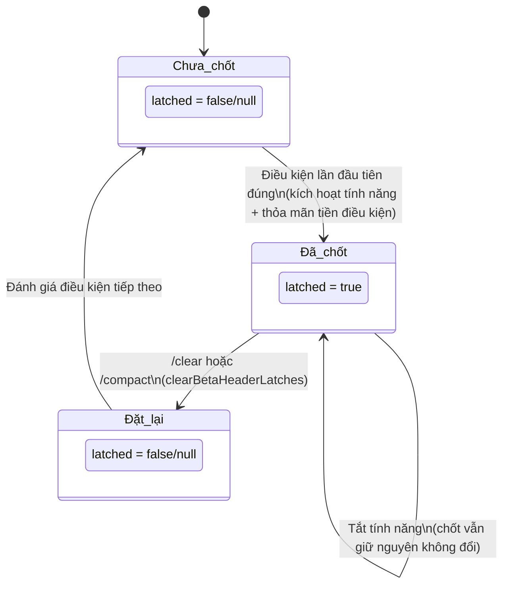

# Chương 13: Kiến trúc bộ nhớ đệm và Thiết kế điểm ngắt (Breakpoint)

## Tại sao điều này lại quan trọng

Trong Chương 12, chúng ta đã thảo luận về cách các chiến lược lập ngân sách token kiểm soát kích thước của nội dung đi vào cửa sổ ngữ cảnh. Nhưng có một vấn đề chi phí ngấm ngầm hơn: **ngay cả khi nội dung trong cửa sổ ngữ cảnh hoàn toàn giống nhau, mọi cuộc gọi API vẫn phải trả phí cho prompt hệ thống (system prompt) và định nghĩa công cụ.**

Đối với một phiên làm việc điển hình của Claude Code, prompt hệ thống chiếm khoảng 11.000 token và các định nghĩa schema của hơn 40 công cụ đóng góp thêm khoảng 20.000 token nữa — riêng những "chi phí cố định" này đã tiêu tốn hơn 30.000 token cho mỗi cuộc gọi. Trong một phiên làm việc gồm 50 lượt, điều đó có nghĩa là 1.500.000 token được xử lý lặp đi lặp lại. Ở mức giá của Anthropic, đây là một chi phí không hề nhỏ.

Cơ chế Prompt Caching (Lưu cache prompt) của Anthropic được thiết kế để giải quyết chính xác vấn đề này: nếu tiền tố (prefix) của một yêu cầu API khớp với một yêu cầu trước đó, máy chủ có thể tái sử dụng trạng thái KV đã lưu trữ, giúp giảm 90% chi phí cho phần được cache. Nhưng việc trúng cache (cache hit) có một yêu cầu nghiêm ngặt — tiền tố phải khớp **từng byte một (byte-for-byte)**. Chỉ cần thay đổi một ký tự sẽ dẫn đến việc trượt cache (cache miss), hay còn gọi là "ngắt cache (cache break)".

Claude Code xây dựng một kiến trúc cache tinh vi xung quanh ràng buộc này, bao gồm ba cấp độ phạm vi cache (cache scope), hai cấp độ thời gian sống (TTL) và một bộ cơ chế "chốt giữ (latching)" để ngăn ngừa lỗi ngắt cache. Chương này đi sâu vào thiết kế và triển khai của kiến trúc đó.

---

## 13.1 Các nguyên lý cơ bản của Anthropic API Prompt Caching

### Mô hình khớp tiền tố (Prefix Matching)

Cơ chế prompt caching của Anthropic dựa trên nguyên lý **khớp tiền tố (prefix matching)**. Máy chủ coi một yêu cầu API như một luồng byte được tuần tự hóa (serialized byte stream), so sánh từng byte một kể từ điểm bắt đầu. Một khi phát hiện sự không trùng khớp, cache sẽ "ngắt" tại thời điểm đó — mọi thứ trước đó đều có thể được tái sử dụng, mọi thứ sau đó đều phải được tính toán lại.

Điều này có nghĩa là hiệu quả của cache phụ thuộc hoàn toàn vào **tính ổn định** của tiền tố yêu cầu. Trình tự tuần tự hóa của một yêu cầu API đại khái như sau:

```
[Prompt hệ thống] → [Định nghĩa công cụ] → [Lịch sử tin nhắn]
```

Prompt hệ thống và các định nghĩa công cụ nằm ở đầu trình tự — bất kỳ thay đổi nào đối với chúng cũng sẽ làm vô hiệu hóa toàn bộ cache. Lịch sử tin nhắn được nối vào ở phía cuối, vì vậy các tin nhắn mới chỉ phát sinh chi phí cho phần tăng thêm.

### Các thẻ đánh dấu cache_control

Để bật tính năng lưu cache, bạn thêm các thẻ đánh dấu `cache_control` vào các khối nội dung trong yêu cầu API:

```typescript
// Dạng cơ bản của cache_control
{
  type: 'ephemeral'
}

// Dạng mở rộng (dành riêng cho 1P - first party)
{
  type: 'ephemeral',
  scope: 'global' | 'org',   // Phạm vi cache
  ttl: '5m' | '1h'           // Thời gian sống của cache
}
```

`type: 'ephemeral'` là loại cache duy nhất được hỗ trợ, biểu thị một điểm ngắt cache tạm thời. Claude Code định nghĩa một kiểu schema công cụ mở rộng trong `utils/api.ts` (dòng 68–78) bao gồm các tùy chọn `cache_control` đầy đủ:

```typescript
// utils/api.ts:68-78
type BetaToolWithExtras = BetaTool & {
  strict?: boolean
  defer_loading?: boolean
  cache_control?: {
    type: 'ephemeral'
    scope?: 'global' | 'org'
    ttl?: '5m' | '1h'
  }
  eager_input_streaming?: boolean
}
```

### Vị trí đặt điểm ngắt Cache

Claude Code đặt các điểm ngắt cache trong yêu cầu một cách cẩn thận, tạo ra một đối tượng `cache_control` thống nhất thông qua hàm `getCacheControl()` (`services/api/claude.ts`, dòng 358–374):

```typescript
// services/api/claude.ts:358-374
export function getCacheControl({
  scope,
  querySource,
}: {
  scope?: CacheScope
  querySource?: QuerySource
} = {}): {
  type: 'ephemeral'
  ttl?: '1h'
  scope?: CacheScope
} {
  return {
    type: 'ephemeral',
    ...(should1hCacheTTL(querySource) && { ttl: '1h' }),
    ...(scope === 'global' && { scope }),
  }
}
```

Hàm này trông có vẻ đơn giản, nhưng mỗi nhánh điều kiện đều chứa đựng một chiến lược lưu cache được cân nhắc rất kỹ lưỡng.

---

## 13.2 Ba cấp độ phạm vi Cache

Claude Code sử dụng ba phạm vi cache, mỗi phạm vi tương ứng với một mức độ chi tiết tái sử dụng khác nhau. Các phạm vi này được gán cho các phần khác nhau của prompt hệ thống thông qua hàm `splitSysPromptPrefix()` (`utils/api.ts`, dòng 321–435).

### Định nghĩa phạm vi

| Phạm vi Cache | Định danh | Mức độ tái sử dụng | Nội dung áp dụng | TTL |
|---|---|---|---|---|
| **Cache toàn cục (Global Cache)** | `'global'` | Xuyên tổ chức, xuyên người dùng | Các prompt tĩnh được chia sẻ giữa mọi phiên bản Claude Code | 5 phút (mặc định) |
| **Cache tổ chức (Org Cache)** | `'org'` | Người dùng trong cùng tổ chức | Nội dung đặc thù của tổ chức nhưng không phụ thuộc người dùng | 5 phút / 1 giờ |
| **Không cache (No Cache)** | `null` | Không đặt `cache_control` | Nội dung có tính động cao | Không áp dụng |

**Bảng 13-1: So sánh ba cấp độ phạm vi Cache**

> **Phiên bản tương tác**: [Nhấp để xem ảnh động trúng cache](cache-viz.html) — trình bày từng bước quá trình so khớp cache của yêu cầu API, hỗ trợ 3 tùy chọn kịch bản (cuộc gọi đầu tiên / cùng người dùng / người dùng khác nhau), cùng chức năng tính toán tỷ lệ trúng cache và chi phí tiết kiệm được theo thời gian thực.

### Phạm vi Cache toàn cục (global)

Lưu cache toàn cục là tối ưu hóa mạnh mẽ nhất — nội dung được đánh dấu là `global` có thể chia sẻ KV cache giữa tất cả người dùng Claude Code. Điều này có nghĩa là khi Người dùng A khởi tạo một yêu cầu và lưu phần tĩnh của prompt hệ thống vào cache, yêu cầu tiếp theo của Người dùng B có thể trực tiếp trúng phần cache đó.

Các tiêu chí đủ điều kiện để lưu cache toàn cục rất nghiêm ngặt: nội dung phải **hoàn toàn bất biến**, không chứa thông tin đặc thù của người dùng, tổ chức hay thậm chí là thời gian cụ thể. Claude Code chia prompt hệ thống thành các phần tĩnh và động bằng cách sử dụng một "dấu mốc ranh giới động" (`SYSTEM_PROMPT_DYNAMIC_BOUNDARY`):

```typescript
// utils/api.ts:362-404 (đã giản lược)
if (useGlobalCacheFeature) {
  const boundaryIndex = systemPrompt.findIndex(
    s => s === SYSTEM_PROMPT_DYNAMIC_BOUNDARY,
  )
  if (boundaryIndex !== -1) {
    // Content before the boundary → cacheScope: 'global'
    // Content after the boundary → cacheScope: null
    for (let i = 0; i < systemPrompt.length; i++) {
      if (i < boundaryIndex) {
        staticBlocks.push(block)
      } else {
        dynamicBlocks.push(block)
      }
    }
    // ...
    if (staticJoined)
      result.push({ text: staticJoined, cacheScope: 'global' })
    if (dynamicJoined)
      result.push({ text: dynamicJoined, cacheScope: null })
  }
}
```

Lưu ý rằng nội dung động nằm sau ranh giới được đánh dấu là `cacheScope: null` — nó thậm chí không sử dụng mức cache cấp `org`, bởi vì tần suất thay đổi của nội dung động là quá cao, tỷ lệ trúng cache sẽ cực kỳ thấp, và việc đánh dấu các điểm ngắt cache sẽ chỉ làm tăng độ phức tạp của yêu cầu API.

### Phạm vi Cache tổ chức (org)

Khi cache toàn cục không khả dụng (ví dụ: tính năng cache toàn cục không được bật hoặc nội dung chứa thông tin đặc thù của tổ chức), Claude Code sẽ lùi về mức `org`:

```typescript
// utils/api.ts:411-435 (chế độ mặc định)
let attributionHeader: string | undefined
let systemPromptPrefix: string | undefined
const rest: string[] = []

for (const block of systemPrompt) {
  if (block.startsWith('x-anthropic-billing-header')) {
    attributionHeader = block
  } else if (CLI_SYSPROMPT_PREFIXES.has(block)) {
    systemPromptPrefix = block
  } else {
    rest.push(block)
  }
}

const result: SystemPromptBlock[] = []
if (attributionHeader)
  result.push({ text: attributionHeader, cacheScope: null })
if (systemPromptPrefix)
  result.push({ text: systemPromptPrefix, cacheScope: 'org' })
const restJoined = rest.join('\n\n')
if (restJoined)
  result.push({ text: restJoined, cacheScope: 'org' })
```

Chiến lược phân mảnh ở đây tiết lộ một chi tiết quan trọng: **tiêu đề phân bổ hóa đơn** (`x-anthropic-billing-header`) được đánh dấu là `null` và bị loại khỏi việc lưu cache. Điều này là do tiêu đề phân bổ hóa đơn chứa thông tin nhận dạng người dùng nên không thể chia sẻ ngay cả ở cấp độ `org`. Tiền tố prompt hệ thống CLI (`CLI_SYSPROMPT_PREFIXES`) và nội dung prompt hệ thống còn lại đều được đánh dấu là `org`, được chia sẻ trong cùng một tổ chức.

### Xử lý đặc biệt đối với công cụ MCP

Khi người dùng cấu hình các công cụ MCP, chiến lược cache toàn cục sẽ thay đổi. Do các định nghĩa công cụ MCP được cung cấp bởi các máy chủ bên ngoài và nội dung của chúng là không thể dự đoán được, việc đưa chúng vào cache toàn cục sẽ làm giảm tỷ lệ trúng cache. Claude Code xử lý vấn đề này thông qua cờ `skipGlobalCacheForSystemPrompt`:

```typescript
// utils/api.ts:326-360
if (useGlobalCacheFeature && options?.skipGlobalCacheForSystemPrompt) {
  logEvent('tengu_sysprompt_using_tool_based_cache', {
    promptBlockCount: systemPrompt.length,
  })
  // All content downgraded to org scope, skipping boundary markers
  // ...
}
```

Việc giảm cấp này tuy thận trọng nhưng hợp lý — thay vì mạo hiểm trượt cache toàn cục thường xuyên, nó lùi về sử dụng tỷ lệ trúng cache ổn định hơn ở cấp độ `org`.

---

## 13.3 Các phân cấp TTL của Cache

### Mặc định 5 Phút so với 1 Giờ

Tính năng prompt caching của Anthropic có thời gian sống (TTL) mặc định là 5 phút. Điều này có nghĩa là nếu người dùng không khởi tạo một yêu cầu API mới trong vòng 5 phút, cache sẽ hết hạn. Đối với các phiên lập trình tích cực, 5 phút thường là đủ. Nhưng đối với các kịch bản đòi hỏi tư duy kéo dài hoặc xem xét tài liệu, 5 phút có thể là không đủ.

Claude Code hỗ trợ nâng cấp TTL lên 1 giờ, được quyết định bởi hàm `should1hCacheTTL()` (`services/api/claude.ts`, dòng 393–434):

```typescript
// services/api/claude.ts:393-434
function should1hCacheTTL(querySource?: QuerySource): boolean {
  // 3P Bedrock users opt-in via environment variable
  if (
    getAPIProvider() === 'bedrock' &&
    isEnvTruthy(process.env.ENABLE_PROMPT_CACHING_1H_BEDROCK)
  ) {
    return true
  }

  // Latched eligibility check — prevents mid-session overage flips from changing TTL
  let userEligible = getPromptCache1hEligible()
  if (userEligible === null) {
    userEligible =
      process.env.USER_TYPE === 'ant' ||
      (isClaudeAISubscriber() && !currentLimits.isUsingOverage)
    setPromptCache1hEligible(userEligible)
  }
  if (!userEligible) return false

  // Cache allowlist — also latched to maintain session stability
  let allowlist = getPromptCache1hAllowlist()
  if (allowlist === null) {
    const config = getFeatureValue_CACHED_MAY_BE_STALE(
      'tengu_prompt_cache_1h_config', {}
    )
    allowlist = config.allowlist ?? []
    setPromptCache1hAllowlist(allowlist)
  }

  return (
    querySource !== undefined &&
    allowlist.some(pattern =>
      pattern.endsWith('*')
        ? querySource.startsWith(pattern.slice(0, -1))
        : querySource === pattern,
    )
  )
}
```

### Cơ chế chốt giữ (Latching) để kiểm tra tính đủ điều kiện

Thiết kế quan trọng nhất trong `should1hCacheTTL()` là **chốt giữ (latching)**. Ở cuộc gọi đầu tiên, hàm sẽ đánh giá xem người dùng có đủ điều kiện nhận TTL 1 giờ hay không, sau đó lưu kết quả vào biến toàn cục `STATE` (`bootstrap/state.ts`):

```typescript
// bootstrap/state.ts:1700-1706
export function getPromptCache1hEligible(): boolean | null {
  return STATE.promptCache1hEligible
}

export function setPromptCache1hEligible(eligible: boolean | null): void {
  STATE.promptCache1hEligible = eligible
}
```

Tại thời điểm bắt đầu phiên làm việc, người dùng nằm trong hạn ngạch đăng ký (`isUsingOverage === false`), nhận được TTL 1 giờ. Nếu đến lượt thứ 30, người dùng vượt quá hạn ngạch (`isUsingOverage === true`), việc giảm TTL từ 1 giờ về lại 5 phút sẽ làm thay đổi cấu trúc tuần tự hóa của đối tượng `cache_control`. Sự thay đổi này làm cho tiền tố yêu cầu API không còn khớp nữa — dẫn đến **ngắt cache (cache break)**.

Một lần chuyển đổi trạng thái vượt hạn ngạch duy nhất làm vô hiệu hóa ~20.000 token cache của prompt hệ thống và định nghĩa công cụ là điều rõ ràng không thể chấp nhận được. Cơ chế chốt giữ đảm bảo rằng một khi cấp độ TTL được xác định lúc bắt đầu phiên làm việc, nó sẽ giữ nguyên không đổi trong suốt phiên làm việc đó.

Logic chốt giữ tương tự cũng được áp dụng cho cấu hình danh sách cho phép (allowlist) của GrowthBook — giúp ngăn các bản cập nhật cache đĩa của GrowthBook giữa phiên làm thay đổi hành vi TTL.

### Bảng quyết định phân cấp TTL

| Điều kiện | TTL | Ghi chú |
|---|---|---|
| 3P Bedrock + `ENABLE_PROMPT_CACHING_1H_BEDROCK=1` | 1 giờ | Người dùng Bedrock tự quản lý thanh toán của họ |
| Nhân viên Anthropic (`USER_TYPE=ant`) | 1 giờ | Người dùng nội bộ |
| Người đăng ký Claude AI + không vượt quá hạn ngạch | 1 giờ | Phải vượt qua danh sách cho phép của GrowthBook |
| Tất cả người dùng khác | 5 phút | Mặc định |

**Bảng 13-2: Ma trận quyết định TTL của Cache**

---

## 13.4 Cơ chế chốt giữ tiêu đề Beta (Beta Header Latching)

### Vấn đề: Các tiêu đề động gây hỏng Cache

Các yêu cầu API của Anthropic chứa một tập hợp các "tiêu đề beta (beta headers)" xác định các tính năng thử nghiệm mà client sử dụng. Các tiêu đề này là một phần của khóa cache (cache key) phía máy chủ — việc thêm hoặc bớt một tiêu đề sẽ làm thay đổi khóa cache, gây ra lỗi ngắt cache.

Claude Code có nhiều tính năng có thể kích hoạt hoặc tắt động giữa phiên làm việc:

- **Chế độ AFK (AFK Mode)** (Chế độ tự động - Auto Mode): Tự động thực thi các tác vụ khi người dùng đi vắng
- **Chế độ nhanh (Fast Mode)**: Sử dụng một mô hình nhanh hơn nhưng có khả năng đắt hơn
- **Chỉnh sửa cache (Cache Editing)** (Cached Microcompact): Thực hiện các chỉnh sửa gia tăng bên trong cache

Mỗi lần một trong các tính năng này thay đổi trạng thái, tiêu đề beta tương ứng sẽ được thêm vào hoặc loại bỏ, gây ra lỗi ngắt cache. Bình luận mã nguồn (`services/api/claude.ts`, dòng 1405–1410) mô tả rõ ràng vấn đề này:

```typescript
// services/api/claude.ts:1405-1410
// Sticky-on latches for dynamic beta headers. Each header, once first
// sent, keeps being sent for the rest of the session so mid-session
// toggles don't change the server-side cache key and bust ~50-70K tokens.
// Latches are cleared on /clear and /compact via clearBetaHeaderLatches().
// Per-call gates (isAgenticQuery, querySource===repl_main_thread) stay
// per-call so non-agentic queries keep their own stable header set.
```

### Triển khai chốt giữ

Giải pháp của Claude Code là chốt "dính-bật (sticky-on)" — một khi tiêu đề beta đã được gửi đi trong một phiên, nó sẽ tiếp tục được gửi trong suốt phần còn lại của phiên đó, ngay cả khi tính năng kích hoạt nó đã bị tắt.

Dưới đây là mã nguồn chốt giữ cho ba tiêu đề beta (`services/api/claude.ts`, dòng 1412–1442):

**Tiêu đề Chế độ AFK:**

```typescript
// services/api/claude.ts:1412-1423
let afkHeaderLatched = getAfkModeHeaderLatched() === true
if (feature('TRANSCRIPT_CLASSIFIER')) {
  if (
    !afkHeaderLatched &&
    isAgenticQuery &&
    shouldIncludeFirstPartyOnlyBetas() &&
    (autoModeStateModule?.isAutoModeActive() ?? false)
  ) {
    afkHeaderLatched = true
    setAfkModeHeaderLatched(true)
  }
}
```

**Tiêu đề Chế độ Nhanh:**

```typescript
// services/api/claude.ts:1425-1429
let fastModeHeaderLatched = getFastModeHeaderLatched() === true
if (!fastModeHeaderLatched && isFastMode) {
  fastModeHeaderLatched = true
  setFastModeHeaderLatched(true)
}
```

**Tiêu đề Chỉnh sửa Cache:**

```typescript
// services/api/claude.ts:1431-1442
let cacheEditingHeaderLatched = getCacheEditingHeaderLatched() === true
if (feature('CACHED_MICROCOMPACT')) {
  if (
    !cacheEditingHeaderLatched &&
    cachedMCEnabled &&
    getAPIProvider() === 'firstParty' &&
    options.querySource === 'repl_main_thread'
  ) {
    cacheEditingHeaderLatched = true
    setCacheEditingHeaderLatched(true)
  }
}
```

### Biểu đồ trạng thái chốt giữ

Cả ba tiêu đề beta đều tuân theo cùng một mô hình chuyển dịch trạng thái:



**Hình 13-1: Biểu đồ trạng thái chốt giữ tiêu đề Beta**

Các đặc tính chính:

1. **Chốt một chiều**: Quá trình chuyển dịch từ false sang true là không thể đảo ngược (trong phiên làm việc hiện tại)
2. **Kích hoạt có điều kiện**: Mỗi tiêu đề có tập hợp tiền điều kiện duy nhất của riêng nó
3. **Ràng buộc theo phiên**: Chỉ các lệnh `/clear` và `/compact` mới đặt lại trạng thái chốt
4. **Cô lập truy vấn**: Các điều kiện như `isAgenticQuery` and `querySource` vẫn được đánh giá trên từng cuộc gọi, đảm bảo các truy vấn không mang tính agent duy trì tập hợp tiêu đề ổn định của riêng chúng

### Bảng tóm tắt chốt giữ

| Tiêu đề Beta | Biến chốt giữ | Tiền điều kiện | Tác nhân kích hoạt Đặt lại |
|---|---|---|---|
| Chế độ AFK | `afkModeHeaderLatched` | Kích hoạt `TRANSCRIPT_CLASSIFIER` + truy vấn agentic + chỉ 1P + chế độ auto hoạt động | `/clear`, `/compact` |
| Chế độ Nhanh | `fastModeHeaderLatched` | Chế độ nhanh khả dụng + không có cooldown + mô hình hỗ trợ + yêu cầu bật | `/clear`, `/compact` |
| Chỉnh sửa Cache | `cacheEditingHeaderLatched` | Kích hoạt `CACHED_MICROCOMPACT` + cachedMC khả dụng + 1P + luồng chính | `/clear`, `/compact` |

**Bảng 13-3: Chi tiết chốt giữ tiêu đề Beta**

---

## 13.5 Chốt dọn dẹp tư duy (Thinking Clear Latching)

Bên cạnh chốt giữ tiêu đề beta, còn có một cơ chế chốt giữ đặc biệt khác — `thinkingClearLatched` (`services/api/claude.ts`, dòng 1446–1456):

```typescript
// services/api/claude.ts:1446-1456
let thinkingClearLatched = getThinkingClearLatched() === true
if (!thinkingClearLatched && isAgenticQuery) {
  const lastCompletion = getLastApiCompletionTimestamp()
  if (
    lastCompletion !== null &&
    Date.now() - lastCompletion > CACHE_TTL_1HOUR_MS
  ) {
    thinkingClearLatched = true
    setThinkingClearLatched(true)
  }
}
```

Chốt này được kích hoạt khi đã hơn 1 giờ trôi qua kể từ phản hồi API hoàn tất cuối cùng (`CACHE_TTL_1HOUR_MS = 60 * 60 * 1000`). Tại thời điểm này, ngay cả với TTL 1 giờ, cache cũng đã hết hạn. Cơ chế Thinking Clear tận dụng tín hiệu này để tối ưu hóa việc xử lý các khối tư duy — vì cache vốn đã không còn hiệu lực, nội dung tư duy tích lũy có thể được dọn dẹp để giảm lượng token tiêu thụ trong các yêu cầu tiếp theo.

---

## 13.6 Tổng quan về kiến trúc Cache

Kết hợp tất cả các cơ chế trên, kiến trúc cache của Claude Code có thể được tóm tắt trong các lớp sau:

```
┌──────────────────────────────────────────────────────────┐
│                   Xây dựng yêu cầu API                   │
│                                                          │
│  ┌── Prompt hệ thống ┐   ┌── Định nghĩa CC ──┐   ┌─ Msgs ┐│
│  │                   │   │                   │   │       ││
│  │ [attribution]     │   │ [tool 1]          │   │[msg 1]││
│  │  scope: null      │   │  scope: org       │   │       ││
│  │                   │   │                   │   │[msg 2]││
│  │ [prefix]          │   │ [tool 2]          │   │       ││
│  │  scope: org/null  │   │  scope: org       │   │[msg N]││
│  │                   │   │                   │   │       ││
│  │ [static]          │   │ [tool N]          │   │       ││
│  │  scope: global    │   │  scope: org       │   │       ││
│  │                   │   │                   │   │       ││
│  │ [dynamic]         │   │                   │   │       ││
│  │  scope: null      │   │                   │   │       ││
│  └───────────────────┘   └───────────────────┘   └───────┘│
│                                                          │
│  ────────── Hướng so khớp tiền tố ──────────────────→    │
│                                                          │
├──────────────────────────────────────────────────────────┤
│                     Lớp quyết định TTL                    │
│                                                          │
│  should1hCacheTTL() → latch → tính ổn định của phiên     │
│                                                          │
├──────────────────────────────────────────────────────────┤
│                 Lớp chốt giữ tiêu đề Beta                │
│                                                          │
│  afkMode / fastMode / cacheEditing → sticky-on           │
│                                                          │
├──────────────────────────────────────────────────────────┤
│                 Lớp phát hiện ngắt Cache                 │
│  (xem Chương 14)                                         │
└──────────────────────────────────────────────────────────┘
```

**Hình 13-2: Tổng quan về kiến trúc Cache của Claude Code**

---

## 13.7 Chi tiết chuyên sâu về thiết kế (Design Insights)

### Chốt giữ là mẫu thiết kế cốt lõi cho tính ổn định của Cache

Claude Code liên tục sử dụng cùng một mẫu thiết kế trong toàn bộ mã nguồn lưu cache của mình: **đánh giá một lần → chốt giữ → tính ổn định của phiên**. Mẫu này xuất hiện trong:

- Kiểm tra tính đủ điều kiện của TTL (`should1hCacheTTL`)
- Cấu hình danh sách cho phép (allowlist) của TTL
- Trạng thái gửi tiêu đề beta
- Kích hoạt dọn dẹp tư duy (thinking clear)

Mỗi lần chốt đều phục vụ cùng một mục đích: ngăn chặn các thay đổi trạng thái giữa phiên làm thay đổi yêu cầu API được tuần tự hóa, từ đó bảo vệ tính toàn vẹn của tiền tố cache.

### Phạm vi Cache là sự đánh đổi giữa chi phí và tỷ lệ trúng

Ba cấp độ phạm vi cache thể hiện sự đánh đổi kỹ thuật rõ ràng:

- Phạm vi **global** có tỷ lệ trúng cao nhất (được chia sẻ giữa tất cả người dùng), nhưng đòi hỏi nội dung phải hoàn toàn tĩnh
- Phạm vi **org** có tỷ lệ trúng trung bình, cho phép có sự khác biệt ở cấp độ tổ chức
- **null** bỏ qua việc đánh dấu cache, tránh các nỗ lực lưu cache không hiệu quả vốn chỉ làm tăng độ phức tạp của yêu cầu

Chiến lược của Claude Code là "global nếu có thể, org nếu không, từ bỏ nếu cả hai đều không hiệu quả" — chi tiết hơn và hiệu quả hơn so với cách tiếp cận cào bằng một kích thước phù hợp cho tất cả.

### Các công cụ MCP là kẻ thù lớn nhất của Cache

Sự xuất hiện của các công cụ MCP đặt ra những thách thức nghiêm trọng cho việc lưu cache. Các máy chủ MCP có thể kết nối hoặc ngắt kết nối giữa phiên làm việc, và định nghĩa công cụ có thể thay đổi bất kỳ lúc nào. Khi phát hiện các công cụ MCP, cache toàn cục của prompt hệ thống sẽ bị hạ cấp xuống cấp độ org (`skipGlobalCacheForSystemPrompt`), và chiến lược cache công cụ chuyển từ việc nhúng prompt hệ thống sang chiến lược `tool_based` độc lập. Các biện pháp giảm cấp này sẽ được thảo luận kỹ hơn trong các mẫu tối ưu hóa cache ở Chương 15.

---

## Người dùng có thể làm gì

Dựa trên kiến trúc cache được phân tích trong chương này, dưới đây là các hướng dẫn thực tế để xây dựng các hệ thống thân thiện với cache:

1. **Hiểu ngữ nghĩa của so khớp tiền tố**: Việc lưu cache của Anthropic sử dụng so khớp tiền tố nghiêm ngặt. Khi xây dựng các yêu cầu API, hãy luôn đặt nội dung ổn định nhất, ít có khả năng thay đổi nhất ở đầu tiên (prompt hệ thống tĩnh), và nội dung động (tin nhắn người dùng, tệp đính kèm) ở sau cùng.

2. **Thiết kế phạm vi cache cho các prompt hệ thống của bạn**: Nếu ứng dụng của bạn phục vụ nhiều người dùng, hãy xác định nội dung prompt nào được chia sẻ toàn cầu (phù hợp với phạm vi `global`), nội dung nào thuộc cấp độ tổ chức (phù hợp với phạm vi `org`) và nội dung nào hoàn toàn động (không đánh dấu bằng `cache_control`). Chiến lược lưu cache cào bằng sẽ làm lãng phí tỷ lệ trúng.

3. **Sử dụng mẫu thiết kế chốt giữ để bảo vệ sự ổn định của khóa cache**: Bất kỳ cấu hình nào có thể thay đổi giữa phiên (cờ tính năng, trạng thái hạn ngạch người dùng, công tắc tính năng) — nếu nó ảnh hưởng đến yêu cầu API được tuần tự hóa — thì nên được chốt giữ khi bắt đầu phiên. Nguyên tắc cốt lõi của chốt giữ: thà sử dụng một giá trị hơi lỗi thời còn hơn là để khóa cache thay đổi giữa phiên.

4. **Cảnh giác với tác động của các công cụ MCP đối với cache**: Nếu ứng dụng của bạn tích hợp các công cụ bên ngoài (MCP hoặc tương tự), tính động của chúng sẽ làm giảm đáng kể tỷ lệ trúng cache. Hãy cân nhắc xử lý các định nghĩa công cụ bên ngoài tách biệt khỏi các công cụ cốt lõi, hoặc giảm cấp chiến lược lưu cache khi phát hiện các công cụ bên ngoài.

5. **Giám sát `cache_read_input_tokens`**: Đây là chỉ số đáng tin cậy duy nhất về sức khỏe của cache. Sau khi thiết lập một giá trị cơ sở (baseline), bất kỳ sự sụt giảm đáng kể nào cũng rất đáng để điều tra. Xem Chương 14 để biết về hệ thống phát hiện ngắt cache.

### Lời khuyên cho người dùng Claude Code

1. **Giữ prompt hệ thống của bạn ổn định.** Mọi sửa đổi đối với tệp CLAUDE.md đều có thể làm mất hiệu lực của tiền tố cache. Nếu bạn thường xuyên chỉnh sửa CLAUDE.md, hãy cân nhắc đặt các hướng dẫn thử nghiệm ở cấp độ phiên (thông qua lệnh `/memory` hoặc hướng dẫn trực tiếp trong cuộc trò chuyện) thay vì lưu trữ chúng lâu dài vào tệp.

2. **Tránh chuyển đổi mô hình thường xuyên.** Chuyển đổi mô hình có nghĩa là tiền tố cache hoàn toàn bị mất hiệu lực — Opus và Sonnet có các prompt hệ thống khác nhau, và tất cả quá trình lưu cache sẽ bắt đầu lại từ con số không sau khi chuyển đổi. Hãy sử dụng Opus cho các tác vụ yêu cầu mô hình mạnh mẽ và Sonnet cho các tác vụ nhẹ nhàng, theo từng lô tập trung.

3. **Căn thời gian sử dụng `/compact`.** Sau khi nén thủ công, CC sẽ xây dựng lại tiền tố cache. Nếu bạn biết mình sắp thực hiện nhiều cuộc gọi công cụ (ví dụ: sửa đổi hàng loạt tệp), việc nén trước có thể giúp bạn có một cửa sổ cache hiệu dụng dài hơn.

4. **Theo dõi các chỉ số trúng cache.** Ở chế độ hiển thị chi tiết (`--verbose`), CC báo cáo giá trị `cache_read_input_tokens` — nếu con số này gần bằng không trong khi `input_tokens` ở mức cao, điều đó có nghĩa là cache thường xuyên bị mất hiệu lực và bạn nên tiến hành điều tra.

---

## Tóm tắt

Chương này đã mổ xẻ kiến trúc prompt cache của Claude Code:

1. **Mô hình khớp tiền tố** yêu cầu tính ổn định từng byte của tiền tố yêu cầu API; bất kỳ thay đổi nào cũng gây ra lỗi ngắt cache
2. **Ba cấp độ phạm vi cache** (global/org/null) tạo ra sự đánh đổi chi tiết giữa tỷ lệ trúng và tính linh hoạt
3. **Các phân cấp TTL** (5 phút / 1 giờ) đảm bảo tính ổn định trong phiên thông qua các cơ chế chốt giữ
4. **Chốt giữ tiêu đề beta** sử dụng mẫu dính-bật (sticky-on) để ngăn các công tắc tính năng làm thay đổi khóa cache

Các cơ chế này cùng nhau tạo thành "lớp bảo vệ" của cache. Nhưng chỉ bảo vệ thôi là chưa đủ — khi lỗi ngắt cache thực sự xảy ra, hệ thống cần phát hiện và chẩn đoán nguyên nhân. Chương 14 đi sâu vào kiến trúc hai giai đoạn của hệ thống phát hiện ngắt cache.
