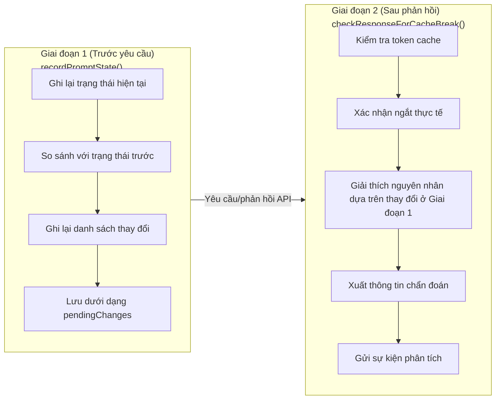

# Chương 14: Hệ thống phát hiện ngắt Cache

## Tại sao điều này lại quan trọng

Trong Chương 13, chúng ta đã thấy cách Claude Code sử dụng các cơ chế chốt giữ và các phạm vi cache được thiết kế cẩn thận để **ngăn chặn** việc ngắt cache. Nhưng ngay cả khi có những biện pháp bảo vệ này, lỗi ngắt cache vẫn xảy ra — định nghĩa công cụ có thể thay đổi do máy chủ MCP kết nối lại, prompt hệ thống có thể tăng kích thước do các tệp đính kèm mới, chuyển đổi mô hình, điều chỉnh mức độ nỗ lực (effort), và thậm chí các bản cập nhật cấu hình từ xa của GrowthBook đều có thể làm thay đổi tiền tố yêu cầu API.

Điều làm cho việc này trở nên phức tạp hơn là các lỗi ngắt cache diễn ra "lặng lẽ". Giá trị `cache_read_input_tokens` trong phản hồi API bị sụt giảm, nhưng không có thông báo lỗi nào cho biết lý do tại sao. Các nhà phát triển chỉ nhận thấy chi phí tăng lên và độ trễ tăng cao mà không biết nguyên nhân gốc rễ.

Claude Code đã xây dựng một hệ thống phát hiện ngắt cache hai giai đoạn để giải quyết vấn đề này. Toàn bộ hệ thống được triển khai trong tệp `services/api/promptCacheBreakDetection.ts` (728 dòng), và là một trong số ít các phân hệ trong Claude Code được dành riêng hoàn toàn cho **khả năng quan sát (observability)** thay vì chức năng.

---

## 14.1 Kiến trúc phát hiện hai giai đoạn

### Cơ sở thiết kế

Việc phát hiện ngắt cache đối mặt với vấn đề về mặt thời gian:

1. **Các thay đổi xảy ra trước khi yêu cầu được gửi đi**: Prompt hệ thống thay đổi, các công cụ được thêm/bớt, các tiêu đề beta bị đảo trạng thái
2. **Xác nhận ngắt cache chỉ có sau khi phản hồi trả về**: Chỉ bằng cách quan sát sự sụt giảm của `cache_read_input_tokens` bạn mới có thể xác nhận rằng cache thực sự đã bị hỏng

Chỉ riêng Giai đoạn 2 là không đủ — vào thời điểm phát hiện lượng token sụt giảm, yêu cầu đã được gửi đi và trạng thái trước đó đã bị mất, khiến ta không thể truy vết nguyên nhân. Chỉ riêng Giai đoạn 1 cũng không đủ — nhiều thay đổi phía client chưa chắc đã gây ra lỗi ngắt cache phía máy chủ (ví dụ: máy chủ có thể chưa từng lưu cache cho tiền tố đó).

Giải pháp của Claude Code chia quá trình phát hiện thành hai giai đoạn:



**Hình 14-1: Sơ đồ trình tự phát hiện hai giai đoạn**

### Các vị trí gọi hàm

Hai giai đoạn này được gọi từ tệp `services/api/claude.ts`:

**Giai đoạn 1** được gọi trong quá trình xây dựng yêu cầu API (dòng 1460–1486):

```typescript
// services/api/claude.ts:1460-1486
if (feature('PROMPT_CACHE_BREAK_DETECTION')) {
  const toolsForCacheDetection = allTools.filter(
    t => !('defer_loading' in t && t.defer_loading),
  )
  recordPromptState({
    system,
    toolSchemas: toolsForCacheDetection,
    querySource: options.querySource,
    model: options.model,
    agentId: options.agentId,
    fastMode: fastModeHeaderLatched,
    globalCacheStrategy,
    betas,
    autoModeActive: afkHeaderLatched,
    isUsingOverage: currentLimits.isUsingOverage ?? false,
    cachedMCEnabled: cacheEditingHeaderLatched,
    effortValue: effort,
    extraBodyParams: getExtraBodyParams(),
  })
}
```

Lưu ý hai quyết định thiết kế quan trọng:

1. **Loại trừ các công cụ defer_loading**: API tự động lược bỏ các công cụ tải trì hoãn (deferred tools) — chúng không ảnh hưởng đến khóa cache thực tế. Việc đưa chúng vào sẽ tạo ra các cảnh báo sai (false positive) khi các công cụ được phát hiện hoặc các máy chủ MCP kết nối lại.
2. **Truyền các giá trị đã được chốt giữ**: `fastModeHeaderLatched`, `afkHeaderLatched`, `cacheEditingHeaderLatched` là các giá trị đã được chốt giữ, chứ không phải trạng thái thời gian thực. Bởi vì khóa cache được xác định bởi các tiêu đề thực tế được gửi đi, chứ không phải cấu hình hiện tại của người dùng.

**Giai đoạn 2** được gọi sau khi quá trình xử lý phản hồi API hoàn tất, nhận các số liệu thống kê token cache từ phản hồi.

---

## 14.2 PreviousState: Ảnh chụp nhanh toàn bộ trạng thái

Cốt lõi của Giai đoạn 1 là kiểu dữ liệu `PreviousState` — nó chụp lại tất cả trạng thái phía client có thể ảnh hưởng đến khóa cache phía máy chủ.

### Danh mục các trường dữ liệu

PreviousState được định nghĩa trong `promptCacheBreakDetection.ts` (dòng 28–69), chứa hơn 15 trường dữ liệu:

| Trường | Kiểu dữ liệu | Mục đích | Nguồn gốc thay đổi |
|---|---|---|---|
| `systemHash` | `number` | Mã hash nội dung prompt hệ thống (không bao gồm cache_control) | Thay đổi nội dung prompt |
| `toolsHash` | `number` | Mã hash tổng hợp schema công cụ (không bao gồm cache_control) | Thêm/bớt công cụ hoặc thay đổi định nghĩa |
| `cacheControlHash` | `number` | Mã hash của cache_control trong các khối hệ thống | Thay đổi phạm vi (scope) hoặc TTL |
| `toolNames` | `string[]` | Danh sách tên công cụ | Thêm/bớt công cụ |
| `perToolHashes` | `Record<string, number>` | Mã hash riêng cho từng công cụ | Thay đổi schema của một công cụ đơn lẻ |
| `systemCharCount` | `number` | Tổng số ký tự prompt hệ thống | Thêm/bớt nội dung |
| `model` | `string` | Định danh mô hình hiện tại | Chuyển đổi mô hình |
| `fastMode` | `boolean` | Trạng thái Chế độ Nhanh (sau khi chốt) | Kích hoạt Chế độ Nhanh |
| `globalCacheStrategy` | `string` | Loại chiến lược cache | Phát hiện/loại bỏ công cụ MCP |
| `betas` | `string[]` | Danh sách tiêu đề beta được sắp xếp | Thay đổi tiêu đề beta |
| `autoModeActive` | `boolean` | Trạng thái Chế độ AFK (sau khi chốt) | Kích hoạt Chế độ Tự động |
| `isUsingOverage` | `boolean` | Trạng thái sử dụng vượt hạn ngạch (sau khi chốt) | Thay đổi trạng thái hạn ngạch |
| `cachedMCEnabled` | `boolean` | Trạng thái chỉnh sửa cache (sau khi chốt) | Kích hoạt Cached MC |
| `effortValue` | `string` | Giá trị nỗ lực (effort) đã giải quyết | Thay đổi cấu hình nỗ lực |
| `extraBodyHash` | `number` | Mã hash của các tham số request body bổ sung | Thay đổi cấu hình `CLAUDE_CODE_EXTRA_BODY` |
| `callCount` | `number` | Số lần gọi của khóa theo dõi hiện tại | Tự động tăng |
| `pendingChanges` | `PendingChanges \| null` | Các thay đổi được phát hiện ở Giai đoạn 1 | Kết quả so sánh của Giai đoạn 1 |
| `prevCacheReadTokens` | `number \| null` | Số token đọc từ cache từ phản hồi cuối cùng | Cập nhật ở Giai đoạn 2 |
| `cacheDeletionsPending` | `boolean` | Liệu các hoạt động xóa cache_edits có đang chờ xác nhận hay không | Các thao tác xóa của Cached MC |
| `buildDiffableContent` | `() => string` | Nội dung có thể tạo diff được tính toán lười (lazy) | Dùng cho đầu ra gỡ lỗi |

**Bảng 14-1: Danh mục đầy đủ các trường của PreviousState**

### Chiến lược băm (Hashing)

PreviousState chứa nhiều trường băm phục vụ các mức độ chi tiết phát hiện khác nhau:

```typescript
// promptCacheBreakDetection.ts:170-179
function computeHash(data: unknown): number {
  const str = jsonStringify(data)
  if (typeof Bun !== 'undefined') {
    const hash = Bun.hash(str)
    return typeof hash === 'bigint' ? Number(hash & 0xffffffffn) : hash
  }
  return djb2Hash(str)
}
```

**Sự phân tách giữa systemHash và cacheControlHash** rất đáng được chú ý đặc biệt:

```typescript
// promptCacheBreakDetection.ts:274-281
const systemHash = computeHash(strippedSystem)  // excluding cache_control
const cacheControlHash = computeHash(           // cache_control only
  system.map(b => ('cache_control' in b ? b.cache_control : null)),
)
```

`systemHash` thực hiện băm nội dung prompt hệ thống sau khi đã loại bỏ các thẻ đánh dấu `cache_control` thông qua hàm `stripCacheControl()`. `cacheControlHash` chỉ thực hiện băm các thẻ đánh dấu `cache_control`. Tại sao lại tách riêng chúng? Bởi vì việc chuyển đổi phạm vi cache (global sang org) hoặc chuyển đổi TTL (1 giờ sang 5 phút) không làm thay đổi nội dung văn bản của prompt — nếu bạn chỉ nhìn vào `systemHash`, các thay đổi này sẽ bị bỏ sót. Sau khi phân tách, trường `cacheControlChanged` có thể chụp lại loại thay đổi này một cách độc lập.

**Việc tính toán perToolHashes theo yêu cầu (on-demand)** cũng là một tối ưu hóa hiệu suất:

```typescript
// promptCacheBreakDetection.ts:285-286
const computeToolHashes = () =>
  computePerToolHashes(strippedTools, toolNames)
```

`perToolHashes` là một bảng băm cho từng công cụ, được sử dụng để xác định chính xác công cụ nào đã thay đổi khi mã hash schema công cụ tổng hợp thay đổi. Tuy nhiên, việc tính toán mã hash cho từng công cụ rất tốn kém (N lệnh gọi `jsonStringify`), do đó nó chỉ được kích hoạt khi `toolsHash` thay đổi. Đoạn bình luận (dòng 37) dẫn chứng dữ liệu BigQuery: **77% thay đổi schema công cụ là do mô tả của một công cụ duy nhất thay đổi, chứ không phải do thêm/bớt công cụ**. `perToolHashes` được thiết kế chính xác để chẩn đoán tỷ lệ 77% đó.

### Khóa theo dõi và Chiến lược cô lập

Mỗi nguồn truy vấn duy trì một `PreviousState` độc lập, được lưu trữ trong một đối tượng Map:

```typescript
// promptCacheBreakDetection.ts:101-107
const previousStateBySource = new Map<string, PreviousState>()

const MAX_TRACKED_SOURCES = 10

const TRACKED_SOURCE_PREFIXES = [
  'repl_main_thread',
  'sdk',
  'agent:custom',
  'agent:default',
  'agent:builtin',
]
```

Khóa theo dõi được tính toán bởi hàm `getTrackingKey()` (dòng 149–158):

```typescript
// promptCacheBreakDetection.ts:149-158
function getTrackingKey(
  querySource: QuerySource,
  agentId?: AgentId,
): string | null {
  if (querySource === 'compact') return 'repl_main_thread'
  for (const prefix of TRACKED_SOURCE_PREFIXES) {
    if (querySource.startsWith(prefix)) return agentId || querySource
  }
  return null
}
```

Một số quyết định thiết kế quan trọng:

1. **compact chia sẻ trạng thái theo dõi của luồng chính**: Thao tác nén (compaction) sử dụng cùng các `cacheSafeParams` và chia sẻ khóa cache, do đó nó nên chia sẻ trạng thái phát hiện
2. **Các Agent phụ được cô lập bằng agentId**: Ngăn chặn các cảnh báo sai giữa nhiều phiên bản agent chạy đồng thời của cùng một loại
3. **Các nguồn truy vấn không được theo dõi** trả về `null`: Các tác vụ như `speculation`, `session_memory`, `prompt_suggestion` và các agent ngắn hạn khác chỉ chạy từ 1 đến 3 lượt và không có giá trị cho việc so sánh trước/sau
4. **Giới hạn dung lượng Map**: `MAX_TRACKED_SOURCES = 10`, ngăn chặn việc bộ nhớ tăng lên không giới hạn từ quá nhiều agentId của các agent phụ

---

## 14.3 Đi sâu vào Giai đoạn 1: recordPromptState()

### Cuộc gọi đầu tiên: Thiết lập giá trị cơ sở

Trong cuộc gọi đầu tiên đến `recordPromptState()`, không có trạng thái trước đó để so sánh. Hàm chỉ thực hiện hai việc:

1. Kiểm tra dung lượng của Map, xóa phần tử cũ nhất nếu đạt đến giới hạn
2. Tạo ảnh chụp nhanh `PreviousState` ban đầu với `pendingChanges` được đặt thành `null`

```typescript
// promptCacheBreakDetection.ts:298-328
if (!prev) {
  while (previousStateBySource.size >= MAX_TRACKED_SOURCES) {
    const oldest = previousStateBySource.keys().next().value
    if (oldest !== undefined) previousStateBySource.delete(oldest)
  }

  previousStateBySource.set(key, {
    systemHash,
    toolsHash,
    cacheControlHash,
    toolNames,
    // ... all initial values
    callCount: 1,
    pendingChanges: null,
    prevCacheReadTokens: null,
    cacheDeletionsPending: false,
    buildDiffableContent: lazyDiffableContent,
    perToolHashes: computeToolHashes(),
  })
  return
}
```

### Các cuộc gọi tiếp theo: Phát hiện thay đổi

Trong các cuộc gọi tiếp theo, hàm sẽ so sánh từng trường dữ liệu với trạng thái trước đó:

```typescript
// promptCacheBreakDetection.ts:332-346
const systemPromptChanged = systemHash !== prev.systemHash
const toolSchemasChanged = toolsHash !== prev.toolsHash
const modelChanged = model !== prev.model
const fastModeChanged = isFastMode !== prev.fastMode
const cacheControlChanged = cacheControlHash !== prev.cacheControlHash
const globalCacheStrategyChanged =
  globalCacheStrategy !== prev.globalCacheStrategy
const betasChanged =
  sortedBetas.length !== prev.betas.length ||
  sortedBetas.some((b, i) => b !== prev.betas[i])
const autoModeChanged = autoModeActive !== prev.autoModeActive
const overageChanged = isUsingOverage !== prev.isUsingOverage
const cachedMCChanged = cachedMCEnabled !== prev.cachedMCEnabled
const effortChanged = effortStr !== prev.effortValue
const extraBodyChanged = extraBodyHash !== prev.extraBodyHash
```

Nếu bất kỳ trường nào thay đổi, hàm sẽ tạo một đối tượng `PendingChanges`:

```typescript
// promptCacheBreakDetection.ts:71-99
type PendingChanges = {
  systemPromptChanged: boolean
  toolSchemasChanged: boolean
  modelChanged: boolean
  fastModeChanged: boolean
  cacheControlChanged: boolean
  globalCacheStrategyChanged: boolean
  betasChanged: boolean
  autoModeChanged: boolean
  overageChanged: boolean
  cachedMCChanged: boolean
  effortChanged: boolean
  extraBodyChanged: boolean
  addedToolCount: number
  removedToolCount: number
  systemCharDelta: number
  addedTools: string[]
  removedTools: string[]
  changedToolSchemas: string[]
  previousModel: string
  newModel: string
  prevGlobalCacheStrategy: string
  newGlobalCacheStrategy: string
  addedBetas: string[]
  removedBetas: string[]
  prevEffortValue: string
  newEffortValue: string
  buildPrevDiffableContent: () => string
}
```

`PendingChanges` không chỉ ghi lại **liệu** có cái gì đó thay đổi hay không (các cờ boolean), mà còn cả việc nó đã thay đổi **như thế nào** (công cụ nào được thêm/bớt, danh sách tiêu đề beta được thêm/bớt, chênh lệch số lượng ký tự, v.v.). Những chi tiết này rất quan trọng để giải thích nguyên nhân ngắt cache trong Giai đoạn 2.

### Chỉ định chính xác các thay đổi công cụ

Khi `toolSchemasChanged` là true, hệ thống sẽ phân tích sâu hơn xem những công cụ cụ thể nào đã thay đổi:

```typescript
// promptCacheBreakDetection.ts:366-378
if (toolSchemasChanged) {
  const newHashes = computeToolHashes()
  for (const name of toolNames) {
    if (!prevToolSet.has(name)) continue
    if (newHashes[name] !== prev.perToolHashes[name]) {
      changedToolSchemas.push(name)
    }
  }
  prev.perToolHashes = newHashes
}
```

Đoạn mã này phân loại các thay đổi công cụ thành ba loại:
- **Công cụ được thêm**: Nằm trong danh sách mới nhưng không có trong danh sách cũ (`addedTools`)
- **Công cụ bị xóa**: Nằm trong danh sách cũ nhưng không có trong danh sách mới (`removedTools`)
- **Thay đổi schema**: Công cụ vẫn tồn tại nhưng mã hash schema của nó khác đi (`changedToolSchemas`)

Loại thứ ba là phổ biến nhất — các mô tả của AgentTool và SkillTool nhúng danh sách các agent và danh sách các lệnh động vốn thay đổi theo trạng thái phiên làm việc.

---

## 14.4 Đi sâu vào Giai đoạn 2: checkResponseForCacheBreak()

### Tiêu chí xác định ngắt Cache

Giai đoạn 2 được gọi sau khi phản hồi API trả về. Logic cốt lõi sẽ xác định xem cache có thực sự bị hỏng hay không:

```typescript
// promptCacheBreakDetection.ts:485-493
const tokenDrop = prevCacheRead - cacheReadTokens
if (
  cacheReadTokens >= prevCacheRead * 0.95 ||
  tokenDrop < MIN_CACHE_MISS_TOKENS
) {
  state.pendingChanges = null
  return
}
```

Việc xác định sử dụng một ngưỡng kép:

1. **Ngưỡng tương đối**: Số token đọc từ cache giảm nhiều hơn 5% (`< prevCacheRead * 0.95`)
2. **Ngưỡng tuyệt đối**: Mức giảm vượt quá 2.000 token (`MIN_CACHE_MISS_TOKENS = 2_000`)

Cả hai điều kiện này phải được thỏa mãn **đồng thời** để kích hoạt cảnh báo ngắt cache. Điều này giúp tránh hai loại cảnh báo sai:

- Dao động nhỏ: Sự biến động tự nhiên trong số lượng token cache (vài trăm token) không kích hoạt cảnh báo
- Khuếch đại tỷ lệ: Khi giá trị cơ sở nhỏ (ví dụ: 1.000 token), mức biến động 5% chỉ là 50 token — không đáng để cảnh báo

### Trường hợp đặc biệt: Xóa Cache

Việc chỉnh sửa cache (Cached Microcompact) có thể chủ động xóa các khối nội dung khỏi cache thông qua `cache_edits`. Điều này gây ra việc sụt giảm `cache_read_input_tokens` một cách hợp lý — đây là hành vi bình thường và không được kích hoạt cảnh báo ngắt cache:

```typescript
// promptCacheBreakDetection.ts:473-481
if (state.cacheDeletionsPending) {
  state.cacheDeletionsPending = false
  logForDebugging(
    `[PROMPT CACHE] cache deletion applied, cache read: ` +
    `${prevCacheRead} → ${cacheReadTokens} (expected drop)`,
  )
  state.pendingChanges = null
  return
}
```

Cờ `cacheDeletionsPending` được thiết lập thông qua hàm `notifyCacheDeletion()` (dòng 673–682), được gọi bởi mô-đun chỉnh sửa cache khi gửi các thao tác xóa.

### Trường hợp đặc biệt: Nén dữ liệu (Compaction)

Thao tác nén (`/compact`) làm giảm đáng kể số lượng tin nhắn, khiến các token đọc từ cache giảm xuống một cách tự nhiên. Hàm `notifyCompaction()` (dòng 689–698) xử lý việc này bằng cách đặt lại `prevCacheReadTokens` thành `null` — cuộc gọi tiếp theo sẽ được xử lý như một "cuộc gọi đầu tiên" và không thực hiện so sánh:

```typescript
// promptCacheBreakDetection.ts:689-698
export function notifyCompaction(
  querySource: QuerySource,
  agentId?: AgentId,
): void {
  const key = getTrackingKey(querySource, agentId)
  const state = key ? previousStateBySource.get(key) : undefined
  if (state) {
    state.prevCacheReadTokens = null
  }
}
```

---

## 14.5 Động cơ giải thích ngắt Cache

Một khi xác nhận có lỗi ngắt cache, hệ thống sẽ sử dụng các dữ liệu `PendingChanges` thu thập được ở Giai đoạn 1 để xây dựng các giải thích dễ hiểu cho con người. Động cơ giải thích nằm ở hàm `checkResponseForCacheBreak()` từ dòng 495–588:

### Phân bổ nguyên nhân phía Client

Nếu bất kỳ cờ thay đổi nào trong `PendingChanges` là true, hệ thống sẽ tạo văn bản giải thích tương ứng:

```typescript
// promptCacheBreakDetection.ts:496-563 (đã giản lược)
const parts: string[] = []
if (changes) {
  if (changes.modelChanged) {
    parts.push(`model changed (${changes.previousModel} → ${changes.newModel})`)
  }
  if (changes.systemPromptChanged) {
    const charInfo = charDelta > 0 ? ` (+${charDelta} chars)` : ` (${charDelta} chars)`
    parts.push(`system prompt changed${charInfo}`)
  }
  if (changes.toolSchemasChanged) {
    const toolDiff = changes.addedToolCount > 0 || changes.removedToolCount > 0
      ? ` (+${changes.addedToolCount}/-${changes.removedToolCount} tools)`
      : ' (tool prompt/schema changed, same tool set)'
    parts.push(`tools changed${toolDiff}`)
  }
  if (changes.betasChanged) {
    const added = changes.addedBetas.length ? `+${changes.addedBetas.join(',')}` : ''
    const removed = changes.removedBetas.length ? `-${changes.removedBetas.join(',')}` : ''
    parts.push(`betas changed (${[added, removed].filter(Boolean).join(' ')})`)
  }
  // ... tương tự cho các trường khác
}
```

Nguyên tắc thiết kế của động cơ giải thích là **cụ thể thay vì trừu tượng**: thay vì chỉ nói một cách đơn giản là "cache bị hỏng", nó liệt kê chính xác các trường nào đã thay đổi và thay đổi bao nhiêu.

### Logic báo cáo độc lập cho các thay đổi cacheControl

Trong động cơ giải thích, trường `cacheControlChanged` có một điều kiện báo cáo đặc biệt:

```typescript
// promptCacheBreakDetection.ts:528-535
if (
  changes.cacheControlChanged &&
  !changes.globalCacheStrategyChanged &&
  !changes.systemPromptChanged
) {
  parts.push('cache_control changed (scope or TTL)')
}
```

`cacheControlChanged` chỉ được báo cáo một cách độc lập khi cả chiến lược cache toàn cục lẫn prompt hệ thống đều không thay đổi. Lý do: nếu chiến lược cache toàn cục đã thay đổi (ví dụ: chuyển từ `tool_based` sang `system_prompt`), sự thay đổi của `cache_control` chỉ đơn thuần là một **hệ quả** của việc thay đổi chiến lược và không cần báo cáo dư thừa. Tương tự, nếu prompt hệ thống thay đổi, `cache_control` có thể đã thay đổi chỉ vì các khối nội dung mới đã cấu trúc lại các thẻ đánh dấu cache.

### Phát hiện hết hạn TTL

Khi không phát hiện bất kỳ thay đổi nào phía client (`parts.length === 0`), hệ thống sẽ kiểm tra xem liệu việc hết hạn TTL có phải là nguyên nhân làm mất hiệu lực cache hay không:

```typescript
// promptCacheBreakDetection.ts:566-588
const lastAssistantMsgOver5minAgo =
  timeSinceLastAssistantMsg !== null &&
  timeSinceLastAssistantMsg > CACHE_TTL_5MIN_MS
const lastAssistantMsgOver1hAgo =
  timeSinceLastAssistantMsg !== null &&
  timeSinceLastAssistantMsg > CACHE_TTL_1HOUR_MS

let reason: string
if (parts.length > 0) {
  reason = parts.join(', ')
} else if (lastAssistantMsgOver1hAgo) {
  reason = 'possible 1h TTL expiry (prompt unchanged)'
} else if (lastAssistantMsgOver5minAgo) {
  reason = 'possible 5min TTL expiry (prompt unchanged)'
} else if (timeSinceLastAssistantMsg !== null) {
  reason = 'likely server-side (prompt unchanged, <5min gap)'
} else {
  reason = 'unknown cause'
}
```

Việc phát hiện hết hạn TTL tính toán khoảng thời gian bằng cách tìm mốc thời gian của tin nhắn gần đây nhất của trợ lý (assistant) trong lịch sử tin nhắn. Hai hằng số TTL được định nghĩa ở đầu tệp (dòng 125–126):

```typescript
// promptCacheBreakDetection.ts:125-126
const CACHE_TTL_5MIN_MS = 5 * 60 * 1000
export const CACHE_TTL_1HOUR_MS = 60 * 60 * 1000
```

### Phân bổ nguyên nhân phía máy chủ: "90% ngắt Cache là do phía máy chủ"

Bình luận quan trọng nhất nằm ở các dòng 573–576:

```typescript
// promptCacheBreakDetection.ts:573-576
// Post PR #19823 BQ analysis:
// when all client-side flags are false and the gap is under TTL, ~90% of breaks
// are server-side routing/eviction or billed/inference disagreement. Label
// accordingly instead of implying a CC bug hunt.
```

Bình luận này tham chiếu đến kết luận phân tích dữ liệu BigQuery: **khi không phát hiện thay đổi nào phía client và khoảng thời gian nằm trong TTL, khoảng 90% lỗi ngắt cache có nguyên nhân từ phía máy chủ**. Các nguyên nhân cụ thể bao gồm:

1. **Thay đổi định tuyến phía máy chủ**: Yêu cầu được định tuyến đến một thực thể máy chủ khác không có sẵn cache
2. **Thu hồi cache phía máy chủ**: Khi tải cao, máy chủ chủ động giải phóng (evict) các mục cache có độ ưu tiên thấp
3. **Sự không nhất quán giữa thanh toán/suy luận**: Quá trình suy luận thực tế đã sử dụng cache, nhưng hệ thống tính phí lại báo cáo số lượng token khác

Phát hiện này đã thay đổi cách diễn đạt giải thích lỗi ngắt cache — từ việc ám chỉ "Claude Code có lỗi" sang gắn nhãn rõ ràng là "nhiều khả năng do phía máy chủ (likely server-side)", ngăn các nhà phát triển lãng phí thời gian tìm kiếm các lỗi không tồn tại ở phía client.

---

## 14.6 Kết quả chẩn đoán

Kết quả đầu ra cuối cùng của quá trình phát hiện ngắt cache bao gồm hai phần:

### Sự kiện phân tích

Sự kiện `tengu_prompt_cache_break` được gửi tới BigQuery để phân tích trên toàn bộ hệ thống các phiên bản hoạt động:

```typescript
// promptCacheBreakDetection.ts:590-644
logEvent('tengu_prompt_cache_break', {
  systemPromptChanged: changes?.systemPromptChanged ?? false,
  toolSchemasChanged: changes?.toolSchemasChanged ?? false,
  modelChanged: changes?.modelChanged ?? false,
  // ... all change flags
  addedTools: (changes?.addedTools ?? []).map(sanitizeToolName).join(','),
  removedTools: (changes?.removedTools ?? []).map(sanitizeToolName).join(','),
  changedToolSchemas: (changes?.changedToolSchemas ?? []).map(sanitizeToolName).join(','),
  addedBetas: (changes?.addedBetas ?? []).join(','),
  removedBetas: (changes?.removedBetas ?? []).join(','),
  callNumber: state.callCount,
  prevCacheReadTokens: prevCacheRead,
  cacheReadTokens,
  cacheCreationTokens,
  timeSinceLastAssistantMsg: timeSinceLastAssistantMsg ?? -1,
  lastAssistantMsgOver5minAgo,
  lastAssistantMsgOver1hAgo,
  requestId: requestId ?? '',
})
```

Sự kiện phân tích ghi lại tập hợp đầy đủ các cờ thay đổi, thống kê token, khoảng thời gian và ID yêu cầu, cho phép phân tích BigQuery sau đó cắt lớp dữ liệu theo nhiều chiều khác nhau (theo loại thay đổi, theo khung thời gian, theo nguồn truy vấn, v.v.).

### Tệp Diff gỡ lỗi và Nhật ký

Khi phát hiện các thay đổi phía client, hệ thống sẽ tạo một tệp diff hiển thị các khác biệt từng dòng giữa trạng thái trước và sau:

```typescript
// promptCacheBreakDetection.ts:648-660
let diffPath: string | undefined
if (changes?.buildPrevDiffableContent) {
  diffPath = await writeCacheBreakDiff(
    changes.buildPrevDiffableContent(),
    state.buildDiffableContent(),
  )
}

const summary = `[PROMPT CACHE BREAK] ${reason} ` +
  `[source=${querySource}, call #${state.callCount}, ` +
  `cache read: ${prevCacheRead} → ${cacheReadTokens}, ` +
  `creation: ${cacheCreationTokens}${diffSuffix}]`

logForDebugging(summary, { level: 'warn' })
```

Tệp diff được tạo bởi hàm `writeCacheBreakDiff()` (dòng 708–727), sử dụng thư viện `createPatch` để tạo định dạng diff thống nhất tiêu chuẩn, lưu trong thư mục tạm thời. Tên tệp bao gồm một hậu tố ngẫu nhiên để tránh trùng lặp.

### Chuẩn hóa tên công cụ (Sanitization)

Hệ thống phát hiện ngắt cache cần báo cáo tên các công cụ đã thay đổi trong các sự kiện phân tích. Tuy nhiên, tên các công cụ MCP được cấu hình bởi người dùng nên có thể chứa các đường dẫn tệp hoặc thông tin nhạy cảm khác. Hàm `sanitizeToolName()` (dòng 183–185) giải quyết vấn đề này:

```typescript
// promptCacheBreakDetection.ts:183-185
function sanitizeToolName(name: string): string {
  return name.startsWith('mcp__') ? 'mcp' : name
}
```

Tất cả các tên công cụ bắt đầu bằng `mcp__` đều được thay thế đồng nhất bằng `'mcp'`, trong khi tên các công cụ tích hợp sẵn là một từ vựng cố định nên có thể được đưa vào phân tích một cách an toàn.

---

## 14.7 Luồng phát hiện đầy đủ

Kết hợp cả hai giai đoạn, luồng phát hiện ngắt cache hoàn chỉnh như sau:

```
Người dùng nhập truy vấn mới
     │
     ▼
┌──────────────────────────────────┐
│ Xây dựng yêu cầu API             │
│ (prompt hệ thống + công cụ + ms) │
└────────────────┬─────────────────┘
                 │
                 ▼
┌──────────────────────────────────┐
│ recordPromptState()  [Giai đoạn 1]│
│                                  │
│ ① Tính toán mọi mã hash          │
│ ② Tìm kiếm previousState         │
│ ③ Chưa có prev → tạo ảnh chụp   │
│     ban đầu                      │
│ ④ Đã có prev → so sánh từng      │
│     trường                       │
│ ⑤ Phát hiện thay đổi → tạo       │
│     PendingChanges               │
│ ⑥ Cập nhật previousState         │
└────────────────┬─────────────────┘
                 │
                 ▼
         [Gửi yêu cầu API]
                 │
                 ▼
        [Nhận phản hồi API]
                 │
                 ▼
┌──────────────────────────────────┐
│ checkResponseForCacheBreak()     │
│ [Giai đoạn 2]                    │
│                                  │
│ ① Lấy previousState              │
│ ② Loại trừ mô hình haiku         │
│ ③ Kiểm tra cacheDeletionsPending │
│ ④ Tính lượng token sụt giảm      │
│ ⑤ Áp dụng ngưỡng kép             │
│    (> 5% VÀ > 2.000 token)       │
│ ⑥ Không ngắt → xóa các thay đổi  │
│    chờ, trả về                   │
│ ⑦ Xác nhận ngắt → tạo            │
│    giải thích                    │
│    - Thay đổi client → liệt kê   │
│    - Không thay đổi + quá TTL →  │
│      hết hạn TTL                 │
│    - Không thay đổi + trong TTL →│
│      phía máy chủ                │
│ ⑧ Gửi sự kiện phân tích          │
│ ⑨ Ghi tệp diff                   │
│ ⑩ Xuất nhật ký gỡ lỗi            │
└──────────────────────────────────┘
```

**Hình 14-2: Luồng phát hiện ngắt Cache đầy đủ**

---

## 14.8 Các mô hình được loại trừ và Cơ chế dọn dẹp

### Các mô hình được loại trừ

Không phải mọi mô hình đều phù hợp để chạy tính năng phát hiện ngắt cache:

```typescript
// promptCacheBreakDetection.ts:129-131
function isExcludedModel(model: string): boolean {
  return model.includes('haiku')
}
```

Mô hình Haiku bị loại khỏi diện phát hiện vì hành vi lưu cache khác biệt của nó. Điều này giúp tránh các cảnh báo sai gây ra do sự khác biệt giữa các mô hình.

### Các cơ chế dọn dẹp

Hệ thống cung cấp ba hàm dọn dẹp cho các tình huống khác nhau:

```typescript
// promptCacheBreakDetection.ts:700-706
// Clean up tracking state when an agent ends
// Dọn dẹp trạng thái theo dõi khi một agent kết thúc
export function cleanupAgentTracking(agentId: AgentId): void {
  previousStateBySource.delete(agentId)
}

// Reset toàn bộ (lệnh /clear)
export function resetPromptCacheBreakDetection(): void {
  previousStateBySource.clear()
}
```

`cleanupAgentTracking` được gọi khi một agent phụ kết thúc, giải phóng bộ nhớ được chiếm dụng bởi `PreviousState` của nó. `resetPromptCacheBreakDetection` được gọi khi người dùng thực hiện lệnh `/clear`, xóa sạch mọi trạng thái theo dõi.

---

## 14.9 Chi tiết chuyên sâu về thiết kế (Design Insights)

### Hai giai đoạn là kiến trúc đúng đắn duy nhất

Kiến trúc phát hiện ngắt cache gồm hai giai đoạn không phải là một sự lựa chọn thiết kế tự do — đó là giải pháp đúng đắn duy nhất được định đoạt bởi các ràng buộc về mặt thời gian của bài toán. Lý do là: trạng thái gốc ban đầu chỉ tồn tại trước khi yêu cầu được gửi đi, trong khi việc xác nhận ngắt cache chỉ có thể diễn ra sau khi phản hồi trả về. Mọi nỗ lực thực hiện cả hai việc này trong một giai đoạn duy nhất đều sẽ làm mất thông tin quan trọng.

### Phát hiện "90% do phía máy chủ" đã thay đổi các quyết định kỹ thuật

Sau khi phát hiện ra phần lớn lỗi ngắt cache xuất phát từ phía máy chủ, đội ngũ phát triển Claude Code đã chuyển trọng tâm tối ưu hóa từ "loại bỏ tất cả thay đổi phía client" sang "đảm bảo các thay đổi phía client có thể kiểm soát được". Điều này giải thích tại sao các cơ chế chốt giữ trong Chương 13 lại quan trọng đến thế — chúng không cần loại bỏ 100% các lỗi ngắt cache, mà chỉ cần đảm bảo 10% lỗi do phía client kiểm soát được không còn gây ra sự cố.

### Khăng năng quan sát trước khi tối ưu hóa

Toàn bộ hệ thống phát hiện ngắt cache không thực hiện bất kỳ tối ưu hóa cache nào — nó thuần túy là cơ sở hạ tầng phục vụ khả năng quan sát (observability). Nhưng chính khả năng quan sát này làm cho các mẫu tối ưu hóa trong Chương 15 trở nên khả thi: nếu không có tính năng phát hiện ngắt cache chính xác, bạn không thể định lượng hiệu quả của việc tối ưu hóa, cũng như không thể phát hiện các cơ hội tối ưu hóa mới. Dữ liệu sự kiện `tengu_prompt_cache_break` trong BigQuery đã trực tiếp dẫn đường cho việc khám phá và xác thực nhiều mẫu tối ưu hóa khác nhau.

---

## Người dùng có thể làm gì

Dựa trên cơ chế phát hiện ngắt cache được phân tích trong chương này, dưới đây là các hướng dẫn thực tế để giám sát và chẩn đoán lỗi ngắt cache:

1. **Thiết lập giá trị cơ sở cache cho ứng dụng của bạn**: Ghi lại giá trị điển hình của `cache_read_input_tokens` trong các phiên hoạt động bình thường. Nếu không có giá trị cơ sở, bạn không thể xác định xem sự sụt giảm có phải là bất thường hy vọng hay không. Claude Code sử dụng một ngưỡng kép (giảm >5% VÀ giảm >2.000 token) để lọc nhiễu — bạn cũng nên thiết lập các ngưỡng hợp lý cho kịch bản của riêng mình.

2. **Phân biệt thay đổi phía client và nguyên nhân phía máy chủ**: Khi quan sát thấy tỷ lệ trúng cache sụt giảm, trước tiên hãy kiểm tra xem phía client có thay đổi gì không (prompt hệ thống, định nghĩa công cụ, tiêu đề beta, v.v.). Nếu client không thay đổi và khoảng thời gian nằm trong TTL, thì nhiều khả năng đó là do định tuyến hoặc thu hồi cache từ phía máy chủ — đừng lãng phí thời gian tìm kiếm các lỗi không tồn tại ở phía client.

3. **Xây dựng cơ chế chụp ảnh trạng thái cho các yêu cầu của bạn**: Nếu bạn cần chẩn đoán lỗi ngắt cache, hãy ghi lại các trạng thái quan trọng trước mỗi yêu cầu (mã hash prompt hệ thống, mã hash schema công cụ, danh sách tiêu đề yêu cầu). Chỉ bằng cách chụp lại trạng thái trước khi gửi yêu cầu, bạn mới có thể truy vết nguyên nhân thay đổi sau khi nhận phản hồi.

4. **Lưu ý rằng hết hạn TTL là nguyên nhân hợp lệ phổ biến**: Nếu có khoảng nghỉ dài giữa các yêu cầu của người dùng (trên 5 phút hoặc 1 giờ, tùy thuộc vào phân cấp TTL của bạn), việc cache hết hạn một cách tự nhiên là bình thường và không cần xử lý đặc biệt.

5. **Thực hiện phân bổ nguyên nhân chi tiết cho các thay đổi công cụ**: Nếu ứng dụng của bạn sử dụng các bộ công cụ động (MCP, v.v.), khi phát hiện thay đổi schema công cụ, hãy phân biệt rõ hơn giữa thêm/bớt công cụ và thay đổi schema của một công cụ duy nhất. Trường hợp sau phổ biến hơn (dữ liệu của Claude Code cho thấy 77% thay đổi công cụ thuộc nhóm này) và dễ giải quyết hơn bằng cách lưu cache ở cấp độ phiên.

### Lời khuyên cho người dùng Claude Code

1. **Hiểu các tín hiệu quan sát lỗi ngắt cache.** Sự kiện `tengu_prompt_cache_break` ghi lại mọi lỗi ngắt cache — nếu bạn đang tự xây dựng agent của riêng mình, việc triển khai một cơ chế phát hiện ngắt cache tương tự có thể giúp bạn nhanh chóng xác định nguyên nhân mất hiệu lực cache.

2. **Không đưa mốc thời gian (timestamp) vào prompt hệ thống.** CC ghi nhớ (memoize) chuỗi ngày tháng (chỉ thay đổi một lần mỗi ngày) chính là để tránh làm mất hiệu lực của tiền tố cache do thay đổi ngày. Agent của bạn cũng nên tránh đặt nội dung thay đổi thường xuyên vào các khu vực được lưu cache.

3. **Đặt nội dung động bên ngoài các phân đoạn được lưu cache.** CC sử dụng `SYSTEM_PROMPT_DYNAMIC_BOUNDARY` để tách biệt nội dung ổn định khỏi nội dung động — phần ổn định có thể cache được, phần động sẽ được tính toán lại mỗi lần. Khi thiết kế prompt hệ thống, hãy đưa các "quy tắc nền tảng (constitutional rules)" lên trước và đặt "trạng thái thời gian chạy (runtime state)" ở sau cùng.

---

## Tóm tắt

Chương này đã phân tích sâu sắc hệ thống phát hiện ngắt cache của Claude Code:

1. **Kiến trúc hai giai đoạn**: `recordPromptState()` chụp lại trạng thái và phát hiện thay đổi trước khi gửi yêu cầu; `checkResponseForCacheBreak()` xác nhận ngắt cache và tạo chẩn đoán sau khi nhận phản hồi
2. **PreviousState với hơn 15 trường**: Bao quát toàn bộ trạng thái phía client có thể ảnh hưởng đến khóa cache phía máy chủ
3. **Động cơ giải thích lỗi ngắt**: Phân biệt giữa thay đổi phía client, hết hạn TTL và nguyên nhân từ phía máy chủ, cung cấp sự phân bổ nguyên nhân chính xác
4. **Thông tin định hướng bởi dữ liệu**: Phát hiện "90% lỗi ngắt cache thuộc về phía máy chủ" đã thay đổi toàn bộ chiến lược tối ưu hóa cache

Chương tiếp theo sẽ chuyển hướng sang tối ưu hóa chủ động — cách Claude Code giảm thiểu các lỗi ngắt cache ngay tại nguồn thông qua hơn 7 mẫu thiết kế tối ưu hóa cache.
