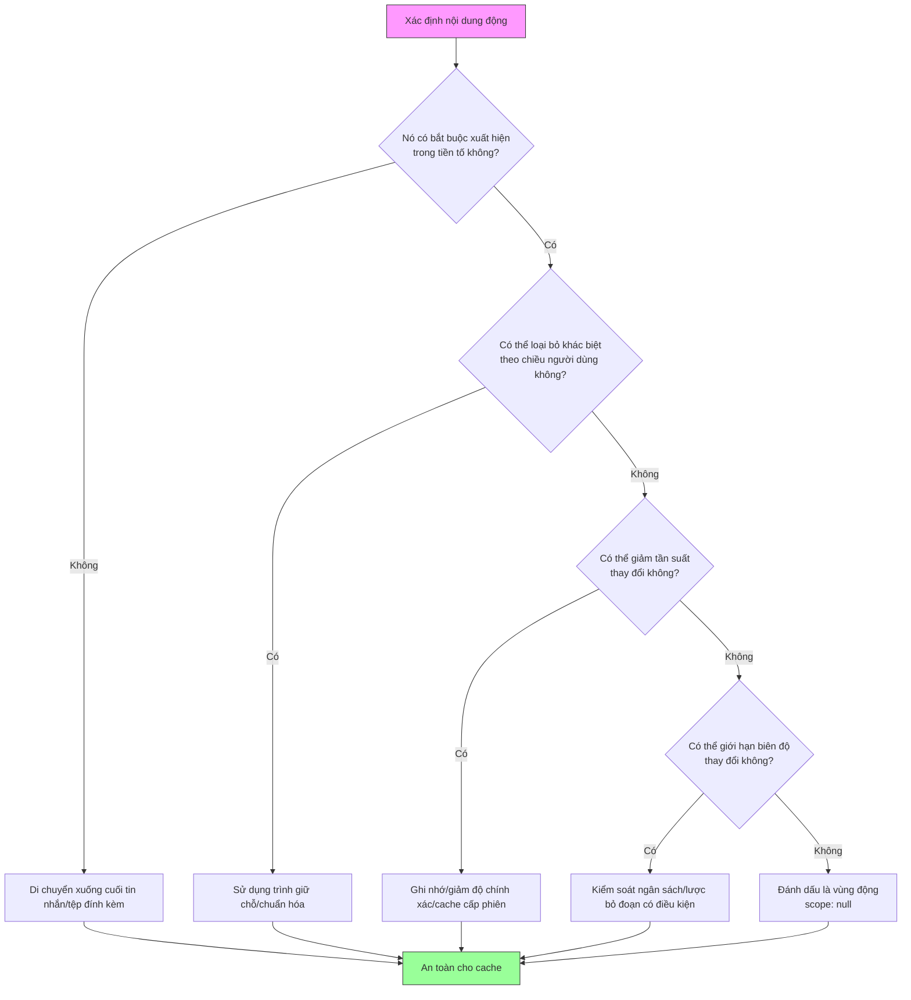

# Chương 15: Các mẫu tối ưu hóa Cache

## Tại sao điều này lại quan trọng

Chương 13 đã phân tích lớp phòng thủ của kiến trúc cache, và Chương 14 đã xây dựng khả năng phát hiện lỗi ngắt cache. Chương này chuyển hướng sang **tấn công** — cách Claude Code loại bỏ hoặc giảm thiểu các lỗi ngắt cache ngay tại nguồn thông qua một loạt các mẫu tối ưu hóa có tên gọi cụ thể.

Các mẫu tối ưu hóa này không được thiết kế cùng một lúc. Mỗi mẫu đều bắt nguồn từ dữ liệu thực tế do hệ thống phát hiện ngắt cache giới thiệu ở Chương 14 thu thập thông qua BigQuery. Khi các sự kiện `tengu_prompt_cache_break` cho thấy một nguyên nhân ngắt cache cụ thể lặp đi lặp lại nhiều lần, đội ngũ kỹ sư đã thiết kế một mẫu tối ưu hóa mục tiêu để loại bỏ nó.

Chương này giới thiệu hơn 7 mẫu tối ưu hóa cache cụ thể, từ việc ghi nhớ ngày đơn giản đến việc lưu cache schema công cụ phức tạp. Mỗi mẫu đều tuân theo cùng một khuôn khổ: **xác định nguồn thay đổi, hiểu bản chất của sự thay đổi, chuyển động thành tĩnh**.

---

## Tóm tắt các mẫu thiết kế

Trước khi đi sâu vào từng mẫu, dưới đây là cái nhìn tổng quan:

| STT | Tên mẫu tối ưu hóa | Nguồn thay đổi | Chiến lược tối ưu hóa | Tệp chính | Phạm vi ảnh hưởng |
|---|---|---|---|---|---|
| 1 | Ghi nhớ Ngày (Date Memoization) | Thay đổi ngày lúc nửa đêm | `memoize(getLocalISODate)` | `constants/common.ts` | Prompt hệ thống |
| 2 | Độ chi tiết theo Tháng (Monthly Granularity) | Thay đổi ngày hàng ngày | Sử dụng định dạng "Tháng YYYY" thay vì ngày đầy đủ | `constants/common.ts` | Prompt công cụ |
| 3 | Danh sách Agent làm Đính kèm (Agent List as Attachment) | Danh sách agent thay đổi động | Chuyển từ mô tả công cụ sang tệp đính kèm tin nhắn | `tools/AgentTool/prompt.ts` | Schema công cụ (10.2% tạo cache) |
| 4 | Ngân sách Danh sách Skill (Skill List Budget) | Số lượng skill tăng lên | Giới hạn ở mức 1% cửa sổ ngữ cảnh | `tools/SkillTool/prompt.ts` | Schema công cụ |
| 5 | Trình giữ chỗ $TMPDIR ($TMPDIR Placeholder) | UID người dùng nhúng trong đường dẫn | Thay thế bằng `$TMPDIR` | `tools/BashTool/prompt.ts` | Prompt công cụ / cache toàn cục |
| 6 | Lược bỏ Đoạn văn có Điều kiện (Conditional Paragraph Omission) | Các cờ tính năng thay đổi prompt | Lược bỏ có điều kiện thay vì thêm vào | Nhiều prompt hệ thống khác nhau | Tiền tố prompt hệ thống |
| 7 | Cache Schema Công cụ (Tool Schema Cache) | Thay đổi trạng thái GrowthBook / nội dung động | Cache dạng Map ở cấp độ phiên | `utils/toolSchemaCache.ts` | Toàn bộ schema công cụ |

**Bảng 15-1: Tóm tắt hơn 7 mẫu tối ưu hóa Cache**

---

## 15.1 Mẫu thứ nhất: Ghi nhớ Ngày (Date Memoization) — getSessionStartDate()

### Vấn đề

Prompt hệ thống của Claude Code chứa ngày hiện tại (`currentDate`) để giúp mô hình hiểu được ngữ cảnh thời gian. Ngày được lấy thông qua hàm `getLocalISODate()`:

```typescript
// constants/common.ts:4-15
export function getLocalISODate(): string {
  if (process.env.CLAUDE_CODE_OVERRIDE_DATE) {
    return process.env.CLAUDE_CODE_OVERRIDE_DATE
  }

  const now = new Date()
  const year = now.getFullYear()
  const month = String(now.getMonth() + 1).padStart(2, '0')
  const day = String(now.getDate()).padStart(2, '0')
  return `${year}-${month}-${day}`
}
```

Vấn đề nằm ở **thời điểm giao thừa nửa đêm (midnight crossover)**: nếu người dùng gửi yêu cầu lúc 23:59, prompt hệ thống chứa `2026-04-01`; khi người dùng gửi yêu cầu tiếp theo lúc 00:01, ngày sẽ chuyển thành `2026-04-02`. Sự thay đổi chỉ một ký tự này là đủ để làm hỏng toàn bộ cache tiền tố prompt hệ thống — khiến khoảng 11.000 token phải được tính toán lại.

### Giải pháp

```typescript
// constants/common.ts:24
export const getSessionStartDate = memoize(getLocalISODate)
```

`getSessionStartDate` bọc hàm `getLocalISODate` bằng phương thức `memoize` của lodash — hàm này ghi lại ngày ở lần gọi đầu tiên và luôn trả về cùng một giá trị đó mãi về sau, bất kể ngày thực tế có thay đổi hay không.

Các dòng bình luận mã nguồn (dòng 17–23) giải thích chi tiết về sự đánh đổi này:

```typescript
// constants/common.ts:17-23
// Memoized for prompt-cache stability — captures the date once at session start.
// The main interactive path gets this behavior via memoize(getUserContext) in
// context.ts; simple mode (--bare) calls getSystemPrompt per-request and needs
// an explicit memoized date to avoid busting the cached prefix at midnight.
// When midnight rolls over, getDateChangeAttachments appends the new date at
// the tail (though simple mode disables attachments, so the trade-off there is:
// stale date after midnight vs. ~entire-conversation cache bust — stale wins).
```

### Sự đánh đổi trong thiết kế

Sự đánh đổi ở đây là rõ ràng: **ngày cũ bị trễ (stale date) so với việc hỏng toàn bộ cache**. Việc lựa chọn chấp nhận ngày cũ được biện minh bởi vì:

1. Thông tin ngày tháng không phải là tối quan trọng đối với hầu hết các tác vụ lập trình
2. Khi qua nửa đêm, hàm `getDateChangeAttachments` sẽ nối ngày mới vào đuôi tin nhắn — việc này không làm ảnh hưởng đến cache tiền tố
3. Chế độ đơn giản (`--bare`) tắt cơ chế tệp đính kèm, vì vậy việc ghi nhớ phải được thực hiện ngay tại nguồn

### Tác động

Tối ưu hóa chỉ bằng một dòng này giúp loại bỏ một lần hỏng cache toàn bộ tiền tố mỗi ngày. Đối với những người làm việc xuyên đêm, việc này giúp tiết kiệm khoảng 11.000 token chi phí tạo cache.

---

## 15.2 Mẫu thứ hai: Độ chi tiết theo Tháng (Monthly Granularity) — getLocalMonthYear()

### Vấn đề

Việc ghi nhớ ngày giải quyết được vấn đề nửa đêm trong prompt hệ thống, nhưng các prompt công cụ cũng cần thông tin thời gian. Nếu prompt công cụ sử dụng định dạng ngày đầy đủ (`YYYY-MM-DD`), mỗi đêm trôi qua sẽ làm mất hiệu lực cache schema của các công cụ chứa ngày đó. Các schema công cụ nằm gần đầu yêu cầu API, vì vậy thay đổi ở chúng có sức tàn phá lớn hơn so với thay đổi ở prompt hệ thống.

### Giải pháp

```typescript
// constants/common.ts:28-33
export function getLocalMonthYear(): string {
  const date = process.env.CLAUDE_CODE_OVERRIDE_DATE
    ? new Date(process.env.CLAUDE_CODE_OVERRIDE_DATE)
    : new Date()
  return date.toLocaleString('en-US', { month: 'long', year: 'numeric' })
}
```

`getLocalMonthYear()` trả về định dạng "Tháng YYYY" (ví dụ: "April 2026") thay vì ngày đầy đủ. **Tần suất thay đổi giảm từ hàng ngày xuống hàng tháng.**

Đoạn bình luận (dòng 27) giải thích ý đồ thiết kế:

```
// Returns "Month YYYY" (e.g. "February 2026") in the user's local timezone.
// Changes monthly, not daily — used in tool prompts to minimize cache busting.
```

### Sự phân chia hai độ chính xác thời gian

| Ngữ cảnh sử dụng | Hàm | Độ chính xác | Tần suất thay đổi | Vị trí |
|---|---|---|---|---|
| Prompt hệ thống | `getSessionStartDate()` | Ngày | Một lần mỗi phiên | Prompt hệ thống |
| Prompt công cụ | `getLocalMonthYear()` | Tháng | Một lần mỗi tháng | Schema công cụ |

Sự phân chia này phản ánh một nguyên tắc cơ bản: **nội dung càng nằm gần đầu yêu cầu API, tần suất thay đổi của nó càng cần phải thấp**.

---

## 15.3 Mẫu thứ ba: Di chuyển Danh sách Agent từ Mô tả Công cụ sang Đính kèm Tin nhắn

### Vấn đề

Mô tả công cụ AgentTool từng nhúng trực tiếp một danh sách các agent khả dụng — bao gồm tên, loại và mô tả của từng agent. Danh sách này có tính động: các kết nối bất đồng bộ của máy chủ MCP mang lại các agent mới, lệnh `/reload-plugins` làm mới danh sách plugin và việc thay đổi chế độ cấp quyền cũng thay đổi tập hợp agent khả dụng.

Mỗi khi danh sách thay đổi, schema của AgentTool thay đổi, làm mất hiệu lực cache của toàn bộ mảng schema công cụ. Các schema công cụ nằm sau prompt hệ thống trong yêu cầu API — thay đổi ở chúng không chỉ làm mất hiệu lực cache của chính chúng mà còn của tất cả các cache tin nhắn tiếp sau.

Bình luận trong mã nguồn (`tools/AgentTool/prompt.ts`, dòng 50–57) định lượng mức độ nghiêm trọng của vấn đề này:

```typescript
// tools/AgentTool/prompt.ts:50-57
// The dynamic agent list was ~10.2% of fleet cache_creation tokens: MCP async
// connect, /reload-plugins, or permission-mode changes mutate the list →
// description changes → full tool-schema cache bust.
```

**10.2% trong tổng số token tạo cache (cache_creation) trên toàn hệ thống xuất phát từ vấn đề này.**

### Giải pháp

```typescript
// tools/AgentTool/prompt.ts:59-64
export function shouldInjectAgentListInMessages(): boolean {
  if (isEnvTruthy(process.env.CLAUDE_CODE_AGENT_LIST_IN_MESSAGES)) return true
  if (isEnvDefinedFalsy(process.env.CLAUDE_CODE_AGENT_LIST_IN_MESSAGES))
    return false
  return getFeatureValue_CACHED_MAY_BE_STALE('tengu_agent_list_attach', false)
}
```

Giải pháp là di chuyển danh sách agent động ra ngoài mô tả công cụ của AgentTool và thay vào đó nhúng nó thông qua các tệp đính kèm tin nhắn. Mô tả công cụ trở thành văn bản tĩnh, chỉ mô tả các khả năng chung của AgentTool; danh sách các agent khả dụng được đính kèm dưới dạng `agent_listing_delta` vào tin nhắn của người dùng.

Điểm mấu chốt của sự chuyển dịch này là: **các tệp đính kèm được nối vào cuối tin nhắn và không ảnh hưởng đến cache tiền tố**. Các thay đổi trong danh sách agent chỉ làm tăng thêm chi phí token cho các tin nhắn mới, mà không làm mất hiệu lực của schema công cụ đã lưu cache.

### Tác động

Loại bỏ được 10.2% lượng token tạo cache — đây là cải tiến lớn nhất trong số tất cả các mẫu tối ưu hóa. Việc này được kiểm soát thông qua cờ tính năng GrowthBook `tengu_agent_list_attach` để triển khai dần dần, trong khi biến môi trường `CLAUDE_CODE_AGENT_LIST_IN_MESSAGES` được giữ lại để ghi đè thủ công.

---

## 15.4 Mẫu thứ tư: Ngân sách Danh sách Skill (1% Cửa sổ Ngữ cảnh)

### Vấn đề

SkillTool, tương tự như AgentTool, nhúng một danh sách các skill khả dụng vào mô tả công cụ của nó. Khi hệ sinh thái skill phát triển (skill tích hợp + skill của dự án + skill từ plugin), danh sách này có thể trở nên rất dài. Quan trọng hơn, việc tải skill diễn ra động — các dự án khác nhau có cấu hình `.claude/` khác nhau, và plugin có thể được tải hoặc hủy tải giữa phiên làm việc.

### Giải pháp

```typescript
// tools/SkillTool/prompt.ts:20-23
// Skill listing gets 1% of the context window (in characters)
export const SKILL_BUDGET_CONTEXT_PERCENT = 0.01
export const CHARS_PER_TOKEN = 4
export const DEFAULT_CHAR_BUDGET = 8_000 // Fallback: 1% of 200k × 4
```

SkillTool áp dụng một giới hạn ngân sách nghiêm ngặt cho danh sách skill: **danh sách skill nhận tối đa 1% dung lượng cửa sổ ngữ cảnh**. Đối với cửa sổ ngữ cảnh 200K token, mức này tương đương khoảng 8.000 ký tự.

Hàm tính toán ngân sách (dòng 31–41):

```typescript
// tools/SkillTool/prompt.ts:31-41
export function getCharBudget(contextWindowTokens?: number): number {
  if (Number(process.env.SLASH_COMMAND_TOOL_CHAR_BUDGET)) {
    return Number(process.env.SLASH_COMMAND_TOOL_CHAR_BUDGET)
  }
  if (contextWindowTokens) {
    return Math.floor(
      contextWindowTokens * CHARS_PER_TOKEN * SKILL_BUDGET_CONTEXT_PERCENT,
    )
  }
  return DEFAULT_CHAR_BUDGET
}
```

Ngoài ra, mô tả của mỗi mục skill sẽ bị cắt ngắn bớt:

```typescript
// tools/SkillTool/prompt.ts:29
export const MAX_LISTING_DESC_CHARS = 250
```

Bình luận (dòng 25–28) giải thích logic thiết kế:

```
// Per-entry hard cap. The listing is for discovery only — the Skill tool loads
// full content on invoke, so verbose whenToUse strings waste turn-1 cache_creation
// tokens without improving match rate.
```

### Bản chất của việc tối ưu hóa Cache

Việc kiểm soát ngân sách 1% giúp tối ưu hóa cache theo hai cách:

1. **Giới hạn kích thước mô tả công cụ**: Mô tả ngắn hơn nghĩa là có ít byte cần so khớp chính xác hơn
2. **Cắt tỉa theo ngân sách giúp giảm biến động**: Khi các skill mới được tải nhưng ngân sách đã đầy, chúng sẽ không được đưa vào danh sách — danh sách không đổi, cache không bị ngắt

Đây là mẫu thiết kế "ngân sách tương đương sự ổn định": bằng cách giới hạn kích thước tối đa của nội dung động, nó gián tiếp kiểm soát mức độ thay đổi của khóa cache.

---

## 15.5 Mẫu thứ năm: Trình giữ chỗ $TMPDIR ($TMPDIR Placeholder)

### Vấn đề

Prompt của BashTool cần cho mô hình biết đường dẫn thư mục tạm thời nào mà nó có thể ghi vào. Claude Code sử dụng hàm `getClaudeTempDir()` để lấy đường dẫn này, thông thường có dạng `/private/tmp/claude-{UID}/`, với `{UID}` là UID hệ thống của người dùng.

Vấn đề là: các người dùng khác nhau có UID khác nhau, do đó chuỗi đường dẫn sẽ khác nhau. Nếu đường dẫn này được nhúng trực tiếp vào prompt công cụ, nó sẽ ngăn cản **việc trúng cache toàn cục xuyên người dùng (cross-user global cache hit)**. Đường dẫn `/private/tmp/claude-1001/` của Người dùng A và `/private/tmp/claude-1002/` của Người dùng B là các chuỗi byte khác nhau nên không thể chia sẻ với nhau ngay cả trong phạm vi cache toàn cục.

### Giải pháp

```typescript
// tools/BashTool/prompt.ts:186-190
// Replace the per-UID temp dir literal (e.g. /private/tmp/claude-1001/) with
// "$TMPDIR" so the prompt is identical across users — avoids busting the
// cross-user global prompt cache. The sandbox already sets $TMPDIR at runtime.
const claudeTempDir = getClaudeTempDir()
const normalizeAllowOnly = (paths: string[]): string[] =>
  [...new Set(paths)].map(p => (p === claudeTempDir ? '$TMPDIR' : p))
```

Giải pháp rất thanh lịch và súc tích: thay thế đường dẫn thư mục tạm thời đặc thù của người dùng bằng trình giữ chỗ `$TMPDIR`. Vì môi trường hộp cát (sandbox) của Claude Code đã thiết lập biến `$TMPDIR` trỏ đến thư mục chính xác, việc mô hình sử dụng `$TMPDIR` để tham chiếu thư mục tạm thời hoạt động hoàn toàn giống như khi sử dụng đường dẫn tuyệt đối.

Prompt cũng hướng dẫn mô hình sử dụng `$TMPDIR` một cách rõ ràng:

```typescript
// tools/BashTool/prompt.ts:258-260
'For temporary files, always use the `$TMPDIR` environment variable. ' +
'TMPDIR is automatically set to the correct sandbox-writable directory ' +
'in sandbox mode. Do NOT use `/tmp` directly - use `$TMPDIR` instead.',
```

### Tác động

Tối ưu hóa này làm cho prompt của BashTool **giống nhau từng byte** đối với tất cả người dùng, cho phép chia sẻ tiền tố trong phạm vi cache toàn cục. Đối với BashTool — công cụ được sử dụng thường xuyên nhất — việc trúng cache toàn cục trên schema của nó mang lại khoản tiết kiệm chi phí rất đáng kể.

---

## 15.6 Mẫu thứ sáu: Lược bỏ Đoạn văn có Điều kiện (Conditional Paragraph Omission)

### Vấn đề

Prompt hệ thống chứa các đoạn văn chỉ xuất hiện trong những điều kiện nhất định: một cờ tính năng được bật sẽ thêm một đoạn giải thích, một khả năng khả dụng sẽ chèn thêm một đoạn hướng dẫn. Khi các điều kiện này thay đổi giữa phiên làm việc (ví dụ: cập nhật cấu hình từ xa của GrowthBook), sự xuất hiện/biến mất của các đoạn văn này làm thay đổi nội dung prompt hệ thống, gây ra lỗi ngắt cache.

### Giải pháp

Nguyên tắc cốt lõi của mẫu lược bỏ đoạn văn có điều kiện là: **thà không nói còn hơn là nói rồi lại xóa đi**. Các hướng tiếp cận triển khai cụ thể bao gồm:

1. **Thay thế các đoạn văn có điều kiện bằng văn bản tĩnh**: Nếu một lời giải thích có tác động tối thiểu đến hành vi của mô hình, hãy cứ đưa nó vào (or luôn loại bỏ nó), tránh các logic điều kiện
2. **Di chuyển nội dung có điều kiện ra sau ranh giới động**: Nếu việc đưa vào có điều kiện là bắt buộc, hãy đặt nó sau `SYSTEM_PROMPT_DYNAMIC_BOUNDARY`, nơi không tham gia vào lưu cache toàn cục (xem Chương 13)
3. **Sử dụng cơ chế đính kèm thay vì các điều kiện nội dòng (inline)**: Tương tự như danh sách agent trong Mẫu thứ ba, hãy đính kèm nội dung có điều kiện vào cuối tin nhắn

Mẫu này không có một vị trí triển khai duy nhất — đó là một nguyên tắc thiết kế thấm nhuần trong quá trình xây dựng prompt hệ thống và prompt công cụ. Bản chất của nó là đảm bảo rằng các khối prompt hệ thống trong tiền tố yêu cầu API duy trì **tính ổn định đơn điệu (monotonic stability)** trong suốt vòng đời của phiên làm việc: nội dung luôn tồn tại hoặc không bao giờ tồn tại, không bao giờ xuất hiện hoặc biến mất do các thay đổi điều kiện bên ngoài.

---

## 15.7 Mẫu thứ bảy: Cache Schema Công cụ (Tool Schema Cache) — getToolSchemaCache()

### Vấn đề

Quá trình tuần tự hóa schema công cụ (`toolToAPISchema()`) là một quy trình phức tạp liên quan đến nhiều quyết định trong thời gian chạy:

1. **Các cờ tính năng GrowthBook**: `tengu_tool_pear` (chế độ nghiêm ngặt - strict mode), `tengu_fgts` (truyền phát công cụ chi tiết - fine-grained tool streaming), và các cờ khác kiểm soát các trường tùy chọn trong schema
2. **Đầu ra động từ tool.prompt()**: Một số văn bản mô tả của công cụ chứa thông tin thời gian chạy
3. **Các schema công cụ MCP**: Các schema được cung cấp bởi các máy chủ bên ngoài có thể thay đổi giữa phiên làm việc

Việc tính toán lại các schema công cụ cho mọi yêu cầu API đồng nghĩa với việc: nếu GrowthBook làm mới bộ nhớ đệm của nó giữa phiên làm việc (điều có thể xảy ra bất cứ lúc nào) và giá trị của một cờ tính năng bị đảo từ `true` sang `false`, kết quả tuần tự hóa schema công cụ sẽ thay đổi — gây ra lỗi ngắt cache.

### Giải pháp

```typescript
// utils/toolSchemaCache.ts:1-27
// Session-scoped cache of rendered tool schemas. Tool schemas render at server
// position 2 (before system prompt), so any byte-level change busts the entire
// ~11K-token tool block AND everything downstream. GrowthBook gate flips
// (tengu_tool_pear, tengu_fgts), MCP reconnects, or dynamic content in
// tool.prompt() drift all cause this churn. Memoizing per-session locks the schema
// bytes at first render — mid-session GB refreshes no longer bust the cache.

type CachedSchema = BetaTool & {
  strict?: boolean
  eager_input_streaming?: boolean
}

const TOOL_SCHEMA_CACHE = new Map<string, CachedSchema>()

export function getToolSchemaCache(): Map<string, CachedSchema> {
  return TOOL_SCHEMA_CACHE
}

export function clearToolSchemaCache(): void {
  TOOL_SCHEMA_CACHE.clear()
}
```

`TOOL_SCHEMA_CACHE` là một Map ở cấp độ mô-đun với khóa là tên công cụ (hoặc một khóa tổng hợp bao gồm cả `inputJSONSchema`), lưu trữ schema đã được tuần tự hóa hoàn chỉnh. Một khi schema của một công cụ được kết xuất và lưu cache ở yêu cầu đầu tiên, các yêu cầu tiếp theo sẽ trực tiếp tái sử dụng giá trị đã lưu cache đó mà không cần gọi `tool.prompt()` hay đánh giá lại các cờ GrowthBook.

### Thiết kế khóa Cache

Thiết kế khóa cache có một cân nhắc tinh tế nhưng vô cùng quan trọng (`utils/api.ts`, dòng 147–149):

```typescript
// utils/api.ts:147-149
const cacheKey =
  'inputJSONSchema' in tool && tool.inputJSONSchema
    ? `${tool.name}:${jsonStringify(tool.inputJSONSchema)}`
    : tool.name
```

Hầu hết các công cụ sử dụng tên của chúng làm khóa — mỗi tên công cụ là duy nhất và schema không thay đổi trong một phiên làm việc. Nhưng `StructuredOutput` là một trường hợp đặc biệt: tên của nó luôn là `'StructuredOutput'`, nhưng các cuộc gọi luồng công việc (workflow) khác nhau truyền các `inputJSONSchema` khác nhau. Nếu chỉ sử dụng tên làm khóa, schema được lưu cache ở cuộc gọi đầu tiên sẽ bị tái sử dụng sai cho các luồng công việc khác nhau sau đó.

Bình luận trong mã nguồn ghi nhận mức độ nghiêm trọng của lỗi này:

```
// StructuredOutput instances share the name 'StructuredOutput' but carry
// different schemas per workflow call — name-only keying returned a stale
// schema (5.4% → 51% err rate, see PR#25424).
```

**Tỷ lệ lỗi đã vọt từ 5.4% lên 51%** — đây không phải là một vấn đề nhất quán cache nhỏ nhặt mà là một lỗi chức năng nghiêm trọng. Nó đã được giải quyết bằng cách đưa cả `inputJSONSchema` vào trong khóa cache.

### Vòng đời

Vòng đời của `TOOL_SCHEMA_CACHE` gắn liền với phiên làm việc:

- **Khởi tạo**: Được điền dữ liệu theo từng công cụ trong cuộc gọi đầu tiên đến `toolToAPISchema()`
- **Đọc**: Được tái sử dụng cho mọi yêu cầu API tiếp theo
- **Xóa bỏ**: Hàm `clearToolSchemaCache()` được gọi khi người dùng đăng xuất (thông qua `auth.ts`), đảm bảo các phiên làm việc mới không dùng lại các schema cũ đã hết hạn từ phiên trước

Lưu ý rằng hàm `clearToolSchemaCache` được đặt trong `utils/toolSchemaCache.ts`, một mô-đun lá (leaf module) độc lập, thay vì đặt ở `utils/api.ts`. Đoạn bình luận giải thích tại sao:

```
// Lives in a leaf module so auth.ts can clear it without importing api.ts
// (which would create a cycle via plans→settings→file→growthbook→config→
// bridgeEnabled→auth).
```

Một đối tượng Map lưu cache tưởng chừng đơn giản lại yêu cầu phân tách mô-đun cẩn thận để tránh phụ thuộc vòng (circular dependencies) — một thách thức phổ biến trong các dự án TypeScript lớn.

---

## 15.8 Bản chất chung của các mẫu thiết kế này

Nhìn lại cả bảy mẫu thiết kế, sơ đồ dưới đây minh họa luồng quyết định tối ưu hóa mà chúng cùng chia sẻ:



**Hình 15-1: Luồng quyết định mẫu tối ưu hóa Cache**

Một số nguyên tắc chung có thể được rút ra:

### Nguyên tắc thứ nhất: Đẩy nội dung động về phía cuối yêu cầu

Mô hình so khớp tiền tố của yêu cầu API đồng nghĩa với việc: **nội dung xuất hiện càng sớm, thay đổi ở nó càng có sức tàn phá lớn**. Do đó:

- Ghi nhớ ngày (Mẫu thứ nhất) khóa ngày tháng trong prompt hệ thống
- Danh sách agent dưới dạng tệp đính kèm (Mẫu thứ ba) chuyển danh sách động từ schema công cụ (đầu) sang đính kèm tin nhắn (cuối)
- Lược bỏ đoạn văn có điều kiện (Mẫu thứ sáu) đảm bảo nội dung tiền tố không bị dao động

### Nguyên tắc thứ hai: Giảm tần suất thay đổi

Khi nội dung bắt buộc phải xuất hiện trong phần tiền tố, việc giảm tần suất thay đổi của nó là lựa chọn tối ưu tiếp theo:

- Độ chi tiết theo tháng (Mẫu thứ hai) giảm thay đổi ngày từ hàng ngày xuống hàng tháng
- Ngân sách danh sách skill (Mẫu thứ tư) giảm thay đổi danh sách thông qua việc cắt tỉa theo ngân sách
- Cache schema công cụ (Mẫu thứ bảy) giảm tần suất thay đổi từ mỗi yêu cầu xuống mỗi phiên làm việc

### Nguyên tắc thứ ba: Loại bỏ sự khác biệt theo chiều người dùng

Điều kiện tiên quyết để lưu cache toàn cục là mọi người dùng đều thấy cùng một tiền tố:

- Trình giữ chỗ $TMPDIR (Mẫu thứ năm) loại bỏ sự khác biệt về đường dẫn do UID người dùng gây ra
- Việc ghi nhớ ngày cũng gián tiếp phục vụ điều này — người dùng ở các múi giờ khác nhau có thể có ngày khác nhau tại cùng một thời điểm

### Nguyên tắc thứ tư: Đo lường trước, tối ưu hóa sau

Việc phát hiện ra mọi mẫu thiết kế đều phụ thuộc vào hệ thống phát hiện ngắt cache ở Chương 14:

- 10.2% token tạo cache được quy cho danh sách agent — con số này đến từ phân tích BigQuery
- 77% thay đổi công cụ là do thay đổi schema của một công cụ duy nhất — điều này đã định hướng cho thiết kế cache schema công cụ
- Việc đảo cờ tính năng GrowthBook là một nguyên nhân gây ngắt cache — điều này đã thúc đẩy việc đưa vào lưu cache cấp phiên

Nếu không có cơ sở hạ tầng phục vụ khả năng quan sát, những mẫu thiết kế này sẽ không bao giờ được khám phá ra.

---

## Người dùng có thể làm gì

Các mẫu này có thể áp dụng rộng rãi hơn ngoài Claude Code — bất kỳ ứng dụng nào sử dụng Anthropic API (or các cơ chế prompt caching tương tự) đều có thể học hỏi từ chúng.

### Lời khuyên cho những người gọi API

1. **Kiểm tra prompt hệ thống của bạn**: Xác định nội dung động bên trong nó (ngày tháng, tên người dùng, các giá trị cấu hình) và đẩy chúng xuống cuối prompt hệ thống hoặc đưa vào tin nhắn
2. **Khóa chặt các schema công cụ**: Các định nghĩa công cụ nên được giữ cố định trong một phiên làm việc. Nếu bạn bắt buộc phải thay đổi danh sách công cụ một cách động, hãy cân nhắc sử dụng tệp đính kèm tin nhắn để thay thế
3. **Giám sát `cache_read_input_tokens`**: Đây là chỉ số duy nhất cho biết việc lưu cache có đang hoạt động tốt hay không. Nếu nó giảm đột ngột giữa phiên, bạn đã gặp lỗi ngắt cache
4. **Hiểu thứ tự tiền tố**: Thay đổi đối với nội dung nằm trước một điểm ngắt `cache_control` sẽ làm mất hiệu lực cache của điểm ngắt đó. Khi xây dựng các yêu cầu, hãy đặt nội dung ổn định nhất lên đầu

### Các sai lầm thường gặp

| Sai lầm | Nguyên nhân | Giải pháp |
|---|---|---|
| Nhúng dấu mốc thời gian (timestamp) vào prompt hệ thống | Thay đổi theo từng yêu cầu | Sử dụng cơ chế ghi nhớ cấp phiên |
| Danh sách công cụ động | Việc kết nối/ngắt kết nối MCP làm thay đổi danh sách | Sử dụng cơ chế đính kèm hoặc defer_loading |
| Đường dẫn đặc thù của người dùng | Người dùng khác nhau, byte khác nhau | Sử dụng các trình giữ chỗ bằng biến môi trường |
| Cờ tính năng ảnh hưởng trực tiếp đến schema | Làm mới cấu hình từ xa | Sử dụng cache cấp phiên |
| Chuyển đổi mô hình thường xuyên | Mô hình là một phần của khóa cache | Giữ việc lựa chọn mô hình ổn định nhất có thể |

### Lời khuyên cho người dùng Claude Code

1. **Tận dụng cửa sổ cache 1 giờ.** TTL cache prompt của CC là 1 giờ — nếu bạn làm việc liên tục trong vòng một giờ, các yêu cầu tiếp theo sẽ được hưởng tỷ lệ trúng cache ngày càng cao. Tránh kỳ vọng cache vẫn còn hiệu lực sau các khoảng nghỉ dài.
2. **Tái sử dụng phiên thay vì thường xuyên tạo phiên mới.** Phiên mới = tiền tố cache mới = tỷ lệ trúng bằng không. Sử dụng lệnh `--resume` để khôi phục phiên hiện có sẽ tiết kiệm chi phí hơn nhiều so với việc tạo phiên mới.
3. **Theo dõi `cache_creation_input_tokens` so với `cache_read_input_tokens`.** Thông số đầu tiên là "học phí" bạn trả cho việc lưu cache, thông số thứ hai là "lợi nhuận" thu về. Một phiên làm việc lành mạnh nên hiển thị lượng tạo cache cao ở vài lượt đầu tiên, sau đó lượng đọc cache sẽ chiếm ưu thế vượt trội về sau.
4. **If building an agent, implement cache edit pinning.** Mẫu thiết kế `pinCacheEdits()` / `consumePendingCacheEdits()` của CC cho phép sửa đổi nội dung tin nhắn mà không làm hỏng tiền tố cache — một tối ưu hóa nâng cao rất đáng để học hỏi.

---

## Tóm tắt

Chương này đã giới thiệu 7 mẫu tối ưu hóa cache của Claude Code:

1. **Ghi nhớ ngày**: `memoize(getLocalISODate)` loại bỏ việc hỏng cache lúc nửa đêm
2. **Độ chi tiết theo tháng**: `getLocalMonthYear()` giảm tần suất thay đổi ngày của prompt công cụ từ hàng ngày xuống hàng tháng
3. **Danh sách agent dưới dạng đính kèm**: Loại bỏ được 10.2% lượng token tạo cache
4. **Ngân sách danh sách skill**: Một hạn mức ngân sách cứng bằng 1% cửa sổ ngữ cảnh giúp kiểm soát kích thước và thay đổi của danh sách
5. **Trình giữ chỗ $TMPDIR**: Loại bỏ sự khác biệt theo chiều người dùng, cho phép cache toàn cục
6. **Lược bỏ đoạn văn có điều kiện**: Đảm bảo nội dung tiền tố không bị dao động do thay đổi cờ tính năng
7. **Cache schema công cụ**: Bộ nhớ đệm Map ở cấp độ phiên giúp cô lập các thay đổi GrowthBook và nội dung động

Tổng hợp lại, các mẫu thiết kế này thể hiện một nhận thức cốt lõi: **tối ưu hóa cache không phải là một mối bận tâm biệt lập, mà là một yếu tố thấm nhuần vào mọi nơi trong hệ thống tạo ra nội dung động**. Từ định dạng ngày tháng đến chuỗi đường dẫn, từ mô tả công cụ đến cờ tính năng — bất kỳ thay đổi "tưởng chừng không quan trọng" nào cũng có thể làm mất hiệu lực của hàng chục nghìn token đã lưu cache. Cách tiếp cận của Claude Code coi sự ổn định của cache như một ưu tiên hàng đầu (first-class citizen), đưa ra các quyết định thiết kế thân thiện với cache một cách rõ ràng tại mọi điểm tạo ra nội dung động.

Tới đây, Phần 4 "Prompt Caching" xin được khép lại. Chương 13 đã thiết lập lớp phòng thủ cho kiến trúc cache (phạm vi, TTL, chốt giữ), Chương 14 xây dựng khả năng phát hiện (phát hiện hai giai đoạn, động cơ giải thích nguyên nhân), và Chương 15 trình bày các biện pháp tấn công chủ động (hơn 7 mẫu tối ưu hóa). Ba chương này cùng nhau tạo nên một hệ thống kỹ thuật cache hoàn chỉnh: **Phòng thủ, Phát hiện, Tối ưu hóa**.

Phần tiếp theo sẽ chuyển sang hệ thống an toàn và phân quyền — một lĩnh vực khác cũng đòi hỏi tư duy kỹ thuật hệ thống. Xem Chương 16.
