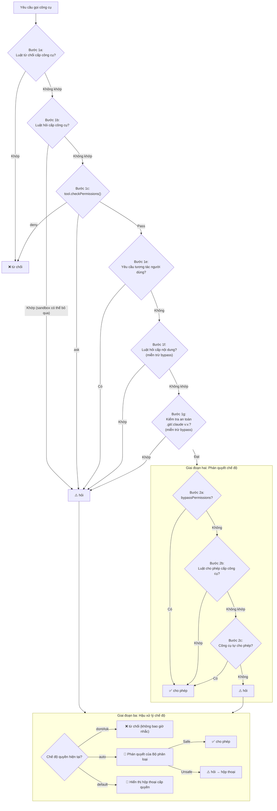

# Chương 16: Hệ thống phân quyền

<p align="right">
  <a href="../../part5/ch16.html">Đọc bản gốc tiếng Trung</a>
</p>

> **Định vị**: Chương này phân tích sáu chế độ phân quyền của Claude Code, cơ chế khớp luật ba lớp, và toàn bộ đường ống (pipeline) xác thực-phân quyền-phân loại. Điều kiện tiên quyết: Chương 4 (luồng khởi động). Đối tượng độc giả: độc giả muốn hiểu rõ sáu chế độ phân quyền của CC và đường ống phân quyền ba giai đoạn, hoặc các nhà phát triển cần thiết kế mô hình phân quyền cho Agent của riêng mình.

## Tại sao điều này lại quan trọng

Một AI Agent có khả năng thực thi các lệnh shell tùy ý và đọc/ghi bất kỳ tệp nào trong cơ sở mã (codebase) của người dùng — chất lượng thiết kế của hệ thống phân quyền của nó trực tiếp quyết định giới hạn trên của sự tin tưởng từ người dùng. Nếu quá lỏng lẻo, người dùng sẽ phải đối mặt với các rủi ro bảo mật — tấn công tiêm mã lệnh (prompt injection) độc hại có thể kích hoạt `rm -rf /` hoặc đánh cắp khóa SSH; nếu quá hạn chế, mọi hoạt động đều hiển thị hộp thoại xác nhận, khiến trợ lý lập trình AI bị giảm cấp thành một "công cụ tự động hóa yêu cầu con người phải nhấp chuột liên tục".

Hệ thống phân quyền của Claude Code cố gắng tìm kiếm sự cân bằng giữa hai thái cực này: thông qua sáu chế độ phân quyền, cơ chế khớp luật ba lớp, và một đường ống xác thực-phân quyền-phân loại hoàn chỉnh, nó đạt được sự kiểm soát phân cấp trong đó "các thao tác an toàn sẽ tự động được thông qua, các thao tác nguy hiểm yêu cầu xác nhận thủ công, và các trường hợp mơ hồ sẽ do bộ phân loại AI phán quyết."

Chương này sẽ mổ xẻ kỹ lưỡng thiết kế và triển khai của hệ thống phân quyền này.

---

## 16.1 Sáu chế độ phân quyền

Chế độ phân quyền (Permission Mode) là công tắc điều khiển cấp cao nhất của toàn bộ hệ thống. Người dùng có thể chuyển đổi vòng lặp qua các chế độ bằng phím Shift+Tab hoặc chỉ định cụ thể thông qua tham số dòng lệnh (CLI argument) `--permission-mode`. Tất cả các chế độ được định nghĩa trong `types/permissions.ts`:

```typescript
// types/permissions.ts:16-22
export const EXTERNAL_PERMISSION_MODES = [
  'acceptEdits',
  'bypassPermissions',
  'default',
  'dontAsk',
  'plan',
] as const
```

Bên trong mã nguồn, có thêm hai chế độ không công khai khác — `auto` và `bubble` — tạo thành kiểu union hoàn chỉnh:

```typescript
// types/permissions.ts:28-29
export type InternalPermissionMode = ExternalPermissionMode | 'auto' | 'bubble'
export type PermissionMode = InternalPermissionMode
```

Dưới đây là mô tả hành vi của từng chế độ:

| Chế độ | Ký hiệu | Hành vi | Kịch bản điển hình |
|------|--------|----------|------------------|
| `default` | (không) | Tất cả các cuộc gọi công cụ đều yêu cầu người dùng xác nhận | Lần đầu sử dụng, môi trường bảo mật cao |
| `acceptEdits` | `>>` | Chỉnh sửa tệp trong thư mục làm việc được tự động thông qua; lệnh shell vẫn yêu cầu xác nhận | Hỗ trợ lập trình hàng ngày |
| `plan` | `⏸` | AI chỉ có thể đọc và tìm kiếm; không thực hiện thao tác ghi nào | Đánh giá mã nguồn (code review), lập kế hoạch kiến trúc |
| `bypassPermissions` | `>>` | Bỏ qua tất cả các kiểm tra quyền (ngoại trừ kiểm tra an toàn) | Thao tác hàng loạt trong môi trường đáng tin cậy |
| `dontAsk` | `>>` | Chuyển đổi tất cả các quyết định `ask` thành `deny`; không bao giờ hiển thị lời nhắc xác nhận | Đường ống CI/CD tự động |
| `auto` | `>>` | Bộ phân loại AI tự động phán quyết; chỉ sử dụng nội bộ | Phát triển nội bộ của Anthropic |

Mỗi chế độ có một đối tượng cấu hình tương ứng (`PermissionMode.ts:42-91`) chứa tiêu đề, từ viết tắt, ký hiệu, và khóa màu sắc. Đáng chú ý là chế độ `auto` được đăng ký thông qua một cổng tính năng biên dịch (compile-time feature gate) `feature('TRANSCRIPT_CLASSIFIER')` — trong các bản build bên ngoài, mã nguồn này hoàn toàn bị loại bỏ bởi tính năng loại bỏ mã chết (dead code elimination) của Bun.

### Logic vòng lặp chuyển đổi chế độ

`getNextPermissionMode` (`getNextPermissionMode.ts:34-79`) định nghĩa thứ tự vòng lặp Shift+Tab:

```
Người dùng bên ngoài (external): default → acceptEdits → plan → [bypassPermissions] → default
Người dùng nội bộ (internal): default → [bypassPermissions] → [auto] → default
```

Người dùng nội bộ bỏ qua `acceptEdits` và `plan` vì chế độ `auto` thay thế chức năng của cả hai chế độ đó. `bypassPermissions` chỉ xuất hiện trong vòng lặp khi cờ `isBypassPermissionsModeAvailable` là `true`. Chế độ `auto` yêu cầu cả cổng tính năng biên dịch và kiểm tra tính khả dụng lúc chạy (runtime availability check):

```typescript
// getNextPermissionMode.ts:17-29
function canCycleToAuto(ctx: ToolPermissionContext): boolean {
  if (feature('TRANSCRIPT_CLASSIFIER')) {
    const gateEnabled = isAutoModeGateEnabled()
    const can = !!ctx.isAutoModeAvailable && gateEnabled
    // ...
    return can
  }
  return false
}
```

### Tác dụng phụ của việc chuyển đổi chế độ

`transitionPermissionMode` (`permissionSetup.ts:597-646`) xử lý các tác dụng phụ khi chuyển đổi chế độ:

1. **Vào chế độ plan**: Gọi `prepareContextForPlanMode`, lưu chế độ hiện tại vào `prePlanMode`
2. **Vào chế độ auto**: Gọi `stripDangerousPermissionsForAutoMode`, loại bỏ các luật cho phép nguy hiểm (chi tiết bên dưới)
3. **Thoát khỏi chế độ auto**: Gọi `restoreDangerousPermissions`, khôi phục các luật đã bị loại bỏ
4. **Thoát khỏi chế độ plan**: Đặt cờ trạng thái `hasExitedPlanMode`

---

## 16.2 Hệ thống luật phân quyền

Các chế độ phân quyền là các công tắc thô; các luật phân quyền (permission rules) cung cấp khả năng kiểm soát mịn (fine-grained control). Một luật bao gồm ba phần:

```typescript
// types/permissions.ts:75-79
export type PermissionRule = {
  source: PermissionRuleSource
  ruleBehavior: PermissionBehavior    // 'allow' | 'deny' | 'ask'
  ruleValue: PermissionRuleValue
}
```

Trong đó `PermissionRuleValue` chỉ định công cụ mục tiêu và một bộ định chuẩn nội dung (content qualifier) tùy chọn:

```typescript
// types/permissions.ts:67-70
export type PermissionRuleValue = {
  toolName: string
  ruleContent?: string    // e.g., "npm install", "git:*"
}
```

### Hệ thống phân cấp nguồn luật

Các luật có tám nguồn (`types/permissions.ts:54-62`), được xếp hạng từ ưu tiên cao nhất đến thấp nhất:

| Nguồn | Vị trí | Chia sẻ |
|--------|----------|---------|
| `policySettings` | Chính sách được quản lý của doanh nghiệp (Enterprise managed policy) | Đẩy xuống cho tất cả người dùng |
| `projectSettings` | `.claude/settings.json` | Được commit vào git, chia sẻ trong nhóm |
| `localSettings` | `.claude/settings.local.json` | Bị bỏ qua bởi git (gitignored), chỉ cục bộ |
| `userSettings` | `~/.claude/settings.json` | Toàn cục cho người dùng |
| `flagSettings` | Tham số dòng lệnh `--settings` | Lúc chạy (Runtime) |
| `cliArg` | `--allowed-tools` và các tham số CLI khác | Lúc chạy (Runtime) |
| `command` | Ngữ cảnh của lệnh con CLI | Lúc chạy (Runtime) |
| `session` | Luật tạm thời trong phiên làm việc | Chỉ phiên làm việc hiện tại |

### Định dạng và phân tích chuỗi luật

Các luật được lưu trữ dưới dạng chuỗi trong các tệp cấu hình, được định dạng là `ToolName` hoặc `ToolName(content)`. Việc phân tích cú pháp được xử lý bởi hàm `permissionRuleValueFromString` của tệp `permissionRuleParser.ts` (dòng 93-133), hàm này xử lý các dấu ngoặc đơn được thoát (escaped parentheses) — vì bản thân nội dung luật có thể chứa các dấu ngoặc đơn (ví dụ: `python -c "print(1)"`).

Trường hợp đặc biệt: cả `Bash()` và `Bash(*)` đều được coi là luật cấp công cụ (không có bộ định chuẩn nội dung), tương đương với `Bash`.

---

## 16.3 Ba chế độ khớp luật

Các luật quyền cho lệnh Shell hỗ trợ ba chế độ khớp, được phân tích bởi hàm `parsePermissionRule` trong `shellRuleMatching.ts` (dòng 159-184) thành một kiểu discriminated union:

```typescript
// shellRuleMatching.ts:25-38
export type ShellPermissionRule =
  | { type: 'exact'; command: string }
  | { type: 'prefix'; prefix: string }
  | { type: 'wildcard'; pattern: string }
```

### Khớp chính xác (Exact Matching)

Các luật không chứa ký tự đại diện (wildcard) yêu cầu khớp lệnh chính xác:

| Luật | Khớp | Không khớp |
|------|---------|----------------|
| `npm install` | `npm install` | `npm install lodash` |
| `git status` | `git status` | `git status --short` |

### Khớp tiền tố (Cú pháp cũ `: *`)

Các luật kết thúc bằng `: *` sử dụng khớp tiền tố — đây là cú pháp cũ để tương thích ngược:

| Luật | Khớp | Không khớp |
|------|---------|----------------|
| `npm:*` | `npm install`, `npm run build`, `npm test` | `npx create-react-app` |
| `git:*` | `git add .`, `git commit -m "msg"` | `gitk` |

Việc trích xuất tiền tố được thực hiện bởi `permissionRuleExtractPrefix` (dòng 43-48): regex `/^(.+):\*$/` khớp và bắt lấy mọi thứ trước `: *` dưới dạng tiền tố.

### Khớp ký tự đại diện (Wildcard Matching)

Các luật chứa ký tự `*` không được thoát (ngoại trừ ký tự `: *` ở cuối) sử dụng khớp ký tự đại diện. Hàm `matchWildcardPattern` (dòng 90-154) chuyển đổi mẫu đó thành một biểu thức chính quy (regular expression):

| Luật | Khớp | Không khớp |
|------|---------|----------------|
| `git add *` | `git add .`, `git add src/main.ts`, `git add` trơn | `git commit` |
| `docker build -t *` | `docker build -t myapp` | `docker run myapp` |
| `echo \*` | `echo *` (dấu sao tường minh) | `echo hello` |

Khớp ký tự đại diện có một hành vi được thiết kế cẩn thận: khi một mẫu kết thúc bằng ` *` (khoảng trắng cộng với ký tự đại diện) và toàn bộ mẫu chỉ chứa một ký tự `*` không được thoát, thì khoảng trắng và các tham số phía sau là tùy chọn. Điều này có nghĩa là `git *` khớp với cả `git add` và lệnh `git` trơn (dòng 142-145). Điều này giúp ngữ nghĩa của ký tự đại diện nhất quán với các luật tiền tố như `git:*`.

Cơ chế thoát sử dụng các chỗ trống lấp đầy (sentinel placeholder) là byte rỗng (null-byte) (dòng 14-17) để tránh nhầm lẫn giữa `\*` (dấu sao tường minh) và `*` (ký tự đại diện) trong quá trình chuyển đổi regex:

```typescript
// shellRuleMatching.ts:14-17
const ESCAPED_STAR_PLACEHOLDER = '\x00ESCAPED_STAR\x00'
const ESCAPED_BACKSLASH_PLACEHOLDER = '\x00ESCAPED_BACKSLASH\x00'
```

---

## 16.4 Đường ống Xác thực-Quyền-Phân loại

> **Phiên bản tương tác**: [Nhấp để xem ảnh động về cây quyết định quyền](permission-viz.html) — chọn các kịch bản gọi công cụ khác nhau (Đọc tệp / Bash rm / Chỉnh sửa / Ghi tệp .env) và xem cách các yêu cầu chạy qua đường ống ba giai đoạn.

Khi mô hình AI khởi chạy một cuộc gọi công cụ, yêu cầu sẽ đi qua đường ống ba giai đoạn để xác định xem nó có được thực thi hay không. Điểm vào cốt lõi là `hasPermissionsToUseTool` (`permissions.ts:473`), hàm này gọi hàm nội bộ `hasPermissionsToUseToolInner` để thực thi hai giai đoạn đầu tiên, sau đó xử lý logic bộ phân loại của giai đoạn thứ ba ở lớp bên ngoài.



### Giai đoạn Một: Xác thực luật

Đây là giai đoạn mang tính phòng thủ cao nhất; tất cả các đường dẫn thoát ra đều có quyền ưu tiên cao hơn phán quyết chế độ. Các bước chính:

**Các bước 1a-1b** (`permissions.ts:1169-1206`) kiểm tra các luật từ chối (deny) và hỏi (ask) cấp công cụ. Nếu toàn bộ công cụ `Bash` bị từ chối, mọi lệnh Bash đều bị bác bỏ. Luật hỏi cấp công cụ có một ngoại lệ: khi sandbox được kích hoạt và cờ `autoAllowBashIfSandboxed` được bật, các lệnh chạy trong hộp cát (sandboxed commands) có thể bỏ qua luật hỏi.

**Bước 1c** (`permissions.ts:1214-1223`) gọi phương thức `checkPermissions()` của chính công cụ đó. Mỗi loại công cụ (Bash, FileEdit, PowerShell, v.v.) triển khai logic kiểm tra quyền riêng của nó. Ví dụ, công cụ Bash phân tích lệnh, kiểm tra các lệnh con và khớp các luật cho phép/từ chối.

**Bước 1f** (`permissions.ts:1244-1250`) là một thiết kế quan trọng: các luật hỏi cấp nội dung (như `Bash(npm publish:*)`) vẫn phải nhắc nhở người dùng ngay cả trong chế độ `bypassPermissions`. Điều này là do các luật hỏi do người dùng cấu hình rõ ràng thể hiện ý định bảo mật rõ ràng — "Tôi muốn xác nhận trước khi thực hiện xuất bản (publish)."

**Bước 1g** (`permissions.ts:1255-1258`) cũng có khả năng miễn dịch với chế độ bypass tương tự: các thao tác ghi vào `.git/`, `.claude/`, `.vscode/`, và các tệp cấu hình shell (`.bashrc`, `.zshrc`, v.v.) luôn yêu cầu xác nhận.

### Giai đoạn Hai: Phán quyết chế độ

Nếu cuộc gọi công cụ vượt qua Giai đoạn Một mà không bị từ chối hoặc bắt buộc phải hỏi, nó sẽ bước vào phán quyết chế độ. Chế độ `bypassPermissions` sẽ trực tiếp cho phép tại điểm này. Trong các chế độ khác, hệ thống sẽ kiểm tra các luật cho phép (allow) và quyết định cho phép của chính công cụ đó.

### Giai đoạn Ba: Hậu xử lý chế độ

Đây là cổng cuối cùng của đường ống quyết định phân quyền. Chế độ `dontAsk` chuyển đổi tất cả các quyết định hỏi thành từ chối, phù hợp cho các môi trường không tương tác (`permissions.ts:505-517`). Chế độ `auto` sẽ khởi chạy bộ phân loại AI để đưa ra phán quyết — đây là con đường phức tạp nhất trong toàn bộ hệ thống phân quyền (chi tiết bên dưới).

---

## 16.5 `isDangerousBashPermission()`: Bảo vệ biên an toàn của Bộ phân loại

Khi người dùng chuyển từ chế độ khác sang chế độ `auto`, hệ thống gọi `stripDangerousPermissionsForAutoMode` để tạm thời loại bỏ một số luật cho phép nhất định. Các luật bị loại bỏ không bị xóa mà được lưu trong trường `strippedDangerousRules`, và được khôi phục khi rời khỏi chế độ auto.

Hàm cốt lõi để xác định xem một luật có "nguy hiểm" hay không là `isDangerousBashPermission` (`permissionSetup.ts:94-147`):

```typescript
// permissionSetup.ts:94-107
export function isDangerousBashPermission(
  toolName: string,
  ruleContent: string | undefined,
): boolean {
  if (toolName !== BASH_TOOL_NAME) { return false }
  if (ruleContent === undefined || ruleContent === '') { return true }
  const content = ruleContent.trim().toLowerCase()
  if (content === '*') { return true }
  // ...check DANGEROUS_BASH_PATTERNS
}
```

Các mẫu luật nguy hiểm bao gồm năm dạng:

1. **Cho phép cấp công cụ**: `Bash` (không có ruleContent) hoặc `Bash(*)` — cho phép tất cả các lệnh
2. **Ký tự đại diện đứng độc lập**: `Bash(*)` — tương đương với cho phép cấp công cụ
3. **Tiền tố trình thông dịch**: `Bash(python:*)` — cho phép thực thi mã Python tùy ý
4. **Ký tự đại diện trình thông dịch**: `Bash(python *)` — tương tự như trên
5. **Trình thông dịch với cờ đại diện**: `Bash(python -*)` — cho phép `python -c 'mã tùy ý'`

Các tiền tố lệnh nguy hiểm được định nghĩa trong `dangerousPatterns.ts:44-80`:

```typescript
// dangerousPatterns.ts:44-80
export const DANGEROUS_BASH_PATTERNS: readonly string[] = [
  ...CROSS_PLATFORM_CODE_EXEC,  // python, node, ruby, perl, ssh, etc.
  'zsh', 'fish', 'eval', 'exec', 'env', 'xargs', 'sudo',
  // Additional Anthropic-internal patterns...
]
```

Các điểm vào thực thi mã đa nền tảng (`CROSS_PLATFORM_CODE_EXEC`, dòng 18-42) bao gồm tất cả các trình thông dịch tập lệnh chính (python/node/ruby/perl/php/lua), trình chạy gói (npx/bunx/npm run), các shell (bash/sh), và các công cụ thực thi lệnh từ xa (ssh).

Người dùng nội bộ sẽ có thêm các mẫu bổ sung như `gh`, `curl`, `wget`, `git`, `kubectl`, `aws`, v.v. — các mẫu này bị loại trừ trong các bản build bên ngoài thông qua một cổng kiểm tra `process.env.USER_TYPE === 'ant'`.

PowerShell có một hàm tương ứng `isDangerousPowerShellPermission` (`permissionSetup.ts:157-233`) để phát hiện thêm các lệnh nguy hiểm đặc thù của PowerShell: `Invoke-Expression`, `Start-Process`, `Add-Type`, `New-Object`, v.v., và xử lý các biến thể hậu tố `.exe` (`python.exe`, `npm.exe`).

---

## 16.6 Xác thực quyền đường dẫn và Bảo vệ UNC

Việc xác thực quyền cho các thao tác tệp được thực hiện bởi hàm `validatePath` của `pathValidation.ts` (dòng 373-485). Đây là một đường ống bảo mật nhiều bước:

### Đường ống xác thực đường dẫn

```
Đường dẫn đầu vào (Input path)
  │
  ├─ 1. Loại bỏ dấu ngoặc kép, mở rộng ~ ──→ cleanPath
  ├─ 2. Phát hiện đường dẫn UNC ──→ Từ chối nếu khớp
  ├─ 3. Phát hiện biến thể tilde nguy hiểm (~root, ~+, ~-) ──→ Từ chối nếu khớp
  ├─ 4. Phát hiện cú pháp mở rộng Shell ($VAR, %VAR%) ──→ Từ chối nếu khớp
  ├─ 5. Phát hiện mẫu Glob ──→ Từ chối đối với thao tác ghi; xác thực thư mục gốc đối với thao tác đọc
  ├─ 6. Phân giải thành đường dẫn tuyệt đối + phân giải liên kết mềm (symlink)
  └─ 7. Kiểm tra nhiều bước isPathAllowed()
```

### Bảo vệ chống rò rỉ NTLM qua đường dẫn UNC

Trên hệ điều hành Windows, khi một ứng dụng truy cập một đường dẫn UNC (ví dụ: `\\attacker-server\share\file`), hệ điều hành sẽ tự động gửi các thông tin xác thực NTLM (NTLM authentication credentials) để thực hiện xác thực. Kẻ tấn công có thể khai thác cơ chế này: thông qua kỹ thuật tiêm mã nhắc (prompt injection), chúng có thể bắt AI đọc hoặc ghi vào một đường dẫn UNC trỏ đến một máy chủ độc hại, từ đó đánh cắp mã băm (hash) NTLM của người dùng.

`containsVulnerableUncPath` (`shell/readOnlyCommandValidation.ts:1562`) phát hiện ba biến thể đường dẫn UNC:

```typescript
// readOnlyCommandValidation.ts:1562-1596
export function containsVulnerableUncPath(pathOrCommand: string): boolean {
  if (getPlatform() !== 'windows') { return false }

  // 1. Backslash UNC: \\server\share
  const backslashUncPattern = /\\\\[^\s\\/]+(?:@(?:\d+|ssl))?(?:[\\/]|$|\s)/i

  // 2. Forward-slash UNC: //server/share (excluding :// in URLs)
  const forwardSlashUncPattern = /(?<!:)\/\/[^\s\\/]+(?:@(?:\d+|ssl))?(?:[\\/]|$|\s)/i

  // 3. Mixed separators: /\\server (Cygwin/bash environments)
  // ...
}
```

Lưu ý rằng biểu thức chính quy thứ hai sử dụng một kỹ thuật negative lookbehind `(?<!:)` để loại trừ các URL như `https://` — một trường hợp sử dụng dấu gạch chéo kép hợp lệ. Mẫu tên máy chủ `[^\s\\/]+` sử dụng một tập hợp loại trừ (exclusion set) thay vị một danh sách trắng các ký tự, nhằm bắt các cuộc tấn công đồng hình Unicode (Unicode homoglyph attacks) (ví dụ: thay thế chữ 'а' Cyrillic cho chữ 'a' Latin).

### Bảo vệ chống tấn công TOCTOU

Xác thực đường dẫn cũng phòng thủ chống lại nhiều kiểu tấn công TOCTOU (Thời điểm kiểm tra so với Thời điểm sử dụng - Time-of-Check-to-Time-of-Use):

- **Các biến thể tilde nguy hiểm** (dòng 401-411): `~root` được phân giải dưới dạng đường dẫn tương đối thành `/cwd/~root/...` trong quá trình xác thực, nhưng Shell lại mở rộng nó thành `/var/root/...` tại thời điểm thực thi.
- **Mở rộng biến Shell** (dòng 423-436): `$HOME/.ssh/id_rsa` là một chuỗi văn bản thuần túy trong quá trình xác thực, nhưng Shell lại mở rộng nó thành đường dẫn thực tế tại thời điểm thực thi.
- **Mở rộng dấu bằng trong Zsh (Zsh equals expansion)** (tương tự): `=rg` mở rộng thành `/usr/bin/rg` trong Zsh.

Tất cả các trường hợp này được phòng thủ bằng cách từ chối các đường dẫn chứa các ký tự đặc thù (`$`, `%`, `=`), yêu cầu xác nhận thủ công từ người dùng.

### Kiểm tra nhiều bước của `isPathAllowed()`

Sau khi làm sạch đường dẫn, `isPathAllowed` (`pathValidation.ts:141-263`) thực hiện phán quyết phân quyền cuối cùng:

1. **Các luật chặn được ưu tiên**: Bất kỳ luật từ chối (deny) nào khớp sẽ ngay lập tức từ chối yêu cầu.
2. **Đường dẫn có thể chỉnh sửa nội bộ**: Các tệp kế hoạch (plan files), scratchpad, bộ nhớ của agent (agent memory) và các đường dẫn nội bộ khác dưới thư mục `~/.claude/` được tự động cho phép chỉnh sửa.
3. **Kiểm tra an toàn**: Các thao tác ghi vào các thư mục nguy hiểm (`.git/`, `.claude/`) và các tệp cấu hình shell sẽ bị gắn cờ để yêu cầu xác nhận.
4. **Kiểm tra thư mục làm việc**: Khi đường dẫn nằm trong thư mục làm việc được cho phép, các thao tác đọc (`read`) sẽ tự động được thông qua; các thao tác ghi (`write`) yêu cầu chế độ `acceptEdits`.
5. **Danh sách trắng ghi của Sandbox**: Khi hộp cát (sandbox) được bật, các thư mục được cấu hình cho phép ghi của nó sẽ tự động được chấp nhận.
6. **Luật cho phép**: Các luật cho phép (allow) khớp với yêu cầu sẽ cấp quyền.

---

## 16.7 Đường ống bộ phân loại của chế độ Auto

Khi chế độ phân quyền là `auto` và một cuộc gọi công cụ đi đến quyết định hỏi (ask) ở Giai đoạn Ba, hệ thống sẽ khởi chạy bộ phân loại YOLO (`yoloClassifier.ts`) để thực hiện phán quyết bằng AI. Triết lý thiết kế của bộ phân loại này là: trong hầu hết các trường hợp, AI có thể tự xác định xem một thao tác có an toàn hay không.

### Danh sách trắng các công cụ an toàn

Không phải tất cả các công cụ đều cần phải đi qua bộ phân loại. Tệp `classifierDecision.ts` định nghĩa một danh sách trắng an toàn (`SAFE_YOLO_ALLOWLISTED_TOOLS`, dòng 56-94), chứa các thao tác chỉ đọc (FileRead, Grep, Glob), các thao tác siêu dữ liệu (các công cụ liên quan đến Tác vụ - Task), và các công cụ giao diện người dùng (EnterPlanMode, AskUserQuestion). Các công cụ nằm trong danh sách trắng sẽ trực tiếp được cho phép.

### Đường tắt acceptEdits

Trước khi gọi bộ phân loại, hệ thống mô phỏng một lần kiểm tra chế độ `acceptEdits` (`permissions.ts:600-648`): nếu công cụ được cho phép hoạt động trong chế độ `acceptEdits` (ví dụ: chỉnh sửa tệp trong thư mục làm việc), bộ phân loại sẽ bị bỏ qua và quyền được cấp trực tiếp. Điều này giúp tránh các cuộc gọi API không cần thiết. Tuy nhiên, các công cụ `Agent` (sub-agent) và `REPL` (thực thi mã) bị loại trừ rõ ràng — tính an toàn của chúng không thể được quyết định chỉ bằng đường dẫn.

### Theo dõi các lần từ chối liên tiếp

Tệp `denialTracking.ts` triển khai một bộ đếm số lần từ chối liên tiếp. Khi bộ phân loại từ chối các thao tác nhiều lần liên tiếp, hệ thống sẽ tự động hạ cấp xuống chế độ nhắc nhở thủ công — một lưới bảo hiểm cho các phán quyết sai tiềm ẩn của bộ phân loại. Mỗi lần gọi công cụ thành công sẽ đặt lại bộ đếm này.

### Kiến trúc hai giai đoạn của Bộ phân loại

Bộ phân loại YOLO (`yoloClassifier.ts`) sử dụng một quy trình quyết định gồm hai giai đoạn:

1. **Giai đoạn 1 (Nhanh)**: Mô hình độ trễ thấp thực hiện phán quyết nhanh
2. **Giai đoạn 2 (Suy nghĩ)**: Khi Giai đoạn 1 không chắc chắn, một mô hình mạnh mẽ hơn sẽ thực hiện phân tích sâu hơn

Bộ phân loại nhận được ngữ cảnh phiên hiện tại (lịch sử cuộc gọi công cụ, tin nhắn người dùng) và lệnh đang chờ phán quyết, trả về một giá trị boolean `shouldBlock` và mô tả lý do. Cấu trúc kết quả chứa các trường đo lường từ xa (telemetry) chi tiết (mức sử dụng token, độ trễ, ID yêu cầu) để phân tích sau đó.

---

## 16.8 Bảo vệ các Tệp và Thư mục Nguy hiểm

`filesystem.ts` định nghĩa hai nhóm đối tượng được bảo vệ:

```typescript
// filesystem.ts:57-79
export const DANGEROUS_FILES = [
  '.gitconfig', '.gitmodules',
  '.bashrc', '.bash_profile', '.zshrc', '.zprofile', '.profile',
  '.ripgreprc', '.mcp.json', '.claude.json',
] as const

export const DANGEROUS_DIRECTORIES = [
  '.git', '.vscode', '.idea', '.claude',
] as const
```

Các tệp và thư mục này có thể được khai thác để thực thi mã hoặc trích xuất dữ liệu:
- `.gitconfig` có thể cấu hình `core.sshCommand` để thực thi mã tùy ý
- `.bashrc`/`.zshrc` tự động thực thi sau mỗi lần khởi chạy Shell
- `.vscode/settings.json` có thể cấu hình các tác vụ và tự động chạy trong terminal

Các thao tác ghi vào những đường dẫn này được gắn cờ thuộc loại `safetyCheck` trong `checkPathSafetyForAutoEdit`, với khả năng miễn dịch bypass — yêu cầu người dùng xác nhận ngay cả trong chế độ `bypassPermissions`. Tuy nhiên, trong chế độ `auto`, một số kiểm tra an toàn (chẳng hạn như đường dẫn tệp nhạy cảm) được đánh dấu là `classifierApprovable: true`, cho phép bộ phân loại tự động phê duyệt chúng khi có đủ ngữ cảnh.

### Phát hiện đường dẫn xóa nguy hiểm

`isDangerousRemovalPath` (`pathValidation.ts:331-367`) ngăn chặn việc xóa thư mục gốc, thư mục cá nhân (home directory), thư mục gốc của phân vùng Windows và các thư mục con trực tiếp của chúng (`/usr`, `/tmp`, `C:\Windows`). Nó cũng xử lý chuẩn hóa ký tự phân tách đường dẫn — trong môi trường Windows, cả `C:\\Windows` và `C:/Windows` đều được xác định chính xác.

---

## 16.9 Phát hiện luật bị che khuất (Shadowed Rule)

Khi người dùng cấu hình các luật phân quyền mâu thuẫn nhau — ví dụ, từ chối `Bash` trong cài đặt dự án (project settings) nhưng lại cho phép `Bash(git:*)` trong cài đặt cục bộ (local settings) — luật cho phép đó sẽ không bao giờ có hiệu lực. Kiểu `UnreachableRule` của `shadowedRuleDetection.ts` (dòng 19-25) ghi nhận các trường hợp như vậy:

```typescript
export type UnreachableRule = {
  rule: PermissionRule
  reason: string
  shadowedBy: PermissionRule
  shadowType: ShadowType       // 'ask' | 'deny'
  fix: string
}
```

Hệ thống sẽ phát hiện và cảnh báo cho người dùng biết luật cho phép nào đang bị che khuất bởi các luật từ chối/hỏi có độ ưu tiên cao hơn, và cách khắc phục chúng.

---

## 16.10 Lưu trữ bền vững các cập nhật phân quyền

Các cập nhật phân quyền được mô tả qua kiểu union `PermissionUpdate` (`types/permissions.ts:98-131`), hỗ trợ sáu thao tác: `addRules`, `replaceRules`, `removeRules`, `setMode`, `addDirectories`, `removeDirectories`. Mỗi thao tác chỉ định một vị trí lưu trữ đích (`PermissionUpdateDestination`).

Khi người dùng chọn "Always allow" (Luôn cho phép) trong hộp thoại phân quyền, hệ thống sẽ tạo một cập nhật `addRules`, thường nhắm mục tiêu vào `localSettings` (cài đặt cục bộ, không commit lên git). Hàm tạo gợi ý của công cụ shell (`shellRuleMatching.ts:189-228`) sẽ tạo ra các gợi ý khớp chính xác hoặc khớp tiền tố dựa trên đặc điểm của lệnh.

---

## 16.11 Suy ngẫm về Thiết kế

Hệ thống phân quyền của Claude Code thể hiện một số nguyên tắc thiết kế đáng chú ý:

**Phòng thủ chiều sâu (Defense in depth).** Các luật chặn (deny rules) đánh chặn ở ngay phía trước đường ống, các kiểm tra an toàn có khả năng miễn dịch bypass, và chế độ tự động loại bỏ các luật nguy hiểm khi bắt đầu vào — nhiều lớp bảo vệ đảm bảo rằng một điểm lỗi duy nhất sẽ không tạo ra lỗ hổng bảo mật.

**Ý định bảo mật không thể bị ghi đè.** Các luật hỏi được người dùng cấu hình rõ ràng (Bước 1f) và các kiểm tra an toàn hệ thống (Bước 1g) không bị ảnh hưởng bởi chế độ `bypassPermissions`. Thiết kế này thừa nhận giá trị của chế độ bypass (hiệu quả khi thao tác hàng loạt) trong khi vẫn bảo vệ các ranh giới an toàn mà người dùng cố tình thiết lập.

**Sự nhất quán TOCTOU.** Hệ thống xác thực đường dẫn từ chối tất cả các mẫu đường dẫn có thể tạo ra sự khác biệt về mặt ngữ nghĩa giữa "thời điểm xác thực" và "thời điểm thực thi" (biến shell, các biến thể tilde, mở rộng dấu bằng trong Zsh), thay vì cố gắng phân tích cú pháp chúng một cách chính xác — lựa chọn chiến lược an toàn và thận trọng thay vì một chiến lược tương thích "khéo léo".

**Bộ phân loại là lưới an toàn, không phải là sự thay thế.** Bộ phân loại của chế độ auto không phải là sự thay thế cho các kiểm tra phân quyền mà là một lớp bổ sung sau khi xác thực luật. Nó chỉ xử lý các vùng xám nơi "các luật chưa có câu trả lời rõ ràng", kèm theo cơ chế hạ cấp khi bị từ chối liên tục để ngăn hệ thống chạy mất kiểm soát.

Các nguyên tắc này cùng nhau tạo nên một kiến trúc phân quyền cân bằng giữa bảo mật và tính khả dụng — không làm mất đi giá trị của AI Agent do quá thận trọng, cũng không đẩy người dùng vào rủi ro do quá tin tưởng.

---

## Người dùng có thể làm gì

### Khuyến nghị lựa chọn chế độ phân quyền

- **Phát triển hàng ngày**: Sử dụng chế độ `acceptEdits` — các chỉnh sửa tệp tự động thông qua, các lệnh shell vẫn yêu cầu xác nhận, sự cân bằng tốt nhất giữa bảo mật và hiệu suất.
- **Đánh giá mã/Tìm hiểu kiến trúc**: Sử dụng chế độ `plan` — AI chỉ có thể đọc và tìm kiếm, loại bỏ các thay đổi vô tình.
- **Các tác vụ tự động hóa hàng loạt**: Sử dụng chế độ `bypassPermissions` — nhưng lưu ý rằng các kiểm tra an toàn (các thao tác ghi vào `.git/`, `.bashrc`, v.v.) vẫn yêu cầu xác nhận.

### Mẹo cấu hình luật

- Sử dụng `.claude/settings.json` (cấp dự án) để định nghĩa các luật cho phép/từ chối được chia sẻ trong nhóm, và commit lên git.
- Sử dụng `.claude/settings.local.json` (cấp cục bộ) để định nghĩa các luật theo sở thích cá nhân, tự động bị bỏ qua bởi git.
- Sử dụng cú pháp ký tự đại diện để đơn giản hóa các luật: `Bash(git *)` cho phép tất cả các lệnh con của git.
- Nếu các luật cho phép không có hiệu lực sau khi cấu hình luật từ chối, hãy kiểm tra hiện tượng che khuất luật (rule shadowing) — hệ thống sẽ chỉ ra các luật bị che khuất và gợi ý cách sửa.

### Các cân nhắc bảo mật

- Ngay cả khi đã bật `bypassPermissions`, các thao tác ghi vào các tệp nguy hiểm như `.gitconfig`, `.bashrc`, `.zshrc` vẫn yêu cầu xác nhận — đây là thiết kế bảo mật có chủ đích.
- Khi sử dụng chế độ `auto`, hệ thống tự động loại bỏ các luật cho phép Bash nguy hiểm (như `Bash(python:*)`); chúng được khôi phục khi rời khỏi chế độ auto.
- Shift+Tab có thể chuyển đổi giữa các chế độ bất kỳ lúc nào.

---

## Tiến trình Tiến hóa Phiên bản: Các thay đổi trong v2.1.91

> Phân tích sau đây dựa trên so sánh tín hiệu bundle của v2.1.91, kết hợp suy luận từ mã nguồn v2.1.88.

### Chính thức hóa chế độ Auto

Trong v2.1.88, chế độ `auto` đã tồn tại trong mã nguồn nội bộ (`resetAutoModeOptInForDefaultOffer.ts`, `spawnMultiAgent.ts:227`) nhưng không xuất hiện trong định nghĩa API công khai của `sdk-tools.d.ts`. v2.1.91 chính thức đưa nó vào:

```diff
- mode?: "acceptEdits" | "bypassPermissions" | "default" | "dontAsk" | "plan";
+ mode?: "acceptEdits" | "auto" | "bypassPermissions" | "default" | "dontAsk" | "plan";
```

Điều này có nghĩa là người dùng SDK hiện có thể yêu cầu rõ ràng chế độ auto thông qua API công khai — nghĩa là tự động phê duyệt quyền dựa trên TRANSCRIPT_CLASSIFIER.

### Đơn giản hóa đường ống bảo mật Bash

v2.1.91 loại bỏ tất cả hạ tầng liên quan đến bộ phân tích cú pháp tree-sitter WASM AST:

| Tín hiệu bị loại bỏ | Mục đích ban đầu |
|---------------|------------------|
| `tengu_tree_sitter_load` | Theo dõi việc tải mô-đun WASM |
| `tengu_tree_sitter_security_divergence` | Phát hiện sự khác biệt phân tích cú pháp giữa AST và regex |
| `tengu_tree_sitter_shadow` | Thử nghiệm song song chế độ bóng tối (Shadow mode) |
| `tengu_bash_security_check_triggered` | 23 điểm kích hoạt kiểm tra bảo mật |
| `CLAUDE_CODE_DISABLE_COMMAND_INJECTION_CHECK` | Công tắc tắt kiểm tra chèn câu lệnh (command injection) |

**Lý do loại bỏ**: Chú thích mã nguồn v2.1.88 CC-643 đã ghi lại một sự cố hiệu năng — các lệnh phức tạp lồng nhau kích hoạt `splitCommand` tạo ra các mảng lệnh con tăng theo cấp số nhân, mỗi lệnh thực thi phân tích cú pháp tree-sitter + khoảng 20 trình xác thực (validator) + logEvent, gây ra tình trạng cạn kiệt chuỗi microtask của vòng lặp sự kiện (event loop) và kích hoạt hiện tượng đóng băng 100% CPU của REPL.

v2.1.91 quay trở lại giải pháp thuần túy bằng regex JavaScript/shell-quote. Tệp `treeSitterAnalysis.ts` (phân tích cấp AST dài 507 dòng) được mô tả trong Phần 16.x của chương này chỉ áp dụng cho v2.1.88.
