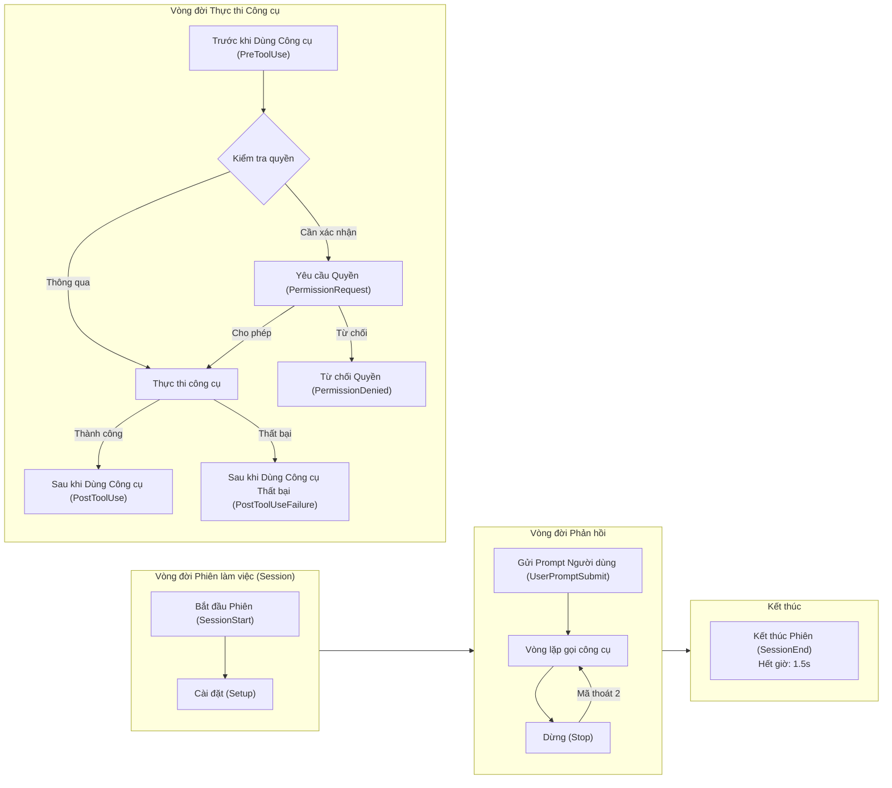
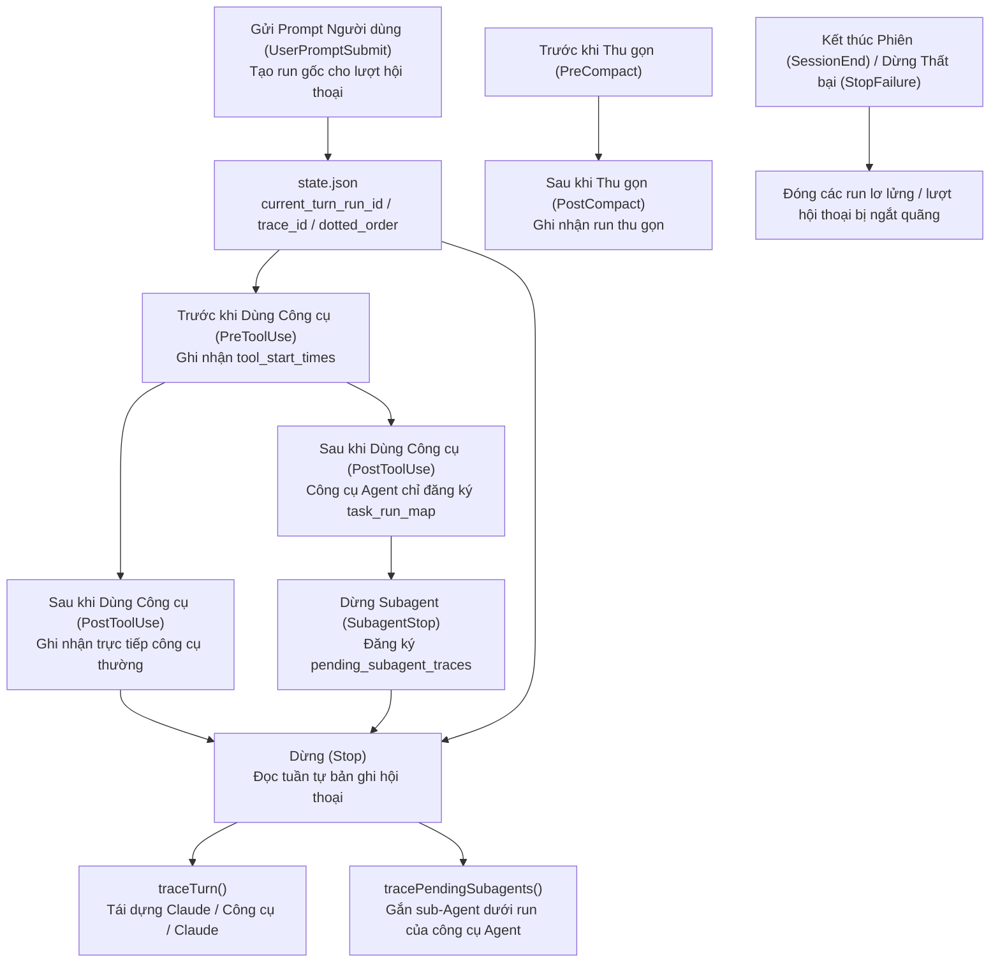

# Chương 18: Hooks — Các điểm chặn do người dùng định nghĩa

<p align="right">
  <a href="../../part5/ch18.html">Đọc bản gốc tiếng Trung</a>
</p>

> **Định vị**: Chương này phân tích hệ thống Hooks — cơ chế đăng ký các lệnh Shell tùy chỉnh, prompt LLM hoặc yêu cầu HTTP tại 26 điểm sự kiện trong vòng đời của Agent. Điều kiện tiên quyết: Chương 16 (Hệ thống phân quyền). Đối tượng độc giả: độc giả muốn hiểu cơ chế điểm chặn do người dùng định nghĩa của Claude Code, hoặc các nhà phát triển muốn tự triển khai hệ thống hook trong Agent của riêng mình.

## Tại sao điều này lại quan trọng

Hệ thống phân quyền (Chương 16) và bộ phân loại YOLO (Chương 17) của Claude Code cung cấp các cơ chế phòng thủ bảo mật tích hợp sẵn, nhưng chúng đều được "cấu hình trước" — người dùng không thể chèn logic của riêng mình vào các nút thắt quan trọng của đường ống thực thi công cụ. Hệ thống Hooks lấp đầy khoảng trống này: nó cho phép người dùng đăng ký các lệnh shell, prompt LLM, yêu cầu HTTP hoặc các bộ xác thực Agent tùy chỉnh tại 26 điểm sự kiện trong vòng đời của AI Agent, cho phép mọi tùy biến luồng công việc từ "kiểm tra định dạng" đến "tự động triển khai (auto-deployment)."

Đây không phải là một cơ chế "hàm gọi lại (callback function)" đơn giản. Hệ thống Hooks phải giải quyết bốn thách thức cốt lõi: Độ tin cậy (Trust) — ranh giới bảo mật cho việc thực thi lệnh tùy ý nằm ở đâu? Hết giờ (Timeout) — làm thế nào để ngăn chặn việc chặn toàn bộ vòng lặp Agent khi một Hook bị treo? Ngữ nghĩa (Semantics) — mã thoát (exit code) của Hook chuyển dịch thành quyết định "cho phép (allow)" hay "chặn (block)" như thế nào? Và cô lập cấu hình (configuration isolation) — làm thế nào để cấu hình Hook từ nhiều nguồn khác nhau gộp lại mà không can thiệp lẫn nhau?

Chương này sẽ mổ xẻ kỹ lưỡng cơ chế này từ cấp độ mã nguồn.

### Tổng quan Vòng đời Sự kiện Hook



---

## 18.1 Danh sách đầy đủ các loại Sự kiện Hook

Hệ thống Hooks hỗ trợ 26 loại sự kiện, được định nghĩa trong hàm `getHookEventMetadata` của tệp `hooksConfigManager.ts` (dòng 28-264). Chúng có thể được nhóm thành năm danh mục theo từng giai đoạn vòng đời:

### Vòng đời Thực thi Công cụ

| Sự kiện | Thời điểm kích hoạt | Trường `matcher` | Hành vi của Mã thoát 2 |
|-------|---------------|---------------|---------------------|
| `PreToolUse` | Trước khi thực thi công cụ | `tool_name` | Chặn cuộc gọi công cụ; gửi stderr đến mô hình |
| `PostToolUse` | Sau khi thực thi công cụ thành công | `tool_name` | Gửi ngay stderr đến mô hình |
| `PostToolUseFailure` | Sau khi thực thi công cụ thất bại | `tool_name` | Gửi ngay stderr đến mô hình |
| `PermissionRequest` | Khi hộp thoại phân quyền hiển thị | `tool_name` | Sử dụng quyết định của Hook |
| `PermissionDenied` | Sau khi bộ phân loại chế độ auto từ chối cuộc gọi công cụ | `tool_name` | — |

`PreToolUse` là điểm Hook được sử dụng phổ biến nhất. Trường `hookSpecificOutput` của nó hỗ trợ ba quyết định phân quyền (dòng 72-78, `types/hooks.ts`):

```typescript
// types/hooks.ts:72-78
z.object({
  hookEventName: z.literal('PreToolUse'),
  permissionDecision: permissionBehaviorSchema().optional(),
  permissionDecisionReason: z.string().optional(),
  updatedInput: z.record(z.string(), z.unknown()).optional(),
  additionalContext: z.string().optional(),
})
```

Lưu ý trường `updatedInput` — các Hook không chỉ có thể quyết định "có cho phép hay không" mà còn có thể sửa đổi các tham số đầu vào của công cụ. Điều này làm cho việc "viết lại lệnh" trở nên khả thi: ví dụ, tự động thêm `--no-verify` trước mỗi lệnh `git push`.

### Vòng đời Phiên làm việc (Session)

| Sự kiện | Thời điểm kích hoạt | Trường `matcher` | Hành vi đặc biệt |
|-------|---------------|---------------|-----------------|
| `SessionStart` | Phiên mới/khôi phục/dọn dẹp/thu gọn | `source` (startup/resume/clear/compact) | stdout được gửi đến Claude; bỏ qua các lỗi gây chặn |
| `SessionEnd` | Khi phiên kết thúc | `reason` (clear/logout/prompt_input_exit/other) | Thời gian hết hạn chỉ 1.5 giây |
| `Setup` | Trong quá trình khởi tạo và bảo trì kho lưu trữ | `trigger` (init/maintenance) | stdout được gửi đến Claude |
| `Stop` | Trước khi Claude chuẩn bị kết thúc phản hồi | — | Mã thoát 2 tiếp tục cuộc hội thoại |
| `StopFailure` | Khi lỗi API khiến lượt hội thoại kết thúc | `error` (rate_limit/authentication_failed/...) | chạy rồi bỏ qua (fire-and-forget) |
| `UserPromptSubmit` | Khi người dùng gửi prompt | — | Mã thoát 2 chặn xử lý và xóa prompt ban đầu |

Hook `SessionStart` có một khả năng độc đáo: thông qua biến môi trường `CLAUDE_ENV_FILE`, các Hook có thể ghi các câu lệnh bash export vào một tệp được chỉ định, và các biến môi trường này sẽ có hiệu lực trong tất cả các lệnh BashTool tiếp theo (dòng 917-926, `hooks.ts`):

```typescript
// hooks.ts:917-926
if (
  !isPowerShell &&
  (hookEvent === 'SessionStart' ||
    hookEvent === 'Setup' ||
    hookEvent === 'CwdChanged' ||
    hookEvent === 'FileChanged') &&
  hookIndex !== undefined
) {
  envVars.CLAUDE_ENV_FILE = await getHookEnvFilePath(hookEvent, hookIndex)
}
```

### Vòng đời Đa Agent

| Sự kiện | Thời điểm kích hoạt | Trường `matcher` |
|-------|---------------|---------------|
| `SubagentStart` | Khi sub-Agent khởi chạy | `agent_type` |
| `SubagentStop` | Trước khi sub-Agent chuẩn bị kết thúc phản hồi | `agent_type` |
| `TeammateIdle` | Khi một đồng đội chuẩn bị đi vào trạng thái rảnh rỗi | — |
| `TaskCreated` | Khi một tác vụ được tạo | — |
| `TaskCompleted` | Khi một tác vụ hoàn thành | — |

### Thay đổi Tệp và Cấu hình

| Sự kiện | Thời điểm kích hoạt | Trường `matcher` |
|-------|---------------|---------------|
| `FileChanged` | Khi một tệp được theo dõi thay đổi | Tên tệp (ví dụ: `.envrc\|.env`) |
| `CwdChanged` | Sau khi thư mục làm việc thay đổi | — |
| `ConfigChange` | Khi các tệp cấu hình thay đổi trong phiên | `source` (user_settings/project_settings/...) |
| `InstructionsLoaded` | Khi CLAUDE.md hoặc các tệp luật được tải | `load_reason` (session_start/path_glob_match/...) |

### Thu gọn, Tương tác MCP và Worktree

| Sự kiện | Thời điểm kích hoạt | Trường `matcher` |
|-------|---------------|---------------|
| `PreCompact` | Trước khi thu gọn hội thoại | `trigger` (manual/auto) |
| `PostCompact` | Sau khi thu gọn hội thoại | `trigger` (manual/auto) |
| `Elicitation` | Khi máy chủ MCP yêu cầu người dùng nhập thông tin | `mcp_server_name` |
| `ElicitationResult` | Sau khi người dùng phản hồi yêu cầu MCP | `mcp_server_name` |
| `WorktreeCreate` | Khi tạo một worktree độc lập | — |
| `WorktreeRemove` | Khi xóa một worktree | — |

---

## 18.2 Bốn loại Hook

Hệ thống Hooks hỗ trợ bốn loại Hook có thể lưu trữ lâu dài (persistable), cộng với hai loại nội bộ được đăng ký lúc chạy. Tất cả các schema loại lưu trữ được định nghĩa trong hàm `buildHookSchemas` của tệp `schemas/hooks.ts` (dòng 31-163).

### loại `command`: Các lệnh Shell

Loại cơ bản và được sử dụng nhiều nhất:

```typescript
// schemas/hooks.ts:32-65
const BashCommandHookSchema = z.object({
  type: z.literal('command'),
  command: z.string(),
  if: IfConditionSchema(),
  shell: z.enum(SHELL_TYPES).optional(),   // 'bash' | 'powershell'
  timeout: z.number().positive().optional(),
  statusMessage: z.string().optional(),
  once: z.boolean().optional(),            // Remove after single execution
  async: z.boolean().optional(),           // Background execution, non-blocking
  asyncRewake: z.boolean().optional(),     // Background execution, rewake model on exit code 2
})
```

Trường `shell` kiểm soát việc chọn trình thông dịch (interpreter) (dòng 790-791, `hooks.ts`) — mặc định là `bash` (thực tế sử dụng `$SHELL`, hỗ trợ bash/zsh/sh); `powershell` sử dụng `pwsh`. Hai đường dẫn thực thi hoàn toàn riêng biệt: đường dẫn bash xử lý việc chuyển đổi đường dẫn Windows Git Bash (`C:\Users\foo` -> `/c/Users/foo`), tự động thêm tiền tố `bash` cho các tệp `.sh`, và bọc bằng `CLAUDE_CODE_SHELL_PREFIX`; đường dẫn PowerShell bỏ qua tất cả những điều này, sử dụng các đường dẫn Windows gốc.

Trường `if` cung cấp bộ lọc điều kiện ở mức độ chi tiết. Nó sử dụng cú pháp luật phân quyền (ví dụ: `Bash(git *)`), được đánh giá ở giai đoạn khớp Hook thay vì sau khi khởi tạo tiến trình (spawn) — tránh việc khởi chạy các tiến trình vô ích cho các lệnh không khớp (dòng 1390-1421, `hooks.ts`):

```typescript
// hooks.ts:1390-1421
async function prepareIfConditionMatcher(
  hookInput: HookInput,
  tools: Tools | undefined,
): Promise<IfConditionMatcher | undefined> {
  if (
    hookInput.hook_event_name !== 'PreToolUse' &&
    hookInput.hook_event_name !== 'PostToolUse' &&
    hookInput.hook_event_name !== 'PostToolUseFailure' &&
    hookInput.hook_event_name !== 'PermissionRequest'
  ) {
    return undefined
  }
  // ...reuses permission rule parser and tool's preparePermissionMatcher
}
```

### loại `prompt`: Đánh giá bằng LLM

Gửi đầu vào của Hook đến một LLM nhẹ để đánh giá:

```typescript
// schemas/hooks.ts:67-95
const PromptHookSchema = z.object({
  type: z.literal('prompt'),
  prompt: z.string(),     // Uses $ARGUMENTS placeholder to inject Hook input JSON
  if: IfConditionSchema(),
  model: z.string().optional(),  // Defaults to small fast model
  statusMessage: z.string().optional(),
  once: z.boolean().optional(),
})
```

### loại `agent`: Bộ xác thực Agent

Mạnh mẽ hơn prompt — nó khởi chạy một vòng lặp Agent hoàn chỉnh để xác minh một điều kiện:

```typescript
// schemas/hooks.ts:128-163
const AgentHookSchema = z.object({
  type: z.literal('agent'),
  prompt: z.string(),     // "Verify that unit tests ran and passed."
  if: IfConditionSchema(),
  timeout: z.number().positive().optional(),  // Default 60 seconds
  model: z.string().optional(),  // Defaults to Haiku
  statusMessage: z.string().optional(),
  once: z.boolean().optional(),
})
```

Mã nguồn có một lưu ý thiết kế quan trọng (dòng 130-141): trường `prompt` trước đây được bọc bởi `.transform()` thành một hàm, gây ra thất thoát dữ liệu trong quá trình `JSON.stringify` — lỗi này được theo dõi dưới mã hiệu gh-24920/CC-79 và đã được khắc phục.

### loại `http`: Webhook

Thực hiện gửi yêu cầu POST chứa đầu vào của Hook đến một URL được chỉ định:

```typescript
// schemas/hooks.ts:97-126
const HttpHookSchema = z.object({
  type: z.literal('http'),
  url: z.string().url(),
  if: IfConditionSchema(),
  timeout: z.number().positive().optional(),
  headers: z.record(z.string(), z.string()).optional(),
  allowedEnvVars: z.array(z.string()).optional(),
  statusMessage: z.string().optional(),
  once: z.boolean().optional(),
})
```

`headers` hỗ trợ nội suy biến môi trường (`$VAR_NAME` hoặc `${VAR_NAME}`), nhưng chỉ các biến được liệt kê trong `allowedEnvVars` mới được phân giải — một cơ chế danh sách trắng rõ ràng để ngăn chặn việc rò rỉ vô tình các biến môi trường nhạy cảm.

Lưu ý: HTTP Hooks không hỗ trợ các sự kiện `SessionStart` and `Setup` (dòng 1853-1864, `hooks.ts`), bởi vì các phản hồi hỏi (ask callbacks) của hộp cát sẽ bị khóa chết (deadlock) trong chế độ không giao diện (headless mode).

### Các loại Nội bộ: callback và function

Hai loại này không thể được định nghĩa thông qua các tệp cấu hình; chúng chỉ dành cho SDK và đăng ký thành phần nội bộ. Loại `callback` được sử dụng cho các hook quy thuộc (attribution hooks), các hook truy cập tệp phiên làm việc và các tính năng nội bộ khác; loại `function` được sử dụng bởi các bộ thực thi đầu ra có cấu trúc (structured output enforcers) được đăng ký qua phần frontmatter của Agent.

---

## 18.3 Mô hình Thực thi

### Kiến trúc Trình tạo Bất đồng bộ (Async Generator)

`executeHooks` là hàm cốt lõi của toàn bộ hệ thống (dòng 1952-2098, `hooks.ts`), được khai báo là `async function*` — một async generator (trình tạo bất đồng bộ):

```typescript
// hooks.ts:1952-1977
async function* executeHooks({
  hookInput,
  toolUseID,
  matchQuery,
  signal,
  timeoutMs = TOOL_HOOK_EXECUTION_TIMEOUT_MS,
  toolUseContext,
  messages,
  forceSyncExecution,
  requestPrompt,
  toolInputSummary,
}: { /* ... */ }): AsyncGenerator<AggregatedHookResult> {
```

Thiết kế này cho phép bên gọi nhận kết quả thực thi của Hook một cách tuần tự (incrementally) qua vòng lặp `for await...of`, kích hoạt xử lý luồng dữ liệu (streaming processing). Mỗi Hook sẽ trả về một thông báo tiến trình trước khi thực thi và trả về kết quả cuối cùng sau khi hoàn thành.

### Chiến lược Hết giờ (Timeout)

Chiến lược hết giờ được chia thành hai tầng dựa trên loại sự kiện:

**Thời gian hết hạn mặc định: 10 phút.** Được định nghĩa tại dòng 166:

```typescript
// hooks.ts:166
const TOOL_HOOK_EXECUTION_TIMEOUT_MS = 10 * 60 * 1000
```

Thời gian hết hạn dài này áp dụng cho hầu hết các sự kiện Hook — các kịch bản CI của người dùng, các bộ kiểm thử và các lệnh biên dịch (build) có thể mất vài phút.

**Thời gian hết hạn của SessionEnd: 1.5 giây.** Được định nghĩa tại các dòng 175-182:

```typescript
// hooks.ts:174-182
const SESSION_END_HOOK_TIMEOUT_MS_DEFAULT = 1500
export function getSessionEndHookTimeoutMs(): number {
  const raw = process.env.CLAUDE_CODE_SESSIONEND_HOOKS_TIMEOUT_MS
  const parsed = raw ? parseInt(raw, 10) : NaN
  return Number.isFinite(parsed) && parsed > 0
    ? parsed
    : SESSION_END_HOOK_TIMEOUT_MS_DEFAULT
}
```

Các Hook `SessionEnd` chạy trong quá trình đóng/dọn dẹp và phải có các ràng buộc thời gian hết hạn cực kỳ chặt chẽ — nếu không, người dùng sẽ phải đợi 10 phút sau khi nhấn Ctrl+C mới có thể thoát. 1.5 giây đóng vai trò là thời gian hết hạn mặc định cho các Hook riêng lẻ lẫn giới hạn AbortSignal tổng thể (vì tất cả các Hook thực thi song song). Người dùng có thể ghi đè thông qua biến môi trường `CLAUDE_CODE_SESSIONEND_HOOKS_TIMEOUT_MS`.

Mỗi Hook cũng có thể chỉ định thời gian hết hạn riêng thông qua trường `timeout` (tính bằng giây), ghi đè cấu hình mặc định (dòng 877-879):

```typescript
// hooks.ts:877-879
const hookTimeoutMs = hook.timeout
  ? hook.timeout * 1000
  : TOOL_HOOK_EXECUTION_TIMEOUT_MS
```

### Các Hook Chạy ngầm Bất đồng bộ (Async Background Hooks)

Các Hook có thể đi vào thực thi chạy ngầm theo hai cách:

1. **Khai báo cấu hình**: Đặt `async: true` hoặc `asyncRewake: true` (dòng 995-1029).
2. **Khai báo lúc chạy**: Hook xuất ra chuỗi JSON `{"async": true}` ở dòng đầu tiên (dòng 1117-1164).

Sự khác biệt then chốt nằm ở `asyncRewake`: khi cờ này được đặt, Hook chạy ngầm không đăng ký vào danh mục bất đồng bộ (async registry). Thay vào đó, sau khi hoàn thành, nó sẽ kiểm tra mã thoát — nếu mã thoát là 2, nó sẽ xếp hàng thông báo lỗi dưới dạng một `task-notification` qua `enqueuePendingNotification`, đánh thức lại mô hình để tiếp tục xử lý (dòng 205-244).

Một chi tiết tinh tế khi thực thi Hook chạy ngầm: stdin phải được ghi trước khi chuyển ra chạy ngầm, nếu không lệnh `read -r line` của bash sẽ trả về mã thoát 1 do gặp EOF (kết thúc tệp) — lỗi này được theo dõi dưới mã hiệu gh-30509/CC-161 (chú thích ở các dòng 1001-1008).

### Giao thức Yêu cầu Prompt (Prompt Request Protocol)

Hook thuộc loại lệnh (command) hỗ trợ giao thức tương tác hai chiều: tiến trình Hook có thể ghi các yêu cầu prompt định dạng JSON vào stdout, Claude Code sẽ hiển thị một hộp thoại lựa chọn cho người dùng, và lựa chọn của người dùng được gửi lại thông qua stdin:

```typescript
// types/hooks.ts:28-40
export const promptRequestSchema = lazySchema(() =>
  z.object({
    prompt: z.string(),       // Request ID
    message: z.string(),      // Message displayed to user
    options: z.array(
      z.object({
        key: z.string(),
        label: z.string(),
        description: z.string().optional(),
      }),
    ),
  }),
)
```

Giao thức này được tuần tự hóa — nhiều yêu cầu prompt được xử lý nối tiếp nhau (biến `promptChain` ở dòng 1064), đảm bảo các phản hồi không bị gửi sai thứ tự.

---

## 18.4 Ngữ nghĩa của Mã thoát (Exit Code)

Mã thoát (exit code) là giao thức giao tiếp chính giữa các Hook và Claude Code:

| Mã thoát | Ngữ nghĩa | Hành vi |
|-----------|-----------|----------|
| **0** | Thành công/cho phép | stdout/stderr không được hiển thị (hoặc chỉ hiển thị trong chế độ bản ghi) |
| **2** | Lỗi gây chặn | stderr được gửi đến mô hình; chặn thao tác hiện tại |
| **Khác** | Lỗi không gây chặn | stderr chỉ hiển thị cho người dùng; thao tác tiếp tục chạy |

Tuy nhiên, các loại sự kiện khác nhau sẽ diễn dịch mã thoát theo các cách khác nhau. Dưới đây là các khác biệt chính:

- **PreToolUse**: Mã thoát 2 sẽ chặn cuộc gọi công cụ và gửi stderr đến mô hình; stdout/stderr của mã thoát 0 không được hiển thị.
- **Stop**: Mã thoát 2 gửi stderr đến mô hình và **tiếp tục cuộc hội thoại** (thay vì kết thúc nó) — đây là cơ sở triển khai cho chế độ "tiếp tục viết mã" (continue coding).
- **UserPromptSubmit**: Mã thoát 2 chặn việc xử lý, **xóa prompt gốc** và chỉ hiển thị stderr cho người dùng.
- **SessionStart/Setup**: Các lỗi gây chặn bị bỏ qua — các sự kiện này không cho phép các Hook chặn luồng khởi động.
- **StopFailure**: chạy rồi bỏ qua (fire-and-forget); mọi đầu ra và mã thoát đều bị bỏ qua.

### Giao thức Đầu ra JSON

Bên cạnh mã thoát, các Hook cũng có thể truyền thông tin có cấu trúc thông qua đầu ra JSON của stdout. Logic của hàm `parseHookOutput` (dòng 399-451) là: nếu stdout bắt đầu bằng ký tự `{`, nó sẽ cố gắng phân tích cú pháp JSON và xác thực schema Zod; nếu không, nó sẽ coi đó là văn bản thuần túy.

Schema đầu ra JSON hoàn chỉnh được định nghĩa trong `types/hooks.ts:50-176`. Các trường cốt lõi bao gồm:

```typescript
// types/hooks.ts:50-66
export const syncHookResponseSchema = lazySchema(() =>
  z.object({
    continue: z.boolean().optional(),       // false = stop execution
    suppressOutput: z.boolean().optional(), // true = hide stdout
    stopReason: z.string().optional(),      // Message when continue=false
    decision: z.enum(['approve', 'block']).optional(),
    reason: z.string().optional(),
    systemMessage: z.string().optional(),   // Warning displayed to user
    hookSpecificOutput: z.union([/* per-event-type specific output */]).optional(),
  }),
)
```

`hookSpecificOutput` là một liên hợp phân biệt (discriminated union), với mỗi loại sự kiện có các trường chuyên biệt riêng. Ví dụ, sự kiện `PermissionRequest` (dòng 121-133) hỗ trợ các quyết định `allow`/`deny` và cập nhật quyền:

```typescript
// types/hooks.ts:121-133
z.object({
  hookEventName: z.literal('PermissionRequest'),
  decision: z.union([
    z.object({
      behavior: z.literal('allow'),
      updatedInput: z.record(z.string(), z.unknown()).optional(),
      updatedPermissions: z.array(permissionUpdateSchema()).optional(),
    }),
    z.object({
      behavior: z.literal('deny'),
      message: z.string().optional(),
      interrupt: z.boolean().optional(),
    }),
  ]),
})
```

---

## 18.5 Kiểm soát Tin cậy (Trust Gating)

Cổng bảo mật cho việc thực thi Hook được triển khai bởi hàm `shouldSkipHookDueToTrust` (dòng 286-296):

```typescript
// hooks.ts:286-296
export function shouldSkipHookDueToTrust(): boolean {
  const isInteractive = !getIsNonInteractiveSession()
  if (!isInteractive) {
    return false  // Trust is implicit in SDK mode
  }
  const hasTrust = checkHasTrustDialogAccepted()
  return !hasTrust
}
```

Quy tắc này rất đơn giản nhưng tối quan trọng:

1. **Chế độ không tương tác (SDK)**: Độ tin cậy là ngầm định; tất cả các Hook được thực thi trực tiếp.
2. **Chế độ tương tác**: **Tất cả** các Hook đều yêu cầu xác nhận qua hộp thoại tin cậy.

Chú thích mã nguồn (dòng 267-285) giải thích chi tiết "tại sao là tất cả": Cấu hình Hook được ghi lại ở giai đoạn `captureHooksConfigSnapshot()`, diễn ra trước khi hộp thoại tin cậy hiển thị. Mặc dù hầu hết các Hook sẽ không thực thi trước khi có xác nhận tin cậy trong luồng chương trình thông thường, trong lịch sử từng tồn tại hai lỗ hổng — các Hook `SessionEnd` thực thi ngay cả khi người dùng từ chối tin cậy, và các Hook `SubagentStop` thực thi khi các sub-Agent hoàn thành trước khi có xác nhận tin cậy. Nguyên tắc phòng thủ chiều sâu đòi hỏi kiểm tra đồng nhất cho mọi Hook.

Hàm `executeHooks` cũng thực hiện một kiểm tra tập trung trước khi thực thi (dòng 1993-1999):

```typescript
// hooks.ts:1993-1999
if (shouldSkipHookDueToTrust()) {
  logForDebugging(
    `Skipping ${hookName} hook execution - workspace trust not accepted`,
  )
  return
}
```

Ngoài ra, cấu hình `disableAllHooks` cung cấp khả năng kiểm soát triệt để hơn (dòng 1978-1979) — nếu được thiết lập trong policySettings, nó sẽ vô hiệu hóa tất cả các Hook bao gồm cả các Hook được quản lý (managed Hooks); nếu đặt trong các thiết lập không được quản lý (non-managed settings), nó chỉ vô hiệu hóa các Hook không được quản lý (các Hook được quản lý vẫn chạy).

---

## 18.6 Theo dõi ảnh chụp cấu hình (Configuration Snapshot)

Cấu hình Hook không được đọc theo thời gian thực trên mỗi lần thực thi mà được quản lý thông qua cơ chế ảnh chụp (snapshot). Tệp `hooksConfigSnapshot.ts` định nghĩa hệ thống này:

### Chụp ảnh cấu hình

`captureHooksConfigSnapshot()` (dòng 95-97) được gọi một lần khi ứng dụng khởi động:

```typescript
// hooksConfigSnapshot.ts:95-97
export function captureHooksConfigSnapshot(): void {
  initialHooksConfig = getHooksFromAllowedSources()
}
```

### Lọc nguồn cấu hình

`getHooksFromAllowedSources()` (dòng 18-53) triển khai logic lọc nhiều lớp:

1. Nếu policySettings đặt `disableAllHooks: true`, trả về cấu hình rỗng.
2. If policySettings đặt `allowManagedHooksOnly: true`, chỉ trả về các hook được quản lý.
3. Nếu chính sách `strictPluginOnlyCustomization` được kích hoạt, chặn các hook từ cài đặt của người dùng/dự án/cục bộ.
4. Nếu cấu hình không được quản lý đặt `disableAllHooks`, chỉ các hook được quản lý chạy.
5. Ngược lại, trả về cấu hình được gộp từ tất cả các nguồn.

### Cập nhật ảnh chụp

Khi người dùng sửa đổi cấu hình Hook qua lệnh `/hooks`, `updateHooksConfigSnapshot()` (dòng 104-112) sẽ được gọi:

```typescript
// hooksConfigSnapshot.ts:104-112
export function updateHooksConfigSnapshot(): void {
  resetSettingsCache()  // Ensure reading latest settings from disk
  initialHooksConfig = getHooksFromAllowedSources()
}
```

Lưu ý cuộc gọi `resetSettingsCache()` — nếu không có nó, ảnh chụp cấu hình có thể sử dụng các thiết lập cũ trong bộ đệm. Điều này là do ngưỡng ổn định của bộ theo dõi tệp (file watcher) có thể chưa được kích hoạt (chú thích mã nguồn có đề cập đến điều này).

---

## 18.7 Khớp luật và Loại bỏ trùng lặp

### Các mẫu so khớp (Matcher Patterns)

Mỗi cấu hình Hook có thể chỉ định một trường `matcher` để lọc chính xác điều kiện kích hoạt. Hàm `matchesPattern` (dòng 1346-1381) hỗ trợ ba chế độ:

1. **Khớp chính xác (Exact match)**: `Write` chỉ khớp với tên công cụ `Write`.
2. **Phân tách bằng dấu gạch đứng (Pipe-separated)**: `Write|Edit` khớp với `Write` hoặc `Edit`.
3. **Biểu thức chính quy (Regular expression)**: `^Write.*` khớp với tất cả tên công cụ bắt đầu bằng `Write`.

Việc xác định dựa trên nội dung chuỗi: nếu nó chỉ chứa các ký tự `[a-zA-Z0-9_|]`, nó được coi là khớp đơn giản; ngược lại sẽ coi là biểu thức chính quy (regex).

### Cơ chế loại bỏ trùng lặp (Deduplication Mechanism)

Cùng một câu lệnh có thể được định nghĩa trong nhiều nguồn cấu hình (người dùng/dự án/cục bộ); việc loại bỏ trùng lặp được xử lý bởi hàm `hookDedupKey` (dòng 1453-1455):

```typescript
// hooks.ts:1453-1455
function hookDedupKey(m: MatchedHook, payload: string): string {
  return `${m.pluginRoot ?? m.skillRoot ?? ''}\0${payload}`
}
```

Thiết kế cốt lõi: khóa loại bỏ trùng lặp (dedup key) được phân không gian tên (namespaced) theo ngữ cảnh nguồn — cùng một lệnh `echo hello` trong các thư mục plugin khác nhau sẽ không bị loại bỏ trùng (vì việc mở rộng `${CLAUDE_PLUGIN_ROOT}` trỏ đến các tệp khác nhau), nhưng cùng một lệnh đó trên các lớp người dùng/dự án/cục bộ trong cùng một nguồn sẽ được gộp lại.

Các Hook thuộc loại `callback` và `function` bỏ qua việc lọc trùng lặp — mỗi phiên bản là duy nhất. Khi tất cả các Hook khớp đều thuộc loại callback/function, hệ thống cũng có một đường tắt (fast path) (dòng 1723-1729) bỏ qua hoàn toàn 6 vòng lọc và việc khởi dựng Map; các thử nghiệm vi mô (micro-benchmarks) cho thấy hiệu năng tăng gấp 44 lần.

---

## 18.8 Các ví dụ cấu hình thực tế

### Ví dụ 1: Kiểm tra Định dạng PreToolUse

Tự động chạy kiểm tra định dạng trước mỗi lần ghi tệp TypeScript:

```json
{
  "hooks": {
    "PreToolUse": [
      {
        "matcher": "Write|Edit",
        "hooks": [
          {
            "type": "command",
            "command": "FILE=$(echo $ARGUMENTS | jq -r '.file_path') && prettier --check \"$CLAUDE_PROJECT_DIR/$FILE\" 2>&1 || echo '{\"decision\":\"block\",\"reason\":\"File does not pass prettier formatting\"}'",
            "if": "Write(*.ts)",
            "statusMessage": "Checking formatting..."
          }
        ]
      }
    ]
  }
}
```

Cấu hình này minh họa một số khả năng chính:

- `matcher: "Write|Edit"` sử dụng ký tự gạch đứng để khớp với hai công cụ.
- `if: "Write(*.ts)"` sử dụng cú pháp luật phân quyền để lọc sâu hơn — trong ví dụ này, nó chỉ áp dụng cho các tệp `.ts`. Trường `if` hỗ trợ mọi mẫu luật phân quyền, chẳng hạn như `"Bash(git *)"` để chỉ khớp với các lệnh git, `"Edit(src/**)"` để chỉ khớp với các chỉnh sửa trong thư mục src, `"Read(*.py)"` để chỉ khớp với thao tác đọc tệp Python.
- Biến môi trường `$CLAUDE_PROJECT_DIR` tự động được thiết lập trỏ tới thư mục gốc của dự án (dòng 813-816).
- Đầu vào JSON của Hook được truyền qua stdin; Hook có thể tham chiếu nó qua biến `$ARGUMENTS` hoặc đọc trực tiếp từ stdin.
- Giá trị `decision: "block"` trong giao thức đầu ra JSON sẽ chặn các thao tác ghi không tuân thủ quy chuẩn định dạng.

### Ví dụ 2: Khởi tạo Môi trường SessionStart + Tự động Xác minh Stop

Kết hợp các Hook SessionStart và Stop để triển khai một "môi trường phát triển tự động":

```json
{
  "hooks": {
    "SessionStart": [
      {
        "matcher": "startup",
        "hooks": [
          {
            "type": "command",
            "command": "echo 'export NODE_ENV=development' >> $CLAUDE_ENV_FILE && echo '{\"hookSpecificOutput\":{\"hookEventName\":\"SessionStart\",\"additionalContext\":\"Dev environment configured. Node: '$(node -v)'\"}}'",
            "statusMessage": "Setting up dev environment..."
          }
        ]
      }
    ],
    "Stop": [
      {
        "hooks": [
          {
            "type": "agent",
            "prompt": "Check if there are uncommitted changes. If so, create an appropriate commit message and commit them. Verify the commit was successful.",
            "timeout": 120,
            "model": "claude-sonnet-4-6",
            "statusMessage": "Auto-committing changes..."
          }
        ]
      }
    ]
  }
}
```

Ví dụ này minh họa:

- Hook SessionStart sử dụng `CLAUDE_ENV_FILE` to inject environment variables into subsequent Bash commands.
- `additionalContext` gửi thông tin đến Claude làm ngữ cảnh.
- Hook Stop sử dụng loại `agent` để khởi chạy một Agent xác minh hoàn chỉnh.
- Tham số `timeout: 120` ghi đè thời gian hết hạn mặc định là 60 giây.

---

## 18.9 Hệ phân cấp Nguồn và Gộp Hook

Hàm `getHooksConfig` (dòng 1492-1566) chịu trách nhiệm gộp các cấu hình Hook từ nhiều nguồn khác nhau thành một danh sách thống nhất. Thứ tự các nguồn được xếp hạng từ độ ưu tiên cao nhất đến thấp nhất:

1. **Ảnh chụp cấu hình** (kết quả gộp của settings.json): Lấy thông qua `getHooksConfigFromSnapshot()`.
2. **Các Hook đã đăng ký** (SDK callback + Hook gốc của plugin): Lấy thông qua `getRegisteredHooks()`.
3. **Các Hook phiên làm việc** (Hook được đăng ký bởi frontmatter của Agent): Lấy thông qua `getSessionHooks()`.
4. **Các Hook hàm phiên làm việc** (các bộ thực thi đầu ra có cấu trúc, v.v.): Lấy thông qua `getSessionFunctionHooks()`.

Khi chính sách `allowManagedHooksOnly` được kích hoạt, các Hook không được quản lý từ các nguồn 2-4 sẽ bị bỏ qua. Việc lọc này diễn ra ở giai đoạn gộp cấu hình chứ không phải ở giai đoạn thực thi — giúp chặn đứng hoàn toàn các Hook không được quản lý trước khi chúng đi vào luồng thực thi.

Hàm `hasHookForEvent` (dòng 1582-1593) là một bộ kiểm tra sự tồn tại gọn nhẹ — nó không xây dựng danh sách gộp hoàn chỉnh mà trả về kết quả ngay lập tức khi tìm thấy trận khớp đầu tiên. Điều này được sử dụng để tối ưu hóa đi tắt trên các luồng xử lý tần suất cao (như sự kiện `InstructionsLoaded` và `WorktreeCreate`), tránh các cuộc gọi `createBaseHookInput` và `getMatchingHooks` không cần thiết khi không có cấu hình Hook nào tồn tại.

---

## 18.10 Quản lý Tiến trình và Nhánh Shell

Logic khởi tạo tiến trình (spawn) của Hook (dòng 940-984) được chia thành hai nhánh hoàn toàn độc lập dựa trên loại shell:

**Đường dẫn Bash:**
```typescript
// hooks.ts:976-983
const shell = isWindows ? findGitBashPath() : true
child = spawn(finalCommand, [], {
  env: envVars,
  cwd: safeCwd,
  shell,
  windowsHide: true,
})
```

Trên Windows, Git Bash được sử dụng thay thế cho cmd.exe — đồng nghĩa với việc mọi đường dẫn phải ở định dạng POSIX. Hàm `windowsPathToPosixPath()` là một bộ chuyển đổi regex thuần JavaScript (với bộ nhớ đệm LRU-500), không cần gọi tiến trình ngoài đến lệnh cygpath.

**Đường dẫn PowerShell:**
```typescript
// hooks.ts:967-972
child = spawn(pwshPath, buildPowerShellArgs(finalCommand), {
  env: envVars,
  cwd: safeCwd,
  windowsHide: true,
})
```

Sử dụng các tham số `-NoProfile -NonInteractive -Command` — bỏ qua các kịch bản cấu hình của người dùng (nhanh hơn, mang tính tất định cao hơn), trả về lỗi ngay lập tức (fail-fast) thay vì bị treo khi cần nhập thông tin.

Một bước kiểm tra an toàn tinh tế: trước khi spawn, nó xác minh xem thư mục được trả về bởi `getCwd()` có tồn tại hay không (dòng 931-938). Khi một worktree của Agent bị xóa, AsyncLocalStorage may return a deleted path; trong trường hợp này, nó sẽ quay về sử dụng `getOriginalCwd()`.

### Thay thế Biến trong Hook của Plugin

Khi các Hook đến từ các plugin, các biến mẫu trong chuỗi lệnh sẽ được thay thế trước khi spawn (dòng 818-857):

- `${CLAUDE_PLUGIN_ROOT}`: Thư mục cài đặt của plugin.
- `${CLAUDE_PLUGIN_DATA}`: Thư mục lưu trữ dữ liệu bền vững của plugin.
- `${user_config.X}`: Các giá trị cấu hình do người dùng thiết lập qua lệnh `/plugin`.

Thứ tự thay thế rất quan trọng: các biến plugin được thay thế trước các biến cấu hình của người dùng — điều này ngăn cản các ký tự nguyên văn `${CLAUDE_PLUGIN_ROOT}` trong giá trị cấu hình của người dùng bị phân tích cú pháp hai lần. Nếu thư mục plugin không tồn tại (có thể do tranh chấp dọn rác GC hoặc việc xóa phiên làm việc đồng thời), mã sẽ ném ra một lỗi rõ ràng trước khi spawn (dòng 831-836), thay vì để lệnh thoát với mã 2 sau khi không tìm thấy tập lệnh — điều vốn có thể bị diễn dịch sai thành "chủ động chặn".

Các tùy chọn của plugin cũng được tiếp xúc dưới dạng các biến môi trường (dòng 898-906), được đặt tên theo định dạng `CLAUDE_PLUGIN_OPTION_<KEY>`, trong đó KEY được viết hoa với các ký tự không phải mã định danh được thay thế bằng dấu gạch dưới. Điều này cho phép các kịch bản Hook đọc cấu hình thông qua các biến môi trường thay vì sử dụng các mẫu `${user_config.X}` trong các chuỗi lệnh.

---

## 18.11 Nghiên cứu điển hình: Xây dựng LangSmith Runtime Tracing bằng Hooks

Dự án mã nguồn mở `langsmith-claude-code-plugins` cung cấp một trường hợp cực kỳ điển hình: **nó không sửa đổi mã nguồn của Claude Code, cũng không ủy quyền (proxy) các yêu cầu API Anthropic, nhưng nó lại có thể theo dõi (trace) các lượt hội thoại, cuộc gọi công cụ, sub-Agent và các sự kiện thu gọn.** Điều này chứng minh rằng giá trị của hệ thống Hooks vượt ra ngoài việc "thực thi một kịch bản tại một thời điểm sự kiện nào đó" — nó đủ để cấu thành một bề mặt tích hợp bên ngoài.

Ý tưởng cốt lõi của plugin có thể được tóm tắt trong một câu:

> **Sử dụng các Hook để thu thập các tín hiệu vòng đời, sử dụng bản ghi hội thoại làm nhật ký thực tế, sử dụng một máy trạng thái cục bộ để lắp ráp lại các tín hiệu phân tán thành một cây theo dõi (trace tree) hoàn chỉnh.**

Nó không dựa vào phép thuật thần bí nào cả, mà dựa trên một số khả năng được Claude Code cung cấp chính thức:

1. Các plugin có thể đính kèm tệp `hooks/hooks.json` của riêng chúng, gắn các Hook loại lệnh (command-type) vào nhiều sự kiện vòng đời.
2. Các Hook nhận JSON có cấu trúc qua stdin, chứ không phải một biến môi trường mơ hồ nào đó.
3. Tất cả các đầu vào của Hook đều bao gồm `session_id`, `transcript_path`, `cwd`.
4. Sự kiện `Stop` / `SubagentStop` bổ sung thêm các trường giá trị cao như `last_assistant_message`, `agent_transcript_path`.
5. Các lệnh Hook có thể sử dụng `${CLAUDE_PLUGIN_ROOT}` để tham chiếu thư mục gói bundle của chính plugin.
6. Thiết lập `async: true` cho phép các plugin thực hiện gửi dữ liệu qua mạng dưới nền mà không chặn luồng tương tác chính.

### Cách một Plugin bên ngoài lắp ráp sơ đồ theo dõi (Trace) hoàn chỉnh

Plugin LangSmith đăng ký 9 sự kiện Hook:

| Sự kiện Hook | Mục đích |
|-----------|---------|
| `UserPromptSubmit` | Tạo một run gốc trên LangSmith cho lượt hội thoại hiện tại |
| `PreToolUse` | Ghi lại thời gian bắt đầu thực tế của công cụ |
| `PostToolUse` | Theo dõi các công cụ thông thường; giữ lại run cha cho các công cụ Agent |
| `Stop` | Đọc dần bản ghi hội thoại, tái tạo hệ phân cấp lượt/llm/công cụ |
| `StopFailure` | Đóng các run lơ lửng khi xảy ra lỗi API |
| `SubagentStop` | Ghi lại đường dẫn bản ghi của sub-Agent, chuyển giao cho `Stop` chính để xử lý thống nhất |
| `PreCompact` | Ghi lại thời gian bắt đầu thu gọn |
| `PostCompact` | Theo dõi sự kiện thu gọn và nội dung tóm tắt |
| `SessionEnd` | Dọn dẹp khi người dùng thoát hoặc dùng lệnh `/clear`, hoàn thành các lượt hội thoại bị ngắt quãng |

Mối quan hệ hợp tác giữa chúng như sau:



Khía cạnh đáng chú ý nhất của luồng xử lý này là: **không có một Hook riêng lẻ nào có thể hoàn thành việc theo dõi một cách độc lập.** Thiết kế thực tế không phải là "cây theo dõi chỉ cần đọc bản ghi hội thoại ở sự kiện Stop là xong", mà là lắp ráp các tín hiệu riêng lẻ do từng sự kiện vòng đời đóng góp.

### Điểm cốt lõi 1: UserPromptSubmit thiết lập nút gốc trước tiên

Plugin tạo một run gốc `Claude Code Turn` khi sự kiện `UserPromptSubmit` được kích hoạt và ghi trạng thái sau vào một tệp trạng thái cục bộ:

- `current_turn_run_id`
- `current_trace_id`
- `current_dotted_order`
- `current_turn_number`
- `last_line`

Bằng cách này, các tiến trình `PostToolUse`, `Stop` và `PostCompact` phía sau đều biết nên gắn các lượt chạy của chúng dưới nút cha nào.

Đây là một quyết định thiết kế then chốt. Nhiều người theo bản năng thường đặt logic theo dõi trong sự kiện `Stop` để "tạo ra mọi thứ cùng một lúc", nhưng điều đó làm mất đi hai khả năng:

1. Không thể cung cấp một mã định danh run cha ổn định cho **một lượt hội thoại đang diễn ra (in-progress turn)**.
2. Không thể gắn chính xác các sự kiện bất đồng bộ diễn ra sau đó (như thực thi công cụ, thu gọn) dưới lượt hội thoại hiện tại.

Ý nghĩa của `UserPromptSubmit` không phải là "người dùng đã gửi một tin nhắn", mà là **thiết lập một mỏ neo toàn cục cho lượt tương tác này.**

### Điểm cốt lõi 2: Bản ghi là Nhật ký Thực tế, Hooks chỉ là các Tín hiệu Phụ trợ

Việc tái dựng nội dung thực sự diễn ra trong Hook `Stop`.

Plugin không phụ thuộc vào một trường đơn lẻ nào trong đầu vào của Hook để xây dựng toàn bộ vết theo dõi lượt hội thoại. Thay vào đó, nó coi `transcript_path` là nhật ký sự kiện có thẩm quyền, đọc dần các dòng JSONL mới kể từ lần xử lý trước đó, sau đó:

1. Gộp các phân đoạn dữ liệu dạng luồng (streaming chunks) của trợ lý theo `message.id`.
2. Ghép cặp `tool_use` với `tool_result` tương ứng tiếp theo.
3. Tổ chức một lượt đầu vào của người dùng thành một `Turn`.
4. Chuyển đổi `Turn` thành cấu trúc phân cấp của LangSmith:
   `Claude Code Turn -> Claude(llm) -> Tool -> Claude(llm) ...`

Một phán đoán quan trọng làm nền tảng cho cách tiếp cận này: **Các Hook cung cấp các mốc thời gian; bản ghi hội thoại cung cấp thứ tự thực tế của các sự kiện.**

Nếu chỉ dựa vào các Hook:
- Bạn biết "một công cụ nào đó đã thực thi".
- Nhưng bạn có thể không biết nó chạy sau cuộc gọi LLM nào.
- Việc phục hồi chính xác toàn bộ ngữ cảnh trước và sau các cuộc gọi công cụ cũng rất khó khăn.

Nếu chỉ dựa vào bản ghi hội thoại:
- Bạn có thể khôi phục thứ tự tin nhắn và công cụ.
- Nhưng bạn không thể lấy được thời gian bắt đầu/kết thúc thực tế theo đồng hồ của các công cụ.
- Bạn cũng không thể cảm nhận kịp thời các sự kiện cấp máy chủ lưu trữ (host-level) như thu gọn, kết thúc phiên làm việc, lỗi API.

Vì vậy, kỹ năng thực tế của plugin không nằm riêng ở bản ghi hội thoại hay ở các hook, mà là sự **phân vai của chúng**:

- Bản ghi hội thoại chịu trách nhiệm về **sự thật ngữ nghĩa (semantic truth)**.
- Các Hook chịu trách nhiệm về **siêu dữ liệu lúc chạy (runtime metadata)**.

### Điểm cốt lõi 3: Tại sao vẫn cần PreToolUse / PostToolUse

Nếu `Stop` đã có thể khôi phục cuộc gọi công cụ từ bản ghi hội thoại, tại sao vẫn cần `PreToolUse` / `PostToolUse`?

Câu trả lời là: bởi vì bản ghi hội thoại giống như **lịch sử tin nhắn** hơn là **đồng hồ bấm giờ công cụ chính xác.**

Plugin LangSmith sử dụng hai Hook này cho hai việc:

1. `PreToolUse` ghi lại ánh xạ `tool_use_id -> start_time`.
2. `PostToolUse` tạo ngay một lượt chạy công cụ (tool run) cho các công cụ thông thường sau khi hoàn thành và ghi `tool_use_id` vào danh sách `traced_tool_use_ids`.

Bằng cách này, `Stop` có thể bỏ qua các công cụ thông thường đã được theo dõi trong quá trình phát lại bản ghi hội thoại, tránh việc tạo ra các lượt chạy trùng lặp. Ngoài ra, giá trị `last_tool_end_time` giúp `Stop` sửa các lỗi sai biệt thời gian do độ trễ ghi dữ liệu (flush latency) của bản ghi hội thoại.

Nói cách khác:

- `Stop` giải quyết việc **tái dựng ngữ nghĩa (semantic reconstruction)**.
- `Pre/PostToolUse` giải quyết độ **chính xác về mặt thời gian (timing precision)**.

Đây là một khuôn mẫu mở rộng máy chủ lưu trữ rất điển hình: **nhật ký ngữ nghĩa và thời gian hiệu năng đến từ các nguồn tín hiệu khác nhau và không thể bị ép buộc gộp làm một.**

### Điểm cốt lõi 4: Tại sao việc theo dõi Sub-Agent phải qua ba giai đoạn

Phần tinh tế nhất của plugin là cách nó theo dõi các sub-Agent.

Claude Code cung cấp chính thức hai mảnh ghép chính:

1. Sự kiện `SubagentStop`.
2. Đường dẫn `agent_transcript_path`.

Chỉ riêng hai điều này thì chưa đủ. Plugin cũng cần biết: **sub-Agent này nên được gắn dưới run của công cụ Agent nào?**

Vì vậy, nó áp dụng thiết kế ba giai đoạn:

**Giai đoạn một: PostToolUse xử lý các công cụ Agent**

Khi kết quả trả về của công cụ chứa một `agentId`, plugin không tạo ngay run công cụ Agent cuối cùng mà đăng ký thông tin sau trong `task_run_map`:

- `run_id`
- `dotted_order`
- `deferred.start_time`
- `deferred.end_time`
- `deferred.inputs / outputs`

**Giai đoạn hai: SubagentStop chỉ xếp hàng chứ không vẽ trace ngay lập tức**

Sau khi `SubagentStop` nhận được `agent_id`, `agent_type`, và `agent_transcript_path`, nó chỉ thêm thông tin vào hàng đợi `pending_subagent_traces` chứ không thực hiện ngay các yêu cầu đến LangSmith.

**Giai đoạn ba: Stop chính thực hiện quyết toán thống nhất**

Sau khi luồng chính của sự kiện `Stop` hoàn thành lượt tương tác:

1. Đọc lại trạng thái chia sẻ.
2. Gộp `task_run_map`.
3. Lấy ra các `pending_subagent_traces`.
4. Đọc bản ghi của sub-Agent.
5. Tạo một chuỗi `Subagent` trung gian dưới run của công cụ Agent.
6. Theo dõi từng lượt hội thoại nội bộ của sub-Agent.

Lý do cho ba bước này là vì `PostToolUse` và `SubagentStop` đều có thể là các Hook bất đồng bộ diễn ra đồng thời (race conditions). Nếu `SubagentStop` vẽ trace ngay lập tức khi nhận được đường dẫn bản ghi hội thoại, nó có thể:

- Chưa có mã ID run của công cụ Agent tương ứng.
- Chưa biết thứ tự chấm (dotted order) của cha.
- Dẫn đến việc tạo ra một trace subagent lơ lửng.

Trường hợp này chứng minh rất rõ ràng: **Hệ thống Hook của Claude Code không phải là một mô hình callback tuyến tính mà là một nguồn sự kiện đồng thời. Các plugin bên ngoài phải tự cung cấp lớp điều phối trạng thái của riêng mình.**

### Điểm cốt lõi 5: Tại sao có thể theo dõi các lượt chạy thu gọn (Compaction Runs)

Việc theo dõi hoạt động thu gọn (compaction) không phải là điều plugin tự phán đoán từ bản ghi hội thoại — nó trực tiếp tận dụng hai sự kiện chính thức là `PreCompact` và `PostCompact`.

Cách tiếp cận của nó đơn giản nhưng hiệu quả:

1. `PreCompact` ghi lại thời gian hiện tại làm `compaction_start_time`.
2. `PostCompact` đọc các giá trị `trigger` và `compact_summary`.
3. Sử dụng ba thông tin này để tạo ra một lượt chạy `Context Compaction`.

Điều này cho thấy những gì Claude Code phơi bày ra cho các plugin không chỉ là các điểm Hook cổ điển "trước và sau công cụ" — ngay cả **hành vi tự bảo trì nội bộ của Agent** như thu gọn ngữ cảnh cũng được tiếp xúc dưới dạng một sự kiện cấp cao nhất (first-class event). Đây chính là lý do tại sao các plugin đo lường quan sát bên ngoài có thể theo dõi "các lượt chạy thu gọn (compaction runs)".

### Những gì Claude Code thực sự cung cấp cho Plugin này

Từ phân tích mã nguồn, các "tính năng" thực sự quan trọng của Claude Code mà plugin LangSmith tận dụng gồm có sáu tính năng:

| Khả năng của Máy chủ lưu trữ | Tại sao nó quan trọng |
|----------------|-------------------|
| Điểm vào plugin `hooks/hooks.json` | Cho phép các plugin đăng ký các Hook loại lệnh (command-type) trong vòng đời của máy chủ lưu trữ |
| Đầu vào JSON có cấu trúc qua stdin | Các Hook nhận dữ liệu đầu vào có cấu trúc trường dữ liệu; không cần tự phân tích cú pháp nhật ký dạng văn bản |
| Đường dẫn `transcript_path` | Các plugin có thể coi bản ghi hội thoại như một nhật ký sự kiện bền vững để đọc tuần tự |
| `last_assistant_message` | `Stop` có thể vá (patch) phản hồi ở cuối luồng chưa kịp ghi hoàn toàn ra bản ghi hội thoại |
| `agent_transcript_path` + `SubagentStop` | Cho phép theo dõi sub-Agent, thay vì chỉ nhìn thấy các công cụ Task trong luồng chính |
| `${CLAUDE_PLUGIN_ROOT}` + `async: true` | Plugin có thể tham chiếu ổn định thư mục gói bundle của mình và đưa việc gửi dữ liệu mạng ra chạy ngầm |

### Ranh giới: Đây không phải là Theo dõi cấp API (API-Level Tracing)

Mặc dù plugin này có thể tạo ra các dấu vết theo dõi (tracing) lúc chạy khá hoàn chỉnh, ranh giới của nó cũng rất rõ ràng:

1. **Nó theo dõi Claude Code lúc chạy, chứ không phải các yêu cầu thô của API bên dưới.**
   Những gì nó thấy là cấu trúc được xây dựng lại từ bản ghi hội thoại và đầu vào của hook, chứ không phải mọi trường thô từ API Anthropic.

2. **Sub-Agent hiện tại chỉ có thể được theo dõi sau khi hoàn thành.**
   Đây không phải là do tác giả plugin lười biếng — mà điều đó được quyết định bởi bề mặt tín hiệu: chỉ khi sự kiện `SubagentStop` xảy ra, plugin mới có được đường dẫn `agent_transcript_path` hoàn chỉnh. Nếu người dùng ngắt quãng sub-Agent giữa chừng, tài liệu hướng dẫn README thừa nhận rõ ràng rằng các lượt chạy sub-Agent như vậy sẽ không được theo dõi.

3. **Sự kiện thu gọn chỉ hiển thị phần tóm tắt, không hiển thị tất cả các trạng thái trung gian trong quá trình thu gọn.**
   `PostCompact` cung cấp `trigger + compact_summary`, đủ cho việc quan sát đo lường nhưng không phải là một bản dump gỡ lỗi thu gọn hoàn chỉnh.

### Ý nghĩa đối với các Nhà phát triển Agent

Bài học giá trị nhất từ trường hợp này không phải là "làm thế nào để tích hợp với LangSmith", mà là một nguyên tắc kiến trúc mang tính khái quát hơn mà nó tiết lộ:

> **Khi máy chủ lưu trữ đã cung cấp sẵn các Hook vòng đời và bản ghi hội thoại bền vững, các plugin bên ngoài có thể tái tạo tính năng quan sát lúc chạy chất lượng cao mà không cần vá (patch) hệ thống chính.**

Ba bài học có thể tái sử dụng làm nền tảng cho điều này:

1. **Trước tiên hãy tìm kiếm bề mặt sự kiện có cấu trúc được máy chủ lưu trữ tiếp xúc, thay vì tìm kiếm việc bắt gói tin mạng (packet capture).**
2. **Coi bản ghi hội thoại là nhật ký thực tế, coi các Hook là các bản vá siêu sự kiện (meta-event patches).**
3. **Thiết kế một máy trạng thái cục bộ cho các Hook chạy đồng thời, xử lý loại bỏ trùng lặp, ghép cặp và quyết toán trì hoãn (deferred settlement).**

Nếu bạn muốn cung cấp tính năng quan sát bên ngoài cho hệ thống Agent của riêng mình, trường hợp này có thể đóng vai trò như một khuôn mẫu: **đừng vội vàng để lộ toàn bộ máy trạng thái nội bộ — chỉ cần để lộ một vài trường Hook chính và một bản ghi hội thoại bền vững, các bên thứ ba sẽ có thể xây dựng các tích hợp cực kỳ mạnh mẽ.**

---

## Tiến trình Tiến hóa Phiên bản: v2.1.92 — Quản lý Stop Hook Động

> Phân tích sau đây dựa trên suy luận tín hiệu chuỗi bundle của v2.1.92, không có bằng chứng mã nguồn đầy đủ.

v2.1.92 bổ sung thêm ba sự kiện mới: `tengu_stop_hook_added`, `tengu_stop_hook_command`, `tengu_stop_hook_removed`. Điều này tiết lộ một sự tiến hóa kiến trúc quan trọng: **cấu hình Hook đang chuyển dịch từ tĩnh thuần túy sang có thể quản lý được lúc chạy (runtime-manageable)**.

#### Từ Tĩnh sang Động

Trong v2.1.88 (nền tảng cho tất cả các phân tích trước đó trong chương này), cấu hình Hook hoàn toàn là tĩnh. Bạn định nghĩa các Hook trong `settings.json`, `.claude/settings.json`, hoặc `plugin.json`, được tải khi khởi động phiên làm việc và không thể thay đổi trong suốt phiên đó. Muốn thay đổi một Hook? Chỉnh sửa tệp cấu hình, khởi động lại phiên làm việc.

v2.1.92 phá vỡ giới hạn này — ít nhất là đối với các Stop Hook. Ba sự kiện mới tương ứng với ba thao tác trong một vòng đời CRUD hoàn chỉnh:

- `stop_hook_added`: Thêm một Stop Hook lúc chạy.
- `stop_hook_command`: Một Stop Hook được thực thi.
- `stop_hook_removed`: Xóa một Stop Hook lúc chạy.

Điều này có nghĩa là người dùng có thể nói ở giữa phiên làm việc "kể từ bây giờ, hãy chạy các bài kiểm thử sau mỗi lần dừng", Agent sẽ gọi một số lệnh để đăng ký một Stop Hook, và sau đó mỗi khi Vòng lặp Agent dừng lại, Hook đó sẽ kích hoạt — không cần phải thoát phiên, chỉnh sửa cấu hình và vào lại.

#### Tại sao Stop Hook được quản lý động trước tiên

Sự lựa chọn này không phải là ngẫu nhiên. Stop Hook có ba đặc điểm khiến chúng phù hợp nhất cho việc quản lý động:

1. **Liên quan chặt chẽ đến tác vụ**: Mục đích sử dụng điển hình của Stop Hook là "phải làm gì sau khi Agent hoàn thành một vòng làm việc" — chạy các bài thử nghiệm, tự động commit, định dạng mã nguồn, gửi thông báo. Những nhu cầu này thay đổi theo từng tác vụ: khi viết mã bạn muốn `cargo check` chạy tự động; khi viết tài liệu thì bạn không cần.
2. **Rủi ro bảo mật thấp**: Stop Hook kích hoạt sau khi Agent dừng lại, không ảnh hưởng đến quy trình đưa ra quyết định của Agent. Ngược lại, PreToolUse Hook có thể chặn thực thi công cụ (xem Mục 18.3); việc sửa đổi động chúng sẽ mang lại rủi ro bảo mật — kẻ tấn công có thể sử dụng prompt injection để bắt Agent xóa bỏ các Hook kiểm tra an toàn.
3. **Ý định rõ ràng của người dùng**: Việc thêm và xóa các Stop Hook là hành động rõ ràng của người dùng, không phải quyết định tự trị của Agent. Hậu tố `added` và `removed` trong tên sự kiện (thay vì `auto_added`) cho thấy đây là các thao tác do người dùng thúc đẩy.

#### Triết lý thiết kế: Mở cửa dần dần việc quản lý Hook

Đặt thay đổi này trong ngữ cảnh kiến trúc tổng thể của hệ thống Hook, các Hook của v2.1.88 có bốn nguồn (xem Mục 18.6): loại lệnh (settings.json), SDK callback, đã đăng ký (`getRegisteredHooks`), và gốc plugin (plugin hooks.json). Cả bốn đều là các cấu hình tĩnh.

Các Stop Hook động của v2.1.92 có thể được coi là **nguồn thứ năm — các lệnh của người dùng lúc chạy**. Điều này phù hợp với triết lý "tự trị tiến trình" (progressive autonomy) (xem Chương 27): người dùng điều chỉnh dần hành vi của Agent trong suốt phiên làm việc, thay vì phải lập kế hoạch cấu hình hoàn chỉnh trước khi phiên bắt đầu.

Có thể dự báo trước rằng nếu việc quản lý động các Stop Hook thành công, nó có thể mở rộng sang các PostToolUse Hook ("đối với tác vụ này, hãy chạy lint sau mỗi lần ghi tệp") — tuy nhiên việc quản lý động các PreToolUse Hook cần thận trọng hơn, vì nó ảnh hưởng trực tiếp đến chính sách bảo mật.

---

## Đúc rút khuôn mẫu (Pattern Distillation)

### Khuôn mẫu một: Mã thoát làm giao thức

**Vấn đề được giải quyết**: Cần một cơ chế giao tiếp ngữ nghĩa nhẹ nhàng giữa các câu lệnh shell và các tiến trình máy chủ lưu trữ (host processes).

**Mẫu mã nguồn**: Định nghĩa rõ ràng ngữ nghĩa mã thoát — `0` nghĩa là thành công/cho phép, `2` nghĩa là lỗi gây chặn (gửi stderr đến mô hình), các giá trị khác nghĩa là lỗi không gây chặn (chỉ hiển thị cho người dùng). Các loại sự kiện khác nhau có thể gán ngữ nghĩa khác nhau cho cùng một mã thoát (ví dụ: mã thoát 2 của sự kiện Stop nghĩa là "tiếp tục hội thoại").

**Điều kiện tiên quyết**: Các nhà phát triển Hook cần có một tài liệu quy ước rõ ràng về mã thoát.

### Khuôn mẫu hai: Cô lập ảnh chụp cấu hình

**Vấn đề được giải quyết**: Các tệp cấu hình có thể bị sửa đổi lúc chạy, gây ra hành vi không nhất quán.

**Mẫu mã nguồn**: Chụp một ảnh cấu hình khi khởi động (`captureHooksConfigSnapshot`); sử dụng ảnh chụp này lúc chạy thay vì đọc trực tiếp theo thời gian thực. Chỉ cập nhật ảnh chụp khi có sửa đổi rõ ràng của người dùng (`updateHooksConfigSnapshot`); đặt lại bộ đệm cài đặt trước khi cập nhật để đảm bảo đọc được các giá trị mới nhất.

**Điều kiện tiên quyết**: Tần suất thay đổi cấu hình thấp hơn tần suất thực thi.

### Khuôn mẫu ba: Loại trùng lặp theo không gian tên

**Vấn đề được giải quyết**: Cùng một lệnh Hook có thể xuất hiện trong nhiều nguồn cấu hình khác nhau, đòi hỏi phải loại bỏ trùng lặp mà không bị gộp chéo ngữ cảnh.

**Mẫu mã nguồn**: Khóa loại bỏ trùng lặp (dedup key) bao gồm ngữ cảnh nguồn (như đường dẫn thư mục plugin); cùng một lệnh trong các plugin khác nhau vẫn hoạt động độc lập, trong khi cùng một lệnh đó trên các lớp người dùng/dự án/cục bộ trong cùng một nguồn sẽ được gộp lại.

**Điều kiện tiên quyết**: Các Hook phải có các mã định danh nguồn rõ ràng.

### Khuôn mẫu bốn: Tái dựng tín hiệu máy chủ lưu trữ

**Vấn đề được giải quyết**: Các plugin bên ngoài muốn xây dựng tính năng theo dõi dấu vết (tracing) chất lượng cao, nhưng máy chủ lưu trữ lại chỉ tiếp xúc các sự kiện vòng đời riêng lẻ, không có sẵn một cây theo dõi tích hợp sẵn.

**Mẫu mã nguồn**: Sử dụng các Hook để thu thập các siêu sự kiện (thời gian bắt đầu, thời gian kết thúc, đường dẫn nhiệm vụ phụ, tóm tắt thu gọn), sử dụng bản ghi hội thoại làm nhật ký thực tế để phát lại thứ tự ngữ nghĩa, sau đó duy trì con trỏ, ánh xạ cha-con và hàng đợi chờ xử lý thông qua các tệp trạng thái cục bộ, cuối cùng tái dựng toàn bộ hệ phân cấp trong các hệ thống bên ngoài.

**Điều kiện tiên quyết**: Máy chủ lưu trữ tối thiểu phải phơi bày được đầu vào Hook có cấu trúc và bản ghi hội thoại có thể đọc tuần tự.

---

## Tóm tắt

Thiết kế của hệ thống Hooks phản ánh một vài sự đánh đổi kỹ thuật (engineering trade-offs):

1. **Tính linh hoạt so với bảo mật**: Thông qua việc kiểm soát tin cậy và ngữ nghĩa mã thoát, hệ thống cân bằng giữa việc "cho phép thực thi lệnh tùy ý" và "ngăn chặn sự khai thác độc hại".
2. **Đồng bộ so với bất đồng bộ**: Chiến lược ba tầng gồm trình tạo bất đồng bộ (async generators) + các Hook chạy ngầm + asyncRewake cho phép người dùng lựa chọn mức độ chặn mong muốn.
3. **Đơn giản so với mạnh mẽ**: Từ các lệnh shell đơn giản đến các bộ xác thực Agent hoàn chỉnh, bốn loại cấu hình bao phủ các nhu cầu độ phức tạp khác nhau.
4. **Cô lập so với chia sẻ**: Cơ chế ảnh chụp cấu hình + các khóa loại trùng lặp theo không gian tên đảm bảo các cấu hình đa nguồn không can thiệp lẫn nhau.
5. **Giao diện máy chủ lưu trữ so với can thiệp sâu**: Chỉ cần bề mặt Hook và bản ghi hội thoại được thiết kế tốt, các plugin bên ngoài có thể đạt được khả năng quan sát đo lường mạnh mẽ mà không cần sửa đổi sâu hệ thống chính.

Chương tiếp theo sẽ kiểm tra một cơ chế tùy chỉnh khác của người dùng — hệ thống chỉ thị CLAUDE.md, không ảnh hưởng đến hành vi qua việc thực thi mã nguồn mà trực tiếp kiểm soát đầu ra của mô hình thông qua các chỉ thị bằng ngôn ngữ tự nhiên.
