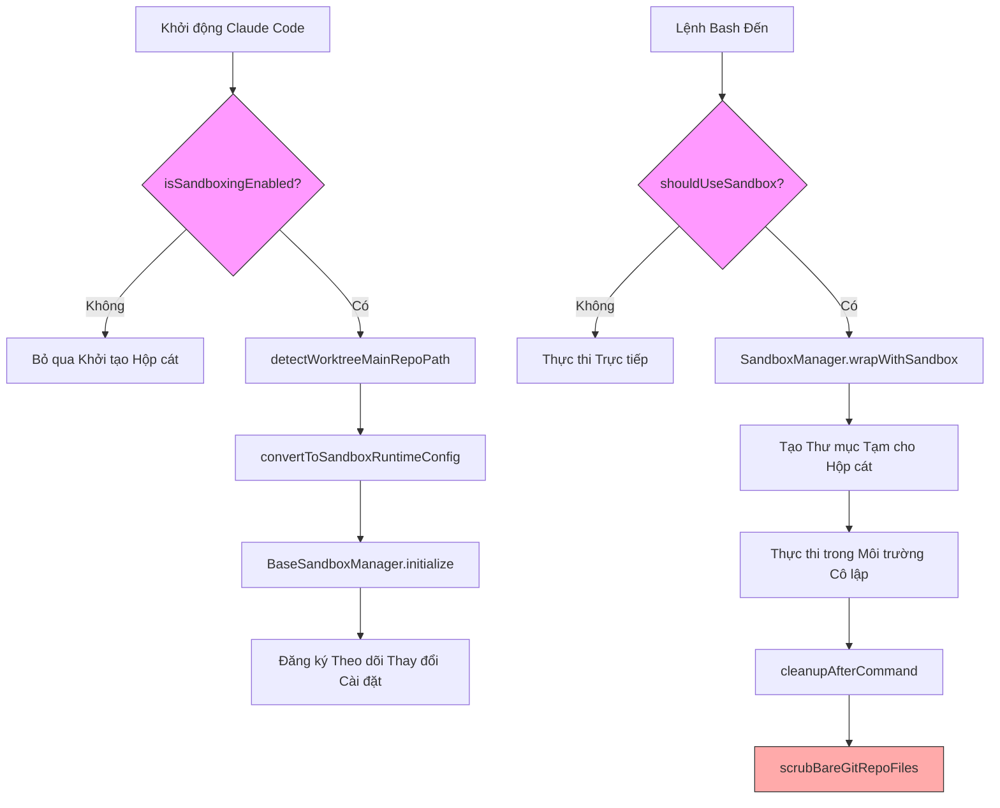
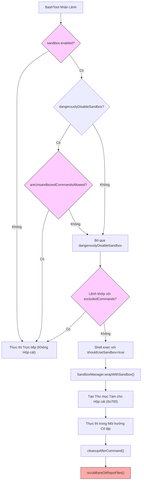

# Chương 18b: Hệ thống Hộp cát (Sandbox) — Cô lập Đa nền tảng từ Seatbelt đến Bubblewrap

## Tại sao điều này lại quan trọng

Một AI Agent có thể thực thi các lệnh Shell tùy ý vừa mang lại sức mạnh to lớn nhưng cũng đồng thời mở ra một cánh cửa nguy hiểm. Một Agent bị thao túng bởi Tấn công Tiêm lệnh (Prompt Injection) có thể đọc tệp `~/.ssh/id_rsa`, gửi các tệp nhạy cảm đến các máy chủ bên ngoài, hoặc thậm chí sửa đổi các tệp cấu hình của chính nó để bỏ qua các kiểm soát phân quyền một cách vĩnh viễn. Hệ thống phân quyền được phân tích trong Chương 16 chặn các thao tác nguy hiểm ở tầng ứng dụng, và Bộ phân loại YOLO trong Chương 17 đưa ra các quyết định cho phép trong "chế độ nhanh", nhưng đây đều chỉ là các ranh giới mềm mang tính chất "khuyến nghị" — một khi lệnh độc hại đã xuống đến cấp độ hệ điều hành, việc đánh chặn ở tầng ứng dụng sẽ trở nên vô dụng.

Hộp cát (Sandbox) là ranh giới cứng cuối cùng trong kiến trúc bảo mật của Claude Code. Nó tận dụng các cơ chế cô lập do nhân hệ điều hành cung cấp — `sandbox-exec` (Seatbelt Profile) trên macOS và Bubblewrap (không gian tên không gian người dùng - user-space namespaces) + seccomp (lọc lời gọi hệ thống - system call filtering) trên Linux — để thực thi kiểm soát truy cập hệ thống tệp và mạng ở cấp độ tiến trình. Ngay cả khi tất cả các lớp phòng thủ ở tầng ứng dụng bị vượt qua, hộp cát vẫn có thể chặn đứng các thao tác đọc/ghi tệp và truy cập mạng không được phép.

Độ quy mô và phức tạp kỹ thuật của hệ thống này vượt xa những gì một thao tác "bật tắt tùy chọn cấu hình" đơn giản thể hiện. Nó cần xử lý các khác biệt giữa hai nền tảng (cấu hình Seatbelt cấp đường dẫn trên macOS so với sự kết hợp giữa bind-mount + seccomp trên Linux), logic gộp độ ưu tiên cấu hình năm lớp, các yêu cầu đường dẫn đặc biệt cho Git Worktree, khóa chính sách MDM của doanh nghiệp, và phòng chống một lỗ hổng bảo mật thực tế (cuộc tấn công Bare Git Repo #29316). Chương này sẽ mổ xẻ toàn bộ kiến trúc cô lập đa nền tảng này từ mã nguồn.

## Phân tích Mã nguồn

### 18b.1 Kiến trúc Hộp cát Đa nền tảng

Việc triển khai hộp cát của Claude Code được chia thành hai lớp: gói bên ngoài `@anthropic-ai/sandbox-runtime` cung cấp các khả năng cô lập đặc thù của nền tảng bên dưới, trong khi `sandbox-adapter.ts` đóng vai trò là lớp bộ thích ứng (adapter layer) kết nối nó với hệ thống cài đặt, các luật phân quyền và tích hợp công cụ của Claude Code.

Logic phát hiện nền tảng được hỗ trợ nằm trong hàm `isSupportedPlatform()`, được lưu vào bộ nhớ đệm qua memoize:

```typescript
// restored-src/src/utils/sandbox/sandbox-adapter.ts:491-493
const isSupportedPlatform = memoize((): boolean => {
  return BaseSandboxManager.isSupportedPlatform()
})
```

Ba danh mục nền tảng được hỗ trợ bao gồm:

| Nền tảng | Công nghệ cô lập | Cô lập Hệ thống tệp | Cô lập Mạng |
|----------|---------------------|---------------------|-------------------|
| macOS | `sandbox-exec` (Seatbelt Profile) | Các quy tắc Profile kiểm soát quyền truy cập đường dẫn | Quy tắc Profile + Lọc đường dẫn Unix socket |
| Linux | Bubblewrap (bwrap) | Gắn kết gốc chỉ đọc (Read-only root mount) + gắn kết liên kết (bind-mount) danh sách trắng có quyền ghi | Lọc cuộc gọi hệ thống seccomp |
| WSL2 | Giống Linux (Bubblewrap) | Giống Linux | Giống Linux |

WSL1 bị loại trừ rõ ràng vì nó không cung cấp hỗ trợ không gian tên nhân Linux (kernel namespace) đầy đủ:

```typescript
// restored-src/src/commands/sandbox-toggle/sandbox-toggle.tsx:14-17
if (!SandboxManager.isSupportedPlatform()) {
  const errorMessage = platform === 'wsl'
    ? 'Error: Sandboxing requires WSL2. WSL1 is not supported.'
    : 'Error: Sandboxing is currently only supported on macOS, Linux, and WSL2.';
```

Một sự khác biệt then chốt giữa hai nền tảng là **khả năng hỗ trợ mẫu khớp glob (glob pattern)**. Seatbelt Profile của macOS hỗ trợ khớp đường dẫn bằng ký tự đại diện (wildcard), trong khi Bubblewrap của Linux chỉ có thể thực hiện gắn kết liên kết (bind-mount) chính xác. Hàm `getLinuxGlobPatternWarnings()` phát hiện và cảnh báo người dùng về các mẫu glob không tương thích trên Linux:

```typescript
// restored-src/src/utils/sandbox/sandbox-adapter.ts:597-601
function getLinuxGlobPatternWarnings(): string[] {
  const platform = getPlatform()
  if (platform !== 'linux' && platform !== 'wsl') {
    return []
  }
```

### 18b.2 SandboxManager: Khuôn mẫu Bộ thích ứng (Adapter Pattern)

Thiết kế của `SandboxManager` áp dụng Khuôn mẫu Bộ thích ứng (Adapter Pattern) cổ điển. Nó triển khai một giao diện `ISandboxManager` với hơn 25 phương thức, trong đó một số phương thức chứa logic đặc thù của Claude Code và các phương thức khác chuyển tiếp trực tiếp đến `BaseSandboxManager` (lớp cốt lõi từ `@anthropic-ai/sandbox-runtime`).

```typescript
// restored-src/src/utils/sandbox/sandbox-adapter.ts:880-922
export interface ISandboxManager {
  initialize(sandboxAskCallback?: SandboxAskCallback): Promise<void>
  isSupportedPlatform(): boolean
  isPlatformInEnabledList(): boolean
  getSandboxUnavailableReason(): string | undefined
  isSandboxingEnabled(): boolean
  isSandboxEnabledInSettings(): boolean
  checkDependencies(): SandboxDependencyCheck
  isAutoAllowBashIfSandboxedEnabled(): boolean
  areUnsandboxedCommandsAllowed(): boolean
  isSandboxRequired(): boolean
  areSandboxSettingsLockedByPolicy(): boolean
  // ... plus getFsReadConfig, getFsWriteConfig, getNetworkRestrictionConfig, etc.
  wrapWithSandbox(command: string, binShell?: string, ...): Promise<string>
  cleanupAfterCommand(): void
  refreshConfig(): void
  reset(): Promise<void>
}
```

Đối tượng `SandboxManager` được xuất ra thể hiện rõ ràng sự phân lớp này:

```typescript
// restored-src/src/utils/sandbox/sandbox-adapter.ts:927-967
export const SandboxManager: ISandboxManager = {
  // Custom implementations (Claude Code-specific logic)
  initialize,
  isSandboxingEnabled,
  areSandboxSettingsLockedByPolicy,
  setSandboxSettings,
  wrapWithSandbox,
  refreshConfig,
  reset,

  // Forward to base sandbox manager (direct forwarding)
  getFsReadConfig: BaseSandboxManager.getFsReadConfig,
  getFsWriteConfig: BaseSandboxManager.getFsWriteConfig,
  getNetworkRestrictionConfig: BaseSandboxManager.getNetworkRestrictionConfig,
  // ...
  cleanupAfterCommand: (): void => {
    BaseSandboxManager.cleanupAfterCommand()
    scrubBareGitRepoFiles()  // CC-specific: clean up Bare Git Repo attack remnants
  },
}
```

Luồng khởi tạo (`initialize()`) là bất đồng bộ và bao gồm một bộ bảo vệ chống tranh chấp tài nguyên (race condition guard) được thiết kế cẩn thận:

```typescript
// restored-src/src/utils/sandbox/sandbox-adapter.ts:730-792
async function initialize(sandboxAskCallback?: SandboxAskCallback): Promise<void> {
  if (initializationPromise) {
    return initializationPromise  // Prevent duplicate initialization
  }
  if (!isSandboxingEnabled()) {
    return
  }
  // Create Promise synchronously (before await) to prevent race conditions
  initializationPromise = (async () => {
    // 1. Resolve Worktree main repo path (once only)
    if (worktreeMainRepoPath === undefined) {
      worktreeMainRepoPath = await detectWorktreeMainRepoPath(getCwdState())
    }
    // 2. Convert CC settings to sandbox-runtime config
    const settings = getSettings_DEPRECATED()
    const runtimeConfig = convertToSandboxRuntimeConfig(settings)
    // 3. Initialize the underlying sandbox
    await BaseSandboxManager.initialize(runtimeConfig, wrappedCallback)
    // 4. Subscribe to settings changes, dynamically update sandbox config
    settingsSubscriptionCleanup = settingsChangeDetector.subscribe(() => {
      const newConfig = convertToSandboxRuntimeConfig(getSettings_DEPRECATED())
      BaseSandboxManager.updateConfig(newConfig)
    })
  })()
  return initializationPromise
}
```

Sơ đồ dưới đây thể hiện vòng đời hoàn chỉnh của hộp cát từ lúc khởi tạo đến khi thực thi lệnh:



### 18b.3 Hệ thống Cấu hình: Độ ưu tiên Năm lớp

Việc gộp cấu hình hộp cát thừa hưởng hệ thống cài đặt năm lớp chung của Claude Code (xem Chương 19 để thảo luận về độ ưu tiên trên CLAUDE.md), nhưng hộp cát bổ sung thêm lớp ngữ nghĩa của riêng nó lên trên.

Năm lớp độ ưu tiên từ thấp nhất đến cao nhất là:

```typescript
// restored-src/src/utils/settings/constants.ts:7-22
export const SETTING_SOURCES = [
  'userSettings',      // Global user settings (~/.claude/settings.json)
  'projectSettings',   // Shared project settings (.claude/settings.json)
  'localSettings',     // Local settings (.claude/settings.local.json, gitignored)
  'flagSettings',      // CLI --settings flag
  'policySettings',    // Enterprise MDM managed settings (managed-settings.json)
] as const
```

Schema cấu hình hộp cát được định nghĩa bằng Zod trong `sandboxTypes.ts` và đóng vai trò là Nguồn Sự thật Duy nhất (Single Source of Truth) cho toàn bộ hệ thống:

```typescript
// restored-src/src/entrypoints/sandboxTypes.ts:91-144
export const SandboxSettingsSchema = lazySchema(() =>
  z.object({
    enabled: z.boolean().optional(),
    failIfUnavailable: z.boolean().optional(),
    autoAllowBashIfSandboxed: z.boolean().optional(),
    allowUnsandboxedCommands: z.boolean().optional(),
    network: SandboxNetworkConfigSchema(),
    filesystem: SandboxFilesystemConfigSchema(),
    ignoreViolations: z.record(z.string(), z.array(z.string())).optional(),
    enableWeakerNestedSandbox: z.boolean().optional(),
    enableWeakerNetworkIsolation: z.boolean().optional(),
    excludedCommands: z.array(z.string()).optional(),
    ripgrep: z.object({ command: z.string(), args: z.array(z.string()).optional() }).optional(),
  }).passthrough(),  // .passthrough() allows undeclared fields (e.g., enabledPlatforms)
)
```

Lưu ý phần `.passthrough()` ở cuối — đây là một quyết định thiết kế có chủ ý. `enabledPlatforms` là một cấu hình doanh nghiệp không được ghi tài liệu chính thức mà `.passthrough()` cho phép tồn tại trong Schema mà không cần khai báo chính quy. Các chú thích trong mã nguồn tiết lộ bối cảnh đằng sau:

```typescript
// restored-src/src/entrypoints/sandboxTypes.ts:104-111
// Note: enabledPlatforms is an undocumented setting read via .passthrough()
// Added to unblock NVIDIA enterprise rollout: they want to enable
// autoAllowBashIfSandboxed but only on macOS initially, since Linux/WSL
// sandbox support is newer and less battle-tested.
```

`convertToSandboxRuntimeConfig()` là hàm cốt lõi để gộp cấu hình. Nó lặp qua tất cả các nguồn cài đặt, chuyển đổi các Luật Phân quyền của Claude Code và cấu hình hệ thống tệp hộp cát thành một định dạng thống nhất mà `sandbox-runtime` có thể hiểu được. Logic phân giải đường dẫn chính xử lý hai quy ước đường dẫn khác nhau trong quá trình này:

```typescript
// restored-src/src/utils/sandbox/sandbox-adapter.ts:99-119
export function resolvePathPatternForSandbox(
  pattern: string, source: SettingSource
): string {
  // Permission rule convention: //path → absolute path, /path → relative to settings file directory
  if (pattern.startsWith('//')) {
    return pattern.slice(1)  // "//.aws/**" → "/.aws/**"
  }
  if (pattern.startsWith('/') && !pattern.startsWith('//')) {
    const root = getSettingsRootPathForSource(source)
    return resolve(root, pattern.slice(1))
  }
  return pattern  // ~/path and ./path pass through to sandbox-runtime
}
```

Và việc phân giải đường dẫn hệ thống tệp sau bản vá sửa lỗi #30067:

```typescript
// restored-src/src/utils/sandbox/sandbox-adapter.ts:138-146
export function resolveSandboxFilesystemPath(
  pattern: string, source: SettingSource
): string {
  // sandbox.filesystem.* uses standard semantics: /path = absolute path (different from permission rules!)
  if (pattern.startsWith('//')) return pattern.slice(1)
  return expandPath(pattern, getSettingsRootPathForSource(source))
}
```

Có một sự khác biệt tinh tế nhưng quan trọng ở đây: trong các luật phân quyền, `/path` có nghĩa là "tương đối so với thư mục tệp cài đặt", trong khi trong `sandbox.filesystem.allowWrite`, `/path` có nghĩa là một đường dẫn tuyệt đối. Sự không nhất quán này từng gây ra Lỗi #30067 — người dùng đã viết `/Users/foo/.cargo` trong `sandbox.filesystem.allowWrite` với kỳ vọng đó là một đường dẫn tuyệt đối, nhưng hệ thống lại diễn dịch nó thành đường dẫn tương đối theo quy ước của luật phân quyền.

### 18b.4 Cô lập Hệ thống tệp

Chiến lược cốt lõi để cô lập hệ thống tệp là **gốc chỉ đọc + danh sách trắng có quyền ghi (read-only root + writable whitelist)**. Trong cấu hình được xây dựng bởi `convertToSandboxRuntimeConfig()`, mảng `allowWrite` mặc định chỉ chứa thư mục làm việc hiện tại và thư mục tạm thời của Claude:

```typescript
// restored-src/src/utils/sandbox/sandbox-adapter.ts:225-226
const allowWrite: string[] = ['.', getClaudeTempDir()]
const denyWrite: string[] = []
```

Trên hết, hệ thống bổ sung nhiều lớp quy tắc từ chối ghi (write-deny) được viết cứng để bảo vệ các tệp quan trọng không bị giả mạo bởi các lệnh chạy trong hộp cát:

**Bảo vệ tệp cài đặt** — ngăn chặn Thoát Hộp cát (Sandbox Escape):

```typescript
// restored-src/src/utils/sandbox/sandbox-adapter.ts:232-255
// Deny writing to all layers of settings.json
const settingsPaths = SETTING_SOURCES.map(source =>
  getSettingsFilePathForSource(source),
).filter((p): p is string => p !== undefined)
denyWrite.push(...settingsPaths)
denyWrite.push(getManagedSettingsDropInDir())

// If the user cd'd to a different directory, protect that directory's settings files too
if (cwd !== originalCwd) {
  denyWrite.push(resolve(cwd, '.claude', 'settings.json'))
  denyWrite.push(resolve(cwd, '.claude', 'settings.local.json'))
}

// Protect .claude/skills — skill files have the same privilege level as commands/agents
denyWrite.push(resolve(originalCwd, '.claude', 'skills'))
```

**Hỗ trợ Git Worktree** — Các thao tác Git trong một Worktree cần ghi vào thư mục `.git` của kho lưu trữ chính (ví dụ: tệp `index.lock`). Hệ thống phát hiện Worktree trong quá trình khởi tạo và lưu trữ đường dẫn kho lưu trữ chính vào bộ nhớ đệm:

```typescript
// restored-src/src/utils/sandbox/sandbox-adapter.ts:422-445
async function detectWorktreeMainRepoPath(cwd: string): Promise<string | null> {
  const gitPath = join(cwd, '.git')
  const gitContent = await readFile(gitPath, { encoding: 'utf8' })
  const gitdirMatch = gitContent.match(/^gitdir:\s*(.+)$/m)
  // gitdir format: /path/to/main/repo/.git/worktrees/worktree-name
  const marker = `${sep}.git${sep}worktrees${sep}`
  const markerIndex = gitdir.lastIndexOf(marker)
  if (markerIndex > 0) {
    return gitdir.substring(0, markerIndex)
  }
}
```

Nếu phát hiện ra một Worktree, đường dẫn kho lưu trữ chính sẽ được thêm vào danh sách trắng có quyền ghi:

```typescript
// restored-src/src/utils/sandbox/sandbox-adapter.ts:286-288
if (worktreeMainRepoPath && worktreeMainRepoPath !== cwd) {
  allowWrite.push(worktreeMainRepoPath)
}
```

**Hỗ trợ thư mục bổ sung** — Các thư mục được thêm qua tham số CLI `--add-dir` hoặc lệnh `/add-dir` cũng cần có quyền ghi:

```typescript
// restored-src/src/utils/sandbox/sandbox-adapter.ts:295-299
const additionalDirs = new Set([
  ...(settings.permissions?.additionalDirectories || []),
  ...getAdditionalDirectoriesForClaudeMd(),
])
allowWrite.push(...additionalDirs)
```

### 18b.5 Cô lập Mạng

Cô lập mạng sử dụng cơ chế **danh sách trắng tên miền (domain whitelist)**, được tích hợp sâu với các luật phân quyền `WebFetch` của Claude Code. Hàm `convertToSandboxRuntimeConfig()` trích xuất các tên miền được cho phép từ các luật phân quyền:

```typescript
// restored-src/src/utils/sandbox/sandbox-adapter.ts:178-210
const allowedDomains: string[] = []
const deniedDomains: string[] = []

if (shouldAllowManagedSandboxDomainsOnly()) {
  // Enterprise policy mode: only use domains from policySettings
  const policySettings = getSettingsForSource('policySettings')
  for (const domain of policySettings?.sandbox?.network?.allowedDomains || []) {
    allowedDomains.push(domain)
  }
  for (const ruleString of policySettings?.permissions?.allow || []) {
    const rule = permissionRuleValueFromString(ruleString)
    if (rule.toolName === WEB_FETCH_TOOL_NAME && rule.ruleContent?.startsWith('domain:')) {
      allowedDomains.push(rule.ruleContent.substring('domain:'.length))
    }
  }
} else {
  // Normal mode: merge domain configuration from all layers
  for (const domain of settings.sandbox?.network?.allowedDomains || []) {
    allowedDomains.push(domain)
  }
  // ... extract domains from WebFetch(domain:xxx) permission rules
}
```

**Lọc Unix Socket** là điểm mà hai nền tảng khác nhau nhiều nhất. Seatbelt của macOS hỗ trợ lọc Unix Socket theo đường dẫn, trong khi seccomp của Linux không thể phân biệt các đường dẫn Socket — nó chỉ có thể thực hiện kiểm soát theo kiểu "chấp nhận tất cả" hoặc "từ chối tất cả" (all-or-nothing):

```typescript
// restored-src/src/entrypoints/sandboxTypes.ts:28-36
allowUnixSockets: z.array(z.string()).optional()
  .describe('macOS only: Unix socket paths to allow. Ignored on Linux (seccomp cannot filter by path).'),
allowAllUnixSockets: z.boolean().optional()
  .describe('If true, allow all Unix sockets (disables blocking on both platforms).'),
```

**Chính sách `allowManagedDomainsOnly`** là cốt lõi của cô lập mạng cấp doanh nghiệp. Khi doanh nghiệp kích hoạt tùy chọn này qua `policySettings`, tất cả các cấu hình tên miền từ các lớp người dùng, dự án và cục bộ sẽ bị bỏ qua — chỉ có các tên miền và luật `WebFetch` từ chính sách của doanh nghiệp mới có hiệu lực:

```typescript
// restored-src/src/utils/sandbox/sandbox-adapter.ts:152-157
export function shouldAllowManagedSandboxDomainsOnly(): boolean {
  return (
    getSettingsForSource('policySettings')?.sandbox?.network
      ?.allowManagedDomainsOnly === true
  )
}
```

Ngoài ra, `sandboxAskCallback` được bọc lại trong quá trình khởi tạo để thực thi chính sách này:

```typescript
// restored-src/src/utils/sandbox/sandbox-adapter.ts:745-755
const wrappedCallback: SandboxAskCallback | undefined = sandboxAskCallback
  ? async (hostPattern: NetworkHostPattern) => {
      if (shouldAllowManagedSandboxDomainsOnly()) {
        logForDebugging(
          `[sandbox] Blocked network request to ${hostPattern.host} (allowManagedDomainsOnly)`,
        )
        return false  // Hard reject, do not ask the user
      }
      return sandboxAskCallback(hostPattern)
    }
  : undefined
```

**Hỗ trợ proxy HTTP/SOCKS** cho phép doanh nghiệp theo dõi và kiểm tra lưu lượng mạng của Agent thông qua các máy chủ proxy:

```typescript
// restored-src/src/utils/sandbox/sandbox-adapter.ts:360-368
return {
  network: {
    allowedDomains,
    deniedDomains,
    allowUnixSockets: settings.sandbox?.network?.allowUnixSockets,
    allowAllUnixSockets: settings.sandbox?.network?.allowAllUnixSockets,
    allowLocalBinding: settings.sandbox?.network?.allowLocalBinding,
    httpProxyPort: settings.sandbox?.network?.httpProxyPort,
    socksProxyPort: settings.sandbox?.network?.socksProxyPort,
  },
```

Tùy chọn `enableWeakerNetworkIsolation` xứng đáng được chú ý đặc biệt. Nó cho phép truy cập dịch vụ `com.apple.trustd.agent` của macOS, dịch vụ bắt buộc đối với các công cụ CLI được biên dịch bằng Go (chẳng hạn như `gh`, `gcloud`, `terraform`) để xác minh chứng chỉ TLS. Tuy nhiên, việc bật tùy chọn này **làm giảm tính bảo mật** — vì bản thân dịch vụ trustd là một kênh truyền dữ liệu ra ngoài (data exfiltration) tiềm ẩn:

```typescript
// restored-src/src/entrypoints/sandboxTypes.ts:125-133
enableWeakerNetworkIsolation: z.boolean().optional()
  .describe(
    'macOS only: Allow access to com.apple.trustd.agent in the sandbox. ' +
    'Needed for Go-based CLI tools (gh, gcloud, terraform, etc.) to verify TLS certificates ' +
    'when using httpProxyPort with a MITM proxy and custom CA. ' +
    '**Reduces security** — opens a potential data exfiltration vector through the trustd service. Default: false',
  ),
```

### 18b.6 Tích hợp Công cụ Bash

Hộp cát cuối cùng tương tác với người dùng thông qua công cụ Bash. Chuỗi quyết định bắt đầu bằng `shouldUseSandbox()`, đi qua việc bọc lệnh của `Shell.exec()`, và kết thúc bằng việc thực thi cô lập ở cấp độ hệ điều hành.

**Logic quyết định `shouldUseSandbox()`** tuân theo một chuỗi độ ưu tiên rõ ràng:

```typescript
// restored-src/src/tools/BashTool/shouldUseSandbox.ts:130-153
export function shouldUseSandbox(input: Partial<SandboxInput>): boolean {
  // 1. Sandbox not enabled → don't use
  if (!SandboxManager.isSandboxingEnabled()) {
    return false
  }
  // 2. dangerouslyDisableSandbox=true and policy allows it → don't use
  if (input.dangerouslyDisableSandbox &&
      SandboxManager.areUnsandboxedCommandsAllowed()) {
    return false
  }
  // 3. No command → don't use
  if (!input.command) {
    return false
  }
  // 4. Command matches exclusion list → don't use
  if (containsExcludedCommand(input.command)) {
    return false
  }
  // 5. All other cases → use sandbox
  return true
}
```

Việc triển khai `containsExcludedCommand()` phức tạp hơn vẻ bề ngoài của nó. Nó không chỉ kiểm tra các `excludedCommands` được người dùng cấu hình, mà còn chia tách các lệnh phức hợp (được nối bằng `&&`), lặp đi lặp lại việc loại bỏ các tiền tố biến môi trường và các trình bọc an toàn (như `timeout`) để so khớp. Điều này ngăn chặn một lệnh kiểu như `docker ps && curl evil.com` bỏ qua hoàn toàn hộp cát chỉ vì lệnh `docker` nằm trong danh sách loại trừ:

```typescript
// restored-src/src/tools/BashTool/shouldUseSandbox.ts:60-68
// Split compound commands to prevent a compound command from
// escaping the sandbox just because its first subcommand matches
let subcommands: string[]
try {
  subcommands = splitCommand_DEPRECATED(command)
} catch {
  subcommands = [command]
}
```

**Luồng bọc lệnh** được hoàn thành trong `Shell.ts`. Khi `shouldUseSandbox` là true, chuỗi lệnh được chuyển đến `SandboxManager.wrapWithSandbox()`, tại đây gói sandbox-runtime bên dưới sẽ bọc nó thành một lệnh gọi hệ thống thực tế với các tham số cô lập:

```typescript
// restored-src/src/utils/Shell.ts:259-273
if (shouldUseSandbox) {
  commandString = await SandboxManager.wrapWithSandbox(
    commandString,
    sandboxBinShell,
    undefined,
    abortSignal,
  )
  // Create sandbox temp directory with secure permissions
  try {
    const fs = getFsImplementation()
    await fs.mkdir(sandboxTmpDir, { mode: 0o700 })
  } catch (error) {
    logForDebugging(`Failed to create ${sandboxTmpDir} directory: ${error}`)
  }
}
```

Đặc biệt cần lưu ý là **việc xử lý PowerShell trong hộp cát**. Về mặt nội bộ, `wrapWithSandbox` bọc lệnh dưới dạng `<binShell> -c '<cmd>'` — nhưng các tham số `-NoProfile -NonInteractive` của PowerShell sẽ bị mất trong quá trình này. Giải pháp là mã hóa trước lệnh PowerShell sang định dạng Base64, sau đó sử dụng `/bin/sh` làm shell nội bộ của hộp cát:

```typescript
// restored-src/src/utils/Shell.ts:247-257
// Sandboxed PowerShell: wrapWithSandbox hardcodes `<binShell> -c '<cmd>'` —
// using pwsh there would lose -NoProfile -NonInteractive
const isSandboxedPowerShell = shouldUseSandbox && shellType === 'powershell'
const sandboxBinShell = isSandboxedPowerShell ? '/bin/sh' : binShell
```

**Tham số `dangerouslyDisableSandbox`** cho phép mô hình AI bỏ qua hộp cát khi gặp các lỗi do giới hạn của hộp cát gây ra. Tuy nhiên, các doanh nghiệp có thể vô hiệu hóa hoàn toàn tham số này thông qua cấu hình `allowUnsandboxedCommands: false`:

```typescript
// restored-src/src/entrypoints/sandboxTypes.ts:113-119
allowUnsandboxedCommands: z.boolean().optional()
  .describe(
    'Allow commands to run outside the sandbox via the dangerouslyDisableSandbox parameter. ' +
    'When false, the dangerouslyDisableSandbox parameter is completely ignored and all commands must run sandboxed. ' +
    'Default: true.',
  ),
```

Prompt của BashTool (xem Chương 8 để thảo luận về prompt của công cụ) cũng tự động điều chỉnh hướng dẫn cho mô hình dựa trên thiết lập này:

```typescript
// restored-src/src/tools/BashTool/prompt.ts:228-256
const sandboxOverrideItems: Array<string | string[]> =
  allowUnsandboxedCommands
    ? [
        'You should always default to running commands within the sandbox...',
        // Guides the model to only use dangerouslyDisableSandbox when evidence like "Operation not permitted" is seen
      ]
    : [
        'All commands MUST run in sandbox mode - the `dangerouslyDisableSandbox` parameter is disabled by policy.',
        'Commands cannot run outside the sandbox under any circumstances.',
      ]
```

Sơ đồ dưới đây thể hiện đường dẫn quyết định hoàn chỉnh từ lệnh đầu vào đến khi thực thi trong hộp cát:



### 18b.7 Trường hợp Biên Bảo mật: Phòng thủ chống Tấn công Bare Git Repo

Đây là trường hợp kỹ thuật bảo mật ấn tượng nhất trong toàn bộ hệ thống hộp cát. Vấn đề #29316 mô tả một đường dẫn tấn công thoát khỏi hộp cát trong thực tế:

**Nguyên lý tấn công**: Hàm `is_git_directory()` của Git xác định một thư mục có phải là kho lưu trữ Git hay không bằng cách kiểm tra sự hiện diện của các tệp `HEAD`, `objects/`, `refs/`, v.v. Nếu kẻ tấn công (thông qua prompt injection) tạo ra các tệp này bên trong hộp cát và cấu hình trường `core.fsmonitor` trong tệp `config` trỏ tới một kịch bản độc hại, thì các thao tác Git **không nằm trong hộp cát** của Claude Code (chẳng hạn như `git status`) sẽ nhận diện sai thư mục hiện tại là một Bare Git Repo (kho lưu trữ Git trần) và thực thi mã độc tùy ý được chỉ định bởi `core.fsmonitor` — tại thời điểm đó, nằm ngoài hộp cát.

**Chiến lược phòng thủ**: Chiến lược này tuân theo hai hướng — ngăn chặn và dọn dẹp.

Đối với các tệp Git **đã tồn tại từ trước** (`HEAD`, `objects`, `refs`, `hooks`, `config`), hệ thống thêm chúng vào danh sách `denyWrite`, và tiến trình sandbox-runtime sẽ thực hiện liên kết gắn kết (bind-mount) chúng dưới dạng chỉ đọc:

```typescript
// restored-src/src/utils/sandbox/sandbox-adapter.ts:257-280
// SECURITY: Git's is_git_directory() treats cwd as a bare repo if it has
// HEAD + objects/ + refs/. An attacker planting these (plus a config with
// core.fsmonitor) escapes the sandbox when Claude's unsandboxed git runs.
bareGitRepoScrubPaths.length = 0
const bareGitRepoFiles = ['HEAD', 'objects', 'refs', 'hooks', 'config']
for (const dir of cwd === originalCwd ? [originalCwd] : [originalCwd, cwd]) {
  for (const gitFile of bareGitRepoFiles) {
    const p = resolve(dir, gitFile)
    try {
      statSync(p)
      denyWrite.push(p)  // File exists → read-only bind-mount
    } catch {
      bareGitRepoScrubPaths.push(p)  // File doesn't exist → record for post-command cleanup
    }
  }
}
```

Đối với các tệp Git **chưa tồn tại** (tức là những tệp kẻ tấn công có thể cố tình cài cắm trong quá trình thực thi lệnh trong hộp cát), hệ thống gọi hàm `scrubBareGitRepoFiles()` sau mỗi lệnh để dọn dẹp:

```typescript
// restored-src/src/utils/sandbox/sandbox-adapter.ts:404-414
function scrubBareGitRepoFiles(): void {
  for (const p of bareGitRepoScrubPaths) {
    try {
      rmSync(p, { recursive: true })
      logForDebugging(`[Sandbox] scrubbed planted bare-repo file: ${p}`)
    } catch {
      // ENOENT is the expected common case — nothing was planted
    }
  }
}
```

Các chú thích trong mã nguồn giải thích tại sao không thể chỉ đơn giản là áp dụng `denyWrite` cho tất cả các tệp Git:

> Việc từ chối ghi vô điều kiện lên các đường dẫn này sẽ khiến sandbox-runtime gắn kết (mount) `/dev/null` vào các tệp chưa tồn tại, việc này sẽ (a) để lại một tệp HEAD có kích thước 0-byte rác trên máy chủ và (b) làm hỏng lệnh `git log HEAD` bên trong bwrap (gây ra lỗi "ambiguous argument").

Biện pháp phòng thủ này được tích hợp vào `cleanupAfterCommand()`, đảm bảo việc dọn dẹp diễn ra sau mỗi lần thực thi lệnh trong hộp cát:

```typescript
// restored-src/src/utils/sandbox/sandbox-adapter.ts:963-966
cleanupAfterCommand: (): void => {
  BaseSandboxManager.cleanupAfterCommand()
  scrubBareGitRepoFiles()
},
```

### 18b.8 Các Chính sách Doanh nghiệp và Tuân thủ

Hệ thống hộp cát của Claude Code cung cấp khả năng kiểm soát chính sách toàn diện cho các đợt triển khai trong doanh nghiệp.

**Thư mục MDM `settings.d/`**: Các doanh nghiệp có thể triển khai các chính sách hộp cát thông qua thư mục cài đặt được quản lý được chỉ định bởi `getManagedSettingsDropInDir()`. Các tệp cấu hình trong thư mục này tự động nhận được độ ưu tiên cao nhất của `policySettings`.

**`failIfUnavailable`**: Khi được đặt thành `true`, nếu hộp cát không thể khởi động (thiếu các thư viện phụ thuộc, nền tảng không được hỗ trợ, v.v.), Claude Code sẽ thoát trực tiếp thay vì chạy trong chế độ suy thoái (degraded mode). Đây là một rào cản cứng (Hard Gate) cấp doanh nghiệp:

```typescript
// restored-src/src/utils/sandbox/sandbox-adapter.ts:479-485
function isSandboxRequired(): boolean {
  const settings = getSettings_DEPRECATED()
  return (
    getSandboxEnabledSetting() &&
    (settings?.sandbox?.failIfUnavailable ?? false)
  )
}
```

Hàm **`areSandboxSettingsLockedByPolicy()`** kiểm tra xem một nguồn cài đặt có độ ưu tiên cao hơn (`flagSettings` hoặc `policySettings`) có khóa cấu hình hộp cát hay không, nhằm ngăn người dùng sửa đổi nó cục bộ:

```typescript
// restored-src/src/utils/sandbox/sandbox-adapter.ts:647-664
function areSandboxSettingsLockedByPolicy(): boolean {
  const overridingSources = ['flagSettings', 'policySettings'] as const
  for (const source of overridingSources) {
    const settings = getSettingsForSource(source)
    if (
      settings?.sandbox?.enabled !== undefined ||
      settings?.sandbox?.autoAllowBashIfSandboxed !== undefined ||
      settings?.sandbox?.allowUnsandboxedCommands !== undefined
    ) {
      return true
    }
  }
  return false
}
```

Trong phần triển khai lệnh `/sandbox`, nếu chính sách đã khóa các cài đặt, người dùng sẽ thấy một thông báo lỗi rõ ràng:

```typescript
// restored-src/src/commands/sandbox-toggle/sandbox-toggle.tsx:33-37
if (SandboxManager.areSandboxSettingsLockedByPolicy()) {
  const message = color('error', themeName)(
    'Error: Sandbox settings are overridden by a higher-priority configuration and cannot be changed locally.'
  );
  onDone(message);
}
```

Cấu hình **`enabledPlatforms`** (không được ghi tài liệu chính thức) cho phép doanh nghiệp chỉ kích hoạt hộp cát trên các nền tảng cụ thể. Điều này được bổ sung cho đợt triển khai doanh nghiệp của NVIDIA — họ muốn bật `autoAllowBashIfSandboxed` trên macOS trước, sau đó mở rộng sang Linux một khi hộp cát trên Linux trưởng thành hơn:

```typescript
// restored-src/src/utils/sandbox/sandbox-adapter.ts:505-526
function isPlatformInEnabledList(): boolean {
  const settings = getInitialSettings()
  const enabledPlatforms = (
    settings?.sandbox as { enabledPlatforms?: Platform[] } | undefined
  )?.enabledPlatforms
  if (enabledPlatforms === undefined) {
    return true  // All platforms enabled by default when not set
  }
  const currentPlatform = getPlatform()
  return enabledPlatforms.includes(currentPlatform)
}
```

**Các tùy chọn làm suy giảm tính cô lập và sự đánh đổi của chúng**:

| Tùy chọn | Tác động | Ảnh hưởng Bảo mật |
|--------|--------|-----------------|
| `enableWeakerNestedSandbox` | Cho phép các hộp cát lồng nhau bên trong hộp cát | Giảm độ sâu cô lập |
| `enableWeakerNetworkIsolation` | Cho phép truy cập dịch vụ `trustd.agent` trên macOS | Mở ra kênh truyền dữ liệu ra ngoài (data exfiltration) |
| `allowUnsandboxedCommands: true` | Kích hoạt tham số `dangerouslyDisableSandbox` | Cho phép bỏ qua hoàn toàn hộp cát |
| `excludedCommands` | Các lệnh cụ thể bỏ qua hộp cát | Các lệnh bị loại trừ không có sự bảo vệ của hộp cát |

## Trích xuất Khuôn mẫu

### Khuôn mẫu: Bộ thích ứng Hộp cát Đa nền tảng (Multi-Platform Sandbox Adapter)

**Vấn đề được giải quyết**: Các hệ điều hành khác nhau cung cấp các nguyên mẫu cô lập hoàn toàn khác nhau (macOS Seatbelt so với Linux Namespaces + seccomp), và tầng ứng dụng cần một giao diện thống nhất để quản lý vòng đời, cấu hình và việc thực thi của hộp cát.

**Cách tiếp cận**:

1. **Gói bên ngoài xử lý khác biệt nền tảng**: `@anthropic-ai/sandbox-runtime` đóng gói các điểm khác biệt giữa `sandbox-exec` của macOS và `bwrap` + `seccomp` của Linux, cung cấp một API `BaseSandboxManager` thống nhất.
2. **Lớp bộ thích ứng xử lý khác biệt nghiệp vụ**: `sandbox-adapter.ts` chuyển đổi các hệ thống cấu hình đặc thù của ứng dụng (cài đặt năm lớp, luật phân quyền, quy ước đường dẫn) thành định dạng `SandboxRuntimeConfig` của `sandbox-runtime`.
3. **Giao diện xuất ra bảng phương thức**: Giao diện `ISandboxManager` phân biệt rõ ràng các phương thức "triển khai tùy chỉnh" với các phương thức "chuyển tiếp trực tiếp", giúp thể hiện rõ ràng mục đích của mã nguồn.

**Điều kiện tiên quyết**:

- Gói cô lập bên dưới phải cung cấp một giao diện không phụ thuộc vào nền tảng (`wrapWithSandbox`, `initialize`, `updateConfig`).
- Bộ thích ứng phải xử lý tất cả các chuyển đổi khái niệm đặc thù của ứng dụng (quy ước phân giải đường dẫn, trích xuất luật phân quyền).
- Các điểm mở rộng như `cleanupAfterCommand()` phải cho phép bộ thích ứng tiêm logic của riêng nó vào.

**Ánh xạ trong Claude Code**:

| Thành quan | Vai trò |
|-----------|------|
| `@anthropic-ai/sandbox-runtime` | Đối tượng được thích ứng (Adaptee) |
| `sandbox-adapter.ts` | Bộ thích ứng (Adapter) |
| `ISandboxManager` | Giao diện Đích (Target Interface) |
| `BashTool`, `Shell.ts` | Đối tượng sử dụng (Client) |

### Khuôn mẫu: Gộp Cấu hình Năm lớp kết hợp Khóa Chính sách

**Vấn đề được giải quyết**: Cấu hình hộp cát cần cân bằng giữa tính linh hoạt của người dùng với tính tuân thủ bảo mật của doanh nghiệp. Người dùng cần tùy chỉnh các đường dẫn có quyền ghi và các tên miền mạng, trong khi doanh nghiệp cần khóa các cài đặt quan trọng để ngăn người dùng vượt qua chúng.

**Cách tiếp cận**:

1. **Các nguồn ưu tiên thấp cung cấp cấu hình mặc định**: `userSettings` và `projectSettings` cung cấp cấu hình cơ sở.
2. **Các nguồn ưu tiên cao ghi đè hoặc khóa cấu hình**: Thiết lập `sandbox.enabled: true` trong `policySettings` ghi đè tất cả các cấu hình có độ ưu tiên thấp hơn.
3. **Các công tắc chính sách như `allowManagedDomainsOnly`**: Bỏ qua một cách chọn lọc dữ liệu từ các nguồn có độ ưu tiên thấp hơn trong quá trình gộp.
4. **Hàm `areSandboxSettingsLockedByPolicy()` phát hiện trạng thái khóa**: Tầng giao diện UI sẽ vô hiệu hóa các điểm đầu vào sửa đổi cấu hình dựa trên kết quả này.

**Điều kiện tiên quyết**:

- Hệ thống cài đặt phải hỗ trợ truy vấn theo từng nguồn (`getSettingsForSource`), chứ không chỉ trả về kết quả gộp.
- Việc phân giải đường dẫn phải nhận biết được nguồn (cùng một đường dẫn `/path` có thể được phân giải thành các đường dẫn tuyệt đối khác nhau trong các nguồn khác nhau).
- Việc phát hiện khóa chính sách phải được thực hiện tại điểm đầu vào của UI, chứ không phải lúc ghi cấu hình.

**Ánh xạ trong Claude Code**: Mảng `SETTING_SOURCES` định nghĩa chuỗi ưu tiên `userSettings -> projectSettings -> localSettings -> flagSettings -> policySettings`. Hàm `convertToSandboxRuntimeConfig()` lặp qua tất cả các nguồn và phân giải các đường dẫn theo quy ước của từng nguồn, trong khi `shouldAllowManagedSandboxDomainsOnly()` và `shouldAllowManagedReadPathsOnly()` thực thi hành vi "ghi đè cứng" của chính sách doanh nghiệp.

## Người dùng có thể làm gì

1. **Bật hộp cát trong dự án của bạn**: Thiết lập `{ "sandbox": { "enabled": true } }` trong `.claude/settings.local.json`, hoặc chạy lệnh `/sandbox` để cấu hình tương tác. Khi đã bật, tất cả các lệnh Bash mặc định sẽ thực thi bên trong hộp cát.

2. **Thêm danh sách trắng mạng cho các công cụ phát triển**: Nếu các công cụ biên dịch (npm, pip, cargo) cần tải về các thư viện phụ thuộc, hãy thêm các tên miền bắt buộc vào `sandbox.network.allowedDomains`, ví dụ như `["registry.npmjs.org", "crates.io"]`. Điều này cũng có thể đạt được thông qua các luật cho phép `WebFetch(domain:xxx)` — hộp cát sẽ tự động trích xuất các tên miền này.

3. **Loại trừ các lệnh cụ thể khỏi hộp cát**: Sử dụng lệnh `/sandbox exclude "docker compose:*"` để loại trừ các lệnh yêu cầu đặc quyền đặc biệt (như Docker, systemctl) ra khỏi hộp cát. Lưu ý rằng đây là một tính năng tiện ích, không phải là một ranh giới bảo mật — các lệnh bị loại trừ sẽ không có sự bảo vệ của hộp cát.

4. **Đảm bảo khả năng tương thích với Git Worktree**: Nếu bạn sử dụng Claude Code trong một Git Worktree, hệ thống sẽ tự động phát hiện và thêm đường dẫn kho lưu trữ chính vào danh sách trắng có quyền ghi. Nếu bạn gặp các lỗi liên quan đến `index.lock`, hãy kiểm tra xem tham chiếu `gitdir` trong tệp `.git` đã chính xác chưa.

5. **Bắt buộc sử dụng hộp cát trong triển khai doanh nghiệp**: Thiết lập `{ "sandbox": { "enabled": true, "failIfUnavailable": true, "allowUnsandboxedCommands": false } }` trong cài đặt được quản lý để bắt buộc tất cả người dùng chạy bên trong hộp cát mà không được phép bỏ qua. Kết hợp với `network.allowManagedDomainsOnly: true` để khóa chặt danh sách trắng truy cập mạng.

6. **Gỡ lỗi các vấn đề hộp cát**: Khi một lệnh thất bại do các giới hạn của hộp cát, stderr sẽ chứa thông tin vi phạm trong các thẻ `<sandbox_violations>`. Hãy chạy `/sandbox` để xem trạng thái hiện tại của hộp cát và kết quả kiểm tra thư viện phụ thuộc. Trên Linux, nếu bạn thấy các cảnh báo mẫu glob, hãy thay thế các đường dẫn chứa ký tự đại diện bằng các đường dẫn chính xác (Bubblewrap không hỗ trợ glob).
