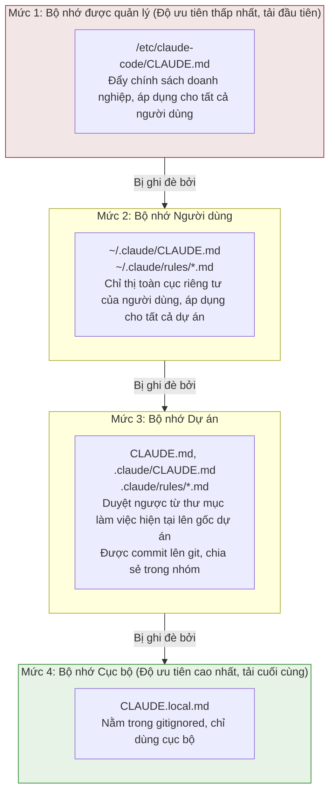

# Chương 19: CLAUDE.md — Các chỉ thị của Người dùng đóng vai trò Lớp Ghi đè

<p align="right">
  <a href="../../part5/ch19.html">Đọc bản gốc tiếng Trung</a>
</p>

## Tại sao điều này lại quan trọng

Nếu hệ thống Hooks (Chương 18) là kênh để người dùng mở rộng hành vi của Agent thông qua **việc thực thi mã**, thì CLAUDE.md là kênh để kiểm soát đầu ra của mô hình thông qua **các chỉ thị bằng ngôn ngữ tự nhiên**. Đây không phải là một "tệp cấu hình" đơn giản — nó là một hệ thống tiêm chỉ thị hoàn chỉnh với cơ chế xếp tầng (cascading) độ ưu tiên bốn cấp, nhúng tệp bắc cầu (transitive file inclusion), các quy tắc giới hạn phạm vi đường dẫn, loại bỏ chú thích HTML và khai báo ngữ nghĩa ghi đè rõ ràng.

Triết lý thiết kế của CLAUDE.md có thể được tóm tắt trong một câu: **Các chỉ thị của người dùng ghi đè lên hành vi mặc định của mô hình.** Đây không phải là lối nói cường điệu — nó thực sự được tiêm trực tiếp vào prompt hệ thống (system prompt):

```typescript
// claudemd.ts:89-91
const MEMORY_INSTRUCTION_PROMPT =
  'Codebase and user instructions are shown below. Be sure to adhere to these instructions. ' +
  'IMPORTANT: These instructions OVERRIDE any default behavior and you MUST follow them exactly as written.'
```

Chương này sẽ mổ xẻ toàn bộ chuỗi quy trình từ phát hiện tệp, xử lý nội dung đến việc tiêm cuối cùng vào prompt, kiểm tra quá trình triển khai mã nguồn của hệ thống này.

---

## 19.1 Độ ưu tiên Tải Bốn cấp

Hệ thống CLAUDE.md sử dụng một mô hình độ ưu tiên bốn cấp, được định nghĩa rõ ràng trong các chú thích ở đầu tệp `claudemd.ts` (dòng 1-26). Các tệp được tải theo **thứ tự độ ưu tiên ngược** — tệp được tải cuối cùng có độ ưu tiên cao nhất, bởi vì mô hình có độ "tập trung" (attention) cao hơn vào nội dung nằm ở cuối cuộc hội thoại:



### Triển khai quá trình Tải

Hàm `getMemoryFiles` (dòng 790-1075) triển khai logic tải hoàn chỉnh. Đây là một hàm bất đồng bộ được bọc bằng `memoize` — các kết quả sẽ được lưu vào bộ nhớ đệm sau lần gọi đầu tiên trong suốt vòng đời của tiến trình:

**Bước một: Bộ nhớ được quản lý (Managed Memory) (dòng 803-823)**

```typescript
// claudemd.ts:804-822
const managedClaudeMd = getMemoryPath('Managed')
result.push(
  ...(await processMemoryFile(managedClaudeMd, 'Managed', processedPaths, includeExternal)),
)
const managedClaudeRulesDir = getManagedClaudeRulesDir()
result.push(
  ...(await processMdRules({
    rulesDir: managedClaudeRulesDir,
    type: 'Managed',
    processedPaths,
    includeExternal,
    conditionalRule: false,
  })),
)
```

Đường dẫn Bộ nhớ được quản lý thường là `/etc/claude-code/CLAUDE.md` — vị trí tiêu chuẩn để bộ phận CNTT của doanh nghiệp đẩy các chính sách thông qua phần mềm MDM (Mobile Device Management).

**Bước hai: Bộ nhớ Người dùng (User Memory) (dòng 826-847)**

Chỉ được tải khi nguồn cấu hình `userSettings` được kích hoạt. Bộ nhớ Người dùng có một đặc quyền: thuộc tính `includeExternal` luôn là `true` (dòng 833), nghĩa là các chỉ thị `@include` trong CLAUDE.md cấp người dùng có thể tham chiếu đến các tệp nằm ngoài thư mục dự án.

**Bước ba: Bộ nhớ Dự án (Project Memory) (dòng 849-920)**

Đây là bước phức tạp nhất. Mã nguồn duyệt từ thư mục làm việc hiện tại CWD ngược lên gốc hệ thống tệp, thu thập `CLAUDE.md`, `.claude/CLAUDE.md`, và `.claude/rules/*.md` tại mọi cấp độ trên đường đi:

```typescript
// claudemd.ts:851-857
const dirs: string[] = []
const originalCwd = getOriginalCwd()
let currentDir = originalCwd
while (currentDir !== parse(currentDir).root) {
  dirs.push(currentDir)
  currentDir = dirname(currentDir)
}
```

Sau đó nó xử lý theo hướng từ gốc về phía CWD (dòng `dirs.reverse()` tại dòng 878), đảm bảo các tệp gần CWD hơn được tải sau và có độ ưu tiên cao hơn.

Một trường hợp xử lý biên thú vị: các git worktree (dòng 859-884). Khi chạy từ bên trong một worktree (ví dụ: `.claude/worktrees/<tên>/`), việc duyệt ngược lên trên sẽ đi qua cả thư mục gốc của worktree và thư mục gốc của kho lưu trữ chính. Cả hai đều chứa `CLAUDE.md`, dẫn đến việc tải trùng lặp. Mã nguồn phát hiện `isNestedWorktree` để bỏ qua các tệp loại Dự án (Project) trong thư mục kho lưu trữ chính — nhưng `CLAUDE.local.md` vẫn được tải vì nó nằm trong gitignored và chỉ tồn tại trong kho lưu trữ chính.

**Bước bốn: Bộ nhớ Cục bộ (Local Memory) (xen kẽ trong quá trình duyệt Dự án)**

Tại mỗi cấp độ thư mục, `CLAUDE.local.md` được tải sau các tệp Dự án (dòng 922-933), nhưng chỉ khi nguồn cấu hình `localSettings` được kích hoạt.

**Hỗ trợ thư mục bổ sung (`--add-dir`) (dòng 936-977):**

Được kích hoạt thông qua biến môi trường `CLAUDE_CODE_ADDITIONAL_DIRECTORIES_CLAUDE_MD`, các tệp CLAUDE.md từ các thư mục được chỉ định bởi các đối số `--add-dir` cũng được tải. Các tệp này được đánh dấu là loại `Project`, với logic tải giống hệt với Bộ nhớ Dự án chuẩn (CLAUDE.md, .claude/CLAUDE.md, .claude/rules/*.md). Đáng chú ý là `isSettingSourceEnabled('projectSettings')` không được kiểm tra ở đây — vì `--add-dir` là hành động rõ ràng của người dùng, và danh sách `settingSources` trống mặc định của SDK không nên chặn nó.

**AutoMem và TeamMem (dòng 979-1007):**

Sau bốn cấp độ Bộ nhớ chuẩn, hai loại đặc biệt cũng được tải — bộ nhớ tự động (auto-memory) (`MEMORY.md`) và bộ nhớ nhóm (team memory). Các loại này có cờ kiểm soát tính năng (feature flag) và chiến lược cắt bỏ (truncation) độc lập của riêng chúng (được xử lý bởi `truncateEntrypointContent` để giới hạn số dòng và số byte).

### Các công tắc nguồn cấu hình có thể kiểm soát

Mỗi cấp độ (ngoại trừ Managed) được kiểm soát bởi `isSettingSourceEnabled()`:

- `userSettings`: Kiểm soát Bộ nhớ Người dùng.
- `projectSettings`: Kiểm soát Bộ nhớ Dự án (CLAUDE.md và các quy tắc).
- `localSettings`: Kiểm soát Bộ nhớ Cục bộ.

Trong chế độ SDK, `settingSources` mặc định là một mảng rỗng, nghĩa là chỉ có Bộ nhớ được quản lý có hiệu lực trừ khi được kích hoạt rõ ràng — điều này thể hiện nguyên tắc đặc quyền tối thiểu đối với những đối tượng sử dụng SDK.

---

## 19.2 Chỉ thị @include

CLAUDE.md hỗ trợ cú pháp `@include` để tham chiếu các tệp khác, cho phép tổ chức chỉ thị theo kiểu mô-đun.

### Định dạng Cú pháp

`@include` sử dụng cú pháp tiền tố `@` cộng với đường dẫn ngắn gọn (chú thích tại các dòng 19-24):

| Cú pháp | Ý nghĩa |
|--------|---------|
| `@path` hoặc `@./path` | Tương đối so với thư mục của tệp hiện tại |
| `@~/path` | Tương đối so với thư mục gốc (home) của người dùng |
| `@/absolute/path` | Đường dẫn tuyệt đối |
| `@path#section` | Đi kèm mã định danh phân đoạn (phần ký tự `#` và phía sau bị bỏ qua) |
| `@path\ with\ spaces` | Các dấu cách được thoát bằng dấu gạch chéo ngược |

### Trích xuất Đường dẫn

Việc trích xuất đường dẫn được thực hiện bởi hàm `extractIncludePathsFromTokens` (dòng 451-535). Nó nhận một luồng token đã được xử lý trước bởi bộ phân tích cú pháp marked (marked lexer), chứ không phải văn bản thô — nhằm đảm bảo các quy tắc sau:

1. **Bỏ qua `@` trong khối mã**: Các token loại `code` và `codespan` bị bỏ qua (dòng 496-498).
2. **Bỏ qua `@` trong chú thích HTML**: Phần chú thích của các token loại `html` bị bỏ qua, nhưng ký tự `@` trong văn bản còn lại sau chú thích vẫn được xử lý (dòng 502-514).
3. **Chỉ xử lý các nút văn bản**: Đệ quy vào các cấu trúc con `tokens` và `items` (dòng 522-529).

Biểu thức chính quy trích xuất đường dẫn (dòng 459):

```typescript
// claudemd.ts:459
const includeRegex = /(?:^|\s)@((?:[^\s\\]|\\ )+)/g
```

Biểu thức chính quy này khớp với chuỗi ký tự không phải khoảng trắng sau ký tự `@`, đồng thời hỗ trợ các dấu cách được thoát bằng `\ `.

### Nhúng Bắc cầu và Bảo vệ Tham chiếu Vòng tròn

Hàm `processMemoryFile` (dòng 618-685) xử lý đệ quy `@include`. Hai cơ chế an toàn then chốt bao gồm:

**Bảo vệ tham chiếu vòng tròn**: Theo dõi các đường dẫn tệp đã được xử lý thông qua một Set `processedPaths` (dòng 629-630). Các đường dẫn được chuẩn hóa trước khi so sánh thông qua `normalizePathForComparison`, xử lý các khác biệt về chữ hoa/thường của chữ cái ổ đĩa trên Windows (`C:\Users` so với `c:\Users`):

```typescript
// claudemd.ts:629-630
const normalizedPath = normalizePathForComparison(filePath)
if (processedPaths.has(normalizedPath) || depth >= MAX_INCLUDE_DEPTH) {
  return []
}
```

**Giới hạn độ sâu tối đa**: `MAX_INCLUDE_DEPTH = 5` (dòng 537), ngăn chặn việc lồng nhau quá sâu.

**Bảo mật tệp bên ngoài**: Khi `@include` trỏ đến một tệp nằm ngoài thư mục dự án, mặc định nó sẽ không được tải (dòng 667-669). Chỉ các tệp ở cấp độ Bộ nhớ Người dùng hoặc sự chấp thuận rõ ràng của người dùng qua `hasClaudeMdExternalIncludesApproved` mới cho phép nhúng tệp bên ngoài. Nếu phát hiện thấy các tệp nhúng bên ngoài chưa được chấp thuận, hệ thống sẽ hiển thị một cảnh báo (`shouldShowClaudeMdExternalIncludesWarning`, dòng 1420-1430).

### Xử lý liên kết tượng trưng (Symlink Handling)

Mỗi tệp được phân giải qua `safeResolvePath` để xử lý các symlink trước khi tiến hành xử lý (dòng 640-643). Nếu một tệp là một symlink, đường dẫn thực tế được phân giải cũng sẽ được thêm vào `processedPaths` — ngăn chặn hành vi vượt qua cơ chế phát hiện tham chiếu vòng tròn bằng cách sử dụng symlink.

---

## 19.3 frontmatter paths: Giới hạn Phạm vi

Các tệp `.md` trong thư mục `.claude/rules/` có thể giới hạn khả năng áp dụng của chúng thông qua trường `paths` trong YAML frontmatter — các quy tắc sẽ chỉ được tiêm vào ngữ cảnh khi đường dẫn tệp mà Claude đang thao tác khớp với các mẫu glob này.

### Phân tích cú pháp frontmatter

Hàm `parseFrontmatterPaths` (dòng 254-279) xử lý trường `paths` trong frontmatter:

```typescript
// claudemd.ts:254-279
function parseFrontmatterPaths(rawContent: string): {
  content: string
  paths?: string[]
} {
  const { frontmatter, content } = parseFrontmatter(rawContent)
  if (!frontmatter.paths) {
    return { content }
  }
  const patterns = splitPathInFrontmatter(frontmatter.paths)
    .map(pattern => {
      return pattern.endsWith('/**') ? pattern.slice(0, -3) : pattern
    })
    .filter((p: string) => p.length > 0)
  if (patterns.length === 0 || patterns.every((p: string) => p === '**')) {
    return { content }
  }
  return { content, paths: patterns }
}
```

Lưu ý cách xử lý hậu tố `/**` — thư viện `ignore` coi `path` là khớp với chính đường dẫn đó lẫn toàn bộ nội dung bên trong, do đó hậu tố `/**` là dư thừa và tự động bị loại bỏ. Nếu tất cả các mẫu đều là `**` (khớp với mọi thứ), nó sẽ được coi là không có ràng buộc glob nào.

### Cú pháp Đường dẫn

Hàm `splitPathInFrontmatter` (`frontmatterParser.ts:189-232`) hỗ trợ cú pháp đường dẫn phức tạp:

```yaml
---
paths: src/**/*.ts, tests/**/*.test.ts
---
```

Hoặc định dạng danh sách YAML:

```yaml
---
paths:
  - src/**/*.ts
  - tests/**/*.test.ts
---
```

Hỗ trợ cả tính năng khai triển dấu ngoặc nhọn (brace expansion) — `src/*.{ts,tsx}` khai triển thành `["src/*.ts", "src/*.tsx"]` (hàm `expandBraces` tại `frontmatterParser.ts:240-266`). Trình khai triển này xử lý đệ quy các dấu ngoặc lồng nhau nhiều cấp: `{a,b}/{c,d}` tạo ra `["a/c", "a/d", "b/c", "b/d"]`.

### Khả năng chống chịu lỗi Phân tích cú pháp YAML

Việc phân tích cú pháp YAML trong frontmatter (`frontmatterParser.ts:130-175`) có hai cấp độ chống chịu lỗi:

1. **Nỗ lực đầu tiên**: Phân tích cú pháp trực tiếp văn bản frontmatter thô.
2. **Thử lại khi thất bại**: Tự động bọc các giá trị chứa các ký tự đặc biệt của YAML trong dấu ngoặc kép thông qua `quoteProblematicValues`.

Cơ chế thử lại này giải quyết một vấn đề phổ biến: các mẫu glob như `**/*.{ts,tsx}` chứa ký tự ánh xạ luồng `{}` của YAML, khiến việc phân tích cú pháp trực tiếp bị thất bại. Hàm `quoteProblematicValues` (dòng 85-121) phát hiện các ký tự đặc biệt (`{}[]*, &#!|>%@``) trong các dòng `key: value` đơn giản và tự động bọc chúng bằng dấu ngoặc kép. Các giá trị đã được bọc trong dấu ngoặc kép sẽ bị bỏ qua.

Điều này có nghĩa là người dùng có thể viết trực tiếp `paths: src/**/*.{ts,tsx}` mà không cần thêm dấu ngoặc kép thủ công — trình phân tích cú pháp sẽ tự động thêm dấu ngoặc kép và thử lại sau lần thất bại phân tích cú pháp YAML đầu tiên.

### So khớp Quy tắc có Điều kiện

Việc so khớp quy tắc có điều kiện được thực hiện bởi hàm `processConditionedMdRules` (dòng 1354-1397). Nó tải các tệp quy tắc và sau đó sử dụng thư viện `ignore()` (khớp glob tương thích với gitignore) để lọc các đường dẫn tệp đích:

```typescript
// claudemd.ts:1370-1396
return conditionedRuleMdFiles.filter(file => {
  if (!file.globs || file.globs.length === 0) {
    return false
  }
  const baseDir =
    type === 'Project'
      ? dirname(dirname(rulesDir))  // Parent of .claude directory
      : getOriginalCwd()            // managed/user rules use project root
  const relativePath = isAbsolute(targetPath)
    ? relative(baseDir, targetPath)
    : targetPath
  if (!relativePath || relativePath.startsWith('..') || isAbsolute(relativePath)) {
    return false
  }
  return ignore().add(file.globs).ignores(relativePath)
})
```

Các chi tiết thiết kế quan trọng:

- Thư mục gốc của glob cho **các quy tắc Dự án (Project rules)** là thư mục chứa thư mục `.claude`.
- Thư mục gốc của glob cho **các quy tắc Managed/User** là `getOriginalCwd()` — tức là gốc của dự án.
- Các đường dẫn nằm ngoài thư mục gốc (tiền tố `..`) bị loại trừ — chúng không thể khớp với các glob tương đối so với thư mục gốc.
- Trên Windows, hàm `relative()` giữa các chữ cái ổ đĩa khác nhau sẽ trả về một đường dẫn tuyệt đối, đường dẫn này cũng bị loại trừ.

### Quy tắc Không điều kiện so với Quy tắc Có điều kiện

Tham số `conditionalRule` của hàm `processMdRules` (dòng 697-788) kiểm soát loại quy tắc nào được tải:

- `conditionalRule: false`: Tải các tệp **không có** trường `paths` trong frontmatter — đây là các quy tắc không điều kiện, luôn được tiêm vào ngữ cảnh.
- `conditionalRule: true`: Tải các tệp **có** trường `paths` trong frontmatter — đây là các quy tắc có điều kiện, chỉ được tiêm khi khớp.

Khi khởi động phiên làm việc, các quy tắc không điều kiện dọc theo đường dẫn từ CWD đến gốc và các quy tắc không điều kiện ở cấp độ managed/user đều được tải sẵn. Các quy tắc có điều kiện chỉ được tải theo yêu cầu (on-demand) khi Claude thao tác trên các tệp cụ thể.

---

## 19.4 HTML Comment Stripping

Các chú thích HTML trong CLAUDE.md bị loại bỏ trước khi tiêm vào ngữ cảnh. Điều này cho phép những người duy trì để lại các chú thích trong các tệp chỉ thị mà họ không muốn Claude nhìn thấy.

Hàm `stripHtmlComments` (dòng 292-301) sử dụng marked lexer để xác định các chú thích HTML cấp khối (block-level):

```typescript
// claudemd.ts:292-301
export function stripHtmlComments(content: string): {
  content: string
  stripped: boolean
} {
  if (!content.includes('<!--')) {
    return { content, stripped: false }
  }
  return stripHtmlCommentsFromTokens(new Lexer({ gfm: false }).lex(content))
}
```

Logic xử lý của hàm `stripHtmlCommentsFromTokens` (dòng 303-334) rất chính xác và thận trọng:

1. Chỉ xử lý các token loại `html` bắt đầu bằng `<!--` và chứa `-->`.
2. **Các chú thích chưa đóng** (`<!--` không có `-->` tương ứng) được giữ nguyên — điều này ngăn việc một lỗi gõ sai chính tả vô tình nuốt trọn phần nội dung còn lại của tệp.
3. **Nội dung còn lại** sau chú thích được giữ nguyên — ví dụ: `<!-- note --> Sử dụng bun` giữ lại ` Sử dụng bun`.
4. Chuỗi `<!-- -->` bên trong mã dòng (inline code) và các khối mã không bị ảnh hưởng — lexer đã đánh dấu chúng là các loại `code`/`codespan`.

Một chi tiết triển khai đáng chú ý: tùy chọn `gfm: false` (dòng 300). Điều này là do ký tự `~` trong các đường dẫn `@include` sẽ bị marked phân tích thành thẻ gạch ngang (strikethrough) trong chế độ GFM — việc vô hiệu hóa GFM giúp tránh xung đột này. Việc phát hiện khối HTML là một quy tắc CommonMark, không bị ảnh hưởng bởi cài đặt GFM.

### Tránh Cờ contentDiffersFromDisk bị kích hoạt giả

Hàm `parseMemoryFileContent` (dòng 343-399) chứa một tối ưu hóa thanh lịch: nội dung chỉ được xây dựng lại thông qua các token khi tệp thực sự chứa chuỗi `<!--` (dòng 370-374). Đây không chỉ là một cân nhắc về hiệu năng — marked chuẩn hóa ký tự xuống dòng `\r\n` thành `\n` trong quá trình phân tích từ vựng, và nếu một vòng chuyển đổi token không cần thiết được thực hiện trên một tệp CRLF, nó sẽ kích hoạt giả cờ `contentDiffersFromDisk`, khiến hệ thống bộ đệm nghĩ rằng tệp đã bị sửa đổi.

---

## 19.5 Tiêm Prompt

### Định dạng Tiêm Cuối cùng

Hàm `getClaudeMds` (dòng 1153-1195) tập hợp tất cả các tệp bộ nhớ đã tải thành chuỗi prompt hệ thống cuối cùng:

```typescript
// claudemd.ts:1153-1195
export const getClaudeMds = (
  memoryFiles: MemoryFileInfo[],
  filter?: (type: MemoryType) => boolean,
): string => {
  const memories: string[] = []
  for (const file of memoryFiles) {
    if (filter && !filter(file.type)) continue
    if (file.content) {
      const description =
        file.type === 'Project'
          ? ' (project instructions, checked into the codebase)'
          : file.type === 'Local'
            ? " (user's private project instructions, not checked in)"
            : " (user's private global instructions for all projects)"
      memories.push(`Contents of ${file.path}${description}:\n\n${file.content}`)
    }
  }
  if (memories.length === 0) {
    return ''
  }
  return `${MEMORY_INSTRUCTION_PROMPT}\n\n${memories.join('\n\n')}`
}
```

Định dạng tiêm của mỗi tệp là:

```
Contents of /path/to/CLAUDE.md (type description):

[file content]
```

Tài liệu được thêm tiền tố là một tiêu đề chỉ thị thống nhất (`MEMORY_INSTRUCTION_PROMPT`), nói rõ ràng với mô hình:

> "Các chỉ thị về mã nguồn và người dùng được hiển thị dưới đây. Hãy chắc chắn tuân thủ các chỉ thị này. QUAN TRỌNG: Các chỉ thị này GHI ĐÈ bất kỳ hành vi mặc định nào và bạn PHẢI tuân thủ chúng chính xác như những gì được viết."

Khai báo "ghi đè" này không phải để trang trí — nó tận dụng khả năng tuân thủ cao của mô hình Claude đối với các chỉ thị rõ ràng trong prompt hệ thống. Bằng cách khai báo rõ ràng "các chỉ thị này ghi đè lên hành vi mặc định" trong prompt, nội dung CLAUDE.md có được tầm ảnh hưởng ngang bằng (hoặc thậm chí lớn hơn) so với prompt hệ thống tích hợp sẵn.

### Vai trò của Mô tả Loại

Mô tả loại của mỗi tệp không chỉ để con người đọc — nó giúp mô hình hiểu được nguồn gốc và thẩm quyền của các chỉ thị:

| Loại | Mô tả | Hàm ý Ngữ nghĩa |
|------|-------------|---------------------|
| Project | `project instructions, checked into the codebase` | Đồng thuận của nhóm, cần được tuân thủ nghiêm ngặt |
| Local | `user's private project instructions, not checked in` | Sở thích cá nhân, tính linh hoạt vừa phải |
| User | `user's private global instructions for all projects` | Thói quen người dùng, tính nhất quán giữa các dự án |
| AutoMem | `user's auto-memory, persists across conversations` | Kiến thức đã tích lũy, dùng để tham khảo |
| TeamMem | `shared team memory, synced across the organization` | Kiến thức của tổ chức, được bọc trong các thẻ `<team-memory-content>` |

---

## 19.6 Giới hạn Kích thước (Size Budget)

### Giới hạn 40K ký tự

Kích thước tối đa được đề xuất cho một tệp bộ nhớ đơn lẻ là 40,000 ký tự (dòng 93):

```typescript
// claudemd.ts:93
export const MAX_MEMORY_CHARACTER_COUNT = 40000
```

Hàm `getLargeMemoryFiles` (dòng 1132-1134) được sử dụng để phát hiện các tệp vượt quá giới hạn này:

```typescript
// claudemd.ts:1132-1134
export function getLargeMemoryFiles(files: MemoryFileInfo[]): MemoryFileInfo[] {
  return files.filter(f => f.content.length > MAX_MEMORY_CHARACTER_COUNT)
}
```

Giới hạn này không phải là một rào cản cứng (hard block) — nó là một ngưỡng cảnh báo. Hệ thống sẽ nhắc nhở người dùng khi phát hiện các tệp quá kích thước nhưng không ngăn cản việc tải. Giới hạn trên thực tế bị ràng buộc bởi ngân sách token của toàn bộ prompt hệ thống (xem Chương 12); các tệp CLAUDE.md quá khổ sẽ chèn ép không gian của các ngữ cảnh khác.

### Cắt bỏ AutoMem và TeamMem

Đối với loại bộ nhớ tự động và bộ nhớ nhóm, có logic cắt bỏ nghiêm ngặt hơn (dòng 382-385):

```typescript
// claudemd.ts:382-385
let finalContent = strippedContent
if (type === 'AutoMem' || type === 'TeamMem') {
  finalContent = truncateEntrypointContent(strippedContent).content
}
```

Hàm `truncateEntrypointContent` đến từ `memdir/memdir.ts` và thực thi cả giới hạn số dòng lẫn số byte — bộ nhớ tự động có thể phình to theo thời gian sử dụng và đòi hỏi các chiến lược cắt bỏ mạnh tay hơn.

---

## 19.7 Theo dõi Thay đổi Tệp

### Cờ contentDiffersFromDisk

Kiểu `MemoryFileInfo` (dòng 229-243) bao gồm hai trường liên quan đến bộ đệm:

```typescript
// claudemd.ts:229-243
export type MemoryFileInfo = {
  path: string
  type: MemoryType
  content: string
  parent?: string
  globs?: string[]
  contentDiffersFromDisk?: boolean
  rawContent?: string
}
```

Khi `contentDiffersFromDisk` là `true`, trường `content` là phiên bản đã xử lý (đã loại bỏ frontmatter, loại bỏ chú thích HTML, cắt bớt), và `rawContent` lưu giữ nội dung đĩa thô. Điều này cho phép hệ thống bộ đệm ghi nhận "tệp đã được đọc" (để lọc trùng lặp và phát hiện thay đổi) trong khi không bắt các công cụ Sửa/Ghi phải Đọc lại trước khi thao tác — vì những gì được tiêm vào ngữ cảnh là phiên bản đã qua xử lý, không hoàn toàn giống hệt với nội dung trên đĩa.

### Chiến lược Xóa bỏ Bộ đệm (Cache Invalidation Strategy)

`getMemoryFiles` sử dụng cơ chế lưu bộ đệm `memoize` của lodash (dòng 790). Việc xóa bộ đệm có hai ngữ nghĩa:

**Xóa mà không kích hoạt Hook (`clearMemoryFileCaches`, dòng 1119-1122)**: Dành cho các tình huống đảm bảo tính đúng đắn thuần túy của bộ đệm — vào/ra worktree, đồng bộ cài đặt, hộp thoại `/memory`.

**Xóa và kích hoạt Hook InstructionsLoaded (`resetGetMemoryFilesCache`, dòng 1124-1130)**: Dành cho các tình huống mà các chỉ thị thực sự được tải lại vào ngữ cảnh — khởi động phiên làm việc, thu gọn.

```typescript
// claudemd.ts:1124-1130
export function resetGetMemoryFilesCache(
  reason: InstructionsLoadReason = 'session_start',
): void {
  nextEagerLoadReason = reason
  shouldFireHook = true
  clearMemoryFileCaches()
}
```

`shouldFireHook` là một cờ sử dụng một lần — được đặt thành `false` sau khi Hook được kích hoạt (hàm `consumeNextEagerLoadReason` ở dòng 1102-1108), ngăn chặn việc kích hoạt trùng lặp trong cùng một vòng tải. Việc tiêu thụ cờ này không phụ thuộc vào việc một Hook có thực sự được cấu hình hay không — ngay cả khi không có Hook InstructionsLoaded, cờ này vẫn được tiêu thụ; nếu không, việc đăng ký Hook tiếp theo + xóa bộ đệm sẽ tạo ra một kích hoạt `session_start` giả.

---

## 19.8 Hỗ trợ Loại tệp và Lọc Bảo mật

### Các phần mở rộng tệp được cho phép

Chỉ thị `@include` chỉ tải các tệp văn bản. Set `TEXT_FILE_EXTENSIONS` (dòng 96-227) định nghĩa hơn 120 phần mở rộng được cho phép, bao gồm:

- Markdown và văn bản: `.md`, `.txt`, `.text`.
- Định dạng dữ liệu: `.json`, `.yaml`, `.yml`, `.toml`, `.xml`, `.csv`.
- Ngôn ngữ lập trình: từ `.js` đến `.rs`, từ `.py` đến `.go`, từ `.java` đến `.swift`.
- Tệp cấu hình: `.env`, `.ini`, `.cfg`, `.conf`.
- Tệp biên dịch (build): `.cmake`, `.gradle`, `.sbt`.

Việc kiểm tra phần mở rộng tệp được thực hiện trong hàm `parseMemoryFileContent` (dòng 343-399):

```typescript
// claudemd.ts:349-353
const ext = extname(filePath).toLowerCase()
if (ext && !TEXT_FILE_EXTENSIONS.has(ext)) {
  logForDebugging(`Skipping non-text file in @include: ${filePath}`)
  return { info: null, includePaths: [] }
}
```

Điều này ngăn chặn các tệp nhị phân (hình ảnh, PDF, v.v.) được tải vào bộ nhớ — các nội dung đó không chỉ vô nghĩa mà còn có thể tiêu thụ một lượng lớn ngân sách token.

### Các mẫu loại trừ claudeMdExcludes

Hàm `isClaudeMdExcluded` (dòng 547-573) hỗ trợ người dùng loại trừ các đường dẫn tệp CLAUDE.md cụ thể thông qua cài đặt `claudeMdExcludes`:

```typescript
// claudemd.ts:547-573
function isClaudeMdExcluded(filePath: string, type: MemoryType): boolean {
  if (type !== 'User' && type !== 'Project' && type !== 'Local') {
    return false  // Managed, AutoMem, TeamMem are never excluded
  }
  const patterns = getInitialSettings().claudeMdExcludes
  if (!patterns || patterns.length === 0) {
    return false
  }
  // ...picomatch matching logic
}
```

Các mẫu loại trừ hỗ trợ cú pháp glob và xử lý các vấn đề symlink trên macOS — đường dẫn `/tmp` trên macOS thực tế trỏ tới `/private/tmp`, và hàm `resolveExcludePatterns` (dòng 581-612) phân giải các tiền tố symlink trong các mẫu đường dẫn tuyệt đối, đảm bảo cả hai bên đều sử dụng cùng một đường dẫn thực tế để so sánh.

---

## 19.9 Người dùng có thể làm gì: Các Thực tiễn Tốt nhất khi Viết CLAUDE.md

Dựa trên phân tích mã nguồn, dưới đây là các khuyến nghị thực tế khi viết CLAUDE.md:

### Tận dụng Cơ chế Xếp tầng Độ ưu tiên

```
~/.claude/CLAUDE.md          # Personal preferences: code style, language settings
project/CLAUDE.md             # Team conventions: tech stack, architecture standards
project/.claude/rules/*.md    # Fine-grained rules: organized by domain
project/CLAUDE.local.md       # Local overrides: debug configs, personal toolchain
```

Bộ nhớ Cục bộ (Local Memory) có độ ưu tiên cao nhất — nếu quy ước của nhóm sử dụng thụt lề 4 khoảng trắng nhưng bạn thích thụt lề 2 khoảng trắng hơn, hãy ghi đè nó trong `CLAUDE.local.md`.

### Sử dụng @include để Mô-đun hóa

```markdown
# CLAUDE.md

@./docs/coding-standards.md
@./docs/api-conventions.md
@~/.claude/snippets/common-patterns.md
```

Lưu ý: `@include` có độ sâu tối đa là 5 cấp, và các tham chiếu vòng tròn sẽ bị bỏ qua một cách lặng lẽ. Các tệp bên ngoài (các đường dẫn nằm ngoài thư mục dự án) theo mặc định sẽ không được tải ở cấp độ Bộ nhớ Dự án — `@include` cấp độ Người dùng không bị giới hạn bởi ràng buộc này.

### Sử dụng frontmatter paths để Tải theo Yêu cầu

```markdown
---
paths: src/api/**/*.ts, src/api/**/*.test.ts
---

# API Development Guidelines

- All API endpoints must have corresponding integration tests
- Use Zod for request/response validation
- Error responses follow RFC 7807 Problem Details format
```

Quy tắc này chỉ được tiêm vào khi Claude thao tác trên các tệp TypeScript trong thư mục `src/api/` — tránh việc các quy tắc không liên quan chiếm dụng không gian ngữ cảnh quý giá. Khai triển dấu ngoặc nhọn cũng được hỗ trợ: `src/*.{ts,tsx}` sẽ khớp với cả tệp `.ts` và `.tsx`.

### Sử dụng Chú thích HTML để Ẩn các Ghi chú Nội bộ

```markdown
<!-- TODO: Update this specification after API v3 release -->
<!-- This rule was temporarily added due to the gh-12345 bug -->

All database queries must use parameterized statements; string concatenation is prohibited.
```

Các chú thích HTML được loại bỏ trước khi được tiêm vào ngữ cảnh của Claude. Nhưng lưu ý: `<!--` chưa được đóng sẽ được giữ nguyên — đây là thiết kế bảo mật có chủ ý.

### Kiểm soát Kích thước Tệp

Kích thước tối đa được khuyến nghị cho một tệp CLAUDE.md đơn lẻ là 40,000 ký tự. Nếu các chỉ thị quá nhiều, hãy ưu tiên các chiến lược sau:

1. **Chia nhỏ thành nhiều tệp trong thư mục `.claude/rules/`** — mỗi tệp tập trung vào một chủ đề.
2. **Sử dụng frontmatter paths để tải theo yêu cầu** — các quy tắc không liên quan sẽ không tiêu tốn ngữ cảnh.
3. **Sử dụng `@include` để tham chiếu các tài liệu bên ngoài** — tránh việc sao chép lặp lại thông tin trong CLAUDE.md.

### Hiểu Ngữ nghĩa Ghi đè

Nội dung CLAUDE.md không phải là "các gợi ý" — thông qua tuyên bố rõ ràng của `MEMORY_INSTRUCTION_PROMPT`, chúng được đánh dấu là các chỉ thị bắt buộc phải tuân theo. Điều này có nghĩa là:

- Viết "Nghiêm cấm sử dụng kiểu `any`" sẽ hiệu quả hơn viết "Cố gắng tránh sử dụng kiểu `any`" — mô hình sẽ tuân thủ nghiêm ngặt các lệnh cấm rõ ràng.
- Các chỉ thị mâu thuẫn nhau (các cấp độ CLAUDE.md khác nhau đưa ra yêu cầu trái ngược nhau) được giải quyết theo nguyên tắc tệp được tải cuối cùng (độ ưu tiên cao nhất) sẽ thắng — tuy nhiên mô hình có thể cố gắng hòa giải chúng, vì vậy hãy tránh các mâu thuẫn trực tiếp.
- Đường dẫn và mô tả loại của mỗi tệp đều được tiêm vào ngữ cảnh — mô hình có thể thấy các chỉ thị đến từ đâu, điều này ảnh hưởng đến đánh giá mức độ tuân thủ của nó.

### Tận dụng Cấu trúc Thư mục `.claude/rules/`

Thư mục quy tắc hỗ trợ các thư mục con đệ quy — cho phép tổ chức theo nhóm hoặc mô-đun:

```
.claude/rules/
  frontend/
    react-patterns.md
    css-conventions.md
  backend/
    api-design.md
    database-rules.md
  testing/
    unit-test-rules.md
    e2e-rules.md
```

Tất cả các tệp `.md` hoặc được tải sẵn (quy tắc không điều kiện) hoặc được so khớp theo yêu cầu (quy tắc có điều kiện đi kèm `paths` trong frontmatter). Các symlink được hỗ trợ nhưng sẽ được phân giải thành đường dẫn thực tế — các tham chiếu vòng tròn được phát hiện thông qua một Set `visitedDirs`.

---

## 19.10 Cơ chế Loại trừ và Duyệt Thư mục Quy tắc

### Duyệt đệ quy thư mục .claude/rules/

Hàm `processMdRules` (dòng 697-788) duyệt đệ quy thư mục `.claude/rules/` và các thư mục con của nó, tải tất cả các tệp `.md`. Nó xử lý một vài trường hợp biên:

1. **Các thư mục liên kết tượng trưng (Symlinked directories)**: Được phân giải qua `safeResolvePath`, với cơ chế phát hiện vòng lặp qua một Set `visitedDirs` (dòng 712-714).
2. **Các lỗi phân quyền**: Các lỗi `ENOENT`, `EACCES`, `ENOTDIR` được xử lý trong im lặng — các thư mục bị thiếu không được coi là lỗi (dòng 734-738).
3. **Tối ưu hóa Dirent**: Các liên kết không phải symlink sử dụng các phương thức Dirent để xác định loại tệp/thư mục, tránh các cuộc gọi `stat` bổ sung (dòng 748-752).

### Tích hợp Hook InstructionsLoaded

Khi các tệp bộ nhớ tải xong, nếu một Hook `InstructionsLoaded` được cấu hình, it's triggered once for each loaded file (lines 1042-1071). Đầu vào của Hook bao gồm:

- `file_path`: Đường dẫn tệp.
- `memory_type`: User/Project/Local/Managed
- `load_reason`: session_start/nested_traversal/path_glob_match/include/compact
- `globs`: các mẫu frontmatter paths (tùy chọn)
- `parent_file_path`: Đường dẫn tệp cha của `@include` (tùy chọn)

Điều này cung cấp tính năng theo dõi tải chỉ thị hoàn chỉnh phục vụ mục đích kiểm toán và khả năng quan sát đo lường. Các loại AutoMem và TeamMem cố tình bị loại trừ — chúng là các hệ thống bộ nhớ độc lập và không thuộc phạm vi ngữ nghĩa của "chỉ thị" (instructions).

---

## Đúc rút khuôn mẫu (Pattern Distillation)

### Khuôn mẫu một: Cấu hình Ghi đè Phân lớp

**Vấn đề được giải quyết**: Người dùng ở các cấp độ khác nhau (quản trị viên doanh nghiệp, người dùng cá nhân, các nhóm phát triển, nhà phát triển cục bộ) cần thực hiện các mức độ kiểm soát khác nhau đối với cùng một hệ thống.

**Mẫu mã nguồn**: Định nghĩa các mức độ ưu tiên rõ ràng (Managed -> User -> Project -> Local), tải theo thứ tự độ ưu tiên ngược (tệp được tải cuối cùng có độ ưu tiên cao nhất). Mỗi lớp có thể ghi đè hoặc bổ sung cho lớp trước đó. Kiểm soát xem mỗi lớp có hiệu lực hay không thông qua các công tắc `isSettingSourceEnabled()`.

**Điều kiện tiên quyết**: LLM được sử dụng có độ tập trung chú ý cao hơn vào nội dung ở cuối tin nhắn (thiên kiến gần đây - recency bias).

### Khuôn mẫu hai: Tuyên bố Ghi đè Rõ ràng

**Vấn đề được giải quyết**: Mô hình có thể phớt lờ cấu hình của người dùng và đưa ra đầu ra theo hành vi mặc định.

**Mẫu mã nguồn**: Trước khi tiêm các chỉ thị của người dùng, hãy thêm một siêu chỉ thị rõ ràng — "Các chỉ thị này GHI ĐÈ bất kỳ hành vi mặc định nào và bạn PHẢI tuân thủ chúng chính xác như những gì được viết." — tận dụng khả năng tuân thủ cao của mô hình đối với các chỉ thị rõ ràng.

**Điều kiện tiên quyết**: Điểm tiêm chỉ thị nằm trong prompt hệ thống hoặc tin nhắn có thẩm quyền cao.

### Khuôn mẫu ba: Tải theo Yêu cầu có Điều kiện

**Vấn đề được giải quyết**: Cửa sổ ngữ cảnh bị giới hạn; các quy tắc không liên quan gây lãng phí ngân sách token.

**Mẫu mã nguồn**: Khai báo phạm vi áp dụng của quy tắc (mẫu glob) thông qua trường `paths` của frontmatter. Tải các quy tắc không điều kiện lúc khởi động; các quy tắc có điều kiện chỉ được tiêm theo yêu cầu khi Agent thao tác trên các tệp khớp với các đường dẫn. Sử dụng thư viện `ignore()` để khớp glob tương thích với gitignore.

**Điều kiện tiên quyết**: Sự liên kết giữa các quy tắc và đường dẫn tệp có thể được xác định trước.

---

## Tóm tắt

Triết lý thiết kế cốt lõi của hệ thống CLAUDE.md là **ghi đè phân lớp (layered overriding)**: từ các chính sách của doanh nghiệp đến sở thích cá nhân, mỗi lớp đều có thể bị ghi đè hoặc bổ sung bởi lớp tiếp theo. Kiến trúc này có những điểm tương đồng với cơ chế xếp tầng của CSS, sự kế thừa `.gitignore` của git và hệ phân cấp `.npmrc` của npm — tất cả đều tìm kiếm sự cân bằng giữa "mặc định toàn cục" và "tùy biến cục bộ".

Một số lựa chọn thiết kế rất đáng học hỏi dành cho các nhà phát triển AI Agent:

1. **Tuyên bố ghi đè rõ ràng**: Chuỗi `MEMORY_INSTRUCTION_PROMPT` nói với mô hình rằng "các chỉ thị này ghi đè lên hành vi mặc định" — không phụ thuộc vào việc mô hình tự quyết định độ ưu tiên.
2. **Tải theo yêu cầu (On-demand loading)**: Các đường dẫn trong frontmatter đảm bảo các quy tắc chỉ chiếm dụng ngữ cảnh khi thực sự liên quan — trong cuộc chiến 200K token, mỗi token đều là một tài nguyên khan hiếm.
3. **Ranh giới bảo mật rõ ràng**: Việc nhúng tệp bên ngoài yêu cầu phê duyệt rõ ràng, các tệp nhị phân bị lọc bỏ, việc loại bỏ chú thích HTML chỉ xử lý các chú thích đã được đóng.
4. **Ngữ nghĩa bộ đệm tách biệt**: Sự phân biệt giữa `clearMemoryFileCaches` và `resetGetMemoryFilesCache` giúp ngăn chặn các tác dụng phụ trong quá trình xóa hiệu lực bộ đệm.

---

## Tiến trình Tiến hóa Phiên bản: Các thay đổi trong v2.1.91

> Phân tích dưới đây dựa trên so sánh tín hiệu bundle của v2.1.91.

Phiên bản v2.1.91 bổ sung thêm các sự kiện mới `tengu_hook_output_persisted` và `tengu_pre_tool_hook_deferred`, lần lượt theo dõi tính bền vững đầu ra của hook và việc thực thi trì hoãn hook trước công cụ. Các sự kiện này chạy song song với hệ thống chỉ thị CLAUDE.md được mô tả trong chương này — CLAUDE.md kiểm soát hành vi thông qua ngôn ngữ tự nhiên, Hooks kiểm soát hành vi thông qua việc thực thi mã nguồn, và cùng nhau chúng tạo thành lớp liên kết tùy chỉnh của người dùng.
