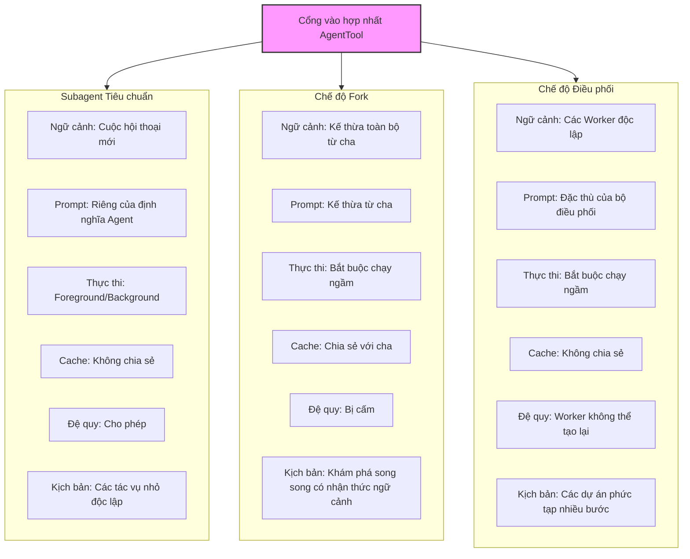
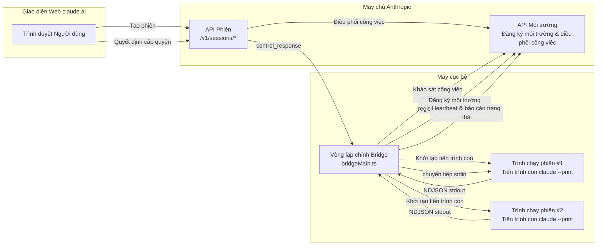

# Chương 20: Khởi tạo và Điều phối Agent (Agent Spawning and Orchestration)

> **Định vị**: Chương này phân tích cách Claude Code triển khai việc khởi tạo và điều phối đa Agent (multi-Agent spawning and orchestration) thông qua ba chế độ: Subagent (Agent phụ), Fork (Phân nhánh), và Coordinator (Bộ điều phối). Yêu cầu tiên quyết: Chương 3 và Chương 4. Đối tượng độc giả: độc giả muốn hiểu cách CC khởi tạo các Agent phụ (Subagent/Fork/Coordinator), hoặc các lập trình viên đang xây dựng hệ thống đa Agent.

## Tại sao cần nhiều Agent

Cửa sổ ngữ cảnh (context window) của một Vòng lặp Agent (Agent Loop) đơn lẻ là một tài nguyên hữu hạn. Khi quy mô tác vụ vượt quá khả năng chứa của một cuộc hội thoại đơn lẻ -- ví dụ: "điều tra nguyên nhân gốc rễ của lỗi này, sửa lỗi, chạy thử nghiệm, viết PR" -- một Agent đơn lẻ sẽ phải nhồi nhét kết quả trung gian vào ngữ cảnh hoặc liên tục nén và mất đi các chi tiết. Vấn đề cơ bản hơn là: **một Agent đơn lẻ không thể song song hóa**, trong khi các tác vụ kỹ thuật phần mềm lại rất phù hợp với phương pháp chia để trị.

Claude Code cung cấp ba mô hình đa Agent có mức độ phức tạp tăng dần: **Subagent**, **Fork Mode**, và **Coordinator Mode**. Chúng chia sẻ chung một điểm đầu vào duy nhất -- `AgentTool` -- nhưng có những khác biệt cơ bản về kế thừa ngữ cảnh, mô hình thực thi, và quản lý vòng đời. Chương này sẽ mổ xẻ ba chế độ này theo từng lớp, cùng với Agent xác minh (verification Agent) và logic lắp ráp kho công cụ (tool pool assembly) được xây dựng xung quanh chúng.

Hệ thống Teams được đề cập trong Chương 20b, và việc lập kế hoạch từ xa Ultraplan trong Chương 20c.

---

> **Phiên bản tương tác**: [Nhấp để xem hoạt ảnh khởi tạo Agent](agent-spawn-viz.html) -- Xem Agent chính khởi tạo 3 subagent chạy song song, với việc truyền và cô lập ngữ cảnh.

## 20.1 AgentTool: Điểm đầu vào Khởi tạo Agent Hợp nhất

Mọi việc khởi tạo Agent đều đi qua một công cụ duy nhất. `AgentTool` được định nghĩa trong `tools/AgentTool/AgentTool.tsx`, với `name` được đặt thành `'Agent'` (dòng 226) và một bí danh (alias) cho `'Task'` cũ (dòng 228).

### Cấu thành Schema Động (Dynamic Schema Composition)

Schema đầu vào của AgentTool không phải là tĩnh -- nó được cấu thành một cách động dựa trên các Feature Flag (Cờ tính năng) và điều kiện lúc thực thi (runtime):

```typescript
// tools/AgentTool/AgentTool.tsx:82-88
const baseInputSchema = lazySchema(() => z.object({
  description: z.string().describe('A short (3-5 word) description of the task'),
  prompt: z.string().describe('The task for the agent to perform'),
  subagent_type: z.string().optional(),
  model: z.enum(['sonnet', 'opus', 'haiku']).optional(),
  run_in_background: z.boolean().optional()
}));
```

Schema cơ sở chứa năm trường. Khi các tính năng đa Agent (Agent Swarms) được bật, các trường `name`, `team_name`, và `mode` cũng được hợp nhất (dòng 93-97); trường `isolation` hỗ trợ `'worktree'` (tất cả các bản build) hoặc `'remote'` (các bản build nội bộ); khi các tác vụ chạy ngầm (background tasks) bị tắt hoặc chế độ Fork được bật, trường `run_in_background` sẽ bị loại bỏ bằng `.omit()` (dòng 122-124).

Thiết kế cấu thành Schema động này có một ý đồ quan trọng: **danh sách tham số mà mô hình nhìn thấy phản ánh chính xác các khả năng mà nó có thể sử dụng hiện tại**. Khi chế độ Fork được bật, mô hình sẽ không nhìn thấy `run_in_background` vì trong chế độ Fork, tất cả các Agent đều tự động được đưa vào chạy ngầm (dòng 557) -- mô hình không cần và không nên kiểm soát điều này một cách rõ ràng.

### Cô lập Ngữ cảnh bằng AsyncLocalStorage (AsyncLocalStorage Context Isolation)

Khi nhiều Agent chạy đồng thời trong cùng một tiến trình (ví dụ: người dùng nhấn Ctrl+B để đưa một Agent xuống chạy ngầm và bắt đầu ngay một Agent khác), làm thế nào để cô lập thông tin nhận dạng của chúng? Câu trả lời là `AsyncLocalStorage`.

```typescript
// utils/agentContext.ts:24
import { AsyncLocalStorage } from 'async_hooks'

// utils/agentContext.ts:93
const agentContextStorage = new AsyncLocalStorage<AgentContext>()

// utils/agentContext.ts:108-109
export function runWithAgentContext<T>(context: AgentContext, fn: () => T): T {
  return agentContextStorage.run(context, fn)
}
```

Bình luận trong mã nguồn (`agentContext.ts` dòng 17-21) giải thích trực tiếp lý do tại sao không sử dụng `AppState`:

> Khi các agent được đưa xuống chạy ngầm (ctrl+b), nhiều agent có thể chạy đồng thời trong cùng một tiến trình. AppState là một trạng thái chia sẻ duy nhất và sẽ bị ghi đè, khiến các sự kiện của Agent A sử dụng sai ngữ cảnh của Agent B. AsyncLocalStorage cô lập từng chuỗi thực thi bất đồng bộ, nhờ đó các agent đồng thời không can thiệp lẫn nhau.

`AgentContext` là một kiểu union phân biệt (discriminated union type), được phân biệt bởi trường `agentType`:

| Kiểu ngữ cảnh | Giá trị `agentType` | Mục đích | Các trường khóa |
|:---:|:---:|:---|:---|
| `SubagentContext` | `'subagent'` | Subagent được khởi tạo bởi công cụ Agent | `agentId`, `subagentName`, `isBuiltIn` |
| `TeammateAgentContext` | `'teammate'` | Agent đồng đội (Thành viên Swarm) | `agentName`, `teamName`, `planModeRequired`, `isTeamLead` |

Cả hai kiểu ngữ cảnh đều có trường `invokingRequestId` (dòng 43-49, dòng 77-83), được sử dụng để theo dõi xem ai đã khởi tạo Agent này. Hàm `consumeInvokingRequestId()` (dòng 163-178) triển khai ngữ nghĩa "cạnh thưa" (sparse edge): mỗi lần khởi tạo/tiếp tục chỉ phát ra `invokingRequestId` ở sự kiện API đầu tiên, sau đó trả về `undefined`, tránh việc đánh dấu trùng lặp.

---

## 20.2 Ba Chế độ Agent

### Chế độ Một: Subagent Tiêu chuẩn

Đây là chế độ cơ bản nhất. Mô hình chỉ định `subagent_type` khi gọi công cụ `Agent`, AgentTool sẽ tra cứu định nghĩa phù hợp từ các định nghĩa Agent đã đăng ký, sau đó bắt đầu một cuộc hội thoại **hoàn toàn mới**.

Logic định tuyến nằm ở `AgentTool.tsx` dòng 322-356:

```typescript
// tools/AgentTool/AgentTool.tsx:322-323
const effectiveType = subagent_type
  ?? (isForkSubagentEnabled() ? undefined : GENERAL_PURPOSE_AGENT.agentType);
```

Khi không chỉ định `subagent_type` và chế độ Fork bị tắt, kiểu mặc định `general-purpose` sẽ được sử dụng.

Các định nghĩa Agent tích hợp được đăng ký trong `builtInAgents.ts` (dòng 45-72), bao gồm:

| Kiểu Agent | Mục đích | Giới hạn công cụ | Mô hình |
|:---:|:---|:---|:---:|
| `general-purpose` | Các tác vụ chung: tìm kiếm, phân tích, thao tác nhiều bước | Tất cả công cụ | Mặc định |
| `verification` | Xác minh tính chính xác của triển khai | Cấm các công cụ chỉnh sửa | Kế thừa |
| `Explore` | Khám phá mã nguồn | - | - |
| `Plan` | Lập kế hoạch tác vụ | - | - |
| `claude-code-guide` | Hướng dẫn sử dụng | - | - |

Đặc điểm chính của subagent là **cô lập ngữ cảnh (context isolation)**: chúng bắt đầu từ con số không và chỉ nhìn thấy `prompt` được truyền từ Agent cha. Các prompt hệ thống (system prompts) cũng được tạo độc lập (dòng 518-534). Điều này có nghĩa là subagent không biết lịch sử hội thoại của Agent cha -- nó giống như "một đồng nghiệp thông minh vừa mới bước vào phòng."

### Chế độ Hai: Chế độ Fork (Fork Mode)

Chế độ Fork là một tính năng thử nghiệm, được kiểm soát đồng thời bởi việc phân cổng lúc build thông qua `feature('FORK_SUBAGENT')` và các điều kiện lúc thực thi (runtime):

```typescript
// tools/AgentTool/forkSubagent.ts:32-39
export function isForkSubagentEnabled(): boolean {
  if (feature('FORK_SUBAGENT')) {
    if (isCoordinatorMode()) return false
    if (getIsNonInteractiveSession()) return false
    return true
  }
  return false
}
```

Sự khác biệt cơ bản giữa chế độ Fork và subagent tiêu chuẩn là **sự kế thừa ngữ cảnh (context inheritance)**. Các tiến trình con Fork kế thừa toàn bộ ngữ cảnh hội thoại và prompt hệ thống của Agent cha:

```typescript
// tools/AgentTool/forkSubagent.ts:60-71
export const FORK_AGENT = {
  agentType: FORK_SUBAGENT_TYPE,
  tools: ['*'],
  maxTurns: 200,
  model: 'inherit',
  permissionMode: 'bubble',
  source: 'built-in',
  baseDir: 'built-in',
  getSystemPrompt: () => '',  // Không sử dụng -- kế thừa prompt hệ thống của cha
} satisfies BuiltInAgentDefinition
```

Lưu ý `model: 'inherit'` and `getSystemPrompt: () => ''` -- các tiến trình con Fork sử dụng mô hình của Agent cha (duy trì độ dài ngữ cảnh nhất quán) và prompt hệ thống đã được kết xuất (rendered) của Agent cha (duy trì nội dung giống nhau từng byte để tối đa hóa tỷ lệ khớp cache prompt).

#### Chia sẻ Cache Prompt (Prompt Cache Sharing)

Giá trị cốt lõi của chế độ Fork nằm ở **việc chia sẻ cache prompt**. Hàm `buildForkedMessages()` (`forkSubagent.ts` dòng 107-164) xây dựng một cấu trúc tin nhắn để đảm bảo tất cả các tiến trình con Fork tạo ra các tiền tố yêu cầu API giống nhau từng byte:

1. Giữ nguyên toàn bộ các tin nhắn trợ lý (assistant messages) của Agent cha (tất cả các khối `tool_use`, suy nghĩ, văn bản)
2. Xây dựng một `tool_result` giữ chỗ giống hệt nhau cho mỗi khối `tool_use` (dòng 142-150, sử dụng văn bản cố định `'Fork started — processing in background'`)
3. Chỉ nối thêm một khối văn bản hướng dẫn riêng cho từng tiến trình con ở cuối cùng

```
[...tin nhắn lịch sử, assistant(tất cả các khối tool_use), user(các tool_result giữ chỗ..., hướng dẫn)]
```

Chỉ có khối văn bản cuối cùng là khác nhau giữa các tiến trình con, giúp tối đa hóa tỷ lệ khớp cache.

#### Bảo vệ Đệ quy Fork (Recursive Fork Protection)

Các tiến trình con Fork giữ lại công cụ `Agent` trong kho công cụ của chúng (để đảm bảo tính nhất quán của cache), nhưng các lệnh gọi sẽ bị chặn lại tại thời điểm thực thi (dòng 332-334):

```typescript
// tools/AgentTool/AgentTool.tsx:332-334
if (toolUseContext.options.querySource === `agent:builtin:${FORK_AGENT.agentType}`
    || isInForkChild(toolUseContext.messages)) {
  throw new Error('Fork is not available inside a forked worker.');
}
```

Cơ chế phát hiện có hai lớp: kiểm tra chính sử dụng `querySource` (khả năng chống nén tốt -- không bị mất ngay cả khi các tin nhắn bị viết lại bởi tính năng tự động nén (autocompact)), và kiểm tra dự phòng quét các tin nhắn để tìm thẻ `<fork-boilerplate>` (dòng 78-89).

### Chế độ Ba: Chế độ Điều phối (Coordinator Mode)

Chế độ Điều phối được kích hoạt thông qua biến môi trường `CLAUDE_CODE_COORDINATOR_MODE`:

```typescript
// coordinator/coordinatorMode.ts:36-41
export function isCoordinatorMode(): boolean {
  if (feature('COORDINATOR_MODE')) {
    return isEnvTruthy(process.env.CLAUDE_CODE_COORDINATOR_MODE)
  }
  return false
}
```

Trong chế độ này, Agent chính trở thành một **bộ điều phối không trực tiếp viết mã**, tập hợp công cụ của nó được giảm xuống chỉ còn các công cụ điều phối: `Agent` (khởi tạo Worker), `SendMessage` (gửi hướng dẫn tiếp theo cho Worker), `TaskStop` (dừng Worker), v.v. Các Worker mới là bên sở hữu các công cụ lập trình thực tế.

Prompt hệ thống của bộ điều phối (`coordinatorMode.ts` dòng 111-368) là một giao thức điều phối chi tiết định nghĩa luồng công việc gồm bốn giai đoạn:

| Giai đoạn | Bên thực thi | Mục đích |
|:---:|:---:|:---|
| Nghiên cứu (Research) | Các Worker (song song) | Điều tra cơ sở mã nguồn, định vị vấn đề |
| Tổng hợp (Synthesis) | **Bộ điều phối (Coordinator)** | Đọc kết quả, hiểu vấn đề, viết đặc tả triển khai |
| Triển khai (Implementation) | Các Worker | Sửa đổi mã nguồn theo đặc tả, commit |
| Xác minh (Verification) | Các Worker | Kiểm tra xem các thay đổi có chính xác không |

Nguyên tắc được nhấn mạnh nhất trong prompt là **"không bao giờ ủy thác việc thấu hiểu" (never delegate understanding)** (dòng 256-259):

> Không bao giờ viết "dựa trên phát hiện của bạn" hoặc "dựa trên nghiên cứu." Những cụm từ này ủy thác việc thấu hiểu cho worker thay vì tự bạn thực hiện.

Hàm `getCoordinatorUserContext()` (dòng 80-109) tạo thông tin ngữ cảnh công cụ của Worker, bao gồm danh sách các công cụ và máy chủ MCP (MCP servers) khả dụng cho các Worker. Khi tính năng Scratchpad được bật, nó cũng thông báo cho bộ điều phối rằng có thể sử dụng một thư mục chia sẻ để lưu trữ kiến thức chéo giữa các Worker (dòng 104-106).

### Bổ sung: Câu hỏi Phụ `/btw` dưới dạng Fork Không dùng Công cụ

`/btw` không phải là chế độ Agent thứ tư, mà là một **trường hợp đặc biệt kênh phụ (side-channel special case)** rất quan trọng để hiểu ma trận khả năng của Claude Code. Bản thân định nghĩa lệnh là `local-jsx` và `immediate: true`, vì vậy nó có thể duy trì một lớp phủ độc lập trong khi luồng chính vẫn đang truyền dữ liệu đầu ra, mà không bị che khuất bởi giao diện người dùng công cụ thông thường.

Trên đường dẫn thực thi, `/btw` không xếp hàng vào Vòng lặp chính mà thay vào đó `runSideQuestion()` sẽ gọi `runForkedAgent()`: nó kế thừa tiền tố an toàn với cache của phiên cha và ngữ cảnh hội thoại hiện tại, nhưng từ chối rõ ràng tất cả các công cụ thông qua `canUseTool`, giới hạn `maxTurns` thành 1, và đặt `skipCacheWrite` để tránh ghi đè tiền tố cache mới cho phần hậu tố dùng một lần này. Nói cách khác, `/btw` là một phiên bản giảm chiều "đầy đủ ngữ cảnh + không công cụ + trả lời một lượt".

Từ góc nhìn ma trận khả năng, nó tạo ra mối quan hệ đối xứng với các subagent tiêu chuẩn:

- **Subagent Tiêu chuẩn**: Giữ lại các khả năng công cụ nhưng thường bắt đầu từ một ngữ cảnh mới.
- **`/btw`**: Giữ lại các khả năng ngữ cảnh nhưng loại bỏ công cụ và thực thi nhiều lượt.

Sự đối xứng này rất quan trọng vì nó tiết lộ rằng hệ thống ủy thác của Claude Code không phải là một công tắc nhị phân mà được cắt tỉa độc lập theo ba chiều: "ngữ cảnh, công cụ, và số lượt". Người dùng không phải lúc nào cũng muốn "một Agent khác có thể làm mọi thứ" -- đôi khi họ chỉ muốn "một câu trả lời cho một câu hỏi phụ không gây ra tác dụng phụ bằng cách sử dụng ngữ cảnh hiện tại."

### So sánh Ba Chế độ



| Chiều so sánh | Subagent Tiêu chuẩn | Chế độ Fork | Chế độ Điều phối |
|:---:|:---:|:---:|:---:|
| Kế thừa Ngữ cảnh | Không (cuộc hội thoại mới) | Kế thừa toàn bộ | Không (Worker độc lập) |
| Prompt Hệ thống | Riêng của định nghĩa Agent | Kế thừa từ cha | Prompt đặc thù của bộ điều phối |
| Lựa chọn Mô hình | Có thể ghi đè | Kế thừa từ cha | Không thể ghi đè |
| Chế độ Thực thi | Foreground/Background | Bắt buộc chạy ngầm | Bắt buộc chạy ngầm |
| Chia sẻ Cache | Không | Chia sẻ với cha | Không |
| Kho Công cụ | Lắp ráp độc lập | Kế thừa từ cha | Worker lắp ráp độc lập |
| Khởi tạo Đệ quy | Cho phép | Bị cấm | Worker không thể khởi tạo tiếp |
| Phương thức Phân cổng (Gating) | Luôn khả dụng | Lúc build + lúc thực thi | Lúc build + biến môi trường |
| Trường hợp Sử dụng | Các tác vụ nhỏ độc lập | Khám phá song song nhận thức ngữ cảnh | Các dự án phức tạp nhiều bước |

---

## 20.4 Agent Xác minh (Verification Agent)

Agent Xác minh là Agent được thiết kế trang nhã nhất trong số các Agent tích hợp sẵn. Prompt hệ thống của nó (`built-in/verificationAgent.ts` dòng 10-128) dài khoảng 120 dòng -- về cơ bản là một đặc tả kỹ thuật cho "cách thực hiện xác minh thực tế."

### Các Nguyên tắc Thiết kế Cốt lõi

Agent Xác minh có hai chế độ thất bại được nêu rõ (dòng 12-13):

1. **Né tránh xác minh (Verification avoidance)**: Tìm lý do để không thực thi khi đối mặt với các kiểm tra -- đọc mã nguồn, thuyết minh các bước kiểm tra, viết "PASS" rồi bỏ qua.
2. **Bị đánh lừa bởi 80% đầu tiên (Fooled by the first 80%)**: Nhìn thấy một giao diện người dùng đẹp mắt hoặc bộ kiểm thử vượt qua và có xu hướng cho qua, mà không nhận thấy rằng một nửa số nút không hoạt động.

### Ràng buộc Chỉ đọc Nghiêm ngặt (Strict Read-Only Constraints)

Agent Xác minh bị cấm rõ ràng việc sửa đổi dự án:

```typescript
// built-in/verificationAgent.ts:139-145
disallowedTools: [
  AGENT_TOOL_NAME,
  EXIT_PLAN_MODE_TOOL_NAME,
  FILE_EDIT_TOOL_NAME,
  FILE_WRITE_TOOL_NAME,
  NOTEBOOK_EDIT_TOOL_NAME,
],
```

Tuy nhiên, nó **có thể** viết các kịch bản kiểm thử tạm thời trong thư mục tạm (`/tmp`) -- quyền này là đủ để viết các công cụ kiểm thử tạm thời mà không làm ô nhiễm dự án.

### Xác định Phán quyết VERDICT (VERDICT Determination)

Đầu ra của Agent Xác minh phải kết thúc bằng một phán quyết được định dạng nghiêm ngặt (dòng 117-128):

| Phán quyết | Ý nghĩa |
|:---:|:---|
| `VERDICT: PASS` | Xác minh vượt qua |
| `VERDICT: FAIL` | Tìm thấy vấn đề, bao gồm đầu ra lỗi cụ thể và các bước tái hiện |
| `VERDICT: PARTIAL` | Các giới hạn môi trường ngăn cản việc xác minh đầy đủ (không phải là "không chắc chắn") |

`PARTIAL` chỉ dành cho các giới hạn môi trường (không có framework kiểm thử, công cụ không khả dụng, máy chủ không khởi động được) -- nó không thể được sử dụng cho trường hợp "tôi không chắc đây có phải là lỗi không."

### Dò tìm Đối kháng (Adversarial Probing)

Prompt của Agent Xác minh yêu cầu chạy ít nhất một phép dò tìm đối kháng (dòng 63-69): các yêu cầu đồng thời, giá trị biên, tính lũy đẳng (idempotency), các thao tác mồ côi (orphaned operations), v.v. Nếu tất cả các kiểm tra chỉ là "trả về 200" hoặc "bộ kiểm thử vượt qua", điều đó chỉ xác nhận đường đi thuận lợi (happy path) và không được tính là xác minh thực tế.

---

## 20.7 Lắp ráp Kho Công cụ Độc lập

Kho công cụ của mỗi Worker được lắp ráp độc lập, không kế thừa các giới hạn của Agent cha (dòng 573-577):

```typescript
// tools/AgentTool/AgentTool.tsx:573-577
const workerPermissionContext = {
  ...appState.toolPermissionContext,
  mode: selectedAgent.permissionMode ?? 'acceptEdits'
};
const workerTools = assembleToolPool(workerPermissionContext, appState.mcp.tools);
```

Ngoại lệ duy nhất là chế độ Fork: các tiến trình con Fork sử dụng chính xác mảng công cụ của cha (`useExactTools: true`, dòng 631-633) vì sự khác biệt trong định nghĩa công cụ sẽ làm hỏng cache prompt.

### Chờ đợi và Xác thực Máy chủ MCP (MCP Server Waiting and Validation)

Các định nghĩa Agent có thể khai báo các máy chủ MCP bắt buộc (`requiredMcpServers`). AgentTool kiểm tra xem các máy chủ này có khả dụng hay không trước khi khởi động (dòng 369-409) và chờ tối đa 30 giây trong khi các máy chủ MCP vẫn đang kết nối (dòng 379-391), với logic thoát sớm -- nếu một máy chủ bắt buộc đã bị lỗi, nó sẽ ngừng chờ các máy chủ khác.

---

## 20.8 Đúc kết Thiết kế

**Tại sao lại có ba chế độ thay vì một?** Điều này xuất phát từ một sự đánh đổi cơ bản: **chia sẻ ngữ cảnh so với cô lập thực thi (context sharing vs. execution isolation)**. Các subagent tiêu chuẩn cung cấp sự cô lập tối đa nhưng không có ngữ cảnh; Fork cung cấp khả năng chia sẻ ngữ cảnh tối đa nhưng không thể đệ quy; chế độ Coordinator nằm ở giữa -- các Worker được cô lập nhưng bộ điều phối duy trì một góc nhìn toàn cục. Không có giải pháp vạn năng đơn lẻ nào có thể đáp ứng mọi kịch bản.

**Triết lý thiết kế cấu trúc nhóm phẳng (flat team structure).** Việc cấm các đồng đội khởi tạo thêm các đồng đội khác không chỉ là một ràng buộc kỹ thuật -- nó phản ánh một nguyên tắc tổ chức: trong một nhóm hiệu quả, việc điều phối nên được tập trung tại một nút (Trưởng nhóm), thay vì hình thành các chuỗi ủy thác sâu tùy ý. Điều này phù hợp với trực giác về việc "tránh các ngăn xếp cuộc gọi quá sâu" (avoiding overly deep call stacks) trong kỹ thuật phần mềm.

**Thiết kế "danh sách kiểm tra phản mẫu" (anti-pattern checklist) của Agent Xác minh.** Prompt của Agent Xác minh liệt kê rõ ràng các chế độ thất bại điển hình của các LLM khi đóng vai trò là bên xác minh (dòng 53-61) và yêu cầu nó phải "nhận ra các lý do biện hộ của chính mình." Kiểu gợi ý siêu nhận thức (meta-cognition prompting) này là một sự bù đắp kỹ thuật cho những điểm yếu cố hữu của LLM -- không kỳ vọng mô hình không mắc lỗi, mà giúp mô hình nhận thức được rằng nó có xu hướng mắc những lỗi đó.

---

## Những việc Người dùng Có thể Làm

**Tận dụng các chế độ đa Agent để nâng cao hiệu quả công việc:**

1. **Sử dụng các subagent cho các cuộc điều tra độc lập.** Khi bạn cần hoàn thành một tác vụ phụ độc lập mà không làm phiền ngữ cảnh cuộc hội thoại chính (ví dụ: "tìm tất cả những nơi gọi API này"), việc để mô hình bắt đầu một subagent là lựa chọn tốt nhất. Subagent có cửa sổ ngữ cảnh riêng, trả về một bản tóm tắt khi hoàn thành và không làm ô nhiễm cuộc hội thoại chính.

2. **Hiểu luồng công việc bốn giai đoạn của Chế độ Điều phối.** Nếu tổ chức của bạn đã bật Chế độ Điều phối (`CLAUDE_CODE_COORDINATOR_MODE=true`), việc hiểu luồng công việc bốn giai đoạn Nghiên cứu -> Tổng hợp -> Triển khai -> Xác minh sẽ giúp bạn cộng tác tốt hơn. Lưu ý đặc biệt: bộ điều phối không viết mã trực tiếp -- nó chỉ xử lý việc thấu hiểu vấn đề và phân công tác vụ.

3. **Sử dụng Agent Xác minh làm chốt chặn chất lượng.** Sau khi hoàn thành các thay đổi phức tạp, bạn có thể yêu cầu rõ ràng việc chạy Agent Xác minh. Các ràng buộc chỉ đọc và thiết kế dò tìm đối kháng của nó làm cho nó trở thành một "đôi mắt thứ hai" đáng tin cậy.

4. **Cô lập bằng worktree bảo vệ nhánh chính.** Khi một Agent sử dụng `isolation: 'worktree'`, tất cả các sửa đổi sẽ diễn ra trong một git worktree tạm thời. Các worktree không có thay đổi sẽ tự động được dọn dẹp, trong khi những worktree có thay đổi sẽ giữ lại nhánh của chúng -- nghĩa là bạn có thể tự tin để Agent thử nghiệm các sửa đổi thử nghiệm.

---

## 20.9 Thực thi Từ xa: Kiến trúc Cầu nối (Bridge Architecture)

Các phần trước đã phân tích ba chế độ khởi tạo Agent -- Subagent, Fork, Coordinator -- tất cả đều chạy trong tiến trình cục bộ. Nhưng Claude Code không chỉ là một công cụ CLI cục bộ. Phân hệ Cầu nối (Bridge subsystem) (`restored-src/src/bridge/`, tổng cộng 33 tệp) mở rộng khả năng thực thi Agent vượt qua ranh giới mạng, cho phép người dùng kích hoạt các phiên Agent từ xa trên máy cục bộ từ giao diện Web claude.ai. Nếu Fork là "sự phân tách Agent ở cấp độ tiến trình trên máy cục bộ", thì Bridge là "sự trình chiếu Agent qua mạng".

### Kiến trúc Ba Thành phần

Thiết kế của Bridge tuân theo mô hình client-server-worker cổ điển. Toàn bộ hệ thống bao gồm ba thành phần:



**Vòng lặp chính Bridge** (Bridge Main Loop - `bridgeMain.ts`) là bộ điều phối cốt lõi. Nó bắt đầu một vòng lặp khảo sát (polling loop) bền bỉ thông qua `runBridgeLoop()` (dòng 141): đăng ký môi trường cục bộ với máy chủ, sau đó gọi liên tục `pollForWork()` để lấy các yêu cầu phiên mới. Bất cứ khi nào có công việc mới đến, Bridge sẽ sử dụng `SessionSpawner` để khởi tạo một tiến trình con Claude Code để thực thi tác vụ Agent thực tế.

**Trình chạy phiên** (Session Runner - `sessionRunner.ts`) quản lý vòng đời của từng tiến trình con. Nó tạo ra một factory thông qua `createSessionSpawner()` (dòng 248); mỗi lần gọi `.spawn()` sẽ bắt đầu một tiến trình con `claude --print` mới, được cấu hình ở chế độ truyền luồng NDJSON `--input-format stream-json --output-format stream-json` (dòng 287-299). Đầu ra tiêu chuẩn (stdout) của tiến trình con được phân tích cú pháp theo từng dòng qua `readline`, trích xuất các hoạt động gọi công cụ (`extractActivities`) và các yêu cầu cấp quyền (`control_request`).

### Luồng Xác thực JWT (JWT Authentication Flow)

Xác thực Bridge dựa trên hệ thống JWT (JSON Web Token) hai lớp: lớp ngoài là một mã thông báo OAuth để đăng ký môi trường và gọi các API quản lý; lớp trong là Mã thông báo đầu vào phiên (Session Ingress Token) (tiền tố `sk-ant-si-`) cho các yêu cầu suy luận thực tế của tiến trình con.

Hàm `createTokenRefreshScheduler()` của `jwtUtils.ts` (dòng 72) triển khai một bộ lập lịch làm mới mã thông báo một cách trang nhã. Logic cốt lõi của nó:

1. **Giải mã hạn dùng JWT**. Hàm `decodeJwtPayload()` (dòng 21) loại bỏ tiền tố `sk-ant-si-`, sau đó giải mã phân đoạn payload được mã hóa Base64url để trích xuất claim `exp`. Lưu ý rằng **chữ ký không được xác minh** ở đây -- Bridge chỉ cần biết thời gian hết hạn; việc xác minh được thực hiện ở phía máy chủ.

2. **Chủ động làm mới**. Bộ lập lịch chủ động bắt đầu làm mới trước khi mã thông báo hết hạn 5 phút (`TOKEN_REFRESH_BUFFER_MS`, dòng 52), tránh việc các yêu cầu bị thất bại do sử dụng mã thông báo đã hết hạn.

3. **Đếm thế hệ để ngăn ngừa tranh chấp (race conditions)**. Mỗi phiên duy trì một bộ đếm thế hệ (generation counter - dòng 94); cả `schedule()` và `cancel()` đều tăng số thế hệ này. Khi hàm bất đồng bộ `doRefresh()` hoàn thành, nó sẽ kiểm tra xem thế hệ hiện tại có khớp với thế hệ tại thời điểm khởi chạy hay không (dòng 178) -- nếu không khớp, phiên đó đã được lên lịch lại hoặc bị hủy, và kết quả làm mới sẽ bị loại bỏ. Mô hình này ngăn chặn hiệu quả các sự cố hẹn giờ mồ côi do việc làm mới đồng thời gây ra.

4. **Thử lại khi thất bại với tính năng ngắt mạch (circuit breaking)**. Sau 3 lần thất bại liên tiếp (`MAX_REFRESH_FAILURES`, dòng 58), việc thử lại sẽ dừng lại để tránh các vòng lặp vô hạn khi nguồn mã thông báo hoàn toàn không khả dụng. Mỗi lần thất bại sẽ đợi 60 giây trước khi thử lại.

### Chuyển tiếp Phiên và Ủy nhiệm Quyền hạn (Session Forwarding and Permission Proxying)

Thiết kế trang nhã nhất của Bridge nằm ở việc ủy nhiệm quyền hạn từ xa. Khi một tiến trình con cần thực hiện một thao tác nhạy cảm (chẳng hạn như viết một tệp hoặc chạy một lệnh shell), nó sẽ phát ra một thông điệp `control_request` qua stdout. Trình phân tích cú pháp NDJSON của `sessionRunner.ts` phát hiện các thông điệp như vậy (dòng 417-431) và gọi callback `onPermissionRequest` để chuyển tiếp yêu cầu đến máy chủ.

`bridgePermissionCallbacks.ts` định nghĩa hợp đồng kiểu của proxy ủy quyền:

```typescript
// restored-src/src/bridge/bridgePermissionCallbacks.ts:3-8
type BridgePermissionResponse = {
  behavior: 'allow' | 'deny'
  updatedInput?: Record<string, unknown>
  updatedPermissions?: PermissionUpdate[]
  message?: string
}
```

Quyết định cho phép/từ chối của người dùng được thực hiện trên giao diện Web sẽ được truyền ngược lại Bridge qua các thông điệp `control_response`, sau đó Bridge sẽ chuyển tiếp chúng đến Session Runner thông qua đầu vào tiêu chuẩn (stdin) của tiến trình con. Điều này tạo thành một vòng lặp cấp quyền hoàn chỉnh: yêu cầu của tiến trình con -> chuyển tiếp Bridge -> máy chủ -> giao diện Web -> quyết định của người dùng -> trả về qua cùng một đường dẫn.

Việc cập nhật mã thông báo cũng được thực hiện qua stdin. `SessionHandle.updateAccessToken()` (`sessionRunner.ts` dòng 527) đóng gói mã thông báo mới dưới dạng một thông điệp `update_environment_variables` được ghi vào stdin của tiến trình con; trình xử lý StructuredIO của tiến trình con trực tiếp thiết lập `process.env`, vì vậy các tiêu đề xác thực tiếp theo sẽ tự động sử dụng mã thông báo mới.

### Quản lý Dung lượng (Capacity Management)

Bridge phải xử lý các vấn đề về dung lượng cho nhiều phiên đồng thời. `types.ts` định nghĩa ba chế độ khởi tạo (SpawnMode, dòng 68-69):

| Chế độ | Hành vi | Trường hợp Sử dụng |
|------|----------|----------|
| `single-session` | Phiên đơn lẻ, thoát khi hoàn thành | Chế độ mặc định, đơn giản nhất |
| `worktree` | Thư mục git worktree độc lập cho mỗi phiên | Nhiều phiên chạy song song, không can thiệp nhau |
| `same-dir` | Tất cả các phiên chia sẻ thư mục làm việc | Nhẹ nhàng nhưng dễ xảy ra xung đột |

Số lượng phiên đồng thời tối đa mặc định của `bridgeMain.ts` là 32 (`SPAWN_SESSIONS_DEFAULT`, dòng 83), và tính năng đa phiên được triển khai dần dần thông qua Cổng Tính năng GrowthBook (`tengu_ccr_bridge_multi_session`, dòng 97).

`capacityWake.ts` triển khai hàm nguyên thủy đánh thức dung lượng (`createCapacityWake()` tại dòng 28). Khi tất cả các khe phiên (session slots) đều đầy, vòng lặp khảo sát sẽ ngủ. Hai sự kiện có thể đánh thức nó: (a) một tín hiệu hủy bỏ bên ngoài (tắt máy), hoặc (b) một phiên hoàn thành và giải phóng một khe. Mô đun này trừu tượng hóa logic đánh thức đã bị lặp lại trước đó từ `bridgeMain.ts` và `replBridge.ts` thành một hàm nguyên thủy dùng chung -- như bình luận của nó đã nêu: "cả hai vòng lặp khảo sát trước đó đều lặp lại từng byte" (dòng 8).

Mỗi phiên cũng có tính năng bảo vệ quá giờ (timeout protection): mặc định là 24 giờ (`DEFAULT_SESSION_TIMEOUT_MS`, `types.ts` dòng 2). Các phiên quá giờ sẽ bị bộ giám sát (watchdog) của Bridge chủ động tắt, trước tiên gửi SIGTERM, sau đó gửi SIGKILL sau một thời gian ân hạn.

### Mối quan hệ với việc Khởi tạo Agent

Bridge là sự mở rộng tự nhiên của các cơ chế khởi tạo Agent được thảo luận ở nửa đầu chương này theo chiều mạng. Nếu chúng ta đặt ba chế độ Agent và Bridge trên cùng một quang hoạt:

| Chiều so sánh | Subagent | Fork | Coordinator | Bridge |
|-----------|---------|------|------------|--------|
| Vị trí Thực thi | Cùng tiến trình | Tiến trình con | Nhóm tiến trình con | Tiến trình con từ xa |
| Kế thừa Ngữ cảnh | Không | Bản chụp (snapshot) đầy đủ | Truyền tóm tắt | Không (phiên độc lập) |
| Nguồn Kích hoạt | LLM tự trị | LLM tự trị | LLM tự trị | Người dùng qua Web |
| Mô hình Cấp quyền | Kế thừa từ cha | Kế thừa từ cha | Kế thừa từ cha | Ủy nhiệm từ xa trả về |
| Vòng đời | Cha quản lý | Cha quản lý | Bộ điều phối quản lý | Vòng lặp khảo sát Bridge quản lý |

Một phiên Bridge về mặt bản chất là một subagent từ xa không có sự kế thừa ngữ cảnh -- nó sử dụng cùng một chế độ thực thi `claude --print`, nhưng việc tạo phiên, quyết định cấp quyền, và quản lý vòng đời đều đi qua ranh giới mạng. `createSessionSpawner()` của `sessionRunner.ts` về mặt khái niệm là đẳng cấu với việc khởi tạo tiến trình con của AgentTool, chỉ khác biệt về nguồn kích hoạt và kênh giao tiếp.

Sự trang nhã của thiết kế này nằm ở chỗ bất kể một Agent thực thi cục bộ hay từ xa, Vòng lặp Agent cốt lời của nó (xem Chương 3) hoàn toàn không cần phải thay đổi. Bridge chỉ đơn giản là bọc một lớp giao thức truyền tải mạng và xác thực bên ngoài Vòng lặp, giúp duy trì sự đơn giản của nhân hệ thống.
