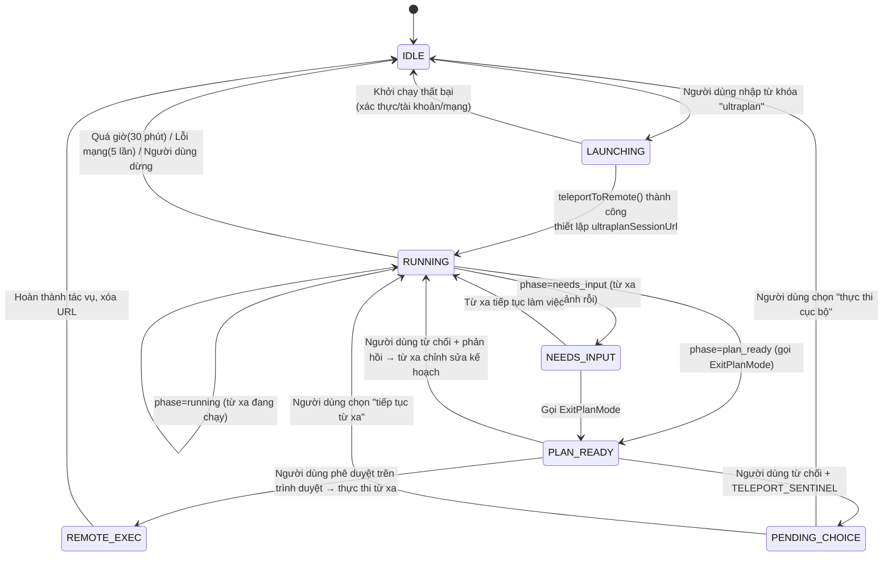

# Chương 20c: Ultraplan -- Lập Kế hoạch Đa Agent Từ xa (Remote Multi-Agent Planning)

### Tại sao cần Ultraplan

Việc điều phối đa Agent (multi-Agent orchestration) được mô tả ở phần trước của chương này đều là **cục bộ** -- các Agent chạy trong terminal của người dùng, chiếm dụng I/O terminal, và chia sẻ cửa sổ ngữ cảnh với người dùng. Ultraplan giải quyết một vấn đề khác: **chuyển giai đoạn lập kế hoạch (planning phase) sang từ xa (remote)**, giúp terminal của người dùng luôn sẵn sàng.

| Chiều so sánh | Chế độ Kế hoạch Cục bộ (Local Plan Mode) | Ultraplan |
|-----------|----------------|-----------|
| Vị trí thực thi | Terminal cục bộ | Container từ xa CCR (Claude Code trên web) |
| Mô hình | Mô hình của phiên hiện tại | Bắt buộc Opus 4.6 (cấu hình GrowthBook `tengu_ultraplan_model`) |
| Phương pháp khám phá | Khám phá tuần tự đơn Agent | Tùy chọn khám phá song song đa Agent (tùy thuộc vào biến thể prompt) |
| Thời gian chờ (Timeout) | Không có giới hạn cứng | 30 phút (GrowthBook `tengu_ultraplan_timeout_seconds`, mặc định 1800) |
| Terminal người dùng | Bị chặn | Luôn sẵn sàng, người dùng có thể tiếp tục công việc khác |
| Chuyển giao kết quả | Thực thi trực tiếp trong phiên | "Thực thi từ xa và tạo PR" hoặc "chuyển vùng về terminal cục bộ để thực thi" |
| Phê duyệt | Hộp thoại terminal | PlanModal trên trình duyệt |

### Tổng quan Kiến trúc

Ultraplan bao gồm 5 mô-đun cốt lõi:

```
┌──────────────────────────────────────────────────────────────┐
│                    Terminal Người dùng (Cục bộ)              │
│                                                              │
│  PromptInput.tsx                processUserInput.ts           │
│  ┌─────────────┐              ┌──────────────────┐           │
│  │ Phát hiện   │─→ Tô màu     │ Thay thế         │           │
│  │ từ khóa     │   cầu vồng   │ "ultraplan"      │           │
│  │ + toast     │              │ → lệnh /ultraplan│           │
│  └─────────────┘              └────────┬─────────┘           │
│                                        ↓                     │
│  commands/ultraplan.tsx ──────────────────────────            │
│  ┌─────────────────────────────────────────────┐             │
│  │ launchUltraplan()                           │             │
│  │  ├─ checkRemoteAgentEligibility()           │             │
│  │  ├─ buildUltraplanPrompt(blurb, seed, id)   │             │
│  │  ├─ teleportToRemote() ──→ Phiên CCR       │             │
│  │  ├─ registerRemoteAgentTask()               │             │
│  │  └─ startDetachedPoll() ──→ Khảo sát nền    │             │
│  └───────────────────────────┬─────────────────┘             │
│                              ↓                               │
│  utils/ultraplan/ccrSession.ts                               │
│  ┌─────────────────────────────────────────────┐             │
│  │ pollForApprovedExitPlanMode()               │             │
│  │  ├─ Khảo sát sự kiện phiên từ xa mỗi 3 giây  │             │
│  │  ├─ Máy trạng thái ExitPlanModeScanner.ingest()           │
│  │  └─ Phát hiện giai đoạn: running → needs_input → ready     │
│  └───────────────────────────┬─────────────────┘             │
│                              ↓                               │
│  Hiển thị trạng thái nhiệm vụ (Pill)                         │
│  ◇ ultraplan (đang chạy)                                     │
│  ◇ ultraplan cần bạn nhập liệu (từ xa rảnh rỗi)              │
│  ◆ ultraplan sẵn sàng (kế hoạch đã sẵn sàng)                 │
└──────────────────────────────────────────────────────────────┘
                                ↕ Khảo sát HTTP (HTTP polling)
┌──────────────────────────────────────────────────────────────┐
│                     Container Từ xa CCR                      │
│                                                              │
│  Opus 4.6 + quyền hạn chế độ plan                            │
│  ├─ Khám phá cơ sở mã nguồn (Glob/Grep/Read)                 │
│  ├─ Tùy chọn: Công cụ Task khởi tạo các subagent song song    │
│  ├─ Gọi ExitPlanMode để nộp kế hoạch                         │
│  └─ Chờ phê duyệt của người dùng (chấp nhận/từ chối/chuyển vùng)│
└──────────────────────────────────────────────────────────────┘
```

### CCR là gì -- Ý nghĩa của "Làm việc Từ xa"

"Container Từ xa CCR" trong sơ đồ kiến trúc là viết tắt của **Claude Code Remote** (Claude Code trên web), về mặt bản chất là một thực thể Claude Code hoàn chỉnh chạy trên máy chủ của Anthropic:

```
Terminal của bạn (Client CLI cục bộ)          Đám mây Anthropic (Container CCR)
┌──────────────────────┐            ┌────────────────────────────┐
│ Chỉ chịu trách nhiệm: │            │ Đang chạy:                 │
│ · Đóng gói và tải    │──HTTP──→   │ · Thực thể Claude Code     │
│   lên mã nguồn       │            │   hoàn chỉnh               │
│ · Hiển thị thanh Pill│            │ · Mô hình Opus 4.6         │
│ · Khảo sát trạng thái│←─poll──    │   (bắt buộc)               │
│   mỗi 3 giây         │            │ · Bản sao mã nguồn của bạn │
│ · Nhận kế hoạch      │            │   (dưới dạng gói bundle)   │
│   cuối cùng          │            │ · Các công cụ Glob/Grep/   │
│                      │            │   Read v.v.                │
│ Bạn có thể tiếp tục  │            │ · Tùy chọn: nhiều subagent │
│ công việc khác       │            │   chạy song song           │
│                      │            │ · Quyền hạn chế độ Plan    │
│                      │            │   (chỉ đọc)                │
└──────────────────────┘            └────────────────────────────┘
```

Container CCR được tạo thông qua `teleportToRemote()`. Khi khởi chạy, mã nguồn của bạn sẽ được đóng gói và tải lên, và phía từ xa sẽ có toàn quyền truy cập mã nguồn. Vòng lặp Agent từ xa gửi các yêu cầu đến API Claude, giống hệt như khi bạn sử dụng Claude Code cục bộ -- sự khác biệt là nó sử dụng mô hình Opus 4.6, chạy trên hạ tầng của Anthropic, và không chiếm dụng terminal của bạn.

### Những việc Người dùng Có thể Làm

**Các phương thức kích hoạt**:

1. **Kích hoạt bằng từ khóa** -- viết "ultraplan" một cách tự nhiên trong prompt của bạn:
   ```
   ultraplan refactor the auth module to support both OAuth2 and API key methods
   ```
2. **Lệnh gạch chéo** -- gọi trực tiếp `/ultraplan <mô tả>`

**Điều kiện tiên quyết** (kiểm tra của `checkRemoteAgentEligibility()`):
- Đã đăng nhập vào Claude Code qua OAuth
- Cấp độ đăng ký tài khoản hỗ trợ các Agent từ xa (Pro/Max/Team/Enterprise)
- Cờ tính năng `ULTRAPLAN` được bật cho tài khoản (điều khiển phía máy chủ của GrowthBook)

**Kiểm tra tính khả dụng**: Sau khi nhập văn bản chứa từ khóa "ultraplan", nếu từ khóa hiển thị màu cầu vồng nổi bật và một thông báo dạng toast "This prompt will launch an ultraplan session in Claude Code on the web" xuất hiện, nghĩa là tính năng này đã được bật. Nếu không có phản ứng gì, nghĩa là cờ tính năng chưa được bật cho tài khoản của bạn.

**Luồng sử dụng**:

```
1. Nhập một prompt chứa từ khóa "ultraplan"
2. Xác nhận hộp thoại khởi chạy
3. Terminal hiển thị URL CCR, bạn có thể tiếp tục công việc khác
4. Thanh trạng thái Pill hiển thị tiến độ:
   ◇ ultraplan                   → Từ xa đang khám phá mã nguồn
   ◇ ultraplan needs your input  → Cần thao tác trên trình duyệt
   ◆ ultraplan ready             → Kế hoạch đã sẵn sàng, chờ phê duyệt
5. Phê duyệt kế hoạch trên trình duyệt:
   a. Approve (Chấp nhận) → Thực thi từ xa và tạo Pull Request
   b. Reject (Từ chối) + phản hồi → Từ xa sửa đổi theo phản hồi và nộp lại
   c. Teleport to local (Chuyển vùng về cục bộ) → Kế hoạch quay lại terminal cục bộ để thực thi
6. Để dừng giữa chừng, hãy hủy thông qua hệ thống tác vụ (task system)
```

**Các vị trí mã nguồn**:

| Tệp | Số dòng | Nhiệm vụ |
|------|-------|---------------|
| `commands/ultraplan.tsx` | 470 | Lệnh chính: khởi chạy, khảo sát, dừng, xử lý lỗi |
| `utils/ultraplan/ccrSession.ts` | 350 | Máy trạng thái khảo sát, ExitPlanModeScanner, phát hiện giai đoạn |
| `utils/ultraplan/keyword.ts` | 128 | Phát hiện từ khóa: quy tắc kích hoạt, loại trừ ngữ cảnh |
| `state/AppStateStore.ts` | -- | Các trường trạng thái: `ultraplanSessionUrl`, `ultraplanPendingChoice`, v.v. |
| `tasks/RemoteAgentTask/` | -- | Đăng ký tác vụ từ xa và quản lý vòng đời |
| `components/PromptInput/PromptInput.tsx` | -- | Tô màu cầu vồng từ khóa + thông báo toast |

### Hệ thống Kích hoạt Từ khóa (Keyword Trigger System)

Người dùng không cần gõ lệnh `/ultraplan` -- chỉ cần viết "ultraplan" một cách tự nhiên trong prompt để kích hoạt nó.

```typescript
// restored-src/src/utils/ultraplan/keyword.ts
export function findUltraplanTriggerPositions(text: string): TriggerPosition[]
export function hasUltraplanKeyword(text: string): boolean
export function replaceUltraplanKeyword(text: string): string
```

**Quy tắc loại trừ** -- từ khóa "ultraplan" trong các ngữ cảnh sau sẽ không kích hoạt:

| Ngữ cảnh | Ví dụ | Lý do |
|---------|---------|--------|
| Bên trong dấu nháy/dấu nháy ngược | `` `ultraplan` `` | Tham chiếu mã nguồn |
| Trong đường dẫn tệp | `src/ultraplan/foo.ts` | Đường dẫn tệp |
| Trong mã định danh | `--ultraplan-mode` | Tham số CLI |
| Trước phần mở rộng tệp | `ultraplan.tsx` | Tên tệp |
| Sau dấu hỏi chấm | `ultraplan?` | Đang hỏi về tính năng, không kích hoạt |
| Bắt đầu bằng `/` | `/ultraplan` | Đi qua đường dẫn lệnh gạch chéo |

Sau khi được kích hoạt, `processUserInput.ts` sẽ thay thế từ khóa bằng `/ultraplan {prompt đã viết lại}` và định tuyến đến trình xử lý lệnh.

### Máy trạng thái: Quản lý Vòng đời

Ultraplan sử dụng 5 trường AppState để quản lý vòng đời của nó:

```typescript
// restored-src/src/state/AppStateStore.ts
ultraplanLaunching?: boolean         // Đang khởi chạy (ngăn khởi chạy trùng lặp, cửa sổ khoảng 5 giây)
ultraplanSessionUrl?: string         // URL phiên đang hoạt động (khi có URL này sẽ tắt kích hoạt bằng từ khóa)
ultraplanPendingChoice?: {           // Kế hoạch đã duyệt đang chờ lựa chọn vị trí thực thi của người dùng
  plan: string
  sessionId: string
  taskId: string
}
ultraplanLaunchPending?: {           // Trạng thái hộp thoại xác nhận trước khi khởi chạy
  blurb: string
}
isUltraplanMode?: boolean            // Cờ phía từ xa (được thiết lập qua set_permission_mode)
```

**Biểu đồ chuyển trạng thái**:



### Khảo sát và Phát hiện Giai đoạn (Polling and Phase Detection)

`startDetachedPoll()` chạy như một hàm IIFE bất đồng bộ chạy nền, không gây chặn terminal:

```typescript
// restored-src/src/utils/ultraplan/ccrSession.ts

const POLL_INTERVAL_MS = 3000             // Khảo sát mỗi 3 giây
const MAX_CONSECUTIVE_FAILURES = 5        // Bỏ cuộc sau 5 lỗi mạng liên tiếp
const ULTRAPLAN_TIMEOUT_MS = 30 * 60 * 1000  // Hết giờ sau 30 phút
```

**ExitPlanModeScanner** là một bộ xử lý sự kiện không lưu trạng thái (stateless) thuần túy, chuyên trích xuất các tín hiệu từ luồng sự kiện của phiên từ xa:

```typescript
// Các kiểu kết quả quét
type ScanResult =
  | { kind: 'approved'; plan: string }    // Người dùng đã phê duyệt (thực thi từ xa)
  | { kind: 'teleport'; plan: string }    // Người dùng từ chối + cờ chuyển vùng (thực thi cục bộ)
  | { kind: 'rejected'; id: string }      // Từ chối thông thường (sửa đổi và nộp lại)
  | { kind: 'pending' }                   // Đã gọi ExitPlanMode, chờ phê duyệt
  | { kind: 'terminated'; subtype: string } // Phiên bị chấm dứt
  | { kind: 'unchanged' }                 // Không có tín hiệu mới
```

**Logic phát hiện giai đoạn (Phase detection)**:

```typescript
// Xác định giai đoạn hiện tại của phiên từ xa
const quietIdle =
  (sessionStatus === 'idle' || sessionStatus === 'requires_action') &&
  newEvents.length === 0

const phase: UltraplanPhase = scanner.hasPendingPlan
  ? 'plan_ready'      // Đã gọi ExitPlanMode, chờ phê duyệt trên trình duyệt
  : quietIdle
    ? 'needs_input'    // Từ xa đang rảnh rỗi, có thể cần người dùng nhập liệu
    : 'running'        // Đang hoạt động bình thường
```

### Các Biến thể Prompt Điều khiển bởi GrowthBook (Mới trong v2.1.91)

Phiên bản v2.1.91 đã giới thiệu sự kiện `tengu_ultraplan_prompt_identifier`, hiển thị một **hệ thống biến thể prompt được điều khiển bởi GrowthBook**. Ít nhất 3 biến thể prompt đã được trích xuất từ mã nguồn:

**Biến thể 1: `simple_plan` (mặc định)** -- Lập kế hoạch đơn Agent gọn nhẹ

```
You're running in a remote planning session.
Run a lightweight planning process, consistent with how you would
in regular plan mode:
- Explore the codebase directly with Glob, Grep, and Read.
- Do not spawn subagents.
When you've settled on an approach, call ExitPlanMode with the plan.
```

**Biến thể 2: Khám phá đa Agent (Multi-agent exploration)** -- Sử dụng công cụ Task để khởi tạo các subagent song song

```
Produce an exceptionally thorough implementation plan using
multi-agent exploration.
Instructions:
1. Use the Task tool to spawn parallel agents to explore different
   aspects of the codebase simultaneously:
   - One agent to understand the relevant existing code and architecture
   - One agent to find all files that will need modification
   - One agent to identify potential risks, edge cases, and dependencies
2. Synthesize their findings into a detailed, step-by-step plan.
3. Use the Task tool to spawn a critique agent to review the plan.
4. Incorporate the critique feedback, then call ExitPlanMode.
```

**Cơ chế chuyển đổi biến thể**:

```typescript
// Phân tích đảo ngược mã nguồn v2.1.91
function getPromptIdentifier(): string {
  // Đọc từ GrowthBook, mặc định "simple_plan"
  let id = getFeatureValue('tengu_ultraplan_prompt_identifier', 'simple_plan')
  return isValidId(id) ? id : 'simple_plan'
}

function getTimeout(): number {
  // Đọc từ GrowthBook, mặc định 1800 giây (30 phút)
  return getFeatureValue('tengu_ultraplan_timeout_seconds', 1800) * 1000
}
```

Điều này có nghĩa là Anthropic có thể thử nghiệm A/B các chiến lược lập kế hoạch khác nhau thông qua GrowthBook mà không cần phát hành các bản nâng cấp mới. Sự kiện `tengu_ultraplan_config` ghi lại sự kết hợp cấu hình cụ thể được sử dụng tại mỗi lần khởi chạy.

### Giao thức Chuyển vùng Kế hoạch (Plan Teleport Protocol)

Khi người dùng từ chối kế hoạch trên trình duyệt nhưng chọn "chuyển vùng về terminal cục bộ (teleport back to local terminal)", trình duyệt sẽ chèn một chuỗi sentinel đặc biệt vào phản hồi:

```typescript
const ULTRAPLAN_TELEPORT_SENTINEL = '__ULTRAPLAN_TELEPORT_LOCAL__'
```

Prompt phía từ xa hướng dẫn rõ ràng cho mô hình nhận diện chuỗi sentinel này:

> Nếu phản hồi chứa `__ULTRAPLAN_TELEPORT_LOCAL__`, KHÔNG triển khai -- kế hoạch đã được chuyển vùng về terminal cục bộ của người dùng. Chỉ trả lời bằng "Plan teleported. Return to your terminal to continue."

Bộ quét `ExitPlanModeScanner` cục bộ phát hiện chuỗi sentinel này, trích xuất nội dung kế hoạch và thiết lập `ultraplanPendingChoice`, hiển thị một hộp thoại lựa chọn để người dùng quyết định thực thi cục bộ hay tiếp tục từ xa.

### Ma trận Xử lý Lỗi

| Lỗi | Mã nguyên nhân | Thời điểm xảy ra | Chiến lược khôi phục |
|-------|------------|----------------|-------------------|
| `UltraplanPollError` | `terminated` | Phiên từ xa bị chấm dứt bất thường | Thông báo cho người dùng + lưu trữ phiên |
| `UltraplanPollError` | `timeout_pending` | Quá 30 phút, kế hoạch đã ở trạng thái chờ duyệt | Thông báo + lưu trữ |
| `UltraplanPollError` | `timeout_no_plan` | Quá 30 phút, chưa bao giờ gọi ExitPlanMode | Thông báo + lưu trữ |
| `UltraplanPollError` | `network_or_unknown` | 5 lỗi mạng liên tiếp | Thông báo + lưu trữ |
| `UltraplanPollError` | `stopped` | Người dùng chủ động dừng | Thoát sớm, trình xử lý hủy thực hiện việc lưu trữ |
| Lỗi khởi chạy | `precondition` | Thiếu quyền xác thực/tài khoản/điều kiện | Thông báo cho người dùng |
| Lỗi khởi chạy | `bundle_fail` | Tạo gói bundle mã nguồn thất bại | Thông báo cho người dùng |
| Lỗi khởi chạy | `teleport_null` | Việc tạo phiên từ xa trả về null | Thông báo cho người dùng |
| Lỗi khởi chạy | `unexpected_error` | Ngoại lệ | Lưu trữ phiên mồ côi + xóa URL |

### Tổng quan về Sự kiện Viễn thám (Telemetry Events)

| Sự kiện | Phiên bản gốc | Thời điểm kích hoạt | Siêu dữ liệu chính |
|-------|---------------|---------|-------------|
| `tengu_ultraplan_keyword` | v2.1.88 | Phát hiện từ khóa trong đầu vào người dùng | -- |
| `tengu_ultraplan_launched` | v2.1.88 | Tạo phiên CCR thành công | `has_seed_plan`, `model`, `prompt_identifier` |
| `tengu_ultraplan_approved` | v2.1.88 | Kế hoạch được duyệt | `duration_ms`, `plan_length`, `reject_count`, `execution_target` |
| `tengu_ultraplan_awaiting_input` | v2.1.88 | Giai đoạn chuyển sang needs_input | -- |
| `tengu_ultraplan_failed` | v2.1.88 | Lỗi khảo sát | `duration_ms`, `reason`, `reject_count` |
| `tengu_ultraplan_create_failed` | v2.1.88 | Khởi chạy thất bại | `reason`, `precondition_errors` |
| `tengu_ultraplan_model` | v2.1.88 | Tên cấu hình GrowthBook | ID mô hình (mặc định Opus 4.6) |
| `tengu_ultraplan_config` | **v2.1.91** | Ghi lại cấu hình khi khởi chạy | Mô hình + quá giờ + biến thể prompt |
| `tengu_ultraplan_keyword` | **v2.1.91** | (Dùng lại) Tối ưu theo dõi kích hoạt | -- |
| `tengu_ultraplan_prompt_identifier` | **v2.1.91** | Tên cấu hình GrowthBook | ID biến thể prompt |
| `tengu_ultraplan_stopped` | **v2.1.91** | Người dùng chủ động dừng | -- |
| `tengu_ultraplan_timeout_seconds` | **v2.1.91** | Tên cấu hình GrowthBook | Số giây quá giờ (mặc định 1800) |

### Đúc kết Mô hình: Mô hình Ủy thác Từ xa (Remote Offloading Pattern)

Ultraplan hiện thực hóa một mô hình kiến trúc có thể tái sử dụng -- **ủy thác từ xa (remote offloading)**:

```
Terminal Cục bộ                   Container Từ xa
┌──────────┐                   ┌──────────────┐
│ Phản hồi  │───tạo phiên─────→ │ Chạy lâu dài │
│ nhanh    │                   │ Mô hình tính │
│ Terminal │                   │ toán cao     │
│ rảnh rỗi │←──khảo sát trạng  │ Đa Agent     │
│          │   thái─────────── │ song song    │
│ Hiển thị │                   │              │
│ thanh    │←──kế hoạch sẵn─── │ ExitPlanMode │
│ Pill     │   sàng─────────── │              │
│ trạng    │                   │              │
│ thái ◇/◆ │                   │              │
│          │                   │              │
│ Chọn cách│───phê duyệt/─────→│ Thực thi/    │
│ thực thi │   chuyển vùng──── │ dừng         │
└──────────┘                   └──────────────┘
```

**Các quyết định thiết kế cốt lõi**:

1. **Tách biệt bất đồng bộ**: `startDetachedPoll()` chạy dưới dạng IIFE bất đồng bộ, trả về ngay một thông điệp thân thiện với người dùng mà không gây tắc nghẽn vòng lặp sự kiện terminal.
2. **UI hướng máy trạng thái**: Ba giai đoạn (running/needs_input/plan_ready) khớp với các trạng thái hiển thị của Pill nhiệm vụ (hình thoi rỗng/đầy), giúp người dùng nhận biết tiến độ từ xa mà không cần mở trình duyệt.
3. **Giao thức Sentinel**: `__ULTRAPLAN_TELEPORT_LOCAL__` sử dụng văn bản kết quả công cụ làm kênh giao tiếp giữa các tiến trình -- đơn giản nhưng hiệu quả.
4. **Các biến thể dựa trên GrowthBook**: Mô hình, thời gian quá giờ và biến thể prompt đều là các cờ tính năng có thể cấu hình từ xa, hỗ trợ thử nghiệm A/B mà không cần phát hành phần mềm mới.
5. **Bảo vệ chống phiên mồ côi**: Tất cả các đường dẫn lỗi đều thực thi `archiveRemoteSession()` để lưu trữ, ngăn ngừa rò rỉ phiên CCR.

### Các Nâng cấp về Subagent (v2.1.91)

Phiên bản v2.1.91 cũng bổ sung nhiều sự kiện liên quan đến subagent, bổ trợ cho chiến lược đa Agent của Ultraplan:

- `tengu_forked_agent_default_turns_exceeded` -- Agent được Fork vượt quá giới hạn lượt mặc định, kích hoạt kiểm soát chi phí.
- `tengu_subagent_lean_schema_applied` -- Subagent sử dụng lean schema (giảm dung lượng ngữ cảnh).
- `tengu_subagent_md_report_blocked` -- Subagent bị chặn khi cố gắng tạo báo cáo CLAUDE.md (ranh giới bảo mật).
- `tengu_mcp_subagent_prompt` -- Theo dõi việc chèn prompt của subagent MCP.
- `CLAUDE_CODE_AGENT_COST_STEER` (biến môi trường mới) -- Cơ chế điều phối chi phí của subagent.
