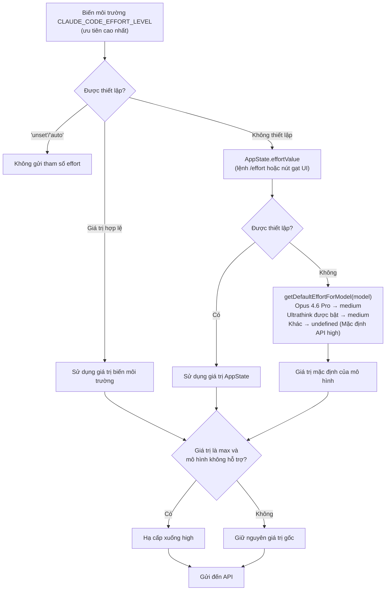

# Chương 21: Effort, Fast Mode, và Cơ chế Suy luận (Thinking)

## Tại sao cần Kiểm soát Phân tầng Suy luận

Độ sâu suy luận (reasoning depth) của mô hình không phải là trường hợp "càng nhiều càng tốt". Suy luận sâu hơn đồng nghĩa với độ trễ (latency) cao hơn, lượng token tiêu thụ nhiều hơn, và thông lượng (throughput) thấp hơn. Đối với các tác vụ đơn giản như "đổi tên biến `foo` thành `bar`", việc để Opus 4.6 dành 10 giây để suy luận sâu là lãng phí; nhưng đối với tác vụ phức tạp như "tái cấu trúc xử lý lỗi của toàn bộ mô-đun xác thực", một câu trả lời nhanh và nông sẽ tạo ra mã nguồn chất lượng kém.

Claude Code kiểm soát độ sâu suy luận thông qua ba cơ chế độc lập nhưng hợp tác với nhau: **Effort** (mức độ nỗ lực suy luận), **Fast Mode** (chế độ tăng tốc), và **Thinking** (cấu hình chuỗi suy nghĩ). Mỗi cơ chế có các nguồn cấu hình, quy tắc ưu tiên, và yêu cầu tương thích mô hình khác nhau, cùng nhau quyết định hành vi suy luận của mỗi lệnh gọi API. Chương này sẽ lần lượt phân tích ba cơ chế này và cách chúng phối hợp khi chạy (runtime).

---

## 21.1 Effort: Mức độ Nỗ lực Suy luận

Effort là một tham số API gốc của Claude nhằm kiểm soát "thời gian suy nghĩ" mà mô hình bỏ ra trước khi tạo ra câu trả lời. Claude Code xây dựng một chuỗi ưu tiên đa tầng trên nền tảng này.

### Bốn Cấp độ

```typescript
// utils/effort.ts:13-18
export const EFFORT_LEVELS = [
  'low',
  'medium',
  'high',
  'max',
] as const satisfies readonly EffortLevel[]
```

| Cấp độ | Mô tả (dòng 224-235) | Giới hạn |
|:---:|:---|:---|
| `low` | Triển khai nhanh, trực tiếp, chi phí tối thiểu | - |
| `medium` | Cách tiếp cận cân bằng, triển khai và kiểm thử tiêu chuẩn | - |
| `high` | Triển khai toàn diện với kiểm thử và tài liệu phong phú | - |
| `max` | Khả năng suy luận sâu nhất | Chỉ Opus 4.6 |

Giới hạn mô hình của cấp độ `max` được viết cứng trong hàm `modelSupportsMaxEffort()` (dòng 53-65): chỉ hỗ trợ `opus-4-6` và các mô hình nội bộ. Khi các mô hình khác cố gắng sử dụng `max`, nó sẽ bị hạ cấp xuống `high` (dòng 164).

### Chuỗi Ưu tiên

Giá trị thực tế của Effort được quyết định bởi một chuỗi ưu tiên ba lớp rõ ràng:

```typescript
// utils/effort.ts:152-167
export function resolveAppliedEffort(
  model: string,
  appStateEffortValue: EffortValue | undefined,
): EffortValue | undefined {
  const envOverride = getEffortEnvOverride()
  if (envOverride === null) {
    return undefined  // Biến môi trường được đặt thành 'unset'/'auto': không gửi tham số effort
  }
  const resolved =
    envOverride ?? appStateEffortValue ?? getDefaultEffortForModel(model)
  if (resolved === 'max' && !modelSupportsMaxEffort(model)) {
    return 'high'
  }
  return resolved
}
```

Độ ưu tiên từ cao xuống thấp:



### Mặc định Mô hình Khác biệt

Hàm `getDefaultEffortForModel()` (dòng 279-329) tiết lộ một chiến lược giá trị mặc định rất tinh tế:

```typescript
// utils/effort.ts:309-319
if (model.toLowerCase().includes('opus-4-6')) {
  if (isProSubscriber()) {
    return 'medium'
  }
  if (
    getOpusDefaultEffortConfig().enabled &&
    (isMaxSubscriber() || isTeamSubscriber())
  ) {
    return 'medium'
  }
}
```

Opus 4.6 mặc định là `medium` cho những người dùng đăng ký gói Pro (không phải `high`) -- đây là một quyết định đã qua kiểm thử A/B (được kiểm soát thông qua `tengu_grey_step2` của GrowthBook, dòng 268-276). Bình luận trong mã nguồn (dòng 307-308) đưa ra cảnh báo rõ ràng:

> QUAN TRỌNG: Không thay đổi cấp độ effort mặc định mà không thông báo cho DRI phụ trách phát hành mô hình và phòng nghiên cứu. Cấp độ mặc định là một thiết lập nhạy cảm có thể ảnh hưởng lớn đến chất lượng mô hình và hành vi lặp lại (bashing).

Khi tính năng Ultrathink được bật, tất cả các mô hình hỗ trợ effort cũng mặc định là `medium` (dòng 322-324), bởi vì Ultrathink sẽ tự động tăng effort lên `high` khi đầu vào của người dùng chứa các từ khóa cụ thể -- do đó `medium` trở thành mức cơ sở có thể được nâng cao một cách động.

### Cấp độ Effort dạng Số (Chỉ dành cho Nội bộ)

Ngoài bốn cấp độ dạng chuỗi (string), người dùng nội bộ cũng có thể sử dụng effort dạng số (dòng 198-216):

```typescript
// utils/effort.ts:202-216
export function convertEffortValueToLevel(value: EffortValue): EffortLevel {
  if (typeof value === 'string') {
    return isEffortLevel(value) ? value : 'high'
  }
  if (process.env.USER_TYPE === 'ant' && typeof value === 'number') {
    if (value <= 50) return 'low'
    if (value <= 85) return 'medium'
    if (value <= 100) return 'high'
    return 'max'
  }
  return 'high'
}
```

Effort dạng số không thể được lưu trữ bền vững vào các tệp cài đặt (hàm `toPersistableEffort()`, dòng 95-105, lọc bỏ tất cả các số) -- nó chỉ tồn tại trong thời gian chạy phiên. Đây là một cơ chế thử nghiệm không được phép vô tình rò rỉ vào tệp `settings.json` của người dùng.

### Ranh giới Lưu trữ Bền vững của Effort

Logic lọc của `toPersistableEffort()` tiết lộ một thiết kế tinh tế: cấp độ `max` cũng không được lưu trữ bền vững đối với người dùng bên ngoài (dòng 101), chỉ có hiệu lực cho phiên hiện tại. Điều này có nghĩa là mức `max` được thiết lập qua `/effort max` sẽ hoàn tác về mặc định của mô hình trong lần khởi chạy tiếp theo -- đây là điều có chủ ý, giúp người dùng không quên tắt mức max và vô tình tiêu thụ quá nhiều tài nguyên trong thời gian dài.

---

## 21.2 Fast Mode: Tăng tốc Opus 4.6

Fast Mode (tên mã nội bộ "Penguin Mode") là chế độ cho phép các mô hình lớp Sonnet sử dụng Opus 4.6 làm "bộ tăng tốc" -- khi mô hình chính của người dùng không phải là Opus, các yêu cầu cụ thể có thể được định tuyến đến Opus 4.6 để có câu trả lời chất lượng cao hơn.

### Chuỗi Kiểm tra Tính Khả dụng

Tính khả dụng của Fast Mode đi qua nhiều lớp kiểm tra:

```typescript
// utils/fastMode.ts:38-40
export function isFastModeEnabled(): boolean {
  return !isEnvTruthy(process.env.CLAUDE_CODE_DISABLE_FAST_MODE)
}
```

Sau công tắc cấp cao nhất, `getFastModeUnavailableReason()` kiểm tra các điều kiện sau (dòng 72-140):

1. **Công tắc tắt từ xa của Statsig** (`tengu_penguins_off`): Công tắc từ xa có ưu tiên cao nhất.
2. **Binary phi bản xứ (Non-native binary)**: Kiểm tra tùy chọn, được kiểm soát qua GrowthBook.
3. **Chế độ SDK**: Theo mặc định không khả dụng trong Agent SDK trừ khi được chọn rõ ràng.
4. **Nhà cung cấp không phải bên thứ nhất (Non-first-party provider)**: Không hỗ trợ Bedrock/Vertex/Foundry.
5. **Vô hiệu hóa cấp tổ chức**: Trạng thái tổ chức được trả về bởi API.

### Liên kết Mô hình

Fast Mode được liên kết cứng với Opus 4.6:

```typescript
// utils/fastMode.ts:143-147
export const FAST_MODE_MODEL_DISPLAY = 'Opus 4.6'

export function getFastModeModel(): string {
  return 'opus' + (isOpus1mMergeEnabled() ? '[1m]' : '')
}
```

Hàm `isFastModeSupportedByModel()` cũng chỉ trả về `true` cho Opus 4.6 (dòng 167-176) -- nghĩa là nếu người dùng đã sử dụng Opus 4.6 làm mô hình chính, Fast Mode sẽ không được kích hoạt.

### Máy Trạng thái Cooldown

Trạng thái thời gian chạy của Fast Mode là một máy trạng thái trang nhã:

```typescript
// utils/fastMode.ts:183-186
export type FastModeRuntimeState =
  | { status: 'active' }
  | { status: 'cooldown'; resetAt: number; reason: CooldownReason }
```

```
┌─────────────────────────────────────────────────────────────┐
│             Máy trạng thái Cooldown của Fast Mode           │
│                                                             │
│   ┌──────────┐    triggerFastModeCooldown()   ┌──────────┐ │
│   │          │──────────────────────────────►│          │ │
│   │ hoạt động│                               │ cooldown │ │
│   │ (active) │◄──────────────────────────────│          │ │
│   └──────────┘    Date.now() >= resetAt      └──────────┘ │
│       │                                          │         │
│       │ handleFastModeRejectedByAPI()            │         │
│       │ handleFastModeOverageRejection()         │         │
│       ▼                                          │         │
│   ┌──────────┐                                   │         │
│   │ vô hiệu  │  (orgStatus = {status:'disabled'})│         │
│   │ vĩnh viễn│◄──────────────────────────────────┘         │
│   └──────────┘  (nếu lý do không phải là                   │
│                  out_of_credits)                           │
│                                                             │
│   Các lý do kích hoạt (CooldownReason):                     │
│   • 'rate_limit'  — Giới hạn tần suất API 429              │
│   • 'overloaded'  — Dịch vụ quá tải                         │
│                                                             │
│   Hết hạn cooldown tự động khôi phục                        │
│   (kiểm tra thời gian: getFastModeRuntimeState())           │
└─────────────────────────────────────────────────────────────┘
```

Khi cooldown được kích hoạt (`triggerFastModeCooldown()`, dòng 214-233), hệ thống sẽ ghi lại dấu thời gian kết thúc cooldown và lý do, gửi các sự kiện phân tích, và thông báo cho UI thông qua Signal:

```typescript
// utils/fastMode.ts:214-233
export function triggerFastModeCooldown(
  resetTimestamp: number,
  reason: CooldownReason,
): void {
  runtimeState = { status: 'cooldown', resetAt: resetTimestamp, reason }
  hasLoggedCooldownExpiry = false
  logEvent('tengu_fast_mode_fallback_triggered', {
    cooldown_duration_ms: cooldownDurationMs,
    cooldown_reason: reason,
  })
  cooldownTriggered.emit(resetTimestamp, reason)
}
```

Việc phát hiện hết hạn cooldown là **trì hoãn (lazy)** -- không sử dụng bộ hẹn giờ (timers); thay vào đó, nó kiểm tra trên mỗi cuộc gọi đến `getFastModeRuntimeState()` (dòng 199-212). Điều này tránh tiêu thụ tài nguyên bộ hẹn giờ không cần thiết; tín hiệu `cooldownExpired` chỉ phát ra khi trạng thái được truy vấn lần tiếp theo.

### Tải trước Trạng thái Cấp Tổ chức (Organization-Level Status Prefetch)

Việc một tổ chức có cho phép Fast Mode hay không được xác định qua việc tải trước API. Hàm `prefetchFastModeStatus()` (dòng 407-532) gọi endpoint `/api/claude_code_penguin_mode` lúc khởi động, với kết quả được lưu vào bộ nhớ đệm trong biến `orgStatus`.

Việc tải trước có tính năng bảo vệ chống nghẽn (khoảng thời gian tối thiểu 30 giây, dòng 383-384) và chống rung (chỉ có tối đa một yêu cầu đang thực hiện tại một thời điểm, dòng 416-420). Khi xác thực thất bại, nó tự động cố gắng làm mới mã thông báo OAuth (dòng 466-479).

Khi network requests thất bại, người dùng nội bộ mặc định được cho phép (không chặn việc phát triển nội bộ), trong khi người dùng bên ngoài sẽ sử dụng giá trị dự phòng được lưu trên đĩa `penguinModeOrgEnabled` (dòng 511-520).

### Đầu ra Ba Trạng thái

Hàm `getFastModeState()` nén tất cả trạng thái thành ba trạng thái mà người dùng có thể nhìn thấy:

```typescript
// utils/fastMode.ts:319-335
export function getFastModeState(
  model: ModelSetting,
  fastModeUserEnabled: boolean | undefined,
): 'off' | 'cooldown' | 'on' {
  const enabled =
    isFastModeEnabled() &&
    isFastModeAvailable() &&
    !!fastModeUserEnabled &&
    isFastModeSupportedByModel(model)
  if (enabled && isFastModeCooldown()) {
    return 'cooldown'
  }
  if (enabled) {
    return 'on'
  }
  return 'off'
}
```

Ba trạng thái này khớp với các phản hồi trực quan khác nhau trên UI -- `on` hiển thị biểu tượng tăng tốc, `cooldown` hiển thị thông báo giảm cấp tạm thời, `off` không hiển thị gì.

---

## 21.3 Cấu hình Cơ chế Suy luận (Thinking Configuration)

Cơ chế suy luận (chuỗi suy nghĩ / extended thinking) kiểm soát xem mô hình có xuất ra quá trình suy luận của nó hay không và xuất ra như thế nào.

### Ba Chế độ

```typescript
// utils/thinking.ts:10-13
export type ThinkingConfig =
  | { type: 'adaptive' }
  | { type: 'enabled'; budgetTokens: number }
  | { type: 'disabled' }
```

| Chế độ | Hành vi API | Điều kiện Áp dụng |
|:---:|:---|:---|
| `adaptive` | Mô hình tự quyết định có nên suy nghĩ và suy nghĩ bao nhiêu | Opus 4.6, Sonnet 4.6, và các mô hình mới khác |
| `enabled` | Sử dụng ngân sách token cố định cho chuỗi suy nghĩ | Các mô hình Claude 4 cũ hơn không hỗ trợ adaptive |
| `disabled` | Không xuất ra chuỗi suy nghĩ | Xác thực khóa API và các cuộc gọi có chi phí thấp khác |

### Các Lớp Tương thích Mô hình

Ba hàm phát hiện khả năng độc lập xử lý các cấp độ hỗ trợ Thinking khác nhau:

**`modelSupportsThinking()`** (dòng 90-110): Phát hiện xem mô hình có hỗ trợ chuỗi suy nghĩ hay không.

```typescript
// utils/thinking.ts:105-109
if (provider === 'foundry' || provider === 'firstParty') {
  return !canonical.includes('claude-3-')  // Hỗ trợ tất cả Claude 4+
}
return canonical.includes('sonnet-4') || canonical.includes('opus-4')
```

Đối với các nhà cung cấp bên thứ nhất và Foundry: hỗ trợ tất cả các mô hình ngoại trừ Claude 3. Đối với nhà cung cấp bên thứ ba (Bedrock/Vertex): chỉ hỗ trợ Sonnet 4+ và Opus 4+ -- phản ánh sự khác biệt về tính khả dụng của mô hình trong các triển khai của bên thứ ba.

**`modelSupportsAdaptiveThinking()`** (dòng 113-144): Phát hiện xem mô hình có hỗ trợ chế độ thích ứng hay không.

```typescript
// utils/thinking.ts:119-123
if (canonical.includes('opus-4-6') || canonical.includes('sonnet-4-6')) {
  return true
}
```

Chỉ các mô hình phiên bản 4.6 trở lên mới hỗ trợ rõ ràng chế độ thích ứng (adaptive). Đối với các chuỗi ký tự mô hình chưa biết, bên thứ nhất và Foundry mặc định là `true` (dòng 143), bên thứ ba mặc định là `false` -- bình luận trong mã nguồn giải thích lý do (dòng 136-141):

> Các mô hình mới hơn (4.6+) đều được huấn luyện trên suy luận thích ứng (adaptive thinking) và BẮT BUỘC phải bật nó để kiểm thử mô hình. KHÔNG đặt mặc định là false cho bên thứ nhất, nếu không chúng ta có thể làm giảm chất lượng mô hình một cách âm thầm.

**`shouldEnableThinkingByDefault()`** (dòng 146-162): Quyết định xem Thinking có được bật theo mặc định hay không.

```typescript
// utils/thinking.ts:146-162
export function shouldEnableThinkingByDefault(): boolean {
  if (process.env.MAX_THINKING_TOKENS) {
    return parseInt(process.env.MAX_THINKING_TOKENS, 10) > 0
  }
  const { settings } = getSettingsWithErrors()
  if (settings.alwaysThinkingEnabled === false) {
    return false
  }
  return true
}
```

Ưu tiên: Biến môi trường `MAX_THINKING_TOKENS` > `alwaysThinkingEnabled` trong cài đặt > mặc định được bật.

### So sánh Ba Chế độ

| Chiều | adaptive | enabled | disabled |
| :---: | :--- | :--- | :--- |
| **Ngân sách suy nghĩ** | Mô hình tự quyết định | Ngân sách token cố định | Không suy luận |
| **Tham số API** | `{type: 'adaptive'}` | `{type: 'enabled', budget_tokens: N}` | Không có tham số hoặc disable |
| **Mô hình hỗ trợ** | Opus/Sonnet 4.6 | Tất cả các dòng Claude 4 | Tất cả các mô hình |
| **Trạng thái mặc định**| Ưu tiên cho mô hình 4.6 | Dự phòng cho dòng 4 cũ hơn | Khi bị vô hiệu hóa rõ ràng |
| **Tương tác với Effort**| Effort kiểm soát độ sâu suy luận | Ngân sách kiểm soát trần suy luận | Không áp dụng |
| **Trường hợp sử dụng** | Hầu hết các cuộc hội thoại | Khi cần kiểm soát ngân sách chính xác | Xác thực API, schema công cụ v.v. |

### Áp dụng ở Cấp độ API

Trong `services/api/claude.ts` (dòng 1602-1622), ThinkingConfig được chuyển đổi thành các tham số API thực tế:

```typescript
// services/api/claude.ts:1604-1622 (simplified)
if (hasThinking && modelSupportsThinking(options.model)) {
  if (!isEnvTruthy(process.env.CLAUDE_CODE_DISABLE_ADAPTIVE_THINKING)
      && modelSupportsAdaptiveThinking(options.model)) {
    thinking = { type: 'adaptive' }
  } else {
    let thinkingBudget = getMaxThinkingTokensForModel(options.model)
    if (thinkingConfig.type === 'enabled' && thinkingConfig.budgetTokens !== undefined) {
      thinkingBudget = thinkingConfig.budgetTokens
    }
    thinking = { type: 'enabled', budget_tokens: thinkingBudget }
  }
}
```

Logic quyết định là: ưu tiên thích ứng (adaptive) -> nếu thích ứng không được hỗ trợ, sử dụng ngân sách cố định -> ngân sách do người dùng chỉ định sẽ ghi đè giá trị mặc định. Biến môi trường `CLAUDE_CODE_DISABLE_ADAPTIVE_THINKING` là lối thoát cuối cùng, cho phép bắt buộc quay về chế độ ngân sách cố định.

---

## 21.4 Ultrathink: Tăng Effort Kích hoạt bằng Từ khóa

Ultrathink là một thiết kế tương tác thông minh: khi người dùng đưa từ khóa `ultrathink` vào tin nhắn của họ, Effort sẽ tự động được tăng từ `medium` lên `high`.

### Cơ chế Phân cổng (Gating Mechanism)

Ultrathink được kiểm soát bởi hai lớp:

```typescript
// utils/thinking.ts:19-24
export function isUltrathinkEnabled(): boolean {
  if (!feature('ULTRATHINK')) {
    return false
  }
  return getFeatureValue_CACHED_MAY_BE_STALE('tengu_turtle_carbon', true)
}
```

Feature Flag lúc build (`ULTRATHINK`) kiểm soát xem mã nguồn có được đưa vào gói phân phối hay không, và Flag lúc chạy của GrowthBook (`tengu_turtle_carbon`) kiểm soát xem nó có được bật cho người dùng hiện tại hay không.

### Phát hiện Từ khóa

```typescript
// utils/thinking.ts:29-31
export function hasUltrathinkKeyword(text: string): boolean {
  return /\bultrathink\b/i.test(text)
}
```

Việc phát hiện sử dụng so khớp ranh giới từ (`\b`), không phân biệt chữ hoa chữ thường. Hàm `findThinkingTriggerPositions()` (dòng 36-58) trả về thêm thông tin vị trí cho mỗi lần khớp, phục vụ cho việc tô màu nổi bật trên UI.

Lưu ý một chi tiết trong mã nguồn (bình luận dòng 42-44): một regex literal mới được tạo ra trên mỗi cuộc gọi thay vì sử dụng lại một thực thể dùng chung, vì `String.prototype.matchAll` sao chép trạng thái từ `lastIndex` của regex nguồn -- nếu chia sẻ một thực thể với hàm `.test()` của `hasUltrathinkKeyword`, `lastIndex` sẽ bị rò rỉ giữa các cuộc gọi.

### Tiêm Tệp đính kèm (Attachment Injection)

Việc tăng effort của Ultrathink được thực hiện thông qua hệ thống tệp đính kèm (`utils/attachments.ts` dòng 1446-1452):

```typescript
// utils/attachments.ts:1446-1452
function getUltrathinkEffortAttachment(input: string | null): Attachment[] {
  if (!isUltrathinkEnabled() || !input || !hasUltrathinkKeyword(input)) {
    return []
  }
  logEvent('tengu_ultrathink', {})
  return [{ type: 'ultrathink_effort', level: 'high' }]
}
```

Tệp đính kèm này được chuyển đổi thành một thông điệp nhắc nhở hệ thống được tiêm vào cuộc hội thoại (`utils/messages.ts` dòng 4170-4175):

```typescript
case 'ultrathink_effort': {
  return wrapMessagesInSystemReminder([
    createUserMessage({
      content: `The user has requested reasoning effort level: ${attachment.level}. Apply this to the current turn.`,
      isMeta: true,
    }),
  ])
}
```

Ultrathink không sửa đổi trực tiếp đầu ra của `resolveAppliedEffort()` -- nó thông báo cho mô hình thông qua hệ thống tin nhắn rằng "người dùng đã yêu cầu nỗ lực suy luận cao hơn", cho phép mô hình tự điều chỉnh trong chế độ suy luận thích ứng. Đây là một sự can thiệp thuần túy ở cấp độ prompt mà không làm thay đổi các tham số API.

### Phối hợp với Effort Mặc định

Thiết kế của Ultrathink ghép đôi hoàn hảo với mức effort mặc định `medium` của Opus 4.6:

1. Mức effort mặc định là `medium` (phản hồi nhanh cho hầu hết các yêu cầu).
2. Khi người dùng cần suy luận sâu, họ gõ `ultrathink`.
3. Hệ thống tệp đính kèm sẽ tiêm vào một thông điệp tăng cường effort.
4. Mô hình sẽ tăng độ sâu suy luận tương ứng trong chế độ suy luận thích ứng.

Sự trang nhã của thiết kế này: người dùng có được một **giao diện điều khiển ngữ nghĩa (semantic control interface)** -- không cần hiểu các chi tiết kỹ thuật của tham số effort, chỉ cần viết `ultrathink` vào tin nhắn khi "cần suy nghĩ sâu hơn."

### Giao diện Cầu vồng (Rainbow UI)

Khi Ultrathink được kích hoạt, UI hiển thị từ khóa bằng màu cầu vồng (dòng 60-86):

```typescript
// utils/thinking.ts:60-68
const RAINBOW_COLORS: Array<keyof Theme> = [
  'rainbow_red',
  'rainbow_orange',
  'rainbow_yellow',
  'rainbow_green',
  'rainbow_blue',
  'rainbow_indigo',
  'rainbow_violet',
]
```

Hàm `getRainbowColor()` gán màu tuần hoàn dựa trên chỉ mục ký tự, kèm theo một bộ các biến thể shimmer cho hiệu ứng lấp lánh. Phản hồi trực quan này giúp người dùng biết Ultrathink đã được ghi nhận và kích hoạt.

---

## 21.5 Cách Ba Cơ chế Phối hợp

Effort, Fast Mode, và Thinking không hoạt động độc lập. Sự tương tác của chúng trên đường dẫn cuộc gọi API tạo thành một bảng điều khiển đa lớp:

```
Đầu vào Người dùng
  │
  ├─ Chứa "ultrathink"? ──► Tiêm tệp đính kèm ultrathink_effort
  │
  ▼
resolveAppliedEffort(model, appState.effortValue)
  │
  ├─ env CLAUDE_CODE_EFFORT_LEVEL ──► Sử dụng trực tiếp
  ├─ appState.effortValue ──► Thiết lập qua lệnh /effort
  └─ getDefaultEffortForModel() ──► Opus 4.6 Pro → 'medium'
  │
  ▼
Giá trị Effort ──► tham số effort được gửi đến API
  │
  ▼
Kiểm tra Fast Mode
  │
  ├─ getFastModeState() = 'on' ──► Định tuyến đến Opus 4.6
  ├─ getFastModeState() = 'cooldown' ──► Sử dụng mô hình gốc
  └─ getFastModeState() = 'off' ──► Sử dụng mô hình gốc
  │
  ▼
Cấu hình Thinking (Cơ chế suy luận)
  │
  ├─ modelSupportsAdaptiveThinking()? ──► { type: 'adaptive' }
  ├─ modelSupportsThinking()? ──► { type: 'enabled', budget_tokens: N }
  └─ Cả hai không được hỗ trợ ──► { type: 'disabled' }
  │
  ▼
Lệnh gọi API: messages.create({
  model, effort, thinking, ...
})
```

Các điểm tương tác chính:

- **Effort + Thinking**: Khi Effort ở mức `medium` và Thinking ở chế độ `adaptive`, mô hình có thể chọn suy luận ít hơn. Khi Ultrathink đẩy Effort lên `high`, suy luận thích ứng sẽ tăng độ sâu suy luận tương ứng.
- **Fast Mode + Effort**: Fast Mode thay đổi mô hình (định tuyến đến Opus 4.6), trong khi Effort thay đổi độ sâu suy luận của cùng một mô hình. Cả hai trực giao với nhau.
- **Fast Mode + Thinking**: Khi Fast Mode định tuyến các yêu cầu đến Opus 4.6, mô hình đó hỗ trợ suy luận thích ứng, vì vậy cấu hình Thinking sẽ tự động nâng cấp.

---

## 21.6 Đúc kết Thiết kế

**Triết lý lấy "medium" làm mặc định.** Opus 4.6 mặc định sử dụng mức effort `medium` cho người dùng Pro thay vì `high` như trực giác, phản ánh một sự đánh đổi sâu sắc: hầu hết các tương tác lập trình không cần suy luận sâu nhất, và việc giảm effort mặc định có thể cải thiện đáng kể thông lượng và giảm độ trễ. Cơ chế Ultrathink sau đó cung cấp một **đường dẫn nâng cấp không ma sát (zero-friction upgrade path)** -- người dùng không cần rời khỏi luồng hội thoại để điều chỉnh cài đặt, chỉ cần thêm một từ vào câu của họ.

**Mẫu kiểm tra trạng thái lười (lazy state check).** Việc phát hiện hết hạn cooldown của Fast Mode không sử dụng bộ hẹn giờ, thay vào đó tính toán một cách lười (lazily) trên mỗi truy vấn trạng thái (dòng 199-212). Mô hình này xuất hiện nhiều lần trong Claude Code -- nó tránh được chi phí tài nguyên bộ hẹn giờ và các tình trạng tranh chấp (race conditions), với cái giá là độ chính xác thời điểm chuyển trạng thái phụ thuộc vào tần suất truy vấn. Đối với các hệ thống hướng UI, cái giá này hầu như bằng không.

**Cấu trúc phát hiện khả năng ba lớp.** `modelSupportsThinking` -> `modelSupportsAdaptiveThinking` -> `shouldEnableThinkingByDefault` tạo thành một chuỗi quyết định từ "có thể sử dụng" đến "có nên bật". Mỗi lớp xem xét các yếu tố khác nhau (khả năng của mô hình, sự khác biệt của nhà cung cấp, sở thích của người dùng), và mỗi lớp đều mang các bình luận cảnh báo rõ ràng "không sửa đổi nếu không thông báo cho người phụ trách". Sự bảo vệ đa lớp này phản ánh tính nhạy cảm của cấu hình suy luận đối với chất lượng mô hình -- một sự thay đổi giá trị mặc định bất cẩn có thể làm giảm trải nghiệm của toàn bộ cơ sở người dùng.

**Ranh giới lưu trữ bền vững thận trọng.** Cấp độ effort `max` không được lưu trữ bền vững đối với người dùng bên ngoài, effort dạng số không được lưu trữ bền vững, tùy chọn tham gia theo từng phiên của Fast Mode -- những lựa chọn thiết kế này đều tuân theo cùng một nguyên tắc: **các cấu hình chi phí cao không nên rò rỉ qua các phiên**. Việc người dùng bật `max` trong một phiên là một lựa chọn có ý thức; nhưng nếu lựa chọn đó được mang sang phiên tiếp theo một cách âm thầm, nó có thể trở thành một sự lãng phí tài nguyên bị lãng quên.

---

## Những việc Người dùng Có thể Làm

**Điều chỉnh độ sâu suy luận để phù hợp với độ phức tạp của tác vụ:**

1. **Sử dụng lệnh `/effort` để điều chỉnh mức độ suy luận.** Đối với các thay đổi mã nguồn đơn giản (đổi tên biến, thêm bình luận), `/effort low` có thể giảm đáng kể độ trễ. Đối với các quyết định kiến trúc phức tạp hoặc điều tra lỗi, `/effort high` hoặc `max` (chỉ Opus 4.6) cung cấp phân tích sâu hơn.

2. **Gõ `ultrathink` trong tin nhắn để kích hoạt suy luận sâu.** Khi sử dụng Opus 4.6 với mức effort mặc định là `medium`, việc thêm từ khóa `ultrathink` sẽ tạm thời nâng mức suy luận lên `high` -- không cần rời khỏi luồng hội thoại để điều chỉnh cài đặt.

3. **Cố định Effort qua biến môi trường.** Nếu nhóm của bạn có một chiến lược suy luận thống nhất, hãy đặt `CLAUDE_CODE_EFFORT_LEVEL=high` trong tệp `.env` hoặc các kịch bản khởi động. Đặt nó thành `unset` hoặc `auto` sẽ bỏ qua hoàn toàn tham số effort, để API sử dụng các giá trị mặc định phía máy chủ.

4. **Hiểu cơ chế cooldown của Fast Mode.** Khi Fast Mode (tăng tốc Opus 4.6) đi vào trạng thái cooldown do giới hạn tần suất (rate limiting), hệ thống sẽ tự động quay về mô hình gốc. Cooldown là tạm thời và tự động khôi phục khi hết hạn -- không cần can thiệp thủ công.

5. **Lưu ý sự tương thích giữa chế độ Thinking và mô hình.** Opus 4.6 và Sonnet 4.6 hỗ trợ chế độ suy luận `adaptive` (mô hình tự quyết định độ sâu suy luận), trong khi các mô hình Claude 4 cũ hơn sử dụng chế độ ngân sách cố định. Để bắt buộc tắt suy luận thích ứng, hãy đặt biến môi trường `CLAUDE_CODE_DISABLE_ADAPTIVE_THINKING=true`.

6. **Mức effort `max` không tồn tại lâu dài giữa các phiên.** Đây là thiết kế có chủ ý -- giúp tránh việc quên tắt mức `max` gây tiêu tốn tài nguyên dài hạn. Mỗi phiên mới sẽ khôi phục về mặc định của mô hình.

---

## Tiến hóa Phiên bản: Các thay đổi trong v2.1.91

### Kiểm soát Chi phí Agent (Agent Cost Control)

Phiên bản v2.1.91 bổ sung biến môi trường `CLAUDE_CODE_AGENT_COST_STEER`, gợi ý việc giới thiệu cơ chế điều phối chi phí của subagent. Kết hợp với sự kiện `tengu_forked_agent_default_turns_exceeded` mới, v2.1.91 cung cấp khả năng kiểm soát chi phí chi tiết hơn trong các kịch bản đa Agent -- không chỉ giới hạn ngân sách suy nghĩ của từng Agent riêng lẻ (như được mô tả trong chương này), mà còn điều phối mức tiêu thụ tài nguyên ở cấp độ tổng hợp.

---

## Tiến hóa Phiên bản: v2.1.100 — Công cụ Cố vấn (Advisor Tool)

### Cố vấn (Advisor): Mô hình Mạnh Đánh giá Mô hình Yếu

Phiên bản v2.1.100 giới thiệu công cụ Cố vấn (Advisor tool) — một công cụ phía máy chủ (`server_tool_use`) nơi một mô hình đánh giá (reviewer model) mạnh hơn sẽ đánh giá đầu ra của mô hình đang hoạt động hiện tại. Đây là một chiều kích hoàn toàn mới của việc kiểm soát độ sâu suy luận: thay vì điều chỉnh tham số effort để thay đổi độ sâu suy nghĩ của cùng một mô hình, nó giới thiệu một **mô hình độc lập mạnh hơn làm bên đánh giá**.

**Cơ chế cốt lõi**:

Advisor đăng ký dưới dạng một công cụ không tham số — gọi `advisor()` không yêu cầu đầu vào, và hệ thống tự động chuyển tiếp toàn bộ lịch sử hội thoại đến mô hình đánh giá. Mô tả công cụ được trích xuất từ bundle:

```text
# Advisor Tool
You have access to an `advisor` tool backed by a stronger reviewer model.
It takes NO parameters -- when you call advisor(), your entire conversation
history is automatically forwarded.
```

**Các quy tắc gọi** (được trích xuất từ prompt của advisor trong bundle):

1. **Gọi trước khi thực hiện công việc thực chất**: "Gọi advisor TRƯỚC KHI thực hiện công việc thực chất — trước khi viết mã, trước khi commit"
2. **Khảo sát nhẹ nhàng được miễn**: "Việc định hướng không phải là công việc thực chất. Viết, chỉnh sửa, và commit mới là công việc thực chất"
3. **Ít nhất hai lần cho các tác vụ dài**: "Đối với các tác vụ dài hơn vài bước, hãy gọi advisor ít nhất một lần trước khi quyết định một cách tiếp cận và một lần trước khi hoàn tất"
4. **Xử lý xung đột**: "Nếu bạn đã lấy dữ liệu chỉ ra một hướng và advisor chỉ ra hướng khác: không âm thầm chuyển đổi. Hãy đưa xung đột ra ánh sáng"

**Lựa chọn mô hình và Feature Gate**:

```javascript
// Phân tích đảo ngược mã nguồn bundle v2.1.100
// Feature gate
UZ1 = "advisor-tool-2026-03-01"

// Các kiểm tra tương thích mô hình
if (!OR6(K)) {
  N("[AdvisorTool] Skipping advisor - base model does not support advisor");
  return;
}
if (!O88(_)) {
  N("[AdvisorTool] Skipping advisor - not a valid advisor model");
  return;
}
```

Mô hình cố vấn được chỉ định thông qua trường cấu hình `advisorModel` và phải thỏa mãn hai điều kiện: mô hình cơ sở hỗ trợ cố vấn (`OR6`) và mô hình cố vấn được chỉ định là hợp lệ (`O88`). Cấu hình điển hình có thể là mô hình yếu hơn làm việc + mô hình mạnh hơn đánh giá, nhưng các quy tắc khớp mô hình chính xác được kiểm soát bởi các hàm nội bộ `OR6` và `O88` và không thể phục dựng chính xác từ bundle.

**Mối quan hệ với Effort**:

Advisor không thay thế Effort — chúng giải quyết vấn đề ở các chiều kích khác nhau:

| Chiều | Effort | Advisor |
|---|---|---|
| Đối tượng kiểm soát | Độ sâu suy nghĩ của cùng một mô hình | Giới thiệu sự đánh giá của một mô hình khác |
| Mô hình chi phí | Nhiều token suy nghĩ hơn trên mỗi cuộc gọi | Lệnh gọi API đầy đủ độc lập |
| Độ trễ | Tăng độ trễ của phản hồi hiện tại | Cuộc gọi Advisor yêu cầu thêm thời gian |
| Trường hợp sử dụng | Suy luận phức tạp đơn bước | Xác thực hướng đi trên công việc nhiều bước |

**Bài học cho các nhà xây dựng Agent**: Mô hình Advisor gợi ý một kiến trúc Agent "phát triển hướng đánh giá (review-driven development)" -- để các mô hình rẻ hơn xử lý các tác vụ thông thường, và các mô hình đắt tiền đóng vai trò gác cổng tại các thời điểm quyết định quan trọng. Điều này kinh tế hơn việc sử dụng đồng bộ mô hình mạnh nhất, và an toàn hơn việc chỉ dựa vào các mô hình yếu hơn.
