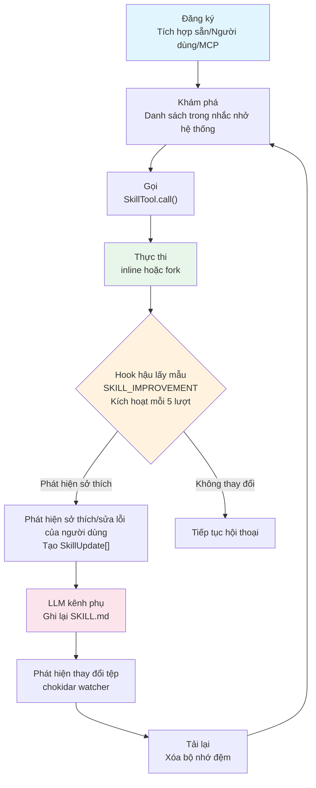

# Chương 22: Hệ thống Kỹ năng -- Từ Tích hợp sẵn đến Do Người dùng Định nghĩa

## Tại sao Điều này Quan trọng

Trong các chương trước, chúng ta đã phân tích hệ thống công cụ, mô hình quyền hạn, và quản lý ngữ cảnh của Claude Code. Nhưng có một lớp mở rộng quan trọng xuyên suốt tất cả các hệ thống này: **Hệ thống Kỹ năng (Skills System)**.

Khi người dùng nhập `/batch migrate from react to vue`, Claude Code không thực thi một "lệnh" -- nó đang tải một mẫu prompt được thiết kế cẩn thận, tiêm nó vào cửa sổ ngữ cảnh (context window), khiến mô hình hoạt động theo một luồng công việc được xác định trước. Bản chất của hệ thống kỹ năng là **các mẫu prompt có thể gọi được (callable prompt templates)** -- nó mã hóa các thực hành tốt nhất đã được kiểm chứng nhiều lần dưới dạng các tệp Markdown, được tiêm vào luồng hội thoại thông qua công cụ `Skill`.

Triết lý thiết kế này mang lại một ý nghĩa kỹ thuật sâu sắc: kỹ năng không phải là logic mã nguồn, mà là **tri thức có cấu trúc**. Một tệp kỹ năng có thể định nghĩa những công cụ nó cần, mô hình nào cần sử dụng, và ngữ cảnh thực thi nào cần chạy, nhưng cốt lõi của nó luôn là một đoạn văn bản Markdown -- được diễn giải và thực thi bởi một LLM.

Chương này sẽ bắt đầu từ các kỹ năng tích hợp sẵn và dần dần tiết lộ các cơ chế đăng ký, khám phá, tải, thực thi, và cải tiến.

---

## 22.1 Bản chất của Kỹ năng: Các loại Lệnh và Đăng ký

### Cấu trúc BundledSkillDefinition

Mỗi kỹ năng cuối cùng đều được biểu diễn dưới dạng một đối tượng `Command`. Các kỹ năng tích hợp sẵn được đăng ký thông qua hàm `registerBundledSkill`, với kiểu định nghĩa sau:

```typescript
// skills/bundledSkills.ts:15-41
export type BundledSkillDefinition = {
  name: string
  description: string
  aliases?: string[]
  whenToUse?: string
  argumentHint?: string
  allowedTools?: string[]
  model?: string
  disableModelInvocation?: boolean
  userInvocable?: boolean
  isEnabled?: () => boolean
  hooks?: HooksSettings
  context?: 'inline' | 'fork'
  agent?: string
  files?: Record<string, string>
  getPromptForCommand: (
    args: string,
    context: ToolUseContext,
  ) => Promise<ContentBlockParam[]>
}
```

Kiểu dữ liệu này tiết lộ một số chiều kích chính của kỹ năng:

| Trường | Mục đích | Giá trị Điển hình |
|-------|---------|---------------|
| `name` | Tên gọi kỹ năng, tương ứng với cú pháp `/name` | `"batch"`, `"simplify"` |
| `whenToUse` | Cho mô hình biết **khi nào** nên chủ động gọi kỹ năng này | Xuất hiện trong nhắc nhở hệ thống (system-reminder) |
| `allowedTools` | Các công cụ tự động cấp quyền trong quá trình thực thi kỹ năng | `['Read', 'Grep', 'Glob']` |
| `context` | Ngữ cảnh thực thi -- `inline` tiêm vào hội thoại chính, `fork` chạy trong một subagent | `'fork'` |
| `disableModelInvocation` | Ngăn mô hình tự động gọi, chỉ người dùng mới có thể nhập rõ ràng | `true` (batch) |
| `files` | Các tệp tham chiếu đi kèm kỹ năng, được giải nén ra đĩa khi gọi lần đầu | Kịch bản xác thực kỹ năng |
| `getPromptForCommand` | **Cốt lõi**: Tạo ra nội dung prompt được tiêm vào ngữ cảnh | Trả về `ContentBlockParam[]` |

Bản thân luồng đăng ký rất đơn giản -- `registerBundledSkill` chuyển đổi định nghĩa thành một đối tượng `Command` tiêu chuẩn và đẩy nó vào một mảng nội bộ:

```typescript
// skills/bundledSkills.ts:53-100
export function registerBundledSkill(definition: BundledSkillDefinition): void {
  const { files } = definition
  let skillRoot: string | undefined
  let getPromptForCommand = definition.getPromptForCommand

  if (files && Object.keys(files).length > 0) {
    skillRoot = getBundledSkillExtractDir(definition.name)
    let extractionPromise: Promise<string | null> | undefined
    const inner = definition.getPromptForCommand
    getPromptForCommand = async (args, ctx) => {
      extractionPromise ??= extractBundledSkillFiles(definition.name, files)
      const extractedDir = await extractionPromise
      const blocks = await inner(args, ctx)
      if (extractedDir === null) return blocks
      return prependBaseDir(blocks, extractedDir)
    }
  }

  const command: Command = {
    type: 'prompt',
    name: definition.name,
    // ... ánh xạ trường ...
    source: 'bundled',
    loadedFrom: 'bundled',
    getPromptForCommand,
  }
  bundledSkills.push(command)
}
```

Lưu ý mẫu `extractionPromise ??= ...` ở dòng 71 -- đây là một "Promise ghi nhớ (memoized Promise)." Khi nhiều bên gọi đồng thời kích hoạt cuộc gọi đầu tiên, tất cả họ đều chờ đợi trên **cùng một Promise**, tránh các tình trạng tranh chấp (race conditions) gây ra việc ghi đè tệp trùng lặp.

### Biện pháp An toàn khi Giải nén Tệp

Việc giải nén tệp tham chiếu của kỹ năng tích hợp sẵn liên quan đến các thao tác trên hệ thống tệp nhạy cảm về bảo mật. Mã nguồn sử dụng kết hợp các cờ `O_NOFOLLOW | O_EXCL` (dòng 176-184) trong hàm `safeWriteFile`, với quyền hạn 0o600. Bình luận giải thích rõ ràng mô hình mối đe dọa:

```typescript
// skills/bundledSkills.ts:169-175
// The per-process nonce in getBundledSkillsRoot() is the primary defense
// against pre-created symlinks/dirs. Explicit 0o700/0o600 modes keep the
// nonce subtree owner-only even on umask=0, so an attacker who learns the
// nonce via inotify on the predictable parent still can't write into it.
```

Đây là một thiết kế **phòng thủ chiều sâu (defense in depth)** điển hình -- nonce của mỗi tiến trình là lớp phòng thủ chính, `O_NOFOLLOW` và `O_EXCL` là các lớp phòng thủ bổ sung.

---

## 22.2 Danh mục các Kỹ năng Tích hợp sẵn

Tất cả các kỹ năng tích hợp sẵn được đăng ký trong hàm `initBundledSkills` tại `skills/bundled/index.ts`. Theo phân tích mã nguồn, các kỹ năng tích hợp sẵn chia thành hai loại: **đăng ký vô điều kiện** và **đăng ký qua Feature Flag**.

### Bảng 22-1: Danh mục các Kỹ năng Tích hợp sẵn

| Tên Kỹ năng | Điều kiện Đăng ký | Tóm tắt Chức năng | Chế độ Thực thi | Người dùng gọi được |
|------------|----------------------|------------------|----------------|----------------|
| `update-config` | Vô điều kiện | Cấu hình Claude Code qua settings.json | inline | Có |
| `keybindings` | Vô điều kiện | Tùy chỉnh các phím tắt | inline | Có |
| `verify` | `USER_TYPE === 'ant'` | Xác thực các thay đổi mã nguồn bằng cách chạy ứng dụng | inline | Có |
| `debug` | Vô điều kiện | Bật nhật ký gỡ lỗi và chẩn đoán sự cố | inline | Có (vô hiệu hóa mô hình tự gọi) |
| `lorem-ipsum` | Vô điều kiện | Giữ chỗ phục vụ phát triển/kiểm thử | inline | Có |
| `skillify` | `USER_TYPE === 'ant'` | Ghi lại phiên hiện tại thành kỹ năng tái sử dụng | inline | Có (vô hiệu hóa mô hình tự gọi) |
| `remember` | `USER_TYPE === 'ant'` | Xem lại và tổ chức các lớp bộ nhớ của agent | inline | Có |
| `simplify` | Vô điều kiện | Đánh giá mã nguồn thay đổi về chất lượng và hiệu quả | inline | Có |
| `batch` | Vô điều kiện | Các agent phân vùng làm việc song song cho các thay đổi quy mô lớn | inline | Có (vô hiệu hóa mô hình tự gọi) |
| `stuck` | `USER_TYPE === 'ant'` | Chẩn đoán các phiên Claude Code bị treo/chậm | inline | Có |
| `dream` | `KAIROS \|\| KAIROS_DREAM` | autoDream củng cố bộ nhớ | inline | Có |
| `hunter` | `REVIEW_ARTIFACT` | Đánh giá các artifact | inline | Có |
| `loop` | `AGENT_TRIGGERS` | Thực thi prompt lặp lại theo chu kỳ | inline | Có |
| `schedule` | `AGENT_TRIGGERS_REMOTE` | Tạo các trình kích hoạt agent theo chu kỳ từ xa | inline | Có |
| `claude-api` | `BUILDING_CLAUDE_APPS` | Xây dựng ứng dụng bằng Claude API | inline | Có |
| `claude-in-chrome` | `shouldAutoEnableClaudeInChrome()` | Tích hợp trình duyệt Chrome | inline | Có |
| `run-skill-generator` | `RUN_SKILL_GENERATOR` | Trình tạo kỹ năng | inline | Có |

**Bảng 22-1: Danh mục các điều kiện đăng ký kỹ năng tích hợp sẵn**

Các kỹ năng được kiểm soát bằng Feature Flag sử dụng lệnh nạp động `require()` thay vì `import()` của ESM. Mã nguồn có các bình luận vô hiệu hóa eslint tương ứng ở dòng 36-38 -- điều này là do cơ chế tree-shaking lúc build của Bun dựa trên phân tích tĩnh, các cuộc gọi `feature()` được Bun đánh giá tại thời điểm biên dịch thành các hằng số boolean, từ đó loại bỏ hoàn toàn toàn bộ nhánh `require()` trong các cấu hình build không khớp.

### Phân tích Kỹ năng Điển hình: batch

Kỹ năng `batch` (`skills/bundled/batch.ts`) là một mẫu tuyệt vời để hiểu cách thức hoạt động của các kỹ năng. Mẫu prompt của nó xác định một luồng công việc gồm ba giai đoạn:

1. **Giai đoạn Nghiên cứu và Lập kế hoạch (Research and Planning Phase)**: Vào chế độ Plan Mode, khởi chạy một subagent tiền cảnh để nghiên cứu cơ sở mã nguồn, phân rã thành 5-30 đơn vị công việc độc lập.
2. **Giai đoạn Thực thi Song song (Parallel Execution Phase)**: Khởi chạy một agent chạy nền được cách ly bằng `worktree` cho mỗi đơn vị công việc.
3. **Giai đoạn Theo dõi Tiến độ (Progress Tracking Phase)**: Duy trì một bảng trạng thái, tổng hợp các liên kết PR.

```typescript
// skills/bundled/batch.ts:9-10
const MIN_AGENTS = 5
const MAX_AGENTS = 30
```

Quyết định kỹ thuật quan trọng ở đây là `disableModelInvocation: true` (dòng 109) -- kỹ năng batch **chỉ có thể** được kích hoạt khi người dùng gõ rõ ràng `/batch`; mô hình không thể tự động quyết định bắt đầu một đợt tái cấu trúc song song quy mô lớn. Đây là một ranh giới an toàn hợp lý -- các thao tác batch tạo ra vô số worktree và PR, và việc kích hoạt tự động sẽ quá rủi ro.

### Phân tích Kỹ năng Điển hình: simplify

Kỹ năng `simplify` thể hiện một mẫu phổ biến khác -- khởi chạy **ba agent đánh giá song song** thông qua `AgentTool`:

1. **Đánh giá tái sử dụng mã nguồn (Code reuse review)**: Tìm kiếm các hàm tiện ích sẵn có, gắn cờ các triển khai trùng lặp.
2. **Đánh giá chất lượng mã nguồn (Code quality review)**: Phát hiện trạng thái dư thừa, phình tham số, sao chép-dán, bình luận không cần thiết.
3. **Đánh giá hiệu năng (Efficiency review)**: Phát hiện tính toán thừa, thiếu xử lý đồng bộ, phình nhánh xử lý chính (hot path), rò rỉ bộ nhớ.

Ba agent này chạy song song, với kết quả được tổng hợp để sửa chữa thống nhất -- bản thân prompt của kỹ năng mã hóa tri thức "thực hành tốt nhất về đánh giá mã nguồn của con người".

### Phân tích Kỹ năng Điển hình: skillify (Bộ chắt lọc Phiên thành Kỹ năng)

`skillify` là kỹ năng mang tính "meta" nhất trong hệ thống -- nhiệm vụ của nó là **trích xuất các quy trình làm việc có thể lặp lại từ phiên hiện tại thành các tệp kỹ năng mới**. Mã nguồn nằm tại `skills/bundled/skillify.ts`.

**Phân cổng (Gating)**: `USER_TYPE === 'ant'` (dòng 174), chỉ dành cho người dùng nội bộ Anthropic. `disableModelInvocation: true` (dòng 177 của bundle), chỉ có thể được kích hoạt thủ công qua `/skillify`.

```typescript
// skills/bundled/skillify.ts:158-162
export function registerSkillifySkill(): void {
  if (process.env.USER_TYPE !== 'ant') {
    return
  }
  // ...
}
```

**Nguồn dữ liệu**: mẫu prompt của skillify (dòng 22-156) tiêm động hai ngữ cảnh khi chạy:

1. **Tóm tắt Bộ nhớ Phiên (Session Memory summary)**: Lấy qua `getSessionMemoryContent()` để có tóm tắt cấu trúc phiên hiện tại (xem Chương 24 phần Bộ nhớ Phiên).
2. **Trích xuất tin nhắn người dùng (User message extraction)**: Qua `extractUserMessages()` trích xuất tất cả tin nhắn của người dùng sau ranh giới nén (compact boundary).

```typescript
// skills/bundled/skillify.ts:179-194
async getPromptForCommand(args, context) {
  const sessionMemory =
    (await getSessionMemoryContent()) ?? 'No session memory available.'
  const userMessages = extractUserMessages(
    getMessagesAfterCompactBoundary(context.messages),
  )
  // ...
}
```

**Cấu trúc phỏng vấn bốn vòng**: prompt của skillify định nghĩa một cuộc phỏng vấn cấu trúc gồm bốn vòng, tất cả đều được thực hiện qua công cụ `AskUserQuestion` (không phải đầu ra văn bản thuần), đảm bảo người dùng có lựa chọn rõ ràng:

| Vòng | Mục tiêu | Quyết định Then chốt |
|-------|------|-------------|
| Vòng 1 | Xác nhận cấp cao | Tên kỹ năng, mô tả, mục tiêu và tiêu chí thành công |
| Vòng 2 | Bổ sung chi tiết | Danh sách bước, định nghĩa tham số, inline so với fork, vị trí lưu trữ |
| Vòng 3 | Tinh chỉnh từng bước | Tiêu chí thành công cho mỗi bước, sản phẩm bàn giao, điểm kiểm tra của con người, cơ hội song song hóa |
| Vòng 4 | Xác nhận cuối cùng | Điều kiện kích hoạt, cụm từ kích hoạt, các trường hợp biên |

Prompt đặc biệt nhấn mạnh "chú ý đến những điểm mà người dùng đã sửa đổi bạn" (`Pay special attention to places where the user corrected you during the session`) -- những sửa đổi này thường chứa đựng những kiến thức ngầm quý giá nhất và nên được mã hóa thành các quy tắc cứng trong kỹ năng.

**Định dạng SKILL.md được tạo ra**: Các kỹ năng được tạo bởi skillify tuân theo định dạng frontmatter tiêu chuẩn với một số quy ước chú thích chính:
- Mỗi bước **phải** bao gồm `Success criteria` (Tiêu chí thành công).
- Các bước có thể song song hóa sử dụng đánh số phụ (3a, 3b).
- Các bước yêu cầu hành động của con người được đánh dấu `[human]`.
- `allowed-tools` sử dụng chế độ đặc quyền tối thiểu (ví dụ: `Bash(gh:*)` thay vì `Bash`).

skillify và SKILL_IMPROVEMENT (Phần 22.8) bổ trợ cho nhau: skillify tạo ra kỹ năng mới từ đầu, SKILL_IMPROVEMENT liên tục cải thiện chúng trong quá trình sử dụng. Cùng nhau, chúng tạo thành một vòng lặp vòng đời hoàn chỉnh "tạo mới -> cải tiến".

---

## 22.3 Kỹ năng Do Người dùng Định nghĩa: Khám phá và Tải trong loadSkillsDir.ts

### Cấu trúc Tệp Kỹ năng

Các kỹ năng do người dùng định nghĩa tuân theo cấu trúc thư mục:

```
.claude/skills/
  my-skill/
    SKILL.md        ← Tệp chính (frontmatter + thân Markdown)
    reference.ts    ← Tệp tham chiếu tùy chọn
```

Tệp `SKILL.md` sử dụng YAML frontmatter để khai báo siêu dữ liệu (metadata):

```yaml
---
description: My custom skill
when_to_use: When the user asks for X
allowed-tools: Read, Grep, Bash
context: fork
model: opus
effort: high
arguments: [target, scope]
paths: src/components/**
---

# Nội dung prompt của kỹ năng ở đây...
```

### Ưu tiên Tải Bốn Lớp

Hàm `getSkillDirCommands` (`loadSkillsDir.ts:638`) tải các kỹ năng từ bốn nguồn song song, ưu tiên từ cao xuống thấp:

```typescript
// skills/loadSkillsDir.ts:679-713
const [
  managedSkills,      // 1. Các kỹ năng được quản lý bằng chính sách (triển khai doanh nghiệp)
  userSkills,         // 2. Các kỹ năng toàn cục của người dùng (~/.claude/skills/)
  projectSkillsNested,// 3. Các kỹ năng của dự án (.claude/skills/)
  additionalSkillsNested, // 4. Các thư mục bổ sung từ tham số --add-dir
  legacyCommands,     // 5. Thư mục lệnh cũ /commands/ (đã lỗi thời)
] = await Promise.all([
  loadSkillsFromSkillsDir(managedSkillsDir, 'policySettings'),
  loadSkillsFromSkillsDir(userSkillsDir, 'userSettings'),
  // ... thư mục dự án và thư mục bổ sung ...
  loadSkillsFromCommandsDir(cwd),
])
```

Mỗi nguồn được kiểm soát độc lập bằng công tắc:

| Nguồn | Điều kiện Công tắc | Đường dẫn Thư mục |
|--------|-----------------|----------------|
| Quản lý bằng chính sách | `!CLAUDE_CODE_DISABLE_POLICY_SKILLS` | `<managed>/.claude/skills/` |
| Toàn cục của người dùng | `isSettingSourceEnabled('userSettings') && !skillsLocked` | `~/.claude/skills/` |
| Dự án cục bộ | `isSettingSourceEnabled('projectSettings') && !skillsLocked` | `.claude/skills/` (tìm ngược lên) |
| --add-dir | Giống như trên | `<dir>/.claude/skills/` |
| Lệnh cũ | `!skillsLocked` | `.claude/commands/` |

**Bảng 22-2: Các nguồn tải kỹ năng và điều kiện công tắc**

Cờ `skillsLocked` đến từ `isRestrictedToPluginOnly('skills')` -- khi chính sách doanh nghiệp giới hạn chỉ dùng kỹ năng plugin, tất cả việc tải kỹ năng cục bộ sẽ bị bỏ qua.

### Phân tích Frontmatter

Hàm `parseSkillFrontmatterFields` (dòng 185-265) là điểm vào phân tích cú pháp chung cho tất cả các nguồn kỹ năng. Các trường nó xử lý bao gồm:

```typescript
// skills/loadSkillsDir.ts:185-206
export function parseSkillFrontmatterFields(
  frontmatter: FrontmatterData,
  markdownContent: string,
  resolvedName: string,
): {
  displayName: string | undefined
  description: string
  allowedTools: string[]
  argumentHint: string | undefined
  whenToUse: string | undefined
  model: ReturnType<typeof parseUserSpecifiedModel> | undefined
  disableModelInvocation: boolean
  hooks: HooksSettings | undefined
  executionContext: 'fork' | undefined
  agent: string | undefined
  effort: EffortValue | undefined
  shell: FrontmatterShell | undefined
  // ...
}
```

Đáng chú ý là trường `effort` (dòng 228-235) -- các kỹ năng có thể chỉ định mức "nỗ lực suy luận" riêng của chúng, ghi đè thiết lập toàn cục. Các giá trị effort không hợp lệ sẽ bị bỏ qua một cách im lặng kèm nhật ký gỡ lỗi, tuân theo nguyên tắc phân tích cú pháp khoan dung.

### Thay thế Biến khi Thực thi Prompt

Phương thức `getPromptForCommand` của `createSkillCommand` (dòng 344-399) thực hiện chuỗi xử lý sau khi một kỹ năng được gọi:

```
Markdown Gốc
    │
    ▼
Thêm tiền tố "Thư mục gốc" (nếu tồn tại baseDir)
    │
    ▼
Thay thế đối số ($1, $2 hoặc đối số được đặt tên)
    │
    ▼
${CLAUDE_SKILL_DIR} → Đường dẫn thư mục Kỹ năng
    │
    ▼
${CLAUDE_SESSION_ID} → ID phiên hiện tại
    │
    ▼
Thực thi lệnh shell (cú pháp !`lệnh`, các kỹ năng MCP bỏ qua bước này)
    │
    ▼
Trả về ContentBlockParam[]
```

**Hình 22-1: Luồng thay thế biến trong prompt của Kỹ năng**

Ranh giới bảo mật được thể hiện rõ ràng ở dòng 374:

```typescript
// skills/loadSkillsDir.ts:372-376
// Security: MCP skills are remote and untrusted — never execute inline
// shell commands (!`…` / ```! … ```) from their markdown body.
if (loadedFrom !== 'mcp') {
  finalContent = await executeShellCommandsInPrompt(...)
}
```

Các kỹ năng có nguồn gốc từ MCP được xử lý như **không đáng tin cậy (untrusted)** -- cú pháp `!lệnh` trong Markdown của chúng sẽ không được thực thi. Đây là một biện pháp bảo vệ quan trọng chống lại việc tiêm prompt từ xa dẫn đến thực thi lệnh tùy ý.

### Cơ chế Loại bỏ Trùng lặp (Deduplication)

Sau khi tải, các liên kết tượng trưng (symbolic links) được giải quyết qua `realpath` để phát hiện trùng lặp:

```typescript
// skills/loadSkillsDir.ts:728-734
const fileIds = await Promise.all(
  allSkillsWithPaths.map(({ skill, filePath }) =>
    skill.type === 'prompt'
      ? getFileIdentity(filePath)
      : Promise.resolve(null),
  ),
)
```

Bình luận trong mã nguồn (dòng 107-117) giải thích rõ tại sao sử dụng `realpath` thay vì inode -- một số hệ thống tệp ảo, môi trường container, hoặc ổ đĩa NFS báo cáo giá trị inode không đáng tin cậy (ví dụ: inode bằng 0 hoặc mất độ chính xác trên ExFAT).

---

## 22.4 Kỹ năng Có Điều kiện: Lọc Đường dẫn và Kích hoạt Động

### Frontmatter paths

Các kỹ năng có thể khai báo thông qua frontmatter `paths` rằng chúng chỉ kích hoạt khi người dùng thao tác trên các tệp tại các đường dẫn cụ thể:

```yaml
---
paths: src/components/**, src/hooks/**
---
```

Trong `getSkillDirCommands` (dòng 771-790), các kỹ năng có `paths` không xuất hiện ngay lập tức trong danh sách kỹ năng:

```typescript
// skills/loadSkillsDir.ts:771-790
const unconditionalSkills: Command[] = []
const newConditionalSkills: Command[] = []
for (const skill of deduplicatedSkills) {
  if (
    skill.type === 'prompt' &&
    skill.paths &&
    skill.paths.length > 0 &&
    !activatedConditionalSkillNames.has(skill.name)
  ) {
    newConditionalSkills.push(skill)
  } else {
    unconditionalSkills.push(skill)
  }
}
for (const skill of newConditionalSkills) {
  conditionalSkills.set(skill.name, skill)
}
```

Các kỹ năng có điều kiện được lưu trữ trong một Map `conditionalSkills`, chờ đợi **kích hoạt được kích hoạt bởi thao tác tệp**. Khi người dùng thao tác trên một tệp khớp với đường dẫn qua các công cụ Read/Write/Edit, hàm `activateConditionalSkillsForPaths` (dòng 1001-1033) sử dụng thư viện `ignore` để khớp đường dẫn theo kiểu gitignore, chuyển các kỹ năng khớp từ Map chờ sang tập hợp hoạt động:

```typescript
// skills/loadSkillsDir.ts:1007-1033
for (const [name, skill] of conditionalSkills) {
  // ... logic khớp đường dẫn ...
  conditionalSkills.delete(name)
  activatedConditionalSkillNames.add(name)
}
```

Sau khi được kích hoạt, tên kỹ năng được ghi lại trong `activatedConditionalSkillNames` -- Set này **không bị đặt lại** khi xóa bộ nhớ đệm (`clearSkillCaches` chỉ xóa bộ nhớ đệm tải, không xóa trạng thái kích hoạt), đảm bảo ngữ nghĩa "một khi bạn đã chạm vào một tệp, kỹ năng đó sẽ tiếp tục khả dụng trong suốt phiên".

### Khám phá Thư mục Động

Ngoài các kỹ năng có điều kiện, hàm `discoverSkillDirsForPaths` (dòng 861-915) cũng triển khai **khám phá kỹ năng ở cấp độ thư mục con**. Khi người dùng thao tác trên các tệp nằm sâu trong cấu trúc thư mục, hệ thống sẽ đi ngược từ thư mục của tệp lên đến thư mục làm việc hiện tại (cwd), kiểm tra ở mỗi cấp xem thư mục `.claude/skills/` có tồn tại hay không. Điều này cho phép mỗi gói trong một monorepo có thể có bộ kỹ năng riêng của nó.

Quá trình khám phá có hai kiểm tra an sau:
1. **Kiểm tra gitignore**: Các đường dẫn như `node_modules/pkg/.claude/skills/` bị bỏ qua.
2. **Kiểm tra trùng lặp**: Các đường dẫn đã được kiểm tra được ghi vào Set `dynamicSkillDirs`, tránh việc gọi `stat()` lặp lại trên các thư mục không tồn tại.

---

## 22.5 Cầu nối Kỹ năng MCP: mcpSkillBuilders.ts

### Vấn đề Phụ thuộc Vòng

Các kỹ năng MCP (kỹ năng được tiêm qua các kết nối máy chủ MCP) phải đối mặt với một vấn đề kỹ thuật kinh điển: phụ thuộc vòng. Việc tải các kỹ năng MCP yêu cầu các hàm `createSkillCommand` và `parseSkillFrontmatterFields` từ `loadSkillsDir.ts`, nhưng chuỗi import của `loadSkillsDir.ts` cuối cùng lại chạm tới mã nguồn client MCP, tạo thành một vòng khép kín.

`mcpSkillBuilders.ts` phá vỡ vòng này thông qua một **mẫu đăng ký một lần**:

```typescript
// skills/mcpSkillBuilders.ts:26-44
export type MCPSkillBuilders = {
  createSkillCommand: typeof createSkillCommand
  parseSkillFrontmatterFields: typeof parseSkillFrontmatterFields
}

let builders: MCPSkillBuilders | null = null

export function registerMCPSkillBuilders(b: MCPSkillBuilders): void {
  builders = b
}

export function getMCPSkillBuilders(): MCPSkillBuilders {
  if (!builders) {
    throw new Error(
      'MCP skill builders not registered — loadSkillsDir.ts has not been evaluated yet',
    )
  }
  return builders
}
```

Bình luận trong mã nguồn (dòng 9-23) giải thích chi tiết lý do tại sao không thể sử dụng `import()` động -- hệ thống tệp ảo bunfs của Bun gây ra lỗi giải quyết đường dẫn mô-đun, và import động theo nghĩa đen, mặc dù hoạt động trong bunfs, sẽ khiến dependency-cruiser phát hiện thêm các vi phạm vòng mới.

Việc đăng ký xảy ra trong quá trình khởi tạo mô-đun của `loadSkillsDir.ts` -- thông qua chuỗi import tĩnh của `commands.ts`, mã này thực thi sớm khi khởi động, rất lâu trước khi bất kỳ máy chủ MCP nào thiết lập kết nối.

---

## 22.6 Tìm kiếm Kỹ năng: EXPERIMENTAL_SKILL_SEARCH

### Khám phá Kỹ năng Từ xa

Tại `SkillTool.ts` dòng 108-116, cờ `EXPERIMENTAL_SKILL_SEARCH` kiểm soát việc tải mô-đun tìm kiếm kỹ năng từ xa:

```typescript
// tools/SkillTool/SkillTool.ts:108-116
const remoteSkillModules = feature('EXPERIMENTAL_SKILL_SEARCH')
  ? {
      ...(require('../../services/skillSearch/remoteSkillState.js') as ...),
      ...(require('../../services/skillSearch/remoteSkillLoader.js') as ...),
      ...(require('../../services/skillSearch/telemetry.js') as ...),
      ...(require('../../services/skillSearch/featureCheck.js') as ...),
    }
  : null
```

Các kỹ năng từ xa sử dụng tiền tố đặt tên `_canonical_<slug>` -- trong `validateInput` (dòng 378-396), các kỹ năng này bỏ qua registry lệnh cục bộ để tra cứu trực tiếp:

```typescript
// tools/SkillTool/SkillTool.ts:381-395
const slug = remoteSkillModules!.stripCanonicalPrefix(normalizedCommandName)
if (slug !== null) {
  const meta = remoteSkillModules!.getDiscoveredRemoteSkill(slug)
  if (!meta) {
    return {
      result: false,
      message: `Remote skill ${slug} was not discovered in this session.`,
      errorCode: 6,
    }
  }
  return { result: true }
}
```

Các kỹ năng từ xa tải nội dung SKILL.md từ AKI/GCS (kèm bộ nhớ đệm cục bộ), và trong quá trình thực thi **không** thực hiện thay thế lệnh shell hoặc chèn đối số -- chúng được xử lý như văn bản Markdown khai báo thuần túy.

Ở cấp độ quyền hạn, các kỹ năng từ xa được tự động cấp quyền (dòng 488-504), nhưng quyền này được đặt **sau** các kiểm tra quy tắc từ chối (deny rules) -- các quy tắc từ chối `Skill(_canonical_:*) deny` do người dùng cấu hình vẫn có hiệu lực.

---

## 22.7 Giới hạn Ngân sách Kỹ năng: 1% Cửa sổ Ngữ cảnh và Cắt ngắn Ba Lớp

### Tính toán Ngân sách

Không gian mà danh sách kỹ năng chiếm dụng trong cửa sổ ngữ cảnh được kiểm soát chặt chẽ. Các hằng số cốt lõi được định nghĩa trong `tools/SkillTool/prompt.ts`:

```typescript
// tools/SkillTool/prompt.ts:21-29
export const SKILL_BUDGET_CONTEXT_PERCENT = 0.01  // 1% cửa sổ ngữ cảnh
export const CHARS_PER_TOKEN = 4
export const DEFAULT_CHAR_BUDGET = 8_000  // Dự phòng: 1% của 200k × 4
export const MAX_LISTING_DESC_CHARS = 250  // Giới hạn cứng cho mỗi mục
```

Công thức ngân sách: `contextWindowTokens x 4 x 0.01`. Đối với cửa sổ ngữ cảnh 200K token, điều này tương đương với 8.000 ký tự -- khoảng 40 tên và mô tả kỹ năng.

### Phân cấp Cắt ngắn Ba Lớp

Khi danh sách kỹ năng vượt quá ngân sách, hàm `formatCommandsWithinBudget` (dòng 70-171) thực thi chiến lược cắt ngắn ba lớp:

```
┌──────────────────────────────────────────────┐
│          Lớp 1: Mô tả đầy đủ                 │
│   "- batch: Nghiên cứu và lập kế hoạch cho   │
│    thay đổi quy mô lớn, chạy song song..."   │
│                                               │
│   Nếu tổng dung lượng ≤ ngân sách → xuất ra   │
└─────────────────────┬────────────────────────┘
                      │ Vượt giới hạn
                      ▼
┌──────────────────────────────────────────────┐
│          Lớp 2: Mô tả bị cắt ngắn            │
│   Kỹ năng tích hợp giữ nguyên mô tả (ko cắt)  │
│   Kỹ năng tự định nghĩa cắt thành maxDescLen  │
│   maxDescLen = (ngân sách còn lại - chi phí   │
│   tên) / số lượng kỹ năng                     │
│                                               │
│   Nếu maxDescLen ≥ 20 → xuất ra               │
└─────────────────────┬────────────────────────┘
                      │ maxDescLen < 20
                      ▼
┌──────────────────────────────────────────────┐
│          Lớp 3: Chỉ hiển thị tên             │
│   Kỹ năng tích hợp giữ nguyên mô tả đầy đủ    │
│   Kỹ năng tự định nghĩa chỉ hiển thị tên      │
│   "- my-custom-skill"                         │
└──────────────────────────────────────────────┘
```

**Hình 22-2: Chiến lược phân cấp cắt ngắn ba lớp**

Điểm mấu chốt trong thiết kế này là **các kỹ năng tích hợp sẵn không bao giờ bị cắt ngắn** (dòng 93-99). Lý do là các kỹ năng tích hợp sẵn đại diện cho các chức năng cốt lõi đã được kiểm chứng -- mô tả `whenToUse` của chúng rất quan trọng đối với quyết định so khớp của mô hình. Các kỹ năng do người dùng định nghĩa, một khi bị cắt ngắn, vẫn có thể truy cập nội dung chi tiết thông qua cơ chế tải đầy đủ của `SkillTool` tại thời điểm gọi -- danh sách hiển thị chỉ nhằm mục đích **khám phá (discovery)**, không phải để **thực thi (execution)**.

Mỗi mục kỹ năng cũng phải tuân theo giới hạn cứng `MAX_LISTING_DESC_CHARS = 250` -- ngay cả trong chế độ Lớp 1, các chuỗi `whenToUse` quá dài cũng bị cắt ngắn còn 250 ký tự. Bình luận trong mã nguồn giải thích:

> Danh sách hiển thị chỉ phục vụ việc khám phá -- công cụ Kỹ năng tải toàn bộ nội dung khi gọi, vì vậy các chuỗi khi_sử_dụng dài dòng sẽ lãng phí token cache_creation ở lượt 1 mà không cải thiện tỷ lệ khớp.

---

## 22.8 Vòng đời Kỹ năng: Từ Đăng ký đến Cải tiến

### Sơ đồ Luồng Vòng đời Hoàn chỉnh



**Hình 22-3: Luồng vòng đời Kỹ năng hoàn chỉnh**

### Giai đoạn Một: Đăng ký

- **Kỹ năng tích hợp sẵn**: `initBundledSkills()` đăng ký đồng bộ lúc khởi động.
- **Kỹ năng của người dùng**: `getSkillDirCommands()` lưu bộ nhớ đệm kết quả tải lần đầu qua `memoize`.
- **Kỹ năng MCP**: Được đăng ký qua `getMCPSkillBuilders()` sau khi kết nối máy chủ MCP thành công.

### Giai đoạn Hai: Khám phá

Các kỹ năng được mô hình phát hiện thông qua hai cơ chế:
1. **Danh sách nhắc nhở hệ thống (system-reminder listing)**: Tên và mô tả của tất cả các kỹ năng đã tải được tiêm vào các thẻ `<system-reminder>`.
2. **Mô tả công cụ Skill**: `SkillTool.prompt` chứa các hướng dẫn gọi.

### Giai đoạn Ba: Gọi và Thực thi

Phương thức `SkillTool.call` (dòng 580-841) xử lý logic gọi, với nhánh cốt lõi ở dòng 622:

```typescript
// tools/SkillTool/SkillTool.ts:621-632
if (command?.type === 'prompt' && command.context === 'fork') {
  return executeForkedSkill(...)
}
// ... đường dẫn thực thi inline ...
```

- **chế độ inline**: Prompt của kỹ năng được tiêm vào luồng tin nhắn của hội thoại chính; mô hình thực thi trong cùng một ngữ cảnh.
- **chế độ fork**: Khởi chạy một subagent trong ngữ cảnh bị cách ly; trả về một tóm tắt kết quả khi hoàn thành.

Chế độ inline triển khai việc cấp quyền công cụ và tiêm ghi đè mô hình thông qua `contextModifier` -- nó không sửa đổi trạng thái toàn cục mà bao bọc chuỗi hàm `getAppState()`.

### Giai đoạn Tư: Cải tiến (SKILL_IMPROVEMENT)

`skillImprovement.ts` triển khai một hook hậu lấy mẫu (post-sampling hook) tự động phát hiện các sở thích và sửa đổi của người dùng trong quá trình thực thi kỹ năng. Tính năng này được bảo vệ bằng hai lớp khóa:

```typescript
// utils/hooks/skillImprovement.ts:176-181
export function initSkillImprovement(): void {
  if (
    feature('SKILL_IMPROVEMENT') &&
    getFeatureValue_CACHED_MAY_BE_STALE('tengu_copper_panda', false)
  ) {
    registerPostSamplingHook(createSkillImprovementHook())
  }
}
```

`feature('SKILL_IMPROVEMENT')` là lớp khóa khi build (chỉ các bản build `ant` mới bao gồm mã nguồn này), `tengu_copper_panda` là cờ chạy của GrowthBook. Lớp khóa kép này giúp tính năng có thể bị vô hiệu hóa từ xa ngay cả trong các bản build nội bộ.

**Điều kiện kích hoạt**: Chỉ chạy khi các **kỹ năng cấp dự án** (tiền tố `projectSettings:`) được gọi trong phiên hiện tại (kiểm tra `findProjectSkill()`). Kích hoạt phân tích sau mỗi 5 tin nhắn của người dùng (`TURN_BATCH_SIZE = 5`):

```typescript
// utils/hooks/skillImprovement.ts:84-87
const userCount = count(context.messages, m => m.type === 'user')
if (userCount - lastAnalyzedCount < TURN_BATCH_SIZE) {
  return false
}
```

**Prompt phát hiện**: Bộ phân tích tìm kiếm ba loại tín hiệu -- yêu cầu thêm/sửa/xóa bước ("bạn cũng có thể hỏi tôi X"), biểu đạt sở thích ("hãy dùng giọng điệu thân mật"), và sửa đổi lỗi ("không, hãy làm X thay thế"). Nó bỏ qua rõ ràng các cuộc hội thoại một lần và các hành vi đã có trong kỹ năng.

**Xử lý hai giai đoạn**:

1. **Giai đoạn Phát hiện (Detection phase)**: Gửi các đoạn hội thoại gần đây (chỉ các tin nhắn mới từ lần kiểm tra trước, không gửi toàn bộ lịch sử) đến một mô hình nhỏ và nhanh (`getSmallFastModel()`), xuất ra mảng `SkillUpdate[]` lưu trong AppState.
2. **Giai đoạn Áp dụng (Application phase)**: `applySkillImprovement` (dòng 188 trở đi) ghi lại `.claude/skills/<name>/SKILL.md` thông qua một **lệnh gọi LLM kênh phụ độc lập**. Sử dụng `temperatureOverride: 0` để có đầu ra xác định và hướng dẫn rõ ràng "giữ nguyên frontmatter, không xóa nội dung cũ trừ khi được thay thế rõ ràng".

Toàn bộ quá trình là dạng chạy-và-quên (fire-and-forget), không chặn cuộc hội thoại chính. Thay đổi tệp từ việc ghi lại được phát hiện bởi watcher tệp ở Giai đoạn Năm và kích hoạt nạp lại nóng (hot reload).

**Mối quan hệ bổ trợ với skillify**: skillify (Phần 22.2) tạo ra kỹ năng từ đầu -- sau khi hoàn thành một luồng công việc, người dùng gọi thủ công `/skillify` và tạo ra SKILL.md qua đóng phỏng vấn. SKILL_IMPROVEMENT liên tục cải tiến trong quá trình sử dụng -- tự động phát hiện thay đổi sở thích trên mỗi lần thực thi kỹ năng và cập nhật định nghĩa. Cùng nhau, chúng tạo thành vòng lặp "tạo mới -> cải tiến".

### Giai đoạn Năm: Phát hiện Thay đổi và Tải lại

`skillChangeDetector.ts` sử dụng một công cụ theo dõi tệp chokidar để phát hiện thay đổi tệp kỹ năng:

```typescript
// utils/skills/skillChangeDetector.ts:27-28
const FILE_STABILITY_THRESHOLD_MS = 1000
const FILE_STABILITY_POLL_INTERVAL_MS = 500
```

Khi phát hiện thay đổi:
1. Đợi ngưỡng ổn định tệp 1 giây.
2. Gom nhóm các sự kiện thay đổi trong cửa sổ chống rung (debounce) 300 mili giây.
3. Xóa bộ nhớ đệm kỹ năng và bộ nhớ đệm lệnh.
4. Thông báo cho các bên đăng ký qua tín hiệu `skillsChanged`.

Đặc biệt đáng chú ý là sự thích ứng nền tảng ở dòng 62:

```typescript
// utils/skills/skillChangeDetector.ts:62
const USE_POLLING = typeof Bun !== 'undefined'
```

Hàm `fs.watch()` nguyên bản của Bun gặp sự cố bế tắc (deadlock) trong `PathWatcherManager` (oven-sh/bun#27469) -- khi luồng theo dõi tệp đang gửi các sự kiện, việc đóng watcher sẽ khiến cả hai luồng treo vĩnh viễn trên `__ulock_wait2`. Mã nguồn chọn khảo sát bằng `stat()` làm giải pháp tạm thời, kèm chú thích về kế hoạch loại bỏ khi có bản vá lỗi từ thượng nguồn.

---

## 22.9 Mô hình Quyền hạn của Công cụ Kỹ năng

### Điều kiện Tự động Cấp quyền (Auto-Authorization)

Không phải tất cả các cuộc gọi kỹ năng đều yêu cầu người dùng xác nhận. Trong `SkillTool.checkPermissions` (dòng 529-538), các kỹ năng thỏa mãn điều kiện `skillHasOnlySafeProperties` sẽ được tự động cấp quyền:

```typescript
// tools/SkillTool/SkillTool.ts:875-908
const SAFE_SKILL_PROPERTIES = new Set([
  'type', 'progressMessage', 'contentLength', 'model', 'effort',
  'source', 'name', 'description', 'isEnabled', 'isHidden',
  'aliases', 'argumentHint', 'whenToUse', 'paths', 'version',
  'disableModelInvocation', 'userInvocable', 'loadedFrom',
  // ...
])
```

Đây là một **mẫu danh sách cho phép (allowlist pattern)** -- chỉ các kỹ năng khai báo các thuộc tính trong danh sách cho phép mới được tự động duyệt. Nếu các thuộc tính mới được thêm vào kiểu `PromptCommand` trong tương lai, chúng sẽ mặc định **yêu cầu quyền hạn** cho đến khi được thêm rõ ràng vào danh sách cho phép. Các kỹ năng chứa các trường nhạy cảm như `allowedTools`, `hooks`, v.v. sẽ kích hoạt hộp thoại xác nhận của người dùng.

### Khớp Quy tắc Quyền hạn

Các kiểm tra quyền hỗ trợ khớp chính xác và ký tự đại diện tiền tố (wildcard):

```typescript
// tools/SkillTool/SkillTool.ts:451-467
const ruleMatches = (ruleContent: string): boolean => {
  const normalizedRule = ruleContent.startsWith('/')
    ? ruleContent.substring(1)
    : ruleContent
  if (normalizedRule === commandName) return true
  if (normalizedRule.endsWith(':*')) {
    const prefix = normalizedRule.slice(0, -2)
    return commandName.startsWith(prefix)
  }
  return false
}
```

Điều này có nghĩa là người dùng có thể cấu hình `Skill(my-prefix:*) allow` để phê duyệt tất cả các kỹ năng bắt đầu bằng `my-prefix` cùng một lúc, giảm thiểu các hộp thoại xác nhận gây ngắt quãng.

---

## Đúc kết Mô hình

Các mô hình có thể tái sử dụng được trích xuất từ thiết kế hệ thống kỹ năng:

**Mô hình Một: Promise Ghi nhớ (Memoized Promise Pattern)**
- **Vấn đề giải quyết**: Tình trạng tranh chấp (race conditions) khi nhiều bên gọi đồng thời kích hoạt lần khởi tạo đầu tiên.
- **Giải pháp**: `extractionPromise ??= extractBundledSkillFiles(...)` -- sử dụng `??=` đảm bảo chỉ tạo ra một Promise duy nhất, tất cả các bên gọi đều đợi trên cùng một kết quả.
- **Điều kiện tiên quyết**: Thao tác khởi tạo phải có tính lũy đẳng (idempotent) và kết quả có thể tái sử dụng.

**Mô hình Hai: Mô hình Bảo mật Danh sách cho phép (Allowlist Security Model)**
- **Vấn đề giải quyết**: Các thuộc tính mới phải mặc định an toàn -- các thuộc tính chưa biết yêu cầu quyền hạn.
- **Giải pháp**: Danh sách cho phép `SAFE_SKILL_PROPERTIES` chỉ chứa các trường được biết là an toàn; các trường mới sẽ tự động đi vào nhánh "yêu cầu phê duyệt".
- **Điều kiện tiên quyết**: Tập hợp thuộc tính tăng lên theo thời gian, tính bảo mật yêu cầu các giá trị mặc định thận trọng.

**Mô hình Ba: Phân tầng Tin cậy và Hạ cấp Khả năng**
- **Vấn đề giải quyết**: Các phần mở rộng từ các nguồn khác nhau có mức độ tin cậy khác nhau.
- **Giải pháp**: Kỹ năng tích hợp (không bao giờ bị cắt ngắn) > Kỹ năng cục bộ của người dùng (có thể cắt ngắn, có thể chạy shell) > Kỹ năng MCP từ xa (cấm thực thi shell, tự động phê duyệt nhưng chịu sự điều khiển của quy tắc từ chối).
- **Điều kiện tiên quyết**: Hệ thống chấp nhận đầu vào từ nhiều miền tin cậy khác nhau.

**Mô hình Bốn: Giảm cấp Lũy tiến Theo ngân sách**
- **Vấn đề giải quyết**: Hiển thị số lượng mục mở rộng biến đổi trong tài nguyên hạn chế (cửa sổ ngữ cảnh).
- **Giải pháp**: Cắt ngắn ba lớp (mô tả đầy đủ -> mô tả bị cắt ngắn -> chỉ hiển thị tên), các mục có độ ưu tiên cao không bao giờ bị cắt ngắn.
- **Điều kiện tiên quyết**: Số lượng mục là không dự đoán trước được, ngân sách tài nguyên là cố định.

---

## Những việc Người dùng Có thể Làm

**Tạo và sử dụng các kỹ năng tùy chỉnh để tăng năng suất:**

1. **Tạo kỹ năng riêng của bạn.** Viết một tệp Markdown tại `.claude/skills/my-skill/SKILL.md`, khai báo siêu dữ liệu qua YAML frontmatter (mô tả, các công cụ được phép, ngữ cảnh thực thi, v.v.), và sử dụng nó thông qua `/my-skill` hoặc để mô hình tự động gọi.

2. **Sử dụng frontmatter `paths` để kích hoạt có điều kiện.** Nếu một kỹ năng chỉ cần thiết khi thao tác trong các thư mục cụ thể (ví dụ: `paths: src/components/**`), nó sẽ không xuất hiện trong mọi cuộc hội thoại mà tự động kích hoạt khi bạn thao tác trên các tệp phù hợp -- tiết kiệm không gian cửa sổ ngữ cảnh quý giá.

3. **Sử dụng `/skillify` để chuyển đổi phiên thành kỹ năng.** Nếu bạn đã xây dựng một quy trình làm việc hiệu quả trong một cuộc hội thoại, `/skillify` có thể tự động chuyển đổi nó thành một tệp kỹ năng tái sử dụng.

4. **Hiểu rõ giới hạn ngân sách 1%.** Danh sách kỹ năng chỉ chiếm 1% cửa sổ ngữ cảnh (~8.000 ký tự); vượt quá giới hạn này sẽ kích hoạt cơ chế cắt ngắn. Việc giữ các mô tả `whenToUse` ngắn gọn giúp hiển thị nhiều kỹ năng hơn trong ngân sách giới hạn.

5. **Sử dụng ký tự đại diện cho quyền tiền tố.** Cấu hình `Skill(my-prefix:*) allow` phê duyệt tất cả các kỹ năng bắt đầu bằng `my-prefix` cùng một lúc, giảm thiểu các hộp thoại xác nhận gây ngắt quãng.

6. **Lưu ý các giới hạn bảo mật của kỹ năng MCP.** Cú pháp lệnh shell (`!lệnh`) trong các kỹ năng MCP từ xa sẽ không được thực thi -- đây là lớp phòng thủ bảo mật chống lại việc tiêm prompt từ xa. Nếu kỹ năng của bạn cần chạy các lệnh shell, hãy sử dụng các kỹ năng cục bộ.

---

## 22.10 Tóm tắt

Hệ thống kỹ năng là cơ chế cốt lõi của Claude Code để mã hóa **tri thức thực hành tốt nhất** thành các quy trình làm việc có thể thực thi. Thiết kế của nó tuân theo một số nguyên tắc chính:

1. **Prompt đóng vai trò như mã nguồn**: Kỹ năng không phải là các API plugin truyền thống -- chúng là văn bản Markdown được diễn giải và thực thi bởi LLM. Điều này giúp rào cản tạo mới và lặp lại kỹ năng ở mức cực kỳ thấp.

2. **Tin cậy phân tầng**: Các kỹ năng tích hợp sẵn không bao giờ bị cắt ngắn, kỹ năng MCP cấm thực thi shell, kỹ năng từ xa tự động được cấp quyền nhưng chịu sự điều khiển của quy tắc từ chối -- mỗi nguồn có mức độ tin cậy khác nhau.

3. **Tự cải tiến**: Cơ chế `SKILL_IMPROVEMENT` cho phép các kỹ năng tự động tiến hóa dựa trên phản hồi của người dùng trong quá trình sử dụng -- tạo thành một vòng lặp kín "học từ thực tế".

4. **Nhận biết ngân sách**: Ngân sách cứng 1% cửa sổ ngữ cảnh và cơ chế cắt ngắn phân cấp ba lớp đảm bảo việc khám phá kỹ năng không lấn chiếm không gian ngữ cảnh của công việc thực tế.

Trong chương tiếp theo, chúng ta sẽ xem xét khả năng mở rộng của Claude Code từ một góc nhìn khác -- hé lộ hướng tiến hóa của hệ thống thông qua các tính năng chưa được phát hành nằm sau 89 Feature Flag trong mã nguồn.

---

## Tiến hóa Phiên bản: Các thay đổi trong v2.1.91

### Tích hợp IDE Cầu nối (Bridge IDE Integration)

Phiên bản v2.1.91 bổ sung sự kiện `tengu_bridge_client_presence_enabled` và biến môi trường `CLAUDE_CODE_DISABLE_CLAUDE_API_SKILL`. Sự kiện đầu tiên chỉ ra rằng giao thức cầu nối IDE đã bổ sung khả năng phát hiện sự hiện diện của client; biến môi trường thứ hai cung cấp một công tắc thời gian chạy để vô hiệu hóa kỹ năng Claude API tích hợp sẵn -- có thể được sử dụng trong các kịch bản tuân thủ của doanh nghiệp nhằm hạn chế tính khả dụng của kỹ năng cụ thể.
