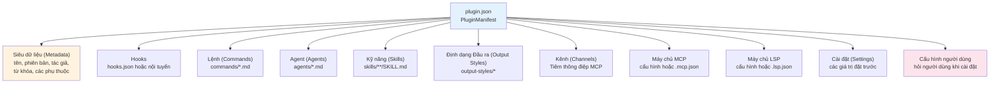
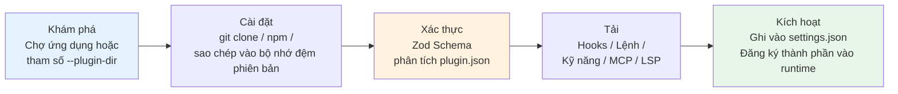
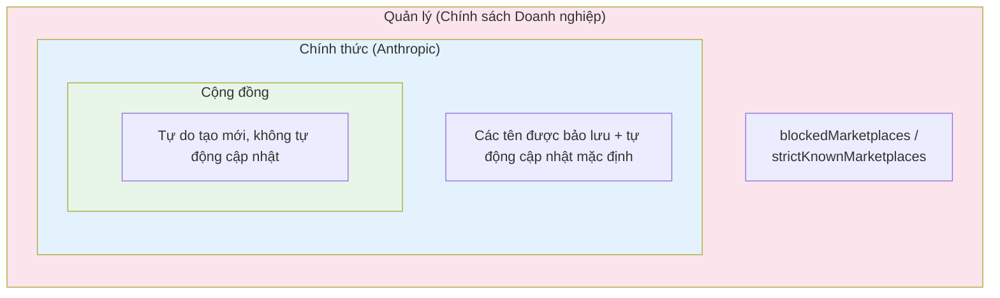

# Chương 22b: Hệ thống Plugin -- Kỹ nghệ Mở rộng từ Đóng gói đến Chợ Ứng dụng

> **Định vị**: Chương này phân tích hệ thống Plugin của Claude Code -- container cấp cao nhất của kiến trúc mở rộng, bao gồm toàn bộ kỹ nghệ từ đóng gói và phân phối đến chợ ứng dụng (marketplace). Điều kiện tiên quyết: Chương 22. Đối tượng độc giả: những người muốn hiểu kỹ thuật mở rộng của các plugin trong Claude Code từ khâu đóng gói đến chợ ứng dụng.

## Tại sao Điều này Quan trọng

Chương 22 đã phân tích hệ thống kỹ năng -- cách Claude Code biến các tệp Markdown thành các hướng dẫn mà mô hình có thể thực thi. Nhưng các kỹ năng chỉ là phần nổi của tảng băng chìm trong các cơ chế mở rộng của Claude Code. Khi bạn muốn đóng gói một tập hợp các kỹ năng, một số Hook, một vài máy chủ MCP, và một bộ các lệnh tùy chỉnh thành một sản phẩm có thể phân phối, thứ bạn cần không phải là hệ thống kỹ năng mà là **hệ thống plugin (plugin system)**.

Plugin là container cấp cao nhất của kiến trúc mở rộng trong Claude Code. Nó không giải quyết câu hỏi "định nghĩa một khả năng như thế nào" mà trả lời một loạt các câu hỏi hóc búa hơn: **Làm thế nào để khám phá các khả năng? Làm thế nào để tin tưởng chúng? Làm thế nào để cài đặt, cập nhật, và gỡ cài đặt chúng? Làm thế nào để cho phép hàng ngàn người dùng sử dụng cùng một plugin mà không can thiệp lẫn nhau?**

Độ phức tạp kỹ thuật của những câu hỏi này vượt xa bản thân các kỹ năng. Claude Code sử dụng gần 1.700 dòng Zod Schema để định nghĩa định dạng tệp khai báo (manifest) của plugin, 25 kiểu lỗi union phân biệt (discriminated union error types) để xử lý các lỗi tải, bộ nhớ đệm phân chia phiên bản để cách ly các phiên bản plugin khác nhau, và lưu trữ an toàn để tách biệt cấu hình nhạy cảm. Hạ tầng này mang lại cho một sản phẩm AI Agent mã nguồn đóng các khả năng mở rộng tương tự như một hệ sinh thái mã nguồn mở -- và đây chính là thiết kế cốt lõi mà chương này sẽ phân tích.

Nếu Chương 22 phân tích "có những gì bên trong một plugin", thì chương này sẽ phân tích "bản thân container plugin được thiết kế như thế nào".

---

## Phân tích Mã nguồn

### 22b.1 Tệp khai báo Plugin: Thiết kế Zod Schema gần 1.700 dòng

Mọi thứ về một plugin đều bắt đầu từ `plugin.json` -- một tệp khai báo JSON định nghĩa siêu dữ liệu (metadata) của plugin và tất cả các thành phần mà nó cung cấp. Schema xác thực của tệp khai báo này chiếm tới 1.681 dòng (`schemas.ts`), trở thành định nghĩa Schema đơn lẻ lớn nhất trong Claude Code.

Cấu trúc cấp cao nhất của tệp khai báo bao gồm 11 Schema thành phần:

```typescript
// restored-src/src/utils/plugins/schemas.ts:884-898
export const PluginManifestSchema = lazySchema(() =>
  z.object({
    ...PluginManifestMetadataSchema().shape,
    ...PluginManifestHooksSchema().partial().shape,
    ...PluginManifestCommandsSchema().partial().shape,
    ...PluginManifestAgentsSchema().partial().shape,
    ...PluginManifestSkillsSchema().partial().shape,
    ...PluginManifestOutputStylesSchema().partial().shape,
    ...PluginManifestChannelsSchema().partial().shape,
    ...PluginManifestMcpServerSchema().partial().shape,
    ...PluginManifestLspServerSchema().partial().shape,
    ...PluginManifestSettingsSchema().partial().shape,
    ...PluginManifestUserConfigSchema().partial().shape,
  }),
)
```

Ngoại trừ `MetadataSchema`, 10 Schema thành phần còn lại đều sử dụng `.partial()` -- nghĩa là một plugin có thể cung cấp bất kỳ tập hợp con nào. Một plugin chỉ chứa Hook và một plugin cung cấp toàn bộ chuỗi công cụ đều chia sẻ cùng một định dạng tệp khai báo, chỉ khác là điền các trường khác nhau.



Có ba điểm đáng chú ý trong thiết kế này:

**Thứ nhất, xác thực bảo mật đường dẫn.** Tất cả các đường dẫn tệp trong tệp khai báo phải bắt đầu bằng `./` và không được chứa `..`. Điều này ngăn các plugin truy cập trái phép các tệp khác trên hệ thống máy chủ thông qua duyệt đường dẫn trái phép (path traversal).

**Thứ hai, bảo lưu tên trên chợ ứng dụng.** Việc xác thực tệp khai báo áp dụng nhiều lớp lọc đối với tên trên chợ ứng dụng:

```typescript
// restored-src/src/utils/plugins/schemas.ts:19-28
export const ALLOWED_OFFICIAL_MARKETPLACE_NAMES = new Set([
  'claude-code-marketplace',
  'claude-code-plugins',
  'claude-plugins-official',
  'anthropic-marketplace',
  'anthropic-plugins',
  'agent-skills',
  'life-sciences',
  'knowledge-work-plugins',
])
```

Chuỗi xác thực bao gồm: không chứa khoảng trắng, không chứa dấu phân cách đường dẫn, không mạo danh tên chính thức, không trùng tên dành riêng `inline` (dành cho các plugin phiên thông qua `--plugin-dir`) hoặc `builtin` (dành cho các plugin tích hợp sẵn). Tất cả các xác thực được hoàn thành trong `MarketplaceNameSchema` (dòng 216-245), sử dụng biểu thức chuỗi `.refine()` của Zod.

**Thứ ba, các lệnh có thể được định nghĩa nội tuyến (inline).** Ngoài việc tải từ tệp, các lệnh cũng có thể được nhúng nội tuyến qua `CommandMetadataSchema`:

```typescript
// restored-src/src/utils/plugins/schemas.ts:385-416
export const CommandMetadataSchema = lazySchema(() =>
  z.object({
      source: RelativeCommandPath().optional(),
      content: z.string().optional(),
      description: z.string().optional(),
      argumentHint: z.string().optional(),
      // ...
  }),
)
```

Trường `source` (đường dẫn tệp) và `content` (Markdown nội tuyến) loại trừ lẫn nhau. Điều này cho phép các plugin nhỏ nhúng trực tiếp nội dung lệnh vào `plugin.json` mà không cần tạo thêm các tệp Markdown độc lập.

### 22b.2 Vòng đời: 5 Giai đoạn từ Khám phá đến Tải Thành phần

Một plugin đi qua 5 giai đoạn từ các tệp trên đĩa đến khi được Claude Code sử dụng:



**Giai đoạn khám phá** có hai nguồn (theo thứ tự ưu tiên):

```typescript
// restored-src/src/utils/plugins/pluginLoader.ts:1-33
// Plugin Discovery Sources (in order of precedence):
// 1. Marketplace-based plugins (plugin@marketplace format in settings)
// 2. Session-only plugins (from --plugin-dir CLI flag or SDK plugins option)
```

Thiết kế cốt lõi trong **giai đoạn cài đặt** là **bộ nhớ đệm phân chia phiên bản (versioned caching)**. Mỗi plugin được sao chép vào thư mục `~/.claude/plugins/cache/{marketplace}/{plugin}/{version}/` thay vì chạy từ vị trí ban đầu của nó. Điều này đảm bảo: các phiên bản khác nhau của cùng một plugin không can thiệp lẫn nhau; việc gỡ cài đặt chỉ cần xóa thư mục bộ nhớ đệm; các kịch bản ngoại tuyến có thể khởi động từ bộ nhớ đệm.

**Giai đoạn tải** sử dụng `memoize` để đảm bảo mỗi thành phần chỉ tải một lần. `getPluginCommands()` and `getPluginSkills()` đều là các hàm xuất xưởng (factory functions) bất đồng bộ được áp dụng kỹ thuật ghi nhớ (memoized). Điều này rất quan trọng đối với hiệu năng của Agent -- các Hook có thể kích hoạt trên mỗi lần gọi công cụ, và việc phân tích lại các tệp Markdown mỗi lần sẽ tích tụ độ trễ đáng kể.

Thứ tự ưu tiên khi tải thành phần cũng rất đáng chú ý. Trong `loadAllCommands()`, thứ tự đăng ký là:

1. Kỹ năng tích hợp sẵn (Bundled skills - được biên dịch sẵn lúc build)
2. Kỹ năng của plugin tích hợp sẵn (Built-in plugin skills - các kỹ năng do plugin tích hợp sẵn cung cấp)
3. Các lệnh trong thư mục kỹ năng (Skill directory commands - thư mục cục bộ của người dùng `~/.claude/skills/`)
4. Các lệnh quy trình công việc (Workflow commands)
5. **Các lệnh của plugin** (Plugin commands - lệnh từ các plugin được cài đặt từ chợ ứng dụng)
6. Kỹ năng của plugin (Plugin skills)
7. Các lệnh tích hợp sẵn (Built-in commands)

Thứ tự này có nghĩa là: các kỹ năng tùy chỉnh cục bộ của người dùng có độ ưu tiên cao hơn các lệnh plugin trùng tên -- các tùy chỉnh của người dùng không bao giờ bị ghi đè bởi các plugin.

### 22b.3 Mô hình Tin cậy: Tin cậy Phân tầng và Đánh giá Trước khi Cài đặt

Hệ thống plugin phải đối mặt với một thách thức về sự tin cậy đặc trưng của Agent: các plugin không chỉ là các phần mở rộng giao diện người dùng thụ động -- chúng có thể tiêm các lệnh trước và sau khi thực thi công cụ thông qua các Hook, cung cấp các công cụ mới thông qua các máy chủ MCP, và thậm chí ảnh hưởng đến hành vi của mô hình thông qua các kỹ năng.

Giải pháp của Claude Code là **tin cậy phân tầng (layered trust)**.

**Lớp thứ nhất: Cảnh báo bảo mật liên tục.** Trong giao diện quản lý plugin, thành phần `PluginTrustWarning` luôn hiển thị:

```typescript
// restored-src/src/commands/plugin/PluginTrustWarning.tsx:1-31
// "Make sure you trust a plugin before installing, updating, or using it"
```

Đây không phải là một xác nhận popup một lần, mà là một cảnh báo **luôn hiển thị** trong giao diện quản lý `/plugin`. Người dùng nhìn thấy nó mỗi khi vào giao diện quản lý plugin -- an toàn hơn việc "xác nhận một lần khi cài đặt và không bao giờ nhắc lại," nhưng không gây phiền toái như việc hiện popup trên mỗi thao tác.

**Lớp thứ hai: Tin cậy cấp dự án.** Thành phần `TrustDialog` thực hiện đánh giá bảo mật trên thư mục dự án, kiểm tra các máy chủ MCP, các Hook, quyền thực thi bash, các helper khóa API, các biến môi trường nguy hiểm, v.v. Trạng thái tin cậy được lưu trong trường `hasTrustDialogAccepted` của cấu hình dự án, và tìm kiếm ngược lên phân cấp thư mục -- nếu thư mục cha đã được tin cậy, các thư mục con sẽ kế thừa sự tin cậy đó.

**Lớp thứ ba: Cách ly các giá trị nhạy cảm.** Các tùy chọn plugin được đánh dấu `sensitive: true` được lưu trữ trong không gian lưu trữ an toàn (keychain trên macOS, `.credentials.json` trên các nền tàm khác), không lưu trong `settings.json`:

```typescript
// restored-src/src/utils/plugins/pluginOptionsStorage.ts:1-13
// Storage splits by `sensitive`:
//   - `sensitive: true`  → secureStorage (keychain on macOS, .credentials.json elsewhere)
//   - everything else    → settings.json `pluginConfigs[pluginId].options`
```

Tại thời điểm tải, hai nguồn này được hợp nhất, trong đó lưu trữ an toàn có mức ưu tiên cao hơn:

```typescript
// restored-src/src/utils/plugins/pluginOptionsStorage.ts:56-77
export const loadPluginOptions = memoize(
  (pluginId: string): PluginOptionValues => {
    // ...
    // secureStorage wins on collision — schema determines destination so
    // collision shouldn't happen, but if a user hand-edits settings.json we
    // trust the more secure source.
    return { ...nonSensitive, ...sensitive }
  },
)
```

Bình luận trong mã nguồn tiết lộ một cân nhắc thực tế: `memoize` không chỉ là một tối ưu hóa hiệu năng mà là một sự bắt buộc về bảo mật -- mỗi lần đọc keychain sẽ kích hoạt một tiến trình con `security find-generic-password` (~50-100ms), và nếu các Hook kích hoạt trên mỗi cuộc gọi công cụ, việc không dùng bộ nhớ đệm ghi nhớ sẽ gây ra độ trễ rất rõ ràng.

### 22b.4 Hệ thống Chợ Ứng dụng: Khám phá, Cài đặt, và Giải quyết Phụ thuộc

Chợ Ứng dụng Plugin (Plugin Marketplace) là một tệp khai báo JSON mô tả một tập hợp các plugin có thể cài đặt. Các nguồn chợ ứng dụng hỗ trợ 9 kiểu:

```typescript
// restored-src/src/utils/plugins/schemas.ts:906-907
export const MarketplaceSourceSchema = lazySchema(() =>
  z.discriminatedUnion('source', [
    // url, github, git, npm, file, directory, hostPattern, pathPattern, settings
  ]),
)
```

Các kiểu này bao phủ hầu hết mọi phương thức phân phối từ các URL trực tiếp, kho lưu trữ GitHub, gói npm, cho đến các thư mục cục bộ. `hostPattern` và `pathPattern` thậm chí hỗ trợ tự động gợi ý các chợ ứng dụng dựa trên tên máy chủ hoặc đường dẫn dự án của người dùng -- được thiết kế cho các kịch bản triển khai doanh nghiệp.

Việc tải chợ ứng dụng sử dụng cơ chế **giảm cấp lũy tiến (graceful degradation)**:

```typescript
// restored-src/src/utils/plugins/marketplaceHelpers.ts
loadMarketplacesWithGracefulDegradation() // Lỗi một chợ ứng dụng không ảnh hưởng đến các chợ khác
```

Tên hàm tự bản thân nó là một tuyên bố thiết kế: trong một hệ thống đa nguồn, sự thất bại của bất kỳ nguồn đơn lẻ nào không được phép làm cho toàn bộ hệ thống ngừng hoạt động.

**Giải quyết phụ thuộc (Dependency resolution)** là một cơ chế quan trọng khác. Các plugin có thể khai báo phụ thuộc trong tệp khai báo:

```typescript
// restored-src/src/utils/plugins/schemas.ts:313-318
dependencies: z
  .array(DependencyRefSchema())
  .optional()
  .describe(
    'Plugins that must be enabled for this plugin to function. Bare names (no "@marketplace") are resolved against the declaring plugin\'s own marketplace.',
  ),
```

Các tên ngắn (như `my-dep`) được tự động hiểu là thuộc về chợ ứng dụng của chính plugin khai báo -- tránh việc phải viết lặp lại tên chợ ứng dụng khi bắt buộc dùng các phụ thuộc từ cùng một nguồn.

**Phạm vi cài đặt (Installation scopes)** được chia thành 4 cấp độ:

| Phạm vi | Vị trí Lưu trữ | Tầm nhìn | Trường hợp Sử dụng Điển hình |
|-------|-----------------|------------|-------------|
| `user` | `~/.claude/plugins/` | Tất cả các dự án | Công cụ dùng chung cá nhân |
| `project` | `.claude/plugins/` | Tất cả các thành viên dự án | Công cụ tiêu chuẩn của nhóm phát triển |
| `local` | `.claude-code.json` | Phiên hiện tại | Kiểm thử tạm thời |
| `managed` | `managed-settings.json` | Kiểm soát bằng chính sách | Quản lý tập trung của doanh nghiệp |

Thiết kế của bốn phạm vi này tương tự như phân cấp cấu hình của Git (system -> global -> local), nhưng có thêm lớp `managed` để kiểm soát chính sách doanh nghiệp.

### 22b.5 Quản trị Lỗi: 25 Biến thể Lỗi với Xử lý An toàn Kiểu

Hầu hết các hệ thống plugin xử lý lỗi bằng cách so khớp chuỗi -- "nếu thông điệp lỗi chứa 'not found'". Claude Code sử dụng một cách tiếp cận chặt chẽ hơn nhiều: **union phân biệt (discriminated union)**.

```typescript
// restored-src/src/types/plugin.ts:101-283
export type PluginError =
  | { type: 'path-not-found'; source: string; plugin?: string; path: string; component: PluginComponent }
  | { type: 'git-auth-failed'; source: string; plugin?: string; gitUrl: string; authType: 'ssh' | 'https' }
  | { type: 'git-timeout'; source: string; plugin?: string; gitUrl: string; operation: 'clone' | 'pull' }
  | { type: 'network-error'; source: string; plugin?: string; url: string; details?: string }
  | { type: 'manifest-parse-error'; source: string; plugin?: string; manifestPath: string; parseError: string }
  | { type: 'manifest-validation-error'; source: string; plugin?: string; manifestPath: string; validationErrors: string[] }
  // ... hơn 16 biến thể khác
  | { type: 'marketplace-blocked-by-policy'; source: string; marketplace: string; blockedByBlocklist?: boolean; allowedSources: string[] }
  | { type: 'dependency-unsatisfied'; source: string; plugin: string; dependency: string; reason: 'not-enabled' | 'not-found' }
  | { type: 'generic-error'; source: string; plugin?: string; error: string }
```

25 kiểu lỗi độc nhất (gồm 26 biến thể union, trong đó `lsp-config-invalid` xuất hiện hai lần), mỗi kiểu có các trường ngữ cảnh riêng phù hợp với lỗi đó. Lỗi `git-auth-failed` mang theo `authType` (ssh hoặc https), `marketplace-blocked-by-policy` mang theo `allowedSources` (danh sách các nguồn được phép), `dependency-unsatisfied` mang theo `reason` (chưa kích hoạt hoặc không tìm thấy).

Bình luận trong mã nguồn cũng tiết lộ một chiến lược lũy tiến:

```typescript
// restored-src/src/types/plugin.ts:86-99
// IMPLEMENTATION STATUS:
// Currently used in production (2 types):
// - generic-error: Used for various plugin loading failures
// - plugin-not-found: Used when plugin not found in marketplace
//
// Planned for future use (10 types - see TODOs in pluginLoader.ts):
// These unused types support UI formatting and provide a clear roadmap for
// improving error specificity.
```

Định nghĩa đầy đủ các kiểu trước, sau đó triển khai dần dần -- đây là chiến lược **tiến hóa hướng kiểu (type-first evolution)**. Việc định nghĩa 22 kiểu lỗi chưa dùng đến không yêu cầu phải triển khai tất cả chúng ngay lập tức, nhưng một khi đã được định nghĩa, mã xử lý lỗi mới sẽ có các kiểu mục tiêu rõ ràng thay vì liên tục thêm các trường hợp xử lý chuỗi mới.

### 22b.6 Tự động Cập nhật và Gợi ý: Ba Nguồn Gợi ý

Cả cơ chế "kéo" (người dùng chủ động cài đặt) và "đẩy" (hệ thống gợi ý cài đặt) của hệ thống plugin đều có thiết kế hoàn chỉnh.

**Tự động cập nhật** mặc định chỉ bật cho các chợ ứng dụng chính thức, nhưng ngoại trừ một số chợ cụ thể:

```typescript
// restored-src/src/utils/plugins/schemas.ts:35
const NO_AUTO_UPDATE_OFFICIAL_MARKETPLACES = new Set(['knowledge-work-plugins'])
```

Sau khi hoàn tất cập nhật, người dùng được thông báo qua hệ thống thông báo để thực thi lệnh `/reload-plugins` nhằm làm mới (xem Chương 18 về hệ thống Hook). Có một cách xử lý tình trạng tranh chấp rất tinh tế ở đây: các cập nhật có thể hoàn tất trước khi REPL được mount, do đó các thông báo sẽ sử dụng một bộ đệm hàng đợi `pendingNotification`.

**Hệ thống gợi ý** có ba nguồn:

1. **Gợi ý từ Claude Code (Claude Code Hint)**: Các công cụ bên ngoài (chẳng hạn như SDK) xuất ra các thẻ `<claude-code-hint />` qua stderr; CC phân tích cú pháp các thẻ này và gợi ý các plugin tương ứng.
2. **Phát hiện LSP**: Khi chỉnh sửa các tệp có phần mở rộng cụ thể, nếu hệ thống có nhị phân LSP tương ứng nhưng chưa cài đặt plugin liên quan, hệ thống sẽ tự động đưa ra gợi ý cài đặt.
3. **Gợi ý tùy chỉnh**: Qua máy trạng thái đa dụng cung cấp bởi `usePluginRecommendationBase`.

Cả ba nguồn đều chia sẻ một ràng buộc chính: **mỗi plugin chỉ được gợi ý tối đa một lần trong mỗi phiên** (ngữ nghĩa hiển thị một lần). Điều này được thực hiện thông qua việc lưu trữ cấu hình -- các ID plugin đã gợi ý được ghi lại trong các tệp cấu hình, tránh việc gợi ý lặp lại qua các phiên. Menu gợi ý cũng có cơ chế tự động đóng sau 30 giây, giúp phân biệt giữa việc người dùng chủ động hủy và việc đóng do hết giờ phục vụ cho các sự kiện phân tích telemetry.

### 22b.7 Mô hình Di chuyển Lệnh: Tiến hóa Lũy tiến từ Tích hợp sẵn sang Plugin

Claude Code đang tiến hành di chuyển dần các lệnh tích hợp sẵn thành các plugin. Hàm xuất xưởng `createMovedToPluginCommand` tiết lộ chiến lược tiến hóa này:

```typescript
// restored-src/src/commands/createMovedToPluginCommand.ts:22-65
export function createMovedToPluginCommand({
  name, description, progressMessage,
  pluginName, pluginCommand,
  getPromptWhileMarketplaceIsPrivate,
}: Options): Command {
  return {
    type: 'prompt',
    // ...
    async getPromptForCommand(args, context) {
      if (process.env.USER_TYPE === 'ant') {
        return [{ type: 'text', text: `This command has been moved to a plugin...` }]
      }
      return getPromptWhileMarketplaceIsPrivate(args, context)
    },
  }
}
```

Hàm này giải quyết một vấn đề thực tế: **làm thế nào để di chuyển các lệnh khi chợ ứng dụng vẫn chưa được công khai?** Câu trả lời là phân tách theo loại người dùng -- người dùng nội bộ (`USER_TYPE === 'ant'`) nhìn thấy hướng dẫn cài đặt plugin, trong khi người dùng bên ngoài nhìn thấy prompt nội tuyến gốc. Một khi chợ ứng dụng được công khai, tham số `getPromptWhileMarketplaceIsPrivate` và logic phân nhánh có thể được loại bỏ.

Các lệnh đã được di chuyển bao gồm `pr-comments` (lấy các bình luận PR) và `security-review` (đánh giá bảo mật). Các lệnh sau khi di chuyển được đặt tên theo định dạng `pluginName:commandName`, duy trì việc cách ly không gian tên.

Ý nghĩa sâu sắc của mô hình này: **Claude Code đang tiến hóa từ một khối monolith đầy đủ tính năng thành một nền tảng**. Việc các lệnh tích hợp sẵn trở thành plugin có nghĩa là các khả năng này có thể được thay thế, mở rộng, hoặc tái tổ hợp bởi cộng đồng -- mà không cần phải phân nhánh (fork) toàn bộ dự án.

### 22b.8 Ý nghĩa Triết lý Thiết kế Agent của Plugin

Quay lại góc nhìn cao hơn. Tại sao một AI Agent lại cần một hệ thống plugin?

**Các hệ thống plugin phần mềm truyền thống** (như VS Code, Vim) giải quyết vấn đề "cho phép người dùng tùy biến hành vi trình soạn thảo" -- về cơ bản là các phần mở rộng giao diện và tính năng. Nhưng **hệ thống plugin của một AI Agent** giải quyết một vấn đề cơ bản khác: **khả năng kết hợp động (runtime composability) của các năng lực Agent**.

Những gì Agent Claude Code có thể làm trong mỗi phiên phụ thuộc vào các công cụ, kỹ năng, và Hook nào được tải. Hệ thống plugin giúp bộ năng lực này có thể điều chỉnh động:

1. **Khả năng dỡ bỏ năng lực**: Người dùng có thể vô hiệu hóa toàn bộ một plugin để tắt một nhóm năng lực liên quan. Đây không phải là việc "tắt một tính năng" truyền thống -- đó là việc khiến Agent mất đi cả một chiều kích năng lực nhận thức và hành vi tại thời điểm chạy (runtime).

2. **Đa dạng hóa nguồn năng lực**: Các năng lực của Agent không còn chỉ đến từ đội ngũ phát triển của một tổ chức duy nhất, mà từ nhiều nhà cung cấp khác nhau trên chợ ứng dụng. Sự tồn tại của `createMovedToPluginCommand` chứng minh hướng đi này -- ngay cả các lệnh tích hợp sẵn của Anthropic cũng đang chuyển đổi thành plugin.

3. **Người dùng kiểm soát ranh giới năng lực**: 4 cấp độ phạm vi cài đặt (user/project/local/managed) cho phép các bên liên quan kiểm soát các cấp độ ranh giới năng lực khác nhau. Quản trị viên doanh nghiệp sử dụng các chính sách `managed` để hạn chế các chợ ứng dụng và plugin được phép; trưởng dự án sử dụng phạm vi `project` cho cấu hình chung của nhóm phát triển; lập trình viên sử dụng phạm vi `user` cho sở thích cá nhân.

4. **Tin cậy là điều kiện tiên quyết của năng lực**: Trong các hệ thống plugin truyền thống, việc kiểm tra tin cậy là xác nhận một lần khi cài đặt. Trong ngữ cảnh Agent, sự tin cậy mang trọng số lớn hơn nhiều -- một plugin đáng tin cậy có thể thực thi các lệnh **trước và sau mỗi cuộc gọi công cụ** qua các Hook (xem Chương 18) và cung cấp **các công cụ mới** cho mô hình qua các máy chủ MCP. Đây là lý do tại sao mô hình tin cậy của Claude Code được phân tầng và liên tục, thay vì chỉ diễn ra một lần.

Từ góc nhìn này, 11 Schema thành phần của `PluginManifest` không chỉ "định nghĩa những gì một plugin có thể cung cấp" -- chúng định nghĩa **11 chiều kích có thể cắm rút (pluggable) của năng lực Agent**.

### 22b.9 Con đường Thứ ba Giữa Mã nguồn Mở và Mã nguồn Đóng

Claude Code là một sản phẩm thương mại mã nguồn đóng. Nhưng hệ thống plugin của nó tạo ra một điểm trung gian thú vị -- **lõi đóng + hệ sinh thái mở (closed core + open ecosystem)**.

**Cơ chế bảo lưu tên trên chợ ứng dụng** (Phần 22b.1) tiết lộ cách triển khai cụ thể của chiến lược này. 8 tên chính thức được bảo lưu giúp bảo vệ không gian tên thương hiệu của Anthropic, nhưng logic xác thực của `MarketplaceNameSchema` **cố tình không chặn các biến thể gián tiếp**:

```typescript
// restored-src/src/utils/plugins/schemas.ts:7-13
// This validation blocks direct impersonation attempts like "anthropic-official",
// "claude-marketplace", etc. Indirect variations (e.g., "my-claude-marketplace")
// are not blocked intentionally to avoid false positives on legitimate names.
```

Đây là một thiết kế được cân nhắc kỹ lưỡng: đủ nghiêm ngặt để ngăn chặn mạo danh, nhưng đủ khoa dung để không cấm cản cộng đồng sử dụng từ "claude" để xây dựng các chợ ứng dụng của riêng họ.

**Chiến lược tự động cập nhật phân biệt** cũng phản ánh định vị này. Chợ ứng dụng chính thức mặc định bật tự động cập nhật, chợ ứng dụng cộng đồng mặc định tắt -- điều này mang lại lợi thế phân phối cho chợ chính thức mà không ngăn cản sự tồn tại của chợ ứng dụng cộng đồng.

**Lớp `managed` trong phạm vi cài đặt** tiết lộ thêm các cân nhắc thương mại. Các doanh nghiệp có thể kiểm soát các chợ ứng dụng và plugin được cho phép thông qua tệp `managed-settings.json` (tệp chính sách chỉ đọc). Điều này đáp ứng nhu cầu tuân thủ của khách hàng doanh nghiệp "nhân viên của tôi chỉ được sử dụng các plugin đã phê duyệt" trong khi vẫn duy trì sự linh hoạt mở rộng trong phạm vi được duyệt.



Cấu trúc ba lớp này giúp Claude Code tìm thấy điểm cân bằng giữa thương mại và cởi mở:

- **Đối với Anthropic**: Giữ lõi sản phẩm mã nguồn đóng, kiểm soát chất lượng và bảo mật thông qua chợ ứng dụng chính thức.
- **Đối với cộng đồng**: Cung cấp tài liệu API plugin và cơ chế chợ ứng dụng đầy đủ, cho phép phân phối bên thứ ba.
- **Đối với doanh nghiệp**: Cung cấp khả năng quản trị thông qua lớp chính sách, đáp ứng các yêu cầu tuân thủ.

Bài học cho các nhà xây dựng hệ sinh thái Agent: **bạn không cần phải mở nguồn lõi sản phẩm để đạt được hiệu ứng hệ sinh thái**. Bạn chỉ cần mở các giao diện mở rộng, cung cấp hạ tầng phân phối (chợ ứng dụng), và thiết lập các cơ chế quản trị (tin cậy + chính sách), và cộng đồng có thể tự xây dựng giá trị xung quanh Agent của bạn.

Tuy nhiên, mô hình này có một rủi ro cố hữu: **hệ sinh thái phụ thuộc vào thiện chí của nền tảng (platform goodwill)**. Nếu nền tảng thắt chặt các API plugin, hạn chế xét duyệt chợ ứng dụng, hoặc thay đổi các quy tắc phân phối, các bên tham gia hệ sinh thái sẽ không có phương án phân nhánh (fork) để tự cứu mình -- đây là bất lợi cơ bản của lõi đóng so với quản trị dựa trên nền tảng mã nguồn mở. Claude Code hiện giảm thiểu rủi ro này thông qua các định dạng khai báo mở và cơ chế chợ ứng dụng đa nguồn, nhưng sức khỏe dài hạn của hệ sinh thái vẫn phụ thuộc vào cam kết quản trị của nền tảng.

---

## Pattern Distillation

### Pattern One: Khai báo như một Bản hợp đồng (Manifest as Contract)

**Vấn đề giải quyết**: Làm thế nào để một hệ thống mở rộng xác thực các đóng góp của bên thứ ba mà không gây ra lỗi thời gian chạy (runtime)?

**Cách giải quyết**: Định nghĩa định dạng tệp khai báo đầy đủ bằng cách sử dụng một thư viện xác thực Schema (ví dụ: Zod), trong đó mỗi trường đều mang kiểu dữ liệu, các ràng buộc và phần mô tả. Việc xác thực tệp khai báo hoàn tất trong giai đoạn tải, lỗi xác thực sẽ tạo ra các lỗi có cấu trúc thay vì các ngoại lệ thời gian chạy. Tất cả các đường dẫn tệp phải bắt đầu bằng `./`, và không cho phép duyệt qua `..`.

**Điều kiện tiên quyết**: Hệ thống mở rộng chấp nhận các tệp cấu hình từ các nguồn không đáng tin cậy.

### Pattern Two: Tiến hóa Hướng kiểu (Type-First Evolution)

**Vấn đề giải quyết**: Làm thế nào để cải thiện dần việc xử lý lỗi trong một hệ thống lớn mà không cần cấu trúc lại toàn bộ các điểm báo lỗi cùng một lúc?

**Cách giải quyết**: Định nghĩa trước các kiểu lỗi union phân biệt đầy đủ (22 kiểu), nhưng chỉ sử dụng chúng ở một vài điểm (2 kiểu), các kiểu còn lại được đánh dấu là "lên kế hoạch cho tương lai". Mã mới viết ra có các kiểu mục tiêu rõ ràng, và mã cũ có thể được di chuyển dần dần.

**Điều kiện tiên quyết**: Nhóm phát triển sẵn sàng chấp nhận các định nghĩa kiểu tạm thời chưa dùng đến, coi chúng là một "bản đồ hướng đi của kiểu dữ liệu" thay vì "mã nguồn rác".

### Pattern Three: Phân luồng Giá trị Nhạy cảm (Sensitive Value Shunting)

**Vấn đề giải quyết**: Làm thế nào để lưu trữ an toàn các khóa API, mật khẩu, và các giá trị nhạy cảm khác trong cấu hình plugin?

**Cách giải quyết**: Đánh dấu mỗi trường cấu hình trong Schema as `sensitive: true/false`. Thực hiện phân luồng khi lưu trữ -- các giá trị nhạy cảm đi vào không gian lưu trữ an toàn của hệ thống (ví dụ: keychain trên macOS), các giá trị không nhạy cảm đi vào các tệp cấu hình thông thường. Tại thời điểm đọc, hợp nhất cả hai nguồn với lưu trữ an toàn được ưu tiên. Sử dụng bộ nhớ đệm `memoize` để tránh truy cập lặp lại bộ lưu trữ an toàn.

**Điều kiện tiên quyết**: Nền tảng mục tiêu cung cấp một API lưu trữ an toàn (keychain, quản lý thông tin xác thực, v.v.).

### Pattern Four: Lõi đóng, Hệ sinh thái mở

**Vấn đề giải quyết**: Làm thế nào một sản phẩm mã nguồn đóng có thể đạt được hiệu ứng mở rộng của một hệ sinh thái mã nguồn mở?

**Core approach**: Định dạng tệp khai báo mở + cơ chế khám phá chợ ứng dụng đa nguồn + kiểm soát chính sách phân tầng (xem phân tích đầy đủ trong Phần 22b.9). Thiết kế chính: bảo lưu không gian tên thương hiệu nhưng không hạn chế việc cộng đồng sử dụng các thuật ngữ thương hiệu; chợ ứng dụng chính thức có lợi thế phân phối nhưng không loại trừ các chợ ứng dụng bên thứ ba.

**Rủi ro**: Sức khỏe của hệ sinh thái phụ thuộc vào cam kết quản trị của nền tảng, thiếu phương án dự phòng phân nhánh (fork).

**Điều kiện tiên quyết**: Sản phẩm đã có một cơ sở người dùng đủ lớn để thu hút hệ sinh thái.

---

## Những việc Người dùng Có thể Làm

1. **Xây dựng các plugin của riêng bạn**: Tạo tệp `plugin.json`, đặt các tệp thành phần trong `commands/`, `skills/`, `hooks/`, và xác thực định dạng tệp khai báo bằng lệnh `claude plugin validate`. Bắt đầu bằng một plugin tối giản chỉ có một Hook, sau đó thêm dần các thành phần khác.

2. **Thiết kế ranh giới tin cậy của plugin**: Nếu plugin của bạn cần các khóa API, hãy đánh dấu chúng là `sensitive: true` trong `userConfig`. Không viết cứng các giá trị nhạy cảm trong các chuỗi lệnh -- hãy sử dụng các biến mẫu dạng `${user_config.KEY}` và để hệ thống lưu trữ của Claude Code xử lý vấn đề bảo mật.

3. **Sử dụng phạm vi cài đặt để quản lý công cụ của nhóm**: Cài đặt các công cụ tiêu chuẩn của nhóm trong phạm vi `project` (`.claude/plugins/`), và các công cụ sở thích cá nhân trong phạm vi `user`. Bằng cách này, thư mục `.claude/plugins/` có thể được commit lên Git, và các thành viên trong nhóm sẽ tự động có một bộ công cụ thống nhất.

4. **Tham chiếu phân tầng của Claude Code khi thiết kế hệ thống plugin cho Agent của riêng bạn**: Xác thực tệp khai báo (phòng thủ đầu vào bên thứ ba) + bộ nhớ đệm phân chia phiên bản (cách ly) + phân luồng lưu trữ an toàn (bảo vệ giá trị nhạy cảm) + lớp chính sách (quản trị doanh nghiệp). Bốn lớp này là hạ tầng plugin tối thiểu khả thi.

5. **Consider the "command migration" strategy**: If your Agent has built-in features planned for community maintenance, reference the `createMovedToPluginCommand` branching pattern -- internal users migrate and test first, external users maintain the existing experience, then switch uniformly once the marketplace goes public.
