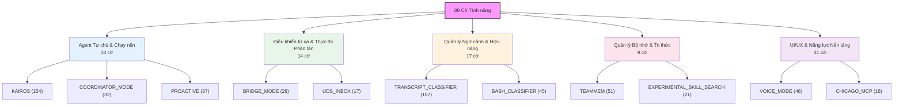
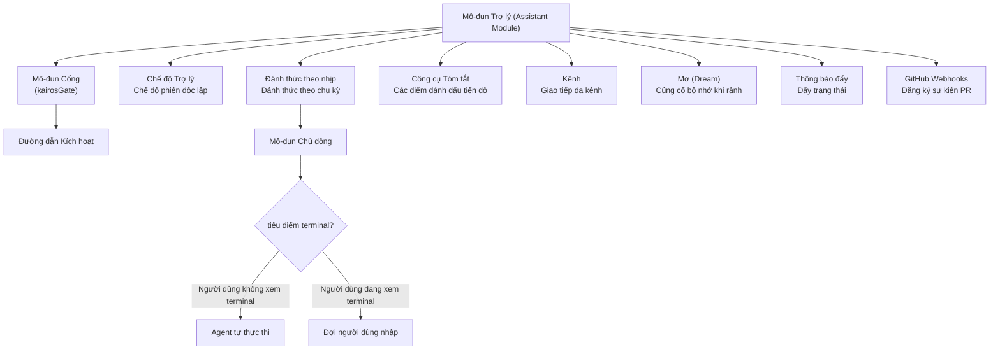
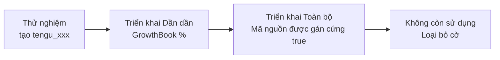

# Chương 23: Đường ống Tính năng chưa Phát hành -- Bản đồ Hướng đi Đằng sau 89 Cờ Tính năng

> **Định vị**: Chương này phân tích đường ống tính năng chưa phát hành được kiểm soát bởi 89 Cờ Tính năng (Feature Flags) trong mã nguồn Claude Code và độ sâu triển khai của chúng. Điều kiện tiên quyết: không có, có thể đọc độc lập. Đối tượng độc giả: những độc giả muốn hiểu cách Claude Code quản lý đường ống tính năng chưa phát hành của mình thông qua 89 Cờ Tính năng, hoặc các lập trình viên muốn triển khai hệ thống cờ tính năng trong sản phẩm của riêng họ.

## Tại sao Điều này Quan trọng

Trong 22 chương trước, chúng ta đã phân tích các tính năng đã được phát hành công khai của Claude Code. Nhưng mã nguồn còn ẩn chứa một chiều kích khác: **89 Cờ Tính năng kiểm soát các tính năng chưa mở cho tất cả người dùng**. Các cờ này được triển khai thông qua hàm `feature()` lúc build của Bun -- trình biên dịch sẽ đánh giá `feature('FLAG_NAME')` thành `true` hoặc `false` dưới các cấu hình build khác nhau, và cơ chế loại bỏ mã chết (dead code elimination) sẽ loại bỏ hoàn toàn nhánh bị vô hiệu hóa.

Điều này có nghĩa là mã nguồn được kiểm soát bởi `feature('KAIROS')` không hề tồn tại trong các bản build công khai -- nó chỉ xuất hiện trong các bản build nội bộ (`USER_TYPE === 'ant'`) hoặc các nhánh thử nghiệm. Nhưng trong mã nguồn đã được khôi phục của chúng ta, cả hai nhánh của mỗi cờ đều được bảo toàn, mang lại cho chúng ta một góc nhìn độc đáo để xem xét hướng tiến hóa tính năng của Claude Code.

Chương này phân loại 89 cờ này thành năm nhóm lớn theo miền chức năng, phân tích độ sâu triển khai và mối quan hệ lẫn nhau của các tính năng cốt lõi chưa phát hành. Cần nhấn mạnh: **phân tích của chương này dựa trên trạng thái triển khai có thể quan sát được trong mã nguồn; chúng tôi không suy đoán về chiến lược kinh doanh hay dự đoán mốc thời gian phát hành.** Sự tồn tại của một cờ không đồng nghĩa với việc tính năng đó sắp được phát hành -- nhiều cờ có thể chỉ là các nguyên mẫu thử nghiệm, các cấu hình thử nghiệm A/B, hoặc các hướng khám phá đã bị loại bỏ.

---

## 23.1 Cơ chế Cờ Tính năng

### Đánh giá Lúc Build (Build-Time Evaluation)

Claude Code sử dụng hàm `feature()` do mô-đun `bun:bundle` của Bun cung cấp:

```typescript
import { feature } from 'bun:bundle'

if (feature('KAIROS')) {
  const { registerDreamSkill } = require('./dream.js')
  registerDreamSkill()
}
```

Hàm `feature()` được thay thế tại thời điểm biên dịch bằng một giá trị boolean `true` hoặc `false` cụ thể. Khi kết quả là `false`, toàn bộ khối `if` sẽ bị loại bỏ trong quá trình tree-shaking. Điều này giải thích tại sao mã nguồn được kiểm soát bởi cờ sử dụng `require()` thay vì `import()` -- `require()` là một biểu thức có thể xuất hiện bên trong các khối `if`, cho phép cơ chế loại bỏ mã chết loại bỏ nó cùng với các phụ thuộc mô-đun của nó.

### Số lượng Tham chiếu và Suy luận Độ chín (Maturity Inference)

Bằng cách đếm số lượng tham chiếu của mỗi cờ trong mã nguồn, chúng ta có thể suy ra phần nào độ sâu triển khai của tính năng:

| Khoảng Tham chiếu | Ý nghĩa | Các Cờ Điển hình |
|----------------|---------|---------------|
| 100+ | Tích hợp sâu, chạm đến nhiều hệ thống con cốt lõi | KAIROS (154), TRANSCRIPT_CLASSIFIER (107) |
| 30-99 | Tính năng hoàn chỉnh, đan xen vào nhiều mô-đun | TEAMMEM (51), VOICE_MODE (46), PROACTIVE (37) |
| 10-29 | Khá hoàn chỉnh, liên quan đến các hệ thống con cụ thể | CONTEXT_COLLAPSE (20), CHICAGO_MCP (16) |
| 3-9 | Triển khai ban đầu hoặc phạm vi giới hạn | TOKEN_BUDGET (9), WEB_BROWSER_TOOL (4) |
| 1-2 | Giai đoạn nguyên mẫu/khám phá hoặc nút bật tắt thuần túy | ULTRATHINK (1), ABLATION_BASELINE (1) |

**Bảng 23-1: Số lượng tham chiếu cờ tính năng và suy luận mức độ chín**

Số lượng tham chiếu cao không nhất thiết có nghĩa là "sắp sửa phát hành" -- 154 tham chiếu của KAIROS có thể chính là dấu hiệu cho thấy đây là một hệ thống phức tạp đang trải qua quá trình tích hợp lũy tiến lâu dài.

---

## 23.2 Phân loại 89 Cờ Tính năng

Theo miền chức năng, 89 cờ có thể được chia thành năm danh mục chính:



### Bảng 23-2: Agent Tự chủ & Chạy nền (18)

| Cờ Tính năng | Số lần Tham chiếu | Mô tả |
|------|------|-------------|
| `KAIROS` | 154 | Cốt lõi của chế độ trợ lý: agent chạy nền tự chủ, cơ chế đánh thức theo nhịp |
| `PROACTIVE` | 37 | Chế độ làm việc tự chủ: nhận biết tiêu điểm terminal, hành động chủ động |
| `KAIROS_BRIEF` | 39 | Chế độ tóm tắt: gửi tin nhắn tiến độ đến người dùng |
| `KAIROS_CHANNELS` | 19 | Hệ thống kênh: giao tiếp đa kênh |
| `KAIROS_DREAM` | 1 | Trình kích hoạt củng cố bộ nhớ autoDream |
| `KAIROS_PUSH_NOTIFICATION` | 4 | Thông báo đẩy: gửi cập nhật trạng thái đến người dùng |
| `KAIROS_GITHUB_WEBHOOKS` | 3 | Đăng ký GitHub Webhook: trình kích hoạt sự kiện PR |
| `AGENT_TRIGGERS` | 11 | Trình kích hoạt theo chu kỳ (cron cục bộ) |
| `AGENT_TRIGGERS_REMOTE` | 2 | Trình kích hoạt theo chu kỳ từ xa (cron trên đám mây) |
| `BG_SESSIONS` | 11 | Quản lý phiên chạy nền (ps/logs/attach/kill) |
| `COORDINATOR_MODE` | 32 | Chế độ điều phối: phối hợp nhiệm vụ liên agent |
| `BUDDY` | 15 | Chế độ bạn đồng hành: bóng bong bóng UI nổi |
| `ULTRAPLAN` | 10 | Ultraplan: giao diện phân rã nhiệm vụ có cấu trúc |
| `VERIFICATION_AGENT` | 4 | Agent xác thực: tự động kiểm tra hoàn thành nhiệm vụ |
| `BUILTIN_EXPLORE_PLAN_AGENTS` | 1 | Các kiểu agent lên kế hoạch/khám phá tích hợp sẵn |
| `FORK_SUBAGENT` | 4 | Chế độ thực thi fork subagent |
| `MONITOR_TOOL` | 13 | Công cụ giám sát: giám sát tiến trình chạy nền |
| `TORCH` | 1 | Lệnh Torch (chưa rõ mục đích) |

### Bảng 23-3: Điều khiển từ xa & Thực thi Phân tán (14)

| Cờ Tính năng | Số lần Tham chiếu | Mô tả |
|------|------|-------------|
| `BRIDGE_MODE` | 28 | Cốt lõi của chế độ cầu nối: giao thức điều khiển từ xa |
| `DAEMON` | 3 | Chế độ Daemon: tiến trình daemon chạy nền |
| `SSH_REMOTE` | 4 | Kết nối SSH từ xa |
| `DIRECT_CONNECT` | 5 | Chế độ kết nối trực tiếp |
| `CCR_AUTO_CONNECT` | 3 | Tự động kết nối Claude Code Remote |
| `CCR_MIRROR` | 4 | Chế độ gương CCR: gương xem từ xa chỉ đọc |
| `CCR_REMOTE_SETUP` | 1 | Lệnh thiết lập từ xa CCR |
| `SELF_HOSTED_RUNNER` | 1 | Runner tự lưu trữ |
| `BYOC_ENVIRONMENT_RUNNER` | 1 | Runner môi trường mang-theo-hạ-tầng-tính-toán-riêng (BYOC) |
| `UDS_INBOX` | 17 | Hộp thư đến Unix Domain Socket: giao tiếp liên tiến trình |
| `LODESTONE` | 6 | Đăng ký giao thức (trình xử lý lodestone://) |
| `CONNECTOR_TEXT` | 7 | Xử lý khối văn bản của connector |
| `DOWNLOAD_USER_SETTINGS` | 5 | Tải cài đặt người dùng từ đám mây |
| `UPLOAD_USER_SETTINGS` | 2 | Tải lên cài đặt người dùng lên đám mây |

### Bảng 23-4: Quản lý Ngữ cảnh & Hiệu năng (17)

| Cờ Tính năng | Số lần Tham chiếu | Mô tả |
|------|------|-------------|
| `CONTEXT_COLLAPSE` | 20 | Thu hẹp ngữ cảnh: quản lý ngữ cảnh chi tiết hơn |
| `REACTIVE_COMPACT` | 4 | Nén phản ứng: các trình kích hoạt nén theo yêu cầu |
| `CACHED_MICROCOMPACT` | 12 | Chiến lược vi nén được lưu bộ đệm |
| `COMPACTION_REMINDERS` | 1 | Cơ chế nhắc nhở nén ngữ cảnh |
| `TOKEN_BUDGET` | 9 | Giao diện theo dõi ngân sách token và kiểm soát ngân sách |
| `PROMPT_CACHE_BREAK_DETECTION` | 9 | Phát hiện phá vỡ bộ nhớ đệm prompt |
| `HISTORY_SNIP` | 15 | Lệnh cắt ngắn lịch sử |
| `BREAK_CACHE_COMMAND` | 2 | Lệnh ép buộc phá vỡ bộ nhớ đệm |
| `ULTRATHINK` | 1 | Chế độ siêu suy nghĩ (ultra thinking) |
| `TREE_SITTER_BASH` | 3 | Trình phân tích cú pháp Bash Tree-sitter |
| `TREE_SITTER_BASH_SHADOW` | 5 | Chế độ bóng (shadow mode) của Bash Tree-sitter (thử nghiệm A/B) |
| `BASH_CLASSIFIER` | 45 | Bộ phân loại lệnh Bash |
| `TRANSCRIPT_CLASSIFIER` | 107 | Bộ phân loại hội thoại (chế độ auto) |
| `STREAMLINED_OUTPUT` | 1 | Chế độ đầu ra tinh giản |
| `ABLATION_BASELINE` | 1 | Mốc cơ sở của thử nghiệm loại bỏ (ablation) |
| `FILE_PERSISTENCE` | 3 | Định thời lưu trữ tệp |
| `OVERFLOW_TEST_TOOL` | 2 | Công cụ kiểm thử tràn bộ nhớ |

### Bảng 23-5: Quản lý Bộ nhớ & Tri thức (9)

| Cờ Tính năng | Số lần Tham chiếu | Mô tả |
|------|------|-------------|
| `TEAMMEM` | 51 | Đồng bộ hóa bộ nhớ nhóm |
| `EXTRACT_MEMORIES` | 7 | Tự động trích xuất bộ nhớ |
| `AGENT_MEMORY_SNAPSHOT` | 2 | Ảnh chụp nhanh bộ nhớ agent |
| `AWAY_SUMMARY` | 2 | Tóm tắt vắng mặt: tạo tóm tắt tiến độ khi người dùng rời đi |
| `MEMORY_SHAPE_TELEMETRY` | 3 | Đo lường cấu trúc bộ nhớ |
| `SKILL_IMPROVEMENT` | 1 | Tự động cải tiến kỹ năng (hook hậu lấy mẫu) |
| `RUN_SKILL_GENERATOR` | 1 | Trình tạo kỹ năng |
| `EXPERIMENTAL_SKILL_SEARCH` | 21 | Tìm kiếm kỹ năng từ xa thử nghiệm |
| `MCP_SKILLS` | 9 | Khám phá kỹ năng từ máy chủ MCP |

### Bảng 23-6: UI/UX & Năng lực Nền tảng (31)

| Cờ Tính năng | Số lần Tham chiếu | Mô tả |
|------|------|-------------|
| `VOICE_MODE` | 46 | Chế độ giọng nói: phát âm thanh chuyển thành văn bản dạng luồng |
| `WEB_BROWSER_TOOL` | 4 | Công cụ trình duyệt web (Bun WebView) |
| `TERMINAL_PANEL` | 4 | Bảng điều khiển terminal |
| `HISTORY_PICKER` | 4 | Giao diện chọn lịch sử |
| `MESSAGE_ACTIONS` | 5 | Hành động tin nhắn (các phím tắt sao chép/chỉnh sửa) |
| `QUICK_SEARCH` | 5 | Giao diện tìm kiếm nhanh |
| `AUTO_THEME` | 2 | Tự động chuyển đổi giao diện sáng/tối |
| `NATIVE_CLIPBOARD_IMAGE` | 2 | Hỗ trợ hình ảnh từ clipboard gốc |
| `NATIVE_CLIENT_ATTESTATION` | 1 | Chứng thực client gốc |
| `POWERSHELL_AUTO_MODE` | 2 | Chế độ tự động PowerShell |
| `CHICAGO_MCP` | 16 | Tích hợp MCP Computer Use |
| `MCP_RICH_OUTPUT` | 3 | Đầu ra văn bản phong phú MCP |
| `TEMPLATES` | 6 | Các mẫu/phân loại nhiệm vụ |
| `WORKFLOW_SCRIPTS` | 10 | Các kịch bản quy trình công việc |
| `REVIEW_ARTIFACT` | 4 | Đánh giá artifact |
| `BUILDING_CLAUDE_APPS` | 1 | Kỹ năng xây dựng ứng dụng Claude |
| `COMMIT_ATTRIBUTION` | 12 | Theo dõi phân bổ commit Git |
| `HOOK_PROMPTS` | 1 | Các prompt của hook |
| `NEW_INIT` | 2 | Luồng khởi tạo mới |
| `HARD_FAIL` | 2 | Chế độ thất bại cứng |
| `SHOT_STATS` | 10 | Phân phối thống kê cuộc gọi công cụ |
| `ANTI_DISTILLATION_CC` | 1 | Bảo vệ chống chắt lọc tri thức (anti-distillation) |
| `COWORKER_TYPE_TELEMETRY` | 2 | Đo lường loại đồng nghiệp |
| `ENHANCED_TELEMETRY_BETA` | 2 | Bản đo lường nâng cao beta |
| `PERFETTO_TRACING` | 1 | Theo dõi hiệu năng Perfetto |
| `SLOW_OPERATION_LOGGING` | 1 | Ghi nhật ký các thao tác chậm |
| `DUMP_SYSTEM_PROMPT` | 1 | Xuất prompt hệ thống |
| `ALLOW_TEST_VERSIONS` | 2 | Cho phép các phiên bản thử nghiệm |
| `UNATTENDED_RETRY` | 1 | Thử lại không cần giám sát |
| `IS_LIBC_GLIBC` | 1 | Phát hiện runtime glibc |
| `IS_LIBC_MUSL` | 1 | Phát hiện runtime musl |

---

## 23.3 Phân tích Sâu về các Tính năng Cốt lõi chưa Phát hành

### KAIROS: Trợ lý Tự chủ Chạy nền

KAIROS is the most-referenced flag (154 occurrences), with code traces touching almost all core subsystems. From source analysis, the following architecture can be reconstructed:



**Hình 23-1: Sơ đồ kiến trúc chế độ trợ lý KAIROS**

Khái niệm cốt lõi của KAIROS có thể được suy ra từ các mẫu mã nguồn sau:

**Điểm vào** (`main.tsx:80-81`):
```typescript
const assistantModule = feature('KAIROS')
  ? require('./assistant/index.js') as typeof import('./assistant/index.js')
  : null
const kairosGate = feature('KAIROS')
  ? require('./assistant/gate.js') as typeof import('./assistant/gate.js')
  : null
```

**Cơ chế đánh thức theo nhịp (Tick wakeup mechanism)** (`REPL.tsx:2115, 2605, 2634, 2738`): KAIROS kiểm tra tại nhiều điểm vòng đời của REPL xem nó có nên "thức dậy" hay không -- bao gồm sau khi xử lý tin nhắn, trong thời gian chờ nhập lệnh, và khi tiêu điểm của terminal thay đổi. Khi người dùng rời khỏi terminal (`!terminalFocusRef.current`), hệ thống có thể tự chủ thực thi các nhiệm vụ đang chờ.

**Tích hợp công cụ Brief** (`main.tsx:2201`):
```typescript
const briefVisibility = feature('KAIROS') || feature('KAIROS_BRIEF')
  ? isBriefEnabled()
    ? 'Call SendUserMessage at checkpoints to mark where things stand.'
    : 'The user will see any text you output.'
  : 'The user will see any text you output.'
```

Khi chế độ Brief được bật, prompt hệ thống hướng dẫn mô hình sử dụng `SendUserMessage` để báo cáo tiến độ tại các cột mốc quan trọng -- thay vì in ra tất cả văn bản trung gian. Đây là một mô hình giao tiếp được thiết kế cho việc thực thi tự chủ trong nền.

**Ngữ cảnh Nhóm (Team Context)** (`main.tsx:3035`):
```typescript
teamContext: feature('KAIROS')
  ? assistantTeamContext ?? computeInitialTeamContext?.()
  : computeInitialTeamContext?.()
```

KAIROS giới thiệu khái niệm "ngữ cảnh nhóm" -- khi agent chạy ở chế độ trợ lý, nó cần hiểu vị trí của mình trong một biểu đồ cộng tác lớn hơn.

### Chế độ PROACTIVE

Cờ PROACTIVE (37 tham chiếu) có tính liên kết chặt chẽ với KAIROS -- trong mã nguồn, chúng hầu như luôn xuất hiện dưới dạng `feature('PROACTIVE') || feature('KAIROS')` (`REPL.tsx:194, 2115, 2605`, v.v.). Điều này gợi ý PROACTIVE là một tính năng con hoặc tiền thân của KAIROS -- khi chế độ trợ lý KAIROS đầy đủ chưa khả dụng, PROACTIVE cung cấp khả năng "làm việc chủ động" nhẹ nhàng hơn.

Khác biệt hành vi chính tại `REPL.tsx:2776`:

```typescript
...((feature('PROACTIVE') || feature('KAIROS'))
  && proactiveModule?.isProactiveActive()
  && !terminalFocusRef.current
  ? { /* cấu hình thực thi tự chủ */ }
  : {})
```

Sự kết hợp điều kiện `isProactiveActive() && !terminalFocusRef.current` tiết lộ cơ chế cốt lõi: **khi người dùng không quan sát terminal và chế độ chủ động được kích hoạt, agent sẽ có quyền thực thi tự chủ**. Đây là một sự leo thang quyền hạn dựa trên tín hiệu chú ý vật lý -- trạng thái tiêu điểm terminal của người dùng trở thành điều kiện kiểm soát quyền tự chủ của agent.

### VOICE_MODE: Luồng Âm thanh chuyển thành Văn bản

Cờ VOICE_MODE (46 tham chiếu) chạm đến các lớp đầu vào, cấu hình, phím tắt, và dịch vụ:

**Dịch vụ Voice STT** (`services/voiceStreamSTT.ts:3`):
```typescript
// Only reachable in ant builds (gated by feature('VOICE_MODE') in useVoice.ts import).
```

**Phím tắt** (`keybindings/defaultBindings.ts:96`):
```typescript
...(feature('VOICE_MODE') ? { space: 'voice:pushToTalk' } : {})
```

Phím khoảng trắng (Space) được liên kết làm phím nhấn-để-nói (push-to-talk) -- mô hình tương tác đầu vào bằng giọng nói tiêu chuẩn. Việc tích hợp giọng nói liên quan đến nhiều hook trong `useVoiceIntegration.tsx`: `useVoiceEnabled`, `useVoiceState`, `useVoiceInterimTranscript`, cùng với các hàm điều khiển `startVoice`/`stopVoice`/`toggleVoice`.

**Tích hợp cấu hình** (`tools/ConfigTool/supportedSettings.ts:144`): tính năng giọng nói được đăng ký như một cài đặt có thể định cấu hình, cho phép bật nó qua `/config set voiceEnabled true`.

### WEB_BROWSER_TOOL: Bun WebView

Cờ WEB_BROWSER_TOOL (4 tham chiếu) có ít nhưng đều là các vết mã nguồn then chốt:

```typescript
// main.tsx:1571
const hint = feature('WEB_BROWSER_TOOL')
  && typeof Bun !== 'undefined' && 'WebView' in Bun
  ? CLAUDE_IN_CHROME_SKILL_HINT_WITH_WEBBROWSER
  : CLAUDE_IN_CHROME_SKILL_HINT
```

Đoạn mã này tiết lộ lựa chọn công nghệ: công cụ trình duyệt web dựa trên **WebView tích hợp sẵn của Bun**, chứ không phải các công cụ tự động hóa trình duyệt bên ngoài như Playwright hay Puppeteer. Việc kiểm tra thời gian chạy `typeof Bun !== 'undefined' && 'WebView' in Bun` cho thấy tính năng này phụ thuộc vào API WebView chưa ổn định của Bun.

Trong REPL (`REPL.tsx:272, 4585`), WebBrowserTool có thành phần bảng điều khiển riêng là `WebBrowserPanel`, có thể hiển thị song song với cuộc hội thoại chính ở chế độ toàn màn hình.

### BRIDGE_MODE + DAEMON: Điều khiển từ xa

Cờ BRIDGE_MODE (28 tham chiếu) và DAEMON (3 tham chiếu) tạo thành hạ tầng cho việc điều khiển từ xa:

**Điểm vào** (`entrypoints/cli.tsx:100-165`):
```typescript
if (feature('DAEMON') && args[0] === '--daemon-worker') {
  // Khởi động daemon worker
}
if (feature('BRIDGE_MODE') && (args[0] === 'remote-control' || args[0] === 'rc'
    || args[0] === 'remote' || args[0] === 'sync' || args[0] === 'bridge')) {
  // Khởi động chế độ điều khiển từ xa/cầu nối
}
if (feature('DAEMON') && args[0] === 'daemon') {
  // Khởi động tiến trình daemon
}
```

DAEMON cung cấp một tiến trình worker chạy nền `--daemon-worker` và lệnh quản lý `daemon`. BRIDGE_MODE cung cấp nhiều bí danh dòng lệnh (`remote-control`, `rc`, `remote`, `sync`, `bridge`) -- sự phong phú của các bí danh này gợi ý rằng nhóm phát triển vẫn đang khám phá cách đặt tên tốt nhất cho người dùng.

Phần cốt lõi của cầu nối nằm trong tệp `bridge/bridgeEnabled.ts`, cung cấp nhiều hàm kiểm tra:

```typescript
// bridge/bridgeEnabled.ts:32
return feature('BRIDGE_MODE')  // isBridgeEnabled

// bridge/bridgeEnabled.ts:51
return feature('BRIDGE_MODE')  // isBridgeOutboundEnabled

// bridge/bridgeEnabled.ts:127
return feature('BRIDGE_MODE')  // isRemoteControlEnabled
```

CCR_MIRROR (4 tham chiếu) là một chế độ con của BRIDGE_MODE -- phản chiếu chỉ đọc, cho phép quan sát từ xa mà không có quyền điều khiển.

### TRANSCRIPT_CLASSIFIER: Chế độ auto

Cờ TRANSCRIPT_CLASSIFIER (107 tham chiếu) là cờ được tham chiếu nhiều thứ hai, triển khai một chế độ quyền hạn mới -- `auto`:

```typescript
// types/permissions.ts:35
...(feature('TRANSCRIPT_CLASSIFIER') ? (['auto'] as const) : ([] as const))
```

Nằm giữa chế độ `plan` hiện tại (xác nhận mọi cuộc gọi công cụ) và `auto-accept` (tự động chấp nhận tất cả), chế độ `auto` giới thiệu một giải pháp trung gian dựa trên **phân loại hội thoại (transcript classification)**. Hệ thống sử dụng một bộ phân loại để phân tích nội dung phiên hội thoại và đưa ra quyết định động xem có cần xác nhận của người dùng hay không.

Hàm `checkAndDisableAutoModeIfNeeded` (`REPL.tsx:2772`) cho thấy chế độ auto có cơ chế hạ cấp an toàn -- khi bộ phân loại phát hiện các thao tác rủi ro, nó có thể tự động thoát khỏi chế độ auto để quay về trạng thái yêu cầu xác nhận.

BASH_CLASSIFIER (45 tham chiếu) là một thành phần liên quan của TRANSCRIPT_CLASSIFIER, chuyên dùng để phân loại lệnh Bash và đánh giá độ an toàn.

### CONTEXT_COLLAPSE: Quản lý Ngữ cảnh Chi tiết hơn

Cờ CONTEXT_COLLAPSE (20 tham chiếu) được tích hợp sâu trong hệ thống con nén ngữ cảnh:

```typescript
// services/compact/autoCompact.ts:179
if (feature('CONTEXT_COLLAPSE')) { ... }

// services/compact/autoCompact.ts:215
if (feature('CONTEXT_COLLAPSE')) { ... }
```

Từ các điểm tích hợp của nó, CONTEXT_COLLAPSE xuất hiện trong autoCompact, postCompactCleanup, sessionRestore, và công cụ truy vấn. Nó giới thiệu một công cụ `CtxInspectTool` (`tools.ts:110`) cho phép mô hình chủ động kiểm tra và quản lý trạng thái cửa sổ ngữ cảnh. Khác với cơ chế nén toàn bộ hiện tại, CONTEXT_COLLAPSE có khả năng triển khai ngữ nghĩa "thu hẹp" tinh tế hơn -- thu hẹp có chọn lọc một số kết quả cuộc gọi công cụ trong khi vẫn giữ nguyên các ngữ cảnh quan trọng khác.

REACTIVE_COMPACT (4 tham chiếu) là một thử nghiệm nén khác -- kích hoạt nén theo phản ứng hành vi, thay vì kích hoạt theo thời gian dựa trên các ngưỡng token cố định.

### TEAMMEM: Đồng bộ hóa Bộ nhớ Nhóm

Cờ TEAMMEM (51 tham chiếu) triển khai đồng bộ hóa tri thức nhóm giữa các phiên:

```typescript
// services/teamMemorySync/watcher.ts:253
if (!feature('TEAMMEM')) { return }
```

Hệ thống bộ nhớ nhóm bao gồm ba thành phần cốt lõi:
1. **watcher** (`teamMemorySync/watcher.ts`): Theo dõi các thay đổi đối với các tệp bộ nhớ nhóm.
2. **secretGuard** (`teamMemSecretGuard.ts`): Ngăn chặn thông tin nhạy cảm rò rỉ vào bộ nhớ nhóm.
3. **memdir integration** (`memdir/memdir.ts`): Kết hợp lớp bộ nhớ nhóm vào hệ thống đường dẫn memdir.

Từ các mẫu tham chiếu, triển khai của TEAMMEM khá trưởng thành -- 51 tham chiếu bao phủ toàn bộ luồng đọc/ghi bộ nhớ, xây dựng prompt, quét thông tin nhạy cảm, và đồng bộ hóa tệp.

---

## 23.4 Suy luận Tiến hóa Hệ thống từ các Cụm Cờ

### Cụm Một: Hệ sinh thái Agent Tự chủ

KAIROS + PROACTIVE + KAIROS_BRIEF + KAIROS_CHANNELS + KAIROS_DREAM + KAIROS_PUSH_NOTIFICATION + KAIROS_GITHUB_WEBHOOKS + AGENT_TRIGGERS + AGENT_TRIGGERS_REMOTE + BG_SESSIONS + COORDINATOR_MODE + BUDDY + ULTRAPLAN + VERIFICATION_AGENT + MONITOR_TOOL

Đây là cụm cờ lớn nhất (hơn 15 cờ), có mối quan hệ logic có thể được cấu trúc lại như sau:

```
                    KAIROS (cốt lõi)
                         │
           ┌─────────────┼──────────────┐
           │             │              │
      PROACTIVE      KAIROS_BRIEF   KAIROS_DREAM
    (thực thi tự    (giao tiếp      (củng cố bộ
       chủ)          tóm tắt)        nhớ rảnh)
           │             │
           │        ┌────┴────┐
           │        │         │
           │   CHANNELS  PUSH_NOTIFICATION
           │   (đa kênh)    (đẩy trạng
           │                   thái)
           │
      ┌────┴────┐
      │         │
   BG_SESSIONS  AGENT_TRIGGERS
   (phiên chạy     (kích hoạt
      nền)        theo chu kỳ)
      │              │
      │         AGENT_TRIGGERS_REMOTE
      │           (kích hoạt từ xa)
      │
COORDINATOR_MODE ── ULTRAPLAN
 (phối hợp liên    (lập kế hoạch
     agent)          cấu trúc)
      │
      │
  BUDDY             VERIFICATION_AGENT
 (giao diện UI       (tự động xác
 bạn đồng hành)          thực)
      │
 MONITOR_TOOL
(giám sát tiến trình)
```

**Hình 23-2: Sơ đồ mối quan hệ cụm cờ Agent tự chủ**

Cụm cờ này mô tả con đường tiến hóa từ việc "phản hồi thụ động với đầu vào của người dùng" sang việc "chủ động làm việc liên tục trong nền". KAIROS là công cụ cốt lõi, PROACTIVE cung cấp khả năng tự chủ nhận biết tiêu điểm, AGENT_TRIGGERS cung cấp khả năng đánh thức theo chu kỳ, BG_SESSIONS cung cấp sự kiên định chạy nền, COORDINATOR_MODE cung cấp khả năng điều phối nhiều agent.

### Cụm Hai: Năng lực Từ xa/Phân tán

BRIDGE_MODE + DAEMON + SSH_REMOTE + DIRECT_CONNECT + CCR_AUTO_CONNECT + CCR_MIRROR + CCR_REMOTE_SETUP + SELF_HOSTED_RUNNER + BYOC_ENVIRONMENT_RUNNER + LODESTONE

Cụm này xoay quanh việc "chạy Claude Code trong môi trường bên ngoài máy tính của người dùng":

| Lớp Năng lực | Các Cờ Tính năng | Mô tả |
|-----------------|-------|-------------|
| Giao thức | LODESTONE | Đăng ký trình xử lý giao thức `lodestone://` |
| Vận chuyển | BRIDGE_MODE, UDS_INBOX | Cầu nối WebSocket + Unix Domain Socket IPC |
| Kết nối | SSH_REMOTE, DIRECT_CONNECT | SSH và kết nối trực tiếp là hai phương thức truy cập |
| Quản lý | CCR_AUTO_CONNECT, CCR_MIRROR | Tự động kết nối, phản chiếu chỉ đọc |
| Thực thi | DAEMON, SELF_HOSTED_RUNNER, BYOC | Daemon, runner tự lưu trữ, runner BYOC |
| Đồng bộ | DOWNLOAD/UPLOAD_USER_SETTINGS | Đồng bộ cấu hình đám mây |

**Bảng 23-7: Các lớp năng lực từ xa/phân tán**

### Cụm Ba: Trí tuệ Ngữ cảnh

CONTEXT_COLLAPSE + REACTIVE_COMPACT + CACHED_MICROCOMPACT + COMPACTION_REMINDERS + TOKEN_BUDGET + PROMPT_CACHE_BREAK_DETECTION + HISTORY_SNIP

Các cờ này mô tả sự tối ưu hóa liên tục đối với việc quản lý ngữ cảnh. So với các cơ chế nén hiện tại được phân tích trong các Chương 9-12, các cờ này đại diện cho thế hệ quản lý ngữ cảnh tiếp theo:
- **Từ nén theo thời gian sang nén phản ứng** (REACTIVE_COMPACT)
- **Từ nén toàn bộ sang thu hẹp có chọn lọc** (CONTEXT_COLLAPSE)
- **Từ quản lý bộ nhớ đệm thụ động sang chủ động** (PROMPT_CACHE_BREAK_DETECTION)
- **Từ chi phí ngân sách ngầm định sang tường minh** (TOKEN_BUDGET)

### Cụm Bốn: Phân loại Bảo mật và Quyền hạn

TRANSCRIPT_CLASSIFIER + BASH_CLASSIFIER + ANTI_DISTILLATION_CC + NATIVE_CLIENT_ATTESTATION + HARD_FAIL

Cụm này xoay quanh việc "kiểm soát bảo mật chi tiết hơn". Chế độ `auto` của TRANSCRIPT_CLASSIFIER là một hướng đi quan trọng -- nó đại diện cho sự chuyển dịch từ "quyền hạn nhị phân" (xác nhận tất cả hoặc chấp nhận tất cả) sang "quyền hạn thông minh" (quyết định động dựa trên phân tích nội dung). ANTI_DISTILLATION_CC gợi ý về một cơ chế bảo vệ sở hữu trí tuệ đối với đầu ra của mô hình.

---

## 23.5 Phổ Độ chín của các Cờ Tính năng

```
Tham chiếu   Số lượng cờ   Giai đoạn Độ chín
━━━━━━━━━━━━━━━━━━━━━━━━━━━━━━━━━━━━━━━━━
100+            2        Tích hợp sâu        ██
 30-99          6        Đan xen hoàn chỉnh  ██████
 10-29         12        Tích hợp mô-đun     ████████████
  3-9          27        Triển khai ban đầu  ███████████████████████████
  1-2          42        Nguyên mẫu/khám phá ██████████████████████████████████████████
```

**Hình 23-3: Phân phối độ chín của 89 cờ**

Biểu đồ phân phối cho thấy một **phần đuôi dài (long tail)** rõ ràng: 47% số cờ (42 cờ) chỉ có 1-2 tham chiếu, đang ở giai đoạn nguyên mẫu hoặc là các nút bật tắt thuần túy. Chỉ có 2 cờ đạt mức tích hợp sâu 100+ tham chiếu. Điều này khớp với phễu tính năng điển hình của các sản phẩm phần mềm -- trong số rất nhiều thử nghiệm khám phá, chỉ có một số ít cuối cùng trở thành các tính năng cốt lõi.

Đáng lưu ý là sự khác biệt giữa số lượng tham chiếu và **sự phân phối chéo mô-đun**. 154 tham chiếu của KAIROS trải rộng trên ít nhất 15 tệp bao gồm `main.tsx`, `REPL.tsx`, `commands.ts`, `prompts.ts`, `print.ts`, `sessionStorage.ts` -- sự tích hợp rộng rãi này có nghĩa là việc bật KAIROS đòi hỏi phải chạm đến nhiều khía cạnh của hệ thống. Ngược lại, 51 tham chiếu của TEAMMEM tập trung chủ yếu trong `memdir/`, `teamMemorySync/`, và `services/mcp/` -- sự tích hợp cục bộ này giúp việc kích hoạt và kiểm thử độc lập trở nên dễ dàng hơn.

---

## 23.6 Suy luận Cấu hình Build

Từ các mẫu kiểm soát cờ, có thể suy ra ít nhất ba cấu hình build:

### Bản build Công khai (Public Build)
Hầu hết các cờ được gán `false`. Các tính năng công khai đã biết (hệ thống kỹ năng cơ bản, chuỗi công cụ) không cần kiểm soát bằng cờ -- chúng là "đường dẫn mặc định" của mã nguồn.

### Bản build Nội bộ (Ant Build)
Các kiểm tra `USER_TYPE === 'ant'` xuất hiện trong nhiều logic đăng ký kỹ năng (`verify.ts:13`, `remember.ts:5`, `stuck.ts`, v.v.). Các bản build nội bộ kích hoạt nhiều tính năng thực nghiệm hơn bao gồm EXPERIMENTAL_SKILL_SEARCH, SKILL_IMPROVEMENT, v.v.

### Bản build Thử nghiệm (Experiment Build)
Một số tổ hợp cờ nhất định có thể đại diện cho các cấu hình thử nghiệm A/B -- cách đặt tên của TREE_SITTER_BASH và TREE_SITTER_BASH_SHADOW gợi ý về một thử nghiệm "chế độ bóng" (shadow mode). ABLATION_BASELINE xác định rõ ràng cấu hình mốc cơ sở cho thử nghiệm loại bỏ (ablation).

---

## 23.7 Sự phụ thuộc giữa các Tính năng chưa Phát hành

Một số cờ có sự phụ thuộc ngầm định, có thể suy ra từ các tổ hợp toán tử `&&` trong mã nguồn:

```typescript
// commands.ts:77
feature('DAEMON') && feature('BRIDGE_MODE')  // daemon phụ thuộc vào bridge

// skills/bundled/index.ts:35
feature('KAIROS') || feature('KAIROS_DREAM')  // dream có thể độc lập với KAIROS đầy đủ

// main.tsx:1728
(feature('KAIROS') || feature('KAIROS_BRIEF')) && baseTools.length > 0

// main.tsx:2184
(feature('KAIROS') || feature('KAIROS_BRIEF'))
  && !getIsNonInteractiveSession()
  && !getUserMsgOptIn()
  && getInitialSettings().defaultView === 'chat'
```

Các mối quan hệ phụ thuộc chính:

**Bảng 23-8: Các mối phụ thuộc chính giữa các cờ**

| Bên phụ thuộc | Bên bị phụ thuộc | Mối quan hệ |
|-----------|-----------|-------------|
| DAEMON | BRIDGE_MODE | Phải được bật cùng nhau |
| KAIROS_DREAM | KAIROS | Có thể độc lập, nhưng thường cùng tồn tại |
| KAIROS_BRIEF | KAIROS | Có thể kích hoạt độc lập |
| KAIROS_CHANNELS | KAIROS | Thường cùng tồn tại |
| CCR_MIRROR | BRIDGE_MODE | CCR_MIRROR là một chế độ con của BRIDGE |
| CCR_AUTO_CONNECT | BRIDGE_MODE | Đòi hỏi hạ tầng Bridge |
| AGENT_TRIGGERS_REMOTE | AGENT_TRIGGERS | Khả năng từ xa mở rộng khả năng cục bộ |
| MCP_SKILLS | Hạ tầng MCP | Mở rộng client MCP hiện tại |

---

## 23.8 Tác động đến Kiến trúc Hiện tại

Tác động của 89 cờ này đối với kiến trúc hiện tại có thể được hiểu từ nhiều cấp độ:

### Lớp Quản lý Ngữ cảnh (Context Management Layer)

CONTEXT_COLLAPSE và REACTIVE_COMPACT sẽ thay đổi cơ chế nén ngữ cảnh mà chúng ta đã phân tích trong các Chương 9-11. Việc kiểm tra định kỳ dựa trên các ngưỡng token của cơ chế autoCompact hiện tại có thể được thay thế bằng các chiến lược phản ứng tinh vi hơn -- kích hoạt việc thu hẹp cục bộ ngay khi một cuộc gọi công cụ trả về lượng kết quả lớn, thay vì đợi cho đến khi tổng số token vượt quá ngưỡng.

### Lớp Quyền hạn (Permission Layer)

Chế độ auto của TRANSCRIPT_CLASSIFIER đại diện cho một bước chuyển mình trong hệ thống quyền hạn. Mô hình nhị phân hiện tại (plan so với auto-accept) có thể phát triển thành mô hình ba trạng thái (ternary model), trong đó chế độ auto sử dụng một bộ phân loại ML để đánh giá mức độ rủi ro của từng thao tác trong thời gian thực.

### Lớp Công cụ (Tool Layer)

Các công cụ mới như WEB_BROWSER_TOOL, TERMINAL_PANEL, và MONITOR_TOOL mở rộng khả năng nhận biết và hành động của agent. Đặc biệt, sự phụ thuộc của WEB_BROWSER_TOOL vào WebView của Bun có nghĩa là năng lực trình duyệt sẽ được tích hợp nguyên bản (natively), thay vì triển khai qua các tiến trình bên ngoài (như Playwright).

### Lớp Mô hình Thực thi (Execution Model Layer)

KAIROS + DAEMON + BRIDGE_MODE cùng nhau hướng tới một mô hình "thực thi chạy nền liên tục" -- Claude Code không còn chỉ là một REPL tương tác, mà có thể hoạt động liên tục trong nền như một daemon, được điều khiển từ xa qua Bridge, và báo cáo tiến độ qua Thông báo đẩy.

---

## 23.9 Tóm tắt

89 Cờ Tính năng tiết lộ chiều sâu kỹ nghệ trong Claude Code vượt xa các tính năng công khai hiện tại của nó. Theo miền chức năng:

- **Hệ sinh thái Agent Tự chủ** (18 cờ): Với KAIROS làm cốt lõi, xây dựng một chồng năng lực hoàn chỉnh cho thực thi tự chủ chạy nền, trình kích hoạt theo chu kỳ, và điều phối liên agent.
- **Điều khiển từ xa & Thực thi Phân tán** (14 cờ): Bridge + Daemon + SSH/Kết nối trực tiếp, cho phép điều khiển từ xa chéo máy và thực thi phân tán.
- **Tối ưu hóa Quản lý Ngữ cảnh** (17 cờ): Tiến hóa từ nén toàn bộ định kỳ sang thu hẹp có chọn lọc theo phản ứng.
- **Quản lý Bộ nhớ & Tri thức** (9 cờ): Đồng bộ hóa bộ nhớ nhóm, tự động trích xuất bộ nhớ, tự cải tiến kỹ năng.
- **UI/UX & Năng lực Nền tảng** (31 cờ): Đầu vào giọng nói, tích hợp trình duyệt, bảng terminal, và các phương thức tương tác mới khác.

Từ phân phối mức độ chín, KAIROS (154 tham chiếu) và TRANSCRIPT_CLASSIFIER (107 tham chiếu) là hai hệ thống được tích hợp sâu sắc nhất -- các vết mã của chúng đã xâm nhập sâu vào kiến trúc cốt lõi của Claude Code. Trong khi đó, 42 cờ chỉ có 1-2 tham chiếu đại diện cho một lượng lớn các thử nghiệm khám phá, hầu hết trong số đó có khả năng sẽ không bao giờ trở thành tính năng chính thức.

Các cờ này cùng nhau vẽ nên bức tranh về sự chuẩn bị kỹ thuật của Claude Code cho việc tiến hóa từ một "trợ lý lập trình tương tác" thành một "agent phát triển tự chủ chạy nền." Tuy nhiên, sự tồn tại trong mã nguồn không đồng nghĩa với các kế hoạch sản phẩm -- bản chất của cờ tính năng là cho phép các nhóm phát triển khám phá và thử nghiệm một cách an toàn mà không phải cam kết biến mọi thử nghiệm thành sản phẩm chính thức.

---

## Pattern Distillation

**Pattern One: Loại bỏ Mã chết Lúc Biên dịch (Build-Time Dead Code Elimination)**
- **Problem solved**: Mã nguồn thử nghiệm không được phép xuất hiện trong các bản build production.
- **Pattern**: `feature('FLAG')` được thay thế lúc biên dịch bằng giá trị literal `true`/`false`, toàn bộ nhánh `if (false) { require(...) }` và các phụ thuộc của nó sẽ bị loại bỏ bởi cơ chế tree-shaking.
- **Precondition**: Công cụ build hỗ trợ thay thế hằng số lúc biên dịch và loại bỏ mã chết.

**Pattern Two: Suy luận Độ chín qua Số lượng Tham chiếu**
- **Problem solved**: Đánh giá độ sâu tích hợp của các tính năng thử nghiệm trong một cơ sở mã nguồn lớn.
- **Pattern**: Đếm số lượng tham chiếu cờ trong mã nguồn và sự phân phối chéo mô-đun của chúng -- 100+ tham chiếu nghĩa là tích hợp sâu, 1-2 nghĩa là đang ở giai đoạn nguyên mẫu.
- **Precondition**: Đặt tên cờ nhất quán và truy cập qua một API thống nhất.

**Pattern Three: Quản lý Phụ thuộc Cụm Cờ**
- **Problem solved**: Thiết lập thứ tự bật tắt và mối quan hệ phụ thuộc giữa các tính năng liên quan.
- **Pattern**: Thể hiện các phụ thuộc cứng qua `feature('A') && feature('B')`, liên kết mềm qua `feature('A') || feature('B')`; các tính năng con có thể độc lập với tính năng cha (ví dụ: `KAIROS_DREAM` có thể độc lập với `KAIROS` đầy đủ).
- **Precondition**: Tồn tại mối quan hệ phụ thuộc phân cấp giữa các tính năng.

---

## Những việc Người dùng Có thể Làm

**Hiểu rõ các Cờ Tính năng để sử dụng Claude Code tốt hơn:**

1. **Kiểm tra các tính năng thực nghiệm khả dụng.** Một số cờ được mở cho người dùng qua các biến môi trường -- ví dụ: `CLAUDE_CODE_COORDINATOR_MODE` kiểm soát Chế độ Điều phối. Hãy tham khảo tài liệu chính thức để tìm hiểu xem các tính năng thực nghiệm nào có thể được kích hoạt qua biến môi trường.

2. **Hiểu rõ sự khác biệt giữa các phiên bản build.** Các bản build công khai, nội bộ (`USER_TYPE=ant`), và thực nghiệm có các bộ tính năng khác nhau. Nếu bạn đang sử dụng bản build doanh nghiệp hoặc nội bộ, nhiều tính năng hơn có thể khả dụng (như các kỹ năng `verify`, `remember`, `stuck` và các kỹ năng khác).

3. **Theo dõi chế độ trợ lý liên quan đến KAIROS.** KAIROS là cờ được tham chiếu nhiều nhất (154 lần), đại diện cho sự tiến hóa của Claude Code hướng tới một "agent tự chủ chạy nền." Khi các tính năng này dần được công khai, việc hiểu các cơ chế nhận biết tiêu điểm terminal, đánh thức theo nhịp, và giao tiếp tóm tắt của nó sẽ giúp bạn tận dụng chúng tốt hơn.

4. **Chú ý đến sự xuất hiện của chế độ quyền tự động (auto).** Chế độ quyền `auto` của TRANSCRIPT_CLASSIFIER là giải pháp trung gian thông minh giữa `plan` (xác nhận tất cả) và `auto-accept` (chấp nhận tất cả). Khi khả dụng công khai, nó có thể là lựa chọn mặc định tốt nhất cho hầu hết người dùng.

5. **Hiểu rằng sự tồn tại của cờ không đồng nghĩa với cam kết tính năng.** 47% trong số 89 cờ chỉ có 1-2 tham chiếu, đang ở giai đoạn nguyên mẫu. Đừng xây dựng kỳ vọng tính năng dựa trên sự tồn tại của cờ trong mã nguồn -- bản chất của cờ là để cho phép các nhóm phát triển khám phá và thử nghiệm một cách an toàn.

---

## 23.10 Vòng đời của Cờ Tính năng

89 Cờ Tính năng không phải là một danh sách tĩnh -- chúng có các giai đoạn vòng đời rõ ràng. Từ so sánh giữa v2.1.88 và v2.1.91:

### Vòng đời Bốn Giai đoạn



| Giai đoạn | Đặc điểm | Ví dụ từ v2.1.88 -> v2.1.91 |
|-------|----------------|--------------------------|
| **Thử nghiệm** | `feature('FLAG_NAME')` bảo vệ các khối mã | `TREE_SITTER_BASH_SHADOW` ( shadow testing AST parsing ) |
| **Triển khai Dần dần** | Máy chủ GrowthBook kiểm soát tỷ lệ % triển khai | `ULTRAPLAN` (lập kế hoạch từ xa, mở theo cấp độ đăng ký) |
| **Triển khai Toàn bộ** | Lệnh gọi `feature()` bị loại bỏ bởi DCE hoặc gán cứng true | `TRANSCRIPT_CLASSIFIER` (việc công khai chế độ auto trong v2.1.91 gợi ý triển khai toàn bộ) |
| **Không còn sử dụng** | Cờ và mã nguồn liên quan bị xóa bỏ cùng nhau | `TREE_SITTER_BASH` (v2.1.91 loại bỏ tree-sitter) |

### Đánh giá Động qua GrowthBook

Các Cờ Tính năng được đánh giá tại thời điểm chạy thông qua SDK GrowthBook (`restored-src/src/utils/growthbook.ts`):

```typescript
// Hai chế độ đọc
feature('FLAG_NAME')                    // Đồng bộ, sử dụng bộ đệm cục bộ
getFeatureValue_CACHED_MAY_BE_STALE(    // Bất đồng bộ, được đánh dấu rõ ràng có thể bị cũ
  'tengu_config_name', defaultValue
)
```

Hậu tố `_CACHED_MAY_BE_STALE` là một thiết kế đặt tên có chủ ý -- nhắc nhở bên gọi rằng giá trị có thể không phải là mới nhất và không nên được sử dụng cho các quyết định đòi hỏi tính nhất quán mạnh. CC sử dụng mô hình này trong việc lựa chọn mô hình của Ultraplan (`getUltraplanModel()`) và tỷ lệ lấy mẫu sự kiện (`shouldSampleEvent()`).

### So sánh Thay đổi trong v2.1.91

| Cờ Tính năng | Trạng thái v2.1.88 | Trạng thái v2.1.91 | Thay đổi Giai đoạn |
|------|---------------|---------------|-------------|
| `TREE_SITTER_BASH` | Thử nghiệm (feature gate) | Bị loại bỏ | Thử nghiệm -> Không còn sử dụng |
| `TREE_SITTER_BASH_SHADOW` | Dần dần ( shadow test) | Bị loại bỏ | Triển khai Dần dần -> Không còn sử dụng |
| `ULTRAPLAN` | Thử nghiệm/Dần dần | Dần dần (thêm 5 sự kiện đo lường mới) | Tiếp tục triển khai dần dần |
| `TRANSCRIPT_CLASSIFIER` | Dần dần | Có khả năng là toàn bộ (chế độ auto công khai) | Triển khai Dần dần -> Triển khai Toàn bộ? |
| `TEAMMEM` | Dần dần | Dần dần (`TENGU_HERRING_CLOCK`) | Tiếp tục triển khai dần dần |

### Version Tracking Method

Không có sourcemap, việc trích xuất các thay đổi tên cấu hình GrowthBook thông qua kịch bản `scripts/extract-signals.sh` có thể giúp suy luận gián tiếp về vòng đời của các cờ -- tên cấu hình mới = thử nghiệm mới, tên cấu hình biến mất = thử nghiệm đã kết thúc. Xem chi tiết tại Phụ lục E và tài liệu `docs/reverse-engineering-guide.md`.
