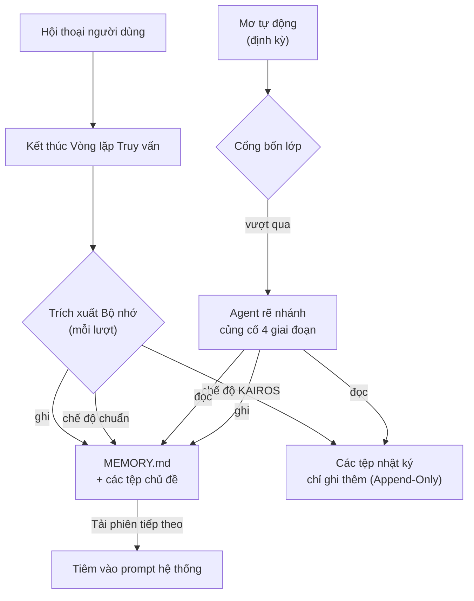

# Chương 24: Bộ nhớ chéo Phiên -- Từ Đãng trí đến Học tập Kiên trì

> **Định vị**: Chương này phân tích kiến trúc bộ nhớ chéo phiên sáu lớp của Claude Code -- một hệ thống hoàn chỉnh từ thu nhận tín hiệu thô đến chắt lọc tri thức có cấu trúc. Điều kiện tiên quyết: Chương 5. Đối tượng độc giả: những người muốn tìm hiểu cách Claude Code triển khai hệ thống bộ nhớ chéo phiên giúp sản phẩm tiến hóa từ chỗ đãng trí sang khả năng học tập kiên trì.

## Tại sao Điều này Quan trọng

Một AI Agent không có bộ nhớ về mặt bản chất chỉ là một hàm không lưu trạng thái (stateless function): mỗi cuộc gọi đều bắt đầu từ con số không, không biết người dùng là ai, lần trước đã làm gì, hay những quyết định nào đã được đưa ra. Người dùng buộc phải lặp lại cùng một ngữ cảnh trong mỗi phiên làm việc mới -- "Tôi là kỹ sư backend," "dự án này build bằng Bun," "đừng mock cơ sở dữ liệu trong các bài test." Sự lặp lại này vừa lãng phí thời gian, vừa phá vỡ tính liên tục của sự cộng tác giữa người và máy.

Câu trả lời của Claude Code là một **kiến trúc bộ nhớ sáu lớp**, từ thu nhận tín hiệu thô đến chắt lọc tri thức có cấu trúc, từ tóm tắt trong phiên đến kiên định hóa chéo phiên, xây dựng một "năng lực học tập" hoàn chỉnh. Sáu phân hệ này có sự phân chia trách nhiệm rõ ràng:

| Phân hệ | Tệp cốt lõi | Tần suất | Trách nhiệm |
|-----------|----------|-----------|----------------|
| Memdir | `memdir/memdir.ts` | Mỗi khi tải phiên | Chỉ mục MEMORY.md + các tệp chủ đề, được tiêm vào prompt hệ thống |
| Trích xuất Bộ nhớ (Extract Memories) | `services/extractMemories/extractMemories.ts` | Cuối mỗi lượt truy vấn | Agent rẽ nhánh tự động trích xuất bộ nhớ |
| Bộ nhớ Phiên (Session Memory) | `services/SessionMemory/sessionMemory.ts` | Kích hoạt định kỳ | Tóm tắt phiên cuốn chiếu, được dùng để nén ngữ cảnh |
| Kiên định hóa đoạn hội thoại (Transcript Persistence) | `utils/sessionStorage.ts` | Mỗi tin nhắn | Lưu trữ và phục hồi bản ghi phiên JSONL |
| Bộ nhớ Agent (Agent Memory) | `tools/AgentTool/agentMemory.ts` | Vòng đời của Agent | Kiên định hóa subagent + ảnh chụp nhanh VCS |
| Mơ Tự động (Auto-Dream) | `services/autoDream/autoDream.ts` | Hằng ngày | Củng cố và cắt tỉa bộ nhớ hằng đêm |

Các phân hệ này đã được đề cập sơ qua ở các chương trước -- Chương 9 giới thiệu tính năng nén tự động (auto-compaction), Chương 10 thảo luận về việc giữ lại trạng thái tệp sau khi nén, Chương 19 phân tích việc tải CLAUDE.md, Chương 20 đề cập đến chế độ agent rẽ nhánh, Chương 23 nhắc đến các cờ tính năng KAIROS và TEAMMEM. Nhưng **sự tạo thành, vòng đời, và kiên định hóa chéo phiên** của bộ nhớ dưới tư cách là một hệ thống hoàn chỉnh thì chưa bao giờ được phân tích đầy đủ. Chương này sẽ lấp đầy khoảng trống đó.

## Phân tích Mã nguồn

### 24.1 Kiến trúc Memdir: Chỉ mục MEMORY.md và các Tệp Chủ đề

Memdir là lớp lưu trữ của toàn bộ hệ thống bộ nhớ -- tất cả các ký ức cuối cùng đều nằm dưới dạng các tệp trong cấu trúc thư mục này.

#### Phân giải Đường dẫn

Vị trí thư mục bộ nhớ được xác định bởi hàm `getAutoMemPath()` trong `paths.ts`, tuân theo chuỗi ưu tiên ba cấp độ:

```typescript
// restored-src/src/memdir/paths.ts:223-235
export const getAutoMemPath = memoize(
  (): string => {
    const override = getAutoMemPathOverride() ?? getAutoMemPathSetting()
    if (override) {
      return override
    }
    const projectsDir = join(getMemoryBaseDir(), 'projects')
    return (
      join(projectsDir, sanitizePath(getAutoMemBase()), AUTO_MEM_DIRNAME) + sep
    ).normalize('NFC')
  },
  () => getProjectRoot(),
)
```

Thứ tự phân giải:
1. Biến môi trường `CLAUDE_COWORK_MEMORY_PATH_OVERRIDE` (gắn kết cấp độ không gian làm việc Cowork)
2. Cài đặt `autoMemoryDirectory` (chỉ giới hạn ở các nguồn đáng tin cậy: chính sách/cờ/cấu hình cục bộ/người dùng, **loại trừ** cấu hình dự án `projectSettings` để ngăn chặn các kho lưu trữ độc hại chuyển hướng đường dẫn ghi)
3. Đường dẫn mặc định: `~/.claude/projects/<sanitized-git-root>/memory/`

Đáng chú ý, `getAutoMemBase()` sử dụng `findCanonicalGitRoot()` thay vì `getProjectRoot()`, nghĩa là tất cả các cây làm việc (worktrees) của cùng một kho lưu trữ chia sẻ chung một thư mục bộ nhớ. Đây là một quyết định thiết kế có tính toán -- bộ nhớ là về dự án, không phải về thư mục làm việc.

#### Chỉ mục và Cắt ngắn

`MEMORY.md` là điểm vào của hệ thống bộ nhớ -- một tệp chỉ mục nơi mỗi dòng trỏ đến một tệp chủ đề. Hệ thống tiêm nó vào prompt hệ thống mỗi khi khởi động phiên làm việc. Để ngăn chỉ mục phình to chiếm mất không gian ngữ cảnh quý giá, `memdir.ts` áp dụng cơ chế cắt ngắn kép:

```typescript
// restored-src/src/memdir/memdir.ts:34-38
export const ENTRYPOINT_NAME = 'MEMORY.md'
export const MAX_ENTRYPOINT_LINES = 200
export const MAX_ENTRYPOINT_BYTES = 25_000
```

Logic cắt ngắn được xếp tầng: đầu tiên theo số dòng (200 dòng, ranh giới tự nhiên), sau đó kiểm tra số byte (25KB); nếu việc cắt ngắn byte rơi vào giữa dòng, nó sẽ lùi lại ký tự xuống dòng gần nhất. Chiến lược "dòng trước, byte sau" này được đúc rút từ kinh nghiệm thực tế -- các bình luận ghi chú rằng độ dài nội dung p97 nằm trong giới hạn, nhưng ở p100 đã ghi nhận 197KB vẫn nằm trong 200 dòng, cho thấy các dòng cực kỳ dài có tồn tại trong các tệp chỉ mục.

Hàm `truncateEntrypointContent()` (`memdir.ts:57-103`) thêm một thông điệp CẢNH BÁO (WARNING) sau khi cắt ngắn xếp tầng, thông báo cho mô hình rằng chỉ mục đã bị cắt ngắn và gợi ý chuyển nội dung chi tiết sang các tệp chủ đề (phân tích đầy đủ về hàm cắt ngắn nằm ở Chương 19). Đây là một cơ chế tự phục hồi thông minh -- mô hình sẽ nhìn thấy cảnh báo này vào lần tiếp theo nó tổ chức lại bộ nhớ và hành động phù hợp.

#### Định dạng Tệp Chủ đề

Mỗi bộ nhớ được lưu trữ dưới dạng một tệp Markdown độc lập với phần YAML frontmatter:

```markdown
---
name: Memory name
description: One-line description (used to judge relevance)
type: user | feedback | project | reference
---

Memory content...
```

Bốn loại tạo thành một hệ thống phân loại khép kín:
- **user**: Vai trò của người dùng, tùy chọn sở thích, mức độ hiểu biết tri thức
- **feedback**: Các sửa lỗi và hướng dẫn của người dùng đối với hành vi của Agent
- **project**: Công việc đang diễn ra, mục tiêu, thời hạn
- **reference**: Con trỏ đến các hệ thống bên ngoài (dự án Linear, bảng điều khiển Grafana)

Trình quét trong `memoryScan.ts` chỉ đọc 30 dòng đầu tiên của mỗi tệp để phân tích cú pháp frontmatter, tránh các thao tác IO quá mức khi có nhiều tệp bộ nhớ:

```typescript
// restored-src/src/memdir/memoryScan.ts:21-22
const MAX_MEMORY_FILES = 200
const FRONTMATTER_MAX_LINES = 30
```

Kết quả quét được sắp xếp theo thời gian sửa đổi giảm dần, giữ lại tối đa 200 tệp. Điều này có nghĩa là các ký ức không được cập nhật trong thời gian dài nhất sẽ tự động bị loại bỏ một cách tự nhiên.

#### Chế độ Nhật ký KAIROS

Khi chế độ KAIROS (chế độ trợ lý chạy lâu dài) được kích hoạt, chiến lược ghi bộ nhớ sẽ chuyển đổi từ "cập nhật trực tiếp tệp chủ đề + MEMORY.md" sang "ghi thêm vào tệp nhật ký hằng ngày":

```typescript
// restored-src/src/memdir/paths.ts:246-251
export function getAutoMemDailyLogPath(date: Date = new Date()): string {
  const yyyy = date.getFullYear().toString()
  const mm = (date.getMonth() + 1).toString().padStart(2, '0')
  const dd = date.getDate().toString().padStart(2, '0')
  return join(getAutoMemPath(), 'logs', yyyy, mm, `${yyyy}-${mm}-${dd}.md`)
}
```

Định dạng đường dẫn: `memory/logs/YYYY/MM/YYYY-MM-DD.md`. Chiến lược chỉ ghi thêm (append-only) này tránh việc phải ghi đè thường xuyên lên cùng một tệp trong các phiên làm việc dài -- việc chắt lọc thông tin được để lại cho tiến trình Mơ Tự động (Auto-Dream) chạy hằng đêm.

### 24.2 Trích xuất Bộ nhớ: Tự động Trích xuất Bộ nhớ

Phân hệ Trích xuất Bộ nhớ (Extract Memories) hoạt động như "lớp nhận thức" của hệ thống bộ nhớ -- vào cuối mỗi lượt truy vấn, một agent rẽ nhánh (fork agent) sẽ âm thầm phân tích cuộc hội thoại và trích xuất các thông tin có giá trị để kiên định hóa.

#### Cơ chế Kích hoạt

Việc trích xuất được kích hoạt trong `stopHooks.ts`, ở cuối vòng lặp truy vấn (xem Chương 4 để thảo luận về các stop hook):

```typescript
// restored-src/src/query/stopHooks.ts:141-156
if (
  feature('EXTRACT_MEMORIES') &&
  !toolUseContext.agentId &&
  isExtractModeActive()
) {
  void extractMemoriesModule!.executeExtractMemories(
    stopHookContext,
    toolUseContext.appendSystemMessage,
  )
}
if (!toolUseContext.agentId) {
  void executeAutoDream(stopHookContext, toolUseContext.appendSystemMessage)
}
```

Hai ràng buộc chính:
1. **Chỉ dành cho Agent chính**: `!toolUseContext.agentId` loại trừ các stop hook của subagent.
2. **Kích hoạt và bỏ qua (Fire-and-forget)**: Tiền tố `void` nghĩa là việc trích xuất chạy bất đồng bộ, không chặn lượt truy vấn tiếp theo của người dùng.

#### Cơ chế Điều tiết (Throttle Mechanism)

Không phải lượt truy vấn nào cũng kích hoạt việc trích xuất. Cờ tính năng `tengu_bramble_lintel` kiểm soát tần suất này (giá trị mặc định là 1, nghĩa là chạy sau mỗi lượt):

```typescript
// restored-src/src/services/extractMemories/extractMemories.ts:377-385
if (!isTrailingRun) {
  turnsSinceLastExtraction++
  if (
    turnsSinceLastExtraction <
    (getFeatureValue_CACHED_MAY_BE_STALE('tengu_bramble_lintel', null) ?? 1)
  ) {
    return
  }
}
turnsSinceLastExtraction = 0
```

#### Loại trừ Tương hỗ với Agent Chính

Khi bản thân Agent chính thực hiện ghi các tệp bộ nhớ (ví dụ: người dùng yêu cầu rõ ràng "nhớ điều này"), agent rẽ nhánh sẽ bỏ qua việc trích xuất ở lượt đó:

```typescript
// restored-src/src/services/extractMemories/extractMemories.ts:121-148
function hasMemoryWritesSince(
  messages: Message[],
  sinceUuid: string | undefined,
): boolean {
  // ... kiểm tra các tin nhắn của trợ lý xem có cuộc gọi công cụ Edit/Write nào nhắm vào autoMemPath không
}
```

Điều này tránh việc hai agent cùng lúc ghi vào một tệp. Khi agent chính thực hiện ghi, con trỏ sẽ dịch chuyển trực tiếp đến tin nhắn mới nhất, đảm bảo các tin nhắn đó không bị xử lý trùng lặp bởi các lượt trích xuất sau này.

#### Cách ly Quyền hạn

Quyền hạn của agent rẽ nhánh được giới hạn nghiêm ngặt:

Hàm `createAutoMemCanUseTool()` (`extractMemories.ts:171-222`) triển khai:

- **Cho phép**: Read/Grep/Glob (các công cụ chỉ đọc, không giới hạn)
- **Cho phép**: Bash (chỉ các lệnh thỏa mãn `isReadOnly` -- `ls`, `find`, `grep`, `cat`, v.v.)
- **Cho phép**: Edit/Write (chỉ các đường dẫn bên trong `memoryDir`, được xác thực qua `isAutoMemPath()`)
- **Từ chối**: Tất cả các công cụ khác (MCP, Agent, các lệnh Bash có khả năng ghi, v.v.)

Hàm phân quyền này được chia sẻ chung bởi cả hai phân hệ Trích xuất Bộ nhớ và Mơ Tự động (xem phần 24.6).

#### Prompt Trích xuất

Prompt của agent trích xuất hướng dẫn rõ ràng việc tối ưu hóa hiệu năng:

```typescript
// restored-src/src/services/extractMemories/prompts.ts:39
`You have a limited turn budget. ${FILE_EDIT_TOOL_NAME} requires a prior
${FILE_READ_TOOL_NAME} of the same file, so the efficient strategy is:
turn 1 — issue all ${FILE_READ_TOOL_NAME} calls in parallel for every file
you might update; turn 2 — issue all ${FILE_WRITE_TOOL_NAME}/${FILE_EDIT_TOOL_NAME}
calls in parallel.`
```

Prompt cũng cấm rõ ràng hành vi điều tra tìm hiểu -- "Do not waste any turns attempting to investigate or verify that content further." Điều này là do agent rẽ nhánh kế thừa toàn bộ ngữ cảnh của cuộc hội thoại chính (bao gồm cả bộ nhớ đệm prompt) nên không cần thu thập thêm thông tin. Số lượt tối đa được giới hạn ở 5 (`maxTurns: 5`), ngăn agent rơi vào các vòng lặp xác thực vô tận.

### 24.3 Bộ nhớ Phiên: Tóm tắt Phiên Cuốn chiếu

Bộ nhớ Phiên (Session Memory) giải quyết một vấn đề khác: giữ lại thông tin **trong phiên**. Khi cửa sổ ngữ cảnh sắp bão hòa và việc nén tự động sắp được kích hoạt (xem Chương 9), bộ nén cần biết thông tin nào là quan trọng. Bộ nhớ Phiên cung cấp tín hiệu này.

#### Điều kiện Kích hoạt

Bộ nhớ Phiên đăng ký như một hook hậu lấy mẫu (`registerPostSamplingHook`), chạy sau mỗi lần mô hình lấy mẫu đầu ra. Việc trích xuất thực tế được bảo vệ bởi ba ngưỡng:

```typescript
// restored-src/src/services/SessionMemory/sessionMemoryUtils.ts:32-36
export const DEFAULT_SESSION_MEMORY_CONFIG: SessionMemoryConfig = {
  minimumMessageTokensToInit: 10000,   // Kích hoạt lần đầu: 10K token
  minimumTokensBetweenUpdate: 5000,    // Khoảng cách cập nhật: 5K token
  toolCallsBetweenUpdates: 3,          // Số cuộc gọi công cụ tối thiểu: 3
}
```

Logic kích hoạt (`sessionMemory.ts:134-181`) yêu cầu:
1. **Ngưỡng khởi tạo**: Kích hoạt lần đầu khi cửa sổ ngữ cảnh đạt 10K token.
2. **Điều kiện cập nhật**: Ngưỡng token (5K) **phải** được đáp ứng, kèm theo (a) số cuộc gọi công cụ >= 3, hoặc (b) lượt trợ lý cuối cùng không có cuộc gọi công cụ (một điểm dừng tự nhiên trong cuộc hội thoại).

Điều này đảm bảo Bộ nhớ Phiên không kích hoạt trong các cuộc hội thoại ngắn, cũng như không làm gián đoạn luồng làm việc khi đang gọi công cụ dồn dập.

#### Mẫu Tóm tắt

Tệp tóm tắt sử dụng một cấu trúc phần cố định (`prompts.ts:11-41`):

```markdown
# Session Title
# Current State
# Task specification
# Files and Functions
# Workflow
# Errors & Corrections
# Codebase and System Documentation
# Learnings
# Key results
# Worklog
```

Mỗi phần có giới hạn kích thước (`MAX_SECTION_LENGTH = 2000` token), tổng dung lượng tệp không vượt quá 12.000 token (xem Chương 12 về các chiến lược ngân sách token). Khi vượt quá ngân sách, prompt yêu cầu agent chủ động nén các phần ít quan trọng nhất.

#### Mối quan hệ với Nén Tự động (Auto-Compaction)

Cổng khởi tạo của Bộ nhớ Phiên `initSessionMemory()` kiểm tra `isAutoCompactEnabled()` -- nếu tính năng nén tự động bị tắt, Bộ nhớ Phiên cũng sẽ không chạy. Điều này là do bên tiêu thụ chính của Bộ nhớ Phiên là hệ thống nén ngữ cảnh. Tệp tóm tắt `summary.md` được tiêm vào trong quá trình nén, cung cấp cho bộ nén tín hiệu quan trọng về "những gì là quan trọng" (xem Chương 9 `sessionMemoryCompact.ts`).

#### Khác biệt so với Trích xuất Bộ nhớ

| Chiều kích | Bộ nhớ Phiên | Trích xuất Bộ nhớ |
|-----------|---------------|-----------------|
| Phạm vi kiên định | Trong phiên | Chéo phiên |
| Vị trí lưu trữ | `~/.claude/projects/<root>/<session-id>/session-memory/` | `~/.claude/projects/<root>/memory/` |
| Thời điểm kích hoạt | Ngưỡng token + ngưỡng cuộc gọi công cụ | Cuối mỗi lượt truy vấn |
| Bên tiêu thụ | Hệ thống nén ngữ cảnh | Prompt hệ thống của phiên tiếp theo |
| Cấu trúc nội dung | Mẫu phần cố định | Các tệp chủ đề tự do |

Cả hai chạy song song không can thiệp lẫn nhau -- Bộ nhớ Phiên tập trung vào "những gì đã làm trong phiên này," Trích xuất Bộ nhớ tập trung vào "thông tin nào đáng giữ lại chéo phiên."

### 24.4 Kiên định hóa Đoạn hội thoại: Lưu trữ Phiên JSONL

Tệp `sessionStorage.ts` (5.105 dòng, một trong những tệp đơn lớn nhất trong mã nguồn) xử lý việc kiên định hóa toàn bộ bản ghi phiên dưới định dạng JSONL (JSON Lines).

#### Định dạng Lưu trữ

Mỗi tin nhắn được tuần tự hóa thành một dòng JSON, ghi thêm (append) vào tệp phiên. Đường dẫn lưu trữ: `~/.claude/projects/<root>/<session-id>.jsonl`. Định dạng JSONL được chọn vì hiệu năng -- việc ghi thêm tăng dần chỉ cần gọi `appendFile`, không cần phân tích cú pháp và ghi lại toàn bộ tệp.

Ngoài các tin nhắn chuẩn của người dùng/trợ lý, bản ghi phiên còn chứa một số loại mục nhập đặc biệt:

| Kiểu Mục nhập | Mục đích |
|-----------|---------|
| `file_history_snapshot` | Ảnh chụp nhanh lịch sử tệp, dùng để khôi phục trạng thái tệp sau khi nén ngữ cảnh (xem Chương 10) |
| `attribution_snapshot` | Ảnh chụp nhanh phân bổ, ghi lại nguồn gốc của từng sửa đổi tệp |
| `context_collapse_snapshot` | Điểm đánh dấu ranh giới nén ngữ cảnh, ghi lại vị trí xảy ra nén và những tin nhắn nào được giữ lại |
| `content_replacement` | Bản ghi thay thế nội dung, dùng để cắt ngắn đầu ra trong chế độ REPL |

#### Khôi phục Phiên (Session Resume)

Khi người dùng khôi phục phiên thông qua `claude --resume`, `sessionStorage.ts` xây dựng lại chuỗi tin nhắn hoàn chỉnh từ tệp JSONL. Quy trình khôi phục:
1. Phân tích cú pháp tất cả các mục nhập JSONL.
2. Xây dựng lại cây tin nhắn dựa trên `uuid`/`parentUuid`.
3. Áp dụng các điểm đánh dấu ranh giới nén ngữ cảnh (`context_collapse_snapshot`), khôi phục về trạng thái sau khi nén.
4. Xây dựng lại các ảnh chụp nhanh lịch sử tệp, đảm bảo hiểu biết của mô hình về trạng thái tệp nhất quán với đĩa cứng.

Điều này làm cho sự "kế thừa" chéo phiên khả thi -- người dùng có thể đóng terminal vào cuối ngày và tiếp tục chính xác ngữ cảnh hội thoại đó vào ngày hôm sau.

### 24.5 Bộ nhớ Agent: Kiên định hóa Subagent

Các subagent (xem Chương 20) có nhu cầu bộ nhớ riêng của họ -- một agent đánh giá mã nguồn định kỳ cần nhớ các sở thích về phong cách viết mã của nhóm; một agent kiểm thử cần nhớ cấu hình khung kiểm thử của dự án.

#### Mô hình Ba Phạm vi

Tệp `agentMemory.ts` định nghĩa ba phạm vi bộ nhớ:

```typescript
// restored-src/src/tools/AgentTool/agentMemory.ts:12-13
export type AgentMemoryScope = 'user' | 'project' | 'local'
```

| Phạm vi | Đường dẫn | Có thể commit VCS | Mục đích |
|-------|------|----------------|---------|
| `user` | `~/.claude/agent-memory/<agentType>/` | Không | Tùy chọn cấp người dùng chéo dự án |
| `project` | `<cwd>/.claude/agent-memory/<agentType>/` | Có | Tri thức dự án được chia sẻ trong nhóm |
| `local` | `<cwd>/.claude/agent-memory-local/<agentType>/` | Không | Cấu hình dự án riêng của từng máy |

Mỗi phạm vi duy trì độc lập tệp chỉ mục `MEMORY.md` và các tệp chủ đề riêng, sử dụng chính xác hàm `buildMemoryPrompt()` tương tự Memdir để xây dựng nội dung prompt hệ thống.

#### Đồng bộ Ảnh chụp nhanh VCS (VCS Snapshot Sync)

Tệp `agentMemorySnapshot.ts` giải quyết một vấn đề thực tế: bộ nhớ phạm vi `project` nên được chia sẻ qua Git giữa các thành viên, nhưng thư mục `.claude/agent-memory/` lại nằm trong `.gitignore`. Giải pháp là một thư mục ảnh chụp nhanh riêng biệt:

```typescript
// restored-src/src/tools/AgentTool/agentMemorySnapshot.ts:31-33
export function getSnapshotDirForAgent(agentType: string): string {
  return join(getCwd(), '.claude', SNAPSHOT_BASE, agentType)
}
```

Các ảnh chụp nhanh theo dõi phiên bản qua dấu thời gian `updatedAt` trong `snapshot.json`. Khi phát hiện ảnh chụp nhanh mới hơn bộ nhớ cục bộ, hệ thống đưa ra ba chiến lược:

```typescript
// restored-src/src/tools/AgentTool/agentMemorySnapshot.ts:98-144
export async function checkAgentMemorySnapshot(
  agentType: string,
  scope: AgentMemoryScope,
): Promise<{
  action: 'none' | 'initialize' | 'prompt-update'
  snapshotTimestamp?: string
}> {
  // Không có ảnh chụp nhanh → 'none'
  // Không có bộ nhớ cục bộ → 'initialize' (sao chép ảnh chụp nhanh vào cục bộ)
  // Ảnh chụp nhanh mới hơn → 'prompt-update' (gợi ý mô hình thực hiện trộn)
}
```

Chiến lược `initialize` trực tiếp sao chép các tệp; `prompt-update` không tự động ghi đè mà thông báo cho mô hình qua prompt rằng "tri thức nhóm mới đã khả dụng," để mô hình tự quyết định cách trộn. Điều này tránh việc làm mất các tùy chỉnh cục bộ có thể xảy ra khi ghi đè tự động.

### 24.6 Mơ Tự động: Củng cố Bộ nhớ Tự động

Mơ Tự động (Auto-Dream) là "pha ngủ" của hệ thống bộ nhớ -- một tác vụ củng cố chạy nền yêu cầu cả cổng thời gian (mặc định 24 giờ) và cổng phiên (mặc định 5 phiên mới) để kích hoạt. Nó sắp xếp toàn diện các mảnh bộ nhớ rải rác, cắt tỉa thông tin lỗi thời, và duy trì sức khỏe của hệ thống bộ nhớ.

#### Hệ thống Cổng Bốn Lớp

Việc kích hoạt Auto-Dream đi qua bốn lớp kiểm tra, được sắp xếp từ chi phí thấp nhất đến cao nhất (`autoDream.ts:95-191`):

**Lớp Một: Cổng Chính (Master Gate)**

```typescript
// restored-src/src/services/autoDream/autoDream.ts:95-100
function isGateOpen(): boolean {
  if (getKairosActive()) return false  // Chế độ KAIROS sử dụng kỹ năng mơ trên đĩa
  if (getIsRemoteMode()) return false
  if (!isAutoMemoryEnabled()) return false
  return isAutoDreamEnabled()
}
```

Chế độ KAIROS bị loại trừ vì KAIROS có kỹ năng mơ riêng (kích hoạt thủ công qua `/dream`). Chế độ từ xa (CCR) bị loại trừ vì lưu trữ kiên định không đáng tin cậy. Hàm `isAutoDreamEnabled()` kiểm tra cài đặt của người dùng và cờ tính năng `tengu_onyx_plover` (`config.ts:13-21`).

**Lớp Hai: Cổng Thời gian (Time Gate)**

```typescript
// restored-src/src/services/autoDream/autoDream.ts:131-141
let lastAt: number
try {
  lastAt = await readLastConsolidatedAt()
} catch { ... }
const hoursSince = (Date.now() - lastAt) / 3_600_000
if (!force && hoursSince < cfg.minHours) return
```

Mặc định `minHours = 24`, ít nhất 24 giờ kể từ lần củng cố cuối cùng. Thông tin thời gian được lấy thông qua mtime của tệp khóa -- chỉ cần một cuộc gọi hệ thống `stat`.

**Lớp Ba: Cổng Phiên (Session Gate)**

```typescript
// restored-src/src/services/autoDream/autoDream.ts:153-171
let sessionIds: string[]
try {
  sessionIds = await listSessionsTouchedSince(lastAt)
} catch { ... }
const currentSession = getSessionId()
sessionIds = sessionIds.filter(id => id !== currentSession)
if (!force && sessionIds.length < cfg.minSessions) return
```

Mặc định `minSessions = 5`, ít nhất 5 phiên mới được sửa đổi kể từ lần củng cố cuối cùng. Phiên hiện tại bị loại trừ (mtime của nó luôn là mới nhất). Việc quét có thời gian giãn cách 10 phút (`SESSION_SCAN_INTERVAL_MS = 10 * 60 * 1000`), ngăn chặn việc quét danh sách phiên liên tục sau mỗi lượt khi cổng thời gian đã mở.

**Lớp Bốn: Cổng Khóa (Lock Gate)** -- Sau khi vượt qua ba lớp kiểm tra, tiến trình phải giành được khóa đồng thời. Nếu một tiến trình khác đang thực hiện củng cố, tiến trình hiện tại sẽ từ bỏ. Chi tiết triển khai cơ chế khóa nằm ở phần tiếp theo.

#### Cơ chế Khóa PID

Việc kiểm soát đồng thời sử dụng tệp `.consolidate-lock` (`consolidationLock.ts`):

```typescript
// restored-src/src/services/autoDream/consolidationLock.ts:16-19
const LOCK_FILE = '.consolidate-lock'
const HOLDER_STALE_MS = 60 * 60 * 1000  // 1 giờ
```

Tệp khóa này mang hai ngữ nghĩa:
- **mtime** = `lastConsolidatedAt` (dấu thời gian của lần củng cố thành công gần nhất)
- **nội dung tệp** = PID của tiến trình giữ khóa

Luồng giành khóa:
1. `stat` + `readFile` để lấy mtime và PID.
2. Nếu mtime trong vòng 1 giờ và PID vẫn đang hoạt động -> khóa đang bận, trả về `null`.
3. Nếu PID đã chết hoặc mtime đã hết hạn -> thu hồi khóa.
4. Ghi PID của chính mình vào tệp.
5. Đọc lại để xác nhận (ngăn chặn tình trạng tranh chấp khi hai tiến trình cùng thu hồi khóa một lúc).

```typescript
// restored-src/src/services/autoDream/consolidationLock.ts:46-84
export async function tryAcquireConsolidationLock(): Promise<number | null> {
  // ... stat + readFile ...
  await writeFile(path, String(process.pid))
  // Kiểm tra hai lần: hai bên thu hồi cùng ghi → bên ghi sau sẽ thắng PID
  let verify: string
  try {
    verify = await readFile(path, 'utf8')
  } catch { return null }
  if (parseInt(verify.trim(), 10) !== process.pid) return null
  return mtimeMs ?? 0
}
```

Việc khôi phục khi thất bại qua `rollbackConsolidationLock()` sẽ đưa mtime về giá trị trước khi giành khóa. Nếu `priorMtime` là 0 (trước đó không tồn tại tệp khóa), tệp khóa sẽ bị xóa. Điều này đảm bảo một lần củng cố thất bại không chặn lần thử lại tiếp theo.

#### Prompt Củng cố Bốn Giai đoạn

Agent củng cố nhận được một prompt có cấu trúc bốn giai đoạn:

```
Giai đoạn 1 — Định hướng: ls thư mục bộ nhớ, đọc MEMORY.md, duyệt qua các tệp chủ đề
Giai đoạn 2 — Thu thập: Tìm kiếm các nhật ký và bản ghi phiên để tìm tín hiệu mới
Giai đoạn 3 — Củng cố: Trộn vào các tệp hiện có, giải quyết mâu thuẫn, chuyển ngày tương đối → ngày tuyệt đối
Giai đoạn 4 — Cắt tỉa & Chỉ mục: Giữ MEMORY.md trong giới hạn 200 dòng / 25KB
```

Prompt đặc biệt nhấn mạnh "trộn thay vì tạo mới" (`Merging new signal into existing topic files rather than creating near-duplicates`) and "sửa đổi thay vì bảo toàn" (`if today's investigation disproves an old memory, fix it at the source`) -- ngăn chặn việc tệp bộ nhớ tăng trưởng vô hạn.

Trong các kịch bản kích hoạt tự động, prompt cũng đính kèm thêm thông tin ràng buộc -- `Tool constraints for this run` và danh sách phiên:

```typescript
// restored-src/src/services/autoDream/autoDream.ts:216-221
const extra = `
**Tool constraints for this run:** Bash is restricted to read-only commands...
Sessions since last consolidation (${sessionIds.length}):
${sessionIds.map(id => `- ${id}`).join('\n')}`
```

#### Ràng buộc đối với Agent Rẽ nhánh

Việc củng cố thực thi qua `runForkedAgent` (xem Chương 20 về chế độ agent rẽ nhánh), sử dụng hàm phân quyền `createAutoMemCanUseTool` đã mô tả ở phần 24.2. Các ràng buộc then chốt:

```typescript
// restored-src/src/services/autoDream/autoDream.ts:224-233
const result = await runForkedAgent({
  promptMessages: [createUserMessage({ content: prompt })],
  cacheSafeParams: createCacheSafeParams(context),
  canUseTool: createAutoMemCanUseTool(memoryRoot),
  querySource: 'auto_dream',
  forkLabel: 'auto_dream',
  skipTranscript: true,
  overrides: { abortController },
  onMessage: makeDreamProgressWatcher(taskId, setAppState),
})
```

- `cacheSafeParams: createCacheSafeParams(context)` -- Kế thừa bộ nhớ đệm prompt của tiến trình cha, giảm đáng kể chi phí token.
- `skipTranscript: true` -- Không ghi lại trong lịch sử phiên (củng cố là một hoạt động chạy nền và không được làm ô nhiễm hồ sơ hội thoại của người dùng).
- `onMessage` -- Hàm gọi lại tiến độ, bắt các đường dẫn Edit/Write để cập nhật giao diện DreamTask.

#### Tích hợp UI Nhiệm vụ

Tệp `DreamTask.ts` hiển thị Auto-Dream trong giao diện tác vụ chạy nền của Claude Code (nút tròn ở chân trang và hộp thoại Shift+Down):

```typescript
// restored-src/src/tasks/DreamTask/DreamTask.ts:25-41
export type DreamTaskState = TaskStateBase & {
  type: 'dream'
  phase: DreamPhase               // 'starting' | 'updating'
  sessionsReviewing: number
  filesTouched: string[]
  turns: DreamTurn[]
  abortController?: AbortController
  priorMtime: number              // Để khôi phục khi bị hủy (kill)
}
```

Người dùng có thể chủ động hủy nhiệm vụ mơ từ giao diện UI. Phương thức `kill` hủy agent rẽ nhánh qua `abortController.abort()`, sau đó khôi phục mtime của tệp khóa để đảm bảo phiên làm việc tiếp theo có thể thử lại:

```typescript
// restored-src/src/tasks/DreamTask/DreamTask.ts:136-156
async kill(taskId, setAppState) {
  updateTaskState<DreamTaskState>(taskId, setAppState, task => {
    task.abortController?.abort()
    priorMtime = task.priorMtime
    return { ...task, status: 'killed', ... }
  })
  if (priorMtime !== undefined) {
    await rollbackConsolidationLock(priorMtime)
  }
}
```

#### Mối quan hệ Bổ trợ giữa Trích xuất Bộ nhớ và Mơ Tự động

Hai phân hệ này tạo thành một kiến trúc bổ trợ **gia tăng tần suất cao + toàn cục tần suất thấp**:



| Chiều kích | Trích xuất Bộ nhớ | Mơ Tự động |
|-----------|-----------------|------------|
| Tần suất | Mỗi lượt (có thể điều tiết qua cờ) | Hằng ngày (24 giờ + 5 phiên) |
| Đầu vào | N tin nhắn gần đây | Toàn bộ thư mục bộ nhớ + bản ghi phiên |
| Thao tác | Tạo/cập nhật tệp chủ đề | Trộn, cắt tỉa, giải quyết mâu thuẫn |
| Phép ẩn dụ | Mã hóa bộ nhớ ngắn hạn → dài hạn | Củng cố bộ nhớ trong khi ngủ |

Trong chế độ KAIROS, tính bổ trợ này càng rõ rệt: Trích xuất Bộ nhớ chỉ ghi các nhật ký append-only (dòng tín hiệu thô), Mơ Tự động sẽ chắt lọc các nhật ký này thành các tệp chủ đề có cấu trúc trong quá trình củng cố hằng ngày. Trong chế độ chuẩn, Trích xuất Bộ nhớ trực tiếp cập nhật các tệp chủ đề, Mơ Tự động xử lý việc cắt tỉa định kỳ và loại bỏ trùng lặp.

---

## Phân tích Mô hình (Pattern Distillation)

### Pattern One: Kiến trúc Bộ nhớ Nhiều Lớp (Multi-Layer Memory Architecture)

**Vấn đề giải quyết**: Một chiến lược lưu trữ đơn lẻ không thể đồng thời thỏa mãn các lượt ghi tần suất cao và yêu cầu truy xuất chất lượng cao.

**Giải pháp**: Chia hệ thống bộ nhớ thành ba lớp -- lớp tín hiệu thô (nhật ký/bản ghi phiên), lớp tri thức có cấu trúc (các tệp chủ đề), lớp chỉ mục (MEMORY.md). Mỗi lớp có tần suất ghi và yêu cầu chất lượng độc lập.

```
Tín hiệu thô ──(mỗi lượt)──→ Tri thức có cấu trúc ──(hằng ngày)──→ Chỉ mục
  (nhật ký)                     (các tệp chủ đề)                  (MEMORY.md)
Tần suất cao, chất lượng thấp  Tần suất trung bình, CL trung bình  Tần suất thấp, CL cao
```

**Điều kiện tiên quyết**: Đòi hỏi năng lực xử lý chạy nền (agent rẽ nhánh), yêu cầu ngân sách lưu trữ có thể dự đoán (cơ chế cắt ngắn).

### Pattern Two: Trích xuất Chạy nền qua Agent Rẽ nhánh (Background Extraction via Fork Agent)

**Vấn đề giải quyết**: Việc trích xuất bộ nhớ đòi hỏi tư duy suy luận của mô hình nhưng không được làm chặn vòng lặp tương tác của người dùng.

**Giải pháp**: Khởi chạy một agent rẽ nhánh ở cuối vòng lặp truy vấn, kế thừa bộ nhớ đệm prompt của cha (giảm chi phí), áp dụng cách ly quyền hạn nghiêm ngặt (chỉ có thể ghi vào thư mục bộ nhớ), đặt giới hạn cuộc gọi công cụ và lượt (ngăn chặn chạy vô hạn). Phối hợp với agent chính thông qua các kiểm tra loại trừ tương hỗ (`hasMemoryWritesSince`).

**Điều kiện tiên quyết**: Cơ chế bộ nhớ đệm prompt khả dụng, hạ tầng agent rẽ nhánh đã sẵn sàng (xem Chương 20), đường dẫn thư mục bộ nhớ được xác định.

### Pattern Three: Lấy File mtime làm Trạng thái (File mtime as State)

**Vấn đề giải quyết**: Tiến trình Mơ Tự động cần lưu trữ kiên định "lần củng cố cuối cùng" và "tiến trình giữ khóa hiện tại" mà không muốn đưa vào một cơ sở dữ liệu bên ngoài.

**Giải pháp**: Sử dụng một tệp khóa duy nhất; mtime của nó là `lastConsolidatedAt`, nội dung là PID của tiến trình giữ khóa. Triển khai việc đọc, giành quyền, khôi phục thông qua `stat`/`utimes`/`writeFile`. Việc phát hiện sự sống của PID + hết hạn sau 1 giờ cung cấp khả năng phục hồi sau sự cố.

**Điều kiện tiên quyết**: Hệ thống tệp hỗ trợ mtime với độ chính xác mili giây, các PID của tiến trình không bị tái sử dụng trong một khoảng thời gian hợp lý.

### Pattern Four: Tiêm Bộ nhớ Giới hạn Ngân sách (Budget-Constrained Memory Injection)

**Vấn đề giải quyết**: Việc tăng trưởng bộ nhớ không giới hạn cuối cùng sẽ chiếm dụng hết không gian ngữ cảnh hữu ích.

**Giải pháp**: Áp dụng cắt ngắn nhiều cấp độ -- MEMORY.md tối đa 200 dòng / 25KB, các tệp chủ đề giới hạn ở mức `MAX_MEMORY_FILES = 200`, Bộ nhớ Phiên giới hạn ở mức 2000 token mỗi phần / tổng số 12000 token. Đính kèm thông điệp cảnh báo khi xảy ra cắt ngắn, tạo thành một vòng lặp tự phục hồi.

**Điều kiện tiên quyết**: Xác định được ngân sách ngữ cảnh (xem Chương 12), nội dung sau khi cắt ngắn vẫn có thể cung cấp thông tin có ý nghĩa.

### Pattern Five: Thiết kế Tần suất Bổ trợ (Complementary Frequency Design)

**Vấn đề giải quyết**: Xử lý bộ nhớ với tần suất đơn lẻ hoặc sẽ làm mất thông tin (nếu quá ít) hoặc tích tụ nhiễu (nếu quá nhiều).

**Giải pháp**: Chiến lược tần suất kép -- trích xuất gia tăng tần suất cao (mỗi lượt / mỗi N lượt) bắt lấy tất cả các tín hiệu có khả năng có giá trị; củng cố toàn cục tần suất thấp (hằng ngày) cắt tỉa nhiễu, giải quyết mâu thuẫn, trộn các bản trùng lặp. Phân hệ trước chấp nhận các kết quả dương tính giả (nhớ cả những điều không quan trọng); phân hệ sau sửa chữa các kết quả dương tính giả đó (xóa các ký ức không quan trọng).

**Điều kiện tiên quyết**: Sự khác biệt về thời gian đủ lớn giữa hai tần suất xử lý (ít nhất một bậc độ lớn), chi phí hoạt động của tần suất cao nằm trong tầm kiểm soát (kế thừa bộ nhớ đệm prompt).

---

## Những việc Người dùng Có thể Làm

### Quản lý MEMORY.md

Hiểu rõ giới hạn 200 dòng là điều then chốt. Nếu chỉ mục bộ nhớ dự án của bạn vượt quá 200 dòng, các mục nhập sau đó sẽ bị cắt ngắn. Hãy chỉnh sửa MEMORY.md thủ công để đảm bảo các mục nhập quan trọng nhất nằm ở đầu, chuyển các chi tiết vào các tệp chủ đề. Giữ cho mỗi mục chỉ mục dưới 150 ký tự mỗi dòng.

### Hiểu rõ Những gì Được Ghi nhớ

Bốn loại bộ nhớ có các mục đích sử dụng tốt nhất:
- **feedback** là loại có giá trị nhất -- nó trực tiếp thay đổi hành vi của Agent. "Đừng mock cơ sở dữ liệu trong các bài test" hữu ích hơn nhiều so với "chúng tôi sử dụng PostgreSQL".
- **user** giúp Agent điều chỉnh phong cách giao tiếp và độ sâu của gợi ý.
- **project** có tính nhạy cảm về thời gian, cần dọn dẹp định kỳ.
- **reference** là các phím tắt đến tài nguyên bên ngoài, nên giữ ngắn gọn.

### Kiểm soát Bộ nhớ Tự động

- `CLAUDE_CODE_DISABLE_AUTO_MEMORY=1` tắt hoàn toàn tất cả các tính năng bộ nhớ tự động.
- Cấu hình `settings.json` with `autoMemoryEnabled: false` tắt bộ nhớ trên từng dự án.
- `autoDreamEnabled: false` chỉ tắt việc củng cố hằng đêm, giữ lại việc trích xuất tức thời.

### Kích hoạt Củng cố Thủ công

Không muốn đợi kích hoạt tự động hằng ngày? Sử dụng lệnh `/dream` để củng cố bộ nhớ tức thời. Đặc biệt hữu ích trong các trường hợp:
- Sau khi hoàn thành một đợt tái cấu trúc mã nguồn lớn, để cập nhật ngữ cảnh dự án.
- Sau khi bàn giao giữa các thành viên, để sắp xếp lại sở thích cá nhân.
- Khi bạn nhận thấy các tệp bộ nhớ đã cũ hoặc mâu thuẫn nhau.

### Bổ sung Bộ nhớ bằng CLAUDE.md

CLAUDE.md và hệ thống bộ nhớ là hai cơ chế bổ trợ cho nhau:
- CLAUDE.md lưu trữ **các hướng dẫn không được phép sửa đổi** -- tiêu chuẩn viết mã, ràng buộc kiến trúc, quy trình của nhóm.
- Hệ thống bộ nhớ lưu trữ **tri thức có thể tiến hóa** -- sở thích người dùng, ngữ cảnh dự án, các tham chiếu bên ngoài.

Nếu thông tin không được phép bị cắt tỉa hoặc sửa đổi bởi tiến trình Mơ Tự động, hãy đặt nó vào CLAUDE.md thay vị hệ thống bộ nhớ.

---

## Tiến hóa Phiên bản: Các Thay đổi của Hệ thống Bộ nhớ trong v2.1.91

> Phân tích dưới đây dựa trên so sánh tín hiệu bundle của v2.1.91, kết hợp với suy luận mã nguồn v2.1.88.

### Công tắc Tính năng Bộ nhớ (Memory Feature Toggle)

Phiên bản v2.1.91 bổ sung sự kiện `tengu_memory_toggled`, gợi ý về một công tắc thời gian chạy cho chức năng bộ nhớ -- người dùng có thể bật hoặc tắt động bộ nhớ chéo phiên trong suốt phiên làm việc. Điều này khác với v2.1.88 nơi bộ nhớ luôn được bật (nếu Cờ Tính năng được bật).

### Tối ưu hóa Bỏ qua Khi không có Văn bản tự nhiên (No-Prose Skip Optimization)

Sự kiện `tengu_extract_memories_skipped_no_prose` chỉ ra v2.1.91 đã bổ sung việc phát hiện nội dung trước khi trích xuất bộ nhớ: nếu các tin nhắn không chứa văn bản tự nhiên (chỉ có mã nguồn thuần túy, kết quả công cụ, đầu ra JSON), việc trích xuất bộ nhớ sẽ bị bỏ qua -- tránh các cuộc gọi API đắt đỏ cho các nội dung không mang lại thông tin.

Đây là một **sự tối ưu hóa nhận biết ngân sách (budget-aware optimization)**: việc trích xuất bộ nhớ đòi hỏi các cuộc gọi API bổ sung, và việc trích xuất từ các tương tác thuần kỹ thuật (đọc tệp hàng loạt, chạy test) không chỉ lãng phí chi phí mà còn có thể tạo ra các mục nhập bộ nhớ chất lượng thấp.

### Bộ nhớ Nhóm (Team Memory)

Phiên bản v2.1.91 bổ sung chuỗi sự kiện `tengu_team_mem_*` (sync_pull, sync_push, push_suppressed, secret_skipped, v.v.), chỉ ra bộ nhớ nhóm đã chuyển từ trạng thái thử nghiệm sang hoạt động thực tế.

Bộ nhớ nhóm được lưu trữ tại `~/.claude/projects/{project}/memory/team/`, độc lập với bộ nhớ cá nhân. Các cơ chế then chốt:
- **Đồng bộ hóa**: Các sự kiện `sync_pull` / `sync_push` biểu thị việc đồng bộ giữa các thành viên.
- **Lọc bảo mật**: Sự kiện `secret_skipped` chỉ ra nội dung nhạy cảm (API key, mật khẩu) sẽ không được ghi vào bộ nhớ dùng chung.
- **Ức chế ghi**: Sự kiện `push_suppressed` biểu thị việc giới hạn ghi (có thể về tần suất hoặc dung lượng).
- **Giới hạn mục nhập**: Sự kiện `entries_capped` chỉ ra bộ nhớ nhóm có giới hạn dung lượng.

Xem Chương 20b để biết phân tích bảo vệ an ninh bộ nhớ nhóm trong chi tiết triển khai Teams.

---

## Tiến hóa Phiên bản: Sự Trưởng thành của Hệ thống Mơ trong v2.1.100

> Phân tích dưới đây dựa trên so sánh tín hiệu bundle của v2.1.100, kết hợp với suy luận mã nguồn v2.1.88 (`services/autoDream/autoDream.ts`).

### Kairos Dream: Củng cố Lên lịch Chạy nền

Trong mã nguồn v2.1.88, `getKairosActive()` làm cho `auto_dream` trả về `false` sớm (`autoDream.ts:95-100`), vì chế độ KAIROS "có kỹ năng mơ riêng." Phiên bản v2.1.100 thay đổi thiết kế này: thay vì một kỹ năng mơ riêng biệt, chế độ KAIROS giờ đây sử dụng `tengu_kairos_dream` như một tác vụ mơ chạy nền được lên lịch qua cron -- chế độ kích hoạt thứ ba của hệ thống Mơ.

| Chế độ Kích hoạt | Sự kiện | Khi nào | Điều kiện tiên quyết |
|-------------|-------|------|-------------|
| Thủ công | `tengu_dream_invoked` | Người dùng chạy `/dream` | Không có |
| Tự động | `tengu_auto_dream_fired` | Kiểm tra khi bắt đầu phiên | Cổng thời gian + cổng phiên |
| Lên lịch | `tengu_kairos_dream` | Lịch trình cron chạy nền | Chế độ KAIROS được kích hoạt |

Logic tạo biểu thức cron được trích xuất từ bundle v2.1.100:

```javascript
// Kỹ nghệ đảo ngược bundle v2.1.100
function P_A() {
  let q = Math.floor(Math.random() * 360);
  return `${q % 60} ${Math.floor(q / 60)} * * *`;
}
```

Phép tính `Math.random() * 360` tạo ra một số ngẫu nhiên từ 0-359; `q % 60` cho ra phút (0-59), `Math.floor(q / 60)` cho ra giờ (0-5). Điều này có nghĩa là Kairos Dream **chỉ chạy trong khoảng từ nửa đêm đến 5 giờ sáng** -- thực thi vào ban đêm giúp tránh tranh chấp tài nguyên với các phiên làm việc tích cực của người dùng, trong khi độ lệch ngẫu nhiên ngăn nhiều người dùng cùng lúc kích hoạt hệ thống. Thiết kế này chia sẻ cùng một triết lý thân thiện với hệ thống phân tán tương tự tệp khóa `consolidationLock` trong mã nguồn v2.1.88 (`autoDream.ts:153-171`).

### Ghi nhận Lý do Bỏ qua Tường minh

Phiên bản v2.1.100 bổ sung sự kiện `tengu_auto_dream_skipped` with a `reason` field recording skip causes. Hai nhánh bỏ qua được trích xuất từ bundle:

```javascript
// Kỹ nghệ đảo ngược bundle v2.1.100
d("tengu_auto_dream_skipped", {
  reason: "sessions",          // Không đủ số phiên mới (< minSessions)
  session_count: j.length,
  min_required: Y.minSessions
})

d("tengu_auto_dream_skipped", {
  reason: "lock"               // Khóa đang bị tiến trình khác giữ
})
```

Hai nhánh bỏ qua này tương ứng với hai lớp cổng trong mã nguồn v2.1.88 (`autoDream.ts:131-171`) -- nhưng v2.1.88 chỉ âm thầm trả về, còn v2.1.100 ghi nhận lý do bỏ qua dưới dạng một sự kiện đo lường (telemetry). Điều này cải thiện khả năng quan sát (observability): các nhà vận hành có thể chẩn đoán "tại sao tiến trình mơ không kích hoạt" bằng cách kiểm tra phân phối của `reason`.

### Hai Chế độ Prompt của Mơ (Two Dream Prompt Modes)

Hai prompt mơ khác biệt được trích xuất từ bundle v2.1.100, tương ứng với logic thực thi mơ trong mã nguồn v2.1.88 (`autoDream.ts:216-233`):

1. **Chế độ cắt tỉa (Pruning mode)**: "You are performing a dream — a pruning pass over your memory files" -- xóa bỏ các mục nhập bộ nhớ cũ, trùng lặp hoặc mâu thuẫn.
2. **Chế độ phản chiếu (Reflective mode)**: "You are performing a dream — a reflective pass over your memory files. Synthesize what..." -- tổng hợp các mảnh bộ nhớ rải rác thành tri thức có cấu trúc.

Sự phân chia rõ ràng giữa các chế độ, kết hợp với các quy tắc xử lý thư mục `team/` từ bundle v2.1.100 ("Do not promote personal memories into `team/` during a dream — that's a deliberate choice the user makes via `/remember`, not something to do reflexively"), thiết lập các ranh giới hành vi rõ ràng cho tiến trình Mơ: mơ có thể sắp xếp và cắt tỉa, nhưng không thể đơn phương mở rộng phạm vi chia sẻ bộ nhớ.

### toolStats: Thống kê Công cụ Cấp Phiên

Trường `toolStats` trong `sdk-tools.d.ts` của v2.1.100 cung cấp số liệu thống kê sử dụng công cụ cấp phiên theo 7 chiều kích:

```typescript
toolStats?: {
  readCount: number;       // Số lần đọc tệp
  searchCount: number;     // Số lần tìm kiếm
  bashCount: number;       // Số lệnh Bash
  editFileCount: number;   // Số lần sửa tệp
  linesAdded: number;      // Số dòng thêm mới
  linesRemoved: number;    // Số dòng bị xóa
  otherToolCount: number;  // Số lần gọi công cụ khác
};
```

Điều này cung cấp cơ sở định lượng cho việc "đánh giá giá trị phiên" của hệ thống Mơ -- `auto_dream` cần đánh giá xem các phiên làm việc gần đây có chứa đủ "tương tác thực chất" đáng để củng cố hay không, thay vì các hoạt động thuần kỹ thuật (như các phiên debug có `bashCount` cao nhưng không có `linesAdded`).
