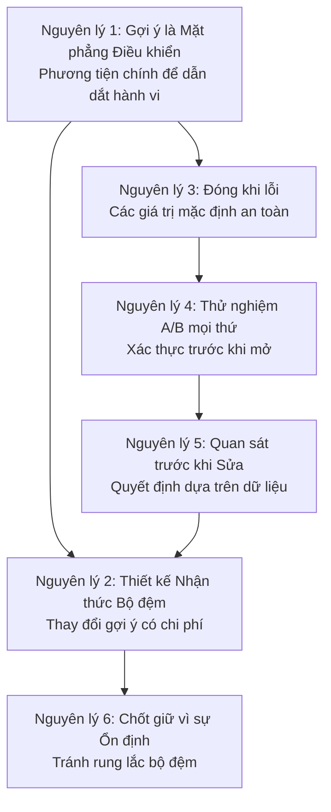

# Chương 25: Các nguyên lý kỹ thuật khai thác Harness (Harness Engineering Principles)

## Tại sao điều này quan trọng

Trong sáu phần trước, chúng ta đã mổ xẻ mọi phân hệ (subsystem) của Claude Code ở cấp độ mã nguồn — đăng ký công cụ (tool registration), Vòng lặp Agent (Agent Loop), gợi ý hệ thống (system prompts), nén ngữ cảnh (context compaction), lưu đệm gợi ý (prompt caching), bảo mật quyền hạn (permission security), và hệ thống kỹ năng (skill system). Những phân tích này đã tiết lộ rất nhiều chi tiết triển khai cụ thể, nhưng nếu chúng ta chỉ dừng lại ở mức độ "nó hoạt động thế nào", chúng ta sẽ lãng phí sản phẩm giá trị nhất của việc đảo ngược kỹ thuật (reverse engineering): **các nguyên lý kỹ thuật có thể tái sử dụng**.

Chương này đúc kết 6 nguyên lý Kỹ thuật Harness (Harness Engineering) cốt lõi từ các phân tích mã nguồn trong 23 chương trước. Mỗi nguyên lý đều có khả năng truy vết mã nguồn (source code traceability) rõ ràng, các tình huống áp dụng, và các cảnh báo phản khuôn mẫu (anti-pattern). Chủ đề chung xuyên suốt các nguyên lý này là: **trong các hệ thống AI Agent, cách tốt nhất để kiểm soát hành vi không phải là viết thêm mã nguồn, mà là thiết kế các ràng buộc tốt hơn**.

---

## Vị trí của Claude Code trong Phổ Kiến trúc Vòng lặp Agent

Trước khi đi vào chi tiết các nguyên lý, chúng ta cần trả lời một câu hỏi vĩ mô (meta-question): **Claude Code thuộc loại kiến trúc Agent nào?**

Giới học thuật phân loại Vòng lặp Agent (Agent Loop) thành sáu khuôn mẫu (pattern): vòng lặp đơn khối (monolithic loop - đan xen giữa suy luận và hành động kiểu ReAct), agent phân cấp (hierarchical agents - ba tầng mục tiêu-nhiệm vụ-thực thi), đa-agent phân tán (distributed multi-agent - cộng tác đa vai trò), vòng lặp phản tư/siêu nhận thức (reflection/metacognitive loop - tự cải tiến kiểu Reflexion), vòng lặp tăng cường công cụ (tool-augmented loop - cập nhật trạng thái do công cụ bên ngoài dẫn dắt), và vòng lặp học hỏi/cập nhật trực tuyến (learning/online update loop - duy trì bộ nhớ và lặp lại chiến lược). Hầu hết các khung phát triển (LangGraph, AutoGen, CrewAI) chọn một hoặc hai khuôn mẫu làm trừu tượng cốt lõi của họ.

Điều làm cho Claude Code trở nên độc đáo là: **nó không phải là hiện thực hóa thuần túy của bất kỳ khuôn mẫu đơn lẻ nào, mà là sự kết hợp thực tế (hybrid) của cả sáu**.

```
┌─────────────────────────────────────────────────────────────┐
│         Vị trí của Claude Code trong Phổ Kiến trúc Agent    │
├──────────────────────┬──────────────────────────────────────┤
│ Khuôn mẫu Học thuật  │ Hiện thực hóa trong Claude Code (CC) │
├──────────────────────┼──────────────────────────────────────┤
│ Vòng lặp Đơn khối    │ queryLoop() — Vòng lặp Agent cốt lõi │
│ (Monolithic Loop)    │ (ch03)                               │
│ Vòng lặp Tăng cường  │ Hơn 40 công cụ theo kiểu ReAct       │
│ Công cụ              │ (ch02-04)                            │
│ Agent Phân cấp       │ Các lớp Chế độ Điều phối             │
│                      │ (Coordinator Mode) (ch20)            │
│ Đa-Agent Phân tán    │ Đội ngũ song song + Ủy quyền từ xa   │
│                      │ Ultraplan (ch20)                     │
│ Phản tư (yếu)        │ Công cụ Advisor + stop hooks (ch21)  │
│ Học hỏi (yếu)        │ Bộ nhớ liên phiên + Duy trì tệp      │
│                      │ CLAUDE.md (ch24)                     │
└──────────────────────┴──────────────────────────────────────┘
```

Sự kết hợp này không phải là sai lầm trong thiết kế, mà là một lựa chọn thực tế. Cốt lõi của CC là một `queryLoop()` đơn khối (khuôn mẫu một), nhưng trên nền tảng đó:

- **Tăng cường công cụ** là hành vi mặc định — mỗi vòng lặp có thể gọi các công cụ, nhận kết quả quan sát, và cập nhật trạng thái, đây chính xác là quá trình "đan xen giữa suy luận và hành động" của ReAct
- **Agent phân cấp** được bật khi có yêu cầu — Chế độ Điều phối (Coordinator Mode) chia tách "lập kế hoạch" và "thực thi" thành các cấp khác nhau, trong đó cấp trên chỉ đưa ra quyết định và cấp dưới chỉ thực thi
- **Đa-agent phân tán** được bật khi có yêu cầu — Chế độ Đội ngũ (Team mode) cho phép nhiều Agent cộng tác thông qua `SendMessageTool`, và Ultraplan chuyển giao việc lập kế hoạch cho các container từ xa
- **Phản tư** được thực hiện ngầm — không có bộ nhớ Reflexion rõ ràng, nhưng Công cụ Advisor đóng vai trò "phê bình" (critic), và các điểm dừng (stop hooks) thực hiện "kiểm tra sau thực thi"
- **Học hỏi** có tính bền vững — bộ nhớ liên phiên (`~/.claude/memory/`) và tệp CLAUDE.md cho phép Agent tích lũy kinh nghiệm qua các phiên làm việc, nhưng không cập nhật trọng số mô hình

Triết lý kiến trúc "đơn giản theo mặc định, phức tạp khi có yêu cầu" này thấu suốt tất cả các nguyên lý được đúc kết trong chương này.

---

## Phân tích mã nguồn

### 25.1 Nguyên lý một: Gợi ý (Prompts) là Mặt phẳng Điều khiển (Control Plane)

**Định nghĩa**: Dẫn dắt hành vi của mô hình thông qua các phân đoạn gợi ý hệ thống hơn là lập trình cứng các hạn chế trong logic mã nguồn.

Hầu hết các hướng dẫn hành vi của Claude Code được thực hiện thông qua gợi ý, chứ không phải qua các nhánh if/else trong mã nguồn. Ví dụ điển hình nhất là chỉ thị về tính tối giản:

```typescript
// restored-src/src/constants/prompts.ts:203
"Don't create helpers, utilities, or abstractions for one-time operations.
Don't design for hypothetical future requirements. The right amount of
complexity is what the task actually requires — no speculative abstractions,
but no half-finished implementations either. Three similar lines of code
is better than a premature abstraction."
```

Đoạn văn bản này không phải là chú thích mã nguồn — nó là một chỉ thị thực tế được gửi đến mô hình. Claude Code không phát hiện ở cấp độ mã xem mô hình có đang thiết kế quá mức hay không (điều này về mặt kỹ thuật gần như bất khả thi), mà thay vào đó trực tiếp nói với mô hình "đừng làm điều này" thông qua ngôn ngữ tự nhiên.

Mẫu hình tương tự lan tỏa trong toàn bộ kiến trúc gợi ý hệ thống (xem Chương 5 để biết thêm chi tiết). `systemPromptSections.ts` tổ chức các gợi ý hệ thống thành nhiều phần có thể cấu hình, mỗi phần có phạm vi bộ đệm rõ ràng (`scope: 'global'` hoặc `null`). Thiết kế này có nghĩa là việc điều chỉnh hành vi chỉ yêu cầu sửa đổi văn bản — không thay đổi mã nguồn, không thay đổi kiểm thử, không cần quy trình phát hành phức tạp.

Các gợi ý của công cụ là minh chứng rõ nét nhất cho nguyên lý này (xem Chương 8 để biết thêm chi tiết). Giao thức An toàn Git của BashTool — "không bao giờ bỏ qua hook, không bao giờ amend (sửa đổi commit cũ), ưu tiên git add cho từng tệp cụ thể" — được thể hiện hoàn toàn thông qua văn bản gợi ý. Nếu sau này nhóm phát triển quyết định cho phép amend, họ chỉ cần xóa một dòng văn bản gợi ý mà không cần chạm vào bất kỳ logic thực thi nào.

Đi xa hơn nữa, Claude Code không nhét tất cả các nút tắt hành vi vào gợi ý hệ thống chính. `<system-reminder>` đóng vai trò là một **kênh điều khiển ngoài băng tần (out-of-band control channel)**: Quy trình làm việc nhiều giai đoạn của Chế độ Kế hoạch (phỏng vấn → khám phá → lập kế hoạch → phê duyệt → thực thi), nhắc nhở nhẹ nhàng về việc cần làm (Todo/Task), cảnh báo tệp trống/offset của công cụ Read, và gợi ý công cụ trì hoãn của ToolSearch đều là các siêu chỉ thị (meta-instructions) được tiêm có điều kiện vào luồng tin nhắn, thay vì ghi đè gợi ý hệ thống chính. Nói cách khác, Claude Code tách biệt "hiến pháp ổn định" và "nút chuyển đổi thời gian chạy" thành hai lớp của mặt phẳng điều khiển: lớp trước theo đuổi sự ổn định và khả năng lưu đệm, lớp sau theo đuổi các đặc tính tạm thời, theo yêu cầu và có thể thay thế.

**Ranh giới áp dụng**: Sử dụng mã nguồn để xử lý các ràng buộc cấu trúc (quyền hạn, ngân sách token), sử dụng gợi ý để xử lý các ràng buộc hành vi (phong cách, chiến lược, sở thích).

**Phản khuôn mẫu: Hành vi được lập trình cứng (Hardcoded behavior)**. Viết các bộ phát hiện và chặn cho mọi hành vi không mong muốn của mô hình, cuối cùng tạo ra một công cụ quy tắc khổng lồ không bao giờ theo kịp tốc độ phát triển năng lực của mô hình.

---

### 25.2 Nguyên lý hai: Thiết kế Nhận thức Bộ đệm (Cache-Aware Design) là Bắt buộc

**Định nghĩa**: Mọi thay đổi gợi ý đều có chi phí được đo bằng các token `cache_creation` (tạo bộ đệm), và thiết kế hệ thống phải coi sự ổn định của bộ đệm là ràng buộc ưu tiên hàng đầu.

Dấu mốc `SYSTEM_PROMPT_DYNAMIC_BOUNDARY` (`restored-src/src/constants/prompts.ts:114-115`) chia gợi ý hệ thống thành hai vùng:

```typescript
// restored-src/src/constants/prompts.ts:105-115
/**
 * Dấu mốc ranh giới phân tách nội dung tĩnh (có thể lưu đệm chéo tổ chức)
 * khỏi nội dung động.
 * Mọi thứ TRƯỚC dấu mốc này trong mảng gợi ý hệ thống có thể sử dụng
 * scope: 'global'.
 * Mọi thứ SAU chứa nội dung riêng biệt của người dùng/phiên làm việc và không nên được lưu đệm.
 */
export const SYSTEM_PROMPT_DYNAMIC_BOUNDARY =
  '__SYSTEM_PROMPT_DYNAMIC_BOUNDARY__'
```

Hàm `splitSysPromptPrefix()` (`restored-src/src/utils/api.ts:321-435`) triển khai ba nhánh mã để đảm bảo các điểm ngắt bộ đệm được đặt chính xác: lưu đệm dựa trên công cụ khi có MCP, lưu đệm toàn cục + dấu mốc ranh giới, và lưu đệm mặc định ở cấp tổ chức. Sự phức tạp của hàm này hoàn toàn đến từ nhu cầu tối ưu hóa bộ đệm — nếu bạn không quan tâm đến bộ đệm, bạn chỉ việc nối các chuỗi lại với nhau.

Hệ thống phát hiện phá vỡ bộ đệm (xem Chương 14 để biết chi tiết) theo dõi gần 20 trường thay đổi trạng thái trước/sau (`restored-src/src/services/api/promptCacheBreakDetection.ts:28-69`), bao gồm `systemHash`, `toolsHash`, `cacheControlHash`, `perToolHashes`, `betas`, v.v. Bất kỳ thay đổi nào trong bất kỳ trường nào cũng có thể kích hoạt việc mất hiệu lực bộ đệm.

Cơ chế chốt tiêu đề Beta (Beta Header latching) là một trường hợp cực đoan: **khi một tiêu đề beta đã được gửi đi, nó sẽ tiếp tục được gửi mãi mãi, ngay cả khi tính năng tương ứng đã bị tắt** — bởi vì việc dừng gửi nó sẽ thay đổi chữ ký yêu cầu (request signature), làm mất hiệu lực của khoảng 50-70K token tiền tố đã được lưu đệm. Chú thích mã nguồn tài liệu hóa rõ ràng lý do cho việc chốt giữ này:

```typescript
// restored-src/src/services/api/promptCacheBreakDetection.ts:47-48
/** Sự hiện diện của AFK_MODE_BETA_HEADER — KHÔNG nên làm hỏng bộ đệm nữa
 *  (đã được chốt giữ vĩnh viễn trong claude.ts). Được theo dõi để xác minh bản sửa lỗi. */
```

Ghi nhớ ngày tháng (`getSessionStartDate()`) là một ví dụ khác: nếu một phiên làm việc đi qua nửa đêm, ngày mà mô hình nhìn thấy sẽ "hết hạn" — nhưng điều này là có chủ đích, vì việc thay đổi chuỗi ngày tháng sẽ phá vỡ tiền tố bộ đệm.

**Phản khuôn mẫu: Thay đổi gợi ý thường xuyên (Frequent prompt changes)**. Danh sách agent từng được chèn trực tiếp vào gợi ý hệ thống, chiếm tới 10.2% lượng token `cache_creation` toàn cầu (xem Chương 15 để biết chi tiết). Giải pháp là chuyển nó sang các tin nhắn `system-reminder` — nằm ngoài phân đoạn bộ đệm, vì vậy các sửa đổi không ảnh hưởng đến bộ đệm.

`/btw` và `side_question` của SDK đẩy tư duy này theo một hướng khác: **truy vấn băng tần phụ an toàn với bộ đệm (cache-safe sideband queries)**. Thay vì chèn một lượt trò chuyện thông thường vào cuộc hội thoại chính, chúng tái sử dụng ảnh chụp nhanh (snapshot) tiền tố an toàn với bộ đệm được luồng chính lưu lại trong giai đoạn stop hooks, đính kèm một câu hỏi phụ `<system-reminder>` duy nhất, khởi chạy một nhánh phụ chạy một lượt, không dùng công cụ, và chỉ định rõ ràng `skipCacheWrite`. Kết quả là: câu hỏi phụ có thể chia sẻ bộ đệm tiền tố của phiên cha mà không làm ô nhiễm lịch sử hội thoại chính bằng các câu hỏi và câu trả lời của chính nó.

---

### 25.3 Nguyên lý ba: Đóng theo mặc định khi lỗi, Mở rộng tường minh (Fail Closed, Open Explicitly)

**Định nghĩa**: Các giá trị mặc định của hệ thống nên chọn phương án an toàn nhất; các thao tác nguy hiểm chỉ được cho phép sau khi có khai báo rõ ràng.

Hàm nhà máy `buildTool()` thiết lập các giá trị mặc định mang tính phòng thủ cho mọi thuộc tính công cụ:

```typescript
// restored-src/src/Tool.ts:748-761
/**
 * Giá trị mặc định (đóng khi lỗi ở những nơi quan trọng):
 * - `isConcurrencySafe` → `false` (giả định không an toàn)
 * - `isReadOnly` → `false` (giả định có ghi dữ liệu)
 * - `isDestructive` → `false`
 * - `checkPermissions` → `{ behavior: 'allow', updatedInput }`
 *   (ủy quyền cho hệ thống quyền hạn chung)
 * - `toAutoClassifierInput` → `''`
 *   (bỏ qua bộ phân loại — các công cụ liên quan đến bảo mật phải ghi đè)
 */
const TOOL_DEFAULTS = {
  isEnabled: () => true,
  isConcurrencySafe: (_input?: unknown) => false,
  isReadOnly: (_input?: unknown) => false,
  ...
}
```

Điều này có nghĩa là các công cụ mới **không an toàn đồng thời theo mặc định** — hàm `partitionToolCalls()` (`restored-src/src/services/tools/toolOrchestration.ts:91-116`) đưa các công cụ chưa khai báo `isConcurrencySafe: true` vào hàng đợi tuần tự. Khi lệnh gọi `isConcurrencySafe` ném ra ngoại lệ, khối catch cũng trả về `false` — một phương án dự phòng thận trọng:

```typescript
// restored-src/src/services/tools/toolOrchestration.ts:98-108
const isConcurrencySafe = parsedInput?.success
  ? (() => {
      try {
        return Boolean(tool?.isConcurrencySafe(parsedInput.data))
      } catch {
        // Nếu isConcurrencySafe ném ngoại lệ, coi như không an toàn đồng thời
        // để đảm bảo tính thận trọng
        return false
      }
    })()
  : false
```

Hệ thống quyền hạn cũng tuân theo nguyên lý tương tự (xem Chương 16 để biết chi tiết). Các chế độ quyền hạn đi từ hạn chế nhất đến lỏng lẻo nhất: `default` → `acceptEdits` → `plan` → `bypassPermissions` → `auto` → `dontAsk`. Hệ thống mặc định là `default` — người dùng phải chủ động chọn một chế độ cởi mở hơn.

Việc theo dõi từ chối của bộ phân loại YOLO là một biểu hiện khác (`restored-src/src/utils/permissions/denialTracking.ts:12-15`): `DENIAL_LIMITS` chỉ định rằng sau 3 lần từ chối liên tiếp hoặc tổng cộng 20 lần từ chối của bộ phân loại, hệ thống sẽ tự động chuyển sang cơ chế xác nhận thủ công của người dùng — **khi việc ra quyết định tự động không đáng tin cậy, hãy quay về việc ra quyết định của con người** (xem Chương 27, Khuôn mẫu hai để biết mã nguồn đầy đủ).

**Phản khuôn mẫu: Mở theo mặc định, đóng sau khi xảy ra sự cố (Default open, close after incidents)**. Các công cụ được mặc định là an toàn đồng thời, và một công cụ có tác dụng phụ (side effects) gây ra tình trạng tranh chấp dữ liệu (race condition) khi thực thi song song — loại lỗi này cực kỳ khó tái hiện và chẩn đoán.

---

### 25.4 Nguyên lý bốn: Thử nghiệm A/B cho mọi thứ (A/B Test Everything)

**Định nghĩa**: Các thay đổi hành vi trước tiên được xác thực trong các nhóm người dùng nội bộ, và chỉ mở rộng cho tất cả người dùng sau khi dữ liệu xác nhận thành công.

Claude Code có 89 Cờ tính năng (Feature Flags) (xem Chương 23 để biết chi tiết), một phần đáng kể trong số đó được sử dụng cho thử nghiệm A/B. Điều đáng chú ý nhất không phải là số lượng cờ, mà là các mẫu hình cổng kiểm soát (gating patterns).

Cổng `USER_TYPE === 'ant'` là cơ chế dàn dựng (staging) trực tiếp nhất (xem Chương 7 để biết chi tiết). Mã nguồn chứa nhiều phần chỉ dành cho nhân viên Anthropic ("ant"), chẳng hạn như biện pháp giảm thiểu việc lạm dụng bình luận của Capybara v8:

```typescript
// restored-src/src/constants/prompts.ts:205-213
...(process.env.USER_TYPE === 'ant'
  ? [
      `Default to writing no comments. Only add one when the WHY
       is non-obvious...`,
      // @[MODEL LAUNCH]: đối trọng cho tính kỹ lưỡng của capy v8
      // (PR #24302) — mở cổng một khi được xác thực bên ngoài qua A/B
      `Before reporting a task complete, verify it actually works...`,
    ]
  : []),
```

Dòng chú thích `un-gate once validated on external via A/B` chứng minh rõ ràng quy trình làm việc này: **trước tiên xác thực nội bộ, sau đó triển khai cho người dùng bên ngoài thông qua thử nghiệm A/B khi đã xác nhận hiệu quả**.

Tích hợp GrowthBook cung cấp khả năng thử nghiệm chi tiết hơn: các Cờ tính năng có tiền tố `tengu_*` được kiểm soát thông qua một máy chủ cấu hình từ xa, hỗ trợ triển khai dần dần theo tỷ lệ phần trăm. Sự tồn tại của cả hai chiến lược lưu đệm `_CACHED_MAY_BE_STALE` (có thể bị cũ) và `_CACHED_WITH_REFRESH` (có làm mới) (xem Chương 7 để biết chi tiết) phản ánh "thử nghiệm A/B nhận thức bộ đệm" — việc chuyển đổi giá trị cờ không nên gây ra tình trạng mất hiệu lực bộ đệm.

**Phản khuôn mẫu: Phát hành kiểu Big Bang (Big Bang releases)**. Đẩy trực tiếp các thay đổi hành vi đến tất cả người dùng. Trong lĩnh vực AI Agent, tác động của các thay đổi hành vi thường không phải là "sập hệ thống" mà là "chưa đủ tốt" hoặc "quá hung hăng" — đòi hỏi các chỉ số định lượng và nhóm đối chứng để phát hiện.

---

### 25.5 Nguyên lý năm: Quan sát trước khi sửa lỗi (Observe Before You Fix)

**Định nghĩa**: Trước khi cố gắng khắc phục một sự cố, trước tiên hãy thiết lập hạ tầng quan sát để hiểu bức tranh toàn cảnh.

Hệ thống phát hiện phá vỡ bộ đệm (`restored-src/src/services/api/promptCacheBreakDetection.ts`) là một hình mẫu của nguyên lý này. Hệ thống này không sửa chữa bất kỳ vấn đề nào — toàn bộ trách nhiệm của nó là **quan sát và báo cáo**:

1. **Trước cuộc gọi**: `recordPromptState()` chụp lại ảnh chụp nhanh của gần 20 trường
2. **Sau cuộc gọi**: `checkResponseForCacheBreak()` so sánh trạng thái trước và sau, xác định trường nào đã thay đổi
3. **Tạo giải thích**: Dịch thành các lý do dễ hiểu cho con người — "gợi ý hệ thống đã thay đổi", "TTL có khả năng đã hết hạn"
4. **Tạo khác biệt (diff)**: `createPatch()` xuất ra các so sánh trạng thái gợi ý trước/sau

Đặc biệt đáng chú ý là phong cách chú thích trong `PreviousState` (`restored-src/src/services/api/promptCacheBreakDetection.ts:36-37`):

```typescript
/** Hash schema của từng công cụ. So sánh để chỉ ra mô tả của công cụ nào đã thay đổi
 *  khi toolSchemasChanged nhưng added=removed=0 (77% các lỗi phá vỡ bộ đệm theo
 *  BQ 2026-03-22). AgentTool/SkillTool nhúng danh sách agent/lệnh động. */
perToolHashes: Record<string, number>
```

Việc tham chiếu đến các ngày truy vấn BigQuery cụ thể và dữ liệu phần trăm (77%) cho thấy nhóm phát triển đang sử dụng thiết kế hướng dữ liệu để xác định mức độ chi tiết của khả năng quan sát — không theo dõi ngẫu nhiên tất cả các trường, mà phát hiện từ dữ liệu sản xuất rằng "hầu hết các thay đổi schema của công cụ đến từ việc thay đổi mô tả của một công cụ cụ thể," từ đó thêm mã băm cho từng công cụ (per-tool hashes) một cách có mục tiêu.

Cờ `CLAUDE_CODE_DUMP_AUTO_MODE=1` của bộ phân loại YOLO (xem Chương 17 để biết chi tiết) tuân theo cùng một mẫu hình: cung cấp khả năng xuất dữ liệu đầu vào/đầu ra hoàn chỉnh để các nhà phát triển có thể hiểu chính xác "tại sao bộ phân loại lại từ chối hoạt động này."

**Phản khuôn mẫu: Sửa lỗi bằng trực giác (Fix by intuition)**. Nhận thấy tỷ lệ trúng bộ đệm (cache hit rate) giảm và lập tức hoàn tác thay đổi gần nhất, trong khi nguyên nhân thực sự có thể là do thay đổi Tiêu đề Beta, hết hạn TTL, hoặc thay đổi danh sách công cụ MCP.

---

### 25.6 Nguyên lý sáu: Chốt giữ vì sự ổn định (Latch for Stability)

**Định nghĩa**: Một khi đã đi vào một trạng thái, đừng dao động liên tục — việc dao động trạng thái (state thrashing) có hại hơn là một trạng thái chưa tối ưu.

Mẫu hình "Chốt" (Latch) xuất hiện ở nhiều nơi trong Claude Code:

**Chốt tiêu đề Beta (Beta Header latching)** (xem Chương 13 để biết chi tiết): `afkModeHeaderLatched`, `fastModeHeaderLatched`, `cacheEditingHeaderLatched`. Một khi Tiêu đề Beta được gửi lần đầu tiên trong một phiên, tất cả các yêu cầu tiếp theo sẽ tiếp tục gửi nó, ngay cả khi tính năng này đã bị tắt. Lý do: việc dừng gửi nó sẽ thay đổi chữ ký yêu cầu, gây mất hiệu lực bộ đệm tiền tố.

**Chốt tính đủ điều kiện TTL bộ đệm (Cache TTL eligibility latching)** (xem Chương 13 để biết chi tiết): `should1hCacheTTL()` chỉ chạy một lần trong một phiên làm việc, và kết quả được chốt giữ. Chú thích mã nguồn (`promptCacheBreakDetection.ts:50-51`) xác nhận điều này:

```typescript
/** Thay đổi trạng thái vượt hạn mức — KHÔNG nên làm hỏng bộ đệm nữa (tính đủ điều kiện được
 *  chốt ổn định trong phiên tại should1hCacheTTL). Được theo dõi để xác minh bản sửa lỗi. */
isUsingOverage: boolean
```

**Bộ ngắt mạch tự động nén (Auto-compaction circuit breaker)** (`restored-src/src/services/compact/autoCompact.ts:67-70`):

```typescript
// Ngừng thử tự động nén sau ngần này thất bại liên tiếp.
// BQ 2026-03-10: 1.279 phiên làm việc có hơn 50 thất bại liên tiếp
// (lên tới 3.272) trong một phiên đơn lẻ, lãng phí khoảng 250K cuộc gọi API/ngày trên toàn cầu.
const MAX_CONSECUTIVE_AUTOCOMPACT_FAILURES = 3
```

Sau 3 lần thất bại liên tiếp, hệ thống chốt giữ vào trạng thái "ngừng nén". Dữ liệu BigQuery trong chú thích (1.279 phiên làm việc, 250K cuộc gọi API/ngày) cung cấp lý do kỹ thuật đầy thuyết phục.

**Phản khuôn mẫu: Rung lắc trạng thái (State thrashing)**. Tính toán lại cấu hình trên mỗi yêu cầu, khiến trạng thái dao động giữa các giá trị khác nhau. Trong các hệ thống lưu đệm, điều này có nghĩa là các khóa bộ đệm thay đổi liên tục, kéo tỷ lệ trúng bộ đệm về mức 0.

---

## Đúc kết mẫu hình (Pattern Distillation)

### Bảng tổng hợp sáu nguyên lý

| Nguyên lý | Dấu vết mã nguồn cốt lõi | Phản khuôn mẫu |
| :--- | :--- | :--- |
| Gợi ý là Mặt phẳng Điều khiển | `prompts.ts:203` + chuỗi tiêm `system-reminder` — gợi ý chính và nhắc nhở cấp tin nhắn hợp tác với nhau | Hành vi được lập trình cứng: viết bộ phát hiện cho mọi hành vi không mong muốn |
| Thiết kế Nhận thức Bộ đệm | `prompts.ts:114` + `stopHooks/forkedAgent` — tách biệt nội dung tĩnh/động và tái sử dụng băng tần phụ | Thay đổi gợi ý thường xuyên: danh sách agent nhúng trực tiếp chiếm 10.2% cache_creation |
| Đóng khi lỗi (Fail Closed) | `Tool.ts:748-761` — `isConcurrencySafe: false` | Mở mặc định: các công cụ mới mặc định an toàn đồng thời, sửa tranh chấp dữ liệu sau |
| Thử nghiệm A/B mọi thứ | `prompts.ts:210` — `un-gate once validated via A/B` | Phát hành Big Bang: đẩy trực tiếp các thay đổi đến tất cả người dùng |
| Quan sát trước khi sửa lỗi | `promptCacheBreakDetection.ts:36` — 77% hướng dữ liệu | Sửa lỗi bằng trực giác: hoàn tác mà không xem dữ liệu |
| Chốt giữ vì sự ổn định | `autoCompact.ts:68-70` — bài học 250K cuộc gọi API/ngày | Rung lắc trạng thái: tính toán lại toàn bộ trạng thái trên mỗi yêu cầu |

**Bảng 25-1: Tóm tắt sáu nguyên lý Kỹ thuật Harness (Harness Engineering)**

### Mối quan hệ giữa các nguyên lý



**Hình 25-1: Sơ đồ mối quan hệ của sáu nguyên lý Harness Engineering**

Bắt đầu từ **Gợi ý là Mặt phẳng Điều khiển**: do hành vi chủ yếu được kiểm soát bằng gợi ý, các thay đổi gợi ý đòi hỏi **Thiết kế Nhận thức Bộ đệm** để kiểm soát chi phí và **Chốt giữ vì sự ổn định** để ngăn ngừa sự rung lắc. Các ranh giới an toàn của hành vi được đảm bảo bởi **Đóng khi lỗi (Fail Closed)**, và quá trình chuyển từ đóng sang mở cần có **Thử nghiệm A/B** để xác thực. Khi có sự cố xảy ra, **Quan sát trước khi sửa lỗi** đảm bảo hiểu rõ bức tranh toàn cảnh trước khi hành động, với các kết quả quan sát phản hồi ngược lại cho thiết kế nhận thức bộ đệm.

### Mẫu hình: Kiểm soát hành vi hướng gợi ý (Prompt-Driven Behavior Control)

- **Vấn đề được giải quyết**: Cách dẫn dắt hành vi của mô hình AI mà không bị ràng buộc chặt chẽ vào các phiên bản năng lực của mô hình
- **Cách tiếp cận cốt lõi**: Thể hiện các kỳ vọng hành vi thông qua gợi ý bằng ngôn ngữ tự nhiên, chỉ sử dụng mã nguồn cho các ràng buộc cấu trúc
- **Điều kiện tiên quyết**: Mô hình có đủ năng lực tuân thủ chỉ thị

### Mẫu hình: Kênh điều khiển ngoài băng tần (Out-of-Band Control Channel)

- **Vấn đề được giải quyết**: Các chỉ dẫn thời gian chạy tần suất cao làm phình to gợi ý hệ thống chính, gây rung lắc và phá vỡ bộ đệm
- **Cách tiếp cận cốt lõi**: Giữ hiến pháp hành vi ổn định trong gợi ý hệ thống, đưa các chỉ dẫn tạm thời, có điều kiện vào các siêu tin nhắn (meta-messages) như `<system-reminder>`
- **Điều kiện tiên quyết**: Mô hình có thể phân biệt giữa ý định của người dùng và các thông điệp kiểm soát do hệ thống khai thác (harness) tiêm vào

### Mẫu hình: Ổn định tiền tố bộ đệm (Cache Prefix Stabilization)

- **Vấn đề được giải quyết**: Bộ đệm gợi ý thường xuyên bị mất hiệu lực do các thay đổi nhỏ
- **Cách tiếp cận cốt lõi**: Phân tách ranh giới tĩnh/động + ghi nhớ ngày tháng + chốt giữ tiêu đề + lưu đệm schema
- **Điều kiện tiên quyết**: Sử dụng API hỗ trợ lưu đệm tiền tố (prefix caching)

### Mẫu hình: Truy vấn băng tần phụ an toàn với bộ đệm (Cache-Safe Sideband Query)

- **Vấn đề được giải quyết**: Các câu hỏi phụ nhanh làm gián đoạn vòng lặp chính hoặc phá vỡ tiền tố bộ đệm của phiên chính
- **Cách tiếp cận cốt lõi**: Lưu ảnh chụp nhanh tiền tố an toàn với bộ đệm của luồng chính, phân nhánh một truy vấn chạy một lượt bị ràng buộc, kết quả không được ghi lại vào lịch sử trò chuyện chính
- **Điều kiện tiên quyết**: Môi trường thời gian chạy có thể tái sử dụng tiền tố tin nhắn an toàn với bộ đệm của cha và cô lập trạng thái cũng như biên bản (transcript) của chuỗi phụ

### Mẫu hình: Giá trị mặc định đóng khi lỗi (Fail-Closed Defaults)

- **Vấn đề được giải quyết**: Các thành phần mới đưa vào các rủi ro bảo mật hoặc đồng thời
- **Cách tiếp cận cốt lõi**: Tất cả các thuộc tính mặc định ở các giá trị an toàn nhất, yêu cầu khai báo rõ ràng để mở khóa
- **Điều kiện tiên quyết**: Định nghĩa rõ ràng về thế nào là "an toàn" và "không an toàn"

---

## Những việc bạn có thể làm

1. **Tách biệt chỉ thị hành vi khỏi logic mã nguồn**. Tạo các tệp cấu hình hành vi (tương tự như CLAUDE.md) để việc điều chỉnh hành vi không yêu cầu thay đổi mã nguồn
2. **Thiết kế ranh giới bộ đệm trước khi áp dụng prompt caching**. Phân biệt rõ ràng nội dung chia sẻ chéo người dùng và nội dung ở cấp phiên làm việc
3. **Kiểm tra các giá trị mặc định của bạn**. Đối với mỗi tùy chọn cấu hình, hãy đặt câu hỏi: nếu người dùng không thiết lập, hành vi của hệ thống là an toàn nhất hay nguy hiểm nhất?
4. **Thiết kế kế hoạch triển khai dần dần cho các thay đổi hành vi quan trọng**. Ngay cả khi chỉ có hai nhóm người dùng (nội bộ/bên ngoài), nó vẫn an toàn hơn phát hành toàn bộ cùng lúc
5. **Thêm nhật ký (logging) trước khi sửa lỗi**. Khi tỷ lệ trúng bộ đệm giảm hoặc hành vi của mô hình bất thường, hãy ghi lại bối cảnh đầy đủ trước khi cố gắng sửa lỗi
6. **Xác định các "điểm chốt" (latch points) trong hệ thống của bạn**. Những trạng thái nào không nên thay đổi trong vòng đời của một phiên làm việc? Thiết kế chủ động các cơ chế ổn định
7. **Di chuyển các chỉ dẫn tần suất cao ra khỏi gợi ý chính**. Các quy tắc ổn định nằm trong gợi ý hệ thống, các nút chuyển đổi thời gian chạy ngắn hạn nằm trong `system-reminder` hoặc các tin nhắn đính kèm
8. **Thiết kế một chuỗi phụ riêng biệt cho các câu hỏi phụ nhanh**. Ưu tiên các triển khai "không dùng công cụ, chạy một lượt, tái sử dụng bộ đệm, kết quả không được ghi lại vào luồng chính" thay vì chèn trực tiếp vào cuộc trò chuyện chính
