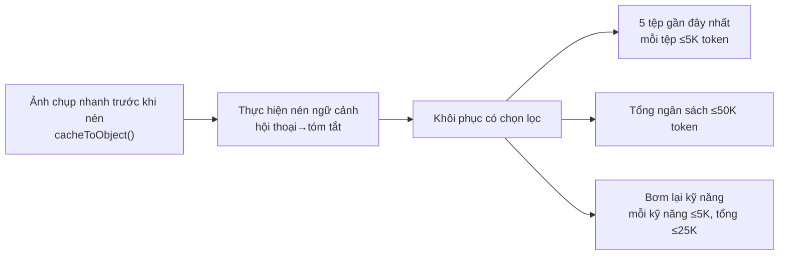
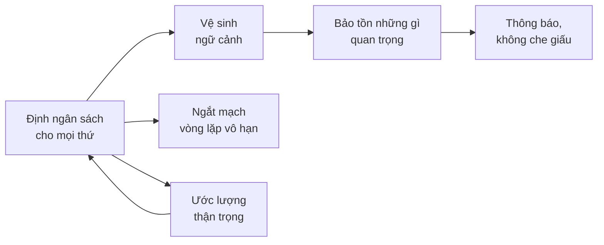

# Chương 26: Quản lý ngữ cảnh như một năng lực cốt lõi (Context Management as a Core Competency)

## Tại sao điều này quan trọng

Nếu bạn phải chọn một phân hệ (subsystem) đơn lẻ bị đánh giá thấp nhất trong toàn bộ mã nguồn của Claude Code, thì đó chính là quản lý ngữ cảnh (context management). Hệ thống quyền hạn rất bắt mắt, Vòng lặp Agent (Agent Loop) là cốt lõi, và kỹ thuật viết gợi ý (prompt engineering) được biết đến rộng rãi — nhưng quản lý ngữ cảnh mới là cơ sở hạ tầng then chốt quyết định liệu một AI Agent có thể "tiếp tục hoạt động hiệu quả" hay không.

Một cửa sổ ngữ cảnh (context window) 200K token nghe có vẻ hào phóng, nhưng trong các tình huống thực tế, nó bị tiêu thụ nhanh hơn bạn nghĩ: các gợi ý hệ thống chiếm khoảng 15-20K, mỗi kết quả gọi công cụ chiếm từ 5-50K, và sau vài vòng đọc tệp cũng như tìm kiếm mã nguồn, bạn đã sử dụng hết một nửa. Nghiêm trọng hơn, cửa sổ ngữ cảnh không chỉ là vấn đề về "dung lượng" — đó là vấn đề về "mật độ thông tin". Khi cửa sổ chứa đầy các kết quả công cụ cũ kỹ, nội dung tệp dư thừa và các cuộc thảo luận đã được giải quyết, sự chú ý của mô hình sẽ bị phân tán và chất lượng phản hồi sẽ giảm xuống.

Hệ thống quản lý ngữ cảnh được phân tích trong Phần ba (Chương 9-12) tiết lộ 6 nguyên lý cốt lõi, với một chủ đề chung: **cửa sổ ngữ cảnh là một tài nguyên khan hiếm phải được quản lý cẩn thận như bộ nhớ máy tính**.

---

## Phân tích mã nguồn

### 26.1 Nguyên lý một: Định ngân sách cho mọi thứ (Budget Everything)

**Định nghĩa**: Mọi nội dung đi vào cửa sổ ngữ cảnh đều phải có giới hạn ngân sách token rõ ràng, không có ngoại lệ.

Hệ thống ngân sách của Claude Code bao gồm mọi nguồn nội dung trong cửa sổ ngữ cảnh:

| Nguồn nội dung | Giới hạn ngân sách | Vị trí mã nguồn |
| :--- | :--- | :--- |
| Kết quả công cụ đơn lẻ | 50K ký tự | `restored-src/src/constants/toolLimits.ts:13` |
| Tất cả kết quả công cụ trong một tin nhắn | 200K ký tự | `restored-src/src/constants/toolLimits.ts:49` |
| Đọc tệp (File read) | Mặc định 2000 dòng + đọc lũy tiến bằng offset/limit | Xem Chương 8 để biết chi tiết |
| Danh sách kỹ năng (Skill listing) | 1% cửa sổ ngữ cảnh | `restored-src/src/tools/SkillTool/prompt.ts:20-23` |
| Khôi phục tệp sau khi nén | Tối đa 5 tệp, 5K token mỗi tệp, tổng cộng 50K | `restored-src/src/services/compact/compact.ts:122` |
| Khôi phục kỹ năng sau khi nén | 5K token mỗi kỹ năng, tổng cộng 25K | Xem Chương 10 để biết chi tiết |
| Danh sách mô tả agent | Chuyển sang phần đính kèm để kiểm soát kích thước gợi ý chính | Xem Chương 15 để biết chi tiết |

**Bảng 26-1: Hệ thống ngân sách token của Claude Code**

Hãy chú ý đến mức độ chi tiết của thiết kế: không chỉ có "tổng ngân sách" mà còn có "ngân sách cho từng mục". Các nguồn khai báo cho cả hai:

```typescript
// restored-src/src/constants/toolLimits.ts:13
export const DEFAULT_MAX_RESULT_SIZE_CHARS = 50_000

// restored-src/src/constants/toolLimits.ts:49
export const MAX_TOOL_RESULTS_PER_MESSAGE_CHARS = 200_000
```

`MAX_TOOL_RESULTS_PER_MESSAGE_CHARS = 200_000` ngăn chặn việc N công cụ chạy song song đồng thời trả về các kết quả lớn và làm tràn ngập ngữ cảnh — ngay cả khi mỗi kết quả công cụ nằm trong giới hạn 50K, 10 công cụ chạy song song vẫn có thể tạo ra 500K ký tự. Ngân sách cho mỗi tin nhắn là một biện pháp bảo vệ chống lại sự kết hợp "hợp lệ nhưng nguy hiểm" này.

Ngân sách 1% cho danh sách kỹ năng là điều đặc biệt đáng chú ý:

```typescript
// restored-src/src/tools/SkillTool/prompt.ts:20-23
// Danh sách kỹ năng nhận 1% cửa sổ ngữ cảnh (tính theo ký tự)
export const SKILL_BUDGET_CONTEXT_PERCENT = 0.01
export const CHARS_PER_TOKEN = 4
export const DEFAULT_CHAR_BUDGET = 8_000 // Dự phòng: 1% của 200k × 4
```

Khi người dùng cài đặt ngày càng nhiều kỹ năng, danh sách kỹ năng có thể tăng trưởng không giới hạn. Giải pháp của Claude Code là một chuỗi cắt ngắn ba cấp độ: trước tiên cắt ngắn mô tả (`MAX_LISTING_DESC_CHARS = 250`), sau đó cắt ngắn các kỹ năng có độ ưu tiên thấp, và cuối cùng chỉ giữ lại tên của các kỹ năng tích hợp sẵn. Điều này đảm bảo danh sách kỹ năng không bao giờ chiếm quá 1% cửa sổ ngữ cảnh — ngay cả khi người dùng đã cài đặt 1.000 kỹ năng.

**Phản khuôn mẫu: Bơm nội dung không giới hạn (Unbounded content injection)**. Bơm kết quả công cụ, nội dung tệp hoặc thông tin cấu hình vào cửa sổ ngữ cảnh mà không có giới hạn, cuối cùng làm đầy ngữ cảnh bằng nội dung có mật độ thông tin thấp.

---

### 26.2 Nguyên lý hai: Vệ sinh ngữ cảnh (Context Hygiene)

**Định nghĩa**: Quản lý ngữ cảnh không chỉ là nén nội dung đã có trong cửa sổ, mà là chủ động lọc bỏ những thông tin chi phí cao không liên quan đến mục tiêu của agent hiện tại trước khi bơm vào ngữ cảnh.

Claude Code thực hiện nguyên lý này một cách triệt để trong hệ thống phụ của các sub-agent. Các agent chỉ đọc như `Explore` (Khám phá) / `Plan` (Lập kế hoạch) không kế thừa toàn bộ mặt phẳng điều khiển của agent chính: `runAgent()` chủ động loại bỏ các chỉ thị phân cấp của `CLAUDE.md` khi đáp ứng các điều kiện, và loại bỏ thêm `gitStatus` đối với `Explore` / `Plan`. Lý do không phải là thông tin này không bao giờ hữu ích, mà là vì chúng thường là **trọng tải chết (dead weight)** đối với các agent tìm kiếm chỉ đọc: các quy ước commit, quy tắc PR và ràng buộc lint chỉ cần được thông dịch bởi agent chính; trạng thái `git status` cũ có thể chiếm hàng chục KB nhưng không giúp ích gì cho việc tìm kiếm mã nguồn.

Quan trọng hơn, việc cắt giảm này xảy ra **khi tạo ngữ cảnh của sub-agent**, chứ không phải là một bản sửa lỗi nén sau khi áp lực token tăng lên. Các sub-agent tiêu chuẩn cô lập các nhiễu tìm kiếm trong cuộc hội thoại của riêng chúng, chỉ trả về kết quả cô đọng cho agent cha; `Explore` thậm chí mặc định đặt `omitClaudeMd: true`. Đây là bản chất của "vệ sinh ngữ cảnh": không để nội dung có mật độ thông tin thấp đi vào cửa sổ trước, rồi hy vọng hệ thống nén sẽ dọn dẹp sau đó.

**Phản khuôn mẫu: Kế thừa đầy đủ (Full inheritance)**. Nhét vào mọi agent trợ giúp toàn bộ gợi ý hệ thống, tệp `CLAUDE.md`, trạng thái git, các đầu ra công cụ gần đây, và sở thích của người dùng, dẫn đến việc mọi truy vấn chỉ đọc phải trả tiền một cách dư thừa cho một tiền tố đắt đỏ.

---

### 26.3 Nguyên lý ba: Bảo tồn những gì quan trọng (Preserve What Matters)

**Định nghĩa**: Việc nén ngữ cảnh (compaction) là cần thiết, nhưng sau khi nén phải khôi phục một cách có chọn lọc các ngữ cảnh quan trọng nhất.

Tự động nén (xem Chương 9 để biết chi tiết) nén toàn bộ lịch sử cuộc trò chuyện thành một bản tóm tắt, giải phóng không gian ngữ cảnh. Nhưng việc nén sẽ làm mất đi nội dung mã nguồn cụ thể, đường dẫn tệp và các tham chiếu dòng chính xác. Nếu mô hình mất hoàn toàn nội dung của các tệp đã đọc trước đó sau khi nén, nó sẽ cần đọc lại chúng, gây lãng phí các lượt gọi công cụ và thời gian chờ đợi của người dùng.

Giải pháp của Claude Code là **khôi phục sau khi nén (post-compaction restoration)** (xem Chương 10 để biết chi tiết):

```typescript
// restored-src/src/services/compact/compact.ts:122
export const POST_COMPACT_MAX_FILES_TO_RESTORE = 5
```

Luồng chiến lược khôi phục:



**Hình 26-1: Quy trình nén và khôi phục ngữ cảnh**

Chìa khóa của chiến lược khôi phục là **tính chọn lọc**: không khôi phục tất cả các tệp, mà chỉ 5 tệp gần đây nhất; không khôi phục toàn bộ nội dung tệp, mà cắt ngắn trong khoảng 5K token; tổng số lượng không vượt quá 50K. Những con số này phản ánh sự cân bằng được cân nhắc kỹ lưỡng: **khôi phục quá nhiều tương đương với việc không nén, khôi phục quá ít tương đương với việc nén quá mức**.

Thiết kế khôi phục kỹ năng cũng tinh tế không kém. Sau khi nén không cần bơm lại tên của các kỹ năng đã gửi (`sentSkillNames`), vì mô hình vẫn giữ Schema của SkillTool — nó biết hệ thống kỹ năng tồn tại, nó chỉ quên nội dung kỹ năng cụ thể. Điều này giúp tiết kiệm khoảng 4K token.

**Phản khuôn mẫu: Nén toàn bộ hoặc bảo tồn toàn bộ (Full compaction or full preservation)**. Hoặc là không khôi phục gì (mô hình buộc phải bắt đầu lại từ đầu) hoặc cố gắng giữ lại mọi thứ (hiệu quả nén bằng không).

---

### 26.4 Nguyên lý bốn: Thông báo, không che giấu (Inform, Don't Hide)

**Định nghĩa**: Khi nội dung bị cắt ngắn hoặc nén, mô hình phải được thông báo về những gì đã xảy ra, cho phép nó chủ động lấy thông tin đầy đủ.

Claude Code thực hành nguyên lý này ở nhiều cấp độ:

**Thông báo cắt ngắn kết quả công cụ**. Khi một kết quả công cụ vượt quá 50K ký tự (`DEFAULT_MAX_RESULT_SIZE_CHARS`), kết quả hoàn chỉnh sẽ được ghi vào đĩa (`restored-src/src/utils/toolResultStorage.ts`), và mô hình nhận được một tin nhắn xem trước bao gồm thông báo cắt ngắn và đường dẫn trên đĩa đến nội dung đầy đủ. Do đó, mô hình biết: (1) những gì nó nhìn thấy không phải là tất cả, (2) làm thế nào để lấy được toàn bộ thông tin.

**Thông báo vi nén bộ đệm (Cache micro-compaction)** (xem Chương 11 để biết chi tiết). Khi `cache_edits` loại bỏ các kết quả công cụ cũ, `notifyCacheDeletion()` thông báo cho mô hình rằng "một số kết quả công cụ cũ đã được dọn dẹp." Điều này ngăn mô hình tham chiếu đến nội dung không còn tồn tại.

**Phân trang đọc tệp**. FileReadTool đọc mặc định 2000 dòng, hỗ trợ phân trang thông qua các tham số offset/limit. Mô tả công cụ giải thích rõ ràng hành vi này — mô hình biết nó chỉ nhìn thấy 2000 dòng đầu tiên theo mặc định và có thể chỉ định offset khi cần nội dung phía sau.

**Khai báo rõ ràng trong tóm tắt nén**. Gợi ý nén (compaction prompt) (xem Chương 9 để biết chi tiết) yêu cầu bản tóm tắt phải bao gồm "tiến độ đang ở đâu" và "những gì vẫn cần thực hiện" — đảm bảo mô hình sau khi nén biết nó đang ở giai đoạn nào của nhiệm vụ. Khối nháp `<analysis>` trong gợi ý nén (`restored-src/src/services/compact/prompt.ts:31`) cho phép mô hình trước tiên phân tích nội dung cuộc hội thoại, sau đó tạo ra bản tóm tắt có cấu trúc — khối phân tích này sẽ bị loại bỏ trong quá trình định dạng và không chiếm không gian ngữ cảnh cuối cùng.

**Phản khuôn mẫu: Cắt ngắn âm thầm (Silent truncation)**. Cắt ngắn kết quả công cụ hoặc xóa nội dung ngữ cảnh mà mô hình không biết. Mô hình có thể đưa ra quyết định sai lầm dựa trên thông tin không đầy đủ, hoặc "bịa đặt" (hallucinate) nội dung mà nó không nhớ rõ — bởi vì nó không biết rằng thông tin của mình là không đầy đủ.

---

### 26.5 Nguyên lý năm: Ngắt mạch các vòng lặp ngoài tầm kiểm soát (Circuit-Break Runaway Loops)

**Định nghĩa**: Khi một quy trình tự động thất bại liên tiếp, phải có một cơ chế bắt buộc dừng lại, thay vì thử lại vô hạn.

Bộ ngắt mạch tự động nén (auto-compaction circuit breaker) là triển khai trực tiếp nhất. `MAX_CONSECUTIVE_AUTOCOMPACT_FAILURES = 3` (`restored-src/src/services/compact/autoCompact.ts:70`) — sau 3 lần thất bại liên tiếp, ngừng thử. Chú thích mã nguồn (xem Chương 25, Nguyên lý sáu để biết mã nguồn đầy đủ) ghi lại lý do kỹ thuật cho con số này: dữ liệu BigQuery cho thấy 1.279 phiên làm việc đã trải qua hơn 50 lần thất bại nén liên tiếp (lên tới 3.272 lần), lãng phí khoảng 250K cuộc gọi API mỗi ngày.

Nhìn rộng hơn, Claude Code triển khai các cơ chế ngắt mạch tương tự trên nhiều phân hệ:

| Phân hệ | Điều kiện ngắt mạch | Hành vi ngắt mạch | Vị trí mã nguồn |
| :--- | :--- | :--- | :--- |
| Tự động nén | 3 lần thất bại liên tiếp | Ngừng nén cho đến khi kết thúc phiên | `autoCompact.ts:70` |
| Bộ phân loại YOLO | 3 lần từ chối liên tiếp / 20 lần tổng cộng | Quay về xác nhận thủ công từ người dùng | `denialTracking.ts:12-15` |
| Phục hồi `max_output_tokens` | Tối đa 3 lần thử lại | Ngừng thử lại, chấp nhận đầu ra bị cắt ngắn | Xem Chương 3 để biết chi tiết |
| Gợi ý quá dài (Prompt too long) | Loại bỏ lượt hội thoại cũ nhất → loại bỏ 20% | Xử lý hạ cấp hạ nhiệt ngữ cảnh, không loại bỏ vô hạn | Xem Chương 9 để biết chi tiết |

**Bảng 26-2: Tóm tắt các bộ ngắt mạch của Claude Code**

Mỗi bộ ngắt mạch tuân theo cùng một mẫu hình: **thiết lập một giới hạn thử lại hợp lý, hạ cấp xuống một trạng thái an toàn nhưng bị giới hạn về mặt chức năng khi vượt quá giới hạn, thay vì gây sập ứng dụng hoặc lặp vô hạn**.

**Phản khuôn mẫu: Thử lại vô hạn (Infinite retry)**. "Nén thất bại? Thử lại. Lại thất bại? Thử lại với các tham số khác." Điều này đặc biệt nguy hiểm trong các AI Agent — mỗi lần thử lại đều tiêu tốn các lượt gọi API (tiền thật), và lý do thất bại thường mang tính hệ thống (ngữ cảnh quá lớn để nén trong ngân sách token của tóm tắt), nên việc thử lại sẽ không thay đổi được kết quả.

---

### 26.6 Nguyên lý sáu: Ước lượng thận trọng (Estimate Conservatively)

**Định nghĩa**: Trong việc đếm token và phân bổ ngân sách, tốt hơn là nên ước lượng quá cao mức tiêu thụ thay vì ước lượng quá thấp — ước lượng thấp dẫn đến tràn bộ đệm, ước lượng cao chỉ lãng phí một chút không gian.

Ước lượng token của Claude Code chọn hướng thận trọng trong mọi tình huống (xem Chương 12 để biết chi tiết):

| Loại nội dung | Chiến lược ước lượng | Mức độ thận trọng | Lý do |
| :--- | :--- | :--- | :--- |
| Văn bản thuần túy | 4 byte/token | Vừa phải | Tiếng Anh thực tế khoảng ~3.5-4.5 byte/token |
| Nội dung JSON | 2 byte/token | Rất thận trọng | Các ký tự cấu trúc phân tách token kém hiệu quả |
| Hình ảnh/Tài liệu | Cố định 2000 token | Rất thận trọng | Công thức thực tế là chiều rộng×chiều cao/750, nhưng giá trị cố định được dùng khi thiếu metadata |
| Token bộ đệm | Từ phản hồi sử dụng API | Chính xác (khi có sẵn) | Chỉ số lượng do API trả về mới có thẩm quyền |

**Bảng 26-3: So sánh chiến lược ước lượng token**

Ước lượng JSON ở mức 2 byte/token là một lựa chọn thiết kế đặc biệt có ý nghĩa. Các ký tự cấu trúc JSON (`{}`, `[]`, `""`, `:`, `,`) phân tách token kém hiệu quả hơn nhiều so với ngôn ngữ tự nhiên — 100 byte JSON có thể tiêu tốn 40-50 token, trong khi 100 byte tiếng Anh chỉ cần 25-30 token. Nếu bạn sử dụng ước lượng chung 4 byte/token, các kết quả công cụ dày đặc JSON sẽ bị ước lượng thấp nghiêm trọng, có khả năng gây tràn ngữ cảnh.

Ngân sách danh sách kỹ năng cũng phản ánh điều này (`restored-src/src/tools/SkillTool/prompt.ts:22`): `CHARS_PER_TOKEN = 4` được sử dụng để chuyển đổi ngân sách token thành ngân sách ký tự — sử dụng tỷ lệ ký tự/token thận trọng nhất để đảm bảo không chi tiêu quá mức.

Lợi ích của việc ước lượng thận trọng vượt trội hơn nhiều so với chi phí. Trường hợp xấu nhất của việc ước lượng quá cao lượng token tiêu thụ là kích hoạt nén sớm — người dùng phải chờ thêm vài giây. Trường hợp xấu nhất của việc ước lượng thấp lượng token tiêu thụ là lỗi `prompt_too_long` — lượt gọi API thất bại, yêu cầu loại bỏ ngữ cảnh khẩn cấp, có khả năng làm mất thông tin quan trọng.

**Phản khuôn mẫu: Ảo tưởng về việc đếm chính xác (The illusion of exact counting)**. Cố gắng tính toán chính xác số lượng token ở phía client. Chỉ có bộ phân tách token phía máy chủ API mới có thể cung cấp các giá trị chính xác — mọi phép tính ở client đều là ước lượng. Vì là ước lượng, nó nên thiên về hướng an toàn.

---

## Đúc kết mẫu hình (Pattern Distillation)

### Bảng tổng hợp sáu nguyên lý

| Nguyên lý | Dấu vết mã nguồn cốt lõi | Phản khuôn mẫu |
| :--- | :--- | :--- |
| Định ngân sách cho mọi thứ | `toolLimits.ts:13,49` — 50K mỗi mục, 200K mỗi tin nhắn | Bơm nội dung không giới hạn |
| Vệ sinh ngữ cảnh | `runAgent.ts:385-404` — agent chỉ đọc loại bỏ `CLAUDE.md` và `gitStatus` | Kế thừa đầy đủ |
| Bảo tồn những gì quan trọng | `compact.ts:122` — khôi phục 5 tệp gần đây nhất | Nén toàn bộ hoặc bảo tồn toàn bộ |
| Thông báo, không che giấu | `toolResultStorage.ts` — cung cấp đường dẫn đĩa khi cắt ngắn | Cắt ngắn âm thầm |
| Ngắt mạch vòng lặp vô hạn | `autoCompact.ts:70` — dừng lại sau 3 lần thất bại liên tiếp | Thử lại vô hạn |
| Ước lượng thận trọng | `SkillTool/prompt.ts:22` — `CHARS_PER_TOKEN = 4` | Ảo tưởng về việc đếm chính xác |

**Bảng 26-4: Tóm tắt sáu nguyên lý quản lý ngữ cảnh**

### Mối quan hệ giữa các nguyên lý



**Hình 26-2: Sơ đồ mối quan hệ của sáu nguyên lý quản lý ngữ cảnh**

**Định ngân sách cho mọi thứ** là nền tảng — định nghĩa giới hạn token cho mỗi nguồn nội dung. **Vệ sinh ngữ cảnh** quyết định nội dung nào không nên đi vào cửa sổ hiện tại ngay từ đầu. **Bảo tồn những gì quan trọng** xử lý khôi phục sau khi nén, **Thông báo, không che giấu** đảm bảo mô hình biết những gì bị cắt ngắn, **Ngắt mạch các vòng lặp ngoài tầm kiểm soát** ngăn chặn các quy trình tự động vượt quá ngân sách, và **Ước lượng thận trọng** đảm bảo các ngân sách không bị phá vỡ do ước lượng thấp.

### Mẫu hình: Ngân sách token phân tầng (Tiered Token Budget)

- **Vấn đề được giải quyết**: Nhiều nguồn nội dung cạnh tranh cho không gian ngữ cảnh giới hạn
- **Cách tiếp cận cốt lõi**: Ngân sách độc lập cho từng nguồn + ngân sách tổng hợp, kết hợp xử lý chuỗi cắt ngắn khi vượt giới hạn
- **Mẫu mã nguồn**: Giới hạn mỗi mục (50K) → giới hạn tổng hợp (200K/tin nhắn) → giới hạn toàn cục (cửa sổ ngữ cảnh - dự phòng đầu ra - vùng đệm)
- **Điều kiện tiên quyết**: Khả năng ước lượng mức tiêu thụ token của nội dung trước khi bơm vào ngữ cảnh

### Mẫu hình: Vệ sinh ngữ cảnh (Context Hygiene)

- **Vấn đề được giải quyết**: Các agent phụ chỉ đọc liên tục kế thừa nội dung tiền tố không liên quan nhưng chi phí cao
- **Cách tiếp cận cốt lõi**: Loại bỏ ngữ cảnh không liên quan đến trách nhiệm hiện tại tại thời điểm tạo, và cô lập nhiễu tìm kiếm trong các cuộc trò chuyện phụ
- **Điều kiện tiên quyết**: Khả năng phân biệt ngữ cảnh nào agent hiện tại thực sự cần sử dụng

### Mẫu hình: Chu kỳ nén và khôi phục (Compaction-Restoration Cycle)

- **Vấn đề được giải quyết**: Nén ngữ cảnh làm mất thông tin quan trọng
- **Cách tiếp cận cốt lõi**: Chụp ảnh nhanh trước nén → nén → khôi phục có chọn lọc nội dung gần đây nhất/quan trọng nhất
- **Điều kiện tiên quyết**: Khả năng theo dõi nội dung nào được "sử dụng gần đây nhất"

### Mẫu hình: Bộ ngắt mạch (Circuit Breaker)

- **Vấn đề được giải quyết**: Quy trình tự động lặp vô hạn dưới các điều kiện bất thường
- **Cách tiếp cận cốt lõi**: Dừng lại sau N thất bại liên tiếp, hạ cấp xuống trạng thái an toàn
- **Điều kiện tiên quyết**: Định nghĩa rõ ràng các tiêu chí "thất bại" và hành vi sau hạ cấp

---

## Những việc bạn có thể làm

1. **Kiểm tra mức tiêu thụ ngữ cảnh của Agent**. Đo lường lượng token mà mỗi nguồn nội dung tiêu thụ trong các tình huống thực tế, và xác định nguồn tiêu thụ lớn nhất
2. **Thiết lập giới hạn kích thước cho kết quả công cụ**. Đảm bảo việc đọc tệp, truy vấn cơ sở dữ liệu và kết quả gọi API có giới hạn số lượng ký tự/dòng
3. **Thu gọn các trợ giúp chỉ đọc**. Các agent tìm kiếm và lập kế hoạch không nên kế thừa toàn bộ tệp `CLAUDE.md`, trạng thái git và đầu ra công cụ gần đây theo mặc định
4. **Triển khai khôi phục sau khi nén**. Nếu Agent của bạn sử dụng cơ chế nén ngữ cảnh, hãy thiết kế chiến lược khôi phục — để mô hình sau khi nén không cần bắt đầu lại từ số không
5. **Thông báo cho mô hình khi cắt ngắn dữ liệu**. Hãy nói với mô hình "nội dung này đã bị cắt ngắn, phiên bản đầy đủ nằm ở đây" — điều này tốt hơn nhiều so với việc cắt ngắn âm thầm và để mô hình tự phát hiện ra lỗ hổng thông tin
6. **Thêm các bộ ngắt mạch**. Thiết lập giới hạn thử lại cho bất kỳ quy trình tự động nào có khả năng lặp vô hạn. Hoạt động hạ cấp luôn tốt hơn một vòng lặp vô hạn
