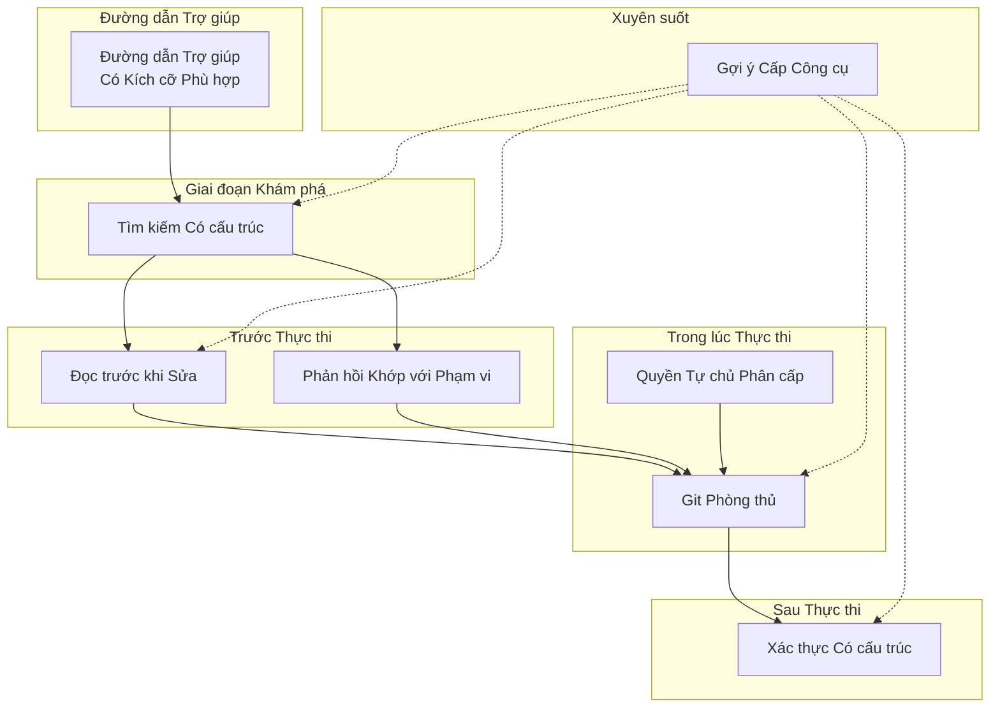

# Chương 27: Các khuôn mẫu lập trình AI cấp độ sản xuất (Production-Grade AI Coding Patterns)

## Tại sao điều này quan trọng

Hai chương trước đã đúc kết các "nguyên lý" — những chỉ dẫn cấp cao về cách tư duy trong kỹ thuật khai thác harness và quản lý ngữ cảnh. Chương này sẽ khác biệt: chúng ta tập trung vào **8 khuôn mẫu lập trình cụ thể, có thể tái sử dụng trực tiếp**. Mỗi khuôn mẫu được trích xuất từ hiện thực hóa thực tế của Claude Code, đi kèm các định nghĩa vấn đề rõ ràng, cách tiếp cận triển khai, và bằng chứng mã nguồn cụ thể.

Các khuôn mẫu này chia sẻ một đặc điểm chung: chúng trông có vẻ đơn giản đến mức tầm thường, nhưng đã được xác thực lặp đi lặp lại là cần thiết trong môi trường sản xuất. "Đọc trước khi sửa" — có ai lại đi sửa đổi mà không đọc trước? Nhưng Claude Code bắt buộc điều đó thông qua các lỗi công cụ, bởi vì các mô hình AI thực sự thường bỏ qua việc đọc và tiến hành chỉnh sửa trực tiếp. "Git phòng thủ" — dĩ nhiên là bạn không nên force push, nhưng Claude Code nhấn mạnh điều đó bằng cả đoạn gợi ý dài, vì các mô hình khi chịu áp lực thường chọn con đường ngắn nhất.

---

## Phân tích mã nguồn

### 27.1 Khuôn mẫu một: Đọc trước khi sửa (Read Before Edit)

**Vấn đề**: Các mô hình AI có thể cố gắng chỉnh sửa tệp mà không đọc nội dung hiện tại, dẫn đến việc chỉnh sửa dựa trên các giả định cũ hoặc không chính xác.

Claude Code bắt buộc điều này thông qua một **cơ chế bảo vệ kép (dual-layer safeguard)**:

1. **Lớp gợi ý (ràng buộc mềm - soft constraint)**: Mô tả của `FileEditTool` tuyên bố rõ ràng: "Bạn phải sử dụng công cụ Read ít nhất một lần trong cuộc hội thoại trước khi chỉnh sửa. Công cụ này sẽ báo lỗi nếu bạn cố gắng chỉnh sửa mà chưa đọc tệp" (xem Chương 8 để biết chi tiết)
2. **Lớp mã nguồn (ràng buộc cứng - hard constraint)**: Phương thức `call()` của `FileEditTool` kiểm tra xem cuộc hội thoại hiện tại có chứa lệnh gọi Read cho tệp mục tiêu trước khi thực thi chỉnh sửa hay không. Nếu không, nó sẽ trả về lỗi

Ý nghĩa thiết kế của cơ chế bảo vệ kép này là: các gợi ý là "ràng buộc mềm" — mô hình tuân theo hầu hết thời gian, nhưng dưới một số điều kiện nhất định (ngữ cảnh quá dài khiến chỉ thị bị "lãng quên", sự phân tán chú ý trong các cuộc hội thoại nhiều lượt), chúng có thể bị phớt lờ. Lớp mã nguồn là một "ràng buộc cứng" — ngay cả khi mô hình bỏ qua gợi ý, bản thân công cụ vẫn từ chối thực thi.

| Khía cạnh | Mô tả |
| :--- | :--- |
| **Triển khai** | Chỉ thị gợi ý (ràng buộc mềm) + kiểm tra trong mã nguồn công cụ (ràng buộc cứng) |
| **Tham chiếu nguồn** | Gợi ý của `FileEditTool` (xem Chương 8 để biết chi tiết) |
| **Tình huống áp dụng** | Bất kỳ công cụ nào cần sửa đổi nội dung hiện có |
| **Phản khuôn mẫu** | Chỉ dựa vào các chỉ thị gợi ý mà không bắt buộc ở cấp độ mã nguồn |

---

### 27.2 Khuôn mẫu hai: Quyền tự chủ phân cấp (Graduated Autonomy)

**Vấn đề**: Các AI Agent cần tìm điểm cân bằng giữa việc "hỏi người dùng ở mỗi bước" (hiệu suất thấp) và "không bao giờ hỏi" (rủi ro cao).

Claude Code thiết kế một độ dốc chế độ quyền hạn đi từ hạn chế nhất đến tự do nhất (xem Chương 16 để biết chi tiết):

```
default → acceptEdits → plan → bypassPermissions → auto → dontAsk
  │           │           │           │               │       │
  │           │           │           │               │       └── Quyền tự chủ hoàn toàn
  │           │           │           │               └── Bộ phân loại tự quyết định
  │           │           │           └── Bỏ qua kiểm tra quyền hạn
  │           │           └── Chỉ lập kế hoạch, không thực thi
  │           └── Tự động chấp nhận sửa đổi, các hoạt động khác cần xác nhận
  └── Xác nhận mọi bước
```

Thiết kế then chốt không phải là các chế độ, mà là **tự động hóa đi kèm dự phòng (automation with fallback)**. Chế độ `auto` sử dụng bộ phân loại YOLO (xem Chương 17 để biết chi tiết) để tự động đưa ra quyết định cấp quyền, nhưng có hai van an toàn. Việc triển khai theo dõi từ chối cực kỳ ngắn gọn:

```typescript
// restored-src/src/utils/permissions/denialTracking.ts:12-15
export const DENIAL_LIMITS = {
  maxConsecutive: 3,
  maxTotal: 20,
} as const

// restored-src/src/utils/permissions/denialTracking.ts:40-44
export function shouldFallbackToPrompting(
  state: DenialTrackingState
): boolean {
  return (
    state.consecutiveDenials >= DENIAL_LIMITS.maxConsecutive ||
    state.totalDenials >= DENIAL_LIMITS.maxTotal
  )
}
```

Khi bộ phân loại từ chối hoạt động 3 lần liên tiếp hoặc tổng cộng 20 lần, hệ thống sẽ chuyển hẳn sang chế độ xác nhận thủ công của người dùng. Điều này có nghĩa là ngay cả ở chế độ tự trị cao nhất, hệ thống vẫn giữ khả năng quay lại quyết định của con người. Tự chủ không phải là "được ăn cả ngã về không", mà là một phổ liên tục, với lưới an toàn ở mọi vị trí.

| Khía cạnh | Mô tả |
| :--- | :--- |
| **Triển khai** | Chế độ quyền hạn nhiều cấp + tự quyết định của bộ phân loại + dự phòng theo dõi từ chối |
| **Tham chiếu nguồn** | Các chế độ quyền hạn (Chương 16), bộ phân loại YOLO (Chương 17), `denialTracking.ts:12-44` |
| **Tình huống áp dụng** | Bất kỳ hệ thống AI Agent nào yêu cầu sự cộng tác giữa người và máy |
| **Phản khuôn mẫu** | Quyền hạn nhị phân: chỉ có "thủ công" và "tự động", không có mức trung gian hay dự phòng an toàn |

---

### 27.3 Khuôn mẫu ba: Git phòng thủ (Defensive Git)

**Vấn đề**: Các mô hình AI có thể chọn "con đường ngắn nhất" khi thực thi các thao tác Git, dẫn đến mất dữ liệu hoặc các trạng thái khó phục hồi.

Claude Code nhúng một Giao thức An toàn Git hoàn chỉnh trong gợi ý của `BashTool` (xem Chương 8 để biết chi tiết), với các quy tắc cốt lõi bao gồm:

1. **Không bao giờ bỏ qua hook** (`--no-verify`): các pre-commit hook là các chốt kiểm soát chất lượng của dự án
2. **Không bao giờ amend** (trừ khi người dùng yêu cầu rõ ràng): `git commit --amend` sửa đổi commit trước đó, và việc sử dụng nó sau khi thất bại hook sẽ ghi đè lên commit trước đó của người dùng
3. **Ưu tiên các tệp cụ thể**: `git add <tệp-cụ-thể>` thay vì `git add -A`, để tránh vô tình thêm các tệp cấu hình chứa khóa bí mật như `.env`
4. **Không bao giờ force push lên main/master**: cảnh báo ngay cả khi người dùng yêu cầu
5. **Tạo commit mới thay vì amend**: sau khi hook thất bại, commit thực chất chưa xảy ra — việc `--amend` tại thời điểm đó sẽ sửa đổi commit **trước đó**

Quy tắc 5 đặc biệt quan trọng. Khi một hook thất bại, xu hướng tự nhiên của mô hình là "sửa lỗi, sau đó amend" — nhưng gợi ý giải thích rõ ràng mối quan hệ nhân quả:

> Việc thất bại pre-commit hook có nghĩa là commit **chưa thực sự xảy ra** — vì vậy việc `--amend` sẽ sửa đổi commit **trước đó**, điều này có thể phá hủy công sức làm việc trước đó hoặc làm mất các thay đổi. Hành động đúng đắn là sửa lỗi, thêm lại vào staging, và tạo một commit **mới**.

Sự tồn tại của các quy tắc này chỉ ra rằng các mô hình thực sự thường mắc phải những sai lầm này. Dữ liệu huấn luyện chứa vô số hướng dẫn Git khuyên dùng amend để "sửa commit cuối cùng" — mà không phân biệt giữa thất bại hook và commit bình thường.

| Khía cạnh | Mô tả |
| :--- | :--- |
| **Triển khai** | Các giao thức an toàn rõ ràng trong gợi ý của công cụ, bao trùm các đường dẫn hoạt động nguy hiểm phổ biến |
| **Tham chiếu nguồn** | Giao thức An toàn Git trong gợi ý của `BashTool` (xem Chương 8 để biết chi tiết) |
| **Tình huống áp dụng** | Bất kỳ hệ thống nào cho phép AI thực hiện các thao tác Git |
| **Phản khuôn mẫu** | Dựa vào "nhận thức thông thường" của mô hình — kiến thức Git của mô hình đến từ các bài hướng dẫn không phân biệt ngữ cảnh |

---

### 27.4 Khuôn mẫu tư: Xác thực có cấu trúc (Structured Verification)

**Vấn đề**: Các mô hình AI có thể tuyên bố "các bài kiểm thử đã vượt qua" hoặc "mã nguồn đã chính xác" mà không thực sự chạy xác thực.

Claude Code thiết lập một chuỗi xác thực rõ ràng trong gợi ý hệ thống (xem Chương 6 để biết chi tiết): chạy thử nghiệm → kiểm tra đầu ra → báo cáo trung thực. Quy trình tưởng chừng đơn giản này được củng cố qua nhiều cơ chế:

**Nhận thức về khả năng đảo ngược**. Các hoạt động được xếp hạng theo rủi ro, và mô hình được yêu cầu đối xử với chúng khác nhau:

| Loại hoạt động | Ví dụ | Hành vi yêu cầu của mô hình |
| :--- | :--- | :--- |
| Có thể đảo ngược | Sửa tệp, tạo tệp, các lệnh chỉ đọc | Thực thi trực tiếp |
| Không thể đảo ngược | Xóa tệp, push ép buộc (force push), gửi tin nhắn | Xác nhận rồi thực thi |
| Rủi ro cao | `rm -rf`, DROP TABLE, kill tiến trình | Giải thích rủi ro + xác nhận |

**Ràng buộc phạm vi**. Mô hình được chỉ thị rằng "việc ủy quyền cho X không mở rộng sang Y" — việc sửa một lỗi không cấp quyền sửa đổi các trường hợp kiểm thử (test cases) hoặc bỏ qua các bài kiểm thử.

**Các chỉ thị củng cố chỉ dành cho nhân viên Anthropic (Ant-only)**. Capybara v8 đã thêm các biện pháp đối phó rõ ràng chống lại xu hướng của mô hình "tuyên bố hoàn thành mà không xác thực":

```typescript
// restored-src/src/constants/prompts.ts:211
// @[MODEL LAUNCH]: đối trọng cho tính kỹ lưỡng của capy v8
`Before reporting a task complete, verify it actually works: run the
test, execute the script, check the output. Minimum complexity means
no gold-plating, not skipping the finish line. If you can't verify
(no test exists, can't run the code), say so explicitly rather than
claiming success.`
```

Chú thích `@[MODEL LAUNCH]` chỉ ra rằng đây là một sửa đổi hành vi cụ thể theo phiên bản mô hình — khi mô hình được nâng cấp, nhóm phát triển sẽ đánh giá lại xem chỉ thị này có còn cần thiết hay không.

| Khía cạnh | Mô tả |
| :--- | :--- |
| **Triển khai** | Chuỗi xác thực (chạy→kiểm tra→báo cáo) + phân loại khả năng đảo ngược + ràng buộc phạm vi |
| **Tham chiếu nguồn** | Các chỉ thị xác thực trong gợi ý hệ thống (Chương 6), `prompts.ts:211` |
| **Tình huống áp dụng** | Bất kỳ tình huống nào yêu cầu AI sửa đổi mã nguồn và xác minh tính chính xác |
| **Phản khuôn mẫu** | Tin tưởng vào báo cáo tự thân của mô hình mà không yêu cầu hiển thị kết quả kiểm thử thực tế |

---

### 27.5 Khuôn mẫu năm: Phản hồi khớp với phạm vi (Scope-Matched Response)

**Vấn đề**: Các mô hình AI có xu hướng "vô tình" làm thêm việc — tái cấu trúc mã (refactoring) trong khi sửa lỗi, cập nhật tài liệu trong khi thêm tính năng — khiến phạm vi thay đổi vượt ra khỏi tầm kiểm soát.

Gợi ý hệ thống của Claude Code chứa một loạt các chỉ thị hạn chế phạm vi cực kỳ cụ thể (xem Chương 6 để biết chi tiết). Bộ chỉ thị quan trọng nhất đến từ `getSimpleDoingTasksSection()`:

```typescript
// restored-src/src/constants/prompts.ts:200-203
"Don't add features, refactor code, or make 'improvements' beyond what
  was asked. A bug fix doesn't need surrounding code cleaned up. A simple
  feature doesn't need extra configurability. Don't add docstrings,
  comments, or type annotations to code you didn't change."

"Don't add error handling, fallbacks, or validation for scenarios that
  can't happen. Trust internal code and framework guarantees."

"Don't create helpers, utilities, or abstractions for one-time operations.
  Don't design for hypothetical future requirements. ... Three similar
  lines of code is better than a premature abstraction."
```

Hãy chú ý đến tính cụ thể của các chỉ thị này — không phải là lời khuyên trừu tượng "hãy giữ nó đơn giản," mà là các quy tắc có thể phân định: "không thêm chú thích (docstrings) vào phần mã bạn không thay đổi," "ba dòng mã trùng lặp vẫn tốt hơn một trừu tượng hóa sớm."

Một hạn chế phạm vi tinh tế khác là "ủy quyền không được mở rộng." Một người dùng chấp thuận `git push`, và mô hình có thể diễn giải điều này là "người dùng cho phép mọi thao tác Git." Gợi ý bẻ gãy suy luận này: phạm vi của việc ủy quyền chính xác là những gì được chỉ định rõ ràng, không có gì vượt ngoài nó.

| Khía cạnh | Mô tả |
| :--- | :--- |
| **Triển khai** | Các hạn chế phạm vi rõ ràng trong gợi ý hệ thống + nguyên lý độ phức tạp tối thiểu |
| **Tham chiếu nguồn** | `prompts.ts:200-203` (bộ chỉ thị tối giản) |
| **Tình huống áp dụng** | Bất kỳ tình huống lập trình nào có sự hỗ trợ của AI |
| **Phản khuôn mẫu** | Khuyến khích sự "kỹ lưỡng" — việc bảo "vui lòng đảm bảo chất lượng mã nguồn" trao cho mô hình một phạm vi không giới hạn |

---

### 27.6 Khuôn mẫu sáu: Gợi ý cấp công cụ (Tool-Level Prompts) thay vì Chỉ thị Chung

**Vấn đề**: Quá nhiều chỉ thị trong gợi ý hệ thống chung khiến mô hình khó nhớ đúng chỉ thị vào đúng thời điểm.

Claude Code cho phép mỗi công cụ mang theo các gợi ý hành vi của riêng nó (xem Chương 8 để biết chi tiết), thay vì nhét tất cả các chỉ dẫn hành vi vào gợi ý hệ thống:

| Vị trí | Nội dung |
| :--- | :--- |
| Gợi ý hệ thống | Chỉ thị hành vi chung, định dạng đầu ra, nguyên lý bảo mật |
| Mô tả `BashTool` | Giao thức an toàn Git, cấu hình hộp cát (sandbox), chỉ dẫn nhiệm vụ nền |
| Mô tả `FileEditTool` | "Đọc trước khi sửa," chuỗi `old_string` tối thiểu và độc nhất, cách sử dụng `replace_all` |
| Mô tả `FileReadTool` | Số dòng mặc định, phân trang offset/limit, khoảng trang PDF |
| Mô tả `GrepTool` | Cú pháp ripgrep, khớp nhiều dòng, "luôn sử dụng Grep thay vì lệnh grep của shell" |
| Mô tả `AgentTool` | Chỉ dẫn phân nhánh (fork), chế độ cô lập, "không được xem lén đầu ra của nhánh phụ" |
| Mô tả `SkillTool` | Ràng buộc ngân sách, chuỗi cắt ngắn ba cấp độ, ưu tiên các kỹ năng tích hợp sẵn |

Ưu điểm của gợi ý cấp công cụ là **sự căn chỉnh thời gian (temporal alignment)**: khi mô hình quyết định gọi `BashTool`, mô tả của `BashTool` (bao gồm giao thức an toàn Git) nằm ngay trong tiêu điểm chú ý của nó. Nếu giao thức an toàn Git nằm trong gợi ý hệ thống, mô hình sẽ cần phải "nhớ lại" nó từ hàng chục nghìn token của ngữ cảnh — một điều không đáng tin cậy trong các phiên làm việc dài.

Một ưu điểm khác của gợi ý cấp công cụ là **hiệu quả bộ đệm (cache efficiency)**. Các mô tả công cụ, như một phần của tham số `tools`, chiếm một vị trí tương đối ổn định trong các yêu cầu API. Việc sửa đổi mô tả công cụ chỉ ảnh hưởng đến mã băm của danh sách công cụ, không ảnh hưởng đến phân đoạn gợi ý hệ thống — trường `perToolHashes` trong hệ thống phát hiện phá vỡ bộ đệm (`restored-src/src/services/api/promptCacheBreakDetection.ts:36-38`) tồn tại chính xác để theo dõi mô tả của công cụ nào đã thay đổi, thay vì làm mất hiệu lực toàn bộ tiền tố bộ đệm.

| Khía cạnh | Mô tả |
| :--- | :--- |
| **Triển khai** | Các chỉ thị hành vi đi kèm với mô tả công cụ, tự động đi vào sự chú ý của mô hình khi công cụ được gọi |
| **Tham chiếu nguồn** | Trường prompt của từng công cụ (xem Chương 8), `promptCacheBreakDetection.ts:36-38` |
| **Tình huống áp dụng** | Bất kỳ AI Agent nào cung cấp nhiều công cụ |
| **Phản khuôn mẫu** | Thư viện chỉ dẫn tập trung — tất cả các chỉ dẫn nằm trong gợi ý hệ thống, dẫn đến tỷ lệ tuân thủ giảm dần trong các phiên làm việc dài |

---

### 27.7 Khuôn mẫu bảy: Tìm kiếm có cấu trúc thay vì Phân tích văn bản Shell

**Vấn đề**: Nếu mô hình tiêu thụ trực tiếp đầu ra thô từ các lệnh shell như `grep`, `find`, `ls`, nó phải phân tích `đường_dẫn:dòng:văn_bản`, các đường dẫn phân tách bằng dòng mới, tóm tắt số đếm và các tiền tố nhiễu khác nhau trong mỗi lượt. Khi các lượt tìm kiếm nhân lên, việc bắt mô hình liên tục thực hiện phân tách chuỗi này sẽ lãng phí cả ngữ cảnh và ngân sách suy luận.

Thiết kế tìm kiếm của Claude Code đã phản ánh một phần hướng đi ngược lại: **tìm kiếm không phải là một ca sử dụng của Bash, mà là một công cụ chỉ đọc độc lập** (xem Chương 8 để biết chi tiết). Cả `GrepTool` và `GlobTool` đều sử dụng các triển khai chuyên biệt dưới nền thay vì các đường ống (pipelines) shell, và tạo ra kết quả có cấu trúc trong nội bộ trước, sau đó tuần tự hóa chúng thành dạng tối giản nhất có thể để mô hình tiêu thụ dưới dạng `tool_result`.

Đầu ra nội bộ của `GrepTool` bao gồm mẫu tìm kiếm, danh sách tệp, nội dung khớp, số đếm và thông tin phân trang:

```typescript
// Được đơn giản hóa từ outputSchema của GrepTool
{
  mode: 'content' | 'files_with_matches' | 'count',
  numFiles,
  filenames,
  content,
  numLines,
  numMatches,
  appliedLimit,
  appliedOffset,
}
```

Tương tự, đầu ra nội bộ của `GlobTool` là một đối tượng có cấu trúc, không phải là stdout thô của lệnh `rg --files` được đưa trực tiếp vào mô hình:

```typescript
// Được đơn giản hóa từ outputSchema của GlobTool
{
  durationMs,
  numFiles,
  filenames,
  truncated,
}
```

Nhưng điều thú vị hơn là bước tiếp theo: Claude Code **không** tuần tự hóa hoàn toàn các đối tượng JSON này về cho mô hình. Thay vào đó, nó chọn một giải pháp dung hòa: "cấu trúc hóa nội bộ, văn bản hóa bên ngoài". `GrepTool` ở chế độ `files_with_matches` chỉ trả về danh sách đường dẫn tệp, ở chế độ `count` chỉ trả về tóm tắt dạng `đường_dẫn:số_lượng`, và chỉ trả về các dòng khớp thực tế ở chế độ `content`; `GlobTool` chỉ trả về danh sách đường dẫn và một gợi ý cắt ngắn. Điều này cho thấy mục tiêu tối ưu hóa thực sự không phải là "bản thân cấu trúc," mà là **để hệ thống khai thác (harness) sở hữu cấu trúc đó trong khi mô hình chỉ nhìn thấy thông tin tối thiểu cần thiết cho quyết định hiện tại**.

Từ góc nhìn kỹ thuật harness, điều này dẫn đến một khuôn mẫu quan trọng hơn bản thân `grep`/`glob`: **giao thức tìm kiếm theo pha (phased search protocol)**. Việc tìm kiếm gốc Agent lý tưởng không nên để mô hình nuốt trọn lượng lớn dòng khớp ngay từ đầu, mà nên chia thành ba lớp:

1. **Lớp tệp ứng viên**: Trước tiên trả về các đường dẫn, ID ổn định, thời gian sửa đổi và các siêu dữ liệu nhẹ khác, trả lời câu hỏi "tệp nào đáng để xem"
2. **Lớp tóm tắt kết quả khớp**: Sau đó trả về số lượng kết quả khớp trên mỗi tệp, vị trí khớp đầu tiên và đoạn trích đầu tiên, trả lời câu hỏi "nên mở rộng tệp nào trước"
3. **Lớp mở rộng đoạn mã**: Cuối cùng chỉ trả về các đoạn mã chính xác và số dòng cho các tệp được chọn, trả lời câu hỏi "cần xem phân đoạn mã cụ thể nào"

Claude Code chưa hoàn toàn chia tách ba lớp này thành các công cụ độc lập, nhưng triển khai hiện tại đã có hai điều kiện tiên quyết quan trọng: **các công cụ tìm kiếm chuyên dụng** và **các kết quả trung gian có cấu trúc**. Bằng chứng thêm là `ToolSearchTool` đã có thể trả về `tool_reference` — một loại khối (block type) phong phú hơn, không giới hạn ở văn bản thuần túy. Điều này chỉ ra rằng trong các hệ thống khai thác như Claude Code, việc "mô hình phân tích trực tiếp văn bản shell" không phải là lựa chọn duy nhất, và thậm chí có thể không phải là lựa chọn tốt nhất.

| Khía cạnh | Mô tả |
| :--- | :--- |
| **Triển khai** | Các công cụ Grep/Glob chuyên dụng + kết quả trung gian có cấu trúc + trả về tối giản dưới dạng văn bản |
| **Tham chiếu nguồn** | `outputSchema` của `GrepTool.ts` / `GlobTool.ts` và hàm `mapToolResultToToolResultBlockParam()`; kết quả trả về `tool_reference` của `ToolSearchTool.ts` |
| **Tình huống áp dụng** | Khám phá mã nguồn lớn, tìm kiếm nhiều vòng, điều tra của sub-agent, các hệ thống yêu cầu kiểm soát nghiêm ngặt chi phí ngữ cảnh |
| **Phản khuôn mẫu** | Hạ cấp việc tìm kiếm xuống các đường ống văn bản shell như `grep/find/cat`, bắt mô hình phải phân tích lại các chuỗi trong mỗi vòng |

---

### 27.8 Khuôn mẫu tám: Các đường dẫn trợ giúp có kích cỡ phù hợp (Right-Sized Helper Paths)

**Vấn đề**: Nếu tất cả các truy vấn đều tuân theo mô hình nặng nề của vòng lặp chính (mô hình lớn, tập hợp công cụ đầy đủ, và vòng lặp agent nhiều lượt), các đường dẫn trợ giúp gọn nhẹ sẽ trở nên đắt đỏ, chậm chạp, và thường được cấp bề mặt năng lực nhiều hơn mức nhiệm vụ yêu cầu.

Cách tiếp cận của Claude Code không phải là "chuyển đổi toàn cục sang một mô hình nhỏ" một cách thô bạo, mà là giảm thiểu **chiều hướng đắt đỏ nhất** cho mỗi điểm gọi. Việc tạo tiêu đề phiên làm việc và tóm tắt việc sử dụng công cụ đều đi qua `queryHaiku()`; `claude.ts` cũng phân loại `compact` (nén), `side_question` (câu hỏi phụ), `extract_memories` (trích xuất bộ nhớ), v.v. thành `non-agentic queries` (truy vấn phi agent). Trong khi đó, `/btw` không khởi chạy một Agent mới với mô hình nhỏ, mà kế thừa ngữ cảnh phiên cha, bắt đầu một truy vấn phụ một lượt thông qua `runForkedAgent()`, và giảm năng lực công cụ xuống 0 và số lượt chạy xuống 1.

Điều này cho thấy khuôn mẫu thực tế của Claude Code không đơn thuần là "lựa chọn mô hình cục bộ," mà là sự **tương thích quy mô năng lực (capability right-sizing)** tổng quát hơn: đôi khi thu nhỏ mô hình, đôi khi thu nhỏ công cụ, đôi khi thu nhỏ lượt chạy, đôi khi thu nhỏ ngữ cảnh. Các sub-agent tiêu chuẩn, phân nhánh (fork), `/btw`, và trợ giúp tạo tiêu đề/tóm tắt đều được cắt giảm theo các chiều hướng khác nhau.

| Đường dẫn | Ngữ cảnh | Công cụ | Lượt chạy | Mô hình |
| :--- | :--- | :--- | :--- | :--- |
| Vòng lặp chính | Hội thoại chính đầy đủ | Tập hợp công cụ đầy đủ | Nhiều lượt | Mô hình chính |
| Sub-Agent tiêu chuẩn | Ngữ cảnh mới | Lắp ráp theo vai trò | Nhiều lượt | Có thể ghi đè |
| `/btw` | Kế thừa ngữ cảnh cha | Tất cả bị vô hiệu hóa | Một lượt | Kế thừa mô hình cha |
| Trợ giúp tiêu đề/tóm tắt | Đầu vào tối thiểu | Không có công cụ | Một lượt | Haiku |

Bài học giá trị nhất ở đây là: **đừng biến mọi đường dẫn trợ giúp thành hình thái "Agent đầy đủ tính năng" giống nhau**. Các Câu hỏi phụ (Side Questions) nhẹ nhàng vì chúng chỉ giữ lại năng lực cần thiết để "trả lời câu hỏi hiện tại"; việc tạo tiêu đề rẻ tiền vì nó chỉ giữ lại sức mạnh mô hình cần thiết để "tạo ra một chuỗi ngắn." Claude Code coi "kích thước mô hình, quyền công cụ, ngân sách lượt chạy, kế thừa ngữ cảnh" như bốn núm xoay có thể điều chỉnh độc lập, không phải là một cấu hình thống nhất toàn cục.

| Khía cạnh | Mô tả |
| :--- | :--- |
| **Triển khai** | Giảm thiểu độc lập mô hình/công cụ/lượt chạy/ngữ cảnh cho từng điểm gọi |
| **Tham chiếu nguồn** | `sessionTitle.ts`, `toolUseSummaryGenerator.ts`, `claude.ts`, `sideQuestion.ts` |
| **Tình huống áp dụng** | Tạo tiêu đề, tóm tắt, câu hỏi phụ nhanh, trích xuất bộ nhớ, điều tra chỉ đọc, và các đường dẫn trợ giúp khác |
| **Phản khuôn mẫu** | Tất cả các truy vấn trợ giúp đều sử dụng mô hình chính, tập hợp công cụ đầy đủ và vòng lặp nhiều lượt |

---

## Đúc kết mẫu hình (Pattern Distillation)

### Bảng tổng hợp tám khuôn mẫu

| Khuôn mẫu | Triển khai | Tham chiếu nguồn |
| :--- | :--- | :--- |
| Đọc trước khi sửa | Gợi ý (mềm) + kiểm tra mã công cụ (cứng) | `FileEditTool` (Chương 8) |
| Quyền tự chủ phân cấp | Quyền hạn nhiều cấp + bộ phân loại + dự phòng theo dõi từ chối | `denialTracking.ts:12-44` |
| Git phòng thủ | Giao thức an toàn hoàn chỉnh trong gợi ý công cụ | Gợi ý của `BashTool` (Chương 8) |
| Xác thực có cấu trúc | Chạy→kiểm tra→báo cáo + phân cấp khả năng đảo ngược | `prompts.ts:211` |
| Phản hồi khớp phạm vi | Các chỉ thị hạn chế phạm vi cụ thể, có thể phân định | `prompts.ts:200-203` |
| Gợi ý cấp công cụ | Các chỉ thị hành vi đi kèm với các công cụ tương ứng | Gợi ý của mỗi công cụ + `perToolHashes` |
| Tìm kiếm có cấu trúc | Công cụ tìm kiếm chuyên dụng + kết quả trung gian có cấu trúc + mở rộng theo pha | `GrepTool.ts`, `GlobTool.ts`, `ToolSearchTool.ts` |
| Trợ giúp có kích cỡ phù hợp | Giảm mô hình/công cụ/lượt chạy/ngữ cảnh cho từng điểm gọi | `sessionTitle.ts`, `toolUseSummaryGenerator.ts`, `sideQuestion.ts` |

**Bảng 27-1: Tóm tắt tám khuôn mẫu cấp độ sản xuất**

### Vị trí của các khuôn mẫu trong vòng đời thực thi công cụ



**Hình 27-1: Vị trí của tám khuôn mẫu trong vòng đời thực thi công cụ**

**Đường dẫn Trợ giúp Có Kích cỡ Phù hợp** hoạt động trên các đường dẫn phụ — quyết định xem một truy vấn trợ giúp có thực sự cần mô hình nặng, đầy đủ công cụ và trạng thái nhiều lượt hay không. **Tìm kiếm Có cấu trúc** nằm ở giai đoạn khám phá sớm nhất — quyết định kết quả tìm kiếm nào mô hình nhìn thấy, và ở mức độ chi tiết nào các kết quả này đi vào ngữ cảnh. **Gợi ý Cấp Công cụ** bao trùm toàn bộ vòng đời — bảy khuôn mẫu còn lại đều được hiện thực hóa thông qua gợi ý công cụ. **Đọc trước khi Sửa** và **Phản hồi Khớp với Phạm vi** ràng buộc quá trình chuẩn bị trước thực thi. **Git Phòng thủ** và **Quyền Tự chủ Phân cấp** kiểm soát các ranh giới an toàn trong khi thực thi. **Xác thực Có cấu trúc** đảm bảo tính chính xác sau thực thi.

### Khuôn mẫu chung: Ràng buộc kép (Dual-Layer Constraint)

- **Vấn đề được giải quyết**: Bản thân gợi ý không thể đảm bảo 100% việc tuân thủ quy tắc của mô hình
- **Cách tiếp cận cốt lõi**: Đối với các hành vi rủi ro cao, sử dụng gợi ý làm "ràng buộc mềm" và mã nguồn làm "ràng buộc cứng"
- **Mẫu mã nguồn**: Mô tả công cụ nêu rõ quy tắc → phương thức `call()` kiểm tra điều kiện tiên quyết → trả về lỗi khi không thỏa mãn
- **Điều kiện tiên quyết**: Khả năng phát hiện các điều kiện tiên quyết ở lớp mã nguồn

### Khuôn mẫu chung: Độ dốc an toàn (Safety Gradient)

- **Vấn đề được giải quyết**: Các nhiệm vụ khác nhau yêu cầu mức độ tự chủ khác nhau
- **Cách tiếp cận cốt lõi**: Chế độ nhiều cấp độ, mỗi cấp độ đi kèm với một lưới an toàn rõ ràng
- **Điều kiện tiên quyết**: Khả năng đánh giá mức độ rủi ro của các hoạt động

### Khuôn mẫu chung: Giao thức tìm kiếm theo pha (Phased Search Protocol)

- **Vấn đề được giải quyết**: Việc tìm kiếm mã nguồn mở rộng nhanh chóng tiêu tốn ngữ cảnh và buộc mô hình phải liên tục phân tích kết quả văn bản thô
- **Cách tiếp cận cốt lõi**: Trước tiên trả về các tệp ứng viên, tiếp theo là tóm tắt kết quả khớp, sau đó mở rộng đoạn mã chính xác theo yêu cầu
- **Điều kiện tiên quyết**: Các công cụ tìm kiếm có thể trả về phân trang, số đếm và các tham chiếu ổn định, không chỉ là stdout thô

### Khuôn mẫu chung: Tương thích quy mô năng lực (Capability Right-sizing)

- **Vấn đề được giải quyết**: Các truy vấn trợ giúp mặc định kế thừa toàn bộ khả năng của luồng chính, làm cho chi phí và rủi ro cao hơn mức cần thiết
- **Cách tiếp cận cốt lõi**: Giảm độc lập mô hình, công cụ, lượt chạy hoặc ngữ cảnh cho từng điểm gọi, thay vì chỉ cung cấp một "agent đầy đủ tính năng" duy nhất
- **Điều kiện tiên quyết**: Môi trường thời gian chạy có thể độc lập kiểm soát định tuyến mô hình, quyền công cụ và ngân sách lượt chạy

---

## Những việc bạn có thể làm

1. **Triển khai ràng buộc kép cho các hành vi quan trọng**. Nếu việc vi phạm một hành vi gây ra hậu quả không thể đảo ngược, đừng chỉ dựa vào gợi ý — hãy thêm kiểm tra điều kiện tiên quyết trong mã nguồn của công cụ
2. **Thiết kế các độ dốc quyền hạn, không dùng nút bật tắt nhị phân**. Cung cấp ít nhất 3 mức tự chủ cho Agent: xác nhận thủ công, bộ phân loại tự quyết định (có dự phòng), và tự chủ hoàn toàn
3. **Giải thích rõ ràng mối quan hệ nhân quả trong gợi ý hoạt động Git**. "Đừng amend" là chưa đủ — hãy giải thích rõ "việc amend sau khi hook thất bại sẽ sửa đổi commit trước đó, gây mất mát các thay đổi"
4. **Yêu cầu mô hình hiển thị kết quả xác thực**. Không chấp nhận một báo cáo dạng văn bản là "các bài kiểm thử đã vượt qua" — yêu cầu hiển thị đầu ra kiểm thử thực tế
5. **Thay thế các chỉ dẫn mơ hồ bằng quy tắc cụ thể**. Thay thế "duy trì chất lượng mã nguồn" bằng "không thêm bình luận vào phần mã không sửa đổi," "ba dòng lặp lại vẫn tốt hơn một trừu tượng hóa sớm"
6. **Đính kèm các chỉ thị hành vi vào công cụ tương ứng**. Quy tắc an toàn Git nằm ở mô tả công cụ Bash, quy tắc thao tác tệp nằm ở mô tả công cụ tệp — đừng dồn mọi thứ vào gợi ý hệ thống
7. **Không bắt mô hình phân tích liên tục văn bản tìm kiếm của shell**. Chia việc tìm kiếm thành ba bước "tệp ứng viên → tóm tắt kết quả khớp → đoạn mã chính xác", điều này giúp tiết kiệm ngữ cảnh hơn việc trả về đầu ra `grep` lớn ngay từ đầu
8. **Đừng cung cấp toàn bộ năng lực cho mọi tác vụ trợ giúp**. Các đường dẫn tạo tiêu đề, tóm tắt, câu hỏi phụ và trích xuất bộ nhớ nên được cắt giảm riêng biệt về mô hình, công cụ hoặc lượt chạy, thay vì sao chép nguyên xi Vòng lặp chính
