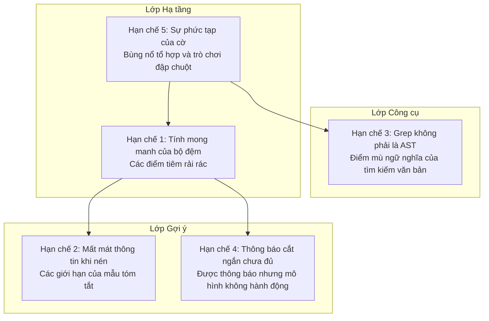
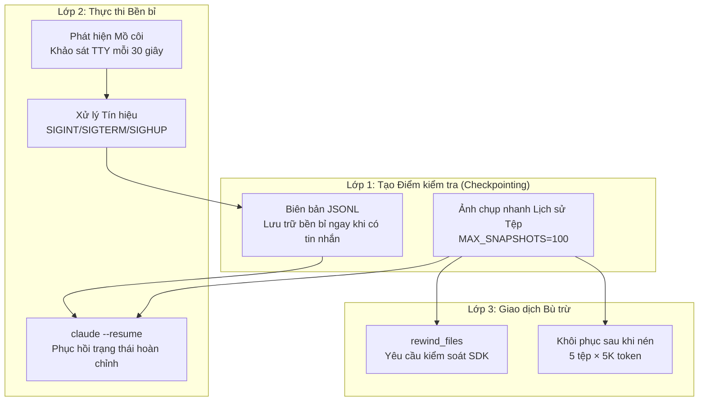

# Chương 28: Những điểm hạn chế của Claude Code (Và những gì bạn có thể cải thiện)

## Tại sao điều này quan trọng

Ba chương trước đã đúc kết những thiết kế xuất sắc của Claude Code — các nguyên lý kỹ thuật harness, chiến lược quản lý ngữ cảnh, và các khuôn mẫu lập trình cấp độ sản xuất. Tuy nhiên, một phân tích kỹ thuật nghiêm túc không thể chỉ thảo luận về "những gì nó đã làm tốt" — nó cũng phải xem xét một cách khách quan "những gì nó còn hạn chế."

Chương này liệt kê 5 điểm hạn chế trong thiết kế có thể quan sát được từ mã nguồn. Mỗi điểm hạn chế bao gồm ba phần: **mô tả vấn đề** (nó là gì), **minh chứng từ mã nguồn** (tại sao nó là vấn đề), và **đề xuất cải tiến** (có thể làm gì).

Cần phải nhấn mạnh: những phân tích này hoàn toàn ở cấp độ thiết kế kỹ thuật và không liên quan đến việc đánh giá năng lực của nhóm phát triển Anthropic. Mỗi "hạn chế" là một lựa chọn hợp lý trong những sự đánh đổi kỹ thuật (trade-offs) cụ thể — những lựa chọn này đơn giản là đi kèm với những chi phí có thể quan sát được.

---

## Phân tích mã nguồn

### 28.1 Hạn chế một: Tính mong manh của bộ đệm — Các điểm tiêm rải rác tạo ra rủi ro phá vỡ bộ đệm (Cache Break)

#### Mô tả vấn đề

Hệ thống lưu đệm gợi ý (prompt caching) của Claude Code dựa trên một giả định cốt lõi: **nội dung trước `SYSTEM_PROMPT_DYNAMIC_BOUNDARY` không thay đổi trong suốt phiên làm việc**. Tuy nhiên, nhiều điểm tiêm rải rác có thể sửa đổi vùng này:

- Các phân đoạn có điều kiện trong `systemPromptSections.ts`: được đưa vào hoặc loại bỏ dựa trên các Cờ tính năng (Feature Flags) hoặc trạng thái thời gian chạy
- Sự kiện kết nối/ngắt kết nối MCP: hàm `DANGEROUS_uncachedSystemPromptSection()` đánh dấu rõ ràng "sẽ phá vỡ bộ đệm"
- Thay đổi danh sách công cụ: các máy chủ MCP khởi động/tắt đi khiến mã băm của tham số `tools` thay đổi
- Chuyển đổi cờ GrowthBook: các thay đổi cấu hình từ xa khiến cấu trúc schema của công cụ sau tuần tự hóa thay đổi

#### Minh chứng từ mã nguồn

Việc hệ thống phát hiện phá vỡ bộ đệm cần theo dõi tới gần 20 trường (`restored-src/src/services/api/promptCacheBreakDetection.ts:28-69`) là minh chứng trực tiếp — nếu bộ đệm hoạt động ổn định, chúng ta sẽ không cần một hệ thống phát hiện phức tạp như vậy chỉ để giải thích "tại sao nó bị phá vỡ."

Bản thân việc đặt tên hàm `DANGEROUS_uncachedSystemPromptSection()` là một dấu hiệu cảnh báo — tiền tố `DANGEROUS` (nguy hiểm) trong tên hàm cho thấy nhóm phát triển nhận thức rất rõ rằng nó sẽ phá vỡ bộ đệm, nhưng trong một số tình huống nhất định (như thay đổi trạng thái MCP) thì không có giải pháp thay thế nào tốt hơn.

Danh sách agent từng được chèn trực tiếp vào gợi ý hệ thống, chiếm tới 10.2% lượng token `cache_creation` toàn cầu (xem Chương 15 để biết chi tiết). Mặc dù sau đó nó được chuyển sang phần đính kèm, điều này cho thấy ngay cả những nhóm phát triển giàu kinh nghiệm cũng có thể vô tình đặt các nội dung không ổn định vào phân đoạn bộ đệm.

Ba nhánh mã trong `splitSysPromptPrefix()` (`restored-src/src/utils/api.ts:321-435`) — dựa trên công cụ MCP, toàn cục + ranh giới, và cấp tổ chức mặc định — có sự phức tạp hoàn toàn bắt nguồn từ việc xử lý "các thay đổi khác nhau có thể xảy ra trong phân đoạn bộ đệm." Các chú thích trong mã nguồn đánh dấu rõ ràng các tham chiếu chéo:

```typescript
// restored-src/src/constants/prompts.ts:110-112
// WARNING: Do not remove or reorder this marker without updating
// cache logic in:
// - src/utils/api.ts (splitSysPromptPrefix)
// - src/services/api/claude.ts (buildSystemPromptBlocks)
```

Kiểu chú thích `WARNING` chéo tệp này là tín hiệu của sự mỏng manh trong kiến trúc — các thành phần được liên kết với nhau thông qua các quy ước ngầm thay vì các giao diện rõ ràng.

#### Đề xuất cải tiến

**Tập trung hóa việc xây dựng gợi ý (Centralize prompt construction)**. Chuyển đổi các điểm tiêm rải rác thành một cấu trúc tập trung:

1. **Giai đoạn xây dựng**: Tất cả các phần được lắp ráp trong một hàm trung tâm, và một mã băm tổng thể được tính toán sau khi lắp ráp
2. **Ràng buộc tính bất biến**: Bắt buộc kiểm tra tính bất biến ở thời điểm biên dịch hoặc thời điểm chạy đối với nội dung phân đoạn bộ đệm — bất kỳ nội dung nào thay đổi trong phiên làm việc đều bị buộc phải nằm ngoài phân đoạn bộ đệm
3. **Kiểm tra thay đổi**: Tự động phát hiện trước khi commit "liệu nội dung không ổn định đã được thêm vào trong phân đoạn bộ đệm hay chưa"

---

### 28.2 Hạn chế hai: Mất mát thông tin khi nén — Mẫu tóm tắt 9 phần không thể bảo tồn mọi chuỗi suy luận

#### Mô tả vấn đề

Tự động nén (xem Chương 9 để biết chi tiết) sử dụng một mẫu gợi ý có cấu trúc yêu cầu mô hình tạo ra một bản tóm tắt cuộc hội thoại. Gợi ý nén (`restored-src/src/services/compact/prompt.ts`) yêu cầu khối `<analysis>` phải bao gồm:

```typescript
// restored-src/src/services/compact/prompt.ts:31-44
"1. Chronologically analyze each message and section of the conversation.
    For each section thoroughly identify:
    - The user's explicit requests and intents
    - Your approach to addressing the user's requests
    - Key decisions, technical concepts and code patterns
    - Specific details like:
      - file names
      - full code snippets
      - function signatures
      ..."
```

Đây là một danh sách kiểm tra được thiết kế cẩn thận, nhưng nó có một giới hạn căn bản: **các chuỗi suy luận và những nỗ lực thất bại của mô hình sẽ bị mất đi sau khi nén**.

Các loại thông tin cụ thể bị mất:

- **Các phương án thất bại**: Mô hình đã thử phương án A nhưng thất bại, sau đó sử dụng phương án B thành công — sau khi nén chỉ giữ lại "đã dùng phương án B để giải quyết vấn đề," trong khi kinh nghiệm thất bại của phương án A bị mất đi
- **Bối cảnh quyết định**: Lý do tại sao phương án B được chọn thay vì phương án A bị đơn giản hóa thành một kết luận
- **Tham chiếu chính xác**: Các đường dẫn tệp và số dòng cụ thể có thể bị khái quát hóa trong bản tóm tắt — ví dụ: "đã sửa đổi mô-đun xác thực" thay vì "đã sửa đổi `auth/middleware.ts:42-67`"

#### Minh chứng từ mã nguồn

Ngân sách token dành cho tóm tắt nén là `MAX_OUTPUT_TOKENS_FOR_SUMMARY = 20_000` (`restored-src/src/services/compact/autoCompact.ts:30`). Tỷ lệ nén có thể đạt mức 7:1 hoặc cao hơn — với tỷ lệ nén như vậy, việc mất mát thông tin là không thể tránh khỏi.

Cơ chế khôi phục tệp sau khi nén (`POST_COMPACT_MAX_FILES_TO_RESTORE = 5`, `restored-src/src/services/compact/compact.ts:122`) giảm thiểu một phần vấn đề, nhưng nó chỉ khôi phục nội dung tệp, không khôi phục được chuỗi suy luận.

Sự tồn tại của `NO_TOOLS_PREAMBLE` (`restored-src/src/services/compact/prompt.ts:19-25`) gợi ý về một vấn đề chất lượng nén khác: mô hình đôi khi cố gắng gọi các công cụ thay vì tạo văn bản tóm tắt trong quá trình nén (tỷ lệ xảy ra 2.79% trên Sonnet 4.6), yêu cầu phải có lệnh cấm rõ ràng. Điều này có nghĩa là nhiệm vụ nén tự thân nó không phải là điều tầm thường đối với mô hình.

#### Đề xuất cải tiến

**Trích xuất thông tin có cấu trúc + nén phân tầng**:

1. **Trích xuất có cấu trúc**: Sử dụng một bước chuyên dụng trước khi nén để trích xuất thông tin có cấu trúc — danh sách sửa đổi tệp, danh sách phương án thất bại, biểu đồ quyết định — được lưu trữ dưới dạng JSON thay vì các bản tóm tắt bằng ngôn ngữ tự nhiên
2. **Nén phân tầng**: Chia cuộc hội thoại thành "lớp dữ kiện" (sửa đổi tệp, đầu ra lệnh) và "lớp suy luận" (lý do tại sao làm như vậy). Lớp dữ kiện sử dụng nén trích xuất (extractive compression - trích xuất trực tiếp), lớp suy luận sử dụng nén khái quát (abstractive compression - phương pháp hiện tại)
3. **Bộ nhớ thất bại**: Lưu giữ riêng biệt một danh sách "các phương án đã thử nhưng thất bại", ngăn mô hình sau khi nén lặp lại các sai lầm cũ

---

### 28.3 Hạn chế ba: Grep không phải là AST — Tìm kiếm văn bản bỏ lỡ các mối quan hệ ngữ nghĩa

#### Mô tả vấn đề

Việc tìm kiếm mã nguồn của Claude Code hoàn toàn dựa trên `GrepTool` (khớp biểu thức chính quy văn bản) và `GlobTool` (khớp mẫu tên tệp). Điều này hoạt động tốt trong hầu hết các tình huống, nhưng không thể bao quát các **mối quan hệ mã nguồn ở cấp độ ngữ nghĩa**:

- **Nạp động (Dynamic imports)**: `require(variableName)` — biến này là một giá trị thời gian chạy, và tìm kiếm văn bản không thể theo vết được nó
- **Tái xuất khẩu (Re-exports)**: `export { default as Foo } from './bar'` — không được theo dõi chính xác khi tìm kiếm định nghĩa của `Foo`
- **Tham chiếu chuỗi (String references)**: Tên các công cụ được đăng ký dưới dạng chuỗi (`name: 'Bash'`) — việc tìm kiếm các điểm sử dụng công cụ yêu cầu tìm kiếm cả chuỗi và tên biến
- **Suy luận kiểu (Type inference)**: Suy luận kiểu của TypeScript có nghĩa là nhiều biến thiếu các chú thích kiểu rõ ràng — việc tìm kiếm vị trí sử dụng của một kiểu cụ thể sẽ không đầy đủ

#### Minh chứng từ mã nguồn

Danh sách công cụ của chính Claude Code chứa hơn 40 công cụ (xem Chương 2 để biết chi tiết), nhưng không có công cụ truy vấn AST nào. Gợi ý hệ thống hướng dẫn rõ ràng mô hình sử dụng Grep thay vì lệnh grep của Bash (xem Chương 8 để biết chi tiết) — nhưng điều này chỉ chuyển việc tìm kiếm văn bản từ công cụ này sang công cụ khác, không nâng cao cấp độ ngữ nghĩa của việc tìm kiếm.

Trong chính cơ sở mã của Claude Code (1.902 tệp TypeScript), tác động của những thiếu sót này có thể quan sát được. Ví dụ: Các Cờ tính năng được sử dụng thông qua các lệnh gọi `feature('KAIROS')` — việc tìm kiếm chuỗi `KAIROS` có thể tìm thấy các điểm sử dụng, nhưng việc tìm kiếm các lệnh gọi đến hàm `feature` sẽ trả về kết quả cho tất cả 89 cờ với độ nhiễu cực kỳ lớn. Nếu không có các truy vấn AST, không có cách nào để diễn đạt yêu cầu: "tìm các vị trí mà hàm `feature()` được gọi với giá trị tham số là `KAIROS`."

#### Đề xuất cải tiến

**Bổ sung tích hợp LSP (Language Server Protocol)**:

1. **Tra cứu kiểu**: Truy vấn kiểu được suy luận của một biến thông qua TypeScript Language Server
2. **Đi đến định nghĩa (Go to definition)**: Xử lý chuỗi tái xuất khẩu, bí danh kiểu (type aliases) và nạp động hoàn chỉnh
3. **Tìm các tham chiếu (Find references)**: Tìm tất cả các vị trí sử dụng của một ký hiệu, bao gồm cả việc sử dụng gián tiếp thông qua suy luận kiểu
4. **Phân cấp cuộc gọi (Call hierarchy)**: Truy vấn các hàm gọi và được gọi của một hàm, xây dựng biểu đồ cuộc gọi

Cơ sở hạ tầng cho việc tích hợp LSP đã có những dấu hiệu trong mã nguồn — một số nhánh mã thử nghiệm liên quan đến LSP có thể được quan sát thấy trong phân tích Cờ tính năng (xem Chương 23 để biết chi tiết), nhưng chúng chưa được bật rộng rãi. Sự kết hợp giữa Grep + LSP sẽ mạnh mẽ hơn nhiều so với việc chỉ dùng đơn lẻ Grep hoặc LSP: Grep xử lý tìm kiếm toàn văn và khớp mẫu nhanh chóng, LSP xử lý các truy vấn ngữ nghĩa chính xác.

---

### 28.4 Hạn chế tư: Thông báo cắt ngắn không đồng nghĩa với hành động tương ứng — Các kết quả lớn được ghi vào đĩa nhưng mô hình có thể không đọc lại

#### Mô tả vấn đề

Khi kết quả của một công cụ vượt quá 50K ký tự (`DEFAULT_MAX_RESULT_SIZE_CHARS`, `restored-src/src/constants/toolLimits.ts:13`), chiến lược xử lý là: ghi kết quả đầy đủ vào đĩa, trả về một tin nhắn xem trước (xem Chương 12 để biết chi tiết).

Vấn đề là: **mô hình có thể không đọc lại**. Mô hình đưa ra phán đoán dựa trên bản xem trước — nếu bản xem trước có vẻ "đầy đủ" (ví dụ: 50K ký tự đầu tiên của kết quả tìm kiếm đã chứa một số kết quả có vẻ liên quan), mô hình có thể không đọc nội dung đầy đủ. Tuy nhiên, thông tin quan trọng có thể nằm ngay sau điểm bị cắt ngắn.

#### Minh chứng từ mã nguồn

Tệp `restored-src/src/utils/toolResultStorage.ts` triển khai logic lưu trữ các kết quả lớn. Khi cắt ngắn, mô hình nhận được thông tin:

```
[Result truncated. Full output saved to /tmp/claude-tool-result-xxx.txt]
[Showing first 50000 characters of N total]
```

Điều này tuân theo nguyên lý "Thông báo, không che giấu" từ Chương 25 — mô hình được thông báo rằng việc cắt ngắn đã xảy ra. Nhưng "thông báo" và "đảm bảo mô hình hành động" là hai việc khác nhau.

Nguyên nhân cốt lõi là **nền kinh tế của sự chú ý (attention economy)**: mô hình phải quyết định bước tiếp theo sẽ làm gì tại mỗi lượt. Việc đọc tệp bị cắt ngắn hoàn chỉnh đồng nghĩa với việc thêm một lượt gọi công cụ, chờ đợi thêm vài giây — nếu mô hình đánh giá bản xem trước là "đủ tốt", nó sẽ bỏ qua bước này. Nhưng chính phán đoán này có thể sai lầm, vì mô hình **không thể nhìn thấy** nội dung phía sau điểm cắt ngắn.

#### Đề xuất cải tiến

**Xem trước thông minh + gợi ý chủ động**:

1. **Xem trước có cấu trúc**: Thay vì cắt ngắn theo N ký tự đầu tiên, hãy trích xuất một bản tóm tắt — tổng số kết quả khớp trong kết quả tìm kiếm, phân bổ tệp, ngữ cảnh xung quanh các kết quả khớp thứ nhất và thứ N
2. **Gợi ý mức độ liên quan**: Thêm vào bản xem trước: "Kết quả chứa tổng cộng M kết quả khớp, hiện chỉ hiển thị K kết quả đầu tiên. Nếu bạn đang tìm kiếm một tệp hoặc mẫu cụ thể, hãy cân nhắc xem nội dung đầy đủ"
3. **Tự động phân trang**: Khi cắt ngắn, không chỉ lưu vào đĩa và đợi mô hình tự đọc — hãy phân trang kết quả và hiển thị thông tin phân trang trong bản xem trước để mô hình tiếp tục gọi khi cần

---

### 28.5 Hạn chế năm: Sự phức tạp của cờ tính năng — Hành vi phát sinh tự phát từ 89 lá cờ

#### Mô tả vấn đề

Claude Code có 89 Cờ tính năng (xem Chương 23 để biết chi tiết), được kiểm soát thông qua hai cơ chế:

1. **Thời điểm biên dịch (Build-time)**: Hàm `feature()` đánh giá tại thời điểm biên dịch, với kỹ thuật loại bỏ mã chết (dead code elimination) sẽ xóa bỏ các nhánh bị vô hiệu hóa
2. **Thời điểm chạy (Runtime)**: Các cờ có tiền tố `tengu_*` của GrowthBook được lấy thông qua API

Vấn đề nằm ở **hiệu ứng tương tác (interaction effects)** giữa các cờ. Về mặt lý thuyết, 89 cờ nhị phân tạo ra 2^89 kết hợp. Ngay cả khi chỉ 10% các cờ tương tác với nhau, không gian tổ hợp vẫn là khổng lồ.

#### Minh chứng từ mã nguồn

Dưới đây là các ví dụ về tương tác cờ có thể quan sát được từ mã nguồn:

| Cờ A | Cờ B | Tương tác |
| :--- | :--- | :--- |
| `KAIROS` | `PROACTIVE` | Chế độ trợ lý và chế độ làm việc chủ động có các cơ chế kích hoạt chồng chéo nhau |
| `COORDINATOR_MODE` | `TEAMMEM` | Cả hai đều liên quan đến giao tiếp đa agent, sử dụng các cơ chế truyền tin nhắn khác nhau |
| `BRIDGE_MODE` | `DAEMON` | Chế độ Bridge yêu cầu sự hỗ trợ của daemon, nhưng việc quản lý vòng đời là độc lập |
| `FAST_MODE` | `ULTRATHINK` | Đầu ra nhanh hơn và suy nghĩ sâu (deep thinking) có thể xung đột trong cấu hình mức độ nỗ lực |

**Bảng 28-1: Các ví dụ về tương tác của Cờ tính năng**

Cơ chế chốt giữ (latching) (xem Chương 25, Nguyên lý sáu) là một biện pháp giảm thiểu sự phức tạp của tương tác cờ — cố định một số trạng thái để giảm các tổ hợp thời gian chạy. Nhưng bản thân việc chốt giữ cũng làm tăng độ khó hiểu: hành vi hiện tại của hệ thống không chỉ phụ thuộc vào giá trị cờ hiện tại, mà còn phụ thuộc vào **chuỗi thay đổi giá trị cờ trong suốt lịch sử phiên làm việc**.

Lưu đệm schema công cụ (`getToolSchemaCache()`, xem Chương 15 để biết chi tiết) là một biện pháp giảm thiểu khác — tính toán danh sách công cụ một lần cho mỗi phiên, ngăn việc chuyển đổi cờ giữa phiên gây ra thay đổi schema. Nhưng điều này có nghĩa là các cờ được chuyển đổi giữa phiên sẽ không ảnh hưởng đến danh sách công cụ — vừa là một tính năng, vừa là một hạn chế.

Mỗi trường liên quan đến chốt giữ trong `promptCacheBreakDetection.ts` đều mang chú thích `Tracked to verify the fix` (Được theo dõi để xác minh bản sửa lỗi):

```typescript
// restored-src/src/services/api/promptCacheBreakDetection.ts:47-55
/** Sự hiện diện của AFK_MODE_BETA_HEADER — KHÔNG nên làm hỏng bộ đệm nữa
 *  (đã được chốt giữ vĩnh viễn trong claude.ts). Được theo dõi để xác minh bản sửa lỗi. */
autoModeActive: boolean
/** Thay đổi trạng thái vượt hạn mức — KHÔNG nên làm hỏng bộ đệm nữa (tính đủ điều kiện được
 *  chốt ổn định trong phiên tại should1hCacheTTL). Được theo dõi để xác minh bản sửa lỗi. */
isUsingOverage: boolean
/** Sự hiện diện của tiêu đề beta chỉnh sửa bộ đệm — KHÔNG nên làm hỏng bộ đệm nữa
 *  (đã được chốt giữ vĩnh viễn trong claude.ts). Được theo dõi để xác minh bản sửa lỗi. */
cachedMCEnabled: boolean
```

Ba trường, ba lần xuất hiện `should NOT break cache anymore`, ba lần xuất hiện `Tracked to verify the fix` — chỉ ra rằng các thay đổi trạng thái của các cờ này **trước đây đã từng** gây ra việc phá vỡ bộ đệm, và nhóm phát triển đã phải sửa đổi từng cái một và thêm theo dõi để xác minh các bản sửa lỗi có hiệu quả. Đây là mẫu hình "đập chuột" (whack-a-mole) cổ điển — không có giải pháp mang tính hệ thống cho các vấn đề tương tác cờ, chỉ sửa chữa các trường hợp khi chúng phát sinh.

#### Đề xuất cải tiến

**Sơ đồ phụ thuộc cờ + các ràng buộc loại trừ lẫn nhau**:

1. **Khai báo phụ thuộc rõ ràng**: Mỗi cờ khai báo sự phụ thuộc của nó vào các cờ khác (ví dụ: `KAIROS_DREAM` phụ thuộc vào `KAIROS`), xây dựng công cụ để xác thực các mối quan hệ phụ thuộc tại thời điểm biên dịch
2. **Ràng buộc loại trừ lẫn nhau**: Khai báo các tổ hợp cờ không thể bật đồng thời
3. **Kiểm thử tổ hợp**: Chạy các bài kiểm thử tự động trên các tổ hợp cờ quan trọng, bao phủ ít nhất tất cả các kết hợp theo cặp (pairwise combinations)
4. **Trực quan hóa trạng thái cờ**: Trong chế độ gỡ lỗi (debug mode), xuất ra tất cả các giá trị cờ và trạng thái chốt để giúp chẩn đoán các hành vi bất thường

---

## Đúc kết mẫu hình (Pattern Distillation)

### Bảng tổng hợp năm hạn chế

| Hạn chế | Minh chứng từ mã nguồn | Đề xuất cải tiến |
| :--- | :--- | :--- |
| Tính mong manh của bộ đệm | `promptCacheBreakDetection.ts` theo dõi 18 trường | Xây dựng tập trung + các ràng buộc tính bất biến |
| Mất mát thông tin khi nén | Tỷ lệ nén trong `compact/prompt.ts` đạt mức 7:1+ | Trích xuất có cấu trúc + nén phân tầng |
| Grep không phải là AST | Không có công cụ truy vấn AST nào trong số 40+ công cụ | Tích hợp LSP |
| Thông báo cắt ngắn chưa đủ | Bản xem trước của `toolResultStorage.ts` không đảm bảo được đọc | Xem trước thông minh + tự động phân trang |
| Sự phức tạp của cờ tính năng | 3 chú thích `Tracked to verify the fix` | Sơ đồ phụ thuộc cờ + các ràng buộc loại trừ lẫn nhau |

**Bảng 28-2: Tóm tắt năm hạn chế**

### Ba lớp phòng thủ và năm hạn chế



**Hình 28-1: Sự phân bổ của năm hạn chế trên ba lớp phòng thủ**

Hai hạn chế ở lớp hạ tầng (tính mong manh của bộ đệm, sự phức tạp của cờ) là sâu sắc nhất — chúng ảnh hưởng đến toàn bộ hành vi của hệ thống và có chi phí khắc phục cao nhất. Hai hạn chế ở lớp gợi ý (mất mát thông tin khi nén, thông báo cắt ngắn chưa đủ) dễ khắc phục hơn — việc cải thiện mẫu nén hoặc định dạng bản xem trước không yêu cầu tái cấu trúc quy mô lớn. Hạn chế ở lớp công cụ (Grep không phải là AST) nằm ở giữa hai mức trên — việc thêm một công cụ LSP yêu cầu một thư viện phụ thuộc bên ngoài mới nhưng không thay đổi kiến trúc cốt lõi.

### Phản khuôn mẫu: Tiêm rải rác (Scattered Injection)

- **Vấn đề**: Nhiều điểm tiêm độc lập sửa đổi cùng một trạng thái chia sẻ, khiến các thay đổi trạng thái trở nên không thể dự đoán
- **Tín hiệu nhận biết**: Cần một hệ thống phát hiện phức tạp để giải thích "tại sao trạng thái lại thay đổi"
- **Hướng giải quyết**: Xây dựng tập trung + các ràng buộc tính bất biến

### Phản khuôn mẫu: Nén mất mát không thể phục hồi (Irreversible Lossy Compression)

- **Vấn đề**: Thông tin bị mất sau khi nén không thể khôi phục lại được
- **Tín hiệu nhận biết**: Mô hình sau khi nén lặp lại các phương án giải quyết đã từng thử và thất bại trước đó
- **Hướng giải quyết**: Trích xuất có cấu trúc các thông tin chính, lưu trữ phân tầng

---

## Những việc bạn có thể làm

### Những việc bạn có thể trực tiếp thực hiện

1. **Tính mong manh của bộ đệm**: Kiểm soát các biến số bạn có thể thông qua tệp `CLAUDE.md` — giữ cho tệp `CLAUDE.md` của dự án ổn định, tránh sửa đổi thường xuyên. Theo dõi mức tiêu thụ token `cache_creation` trong hóa đơn API của bạn
2. **Thông báo cắt ngắn chưa đủ**: Thêm một chỉ thị trong `CLAUDE.md`: "Khi kết quả công cụ bị cắt ngắn, hãy luôn sử dụng công cụ Read để xem nội dung đầy đủ." Điều này không đảm bảo được tuân thủ 100%, nhưng giúp cải thiện xác suất thực hiện
3. **Giới hạn của Grep**: Thêm khả năng LSP thông qua các máy chủ MCP (xem Chương 22 để biết chi tiết). Cộng đồng đã có các tích hợp MCP cho TypeScript LSP và Python LSP

### Những việc cần nhận thức nhưng không thể trực tiếp sửa chữa

4. **Mất mát thông tin khi nén**: Nếu mô hình "quên" các phương án đã thử trước đó trong các phiên làm việc dài, hãy nhắc nhở nó một cách thủ công. Các quyết định kỹ thuật quan trọng có thể được ghi lại trong tệp `CLAUDE.md` (nội dung không bị nén)
5. **Sự phức tạp của Cờ tính năng**: Đây là một vấn đề kiến trúc nội bộ, nhưng hiểu được nó sẽ giúp giải thích tại sao hành vi của Claude Code đôi khi "không nhất quán" — nó có thể do các tương tác cờ gây ra

---

### Hạn chế là mặt bên kia của sự đánh đổi (Trade-offs)

| Hạn chế | Mặt bên kia của sự đánh đổi |
| :--- | :--- |
| Tính mong manh của bộ đệm | Khả năng biên soạn gợi ý linh hoạt |
| Mất mát thông tin khi nén | Khả năng làm việc liên tục hàng trăm lượt trong cửa sổ ngữ cảnh 200K |
| Grep không phải là AST | Không phụ thuộc bên ngoài, tính phổ quát đa ngôn ngữ |
| Thông báo cắt ngắn chưa đủ | Ngăn chặn ngữ cảnh bị tràn ngập bởi một kết quả lớn duy nhất |
| Sự phức tạp của cờ tính năng | Khả năng lặp nhanh và thử nghiệm A/B |

**Bảng 28-3: Năm hạn chế và các đánh đổi kỹ thuật tương ứng**

Việc hiểu được những đánh đổi này có giá trị hơn nhiều so với việc chỉ đơn thuần chỉ trích các hạn chế. Trong hệ thống AI Agent của chính mình, bạn có thể đối mặt với những lựa chọn tương tự — và kinh nghiệm của Claude Code có thể giúp bạn lường trước chi phí dài hạn của từng phương án.

---

## Kiến trúc chịu lỗi của CC: Ba lớp bảo vệ

Tài liệu học thuật phân loại khả năng chịu lỗi (fault tolerance) của hệ thống Agent thành ba lớp: tạo điểm kiểm tra (checkpointing), thực thi bền bỉ (durable execution), và các giao dịch bù trừ/bất biến (idempotent/compensation transactions). Claude Code có các triển khai kỹ thuật ở cả ba lớp này, nhưng chúng nằm rải rác ở các chương khác nhau trong cuốn sách này mà chưa được trình bày như một kiến trúc thống nhất.

### Lớp thứ nhất: Tạo Điểm kiểm tra (Checkpointing)

CC thực hiện việc tạo điểm kiểm tra bền bỉ (persistent checkpointing) theo hai chiều hướng:

**Ảnh chụp nhanh lịch sử tệp (File history snapshots)** (`fileHistory.ts:39-52`):

```typescript
// restored-src/src/utils/fileHistory.ts:39-52
export type FileHistorySnapshot = {
  messageId: UUID
  trackedFileBackups: Record<string, FileHistoryBackup>
  timestamp: Date
}
```

Sau khi mỗi công cụ sửa đổi một tệp, CC sẽ tạo một ảnh chụp nhanh: mã băm nội dung của tệp + thời gian sửa đổi + số phiên bản. Các bản sao lưu được lưu trữ trong `~/.claude/file-backups/`, sử dụng kho lưu trữ định vị theo nội dung (content-addressed storage) để ngăn chặn việc lưu trữ trùng lặp. Tối đa 100 ảnh chụp nhanh được giữ lại (`MAX_SNAPSHOTS = 100`).

**Lưu trữ bền bỉ biên bản phiên làm việc (Session transcript persistence)** (`sessionStorage.ts`):

Mỗi tin nhắn được ghi nối tiếp theo định dạng JSONL vào tệp `~/.claude/projects/{project-id}/sessions/{sessionId}.jsonl`. Đây không phải là việc lưu định kỳ — mà là lưu trữ bền bỉ lập tức cho mỗi tin nhắn. Sau khi xảy ra sự cố sập ứng dụng (crash), tệp JSONL này chính là nguồn phục hồi dữ liệu.

### Lớp thứ hai: Thực thi bền bỉ (Tắt máy an toàn + Khôi phục)

**Xử lý tín hiệu** (`gracefulShutdown.ts:256-276`):

CC đăng ký các trình xử lý cho các tín hiệu SIGINT, SIGTERM, và SIGHUP. Thông minh hơn, nó bao gồm cả **phát hiện tiến trình mồ côi (orphan detection)** (dòng 278-296): cứ sau 30 giây nó kiểm tra tính hợp lệ của TTY stdin/stdout, và trên hệ điều hành macOS, khi terminal bị đóng (các mô tả tệp bị thu hồi), nó sẽ chủ động kích hoạt tắt máy an toàn (graceful shutdown).

**Chuỗi ưu tiên dọn dẹp** (`gracefulShutdown.ts:431-511`):

```
1. Thoát chế độ toàn màn hình + in gợi ý khôi phục (ngay lập tức)
2. Thực thi các hàm dọn dẹp đã đăng ký (giới hạn thời gian 2 giây, ném CleanupTimeoutError nếu hết giờ)
3. Thực thi các hook SessionEnd (cho phép người dùng tùy chỉnh việc dọn dẹp)
4. Đẩy dữ liệu đo lường telemetry (giới hạn 500ms)
5. Bộ hẹn giờ an toàn cuối cùng: max(5s, hookTimeout + 3.5s) sau đó cưỡng bức thoát
```

**Khôi phục sau sự cố**: Lệnh `claude --resume {sessionId}` tải toàn bộ lịch sử tin nhắn, ảnh chụp nhanh lịch sử tệp, và trạng thái quy thuộc từ tệp JSONL (`sessionRestore.ts:99-150`). Phiên được khôi phục sẽ nhất quán với trạng thái trước khi sập — người dùng có thể tiếp tục làm việc từ thời điểm bị gián đoạn.

### Lớp thứ ba: Giao dịch bù trừ (Tua lại tệp - File Rewind)

Khi mô hình thực hiện các sửa đổi không chính xác, CC cung cấp hai cơ chế bù trừ:

**Yêu cầu kiểm soát tua lại của SDK** (`controlSchemas.ts:308-315`):

```typescript
SDKControlRewindFilesRequest {
  subtype: 'rewind_files',
  user_message_id: string,  // Quay lại trạng thái tệp tại tin nhắn này
  dry_run?: boolean,        // Xem trước các thay đổi mà không thực thi
}
```

Thuật toán tua lại (Rewind algorithm) (`fileHistory.ts:347-591`) tìm kiếm ảnh chụp nhanh mục tiêu, so sánh trạng thái hiện tại với trạng thái ảnh chụp nhanh theo từng tệp: nếu một tệp không tồn tại trong phiên bản mục tiêu nó sẽ bị xóa, nếu nội dung khác biệt nó sẽ được khôi phục từ `~/.claude/file-backups/`.

**Khôi phục tệp sau khi nén** (`compact.ts:122-129`, xem ch10 để biết chi tiết):

| Hằng số | Giá trị | Mục đích |
| :--- | :--- | :--- |
| `POST_COMPACT_MAX_FILES_TO_RESTORE` | 5 | Khôi phục tối đa 5 tệp |
| `POST_COMPACT_TOKEN_BUDGET` | 50.000 | Tổng ngân sách khôi phục |
| `POST_COMPACT_MAX_TOKENS_PER_FILE` | 5.000 | Giới hạn cho mỗi tệp |

Việc khôi phục ưu tiên theo thời gian truy cập (tệp được truy cập gần đây nhất sẽ được ưu tiên trước), bỏ qua các tệp đã có trong các tin nhắn được giữ lại, và sử dụng `FileReadTool` để đọc lại nội dung mới nhất.

### Góc nhìn thống nhất ba lớp



**Hình 28-x: Kiến trúc chịu lỗi ba lớp của CC**

### Ý nghĩa đối với Nhà phát triển Agent (Agent Builders)

1. **Lưu trữ bền bỉ mọi tin nhắn lập tức, không lưu định kỳ**. CC chọn ghi nối thêm JSONL thay vì chụp ảnh nhanh định kỳ, vì mỗi bước đi của Agent có thể sửa đổi hệ thống tệp — bất kỳ bước đi nào chưa được lưu trữ bền bỉ đều không thể phục hồi
2. **Độ chi tiết của điểm kiểm tra = tin nhắn người dùng**. Ảnh chụp nhanh lịch sử tệp được liên kết với `messageId`, làm cho ngữ nghĩa tua lại trở nên rõ ràng: "quay lại trạng thái tệp tại tin nhắn này"
3. **Bộ hẹn giờ an toàn cuối cùng là điều bắt buộc**. Bộ hẹn giờ an toàn cuối cùng trong `gracefulShutdown.ts` đảm bảo rằng ngay cả khi tất cả các hàm dọn dẹp bị treo, tiến trình cuối cùng vẫn sẽ thoát — điều này cực kỳ quan trọng đối với các bài kiểm tra sức khỏe của các giám sát hệ thống (systemd, Docker)
4. **Việc bù trừ cần một chế độ dry_run (chạy thử)**. Tham số `dry_run` của `rewind_files` cho phép người dùng xem trước các thay đổi trước khi quyết định thực thi — một khuôn mẫu thiết yếu cho các hoạt động không thể đảo ngược
