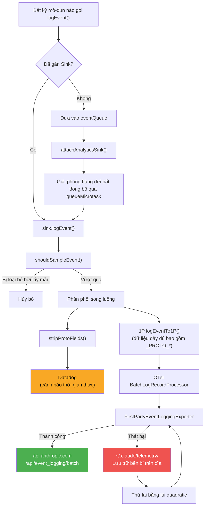
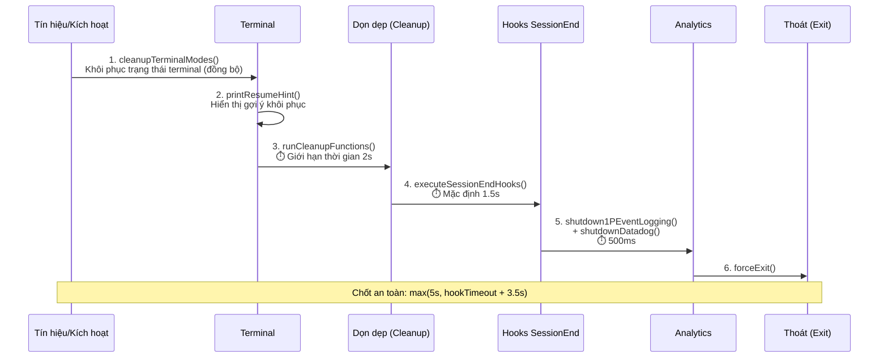

# Chương 29: Kỹ thuật giám sát — Từ logEvent đến Hệ thống đo lường từ xa cấp độ sản xuất (Observability Engineering — From logEvent to Production-Grade Telemetry)

## Tại sao điều này quan trọng

Khả năng giám sát công cụ CLI (CLI tool observability) phải đối mặt với một tập hợp các ràng buộc độc nhất vô nhị: không có máy chủ chạy liên tục ở phía server, mã nguồn chạy trên thiết bị của người dùng, mạng có thể bị ngắt bất kỳ lúc nào, và người dùng cực kỳ nhạy cảm với quyền riêng tư. Các dịch vụ web truyền thống có thể đặt các thiết bị đo lường ở phía máy chủ và thu thập nhật ký tập trung, nhưng Claude Code phải hoàn thành toàn bộ đường ống dẫn — từ thu thập sự kiện, lọc thông tin PII, phân phối hàng loạt đến thử lại khi thất bại — ngay trên client.

Claude Code đã xây dựng một hệ thống đo lường từ xa (telemetry) 5 lớp cho việc này:

| Lớp | Trách nhiệm | Tệp chính |
| :--- | :--- | :--- |
| **Cổng vào sự kiện** | Mẫu đính kèm hàng đợi (queue-attach pattern) của `logEvent()` | `services/analytics/index.ts` |
| **Định tuyến & Phân phối** | Phân phối song luồng (Datadog + 1P) | `services/analytics/sink.ts` |
| **An toàn PII** | Bảo vệ ở cấp độ hệ thống kiểu + lọc thời gian chạy | `services/analytics/metadata.ts` |
| **Khả năng phục hồi truyền tải** | Xử lý hàng loạt OTel + thử lại lưu trữ đĩa bền bỉ | `services/analytics/firstPartyEventLoggingExporter.ts` |
| **Điều khiển từ xa** | Bộ ngắt mạch Cờ tính năng (Kill Switch) | `services/analytics/sinkKillswitch.ts` |

Chương này cung cấp một phân tích hoàn chỉnh về hệ thống này, bắt đầu từ một lệnh gọi `logEvent()` đơn lẻ và theo dấu cách một sự kiện đi qua việc lấy mẫu, lọc PII, phân phối song luồng, phân phối hàng loạt, và thử lại khi thất bại, cuối cùng đến bảng điều khiển Datadog hoặc hồ dữ liệu nội bộ của Anthropic.

---

> **Phiên bản tương tác**: [Nhấp để xem hoạt ảnh đường ống đo lường từ xa](telemetry-viz.html) — xem cách `logEvent()` đi qua kiểm tra kiểu dữ liệu, lấy mẫu, lọc PII, và cuối cùng đến Datadog/1P/OTel.

## Phân tích mã nguồn

### 29.1 Kiến trúc đường ống đo lường từ xa: Từ logEvent() đến Hồ dữ liệu (Data Lake)

Đường ống đo lường từ xa của Claude Code sử dụng một **mẫu đính kèm hàng đợi (queue-attach pattern)**: các sự kiện có thể được tạo ra ở giai đoạn rất sớm của quá trình khởi động ứng dụng, trong khi backend đo lường từ xa có thể chưa được khởi tạo. Giải pháp là lưu các sự kiện vào một hàng đợi trước, sau đó giải phóng hàng đợi bất đồng bộ khi backend đã sẵn sàng.

```typescript
// restored-src/src/services/analytics/index.ts:80-84
// Hàng đợi sự kiện cho các sự kiện được ghi nhận trước khi sink được đính kèm
const eventQueue: QueuedEvent[] = []

// Sink - được khởi tạo trong quá trình khởi động ứng dụng
let sink: AnalyticsSink | null = null
```

Hàm `logEvent()` là cổng vào toàn cục — toàn bộ cơ sở mã ghi lại các sự kiện thông qua hàm này. Khi sink chưa được gắn, các sự kiện được đẩy vào hàng đợi:

```typescript
// restored-src/src/services/analytics/index.ts:133-144
export function logEvent(
  eventName: string,
  metadata: LogEventMetadata,
): void {
  if (sink === null) {
    eventQueue.push({ eventName, metadata, async: false })
    return
  }
  sink.logEvent(eventName, metadata)
}
```

Khi hàm `attachAnalyticsSink()` được gọi, hàng đợi sẽ được giải phóng một cách bất đồng bộ thông qua `queueMicrotask()`, tránh làm tắc nghẽn tiến trình khởi động:

```typescript
// restored-src/src/services/analytics/index.ts:101-122
if (eventQueue.length > 0) {
  const queuedEvents = [...eventQueue]
  eventQueue.length = 0
  // ... ghi nhật ký chỉ dành cho nhân viên Anthropic (được bỏ qua)
  queueMicrotask(() => {
    for (const event of queuedEvents) {
      if (event.async) {
        void sink!.logEventAsync(event.eventName, event.metadata)
      } else {
        sink!.logEvent(event.eventName, event.metadata)
      }
    }
  })
}
```

Thiết kế này có một đặc tính quan trọng: tệp `index.ts` **không có bất kỳ phần phụ thuộc nào** (chú thích trong mã nêu rõ "Mô-đun này KHÔNG có phần phụ thuộc để tránh các vòng lặp import"). Điều này có nghĩa là bất kỳ mô-đun nào cũng có thể nhập `logEvent` một cách an toàn mà không kích hoạt lỗi import vòng tròn (circular imports).

Việc triển khai Sink thực tế nằm trong tệp `sink.ts`, chịu trách nhiệm phân phối song luồng:

```typescript
// restored-src/src/services/analytics/sink.ts:48-72
function logEventImpl(eventName: string, metadata: LogEventMetadata): void {
  const sampleResult = shouldSampleEvent(eventName)
  if (sampleResult === 0) {
    return
  }
  const metadataWithSampleRate =
    sampleResult !== null
      ? { ...metadata, sample_rate: sampleResult }
      : metadata
  if (shouldTrackDatadog()) {
    void trackDatadogEvent(eventName, stripProtoFields(metadataWithSampleRate))
  }
  logEventTo1P(eventName, metadataWithSampleRate)
}
```

Lưu ý hai chi tiết then chốt:

1. **Việc lấy mẫu được thực thi trước khi phân phối** — `shouldSampleEvent()` quyết định xem có loại bỏ sự kiện hay không dựa trên cấu hình từ xa GrowthBook, với tỷ lệ lấy mẫu được đính kèm vào siêu dữ liệu (metadata) để hiệu chuẩn ở hạ nguồn.
2. **Datadog nhận dữ liệu đã được xử lý qua `stripProtoFields()`** — tất cả các trường PII có tiền tố `_PROTO_*` đều bị loại bỏ; trong khi kênh 1P (Bên thứ nhất) nhận dữ liệu đầy đủ.

Sơ đồ Mermaid dưới đây mô tả đường đi hoàn chỉnh từ khi tạo sự kiện đến kho lưu trữ cuối cùng:



Cơ chế bộ ngắt mạch từ xa được triển khai thông qua `sinkKillswitch.ts`, sử dụng tên cấu hình GrowthBook được làm mờ một cách cố ý:

```typescript
// restored-src/src/services/analytics/sinkKillswitch.ts:4
const SINK_KILLSWITCH_CONFIG_NAME = 'tengu_frond_boric'
```

Giá trị cấu hình là một đối tượng `{ datadog?: boolean, firstParty?: boolean }`, trong đó việc thiết lập `true` sẽ vô hiệu hóa kênh tương ứng. Thiết kế này cho phép Anthropic vô hiệu hóa từ xa hệ thống đo lường từ xa mà không cần phát hành phiên bản mới — ví dụ: khi một loại sự kiện vô tình mang theo dữ liệu nhạy cảm, việc rò rỉ có thể bị ngăn chặn trong vòng vài phút. Để biết thêm chi tiết về cơ chế Cờ tính năng, xem Chương 23.

### 29.2 Kiến trúc an toàn PII: Bảo vệ ở cấp độ hệ thống kiểu (Type-System-Level Protection)

Khả năng bảo vệ thông tin nhận dạng cá nhân (PII) của Claude Code không dựa trên việc đánh giá mã nguồn (code reviews) và các quy ước tài liệu, mà **bắt buộc tại thời điểm biên dịch** thông qua hệ thống kiểu của TypeScript. Cốt lõi là hai nhãn kiểu dữ liệu `never`:

```typescript
// restored-src/src/services/analytics/index.ts:19
export type AnalyticsMetadata_I_VERIFIED_THIS_IS_NOT_CODE_OR_FILEPATHS = never

// restored-src/src/services/analytics/index.ts:33
export type AnalyticsMetadata_I_VERIFIED_THIS_IS_PII_TAGGED = never
```

Tại sao lại sử dụng các kiểu `never`? Bởi vì kiểu `never` không thể chứa bất kỳ giá trị nào — nó chỉ có thể được gán thông qua việc ép kiểu cưỡng bức bằng toán tử `as`. Điều này có nghĩa là mỗi khi nhà phát triển muốn ghi lại một chuỗi văn bản trong một sự kiện đo lường từ xa, họ bắt buộc phải viết `myString as AnalyticsMetadata_I_VERIFIED_THIS_IS_NOT_CODE_OR_FILEPATHS`. Tên kiểu dài dòng này chính là một danh sách kiểm tra tự thân: "Tôi đã xác minh đây không phải là mã nguồn hoặc đường dẫn tệp."

Nhìn lại chữ ký của hàm `logEvent()` được hiển thị trong Phần 29.1, kiểu tham số metadata của nó là `{ [key: string]: boolean | number | undefined }` — lưu ý rằng **không chấp nhận chuỗi văn bản thông thường (strings)**. Chú thích mã nguồn tuyên bố rõ ràng: "cố ý không dùng chuỗi văn bản trừ khi ép kiểu sang AnalyticsMetadata_I_VERIFIED_THIS_IS_NOT_CODE_OR_FILEPATHS, để tránh vô tình ghi lại mã nguồn/đường dẫn tệp." Để truyền chuỗi, bạn bắt buộc phải sử dụng kiểu nhãn để ép kiểu cưỡng bức.

Đối với các kịch bản thực sự cần ghi lại dữ liệu PII (chẳng hạn như tên kỹ năng, tên máy chủ MCP), các trường có tiền tố `_PROTO_` được sử dụng:

```typescript
// restored-src/src/services/analytics/firstPartyEventLoggingExporter.ts:719-724
const {
  _PROTO_skill_name,
  _PROTO_plugin_name,
  _PROTO_marketplace_name,
  ...rest
} = formatted.additional
const additionalMetadata = stripProtoFields(rest)
```

Logic định tuyến trường `_PROTO_*`:
- **Datadog**: `sink.ts` gọi `stripProtoFields()` trước khi phân phối để loại bỏ tất cả các trường `_PROTO_*`, vì vậy Datadog không bao giờ nhìn thấy PII
- **Nhà xuất khẩu 1P (1P Exporter)**: Phân tách các trường `_PROTO_*` đã biết và nâng chúng thành các trường proto cấp cao nhất (được lưu trữ trong các cột đặc quyền của BigQuery), sau đó thực thi `stripProtoFields()` một lần nữa trên các trường còn lại để ngăn các trường mới chưa được nhận biết bị rò rỉ

Việc xử lý các tên công cụ MCP thể hiện một chiến lược tiết lộ phân cấp:

```typescript
// restored-src/src/services/analytics/metadata.ts:70-77
export function sanitizeToolNameForAnalytics(
  toolName: string,
): AnalyticsMetadata_I_VERIFIED_THIS_IS_NOT_CODE_OR_FILEPATHS {
  if (toolName.startsWith('mcp__')) {
    return 'mcp_tool' as AnalyticsMetadata_I_VERIFIED_THIS_IS_NOT_CODE_OR_FILEPATHS
  }
  return toolName as AnalyticsMetadata_I_VERIFIED_THIS_IS_NOT_CODE_OR_FILEPATHS
}
```

Các tên công cụ MCP có định dạng `mcp__<tên_máy_chủ>__<tên_công_cụ>`, trong đó tên máy chủ có thể làm lộ thông tin cấu hình của người dùng (PII mức trung bình). Theo mặc định, tất cả các công cụ MCP được thay thế bằng `'mcp_tool'`. Tuy nhiên, có ba trường hợp ngoại lệ cho phép ghi lại tên chi tiết:

1. Chế độ Cowork (`entrypoint=local-agent`) — không có khái niệm ZDR
2. Các máy chủ MCP kiểu `claudeai-proxy` — từ danh sách chính thức của claude.ai
3. Các máy chủ có URL khớp với kho đăng ký MCP chính thức

Việc xử lý phần mở rộng tệp cũng thận trọng không kém — các phần mở rộng dài hơn 10 ký tự được thay thế bằng `'other'`, bởi vì các "phần mở rộng" quá dài có thể là các tên tệp đã được băm (ví dụ: `key-hash-abcd-123-456`).

### 29.3 Phân phối sự kiện 1P: OpenTelemetry + Thử lại lưu trữ đĩa bền bỉ

Kênh 1P (Bên thứ nhất) là cốt lõi của hệ thống đo lường từ xa của Claude Code — nó phân phối các sự kiện đến điểm cuối `/api/event_logging/batch` tự lưu trữ của Anthropic, được lưu trữ trong BigQuery để phân tích ngoại tuyến.

Kiến trúc này dựa trên OpenTelemetry SDK:

```typescript
// restored-src/src/services/analytics/firstPartyEventLogger.ts:362-389
const eventLoggingExporter = new FirstPartyEventLoggingExporter({
  maxBatchSize: maxExportBatchSize,
  skipAuth: batchConfig.skipAuth,
  maxAttempts: batchConfig.maxAttempts,
  path: batchConfig.path,
  baseUrl: batchConfig.baseUrl,
  isKilled: () => isSinkKilled('firstParty'),
})
firstPartyEventLoggerProvider = new LoggerProvider({
  resource,
  processors: [
    new BatchLogRecordProcessor(eventLoggingExporter, {
      scheduledDelayMillis,
      maxExportBatchSize,
      maxQueueSize,
    }),
  ],
})
```

`BatchLogRecordProcessor` của OTel kích hoạt xuất dữ liệu khi đáp ứng bất kỳ điều kiện nào sau đây:
- Đạt đến khoảng thời gian quy định (mặc định 10 giây, có thể cấu hình qua cấu hình từ xa `tengu_1p_event_batch_config`)
- Đạt đến giới hạn kích thước đợt (mặc định 200 sự kiện)
- Hàng đợi đầy (mặc định 8192 sự kiện)

Tuy nhiên, thách thức kỹ thuật thực sự nằm ở lớp `FirstPartyEventLoggingExporter` tự tùy chỉnh (806 dòng). Exporter này bổ sung thêm các lớp phục hồi cần thiết cho công cụ CLI lên trên lớp xuất dữ liệu OTel tiêu chuẩn:

**Phân mảnh hàng loạt + độ trễ giữa các đợt**: Các đợt sự kiện lớn được chia nhỏ thành nhiều đợt nhỏ (mỗi đợt tối đa `maxBatchSize`), với độ trễ 100ms giữa các đợt:

```typescript
// restored-src/src/services/analytics/firstPartyEventLoggingExporter.ts:379-421
private async sendEventsInBatches(
  events: FirstPartyEventLoggingEvent[],
): Promise<FirstPartyEventLoggingEvent[]> {
  const batches: FirstPartyEventLoggingEvent[][] = []
  for (let i = 0; i < events.length; i += this.maxBatchSize) {
    batches.push(events.slice(i, i + this.maxBatchSize))
  }
  // ...
  for (let i = 0; i < batches.length; i++) {
    const batch = batches[i]!
    try {
      await this.sendBatchWithRetry({ events: batch })
    } catch (error) {
      // Ngắt mạch toàn bộ các đợt tiếp theo ngay khi đợt đầu tiên thất bại
      for (let j = i; j < batches.length; j++) {
        failedBatchEvents.push(...batches[j]!)
      }
      break
    }
    if (i < batches.length - 1 && this.batchDelayMs > 0) {
      await sleep(this.batchDelayMs)
    }
  }
  return failedBatchEvents
}
```

Lưu ý logic ngắt mạch: khi đợt đầu tiên thất bại, nó giả định điểm cuối không khả dụng và ngay lập tức đánh dấu tất cả các đợt còn lại là thất bại, tránh tạo ra các yêu cầu mạng vô ích.

**Thử lại lùi quadratic (Quadratic backoff retry)**: Các sự kiện thất bại sử dụng cơ chế lùi quadratic (khớp với chiến lược của Statsig SDK):

```typescript
// restored-src/src/services/analytics/firstPartyEventLoggingExporter.ts:451-455
// Lùi quadratic (khớp với Statsig SDK): base * attempts²
const delay = Math.min(
  this.baseBackoffDelayMs * this.attempts * this.attempts,
  this.maxBackoffDelayMs,
)
```

Các tham số mặc định: `baseBackoffDelayMs=500`, `maxBackoffDelayMs=30000`, `maxAttempts=8`. Tám lần cố gắng xuất tạo ra tối đa 7 lần lùi trễ: 500ms → 2s → 4.5s → 8s → 12.5s → 18s → 24.5s (các sự kiện bị hủy bỏ sau khi lần thử thứ 8 thất bại, không thực hiện lùi trễ thêm).

**Thử lại hạ cấp khi lỗi 401 (401 degraded retry)**: Khi thất bại xác thực, nó tự động thử lại mà không cần xác thực thay vì từ bỏ:

```typescript
// restored-src/src/services/analytics/firstPartyEventLoggingExporter.ts:593-611
if (
  useAuth &&
  axios.isAxiosError(error) &&
  error.response?.status === 401
) {
  // Lỗi xác thực 401, thử lại không cần xác thực
  const response = await axios.post(this.endpoint, payload, {
    timeout: this.timeout,
    headers: baseHeaders,
  })
  this.logSuccess(payload.events.length, false, response.data)
  return
}
```

Thiết kế này xử lý các tình huống mà OAuth token đã hết hạn nhưng không thể làm mới một cách âm thầm — dữ liệu đo lường từ xa vẫn có thể đến máy chủ thông qua kênh không xác thực, chỉ là không có liên kết danh tính người dùng ở phía máy chủ.

**Lưu trữ bền bỉ trên đĩa**: Các sự kiện xuất thất bại được ghi nối tiếp vào các tệp JSONL:

```typescript
// restored-src/src/services/analytics/firstPartyEventLoggingExporter.ts:44-46
function getStorageDir(): string {
  return path.join(getClaudeConfigHomeDir(), 'telemetry')
}
```

Định dạng đường dẫn tệp là `~/.claude/telemetry/1p_failed_events.<sessionId>.<batchUUID>.json`. Sử dụng `appendFile` để thực hiện ghi nối tiếp. Vì mỗi phiên làm việc sử dụng một ID phiên duy nhất + UUID đợt duy nhất để đặt tên tệp, nên thực tế không có kịch bản nhiều tiến trình ghi đồng thời vào cùng một tệp.

**Tự động truyền lại khi khởi động**: Phương thức khởi dựng Exporter gọi `retryPreviousBatches()`, quét các tệp thất bại từ các UUID đợt khác có cùng ID phiên làm việc và thực hiện truyền lại chúng dưới nền:

```typescript
// restored-src/src/services/analytics/firstPartyEventLoggingExporter.ts:137-138
// Thử lại bất kỳ sự kiện nào thất bại từ các lần chạy trước của phiên này (chạy dưới nền)
void this.retryPreviousBatches()
```

**Nạp nóng cấu hình khi đang chạy (Runtime hot-reload)**: Khi cấu hình GrowthBook được làm mới, hàm `reinitialize1PEventLoggingIfConfigChanged()` có thể xây dựng lại toàn bộ đường ống mà không làm mất sự kiện — thông qua một chuỗi: gán logger rỗng (tạm dừng sự kiện mới) → `forceFlush()` provider cũ → khởi tạo provider mới → tắt provider cũ dưới nền.

| Tính năng | Nhà xuất khẩu 1P (1P Exporter) | Nhà xuất khẩu OTel HTTP tiêu chuẩn |
| :--- | :--- | :--- |
| Phân mảnh hàng loạt | Chia theo maxBatchSize, độ trễ 100ms giữa các đợt | Không có (gửi toàn bộ trong một đợt) |
| Xử lý thất bại | Lưu trữ đĩa + lùi quadratic + ngắt mạch | Thử lại có giới hạn rồi loại bỏ (trong bộ nhớ, không bền bỉ) |
| Xác thực | OAuth → 401 hạ cấp xuống không xác thực | Các tiêu đề (headers) cố định |
| Phục hồi liên phiên | Quét khi khởi động và truyền lại các thất bại trước đó | Không có |
| Điều khiển từ xa | Công tắc khẩn cấp (Killswitch) + cấu hình nóng GrowthBook | Không có |
| Xử lý PII | Nâng cấp `_PROTO_*` + `stripProtoFields()` | Không có |

### 29.4 Tích hợp Datadog: Danh sách cho phép sự kiện được tuyển chọn (Curated Event Allowlist)

Kênh Datadog được sử dụng cho **cảnh báo thời gian thực**, bổ sung cho việc phân tích ngoại tuyến của kênh 1P. Đặc trưng thiết kế cốt lõi của nó là một danh sách cho phép được tuyển chọn kỹ lưỡng:

```typescript
// restored-src/src/services/analytics/datadog.ts:19-64 (trích đoạn)
const DATADOG_ALLOWED_EVENTS = new Set([
  'chrome_bridge_connection_succeeded',
  'chrome_bridge_connection_failed',
  // ... các sự kiện chrome_bridge_*
  'tengu_api_error',
  'tengu_api_success',
  'tengu_cancel',
  'tengu_exit',
  'tengu_init',
  'tengu_started',
  'tengu_tool_use_error',
  'tengu_tool_use_success',
  'tengu_uncaught_exception',
  'tengu_unhandled_rejection',
  // ... tổng cộng khoảng 38 sự kiện
])
```

Chỉ những sự kiện nằm trong danh sách mới được gửi đến Datadog — điều này giới hạn bề mặt tiếp xúc dữ liệu với các dịch vụ bên ngoài. Kết hợp với việc loại bỏ PII qua `stripProtoFields()`, Datadog chỉ nhìn thấy dữ liệu vận hành an toàn và giới hạn.

Datadog sử dụng một client token công khai (`pubbbf48e6d78dae54bceaa4acf463299bf`), khoảng thời gian đẩy dữ liệu hàng loạt là 15 giây, giới hạn đợt là 100 mục nhập, và thời gian chờ mạng là 5 giây.

Hệ thống thẻ (TAG_FIELDS) bao trùm các chiều hướng chính: `arch`, `platform`, `model`, `userType`, `toolName`, `subscriptionType`, v.v. Lưu ý rằng các công cụ MCP được nén thêm thành `'mcp'` ở cấp độ Datadog (thay vì `'mcp_tool'`), nhằm giảm số lượng phần tử phân biệt (cardinality).

Thiết kế phân nhóm người dùng (user bucketing) rất đáng chú ý:

```typescript
// restored-src/src/services/analytics/datadog.ts:295-298
const getUserBucket = memoize((): number => {
  const userId = getOrCreateUserID()
  const hash = createHash('sha256').update(userId).digest('hex')
  return parseInt(hash.slice(0, 8), 16) % NUM_USER_BUCKETS
})
```

Các ID người dùng được băm và phân bổ vào một trong 30 nhóm (buckets). Điều này cho phép ước tính số lượng người dùng duy nhất bằng cách đếm số lượng nhóm duy nhất, đồng thể tránh được sự bùng nổ số lượng phần tử và các vấn đề riêng tư khi trực tiếp ghi lại ID người dùng.

### 29.5 Khả năng giám sát cuộc gọi API: Từ yêu cầu đến thử lại

Các cuộc gọi API là đường dẫn vận hành quan trọng nhất của Claude Code — mỗi vòng lặp Agent (xem Chương 3 để biết chi tiết) kích hoạt ít nhất một cuộc gọi API, tạo ra một chuỗi sự kiện đo lường từ xa hoàn chỉnh. Tệp `services/api/logging.ts` triển khai một **mô hình ba sự kiện**:

1. **`tengu_api_query`**: Được ghi lại khi yêu cầu được gửi đi, bao gồm tên mô hình, ngân sách token, cấu hình bộ đệm
2. **`tengu_api_success`**: Được ghi lại khi yêu cầu thành công, bao gồm các chỉ số hiệu suất
3. **`tengu_api_error`**: Được ghi lại khi yêu cầu thất bại, bao gồm loại lỗi và mã trạng thái (status code)

Các chỉ số hiệu suất là điều đặc biệt đáng chú ý:

- **TTFT (Time to First Token)**: Thời gian từ khi gửi yêu cầu đến khi nhận được token đầu tiên, đo lường độ trễ khởi động của mô hình
- **TTLT (Time to Last Token)**: Thời gian từ khi gửi yêu cầu đến khi nhận được token cuối cùng, đo lường tổng thời gian phản hồi
- **Tổng thời gian (Total duration)**: Bao gồm cả thời gian truyền mạng khứ hồi (round-trip)
- **Dấu thời gian độc lập cho mỗi lần thử lại**

Hệ thống đo lường từ xa thử lại được triển khai thông qua `services/api/withRetry.ts`. Mỗi lần thử lại được ghi lại như một sự kiện độc lập (`tengu_api_retry`), mang theo lý do thử lại, thời gian lùi (backoff), và mã trạng thái HTTP.

Các mã trạng thái 429/529 được xử lý khác biệt:
- **429 (Rate Limited)**: Lùi trễ tiêu chuẩn, kích hoạt thời gian hạ nhiệt 30 phút trong Chế độ Nhanh (xem Chương 21 để biết chi tiết)
- **529 (Overloaded)**: Máy chủ bị quá tải, chiến lược lùi trễ mạnh mẽ hơn
- **Yêu cầu dưới nền**: Từ bỏ nhanh chóng, không chặn hoạt động trên tiền cảnh của người dùng

Phát hiện dấu vân tay cổng gateway là một thiết kế phòng thủ — khi người dùng truy cập API thông qua các cổng proxy (như LiteLLM, Helicone, Portkey, Cloudflare, Kong), Claude Code phát hiện và ghi lại loại cổng. Điều này giúp Anthropic phân biệt giữa các vấn đề API của chính họ và các vấn đề do các proxy bên thứ ba đưa vào.

### 29.6 Hệ thống đo lường từ xa khi thực thi công cụ

Việc thực thi công cụ ghi lại bốn loại sự kiện thông qua `services/tools/toolExecution.ts`:

- **`tengu_tool_use_success`**: Thực thi công cụ thành công
- **`tengu_tool_use_error`**: Lỗi thực thi công cụ
- **`tengu_tool_use_cancelled`**: Người dùng hủy bỏ
- **`tengu_tool_use_rejected_in_prompt`**: Bị từ chối quyền hạn

Mỗi sự kiện mang theo thời gian thực thi, kích thước kết quả (bytes), và phần mở rộng tệp (đã được lọc bảo mật). Đối với các công cụ MCP, chiến lược tiết lộ phân cấp được mô tả trong Phần 29.2 được tuân thủ.

Vòng đời thực thi công cụ hoàn chỉnh (validateInput → checkPermissions → call → các hook postToolUse) đã được phân tích chi tiết trong Chương 4 và không được lặp lại ở đây.

### 29.7 Theo dõi hiệu quả bộ đệm

Hệ thống phát hiện phá vỡ bộ đệm (`promptCacheBreakDetection.ts`) là điểm giao thoa giữa hệ thống đo lường từ xa và việc tối ưu hóa bộ đệm. Nó chụp ảnh nhanh `PreviousState` trước mỗi cuộc gọi API (chứa hơn 15 trường bao gồm `systemHash`, `toolsHash`, `cacheControlHash`) và so sánh kết quả thực tế của việc trúng bộ đệm sau khi nhận phản hồi.

Khi phát hiện phá vỡ bộ đệm (`cache_read_input_tokens` giảm hơn 2000 token), một sự kiện `tengu_prompt_cache_break` được tạo ra mang theo hơn 20 trường của bối cảnh phá vỡ. Ngưỡng lọc nhiễu 2000 token ngăn chặn các báo động giả từ những dao động nhỏ.

Thiết kế chi tiết của hệ thống này đã được phân tích sâu trong Chương 14; ở đây chúng ta chỉ ghi nhận vị trí của nó trong hệ thống đo lường từ xa: đó là một thực hành kiểu mẫu cho triết lý "quan sát trước khi sửa lỗi" của Claude Code (xem Chương 25 để biết chi tiết).

### 29.8 Ba kênh gỡ lỗi/chẩn đoán

Claude Code cung cấp ba kênh gỡ lỗi/chẩn đoán độc lập, mỗi kênh có các trường hợp sử dụng và chính sách PII khác nhau:

| Kênh | Tệp | Kích hoạt | Chính sách PII | Vị trí đầu ra | Trường hợp sử dụng |
| :--- | :--- | :--- | :--- | :--- | :--- |
| **Nhật ký Gỡ lỗi (Debug Log)** | `utils/debug.ts` | `--debug` hoặc `/debug` | Có thể chứa PII | `~/.claude/debug/<session>.log` | Gỡ lỗi của nhà phát triển, mặc định bật cho nhân viên Anthropic |
| **Nhật ký Chẩn đoán (Diagnostic Log)** | `utils/diagLogs.ts` | Biến môi trường `CLAUDE_CODE_DIAGNOSTICS_FILE` | **Nghiêm cấm PII** | Đường dẫn do container chỉ định | Giám sát container, thông qua session-ingress |
| **Nhật ký Lỗi (Error Log)** | `utils/errorLogSink.ts` | Tự động (chỉ xuất tệp cho nhân viên Anthropic) | Thông tin lỗi (được kiểm soát) | `~/.claude/errors/<date>.jsonl` | Phân tích hồi cứu lỗi |

**Nhật ký Gỡ lỗi** (`utils/debug.ts`) hỗ trợ nhiều phương thức kích hoạt:

```typescript
// restored-src/src/utils/debug.ts:44-57
export const isDebugMode = memoize((): boolean => {
  return (
    runtimeDebugEnabled ||
    isEnvTruthy(process.env.DEBUG) ||
    isEnvTruthy(process.env.DEBUG_SDK) ||
    process.argv.includes('--debug') ||
    process.argv.includes('-d') ||
    isDebugToStdErr() ||
    process.argv.some(arg => arg.startsWith('--debug=')) ||
    getDebugFilePath() !== null
  )
})
```

Nhân viên Anthropic được mặc định ghi nhật ký gỡ lỗi; người dùng bên ngoài cần kích hoạt rõ ràng. Lệnh `/debug` hỗ trợ kích hoạt khi đang chạy (`enableDebugLogging()`) mà không cần khởi động lại phiên. Các tệp nhật ký tự động tạo một liên kết mềm (symlink) `latest` trỏ đến tệp nhật ký gần đây nhất để truy cập nhanh chóng.

Hệ thống cấp độ nhật ký hỗ trợ lọc 5 cấp (verbose → debug → info → warn → error), được kiểm soát qua biến môi trường `CLAUDE_CODE_DEBUG_LOG_LEVEL`. Cú pháp `--debug=pattern` hỗ trợ lọc nhật ký cho các mô-đun cụ thể.

**Nhật ký Chẩn đoán** (`utils/diagLogs.ts`) là một kênh chẩn đoán container an toàn với PII — được thiết kế để đọc bởi các trình quản lý môi trường container và gửi đến dịch vụ session-ingress:

```typescript
// restored-src/src/utils/diagLogs.ts:27-31
export function logForDiagnosticsNoPII(
  level: DiagnosticLogLevel,
  event: string,
  data?: Record<string, unknown>,
): void {
```

Hậu tố `NoPII` trong tên hàm là một quy ước đặt tên có chủ đích — nó vừa nhắc nhở người gọi vừa tạo điều kiện thuận lợi cho việc đánh giá mã nguồn. Định dạng đầu ra là JSONL (mỗi dòng một đối tượng JSON), chứa dấu thời gian, cấp độ, tên sự kiện, và dữ liệu. Việc ghi đồng bộ (`appendFileSync`) được sử dụng vì nó thường xuyên được gọi trên đường dẫn tắt máy.

Hàm bao `withDiagnosticsTiming()` tự động tạo các cặp sự kiện `_started` và `_completed` cho các hoạt động bất đồng bộ, đi kèm với trường `duration_ms`.

### 29.9 Theo vết phân tán: OpenTelemetry + Perfetto

Hệ thống theo vết (tracing) của Claude Code được chia làm hai lớp: theo vết có cấu trúc dựa trên OTel, và theo vết trực quan dựa trên Perfetto.

**Theo vết OTel** (`utils/telemetry/sessionTracing.ts`) sử dụng cấu trúc phân cấp span ba cấp:

1. **Interaction Span**: Bao bọc một chu trình yêu cầu của người dùng → phản hồi của Claude
2. **LLM Request Span**: Một cuộc gọi API đơn lẻ
3. **Tool Span**: Một lần thực thi công cụ đơn lẻ (với các span con: `blocked_on_user`, `tool.execution`, `hook`)

Bối cảnh span lan truyền qua `AsyncLocalStorage`, đảm bảo liên kết cha-con chính xác qua các chuỗi gọi bất đồng bộ. Phân cấp Agent (agent chính → sub-agent) được thể hiện thông qua mối quan hệ span cha-con.

Một chi tiết kỹ thuật quan trọng là **dọn dẹp span mồ côi (orphan span cleanup)**:

```typescript
// restored-src/src/utils/telemetry/sessionTracing.ts:79
const SPAN_TTL_MS = 30 * 60 * 1000 // 30 phút
```

Các span đang hoạt động được quét sau mỗi 60 giây, và các span không kết thúc trong vòng 30 phút sẽ bị cưỡng bức đóng và loại bỏ khỏi registry. Điều này xử lý rò rỉ span do gián đoạn bất thường (như hủy bỏ luồng truyền phát, ngoại lệ không được bắt khi thực thi công cụ). `activeSpans` sử dụng `WeakRef` để cho phép bộ dọn rác (Garbage Collector) thu hồi các bối cảnh span không thể tiếp cận.

Cổng tính năng (`ENHANCED_TELEMETRY_BETA`) giữ cho việc theo vết ở trạng thái tắt theo mặc định, chỉ bật qua biến môi trường hoặc triển khai dần dần qua GrowthBook cho từng nhóm người dùng.

**Theo vết Perfetto** (`utils/telemetry/perfettoTracing.ts`) là hệ thống theo vết trực quan chỉ dành cho nhân viên Anthropic — tạo ra các tệp JSON định dạng Chrome Trace Event có thể phân tích được trong giao diện ui.perfetto.dev:

```typescript
// restored-src/src/utils/telemetry/perfettoTracing.ts:16
// Kích hoạt qua CLAUDE_CODE_PERFETTO_TRACE=1 hoặc CLAUDE_CODE_PERFETTO_TRACE=<đường_dẫn>
```

Các tệp vết chứa:
- Mối quan hệ phân cấp Agent (sử dụng ID tiến trình để phân biệt các agent khác nhau)
- Chi tiết yêu cầu API (TTFT, TTLT, tỷ lệ trúng bộ đệm, cờ suy đoán)
- Chi tiết thực thi công cụ (tên, thời gian chạy, lượng token sử dụng)
- Thời gian người dùng chờ nhập liệu

Mảng sự kiện có một chốt giới hạn trên (`MAX_EVENTS = 100_000`), và khi đạt đến giới hạn, một nửa số sự kiện cũ nhất sẽ bị loại bỏ — điều này ngăn cản các phiên hoạt động dài (như các phiên do cron kích hoạt) làm phình to bộ nhớ vô hạn. Các sự kiện siêu dữ liệu (tên tiến trình/luồng) được miễn trừ khỏi việc loại bỏ vì giao diện Perfetto cần chúng để dán nhãn các phân đoạn theo vết.

### 29.10 Khôi phục sự cố và Tắt máy an toàn

Tệp `utils/gracefulShutdown.ts` (529 dòng) triển khai chuỗi tắt máy an toàn của Claude Code — chìa khóa cho việc truyền tải dữ liệu đo lường từ xa ở "dặm cuối cùng".

Các nguồn kích hoạt tắt máy bao gồm: SIGINT (Ctrl+C), SIGTERM, SIGHUP, và tính năng **phát hiện tiến trình mồ côi** đặc thù trên macOS:

```typescript
// restored-src/src/utils/gracefulShutdown.ts:281-296
if (process.stdin.isTTY) {
  orphanCheckInterval = setInterval(() => {
    if (getIsScrollDraining()) return
    if (!process.stdout.writable || !process.stdin.readable) {
      clearInterval(orphanCheckInterval)
      void gracefulShutdown(129)
    }
  }, 30_000)
  orphanCheckInterval.unref()
}
```

macOS không phải lúc nào cũng gửi tín hiệu SIGHUP khi terminal bị đóng, mà thay vào đó sẽ thu hồi các bộ mô tả tệp TTY. Cứ sau 30 giây, tính khả dụng của stdout/stdin lại được kiểm tra.

Chuỗi tắt máy sử dụng một thiết kế **giới hạn thời gian xếp tầng (cascading timeout)**:



Quyết định thiết kế then chốt:

1. **Khôi phục chế độ terminal được thực thi đầu tiên** — trước bất kỳ hoạt động bất đồng bộ nào, hãy khôi phục trạng thái terminal một cách đồng bộ. Nếu xảy ra SIGKILL trong quá trình dọn dẹp, ít nhất terminal sẽ không bị rơi vào trạng thái hỏng hóc.
2. **Các hàm dọn dẹp có giới hạn thời gian độc lập** (2 giây) — được triển khai qua `Promise.race`, ngăn ngừa treo kết nối MCP.
3. **Các hook SessionEnd có ngân sách thời gian** (mặc định 1.5 giây) — có thể cấu hình bởi người dùng qua `CLAUDE_CODE_SESSIONEND_HOOKS_TIMEOUT_MS`.
4. **Việc đẩy dữ liệu analytics bị giới hạn ở 500ms** — trước đây là không giới hạn, khiến 1P Exporter phải đợi tất cả các lệnh gọi axios POST đang chờ xử lý (mỗi lệnh có thời gian chờ 10 giây), có khả năng tiêu thụ toàn bộ ngân sách chốt an toàn.
5. **Bộ hẹn giờ an toàn cuối cùng** được tính toán động: `max(5000, sessionEndTimeoutMs + 3500)`, đảm bảo ngân sách thời gian của hook được phân bổ đủ.

Hàm `forceExit()` xử lý các trường hợp cực đoan — khi `process.exit()` ném ngoại lệ do terminal đã chết (lỗi EIO), nó sẽ quay về sử dụng `SIGKILL`:

```typescript
// restored-src/src/utils/gracefulShutdown.ts:213-222
try {
  process.exit(exitCode)
} catch (e) {
  if ((process.env.NODE_ENV as string) === 'test') {
    throw e
  }
  process.kill(process.pid, 'SIGKILL')
}
```

Các ngoại lệ không được bắt và các Promise bị từ chối không được xử lý được ghi lại qua hai kênh — vừa được ghi vào nhật ký chẩn đoán không chứa PII, vừa được gửi đến hệ thống phân tích:

```typescript
// restored-src/src/utils/gracefulShutdown.ts:301-310
process.on('uncaughtException', error => {
  logForDiagnosticsNoPII('error', 'uncaught_exception', {
    error_name: error.name,
    error_message: error.message.slice(0, 2000),
  })
  logEvent('tengu_uncaught_exception', {
    error_name:
      error.name as AnalyticsMetadata_I_VERIFIED_THIS_IS_NOT_CODE_OR_FILEPATHS,
  })
})
```

Lưu ý rằng `error.name` (ví dụ: "TypeError") được đánh giá là thông tin không nhạy cảm và có thể ghi lại một cách an toàn. Các thông báo lỗi được cắt ngắn còn 2000 ký tự để ngăn các vết ngăn xếp (stack traces) quá dài tiêu tốn dung lượng lưu trữ quá mức.

### 29.11 Theo dõi chi phí và Trực quan hóa sử dụng

Tệp `cost-tracker.ts` quản lý việc tính toán chi phí thời gian chạy của Claude Code — theo dõi chi phí USD, lượng token sử dụng (đầu vào/đầu ra/tạo bộ đệm/đọc bộ đệm), các thay đổi dòng mã nguồn, và lưu trữ bền bỉ qua các phiên làm việc.

Trạng thái chi phí chứa một ảnh chụp nhanh hoàn chỉnh về lượng tài nguyên tiêu thụ:

```typescript
// restored-src/src/cost-tracker.ts:71-80
type StoredCostState = {
  totalCostUSD: number
  totalAPIDuration: number
  totalAPIDurationWithoutRetries: number
  totalToolDuration: number
  totalLinesAdded: number
  totalLinesRemoved: number
  lastDuration: number | undefined
  modelUsage: { [modelName: string]: ModelUsage } | undefined
}
```

Trạng thái chi phí được lưu trữ trong cấu hình dự án (`.claude.state`), được định khóa bằng `lastSessionId`. Chỉ khi ID phiên làm việc trùng khớp thì dữ liệu chi phí trước đó mới được khôi phục, ngăn chặn sự nhiễm chéo giữa các phiên khác nhau. Sau mỗi cuộc gọi API thành công, `addToTotalSessionCost()` tích lũy lượng token sử dụng và ghi nhận nó vào đường ống đo lường từ xa qua `logEvent`, giúp dữ liệu chi phí sẵn sàng cho cả hiển thị cục bộ và phân tích từ xa.

Đầu ra của lệnh `/cost` phân biệt giữa người dùng đăng ký trả phí và không đăng ký — người dùng trả phí sẽ thấy bảng phân tích chi tiết hơn, trong khi người dùng không đăng ký tập trung vào việc hiểu các mẫu tiêu thụ.

---

## Đúc kết mẫu hình (Pattern Distillation)

### Mẫu hình 1: Bảo vệ PII ở cấp độ hệ thống kiểu (Type-System-Level PII Protection)

- **Vấn đề được giải quyết**: Các sự kiện đo lường từ xa có thể vô tình chứa dữ liệu nhạy cảm (đường dẫn tệp, đoạn mã nguồn, cấu hình người dùng). Việc đánh giá mã nguồn và quy ước tài liệu không thể ngăn chặn điều này một cách đáng tin cậy.
- **Cách tiếp cận cốt lõi**: Sử dụng các kiểu nhãn `never` để buộc nhà phát triển phải tuyên bố rõ ràng về tính an toàn của dữ liệu.
- **Mẫu mã nguồn**:
  ```typescript
  type PII_VERIFIED = never
  function logEvent(data: { [k: string]: number | boolean | undefined }): void
  // Để truyền một chuỗi, bạn bắt buộc phải:
  logEvent({ name: value as PII_VERIFIED })
  ```
- **Điều kiện tiên quyết**: Sử dụng TypeScript hoặc một hệ thống kiểu mạnh tương tự. Tên của kiểu nhãn phải đủ tính mô tả để bản thân việc ép kiểu `as` đóng vai trò là một điểm tự kiểm tra.

### Mẫu hình 2: Phân phối đo lường từ xa song luồng (Dual-Path Telemetry Delivery)

- **Vấn đề được giải quyết**: Một kênh đo lường từ xa đơn lẻ không thể đồng thời thỏa mãn việc cảnh báo thời gian thực (độ trễ thấp, chi phí thấp) và phân tích ngoại tuyến (dữ liệu đầy đủ, độ tin cậy cao).
- **Cách tiếp cận cốt lõi**: Phân phối dữ liệu đo lường từ xa đến hai kênh độc lập — kênh thời gian thực sử dụng danh sách cho phép và loại bỏ PII, kênh ngoại tuyến giữ lại dữ liệu đầy đủ.
- **Điều kiện tiên quyết**: Hai kênh có các mức độ bảo mật và SLA khác nhau. Danh sách cho phép yêu cầu bảo trì liên tục.

### Mẫu hình 3: Thử lại lưu trữ đĩa bền bỉ (Disk-Persistent Retry)

- **Vấn đề được giải quyết**: Các công cụ CLI chạy trên thiết bị của người dùng, mạng không đáng tin cậy, và tiến trình có thể kết thúc bất kỳ lúc nào. Các hàng đợi thử lại trong bộ nhớ sẽ bị mất khi tiến trình thoát.
- **Cách tiếp cận cốt lõi**: Các sự kiện xuất thất bại được ghi nối tiếp vào các tệp trên đĩa (định dạng JSONL, mỗi phiên một tệp), và khi khởi động, các tệp thất bại của phiên trước sẽ được quét và truyền lại.
- **Điều kiện tiên quyết**: Hệ thống tệp khả dụng với quyền ghi. Các sự kiện không chứa dữ liệu yêu cầu lưu trữ mã hóa (PII đã được lọc trước khi ghi).

### Mẫu hình 4: Danh sách cho phép sự kiện tuyển chọn (Curated Event Allowlist)

- **Vấn đề được giải quyết**: Việc gửi các sự kiện đến các dịch vụ bên ngoài (Datadog) đòi hỏi phải kiểm soát bề mặt tiếp xúc dữ liệu. Các loại sự kiện mới có thể vô tình mang theo thông tin nhạy cảm.
- **Cách tiếp cận cốt lõi**: Sử dụng một `Set` để định nghĩa một danh sách cho phép rõ ràng. Các sự kiện không nằm trong danh sách sẽ bị loại bỏ một cách âm thầm. Các sự kiện mới phải được thêm vào danh sách một cách thủ công, tạo ra một chốt chặn đánh giá mã nguồn.
- **Điều kiện tiên quyết**: Danh sách cho phép cần được cập nhật khi các tính năng lặp lại, nếu không các sự kiện mới sẽ không bao giờ đến được dịch vụ bên ngoài.

### Mẫu hình 5: Tắt máy an toàn với giới hạn thời gian xếp tầng (Cascading Timeout Graceful Shutdown)

- **Vấn đề được giải quyết**: Nhiều nhiệm vụ dọn dẹp cần được hoàn thành khi tiến trình thoát (khôi phục terminal, lưu phiên, thực thi hook, đẩy dữ liệu đo lường), nhưng bất kỳ bước nào cũng có thể bị treo.
- **Cách tiếp cận cốt lõi**: Giới hạn thời gian độc lập cho mỗi lớp + chốt an toàn tổng thể. Ưu tiên: khôi phục terminal (đồng bộ, đầu tiên) → lưu trữ dữ liệu → các hook → đo lường từ xa. Thời gian chốt an toàn = max(giới hạn dưới cứng, ngân sách hook + biên độ an toàn).
- **Điều kiện tiên quyết**: Sự ưu tiên giữa các nhiệm vụ dọn dẹp được xác định rõ ràng. Hoạt động quan trọng nhất (khôi phục terminal) phải là đồng bộ.

---

## Triển khai OpenTelemetry của CC: Từ logEvent đến Hệ thống đo lường chuẩn hóa

Phân tích trên đã bao phủ hơn 860 sự kiện `tengu_*` và các mẫu gọi `logEvent()`. Tuy nhiên, ở lớp sâu hơn, CC xây dựng một **hạ tầng đo lường từ xa OpenTelemetry hoàn chỉnh**, hợp nhất việc ghi nhật ký sự kiện, theo vết phân tán, và đo lường chỉ số (metrics) vào khung tiêu chuẩn OTel.

### Ba phạm vi OTel (OTel Scopes)

CC đăng ký ba phạm vi OTel độc lập, mỗi phạm vi có các trách nhiệm riêng biệt:

| Phạm vi | Thành phần OTel | Mục đích |
| :--- | :--- | :--- |
| `com.anthropic.claude_code.events` | Logger | Ghi sự kiện (hơn 860 sự kiện tengu) |
| `com.anthropic.claude_code.tracing` | Tracer | Theo vết phân tán (cuộc gọi API, thực thi công cụ) |
| `com.anthropic.claude_code` | Meter | Đo lường chỉ số (OTLP/Prometheus/BigQuery) |

```typescript
// restored-src/src/utils/telemetry/instrumentation.ts:602-606
const eventLogger = logs.getLogger(
  'com.anthropic.claude_code.events',
  MACRO.VERSION,
)
```

### Cấu trúc phân cấp Span (Span Hierarchy Structure)

Hệ thống theo vết của CC định nghĩa 6 loại span tạo thành một phân cấp cha-con rõ ràng:

```
claude_code.interaction (Root Span: một lượt tương tác của người dùng)
  ├─ claude_code.llm_request (Cuộc gọi API)
  ├─ claude_code.tool (Lời gọi công cụ)
  │   ├─ claude_code.tool.blocked_on_user (Chờ phê duyệt quyền hạn)
  │   └─ claude_code.tool.execution (Thực thi thực tế)
  └─ claude_code.hook (Thực thi Hook, theo vết phiên bản beta)
```

Mỗi span mang theo các thuộc tính chuẩn hóa (`sessionTracing.ts:162-166`):

| Loại Span | Các thuộc tính chính |
| :--- | :--- |
| `interaction` | `session_id`, `platform`, `arch` |
| `llm_request` | `model`, `speed` (fast/normal), `query_source` (tên agent) |
| Phản hồi `llm_request` | `duration_ms`, `input_tokens`, `output_tokens`, `cache_read_tokens`, `cache_creation_tokens`, `ttft_ms`, `success` |
| `tool` | `tool_name`, `tool_input` (theo vết beta) |

Chỉ số `ttft_ms` (Time to First Token) là một trong những chỉ số độ trễ quan trọng nhất đối với ứng dụng LLM — CC ghi lại nó một cách tự nhiên trong thuộc tính span.

### Lan truyền bối cảnh: AsyncLocalStorage

CC sử dụng Node.js `AsyncLocalStorage` để lan truyền bối cảnh span (`sessionTracing.ts:65-76`):

```typescript
const interactionContext = new AsyncLocalStorage<SpanContext | undefined>()
const toolContext = new AsyncLocalStorage<SpanContext | undefined>()
const activeSpans = new Map<string, WeakRef<SpanContext>>()
```

Hai thực thể `AsyncLocalStorage` độc lập theo dõi tương ứng bối cảnh cấp tương tác và cấp công cụ. Sự kết hợp giữa `WeakRef` + dọn dẹp định kỳ TTL 30 phút (quét sau mỗi 60 giây) ngăn chặn các span mồ côi gây rò rỉ bộ nhớ.

### Đường ống xuất sự kiện (Event Export Pipeline)

Lệnh `logEvent()` không phải là một `console.log` đơn giản. Nó đi qua đường ống OTel hoàn chỉnh:

```
logEvent("tengu_api_query", metadata)
  ↓
Kiểm tra lấy mẫu (tengu_event_sampling_config)
  ↓ Vượt qua
Logger.emit({ body: eventName, attributes: {...} })
  ↓
BatchLogRecordProcessor (khoảng thời gian 5 giây / đợt 200 mục nhập)
  ↓
FirstPartyEventLoggingExporter (LogRecordExporter tự tùy chỉnh)
  ↓
POST /api/event_logging/batch → api.anthropic.com
  ↓ Khi thất bại
Ghi nối thêm vào ~/.claude/config/telemetry/1p_failed_events.{session}.{batch}.json
  ↓ Thử lại
Lùi quadratic: delay = min(500ms × attempts², 30000ms), tối đa 8 lần thử
```

**Bộ ngắt mạch từ xa**: Cấu hình GrowthBook `tengu_frond_boric` kiểm soát công tắc bật/tắt của toàn bộ sink — Anthropic có thể khẩn cấp vô hiệu hóa việc xuất đo lường từ xa mà không cần phát hành phần mềm.

### Ghi song hành Datadog (Datadog Dual-Write)

Ngoài việc xuất sang 1P, CC cũng ghi song hành **một số** sự kiện sang Datadog (`datadog.ts:19-64`):

- Cơ chế danh sách cho phép: Chỉ xuất các sự kiện cốt lõi có tiền tố `tengu_api_*`, `tengu_compact_*`, `tengu_tool_use_*` (khoảng 60 mẫu tiền tố)
- Chia đợt: 100 mục nhập/đợt, khoảng thời gian 15 giây
- Điểm cuối: `https://http-intake.logs.us5.datadoghq.com/api/v2/logs`

Chiến lược ghi song hành này là một điển hình của "phân tầng khả năng quan sát trong sản xuất": 1P thu thập toàn bộ khối lượng sự kiện để phân tích dài hạn, Datadog thu thập các sự kiện cốt lõi để cảnh báo thời gian thực và hiển thị bảng điều khiển.

### Theo vết Beta (Beta Tracing): Dữ liệu theo vết phong phú hơn

CC cũng có một hệ thống "theo vết beta" riêng biệt (`betaSessionTracing.ts`), được kiểm soát bởi biến môi trường `ENABLE_BETA_TRACING_DETAILED=1`:

| Theo vết tiêu chuẩn | Các thuộc tính bổ sung của Theo vết Beta |
| :--- | :--- |
| model, duration_ms | + `system_prompt_hash`, `system_prompt_preview` |
| input_tokens, output_tokens | + `response.model_output`, `response.thinking_output` |
| tool_name | + `tool_input` (nội dung đầu vào hoàn chỉnh) |
| — | + `new_context` (phần tin nhắn mới thay đổi mỗi lượt) |

Ngưỡng cắt ngắn nội dung là 60KB (giới hạn của Honeycomb là 64KB). Mã băm SHA-256 được sử dụng để loại bỏ trùng lặp — các gợi ý hệ thống giống hệt nhau chỉ được ghi lại một lần.

### Hệ sinh thái nhà xuất khẩu chỉ số (Metric Exporter Ecosystem)

CC hỗ trợ 5 nhà xuất khẩu chỉ số (`instrumentation.ts:130-215`), bao phủ các nền tảng giám sát phổ biến:

| Nhà xuất khẩu (Exporter) | Giao thức | Khoảng thời gian xuất | Mục đích |
| :--- | :--- | :--- | :--- |
| OTLP (gRPC) | `@opentelemetry/exporter-metrics-otlp-grpc` | 60s | Các backend OTel tiêu chuẩn |
| OTLP (HTTP) | `@opentelemetry/exporter-metrics-otlp-http` | 60s | Các backend tương thích HTTP |
| Prometheus | `@opentelemetry/exporter-prometheus` | Thu thập (Pull) | Hệ sinh thái Grafana |
| BigQuery | `BigQueryMetricsExporter` tự tùy chỉnh | 5 phút | Phân tích dài hạn |
| Console | `ConsoleMetricExporter` | 60s | Gỡ lỗi |

### Tái phát gợi ý (Prompt Replay): Công cụ gỡ lỗi nội bộ hỗ trợ xử lý sự cố

Claude Code có một công cụ gỡ lỗi hướng tới người dùng nội bộ (`USER_TYPE === 'ant'`) — `dumpPrompts.ts`, giúp tuần tự hóa rõ ràng từng yêu cầu API vào tệp JSONL trên mỗi cuộc gọi API, hỗ trợ tái phát lại lịch sử tương tác gợi ý hoàn chỉnh sau đó.

Đường dẫn ghi tệp là `~/.claude/dump-prompts/{sessionId}.jsonl`, với mỗi dòng là một đối tượng JSON thuộc bốn loại:

| Loại | Kích hoạt | Nội dung |
| :--- | :--- | :--- |
| `init` | Cuộc gọi API đầu tiên | Gợi ý hệ thống, schema công cụ, siêu dữ liệu mô hình |
| `system_update` | Khi gợi ý hệ thống hoặc công cụ thay đổi | Tương tự init, được đánh dấu là cập nhật lũy tiến |
| `message` | Mỗi tin nhắn mới của người dùng | Chỉ tin nhắn của người dùng (tin nhắn của trợ lý được bắt trong phản hồi) |
| `response` | Sau khi API thành công | Các mảnh truyền phát (streaming chunks) hoàn chỉnh hoặc phản hồi JSON |

```typescript
// restored-src/src/services/api/dumpPrompts.ts:146-167
export function createDumpPromptsFetch(
  agentIdOrSessionId: string,
): ClientOptions['fetch'] {
  const filePath = getDumpPromptsPath(agentIdOrSessionId)
  return async (input, init?) => {
    // ...
    // Trì hoãn để không làm chặn cuộc gọi API thực tế —
    // đây là công cụ gỡ lỗi cho lệnh /issue, không nằm trên đường dẫn quan trọng.
    setImmediate(dumpRequest, init.body as string, timestamp, state, filePath)
    // ...
```

Thiết kế đáng chú ý nhất trong đoạn mã này là **việc tuần tự hóa trì hoãn qua `setImmediate`** (dòng 167). Gợi ý hệ thống + schema công cụ có thể dễ dàng lên tới vài MB; việc tuần tự hóa đồng bộ sẽ làm chặn cuộc gọi API thực tế. `setImmediate` đẩy việc tuần tự hóa sang chu kỳ tiếp theo của vòng lặp sự kiện (event loop tick), đảm bảo công cụ gỡ lỗi không ảnh hưởng đến trải nghiệm người dùng.

Việc phát hiện thay đổi sử dụng **cơ chế vân tay hai cấp (two-level fingerprinting)**: trước tiên là một `initFingerprint` nhẹ (`model|toolNames|systemLength`, dòng 74-88) để kiểm tra nhanh "cấu trúc có giống nhau không?", sau đó mới thực hiện thao tác tốn kém `JSON.stringify + SHA-256 hash` khi cấu trúc thực sự thay đổi. Điều này tránh phải trả chi phí tuần tự hóa 300ms cho các gợi ý hệ thống không đổi trong mỗi lượt hội thoại nhiều vòng.

Ngoài ra, `dumpPrompts.ts` duy trì một bộ nhớ đệm trong bộ nhớ cho 5 yêu cầu API gần đây nhất (`MAX_CACHED_REQUESTS = 5`, dòng 14), giúp lệnh `/issue` nhanh chóng có được bối cảnh yêu cầu gần đây khi người dùng báo cáo lỗi — không cần phân tích tệp JSONL.

Ý nghĩa đối với các nhà phát triển Agent: **Các công cụ gỡ lỗi nên là các thành phần bổ trợ không tốn chi phí (zero-cost sidecars)**. Lớp `dumpPrompts` đạt được khả năng gỡ lỗi "luôn bật nhưng trung hòa về hiệu suất" thông qua ba cơ chế: trì hoãn qua `setImmediate`, loại bỏ trùng lặp bằng dấu vân tay, và lưu đệm trong bộ nhớ. Nếu Agent của bạn cần chức năng tái phát gợi ý tương tự, khuôn mẫu này có thể được tái sử dụng trực tiếp.

### Ý nghĩa đối với Nhà phát triển Agent (Agent Builders)

1. **Sử dụng các tiêu chuẩn OTel ngay từ đầu**. CC không xây dựng một giao thức đo lường từ xa tùy chỉnh — nó sử dụng các tiêu chuẩn `Logger`, `Tracer`, `Meter` của OTel, cho phép tích hợp với bất kỳ backend tương thích OTel nào. Agent của bạn nên làm điều tương tự
2. **Cấu trúc phân cấp Span nên phản ánh cấu trúc Vòng lặp Agent**. Phân cấp `interaction → llm_request / tool` ánh xạ trực tiếp đến một lần lặp của Vòng lặp Agent. Khi thiết kế spans, trước tiên hãy vẽ sơ đồ cấu trúc Vòng lặp Agent của bạn
3. **Lấy mẫu là điều cần thiết**. Hơn 860 sự kiện được xuất ra với khối lượng đầy đủ sẽ tạo ra chi phí khổng lồ. CC kiểm soát tỷ lệ lấy mẫu của từng sự kiện thông qua cấu hình từ xa GrowthBook — điều này linh hoạt hơn nhiều so với việc lập trình cứng `if (Math.random() < 0.01)` trong mã nguồn
4. **Ghi song song vào các backend khác nhau cho các mục đích khác nhau**. Dữ liệu đầy đủ cho kênh 1P + dữ liệu cốt lõi cho Datadog = phân tích dài hạn + cảnh báo thời gian thực. Đừng cố gắng đáp ứng tất cả nhu cầu với duy nhất một backend
5. **AsyncLocalStorage là vũ khí theo vết cho các Node.js Agent**. Nó giúp bạn tránh được việc phải truyền các đối tượng bối cảnh một cách thủ công — các mối quan hệ span cha-con tự động lan truyền thông qua bối cảnh thực thi

---

## Những việc bạn có thể làm

### Gỡ lỗi bằng Nhật ký (Debug Logging)

- **Kích hoạt khi khởi động**: Chạy `claude --debug` hoặc `claude -d`
- **Kích hoạt khi đang chạy**: Nhập `/debug` trong cuộc trò chuyện
- **Lọc các mô-đun cụ thể**: Chạy `claude --debug=api` để chỉ xem nhật ký liên quan đến API
- **Xuất ra stderr**: Chạy `claude --debug-to-stderr` hoặc `claude -d2e` (thuận tiện cho việc chuyển ống dẫn)
- **Chỉ định tệp đầu ra**: Chạy `claude --debug-file=/path/to/log`

Nhật ký nằm trong thư mục `~/.claude/debug/`, với một liên kết mềm `latest` trỏ đến tệp gần đây nhất.

### Phân tích Hiệu suất (Performance Analysis)

- **Theo vết Perfetto** (chỉ dành cho nhân viên Anthropic): Chạy `CLAUDE_CODE_PERFETTO_TRACE=1 claude`
- Các tệp vết nằm tại `~/.claude/traces/trace-<session-id>.json`
- Mở tệp trong [ui.perfetto.dev](https://ui.perfetto.dev) để xem dòng thời gian trực quan

### Xem Chi phí

- Nhập `/cost` trong cuộc trò chuyện để xem chi phí và lượng token sử dụng của phiên hiện tại
- Dữ liệu chi phí bền bỉ qua các phiên — các giá trị tích lũy từ phiên trước sẽ tự động được tải khi khôi phục (resume) phiên

### Kiểm soát Quyền riêng tư

- Hệ thống đo lường từ xa của Claude Code tuân theo các cơ chế từ chối (opt-out) tiêu chuẩn
- Các cuộc gọi đến nhà cung cấp API bên thứ ba (Bedrock, Vertex) không tạo ra dữ liệu đo lường từ xa
- Dữ liệu giám sát không chứa nội dung mã nguồn của người dùng hoặc đường dẫn tệp (được đảm bảo bởi hệ thống kiểu)
