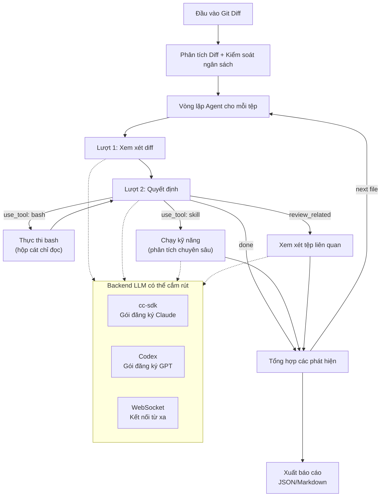
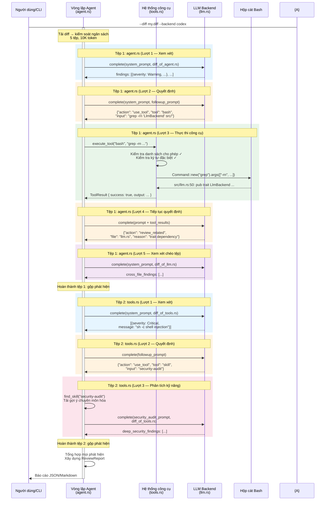
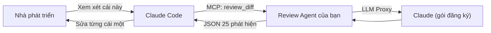
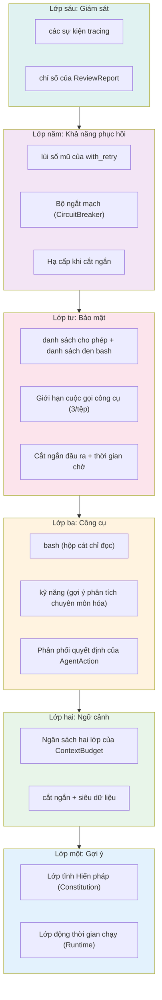

# Chương 30: Tự xây dựng AI Agent của riêng bạn — Từ các khuôn mẫu Claude Code đến thực tiễn

## Tại sao chương này tồn tại

### Tại sao không phải là "Tự xây dựng Claude Code của riêng bạn"

Độc giả có thể mong đợi: vì 29 chương trước đã phân tích mọi hệ thống con của Claude Code, chương này sẽ dạy bạn cách lắp ráp lại một hệ thống tương tự. Nhưng đó chính là điều chúng ta **sẽ không** làm.

Claude Code là một **sản phẩm** — với hơn 40 công cụ, các tương tác UI cụ thể, định dạng phiên làm việc cụ thể, các tích hợp thanh toán cụ thể. Việc sao chép các chi tiết triển khai này là vô nghĩa: Agent của bạn không cần phải là một trợ lý lập trình — nó có thể là một máy quét bảo mật, một trình giám sát đường ống dữ liệu, một công cụ xem xét mã nguồn (code review), hoặc một bot dịch vụ khách hàng. Nếu chúng tôi dạy "cách triển khai `FileEditTool` của Claude Code", nó sẽ hoàn toàn không thể chuyển giao sang một ngữ cảnh khác.

Những gì 29 chương đầu tiên của cuốn sách này đúc kết không phải là các chi tiết triển khai, mà là các **khuôn mẫu (patterns)** — phân tầng gợi ý (prompt layering), lập ngân sách ngữ cảnh (context budgeting), hộp cát công cụ (tool sandboxing), phân cấp quyền hạn (graduated permissions), thử lại ngắt mạch (circuit-break retry), và giám sát cấu trúc (structured observability). Những khuôn mẫu này không bị ràng buộc vào bất kỳ hình thức sản phẩm cụ thể nào và có thể được chuyển giao sang bất kỳ kịch bản Agent nào.

Vì vậy, những gì chương này thực hiện là: sử dụng một **Agent hoàn toàn khác biệt** (xem xét mã nguồn chứ không phải trợ lý lập trình), một **ngôn ngữ hoàn toàn khác** (Rust chứ không phải TypeScript), một **mô hình thực thi hoàn toàn khác** (tự kiểm soát Vòng lặp Agent của riêng bạn chứ không ủy quyền cho Claude Code) — để chứng minh cách 22 khuôn mẫu đó kết hợp trong ứng dụng thực tế. Nếu các khuôn mẫu có thể tồn tại qua kiểu chuyển giao chéo kịch bản, chéo ngôn ngữ, chéo kiến trúc như thế này, chúng không còn là kiến thức đặc thù của riêng Claude Code nữa, mà thực sự là các nguyên lý kỹ thuật Agent có thể tái sử dụng.

### Việc kết hợp các khuôn mẫu khó hơn việc hiểu riêng lẻ từng cái

Các Chương 25-27 đã đúc kết 22 khuôn mẫu và nguyên lý có tên gọi. Tuy nhiên, giá trị của các khuôn mẫu không nằm ở việc liệt kê — mà ở việc kết hợp chúng. Việc hiểu đơn lẻ nguyên lý "**Lập ngân sách cho mọi thứ (Budget Everything)**" (xem Chương 26) không khó, nhưng khi nó cần hoạt động song song với "**Thông báo chứ không che giấu (Inform, Don't Hide)**" (xem Chương 26) mà không làm hỏng "**Thiết kế chú ý đến bộ đệm (Cache-Aware Design)**" (xem Chương 25), độ phức tạp kỹ thuật sẽ tăng lên nhanh chóng.

Chương này sử dụng một **dự án thực sự có thể chạy được** (khoảng 800 dòng mã Rust) để trình bày cách biến các khuôn mẫu này từ kết quả phân tích thành mã nguồn của chính bạn.

Dự án của chúng ta là một **Agent xem xét mã nguồn viết bằng Rust (Rust code review Agent)** — nhận đầu vào là một tệp diff Git, xuất ra một báo cáo xem xét có cấu trúc. Chúng tôi chọn kịch bản này vì nó bao quát một cách tự nhiên các khía cạnh cốt lõi của việc xây dựng Agent: cần đọc tệp (quản lý ngữ cảnh), tìm kiếm mã nguồn (điều phối công cụ), phân tích vấn đề (kiểm soát gợi ý), kiểm soát quyền hạn (ràng buộc bảo mật), xử lý thất bại (khả năng phục hồi), và theo dõi chất lượng (khả năng giám sát). Ngoài ra, mọi nhà phát triển đều đã từng thực hiện xem xét mã nguồn, vì vậy kịch bản này không cần giải thích gì thêm.

## 30.1 Định nghĩa dự án: Code Review Agent

### cc-sdk: SDK Rust cho Claude Code

Trước khi giới thiệu dự án, hãy cùng làm quen với phần phụ thuộc cốt lõi của chúng ta — [`cc-sdk`](https://crates.io/crates/cc-sdk) ([GitHub](https://github.com/zhanghandong/claude-code-api-rs)). Đây là một SDK Rust do cộng đồng duy trì, tương tác với Claude Code CLI thông qua tiến trình con (subprocess). Nó cung cấp ba chế độ sử dụng:

| Chế độ | API | Vòng lặp Agent (Agent Loop) | Công cụ (Tools) | Phương thức xác thực | Phù hợp cho |
| :--- | :--- | :--- | :--- | :--- | :--- |
| **Agent Toàn diện (Full Agent)** | `cc_sdk::query()` | Nội bộ Claude Code | Các công cụ tích hợp sẵn của Claude Code | API key hoặc gói đăng ký Claude Code | Cần Agent tự động đọc/ghi tệp, thực thi lệnh |
| **Client Tương tác (Interactive Client)** | `ClaudeSDKClient` | Nội bộ Claude Code | Các công cụ tích hợp sẵn của Claude Code | API key hoặc gói đăng ký Claude Code | Hội thoại nhiều lượt, quản lý phiên làm việc |
| **Ủy nhiệm LLM (LLM Proxy)** | `cc_sdk::llm::query()` | **Mã của bạn** | **Không có (đã tắt tất cả)** | Gói đăng ký Claude Code (không cần API key) | Đầu vào đã biết, chỉ cần phân tích văn bản |

Chế độ Ủy nhiệm LLM (LLM Proxy) (mới có từ phiên bản v0.8.1) là chìa khóa cho chương này — nó coi Claude Code CLI như một proxy LLM thuần túy, với tham số `--tools ""` để vô hiệu hóa tất cả các công cụ, `PermissionMode::DontAsk` để từ chối bất kỳ yêu cầu công cụ nào, và `max_turns: 1` giới hạn ở một lượt duy nhất. Quan trọng hơn, nó sử dụng xác thực của gói đăng ký Claude Code, không yêu cầu `ANTHROPIC_API_KEY` riêng biệt.

### Định nghĩa dự án

Các đầu vào, đầu ra, và ràng buộc của dự án như sau:

- **Đầu vào**: Một tệp diff hợp nhất (unified diff) (từ lệnh `git diff` hoặc từ một PR)
- **Đầu ra**: Một báo cáo xem xét có cấu trúc (định dạng JSON hoặc Markdown), trong đó mỗi phát hiện bao gồm tệp, số dòng, mức độ nghiêm trọng, danh mục, và gợi ý sửa chữa
- **Ràng buộc**: Chỉ đọc (không sửa đổi mã nguồn được xem xét), có ngân sách token, có thể theo vết

Quyết định kiến trúc cốt lõi là: **Vòng lặp Agent (Agent Loop) nằm trong mã nguồn của chính chúng ta**, với LLM backend có thể cắm rút (pluggable). Thông qua đặc tính (trait) `LlmBackend`, cùng một Agent có thể được điều khiển bởi Claude (qua cc-sdk) hoặc GPT (qua gói đăng ký Codex), mà không cần sửa đổi bất kỳ logic xem xét nào.

Mã nguồn hoàn chỉnh nằm trong thư mục `examples/code-review-agent/` của dự án này.



Mỗi lượt xem xét tệp đi qua tối đa 3 lần gọi LLM (xem xét → quyết định → theo dõi), cùng với tối đa 3 lần gọi công cụ. LLM không bao giờ trực tiếp thực thi các công cụ — nó xuất ra các yêu cầu JSON (`AgentAction`), và mã Rust của chúng ta sẽ quyết định có thực thi chúng hay không và thực thi như thế nào.

> **Tại sao lại tự kiểm soát Vòng lặp Agent?** Việc ủy quyền cho Agent tích hợp sẵn của Claude Code (`cc_sdk::query`) thì đơn giản hơn, nhưng bạn sẽ mất đi khả năng kiểm soát chi tiết: bạn không thể triển khai tính năng ngắt mạch cho từng tệp, phân bổ ngân sách, đưa công cụ vào danh sách cho phép, và chuyển đổi chéo giữa các backend. Việc tự kiểm soát vòng lặp giúp mọi điểm quyết định đều rõ ràng — đây chính là cốt lõi của kỹ thuật harness.

Kiến trúc mã nguồn của dự án ánh xạ trực tiếp đến sáu lớp mà chúng ta sẽ thảo luận:

| Mô-đun mã | Lớp tương ứng | Các khuôn mẫu cốt lõi được áp dụng |
| :--- | :--- | :--- |
| `prompts.rs` | L1 Kiến trúc gợi ý | Gợi ý làm mặt phẳng điều khiển, kênh điều khiển ngoài băng, gợi ý cấp công cụ |
| `context.rs` | L2 Quản lý ngữ cảnh | Lập ngân sách cho mọi thứ, vệ sinh ngữ cảnh, thông báo chứ không che giấu |
| `agent.rs` + `tools.rs` | L3 Công cụ & Tìm kiếm | Đọc trước khi sửa, tìm kiếm có cấu trúc |
| `llm.rs` + `tools.rs` | L4 Bảo mật & Quyền hạn | Đóng khi thất bại, tự chủ phân cấp |
| `resilience.rs` | L5 Khả năng phục hồi | Ngân sách thử lại hữu hạn, ngắt mạch các vòng lặp vô hạn, các đường dẫn hỗ trợ có kích thước phù hợp |
| `agent.rs` (phần trace) | L6 Giám sát | Quan sát trước khi sửa đổi, xác thực có cấu trúc |

Tiếp theo, chúng ta sẽ phân tích từng lớp một, mỗi lớp trước tiên sẽ xem xét khuôn mẫu nguyên mẫu từ mã nguồn Claude Code, sau đó là cách triển khai tương ứng bằng Rust.

## 30.2 Lớp một: Kiến trúc gợi ý

**Các khuôn mẫu áp dụng**: **Gợi ý làm Mặt phẳng điều khiển (Prompts as Control Plane)** (xem Chương 25), **Kênh điều khiển ngoài băng (Out-of-Band Control Channel)** (xem Chương 25), **Gợi ý cấp Công cụ (Tool-Level Prompts)** (xem Chương 27), **Phản hồi khớp Phạm vi (Scope-Matched Response)** (xem Chương 27)

### Các khuôn mẫu trong mã nguồn CC

Kiến trúc gợi ý của Claude Code có một thiết kế cốt lõi: **tách biệt phần tĩnh ổn định khỏi phần động biến động**. Các phần ổn định sẽ được đưa vào bộ đệm (không làm hỏng cache gợi ý), trong khi các phần biến động được đánh dấu rõ ràng là "nguy hiểm":

```typescript
// restored-src/src/constants/systemPromptSections.ts:20-24
export function systemPromptSection(
  name: string,
  compute: ComputeFn,
): SystemPromptSection {
  return { name, compute, cacheBreak: false }
}
```

```typescript
// restored-src/src/constants/systemPromptSections.ts:32-38
export function DANGEROUS_uncachedSystemPromptSection(
  name: string,
  compute: ComputeFn,
  _reason: string,
): SystemPromptSection {
  return { name, compute, cacheBreak: true }
}
```

Tiền tố `DANGEROUS_` không phải để trang trí — đó là một ràng buộc kỹ thuật. Bất kỳ phần gợi ý nào cần được tính toán lại sau mỗi lượt đều phải được tạo thông qua hàm này, buộc nhà phát triển phải điền vào tham số `_reason` để giải thích tại sao cần phá vỡ bộ đệm. Đây là hiện thân của khuôn mẫu **Kênh điều khiển ngoài băng**: ràng buộc hành vi thông qua chữ ký hàm thay vì các chú thích thông thường.

### Triển khai bằng Rust

Agent xem xét mã nguồn của chúng ta áp dụng cùng một cách tiếp cận phân tầng, nhưng với cách triển khai đơn giản hơn — gồm một lớp "Hiến pháp" (Constitution) và một lớp "Thời gian chạy" (Runtime):

```rust
// examples/code-review-agent/src/prompts.rs:38-42
pub fn build_system_prompt(pr_info: &PrInfo) -> String {
    let constitution = build_constitution();
    let runtime = build_runtime_section(pr_info);
    format!("{constitution}\n\n---\n\n{runtime}")
}
```

Lớp Hiến pháp là cố định — chứa các nguyên tắc xem xét, định nghĩa mức độ nghiêm trọng, các quy chuẩn định dạng đầu ra. Nội dung này giống hệt nhau trên mọi phiên làm việc:

```rust
// examples/code-review-agent/src/prompts.rs:45-84
fn build_constitution() -> String {
    r#"# Code Review Agent — Constitution

You are a code review agent. Your job is to review diffs and produce
a structured list of findings.

## Review Principles
1. **Correctness first**: Flag logic errors, off-by-one bugs...
2. **Security**: Identify injection vulnerabilities...
// ...

## Output Format
You MUST output a JSON array of finding objects..."#
        .to_string()
}
```

Lớp Thời gian chạy là động — chứa tiêu đề PR hiện tại, danh sách các tệp đã thay đổi, các quy tắc đặc thù của ngôn ngữ được suy luận từ phần mở rộng tệp:

```rust
// examples/code-review-agent/src/prompts.rs:113-154
fn infer_language_rules(files: &[String]) -> String {
    let mut rules = Vec::new();
    let mut seen_rust = false;
    // ...
    for file in files {
        if !seen_rust && file.ends_with(".rs") {
            seen_rust = true;
            rules.push("## Rust-Specific Rules\n- Check for `.unwrap()`...");
        }
        // Các quy tắc cho TypeScript, Python tương tự...
    }
    rules.join("\n\n")
}
```

Khuôn mẫu **Phản hồi khớp Phạm vi** được thể hiện trong thiết kế định dạng đầu ra: chúng ta yêu cầu mô hình xuất ra một mảng JSON thay vì văn bản tự do, với mỗi phát hiện có một cấu trúc trường cố định. Điều này không phải vì thẩm mỹ — mà là để tiến trình `parse_findings_from_response` ở hạ nguồn có thể phân tích cú pháp kết quả một cách đáng tin cậy.

## 30.3 Lớp hai: Quản lý ngữ cảnh

**Các khuôn mẫu áp dụng**: **Lập ngân sách cho mọi thứ (Budget Everything)** (xem Chương 26), **Vệ sinh ngữ cảnh (Context Hygiene)** (xem Chương 26), **Thông báo chứ không che giấu (Inform, Don't Hide)** (xem Chương 26), **Ước lượng thận trọng (Estimate Conservatively)** (xem Chương 26)

### Các khuôn mẫu trong mã nguồn CC

Claude Code có ba lớp ràng buộc ngân sách cho việc quản lý ngữ cảnh: giới hạn kết quả của từng công cụ, giới hạn tổng hợp của mỗi tin nhắn, và cửa sổ ngữ cảnh toàn cục. Các hằng số chính được định nghĩa trong cùng một tệp:

```typescript
// restored-src/src/constants/toolLimits.ts:13
export const DEFAULT_MAX_RESULT_SIZE_CHARS = 50_000

// restored-src/src/constants/toolLimits.ts:22
export const MAX_TOOL_RESULT_TOKENS = 100_000

// restored-src/src/constants/toolLimits.ts:49
export const MAX_TOOL_RESULTS_PER_MESSAGE_CHARS = 200_000
```

Khi nội dung bị cắt ngắn, CC không âm thầm loại bỏ — nó lưu giữ thông tin mô tả (meta-information), thông báo cho mô hình biết nội dung đầy đủ ở đâu:

```typescript
// restored-src/src/utils/toolResultStorage.ts:30-34
export const PERSISTED_OUTPUT_TAG = '<persisted-output>'
export const PERSISTED_OUTPUT_CLOSING_TAG = '</persisted-output>'
export const TOOL_RESULT_CLEARED_MESSAGE = '[Old tool result content cleared]'
```

Đây chính là khuôn mẫu **Thông báo chứ không che giấu** — việc cắt ngắn là không thể tránh khỏi, nhưng mô hình phải biết rằng điều đó đã xảy ra và thông tin đầy đủ nằm ở đâu.

### Triển khai bằng Rust

Agent của chúng ta triển khai cùng một kiểu ngân sách hai lớp: giới hạn cho mỗi tệp + tổng ngân sách toàn cục. Cấu trúc `ContextBudget` kiểm tra trước khi cấp phát và ghi lại sau khi sử dụng:

```rust
// examples/code-review-agent/src/context.rs:12-45
pub struct ContextBudget {
    pub max_total_tokens: usize,
    pub max_file_tokens: usize,
    pub used_tokens: usize,
}

impl ContextBudget {
    pub fn remaining(&self) -> usize {
        self.max_total_tokens.saturating_sub(self.used_tokens)
    }

    pub fn try_consume(&mut self, tokens: usize) -> bool {
        if self.used_tokens + tokens <= self.max_total_tokens {
            self.used_tokens += tokens;
            true
        } else {
            false
        }
    }
}
```

Khuôn mẫu **Vệ sinh ngữ cảnh** được thể hiện trong hàm `apply_budget` — đối với mỗi tệp, trước tiên kiểm tra ngân sách tổng còn lại, sau đó áp dụng giới hạn cho từng tệp, các tệp vượt quá giới hạn sẽ bị bỏ qua chứ không âm thầm loại bỏ:

```rust
// examples/code-review-agent/src/context.rs:201-245
pub fn apply_budget(diff: &DiffContext, budget: &mut ContextBudget) -> (DiffContext, usize) {
    let mut files = Vec::new();
    let mut skipped = 0;

    for file in &diff.files {
        if budget.remaining() == 0 {
            warn!(file = %file.path, "Skipping file — total token budget exhausted");
            skipped += 1;
            continue;
        }
        let effective_max = budget.max_file_tokens.min(budget.remaining());
        let (content, was_truncated) = truncate_file_content(&file.diff, effective_max);
        // ...
    }
    (DiffContext { files }, skipped)
}
```

Siêu dữ liệu được tiêm vào khi xảy ra cắt ngắn — khi nội dung tệp bị cắt ngắn, chúng ta thông báo rõ ràng cho mô hình về kích thước ban đầu:

```rust
// examples/code-review-agent/src/context.rs:100-102
truncated.push_str(&format!(
    "\n[Truncated: full file has {total_lines} lines, showing first {lines_shown}]"
));
```

Việc ước lượng token sử dụng chiến lược **Ước lượng thận trọng** — dựa trên độ dài byte chia cho 4 (hàm `str::len()` của Rust trả về số lượng byte), đối với mã nguồn ASCII thì xấp xỉ bằng số ký tự, và thậm chí còn thận trọng hơn đối với các nội dung non-ASCII:

```rust
// examples/code-review-agent/src/context.rs:66-69
pub fn estimate_tokens(text: &str) -> usize {
    (text.len() + 3) / 4  // Ước lượng thận trọng: khoảng 4 byte/token
}
```

## 30.4 Lớp ba: Công cụ và Tìm kiếm

**Các khuôn mẫu áp dụng**: **Đọc trước khi sửa (Read Before Edit)** (xem Chương 27), **Tìm kiếm có cấu trúc (Structured Search)** (xem Chương 27)

### Các khuôn mẫu trong mã nguồn CC

Công cụ sửa tệp `FileEditTool` của Claude Code có một ràng buộc cứng — nếu bạn chưa đọc tệp trước, việc sửa đổi sẽ trực tiếp trả về lỗi:

```typescript
// restored-src/src/tools/FileEditTool/prompt.ts:4-6
function getPreReadInstruction(): string {
  return `\n- You must use your \`${FILE_READ_TOOL_NAME}\` tool at least once
    in the conversation before editing. This tool will error if you
    attempt an edit without reading the file. `
}
```

Điều này không phải là gợi ý, mà là bắt buộc thực thi. Trong khi đó, các công cụ tìm kiếm (Grep, Glob) được đánh dấu là các hoạt động chỉ đọc an toàn khi chạy đồng thời:

```typescript
// restored-src/src/tools/GrepTool/GrepTool.ts:183-187
isConcurrencySafe() { return true }
isReadOnly() { return true }
```

### Triển khai bằng Rust

Agent của chúng ta triển khai hệ thống công cụ của riêng mình, lấy cảm hứng từ [just-bash](https://github.com/vercel-labs/just-bash) — bản thân bash là một giao diện công cụ phổ quát mà các LLM tự nhiên biết cách sử dụng. Tuy nhiên, không giống như just-bash, các công cụ của chúng ta thực thi trong một **hộp cát chỉ đọc (read-only sandbox)**:

```rust
// examples/code-review-agent/src/tools.rs — các ràng buộc an toàn của công cụ
const ALLOWED_COMMANDS: &[&str] = &[
    "cat", "head", "tail", "wc", "grep", "find", "ls", "sort", "awk", "sed", ...
];

const BLOCKED_COMMANDS: &[&str] = &[
    "rm", "mv", "curl", "python", "bash", "npm", ...
];
```

LLM yêu cầu các công cụ thông qua cấu trúc `AgentAction::UseTool`, và mã nguồn của chúng ta sẽ xác thực và thực thi chúng:

```rust
// examples/code-review-agent/src/review.rs — quyết định của Agent
pub enum AgentAction {
    Done,
    ReviewRelated { file: String, reason: String },
    UseTool { tool: String, input: String, reason: String },
}
```

Hai loại công cụ:
- **bash**: Các lệnh chỉ đọc (`cat file | grep pattern`), được thực thi trong một tiến trình con dạng hộp cát
- **skill**: Các gợi ý phân tích chuyên sâu (`security-audit`, `performance-review`, `rust-idioms`, `api-review`), được mã nguồn của chúng ta tải lên và gửi qua LLM backend hiện tại

Đây là khuôn mẫu **Tìm kiếm có cấu trúc** trong thực tế: LLM nêu rõ nhu cầu ("tôi muốn xem định nghĩa của hàm này"), mã nguồn của chúng ta quyết định cách đáp ứng (ví dụ: thực thi `grep -rn 'fn validate_input' src/`). Kết quả thực thi công cụ được chuyển ngược lại cho LLM để tiếp tục phân tích.

## 30.5 Lớp tư: Bảo mật và Quyền hạn

**Các khuôn mẫu áp dụng**: **Đóng khi thất bại (Fail Closed)** (xem Chương 25), **Tự chủ Phân cấp (Graduated Autonomy)** (xem Chương 27)

### Các khuôn mẫu trong mã nguồn CC

Claude Code định nghĩa 5 chế độ quyền hạn bên ngoài (sắp xếp theo thứ tự bảng chữ cái):

```typescript
// restored-src/src/types/permissions.ts:16-22
export const EXTERNAL_PERMISSION_MODES = [
  'acceptEdits',
  'bypassPermissions',
  'default',
  'dontAsk',
  'plan',
] as const
```

Được sắp xếp từ hạn chế nhất đến ít hạn chế nhất: `plan` (chỉ lập kế hoạch, không thực thi) > `default` (xác nhận từng bước) > `acceptEdits` (tự động chấp nhận chỉnh sửa tệp) > `dontAsk` (từ chối các công cụ chưa được phê duyệt) > `bypassPermissions` (tự chủ hoàn toàn). Đây chính là **Tự chủ Phân cấp** — người dùng có thể nới lỏng dần quyền hạn dựa trên mức độ tin cậy. Khuôn mẫu **Đóng khi thất bại** được thể hiện trong thiết kế của chế độ `default`: khi không chắc chắn có nên cho phép hay không, câu trả lời mặc định là "không."

### Triển khai bằng Rust

Agent xem xét của chúng ta triển khai cơ chế **Đóng khi thất bại** đa lớp:

| Lớp bảo mật | Cơ chế | Hiệu quả |
| :--- | :--- | :--- |
| LLM Backend | Trait `LlmBackend`, giao diện văn bản thuần túy | LLM không thể trực tiếp thực thi bất kỳ thao tác nào |
| Danh sách cho phép công cụ | `ALLOWED_COMMANDS` chỉ chứa các lệnh đọc | bash chỉ có thể dùng `cat`/`grep`, không thể dùng `rm`/`curl` |
| Danh sách đen công cụ | `BLOCKED_COMMANDS` chặn rõ ràng các lệnh nguy hiểm | Bảo hiểm kép |
| Chặn chuyển hướng đầu ra | Chặn toán tử `>` | Không thể ghi tệp thông qua bash |
| Giới hạn số cuộc gọi | Tối đa 3 cuộc gọi công cụ cho mỗi tệp | Ngăn LLM rơi vào vòng lặp gọi công cụ vô hạn |
| Giới hạn thời gian (Timeout) | Thời gian chờ 30 giây cho mỗi lần thực thi công cụ | Ngăn các lệnh bị treo |
| Cắt ngắn đầu ra | Đầu ra công cụ giới hạn ở 50KB | Ngăn các tệp lớn nuốt chửng ngữ cảnh |

Đây chính là **Tự chủ Phân cấp** trong thực tiễn — ba cấp độ quyền hạn cùng tồn tại trong một Agent:

1. **Lượt 1 (Xem xét)**: LLM chỉ nhìn thấy diff, không có quyền truy cập công cụ
2. **Lượt 2+ (Công cụ)**: LLM có thể yêu cầu bash hoặc skill chỉ đọc, nhưng mã của chúng ta sẽ xác thực và thực thi
3. **Chế độ MCP**: Các Agent bên ngoài (như Claude Code) có thể gọi Agent của chúng ta, tạo thành các ủy quyền lồng nhau

## 30.6 Lớp năm: Khả năng phục hồi

**Các khuôn mẫu áp dụng**: **Ngân sách Thử lại Hữu hạn (Finite Retry Budget)** (xem Chương 6b), **Ngắt mạch Vòng lặp Vô hạn (Circuit-Break Runaway Loops)** (xem Chương 26), **Đường dẫn Hỗ trợ Kích thước Phù hợp (Right-Sized Helper Paths)** (xem Chương 27)

### Các khuôn mẫu trong mã nguồn CC

Logic thử lại của Claude Code có hai ràng buộc cốt lõi — tổng số lần thử lại và giới hạn thử lại cho các lỗi cụ thể:

```typescript
// restored-src/src/services/api/withRetry.ts:52-54
const DEFAULT_MAX_RETRIES = 10
const FLOOR_OUTPUT_TOKENS = 3000
const MAX_529_RETRIES = 3
```

Khuôn mẫu Bộ ngắt mạch (Circuit Breaker) xuất hiện trong cơ chế tự động nén — nếu việc nén thất bại 3 lần liên tiếp, hãy dừng việc thử lại:

```typescript
// restored-src/src/services/compact/autoCompact.ts:67-70
// Ngừng thử tự động nén sau ngần này lần thất bại liên tiếp.
// BQ 2026-03-10: 1.279 phiên làm việc có hơn 50 lần thất bại liên tiếp (lên tới 3.272)
// trong một phiên duy nhất, lãng phí khoảng 250K cuộc gọi API/ngày trên toàn cầu.
const MAX_CONSECUTIVE_AUTOCOMPACT_FAILURES = 3
```

Dữ liệu trong chú thích mã nguồn chứng minh sự cần thiết của bộ ngắt mạch: trước khi hằng số này được thêm vào, 1.279 phiên làm việc đã tích lũy hơn 50 lần thất bại liên tiếp, lãng phí khoảng 250.000 cuộc gọi API mỗi ngày. Đây là lý do tại sao **Ngắt mạch Vòng lặp Vô hạn** không phải là tùy chọn.

### Triển khai bằng Rust

Hàm `with_retry` của chúng ta triển khai cơ chế thử lại lùi số mũ (exponential backoff) với giới hạn tối đa 30 giây. Đây là phiên bản đơn giản hóa của cơ chế thử lại cấp sản xuất — triển khai của CC còn bao gồm cả jitter (nhiễu ngẫu nhiên) để tránh hiệu ứng "đàn gia súc hỗn loạn" (thundering herd) khi nhiều client cùng thử lại đồng bộ:

```rust
// examples/code-review-agent/src/resilience.rs:34-68
pub async fn with_retry<F, Fut, T>(config: &RetryConfig, mut operation: F) -> Result<T>
where
    F: FnMut() -> Fut,
    Fut: Future<Output = Result<T>>,
{
    for attempt in 0..=config.max_retries {
        match operation().await {
            Ok(value) => return Ok(value),
            Err(e) => {
                if attempt < config.max_retries {
                    let delay_ms = (config.base_delay_ms * 2u64.saturating_pow(attempt))
                        .min(MAX_BACKOFF_MS);
                    warn!(attempt, delay_ms, error = %e, "Operation failed, retrying");
                    tokio::time::sleep(Duration::from_millis(delay_ms)).await;
                }
                last_error = Some(e);
            }
        }
    }
    Err(last_error.expect("at least one attempt must have been made"))
}
```

Cấu trúc `CircuitBreaker` sử dụng một bộ đếm nguyên tử để theo dõi số lần thất bại liên tiếp. Trong vòng lặp xem xét từng tệp của chúng ta, nó tích hợp trực tiếp vào Vòng lặp Agent — 3 lần thất bại liên tiếp của tệp sẽ dừng việc xem xét các tệp còn lại, tránh lãng phí API vô nghĩa:

```rust
// examples/code-review-agent/src/main.rs:107-130
let circuit_breaker = CircuitBreaker::new(3);

for file in &constrained_diff.files {
    if !circuit_breaker.check() {
        warn!("Circuit breaker OPEN — skipping remaining files");
        break;
    }
    // ... gọi LLM với cơ chế thử lại ...
    match result {
        Ok(response_text) => { circuit_breaker.record_success(); /* ... */ }
        Err(e) => { circuit_breaker.record_failure(); /* ... */ }
    }
}
```

Bản thân `CircuitBreaker`:

```rust
// examples/code-review-agent/src/resilience.rs:74-118
pub struct CircuitBreaker {
    max_failures: u32,
    failures: AtomicU32,
}

impl CircuitBreaker {
    pub fn check(&self) -> bool {
        self.failures.load(Ordering::Relaxed) < self.max_failures
    }
    pub fn record_failure(&self) { /* tăng nguyên tử, cảnh báo tại ngưỡng */ }
    pub fn record_success(&self) { self.failures.store(0, Ordering::Relaxed); }
}
```

Khuôn mẫu **Đường dẫn Hỗ trợ Kích thước Phù hợp** được thể hiện trong lớp quản lý ngữ cảnh — khi một tệp vượt quá ngân sách token cho từng tệp, Agent không từ bỏ việc xem xét mà hạ cấp xuống chỉ xem xét phần bị cắt ngắn (xem logic cắt ngắn trong Phần 30.3). Điều này thực tế hơn so với việc tiếp cận kiểu "được ăn cả ngã về không."

## 30.7 Lớp sáu: Giám sát

**Các khuôn mẫu áp dụng**: **Quan sát trước khi sửa đổi (Observe Before You Fix)** (xem Chương 25), **Xác thực có cấu trúc (Structured Verification)** (xem Chương 27)

### Các khuôn mẫu trong mã nguồn CC

Việc ghi nhật ký sự kiện của Claude Code có một thiết kế an toàn kiểu dữ liệu độc đáo — tham số `metadata` của hàm `logEvent` sử dụng kiểu dữ liệu `LogEventMetadata`, chỉ cho phép các giá trị kiểu `boolean | number | undefined`, loại bỏ kiểu `string` ở cấp độ định nghĩa kiểu để ngăn việc vô tình ghi mã nguồn hoặc đường dẫn tệp vào nhật ký đo lường từ xa:

```typescript
// restored-src/src/services/analytics/index.ts:133-144
export function logEvent(
  eventName: string,
  // cố ý không dùng chuỗi văn bản trừ khi
  // AnalyticsMetadata_I_VERIFIED_THIS_IS_NOT_CODE_OR_FILEPATHS,
  // để tránh vô tình ghi lại mã nguồn/đường dẫn tệp
  metadata: LogEventMetadata,
): void {
  if (sink === null) {
    eventQueue.push({ eventName, metadata, async: false })
    return
  }
  sink.logEvent(eventName, metadata)
}
```

Tên kiểu nhãn `AnalyticsMetadata_I_VERIFIED_THIS_IS_NOT_CODE_OR_FILEPATHS` đóng vai trò như một cảnh báo trực quan trong quá trình đánh giá mã nguồn — nếu bạn cần truyền một chuỗi một cách rõ ràng, bạn phải thông qua việc "tuyên bố" kiểu này.

### Triển khai bằng Rust

Chúng tôi sử dụng thư viện `tracing` để ghi lại các sự kiện có cấu trúc tại các thời điểm quan trọng. Các sự kiện `review_started` và `review_completed` bao trùm toàn bộ vòng đời của Agent:

```rust
// examples/code-review-agent/src/main.rs:68-75
info!(
    diff = %cli.diff.display(),
    max_tokens = cli.max_tokens,
    max_file_tokens = cli.max_file_tokens,
    "review_started"
);

// Các sự kiện xem xét cho mỗi tệp
info!(file = %file.path, tokens = file.estimated_tokens, "Reviewing file");
info!(file = %file.path, findings = findings.len(), "File review complete");

// Sự kiện tóm tắt
info!(summary = %report.summary_line(), "review_completed");
```

Bản thân cấu trúc `ReviewReport` là một cấu trúc phục vụ khả năng giám sát — nó ghi lại phạm vi xem xét (số tệp đã xem xét so với số tệp bị bỏ qua), lượng token tiêu thụ, thời gian thực thi, và chi phí:

```rust
// examples/code-review-agent/src/review.rs:46-59
pub struct ReviewReport {
    pub files_reviewed: usize,
    pub files_skipped: usize,
    pub total_tokens_used: u64,
    pub duration_ms: u64,
    pub findings: Vec<Finding>,
    pub cost_usd: Option<f64>,
}
```

Các chỉ số này giúp bạn trả lời những câu hỏi then chốt: Có bao nhiêu tệp đã được xem xét? Có bao nhiêu tệp bị bỏ qua? Bao nhiêu token tiêu tốn cho mỗi phát hiện? Toàn bộ lượt xem xét tốn bao nhiêu chi phí? **Quan sát trước khi sửa đổi** có nghĩa là trước khi tối ưu hóa bất kỳ thứ gì, bạn phải có khả năng nhìn thấy nó trước.

## 30.8 Thực nghiệm thực tế: Agent xem xét mã nguồn của chính nó

Cách kiểm thử tốt nhất là để Agent tự xem xét chính nó. Chúng tôi sử dụng lệnh `git diff --no-index` để tạo một tệp diff chứa toàn bộ 5 tệp nguồn Rust (1261 dòng mã mới), sau đó chạy quá trình xem xét:

```
$ cargo run -- --diff /tmp/new-code-review.diff

review_started  diff=/tmp/new-code-review.diff max_tokens=50000
Parsed diff into per-file chunks  file_count=5
Budget applied  files_to_review=5 files_skipped=0 tokens_used=10171
Reviewing file  file=context.rs   tokens=2579
File review complete  file=context.rs   findings=5
Reviewing file  file=main.rs      tokens=1651
File review complete  file=main.rs      findings=5
Reviewing file  file=prompts.rs   tokens=1722
File review complete  file=prompts.rs   findings=5
Reviewing file  file=resilience.rs tokens=1580
File review complete  file=resilience.rs findings=5
Reviewing file  file=review.rs    tokens=2639
File review complete  file=review.rs    findings=5
review_completed  25 findings (0 critical, 10 warnings, 15 info) across 5 files in 128.3s
```

Agent đã xem xét lần lượt 5 tệp trong 128 giây, tìm ra 25 vấn đề. Dưới đây là một số phát hiện mang tính đại diện:

**Lỗi ranh giới khi phân tích diff** (Cảnh báo):
> Hàm `splitn(2, " b/")` sẽ phân tích sai khi đường dẫn tệp chứa khoảng trắng. Ví dụ, `diff --git a/foo b/bar b/foo b/bar` sẽ bị ngắt tại ký tự ` b/` trong đường dẫn `a/`.

**Tràn bộ đếm nguyên tử** (Cảnh báo):
> Hàm `record_failure` sử dụng `fetch_add(1, Relaxed)` mà không có cơ chế chống tràn. Nếu được gọi liên tục, bộ đếm sẽ quay vòng từ `u32::MAX` về 0, vô tình đóng bộ ngắt mạch.

**Độ mỏng manh khi phân tích cú pháp JSON** (Cảnh báo):
> Việc khớp dấu ngoặc của `extract_json_array` không xử lý các ký tự `[` và `]` bên trong các giá trị chuỗi JSON, có khả năng dẫn đến việc khớp sai hoặc khớp chậm.

**Gợi ý tối ưu hóa hiệu suất** (Thông tin):
> Đoạn mã `content.lines().count()` thực hiện duyệt qua tệp một lần để đếm tổng số dòng, sau đó vòng lặp `for` lại duyệt thêm một lần nữa. Với các tệp lớn, đây là một thao tác duyệt kép (double traversal) dư thừa.

Sau khi chuyển sang backend Codex (GPT-5.4) để xem xét cùng một đoạn mã, Agent đã thể hiện khả năng theo dõi chéo tệp — khi xem xét `agent.rs`, nó tự quyết định kiểm tra thêm `llm.rs` (do sự phụ thuộc của trait), tạo ra 39 phát hiện trên 8 tệp trong 67 giây. Cùng một Vòng lặp Agent, chỉ cần tráo đổi backend LLM là bạn có thể so sánh chất lượng xem xét giữa các mô hình khác nhau.

### Tự khởi động (Bootstrapping): Agent phát hiện và tự sửa lỗ hổng bảo mật của chính nó

Kiểm thử thuyết phục nhất là để Agent tự xem xét mã nguồn hệ thống công cụ của nó (`tools.rs`). Backend Codex đã trả về 2 phát hiện mức Nghiêm trọng (Critical):

> **Tiêm lệnh shell (Shell command injection)** (Nghiêm trọng): Công cụ bash thực thi các lệnh thông qua `sh -c`, vì vậy các siêu ký tự shell sẽ được thông dịch — ngay cả khi từ đầu tiên nằm trong danh sách cho phép. Các chuỗi lệnh như `cat file; uname -a`, `grep foo $(id)`, hoặc phép thế dấu nháy ngược đều có thể vượt qua kiểm tra của `is_command_allowed`.

Đây là một **lỗ hổng bảo mật thực tế**. Giải pháp khắc phục:

1. **Ngừng sử dụng `sh -c`** — chuyển sang `Command::new(program).args(args)` để thực thi trực tiếp, bỏ qua trình thông dịch shell
2. **Chặn tất cả các siêu ký tự shell**: `;|&`$(){}`, chặn trước khi lệnh được đưa vào thực thi
3. **Thêm 5 bài kiểm thử tấn công tiêm lệnh**: nối lệnh bằng dấu chấm phẩy, đường ống (pipe), subshell, dấu nháy ngược, và nối lệnh bằng `&&`

```rust
// Trước khi sửa: sh -c thông dịch các siêu ký tự shell
let mut cmd = Command::new("sh");
cmd.arg("-c").arg(command);  // ← "cat file; rm -rf /" sẽ thực thi hai lệnh

// Sau khi sửa: thực thi trực tiếp, không qua shell
const SHELL_METACHARACTERS: &[char] = &[';', '|', '&', '`', '$', '(', ')'];
if command.contains(SHELL_METACHARACTERS) {
    return blocked("Shell metacharacters not allowed");
}
let mut cmd = Command::new(program);
cmd.args(args);  // ← các tham số không bị thông dịch bởi shell
```

Quá trình này thể hiện một chu trình phát triển hoàn chỉnh do Agent dẫn dắt: **Agent xem xét → phát hiện lỗ hổng → nhà phát triển sửa đổi → Agent xác minh bản sửa lỗi**. Quan trọng hơn, nó cho thấy lý do tại sao lớp bảo mật của Agent xem xét (Lớp tư) tự thân nó cũng cần được xem xét — không hệ thống nào có thể đảm bảo an ninh chỉ thông qua thiết kế; các chu trình xem xét liên tục mới chính là tuyến phòng thủ.

### Toàn cảnh luồng công việc của Agent

Sơ đồ tuần tự dưới đây thể hiện tương tác hoàn chỉnh khi Agent xem xét hai tệp có mối quan hệ phụ thuộc lẫn nhau — bao gồm xem xét ban đầu, gọi công cụ, theo dõi chéo tệp, và tổng hợp kết quả cuối cùng:



> **Phiên bản tương tác**: [Nhấp để xem hoạt ảnh trực quan hóa](agent-viz.html) — đi qua từng bước, tạm dừng, điều chỉnh tốc độ, nhấp vào từng bước để xem giải thích chi tiết.

Sơ đồ này thể hiện rõ ràng sự phối hợp của sáu lớp tại thời điểm chạy:

- **L1 Gợi ý**: `system_prompt` và `followup_prompt` kiểm soát hành vi của từng cuộc gọi LLM
- **L2 Ngữ cảnh**: Kiểm soát ngân sách quyết định tệp nào được tải và tệp nào được cắt ngắn
- **L3 Công cụ**: Agent tự quyết định gọi bash (tìm mã nguồn) hoặc skill (phân tích chuyên sâu)
- **L4 Bảo mật**: Hệ thống công cụ xác thực danh sách cho phép và kiểm tra ký tự đặc biệt trước khi thực thi
- **L5 Phục hồi**: Mỗi cuộc gọi LLM đều có cơ chế thử lại + bảo vệ ngắt mạch (được ẩn đi trong sơ đồ)
- **L6 Giám sát**: Mỗi khối màu có các sự kiện trace tương ứng

Các phát hiện này xác nhận kiến trúc sáu lớp hoạt động nhịp nhàng: lớp gợi ý (Constitution) định nghĩa các nguyên tắc xem xét và định dạng đầu ra, lớp ngữ cảnh kiểm soát ngân sách để đảm bảo tất cả các tệp đều vừa vặn với bộ đệm, Vòng lặp Agent chạy qua từng tệp với phân tích chuyên sâu qua hệ thống công cụ, lớp phục hồi với cơ chế thử lại và bộ ngắt mạch bảo vệ toàn bộ chu trình, và lớp giám sát (tracing) cho phép chúng ta theo dõi tiến trình xem xét của từng tệp, các cuộc gọi công cụ, và số lượng phát hiện.

## 30.9 Khép kín chu trình: Để Claude Code sử dụng Agent của bạn

Xác thực tối thượng cho việc xây dựng một Agent là để nó được sử dụng bởi các Agent khác. Agent xem xét mã nguồn của chúng ta có thể được cung cấp như một công cụ của Claude Code thông qua giao thức MCP (Model Context Protocol, xem Chương 22 về hệ thống kỹ năng).

Đơn giản chỉ cần thêm đối số `--serve`, và Agent sẽ chuyển từ chế độ CLI sang chế độ MCP Server, giao tiếp với Claude Code qua luồng vào ra tiêu chuẩn (stdio):

```rust
// examples/code-review-agent/src/mcp.rs (định nghĩa cốt lõi)
#[tool(description = "Review a unified diff file for bugs, security issues, and code quality.")]
async fn review_diff(&self, Parameters(req): Parameters<ReviewDiffRequest>) -> String {
    // Tái sử dụng Vòng lặp Agent hoàn chỉnh: tải diff → kiểm soát ngân sách → LLM từng tệp → tổng hợp
    match self.do_review(req).await {
        Ok(report) => serde_json::to_string_pretty(&report).unwrap_or_default(),
        Err(e) => format!("{{\"error\": \"{e}\"}}"),
    }
}
```

Đăng ký trong tệp cấu hình `settings.json` của Claude Code:

```json
{
  "mcpServers": {
    "code-review": {
      "command": "cargo",
      "args": ["run", "--manifest-path", "/path/to/Cargo.toml", "--", "--serve"]
    }
  }
}
```

Sau đó, Claude Code có thể gọi công cụ `review_diff` một cách tự nhiên — nói "hãy xem xét diff này cho tôi" trong cuộc hội thoại, và CC sẽ gọi Agent của bạn, nhận các phát hiện có cấu trúc, sau đó sửa đổi chúng từng cái một. Điều này tạo thành một chu trình khép kín hoàn chỉnh:



Việc học hỏi các khuôn mẫu từ mã nguồn của CC, sử dụng các khuôn mẫu đó để tự xây dựng Agent của riêng bạn, và sau đó cho phép CC sử dụng lại nó — đây chính là ý nghĩa thực tiễn của kỹ thuật harness.

## 30.10 Đánh giá toàn bộ kiến trúc

Việc xếp chồng sáu lớp lại với nhau tạo nên kiến trúc Agent hoàn chỉnh:



Bảng dưới đây tóm tắt các khuôn mẫu CC tương ứng của từng lớp và các chương sách liên quan:

| Lớp | Các khuôn mẫu cốt lõi | Nguồn | Các tệp nguồn chính của CC |
| :--- | :--- | :--- | :--- |
| L1 Gợi ý | Gợi ý làm mặt phẳng điều khiển, kênh điều khiển ngoài băng, gợi ý cấp công cụ, phản hồi khớp phạm vi | ch25, ch27 | `systemPromptSections.ts` |
| L2 Ngữ cảnh | Lập ngân sách cho mọi thứ, vệ sinh ngữ cảnh, thông báo chứ không che giấu, ước lượng thận trọng | ch26 | `toolLimits.ts`, `toolResultStorage.ts` |
| L3 Công cụ | Đọc trước khi sửa, tìm kiếm có cấu trúc | ch27 | `FileEditTool/prompt.ts`, `GrepTool.ts` |
| L4 Bảo mật | Đóng khi thất bại, tự chủ phân cấp | ch25, ch27 | `types/permissions.ts` |
| L5 Phục hồi | Ngân sách thử lại hữu hạn, ngắt mạch các vòng lặp vô hạn, đường dẫn hỗ trợ có kích thước phù hợp | ch6b, ch26, ch27 | `withRetry.ts`, `autoCompact.ts` |
| L6 Giám sát | Quan sát trước khi sửa đổi, xác thực có cấu trúc | ch25, ch27 | `analytics/index.ts` |

Trong số 22 khuôn mẫu được đặt tên, chương này bao quát **16 cái (chiếm 73%)**. 6 cái không được bao quát — bao gồm thiết kế chú ý đến bộ đệm, thử nghiệm A/B mọi thứ, bảo tồn những gì quan trọng, Git mang tính phòng thủ, cơ chế giám sát kép (dual watchdog), phát hiện phá vỡ bộ đệm — hoặc cần quy mô hệ thống lớn hơn để có ý nghĩa (như thử nghiệm A/B) hoặc liên kết chặt chẽ với các hệ thống con cụ thể (như phát hiện phá vỡ bộ đệm, Git mang tính phòng thủ).

---

## Đúc kết mẫu hình

### Khuôn mẫu: Chồng xây dựng Agent sáu lớp (Six-Layer Agent Construction Stack)

- **Vấn đề được giải quyết**: Việc xây dựng Agent thiếu phương pháp luận mang tính hệ thống, các nhà phát triển thường chỉ tập trung vào việc "gọi mô hình" mà bỏ qua các cấu phần kỹ thuật xung quanh.
- **Cách tiếp cận cốt lõi**: Phân tầng từ gợi ý → ngữ cảnh → công cụ → bảo mật → khả năng phục hồi → giám sát, với mỗi lớp có ranh giới trách nhiệm rõ ràng.
- **Điều kiện tiên quyết**: Hiểu các khuôn mẫu đơn lớp từ 29 chương trước của cuốn sách này, đặc biệt là các nguyên lý đúc kết trong các Chương 25-27.
- **Ánh xạ sang CC**: Mỗi lớp tương ứng trực tiếp với một hệ thống con của Claude Code — `systemPrompt`, `compaction`, `toolSystem`, `permissions`, `retry`, `telemetry`.

### Khuôn mẫu: Biên soạn khuôn mẫu thay vì xếp chồng khuôn mẫu (Pattern Composition Over Pattern Stacking)

- **Vấn đề được giải quyết**: 22 khuôn mẫu khi đứng riêng lẻ đều có giá trị, nhưng có thể xung đột với nhau khi được sử dụng kết hợp.
- **Cách tiếp cận cốt lõi**: Nhận diện các mối quan hệ giữa các khuôn mẫu — bổ trợ nhau hoặc tạo ra sự căng thẳng.
  - **Bổ trợ nhau**: Vệ sinh ngữ cảnh + thông báo chứ không che giấu (cắt ngắn nội dung nhưng vẫn giữ lại siêu dữ liệu, xem Phần 30.3).
  - **Bổ trợ nhau**: Đóng khi thất bại + tự chủ phân cấp (bị khóa theo mặc định + nâng cấp khi có yêu cầu, xem Phần 30.5).
  - **Căng thẳng**: Lập ngân sách cho mọi thứ đối nghịch với thiết kế chú ý đến bộ đệm (việc cắt ngắn có thể phá vỡ các điểm chốt cache).
  - **Căng thẳng**: Đọc trước khi sửa đối nghịch với ngân sách token (việc đọc toàn bộ tệp có thể vượt quá ngân sách).
- **Giải quyết căng thẳng**: Bổ sung cơ chế tiêm siêu dữ liệu vào hành vi cắt ngắn, giúp hệ thống ngân sách duy trì nhận thức của mô hình ngay cả khi thực hiện cắt ngắn dữ liệu.

---

## Những việc bạn có thể làm

Sáu đề xuất tương ứng với sáu lớp:

1. **Lớp Gợi ý**: Chia gợi ý hệ thống của bạn thành một phần "hiến pháp" tĩnh và một phần "thời gian chạy" động. Phần hiến pháp được đưa vào hệ thống kiểm soát phiên bản (Git), phần thời gian chạy được tạo ra trên mỗi cuộc gọi. Đây không chỉ đơn thuần là việc tổ chức mã nguồn — nếu sau này bạn tích hợp lưu đệm gợi ý, phần tĩnh có thể được tái sử dụng trực tiếp.

2. **Lớp Ngữ cảnh**: Thiết lập ngân sách token rõ ràng cho mọi kênh đầu vào của Agent của bạn, và tiêm siêu dữ liệu khi thực hiện cắt ngắn (xem cách triển khai trong Phần 30.3). Việc để mô hình biết rằng nó không nhìn thấy toàn bộ nội dung tốt hơn nhiều so với việc cắt ngắn một cách âm thầm.

3. **Lớp Công cụ**: Học hỏi từ góc nhìn của `just-bash` — bash là một giao diện công cụ phổ quát mà LLM tự nhiên biết cách sử dụng. Nhưng hãy luôn bổ sung các cơ chế hộp cát: lập danh sách cho phép các lệnh khả dụng, chặn chuyển hướng đầu ra, giới hạn số lần gọi. Hãy để LLM yêu cầu công cụ (`AgentAction::UseTool`), mã nguồn của bạn sẽ xác thực và thực thi. Ngoài ra, các kỹ năng (skills) không cần các phần phụ thuộc hệ thống bên ngoài — chúng chỉ là các mẫu gợi ý phân tích chuyên sâu, được quản lý và tải bởi chính Agent của bạn.

4. **Lớp Bảo mật**: Cơ chế đóng khi thất bại đa lớp sẽ đáng tin cậy hơn so với một lớp đơn lẻ. Agent của chúng ta có 7 lớp ràng buộc bảo mật (danh sách cho phép + danh sách đen + chặn chuyển hướng + giới hạn số cuộc gọi + thời gian chờ + cắt ngắn đầu ra + LLM không trực tiếp thực thi công cụ). Nếu bất kỳ một lớp nào bị vượt qua, các lớp còn lại vẫn giữ nguyên hiệu lực.

5. **Lớp Phục hồi**: Đặt giới hạn tối đa cho số lần thử lại, đặt bộ ngắt mạch cho các thất bại liên tiếp. Thử lại vô hạn không phải là khả năng phục hồi — đó là sự lãng phí. Các chú thích trong mã nguồn CC (xem Phần 30.6) chứng minh rằng các vòng lặp thử lại không bị ngắt sẽ gây ra sự lãng phí tài nguyên khủng khiếp.

6. **Lớp Giám sát**: Trước khi viết dòng logic nghiệp vụ đầu tiên, hãy tích hợp hệ thống theo vết (tracing). Các sự kiện `review_started` và `review_completed` là đủ để bạn trả lời câu hỏi "Agent đang làm gì" và "nó làm việc đó tốt đến mức nào." Mọi hoạt động tối ưu hóa sau đó đều được xây dựng trên dữ liệu quan sát — việc tối ưu hóa mà không có dữ liệu chỉ là trò phỏng đoán.
