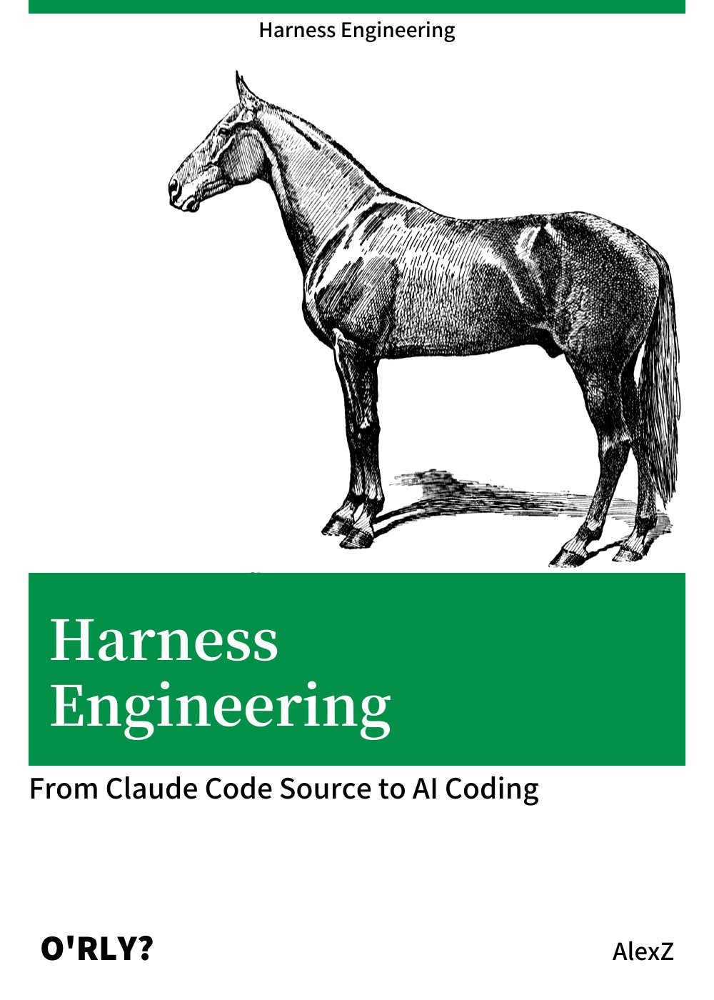
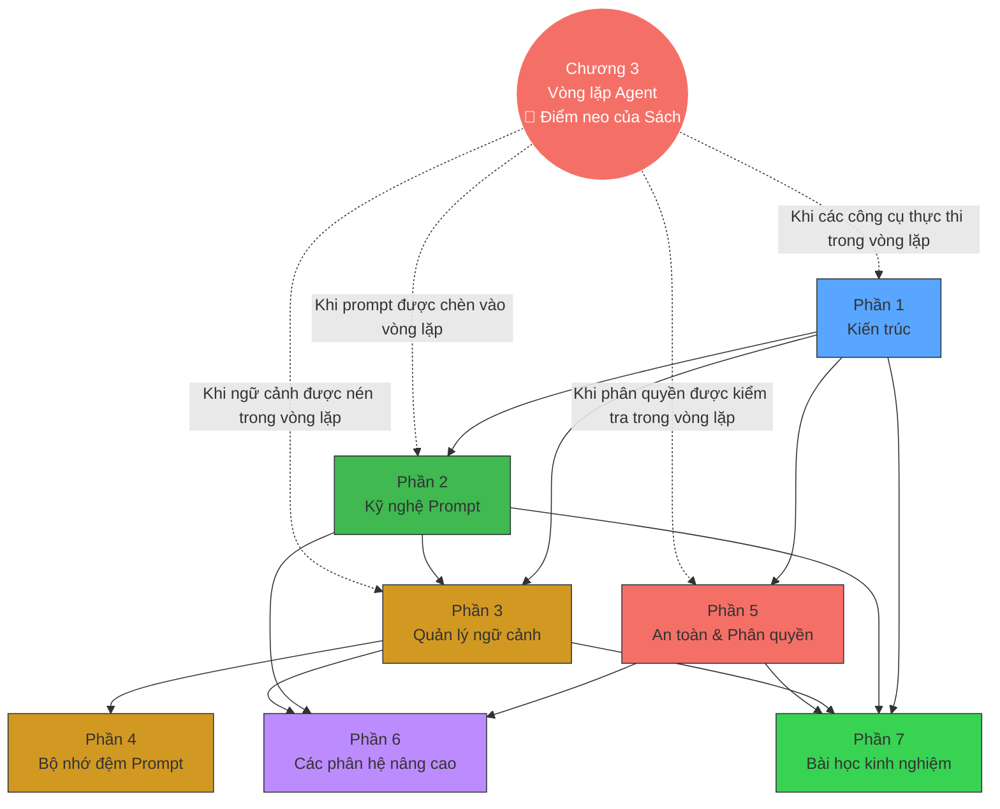

# Lời nói đầu (Preface)

  

  <a href="../">Read the Chinese edition</a>

*Harness Engineering* — thường được gọi một cách thân mật trong tiếng Trung là "Sách Con Ngựa" (vì tiêu đề tiếng Trung phát âm giống như "dây cương" hay bộ yên ngựa).

Tôi tin rằng cách tốt nhất để "tiêu thụ" mã nguồn của Claude Code là chuyển đổi nó thành một cuốn sách để học tập một cách có hệ thống. Đối với tôi, việc học từ một cuốn sách thoải mái hơn nhiều so với việc đọc mã nguồn thô, và nó giúp dễ dàng hình thành một khung nhận thức (cognitive framework) hoàn chỉnh hơn.

Vì vậy, tôi đã nhờ Claude Code trích xuất một cuốn sách từ mã nguồn TypeScript bị rò rỉ. Cuốn sách hiện đang được mã nguồn mở và mọi người có thể đọc trực tuyến:

- Kho lưu trữ (Repository): <https://github.com/ZhangHanDong/harness-engineering-from-cc-to-ai-coding>
- Đọc trực tuyến (Read online): <https://zhanghandong.github.io/harness-engineering-from-cc-to-ai-coding/>

Nếu bạn muốn vừa đọc sách vừa hiểu một cách trực quan hơn về cơ chế bên trong của Claude Code, việc kết hợp cuốn sách này với trang web trực quan hóa sau đây là điều rất được khuyến khích:

- Trang web trực quan hóa: <https://ccunpacked.dev>

Để đảm bảo chất lượng viết tốt nhất từ AI, quá trình trích xuất không đơn giản là "ném mã nguồn cho mô hình rồi để nó tự tạo". Thay vào đó, nó tuân theo một quy trình kỹ thuật (engineering workflow) khá nghiêm ngặt:

1. Đầu tiên, thảo luận và làm rõ file `DESIGN.md` dựa trên mã nguồn — nghĩa là thiết lập đề cương và thiết kế của toàn bộ cuốn sách.
2. Sau đó, viết các tài liệu đặc tả (specs) cho từng chương, sử dụng công cụ mã nguồn mở `agent-spec` của tôi để ràng buộc các mục tiêu, ranh giới và tiêu chí nghiệm thu của chương.
3. Tiếp theo, tạo một kế hoạch (plan), chia nhỏ các bước thực hiện cụ thể.
4. Cuối cùng, lồng ghép kỹ năng viết kỹ thuật (technical writing) của riêng tôi trước khi cho phép AI bắt đầu viết chính thức.

Cuốn sách này không nhằm mục đích xuất bản — nó được viết ra để giúp tôi học Claude Code một cách hệ thống hơn. Đánh giá cơ bản của tôi là: AI chắc chắn sẽ không viết ra một cuốn sách hoàn hảo, nhưng chỉ cần phiên bản đầu tiên được mã nguồn mở, mọi người đều có thể đọc, thảo luận và dần dần cải thiện nó cùng nhau, đồng xây dựng nó thành một cuốn sách thuộc phạm vi công cộng (public-domain) thực sự có giá trị.

Nói như vậy nhưng khách quan mà nói, phiên bản ban đầu này đã được viết khá tốt. Mọi đóng góp và thảo luận đều được chào đón. Thay vì tạo một nhóm thảo luận riêng, tất cả các cuộc hội thoại liên quan đều được tổ chức trên GitHub Discussions:

- Thảo luận (Discussions): <https://github.com/ZhangHanDong/harness-engineering-from-cc-to-ai-coding/discussions>

---

## Chuẩn bị đọc (Reading Preparation)

### Điều kiện tiên quyết (Prerequisites)

Cuốn sách này giả định người đọc có những kiến thức cơ bản sau — bạn không cần phải là một chuyên gia, chỉ cần có thể đọc và hiểu:

- **TypeScript / JavaScript**: Tất cả mã nguồn trong cuốn sách là TypeScript. Bạn cần hiểu `async/await`, định nghĩa giao diện (interface), kiểu generic (generics) và các cú pháp cơ bản khác, nhưng bạn không cần phải tự viết nó.
- **Khái niệm phát triển CLI (CLI development concepts)**: Tiến trình (processes), biến môi trường (environment variables), luồng nhập/xuất chuẩn (stdin/stdout), giao tiếp tiến trình con (subprocess communication). Nếu bạn đã từng sử dụng các công cụ dòng lệnh (terminal tools) như git, npm, cargo, các khái niệm này đã rất quen thuộc với bạn.
- **Khái niệm cơ bản về API LLM (LLM API basics)**: Hiểu biết về API tin nhắn (messages API) (vai trò của system/user/assistant), sử dụng công cụ (tool_use / function calling), truyền dữ liệu dạng luồng (streaming / streamed responses). Nếu bạn đã từng gọi bất kỳ API LLM nào, như vậy là đủ.

Không bắt buộc: Kinh nghiệm về React / Ink, kiến thức về Bun runtime, kinh nghiệm sử dụng Claude Code.

### Lộ trình đọc khuyến nghị (Recommended Reading Paths)

30 chương của cuốn sách được tổ chức thành 7 phần, nhưng bạn không nhất thiết phải đọc từ đầu đến cuối. Dưới đây là ba lộ trình dành cho độc giả có các mục tiêu khác nhau:

**Lộ trình A: Nhà phát triển Agent (Agent Builders)** (nếu bạn muốn xây dựng AI Agent của riêng mình)

> Chương 1 (Tech Stack) → Chương 3 (Agent Loop) → Chương 5 (System Prompt) → Chương 9 (Auto Compaction) → Chương 20 (Agent Spawning) → Chương 25-27 (Pattern Extraction) → Chương 30 (Hands-on)

Lộ trình này bao gồm từ kiến trúc đến vòng lặp, từ prompt đến quản lý ngữ cảnh (context management), đa tác nhân (multi-agent), và kết thúc ở Chương 30 nơi bạn xây dựng một Agent duyệt mã (code review Agent) hoàn chỉnh bằng Rust.

**Lộ trình B: Kỹ sư bảo mật (Security Engineers)** (nếu bạn quan tâm đến ranh giới bảo mật của AI Agent)

> Chương 16 (Permission System) → Chương 17 (YOLO Classifier) → Chương 18 (Hooks) → Chương 19 (CLAUDE.md) → Chương 4 (Tool Orchestration) → Chương 25 (Fail-Closed Principle)

Lộ trình này tập trung vào phòng thủ theo chiều sâu (defense in depth) — từ các mô hình phân quyền (permission models) đến phân loại tự động (automatic classification) cho đến các điểm chặn của người dùng (user interception points), giúp hiểu cách Claude Code cân bằng giữa tính tự chủ và tính an toàn.

**Lộ trình C: Tối ưu hóa hiệu năng (Performance Optimization)** (nếu bạn quan tâm đến chi phí và độ trễ của ứng dụng LLM)

> Chương 9 (Auto Compaction) → Chương 11 (Micro Compaction) → Chương 12 (Token Budget) → Chương 13 (Cache Architecture) → Chương 14 (Cache Break Detection) → Chương 15 (Cache Optimization) → Chương 21 (Effort/Thinking)

Lộ trình này bao quát từ quản lý ngữ cảnh đến bộ nhớ đệm prompt (prompt caching) cho đến kiểm soát lập luận (reasoning control), giúp hiểu cách Claude Code giảm tới 90% chi phí API.

> **Về việc đánh số chương**: Một số chương có hậu tố chữ cái (ví dụ: ch06b, ch20b, ch20c, ch22b) — đây là các phần mở rộng chuyên sâu của các chương chính. Ví dụ, ch20b (Teams) và ch20c (Ultraplan) là các phần đi sâu phân tích của ch20 (Agent Spawning).

### Bản đồ kiến thức của sách (Book Knowledge Map)

Chương 3 (Vòng lặp Agent) là điểm neo của cuốn sách — nó định nghĩa toàn bộ chu kỳ từ đầu vào của người dùng đến phản hồi của mô hình. Các phần khác phân tích cơ chế chuyên sâu của một giai đoạn cụ thể trong chu kỳ đó.

### Ký hiệu khi đọc (Reading Notation)

Cuốn sách này sử dụng các quy ước sau:

- **Tham chiếu nguồn (Source references)**: Định dạng là `restored-src/src/path/file.ts:line`, trỏ đến mã nguồn được khôi phục của Claude Code v2.1.88.
- **Mức độ bằng chứng (Evidence levels)**:
  - "Bằng chứng nguồn v2.1.88" (v2.1.88 source evidence) — có mã nguồn hoàn chỉnh và tham chiếu số dòng, độ tin cậy cao nhất
  - "Kỹ thuật đảo ngược bundle v2.1.91/v2.1.92" (v2.1.91/v2.1.92 bundle reverse engineering) — được suy luận từ các tín hiệu chuỗi trong bundle; Anthropic đã loại bỏ source map bắt đầu từ v2.1.89
  - "Suy luận" (Inference) — suy đoán chỉ từ tên sự kiện hoặc tên biến, không có bằng chứng nguồn trực tiếp
- **Sơ đồ Mermaid (Mermaid diagrams)**: Biểu đồ luồng và sơ đồ kiến trúc sử dụng cú pháp Mermaid, được hiển thị tự động khi đọc trực tuyến.
- **Trực quan hóa tương tác (Interactive visualizations)**: Một số chương cung cấp liên kết hoạt ảnh tương tác D3.js (được đánh dấu là "nhấp để xem"), cần được mở trong trình duyệt. Mỗi hoạt ảnh cũng có một sơ đồ Mermaid tĩnh đi kèm làm dự phòng.
